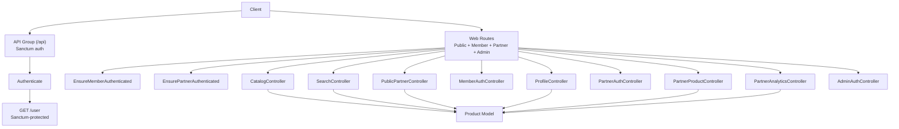
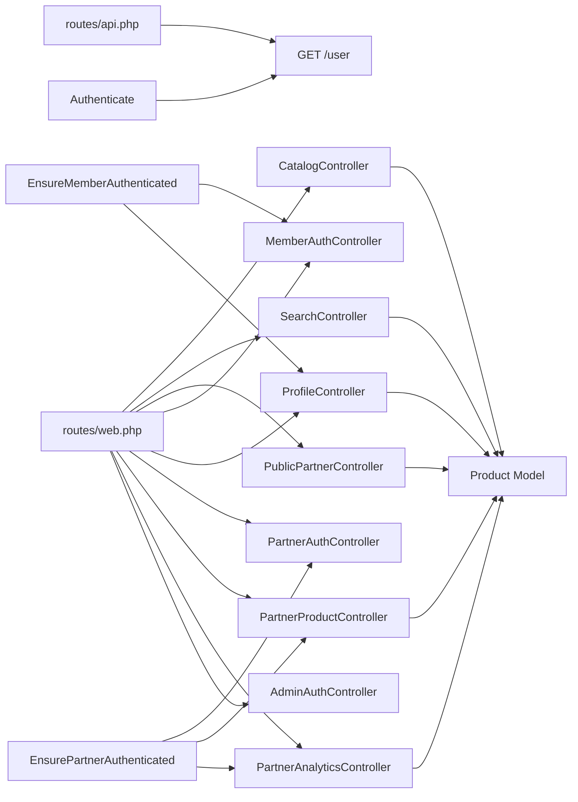

# API Documentation

<cite>
**Referenced Files in This Document**
- [routes/api.php](file://routes/api.php)
- [routes/web.php](file://routes/web.php)
- [config/sanctum.php](file://config/sanctum.php)
- [app/Http/Middleware/Authenticate.php](file://app/Http/Middleware/Authenticate.php)
- [app/Http/Middleware/EnsureMemberAuthenticated.php](file://app/Http/Middleware/EnsureMemberAuthenticated.php)
- [app/Http/Middleware/EnsurePartnerAuthenticated.php](file://app/Http/Middleware/EnsurePartnerAuthenticated.php)
- [app/Http/Controllers/CatalogController.php](file://app/Http/Controllers/CatalogController.php)
- [app/Http/Controllers/SearchController.php](file://app/Http/Controllers/SearchController.php)
- [app/Http/Controllers/PublicPartnerController.php](file://app/Http/Controllers/PublicPartnerController.php)
- [app/Http/Controllers/Member/MemberAuthController.php](file://app/Http/Controllers/Member/MemberAuthController.php)
- [app/Http/Controllers/Member/ProfileController.php](file://app/Http/Controllers/Member/ProfileController.php)
- [app/Http/Controllers/Partner/PartnerAuthController.php](file://app/Http/Controllers/Partner/PartnerAuthController.php)
- [app/Http/Controllers/Partner/PartnerProductController.php](file://app/Http/Controllers/Partner/PartnerProductController.php)
- [app/Http/Controllers/Partner/PartnerAnalyticsController.php](file://app/Http/Controllers/Partner/PartnerAnalyticsController.php)
- [app/Http/Controllers/AdminAuthController.php](file://app/Http/Controllers/AdminAuthController.php)
- [app/Models/Product.php](file://app/Models/Product.php)
- [config/catalog.php](file://config/catalog.php)
</cite>

## Table of Contents
1. [Introduction](#introduction)
2. [Project Structure](#project-structure)
3. [Core Components](#core-components)
4. [Architecture Overview](#architecture-overview)
5. [Detailed Component Analysis](#detailed-component-analysis)
6. [Dependency Analysis](#dependency-analysis)
7. [Performance Considerations](#performance-considerations)
8. [Troubleshooting Guide](#troubleshooting-guide)
9. [Conclusion](#conclusion)
10. [Appendices](#appendices)

## Introduction
This document describes the RESTful API surface of KatalogThrift, focusing on HTTP methods, URL patterns, request/response characteristics, authentication, validation, error handling, and security. It covers product catalog endpoints, user management for members, partner integration points, and analytics dashboards. The backend primarily exposes HTML views via web routes; however, the repository also defines a Sanctum-protected user endpoint under the API routes group. Authentication relies on Sanctum tokens for stateful requests and guard-specific login flows for members and partners. Rate limiting, CORS, and CSRF protections are configured via standard Laravel mechanisms.

## Project Structure
KatalogThrift organizes routing into two primary groups:
- API routes: A single Sanctum-protected endpoint for retrieving the authenticated user.
- Web routes: A comprehensive set of routes for public pages, member actions, partner operations, admin management, and search.

```mermaid
graph TB
subgraph "Routes"
R_API["routes/api.php<br/>Defines API group and Sanctum-protected /user"]
R_WEB["routes/web.php<br/>Defines public, member, partner, admin routes"]
end
subgraph "Middleware"
M_AUTH["Authenticate<br/>Redirects unauthenticated requests"]
M_MEMBER["EnsureMemberAuthenticated<br/>Member guard checks"]
M_PARTNER["EnsurePartnerAuthenticated<br/>Partner guard checks"]
end
subgraph "Controllers"
C_CATALOG["CatalogController<br/>Public catalog, product detail, lookbook, about"]
C_SEARCH["SearchController<br/>Search index and AJAX suggestions"]
C_PUBLIC_PARTNER["PublicPartnerController<br/>Public partner listing and registration"]
C_MEMBER_AUTH["MemberAuthController<br/>Member login/register/logout/reset"]
C_MEMBER_PROFILE["ProfileController<br/>Member profile edit/update"]
C_PARTNER_AUTH["PartnerAuthController<br/>Partner login/logout"]
C_PARTNER_PRODUCTS["PartnerProductController<br/>CRUD + variants + bulk operations"]
C_PARTNER_ANALYTICS["PartnerAnalyticsController<br/>Analytics dashboard"]
C_ADMIN_AUTH["AdminAuthController<br/>Admin login/logout"]
end
R_API --> M_AUTH
R_WEB --> M_MEMBER
R_WEB --> M_PARTNER
R_WEB --> C_CATALOG
R_WEB --> C_SEARCH
R_WEB --> C_PUBLIC_PARTNER
R_WEB --> C_MEMBER_AUTH
R_WEB --> C_MEMBER_PROFILE
R_WEB --> C_PARTNER_AUTH
R_WEB --> C_PARTNER_PRODUCTS
R_WEB --> C_PARTNER_ANALYTICS
R_WEB --> C_ADMIN_AUTH
```

**Diagram sources**
- [routes/api.php:17-19](file://routes/api.php#L17-L19)
- [routes/web.php:44-240](file://routes/web.php#L44-L240)
- [app/Http/Middleware/Authenticate.php:8-17](file://app/Http/Middleware/Authenticate.php#L8-L17)
- [app/Http/Middleware/EnsureMemberAuthenticated.php:9-20](file://app/Http/Middleware/EnsureMemberAuthenticated.php#L9-L20)
- [app/Http/Middleware/EnsurePartnerAuthenticated.php:9-27](file://app/Http/Middleware/EnsurePartnerAuthenticated.php#L9-L27)
- [app/Http/Controllers/CatalogController.php:12-196](file://app/Http/Controllers/CatalogController.php#L12-L196)
- [app/Http/Controllers/SearchController.php:8-55](file://app/Http/Controllers/SearchController.php#L8-L55)
- [app/Http/Controllers/PublicPartnerController.php:16-136](file://app/Http/Controllers/PublicPartnerController.php#L16-L136)
- [app/Http/Controllers/Member/MemberAuthController.php:15-128](file://app/Http/Controllers/Member/MemberAuthController.php#L15-L128)
- [app/Http/Controllers/Member/ProfileController.php:9-32](file://app/Http/Controllers/Member/ProfileController.php#L9-L32)
- [app/Http/Controllers/Partner/PartnerAuthController.php:11-59](file://app/Http/Controllers/Partner/PartnerAuthController.php#L11-L59)
- [app/Http/Controllers/Partner/PartnerProductController.php:14-336](file://app/Http/Controllers/Partner/PartnerProductController.php#L14-L336)
- [app/Http/Controllers/Partner/PartnerAnalyticsController.php:10-59](file://app/Http/Controllers/Partner/PartnerAnalyticsController.php#L10-L59)
- [app/Http/Controllers/AdminAuthController.php:9-53](file://app/Http/Controllers/AdminAuthController.php#L9-L53)

**Section sources**
- [routes/api.php:1-20](file://routes/api.php#L1-L20)
- [routes/web.php:1-240](file://routes/web.php#L1-L240)

## Core Components
- API routes group: The API group applies Sanctum authentication. Currently, only a GET /user endpoint exists under this group.
- Web routes: The majority of endpoints are defined here, including public catalog, search, member actions, partner operations, admin management, and analytics.
- Authentication:
  - Sanctum: Used for stateful API requests; supports bearer tokens and session-based auth.
  - Member guard: Member login/register/logout and password reset flows.
  - Partner guard: Partner login/logout with approval checks.
  - Admin guard: Username/password-based admin login stored in configuration.
- Request validation: Controllers validate inputs using Laravel’s validator and enforce type/size/format constraints.
- Error handling: Middleware redirects unauthenticated requests; controllers return redirects/back with messages; AJAX endpoints return JSON arrays.

**Section sources**
- [routes/api.php:17-19](file://routes/api.php#L17-L19)
- [routes/web.php:44-240](file://routes/web.php#L44-L240)
- [config/sanctum.php:5-83](file://config/sanctum.php#L5-L83)
- [app/Http/Middleware/Authenticate.php:8-17](file://app/Http/Middleware/Authenticate.php#L8-L17)
- [app/Http/Middleware/EnsureMemberAuthenticated.php:9-20](file://app/Http/Middleware/EnsureMemberAuthenticated.php#L9-L20)
- [app/Http/Middleware/EnsurePartnerAuthenticated.php:9-27](file://app/Http/Middleware/EnsurePartnerAuthenticated.php#L9-L27)
- [app/Http/Controllers/Member/MemberAuthController.php:23-36](file://app/Http/Controllers/Member/MemberAuthController.php#L23-L36)
- [app/Http/Controllers/Partner/PartnerAuthController.php:19-47](file://app/Http/Controllers/Partner/PartnerAuthController.php#L19-L47)
- [app/Http/Controllers/AdminAuthController.php:20-42](file://app/Http/Controllers/AdminAuthController.php#L20-L42)

## Architecture Overview
The system separates concerns across routes, middleware, controllers, and models. Public consumers interact with web routes that render views. Partner and member features are guarded by dedicated middleware. The product model encapsulates attributes and helper methods for SEO and images.

**Diagram sources**
- [routes/api.php:17-19](file://routes/api.php#L17-L19)
- [routes/web.php:44-240](file://routes/web.php#L44-L240)
- [app/Http/Middleware/Authenticate.php:8-17](file://app/Http/Middleware/Authenticate.php#L8-L17)
- [app/Http/Middleware/EnsureMemberAuthenticated.php:9-20](file://app/Http/Middleware/EnsureMemberAuthenticated.php#L9-L20)
- [app/Http/Middleware/EnsurePartnerAuthenticated.php:9-27](file://app/Http/Middleware/EnsurePartnerAuthenticated.php#L9-L27)
- [app/Http/Controllers/CatalogController.php:12-196](file://app/Http/Controllers/CatalogController.php#L12-L196)
- [app/Http/Controllers/SearchController.php:8-55](file://app/Http/Controllers/SearchController.php#L8-L55)
- [app/Http/Controllers/PublicPartnerController.php:16-136](file://app/Http/Controllers/PublicPartnerController.php#L16-L136)
- [app/Http/Controllers/Member/MemberAuthController.php:15-128](file://app/Http/Controllers/Member/MemberAuthController.php#L15-L128)
- [app/Http/Controllers/Member/ProfileController.php:9-32](file://app/Http/Controllers/Member/ProfileController.php#L9-L32)
- [app/Http/Controllers/Partner/PartnerAuthController.php:11-59](file://app/Http/Controllers/Partner/PartnerAuthController.php#L11-L59)
- [app/Http/Controllers/Partner/PartnerProductController.php:14-336](file://app/Http/Controllers/Partner/PartnerProductController.php#L14-L336)
- [app/Http/Controllers/Partner/PartnerAnalyticsController.php:10-59](file://app/Http/Controllers/Partner/PartnerAnalyticsController.php#L10-L59)
- [app/Http/Controllers/AdminAuthController.php:9-53](file://app/Http/Controllers/AdminAuthController.php#L9-L53)
- [app/Models/Product.php:9-131](file://app/Models/Product.php#L9-L131)

## Detailed Component Analysis

### API Endpoints

#### GET /api/user
- Description: Returns the currently authenticated user via Sanctum.
- Authentication: Required. Accepts either session cookie or Bearer token depending on configuration.
- Request: No body.
- Responses:
  - 200 OK: User object.
  - 401 Unauthorized: Not authenticated.
- Notes: This endpoint is defined under the API routes group with Sanctum middleware.

**Section sources**
- [routes/api.php:17-19](file://routes/api.php#L17-L19)
- [config/sanctum.php:36-81](file://config/sanctum.php#L36-L81)

### Product Catalog Endpoints

#### GET /
- Description: Public landing page.
- Authentication: Optional.
- Request: None.
- Responses: HTML view.

#### GET /katalog
- Description: Public product catalog with filters.
- Authentication: Optional.
- Query parameters:
  - category, brand, partner, size, min_price, max_price, availability, new_arrival
- Responses: HTML view with filtered products and counts.

#### GET /produk/{slug}
- Description: Product detail page.
- Authentication: Optional.
- Path parameters:
  - slug: Product slug.
- Responses: HTML view with related and pairing products.

#### GET /lookbook
- Description: Curated lookbook page.
- Authentication: Optional.
- Request: None.
- Responses: HTML view.

#### GET /tentang
- Description: About page with store info.
- Authentication: Optional.
- Request: None.
- Responses: HTML view.

#### GET /cari
- Description: Search results page.
- Authentication: Optional.
- Query parameters:
  - q: Search term.
- Responses: HTML view.

#### GET /cari/ajax
- Description: AJAX search suggestions.
- Authentication: Optional.
- Query parameters:
  - q: Search term (minimum length enforced server-side).
- Responses:
  - 200 OK: JSON array of suggested items with slug, name, brand, price, image.

**Section sources**
- [routes/web.php:44-55](file://routes/web.php#L44-L55)
- [app/Http/Controllers/CatalogController.php:14-196](file://app/Http/Controllers/CatalogController.php#L14-L196)
- [app/Http/Controllers/SearchController.php:10-55](file://app/Http/Controllers/SearchController.php#L10-L55)

### User Management (Members)

#### GET /login
- Description: Member login page.
- Authentication: N/A.
- Request: None.
- Responses: HTML view.

#### POST /login
- Description: Authenticate member.
- Authentication: N/A.
- Form fields:
  - email, password, remember.
- Responses:
  - Redirects to intended route on success.
  - Back with errors on failure.

#### GET /register
- Description: Member registration page.
- Authentication: N/A.
- Request: None.
- Responses: HTML view.

#### POST /register
- Description: Register a new member.
- Authentication: N/A.
- Form fields:
  - name, email, password, password_confirmation.
- Responses:
  - Redirects to catalog on success.
  - Back with validation errors.

#### POST /logout
- Description: Logout current member.
- Authentication: N/A.
- Request: None.
- Responses: Redirects to catalog.

#### GET /lupa-password
- Description: Forgot password page.
- Authentication: N/A.
- Request: None.
- Responses: HTML view.

#### POST /lupa-password
- Description: Send password reset link.
- Authentication: N/A.
- Form fields:
  - email.
- Responses:
  - Back with reset link placeholder (development mode).
  - Back with errors if email does not exist.

#### GET /reset-password/{token}
- Description: Reset password form.
- Authentication: N/A.
- Path parameters:
  - token: Reset token.
- Responses: HTML view.

#### POST /reset-password
- Description: Submit new password.
- Authentication: N/A.
- Form fields:
  - token, email, password, password_confirmation.
- Responses:
  - Redirects to login with success message.
  - Back with errors if token invalid.

#### GET /profil
- Description: Member profile edit page.
- Authentication: Required (member.guard).
- Request: None.
- Responses: HTML view.

#### PUT /profil
- Description: Update member profile.
- Authentication: Required (member.guard).
- Form fields:
  - name (required), phone (nullable), bio (nullable).
- Responses:
  - Back with success message.

**Section sources**
- [routes/web.php:75-116](file://routes/web.php#L75-L116)
- [app/Http/Middleware/EnsureMemberAuthenticated.php:9-20](file://app/Http/Middleware/EnsureMemberAuthenticated.php#L9-L20)
- [app/Http/Controllers/Member/MemberAuthController.php:17-128](file://app/Http/Controllers/Member/MemberAuthController.php#L17-L128)
- [app/Http/Controllers/Member/ProfileController.php:11-32](file://app/Http/Controllers/Member/ProfileController.php#L11-L32)

### Partner Integration Endpoints

#### GET /mitra/login
- Description: Partner login page.
- Authentication: N/A.
- Request: None.
- Responses: HTML view.

#### POST /mitra/login
- Description: Authenticate partner.
- Authentication: N/A.
- Form fields:
  - email, password, remember.
- Responses:
  - Redirects to dashboard on success.
  - Back with errors if account not partner or not approved.

#### POST /mitra/logout
- Description: Logout current partner.
- Authentication: N/A.
- Request: None.
- Responses: Redirects to partner login.

#### GET /mitra/dashboard
- Description: Partner dashboard.
- Authentication: Required (partner.guard).
- Request: None.
- Responses: HTML view.

#### GET /mitra/produk
- Description: List partner’s products.
- Authentication: Required (partner.guard).
- Request: None.
- Responses: HTML view.

#### GET /mitra/produk/tambah
- Description: Create product page.
- Authentication: Required (partner.guard).
- Request: None.
- Responses: HTML view.

#### POST /mitra/produk
- Description: Create a new product.
- Authentication: Required (partner.guard).
- Form fields:
  - name, brand, product_type, color, color_hex, style_type, price, size, condition, description, story, image_file, image, shopee_url, tokopedia_url, is_active, is_new_arrival, has_size_chart, size_chart, size_unit, has_variants, variants[*], meta_title, meta_description, meta_keywords.
- Responses:
  - Redirects to products index with success message.

#### GET /mitra/produk/{product}/edit
- Description: Edit product page.
- Authentication: Required (partner.guard).
- Path parameters:
  - product: Product ID.
- Responses: HTML view.

#### PUT /mitra/produk/{product}
- Description: Update product.
- Authentication: Required (partner.guard).
- Path parameters:
  - product: Product ID.
- Form fields:
  - Same as creation with optional overrides.
- Responses:
  - Redirects to products index with success message.

#### DELETE /mitra/produk/{product}
- Description: Delete product.
- Authentication: Required (partner.guard).
- Path parameters:
  - product: Product ID.
- Responses:
  - Redirects to products index with success message.

#### POST /mitra/produk/bulk-update
- Description: Bulk update products.
- Authentication: Required (partner.guard).
- Request: Form-encoded updates.
- Responses:
  - Redirects to products index with success message.

#### POST /mitra/produk/bulk-delete
- Description: Bulk delete products.
- Authentication: Required (partner.guard).
- Request: Form-encoded product IDs.
- Responses:
  - Redirects to products index with success message.

#### POST /mitra/produk/export
- Description: Export products.
- Authentication: Required (partner.guard).
- Request: None.
- Responses:
  - Redirects to products index with success message.

#### POST /mitra/produk/{product}/variants
- Description: Save product variants.
- Authentication: Required (partner.guard).
- Path parameters:
  - product: Product ID.
- Form fields:
  - variants (array of size, price, condition, stock).
- Responses:
  - Back with success message.

#### DELETE /mitra/produk/{product}/variants/{variant}
- Description: Delete a variant.
- Authentication: Required (partner.guard).
- Path parameters:
  - product: Product ID.
  - variant: Variant ID.
- Responses:
  - Back with success message.

#### GET /mitra/profil
- Description: Partner profile edit page.
- Authentication: Required (partner.guard).
- Request: None.
- Responses: HTML view.

#### PUT /mitra/profil
- Description: Update partner profile.
- Authentication: Required (partner.guard).
- Request: Form fields similar to registration form.
- Responses:
  - Redirects to profile with success message.

#### GET /mitra/outfit
- Description: List partner’s curated outfits.
- Authentication: Required (partner.guard).
- Request: None.
- Responses: HTML view.

#### GET /mitra/outfit/buat
- Description: Create outfit page.
- Authentication: Required (partner.guard).
- Request: None.
- Responses: HTML view.

#### POST /mitra/outfit
- Description: Create a new outfit.
- Authentication: Required (partner.guard).
- Request: Outfit data.
- Responses:
  - Redirects to outfits index with success message.

#### DELETE /mitra/outfit/{outfit}
- Description: Delete an outfit.
- Authentication: Required (partner.guard).
- Path parameters:
  - outfit: Outfit ID.
- Responses:
  - Redirects to outfits index with success message.

#### GET /mitra/analitik
- Description: Partner analytics dashboard.
- Authentication: Required (partner.guard).
- Request: None.
- Responses: HTML view.

#### GET /mitra/analitik/data
- Description: Analytics data endpoint.
- Authentication: Required (partner.guard).
- Request: None.
- Responses: HTML view.

#### GET /mitra/pertanyaan
- Description: View questions from members.
- Authentication: Required (partner.guard).
- Request: None.
- Responses: HTML view.

#### PUT /mitra/pertanyaan/{question}/jawab
- Description: Answer a question.
- Authentication: Required (partner.guard).
- Path parameters:
  - question: Question ID.
- Request: Answer text.
- Responses:
  - Redirects to questions index with success message.

#### GET /mitra/notifikasi
- Description: Partner notifications.
- Authentication: Required (partner.guard).
- Request: None.
- Responses: HTML view.

#### POST /mitra/notifikasi/{id}/read
- Description: Mark notification as read.
- Authentication: Required (partner.guard).
- Path parameters:
  - id: Notification ID.
- Request: None.
- Responses:
  - Redirects to notifications index with success message.

#### POST /mitra/notifikasi/read-all
- Description: Mark all notifications as read.
- Authentication: Required (partner.guard).
- Request: None.
- Responses:
  - Redirects to notifications index with success message.

**Section sources**
- [routes/web.php:118-167](file://routes/web.php#L118-L167)
- [app/Http/Middleware/EnsurePartnerAuthenticated.php:9-27](file://app/Http/Middleware/EnsurePartnerAuthenticated.php#L9-L27)
- [app/Http/Controllers/Partner/PartnerAuthController.php:13-59](file://app/Http/Controllers/Partner/PartnerAuthController.php#L13-L59)
- [app/Http/Controllers/Partner/PartnerProductController.php:21-336](file://app/Http/Controllers/Partner/PartnerProductController.php#L21-L336)
- [app/Http/Controllers/Partner/PartnerAnalyticsController.php:17-59](file://app/Http/Controllers/Partner/PartnerAnalyticsController.php#L17-L59)

### Public Partner Pages

#### GET /toko
- Description: Public partner listing.
- Authentication: Optional.
- Request: None.
- Responses: HTML view.

#### GET /toko/{slug}
- Description: Public partner profile page.
- Authentication: Optional.
- Path parameters:
  - slug: Partner store slug.
- Responses: HTML view.

#### GET /daftar-mitra
- Description: Partner registration form.
- Authentication: Optional.
- Request: None.
- Responses: HTML view.

#### POST /daftar-mitra
- Description: Submit partner registration.
- Authentication: Optional.
- Form fields:
  - store_name, owner_name, email, password, password_confirmation, whatsapp, description, location, shopee_url, tokopedia_url, instagram_url.
- Responses:
  - Redirects to success page.

#### GET /daftar-mitra/sukses
- Description: Registration success page.
- Authentication: Optional.
- Request: None.
- Responses: HTML view.

**Section sources**
- [routes/web.php:68-74](file://routes/web.php#L68-L74)
- [app/Http/Controllers/PublicPartnerController.php:18-136](file://app/Http/Controllers/PublicPartnerController.php#L18-L136)

### Admin Management Endpoints

#### GET /admin/login
- Description: Admin login page.
- Authentication: N/A.
- Request: None.
- Responses: HTML view.

#### POST /admin/login
- Description: Authenticate admin.
- Authentication: N/A.
- Form fields:
  - username, password.
- Responses:
  - Redirects to dashboard on success.
  - Back with errors on failure.

#### POST /admin/logout
- Description: Logout admin.
- Authentication: N/A.
- Request: None.
- Responses: Redirects to admin login.

#### GET /admin
- Description: Admin dashboard.
- Authentication: Required (admin guard).
- Request: None.
- Responses: HTML view.

#### GET /admin/mitra
- Description: Manage partners (list).
- Authentication: Required (admin guard).
- Request: None.
- Responses: HTML view.

#### PUT /admin/mitra/{partner}/approve
- Description: Approve a partner.
- Authentication: Required (admin guard).
- Path parameters:
  - partner: Partner ID.
- Request: None.
- Responses:
  - Redirects to partners index with success message.

#### PUT /admin/mitra/{partner}/reject
- Description: Reject a partner.
- Authentication: Required (admin guard).
- Path parameters:
  - partner: Partner ID.
- Request: None.
- Responses:
  - Redirects to partners index with success message.

#### PUT /admin/mitra/{partner}/suspend
- Description: Suspend a partner.
- Authentication: Required (admin guard).
- Path parameters:
  - partner: Partner ID.
- Request: None.
- Responses:
  - Redirects to partners index with success message.

#### PUT /admin/mitra/{partner}/verified
- Description: Toggle verified badge for a partner.
- Authentication: Required (admin guard).
- Path parameters:
  - partner: Partner ID.
- Request: None.
- Responses:
  - Redirects to partners index with success message.

#### GET /admin/produk
- Description: Manage products (list).
- Authentication: Required (admin guard).
- Request: None.
- Responses: HTML view.

#### PUT /admin/produk/{product}/suspend
- Description: Suspend a product.
- Authentication: Required (admin guard).
- Path parameters:
  - product: Product ID.
- Request: None.
- Responses:
  - Redirects to products index with success message.

#### DELETE /admin/produk/{product}
- Description: Delete a product.
- Authentication: Required (admin guard).
- Path parameters:
  - product: Product ID.
- Request: None.
- Responses:
  - Redirects to products index with success message.

#### GET /admin/review
- Description: Manage reviews (list).
- Authentication: Required (admin guard).
- Request: None.
- Responses: HTML view.

#### PUT /admin/review/{review}/approve
- Description: Approve a review.
- Authentication: Required (admin guard).
- Path parameters:
  - review: Review ID.
- Request: None.
- Responses:
  - Redirects to reviews index with success message.

#### PUT /admin/review/{review}/hide
- Description: Hide a review.
- Authentication: Required (admin guard).
- Path parameters:
  - review: Review ID.
- Request: None.
- Responses:
  - Redirects to reviews index with success message.

#### DELETE /admin/review/{review}
- Description: Delete a review.
- Authentication: Required (admin guard).
- Path parameters:
  - review: Review ID.
- Request: None.
- Responses:
  - Redirects to reviews index with success message.

#### GET /admin/laporan
- Description: Manage reports (list).
- Authentication: Required (admin guard).
- Request: None.
- Responses: HTML view.

#### PUT /admin/laporan/{report}/resolve
- Description: Resolve a report.
- Authentication: Required (admin guard).
- Path parameters:
  - report: Report ID.
- Request: None.
- Responses:
  - Redirects to reports index with success message.

#### PUT /admin/laporan/{report}/ignore
- Description: Ignore a report.
- Authentication: Required (admin guard).
- Path parameters:
  - report: Report ID.
- Request: None.
- Responses:
  - Redirects to reports index with success message.

#### GET /admin/outfit
- Description: Manage curated outfits (list).
- Authentication: Required (admin guard).
- Request: None.
- Responses: HTML view.

#### GET /admin/outfit/buat
- Description: Create outfit page.
- Authentication: Required (admin guard).
- Request: None.
- Responses: HTML view.

#### POST /admin/outfit
- Description: Create a curated outfit.
- Authentication: Required (admin guard).
- Request: Outfit data.
- Responses:
  - Redirects to outfits index with success message.

#### GET /admin/outfit/{outfit}/edit
- Description: Edit outfit page.
- Authentication: Required (admin guard).
- Path parameters:
  - outfit: Outfit ID.
- Request: None.
- Responses: HTML view.

#### PUT /admin/outfit/{outfit}
- Description: Update a curated outfit.
- Authentication: Required (admin guard).
- Path parameters:
  - outfit: Outfit ID.
- Request: Outfit data.
- Responses:
  - Redirects to outfits index with success message.

#### DELETE /admin/outfit/{outfit}
- Description: Delete a curated outfit.
- Authentication: Required (admin guard).
- Path parameters:
  - outfit: Outfit ID.
- Request: None.
- Responses:
  - Redirects to outfits index with success message.

#### PUT /admin/outfit/{outfit}/toggle
- Description: Toggle active status of an outfit.
- Authentication: Required (admin guard).
- Path parameters:
  - outfit: Outfit ID.
- Request: None.
- Responses:
  - Redirects to outfits index with success message.

#### GET /admin/artikel
- Description: Manage articles (list).
- Authentication: Required (admin guard).
- Request: None.
- Responses: HTML view.

#### GET /admin/artikel/tambah
- Description: Create article page.
- Authentication: Required (admin guard).
- Request: None.
- Responses: HTML view.

#### POST /admin/artikel
- Description: Create an article.
- Authentication: Required (admin guard).
- Request: Article data.
- Responses:
  - Redirects to articles index with success message.

#### GET /admin/artikel/{article}/edit
- Description: Edit article page.
- Authentication: Required (admin guard).
- Path parameters:
  - article: Article ID.
- Request: None.
- Responses: HTML view.

#### PUT /admin/artikel/{article}
- Description: Update an article.
- Authentication: Required (admin guard).
- Path parameters:
  - article: Article ID.
- Request: Article data.
- Responses:
  - Redirects to articles index with success message.

#### DELETE /admin/artikel/{article}
- Description: Delete an article.
- Authentication: Required (admin guard).
- Path parameters:
  - article: Article ID.
- Request: None.
- Responses:
  - Redirects to articles index with success message.

#### GET /admin/ugc
- Description: Manage UGC photos (list).
- Authentication: Required (admin guard).
- Request: None.
- Responses: HTML view.

#### PUT /admin/ugc/{ugcPhoto}/approve
- Description: Approve a UGC photo.
- Authentication: Required (admin guard).
- Path parameters:
  - ugcPhoto: UGC Photo ID.
- Request: None.
- Responses:
  - Redirects to UGC index with success message.

#### PUT /admin/ugc/{ugcPhoto}/reject
- Description: Reject a UGC photo.
- Authentication: Required (admin guard).
- Path parameters:
  - ugcPhoto: UGC Photo ID.
- Request: None.
- Responses:
  - Redirects to UGC index with success message.

#### PUT /admin/ugc/{ugcPhoto}/featured
- Description: Toggle featured status of a UGC photo.
- Authentication: Required (admin guard).
- Path parameters:
  - ugcPhoto: UGC Photo ID.
- Request: None.
- Responses:
  - Redirects to UGC index with success message.

#### DELETE /admin/ugc/{ugcPhoto}
- Description: Delete a UGC photo.
- Authentication: Required (admin guard).
- Path parameters:
  - ugcPhoto: UGC Photo ID.
- Request: None.
- Responses:
  - Redirects to UGC index with success message.

#### GET /admin/notifikasi
- Description: Admin notifications.
- Authentication: Required (admin guard).
- Request: None.
- Responses: HTML view.

#### POST /admin/notifikasi/{id}/read
- Description: Mark notification as read.
- Authentication: Required (admin guard).
- Path parameters:
  - id: Notification ID.
- Request: None.
- Responses:
  - Redirects to notifications index with success message.

#### POST /admin/notifikasi/read-all
- Description: Mark all notifications as read.
- Authentication: Required (admin guard).
- Request: None.
- Responses:
  - Redirects to notifications index with success message.

#### GET /admin/badges
- Description: Manage badges (list).
- Authentication: Required (admin guard).
- Request: None.
- Responses: HTML view.

#### POST /admin/badges
- Description: Create a badge.
- Authentication: Required (admin guard).
- Request: Badge data.
- Responses:
  - Redirects to badges index with success message.

#### POST /admin/badges/assign
- Description: Assign a badge to a user.
- Authentication: Required (admin guard).
- Request: Assignment data.
- Responses:
  - Redirects to badges index with success message.

#### DELETE /admin/badges/{badge}
- Description: Delete a badge.
- Authentication: Required (admin guard).
- Path parameters:
  - badge: Badge ID.
- Request: None.
- Responses:
  - Redirects to badges index with success message.

#### GET /admin/analitik
- Description: System analytics.
- Authentication: Required (admin guard).
- Request: None.
- Responses: HTML view.

**Section sources**
- [routes/web.php:169-240](file://routes/web.php#L169-L240)
- [app/Http/Controllers/AdminAuthController.php:11-53](file://app/Http/Controllers/AdminAuthController.php#L11-L53)

### Data Models and Attributes

#### Product Model
- Fillable attributes include identifiers, metadata, pricing, sizing, SEO fields, flags, and counters.
- Casts:
  - Boolean flags for active/sold/new arrival/variants.
  - Array casting for lookbook pairings and size charts.
- Helpers:
  - Image URL resolution (storage URL or external URL).
  - SEO helpers for title/description fallbacks.
  - Search scope supporting MySQL MATCH/BOOLEAN or LIKE fallback.
  - View recording method.

**Section sources**
- [app/Models/Product.php:13-34](file://app/Models/Product.php#L13-L34)
- [app/Models/Product.php:96-131](file://app/Models/Product.php#L96-L131)

### Configuration and Catalog Defaults
- Store branding, social links, product types, size chart templates, and default products are configured centrally.
- Product types define labels, emojis, and pairing recommendations used across catalog and product forms.

**Section sources**
- [config/catalog.php:3-141](file://config/catalog.php#L3-L141)

## Dependency Analysis
- Routes depend on controllers and middleware.
- Controllers depend on models and configuration.
- Middleware enforces authentication per guard.
- Product model centralizes SEO and search logic.

**Diagram sources**
- [routes/api.php:17-19](file://routes/api.php#L17-L19)
- [routes/web.php:44-240](file://routes/web.php#L44-L240)
- [app/Http/Middleware/Authenticate.php:8-17](file://app/Http/Middleware/Authenticate.php#L8-L17)
- [app/Http/Middleware/EnsureMemberAuthenticated.php:9-20](file://app/Http/Middleware/EnsureMemberAuthenticated.php#L9-L20)
- [app/Http/Middleware/EnsurePartnerAuthenticated.php:9-27](file://app/Http/Middleware/EnsurePartnerAuthenticated.php#L9-L27)
- [app/Http/Controllers/CatalogController.php:12-196](file://app/Http/Controllers/CatalogController.php#L12-L196)
- [app/Http/Controllers/SearchController.php:8-55](file://app/Http/Controllers/SearchController.php#L8-L55)
- [app/Http/Controllers/PublicPartnerController.php:16-136](file://app/Http/Controllers/PublicPartnerController.php#L16-L136)
- [app/Http/Controllers/Member/MemberAuthController.php:15-128](file://app/Http/Controllers/Member/MemberAuthController.php#L15-L128)
- [app/Http/Controllers/Member/ProfileController.php:9-32](file://app/Http/Controllers/Member/ProfileController.php#L9-L32)
- [app/Http/Controllers/Partner/PartnerAuthController.php:11-59](file://app/Http/Controllers/Partner/PartnerAuthController.php#L11-L59)
- [app/Http/Controllers/Partner/PartnerProductController.php:14-336](file://app/Http/Controllers/Partner/PartnerProductController.php#L14-L336)
- [app/Http/Controllers/Partner/PartnerAnalyticsController.php:10-59](file://app/Http/Controllers/Partner/PartnerAnalyticsController.php#L10-L59)
- [app/Http/Controllers/AdminAuthController.php:9-53](file://app/Http/Controllers/AdminAuthController.php#L9-L53)
- [app/Models/Product.php:9-131](file://app/Models/Product.php#L9-L131)

**Section sources**
- [routes/api.php:17-19](file://routes/api.php#L17-L19)
- [routes/web.php:44-240](file://routes/web.php#L44-L240)
- [app/Models/Product.php:9-131](file://app/Models/Product.php#L9-L131)

## Performance Considerations
- Product search leverages MySQL FULLTEXT MATCH when available; otherwise falls back to LIKE queries. Consider indexing and query optimization for large datasets.
- Image URLs are resolved via storage URLs; ensure CDN configuration for production.
- AJAX search limits results to reduce payload size.
- Middleware and controller logic should avoid N+1 queries; eager loading is used in several places (e.g., with partner, reviews, variants).

[No sources needed since this section provides general guidance]

## Troubleshooting Guide
- Authentication failures:
  - API: Ensure Sanctum token or session is valid and domain is stateful.
  - Member: Confirm credentials and session regeneration after login.
  - Partner: Verify account belongs to a partner and is approved.
  - Admin: Confirm username/password against configuration.
- Validation errors:
  - Member registration/login and profile update use strict validation; check field constraints.
  - Partner product creation/update validates images, URLs, booleans, arrays, and nested arrays.
- AJAX search:
  - Minimum query length enforced server-side; ensure client sends sufficient input.

**Section sources**
- [config/sanctum.php:18-22](file://config/sanctum.php#L18-L22)
- [app/Http/Controllers/Member/MemberAuthController.php:25-36](file://app/Http/Controllers/Member/MemberAuthController.php#L25-L36)
- [app/Http/Controllers/Partner/PartnerAuthController.php:21-47](file://app/Http/Controllers/Partner/PartnerAuthController.php#L21-L47)
- [app/Http/Controllers/AdminAuthController.php:22-42](file://app/Http/Controllers/AdminAuthController.php#L22-L42)
- [app/Http/Controllers/Member/ProfileController.php:22-26](file://app/Http/Controllers/Member/ProfileController.php#L22-L26)
- [app/Http/Controllers/Partner/PartnerProductController.php:44-73](file://app/Http/Controllers/Partner/PartnerProductController.php#L44-L73)
- [app/Http/Controllers/SearchController.php:36-38](file://app/Http/Controllers/SearchController.php#L36-L38)

## Conclusion
KatalogThrift exposes a clear separation between public web routes and a minimal API group protected by Sanctum. The majority of functionality is delivered via HTML views with robust middleware for member, partner, and admin contexts. Partner and member endpoints include comprehensive validation and CRUD operations. Product catalog and search endpoints support filtering and AJAX suggestions. Authentication, validation, and model helpers provide a solid foundation for building clients and integrations.

[No sources needed since this section summarizes without analyzing specific files]

## Appendices

### Authentication Methods
- Sanctum tokens: For stateful API requests under the API routes group.
- Member guard: Session-based authentication for member features.
- Partner guard: Session-based authentication for partner features with approval checks.
- Admin guard: Username/password authentication for administrative features.

**Section sources**
- [routes/api.php:17-19](file://routes/api.php#L17-L19)
- [config/sanctum.php:36-81](file://config/sanctum.php#L36-L81)
- [app/Http/Middleware/EnsureMemberAuthenticated.php:9-20](file://app/Http/Middleware/EnsureMemberAuthenticated.php#L9-L20)
- [app/Http/Middleware/EnsurePartnerAuthenticated.php:9-27](file://app/Http/Middleware/EnsurePartnerAuthenticated.php#L9-L27)
- [app/Http/Controllers/AdminAuthController.php:20-42](file://app/Http/Controllers/AdminAuthController.php#L20-L42)

### Request Validation and Error Handling
- Validation rules are defined in controllers using Laravel’s validator.
- Redirects with error bags are returned on validation failures.
- AJAX endpoints return empty arrays or JSON objects with minimal data.

**Section sources**
- [app/Http/Controllers/Member/MemberAuthController.php:46-50](file://app/Http/Controllers/Member/MemberAuthController.php#L46-L50)
- [app/Http/Controllers/Member/ProfileController.php:22-26](file://app/Http/Controllers/Member/ProfileController.php#L22-L26)
- [app/Http/Controllers/Partner/PartnerProductController.php:44-73](file://app/Http/Controllers/Partner/PartnerProductController.php#L44-L73)
- [app/Http/Controllers/SearchController.php:36-38](file://app/Http/Controllers/SearchController.php#L36-L38)

### Response Formatting Standards
- HTML views for web routes.
- JSON for AJAX endpoints (e.g., search suggestions).
- Redirects for form submissions with success/error messages.

**Section sources**
- [app/Http/Controllers/SearchController.php:47-54](file://app/Http/Controllers/SearchController.php#L47-L54)

### Security Considerations
- Sanctum configuration supports stateful domains and middleware stack.
- CSRF protection via VerifyCsrfToken middleware.
- Password reset tokens are hashed and validated before updating passwords.
- Partner guard rejects unauthorized or unapproved accounts.

**Section sources**
- [config/sanctum.php:18-22](file://config/sanctum.php#L18-L22)
- [config/sanctum.php:77-81](file://config/sanctum.php#L77-L81)
- [app/Http/Controllers/Member/MemberAuthController.php:108-118](file://app/Http/Controllers/Member/MemberAuthController.php#L108-L118)
- [app/Http/Controllers/Partner/PartnerAuthController.php:34-43](file://app/Http/Controllers/Partner/PartnerAuthController.php#L34-L43)

### API Versioning, Compatibility, and Deprecation
- No explicit versioning scheme is defined in the repository. Clients should pin to specific route names and expect breaking changes without notice.
- Backward compatibility is not guaranteed; monitor route changes and controller signatures.

[No sources needed since this section provides general guidance]

### Testing Strategies, Debugging Tools, and Optimization
- Testing: Use Laravel’s built-in test harness to assert route behavior, validation, and middleware redirections.
- Debugging: Enable logging and inspect error responses; leverage browser dev tools for AJAX endpoints.
- Optimization: Index product search fields, limit AJAX result sets, and cache static catalog metadata.

[No sources needed since this section provides general guidance]