# Administrative APIs

<cite>
**Referenced Files in This Document**
- [routes/web.php](file://routes/web.php)
- [config/admin.php](file://config/admin.php)
- [app/Http/Middleware/EnsureAdminAuthenticated.php](file://app/Http/Middleware/EnsureAdminAuthenticated.php)
- [app/Http/Controllers/AdminAuthController.php](file://app/Http/Controllers/AdminAuthController.php)
- [app/Http/Controllers/AdminDashboardController.php](file://app/Http/Controllers/AdminDashboardController.php)
- [app/Http/Controllers/AdminPartnerController.php](file://app/Http/Controllers/AdminPartnerController.php)
- [app/Http/Controllers/AdminProductController.php](file://app/Http/Controllers/AdminProductController.php)
- [app/Http/Controllers/AdminReviewController.php](file://app/Http/Controllers/AdminReviewController.php)
- [app/Http/Controllers/AdminReportController.php](file://app/Http/Controllers/AdminReportController.php)
- [app/Http/Controllers/AdminArticleController.php](file://app/Http/Controllers/AdminArticleController.php)
- [app/Http/Controllers/AdminUgcController.php](file://app/Http/Controllers/AdminUgcController.php)
- [database/migrations/2026_05_24_093205_create_partners_table.php](file://database/migrations/2026_05_24_093205_create_partners_table.php)
- [database/migrations/2026_05_24_093454_create_reviews_table.php](file://database/migrations/2026_05_24_093454_create_reviews_table.php)
- [database/migrations/2026_05_24_093849_create_product_reports_table.php](file://database/migrations/2026_05_24_093849_create_product_reports_table.php)
- [database/migrations/2026_05_28_131137_create_articles_table.php](file://database/migrations/2026_05_28_131137_create_articles_table.php)
- [database/migrations/2026_05_28_131139_create_ugc_photos_table.php](file://database/migrations/2026_05_28_131139_create_ugc_photos_table.php)
- [routes/api.php](file://routes/api.php)
</cite>

## Table of Contents
1. [Introduction](#introduction)
2. [Project Structure](#project-structure)
3. [Core Components](#core-components)
4. [Architecture Overview](#architecture-overview)
5. [Detailed Component Analysis](#detailed-component-analysis)
6. [Dependency Analysis](#dependency-analysis)
7. [Performance Considerations](#performance-considerations)
8. [Troubleshooting Guide](#troubleshooting-guide)
9. [Conclusion](#conclusion)
10. [Appendices](#appendices)

## Introduction
This document describes the administrative control panel APIs and workflows for managing users, content, and system analytics. It covers:
- Authentication and access control for administrators
- Partner management (verification, status updates)
- Content moderation (products, reviews, articles, UGC)
- Reporting and resolution of user-generated reports
- System analytics dashboards and metrics
- Bulk operations and export capabilities
- Audit trail and compliance reporting via moderation actions

Administrative endpoints are protected by a dedicated middleware and session-based authentication. The admin area is mounted under a configurable entry path.

## Project Structure
Administrative routes are grouped under a configurable prefix and protected by the admin authentication middleware. Controllers implement CRUD and moderation actions for partners, products, reviews, articles, UGC photos, and reports. The dashboard aggregates platform metrics and top performers.

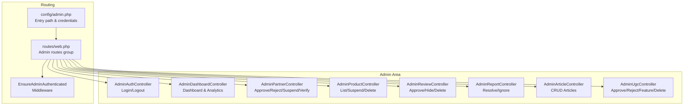

**Diagram sources**
- [routes/web.php:169-239](file://routes/web.php#L169-L239)
- [app/Http/Middleware/EnsureAdminAuthenticated.php:1-25](file://app/Http/Middleware/EnsureAdminAuthenticated.php#L1-L25)
- [config/admin.php:1-8](file://config/admin.php#L1-L8)

**Section sources**
- [routes/web.php:169-239](file://routes/web.php#L169-L239)
- [config/admin.php:1-8](file://config/admin.php#L1-L8)

## Core Components
- Admin authentication controller handles login/logout with session-based checks and redirects.
- Dashboard controller renders summary cards and analytics charts.
- Partner controller manages store verification, status transitions, and verified badge toggling.
- Product controller lists products and supports activation/deactivation and deletion.
- Review controller approves, hides, and deletes reviews with moderation metadata.
- Report controller lists reports and resolves or ignores them with resolution notes.
- Article controller manages editorial content creation, editing, publishing, and deletion.
- UGC controller approves, rejects, toggles featured flag, and deletes submissions.

**Section sources**
- [app/Http/Controllers/AdminAuthController.php:11-52](file://app/Http/Controllers/AdminAuthController.php#L11-L52)
- [app/Http/Controllers/AdminDashboardController.php:16-65](file://app/Http/Controllers/AdminDashboardController.php#L16-L65)
- [app/Http/Controllers/AdminPartnerController.php:15-75](file://app/Http/Controllers/AdminPartnerController.php#L15-L75)
- [app/Http/Controllers/AdminProductController.php:11-36](file://app/Http/Controllers/AdminProductController.php#L11-L36)
- [app/Http/Controllers/AdminReviewController.php:11-47](file://app/Http/Controllers/AdminReviewController.php#L11-L47)
- [app/Http/Controllers/AdminReportController.php:12-50](file://app/Http/Controllers/AdminReportController.php#L12-L50)
- [app/Http/Controllers/AdminArticleController.php:30-161](file://app/Http/Controllers/AdminArticleController.php#L30-L161)
- [app/Http/Controllers/AdminUgcController.php:10-42](file://app/Http/Controllers/AdminUgcController.php#L10-L42)

## Architecture Overview
Administrative endpoints are organized by domain and grouped under the admin prefix. Access is controlled via EnsureAdminAuthenticated middleware. The admin area exposes:
- Partner lifecycle management
- Product moderation
- Review moderation
- Report resolution
- Editorial content management
- UGC moderation
- System analytics

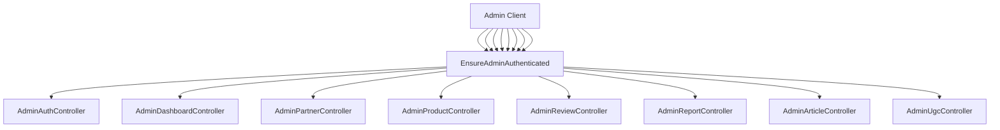

**Diagram sources**
- [routes/web.php:169-239](file://routes/web.php#L169-L239)
- [app/Http/Middleware/EnsureAdminAuthenticated.php:16-23](file://app/Http/Middleware/EnsureAdminAuthenticated.php#L16-L23)

## Detailed Component Analysis

### Authentication and Authorization
- Login route validates credentials against configuration and sets a session flag.
- Logout clears session and regenerates CSRF token.
- Middleware enforces admin session presence and redirects unauthenticated requests to login.

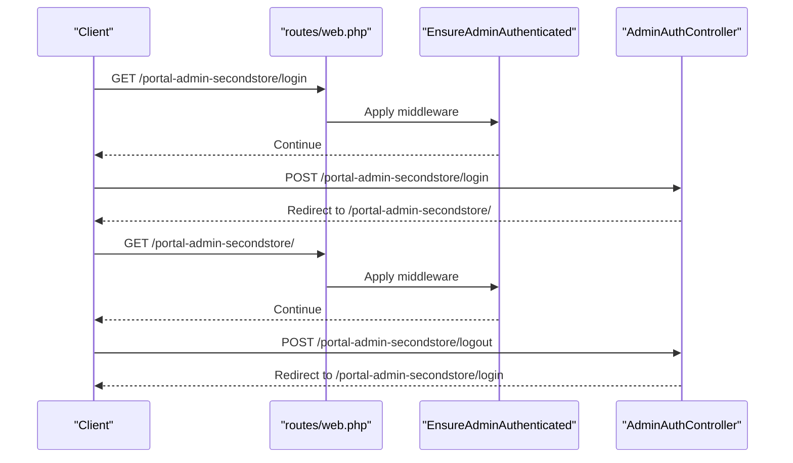

**Diagram sources**
- [routes/web.php:170-176](file://routes/web.php#L170-L176)
- [app/Http/Middleware/EnsureAdminAuthenticated.php:16-23](file://app/Http/Middleware/EnsureAdminAuthenticated.php#L16-L23)
- [app/Http/Controllers/AdminAuthController.php:20-52](file://app/Http/Controllers/AdminAuthController.php#L20-L52)

**Section sources**
- [config/admin.php:4-7](file://config/admin.php#L4-L7)
- [app/Http/Middleware/EnsureAdminAuthenticated.php:16-23](file://app/Http/Middleware/EnsureAdminAuthenticated.php#L16-L23)
- [app/Http/Controllers/AdminAuthController.php:11-52](file://app/Http/Controllers/AdminAuthController.php#L11-L52)

### Partner Management
Endpoints support listing partners by status, approving/rejecting/suspending stores, and toggling verified badge. Rejection requires a reason; suspension optionally accepts a reason.

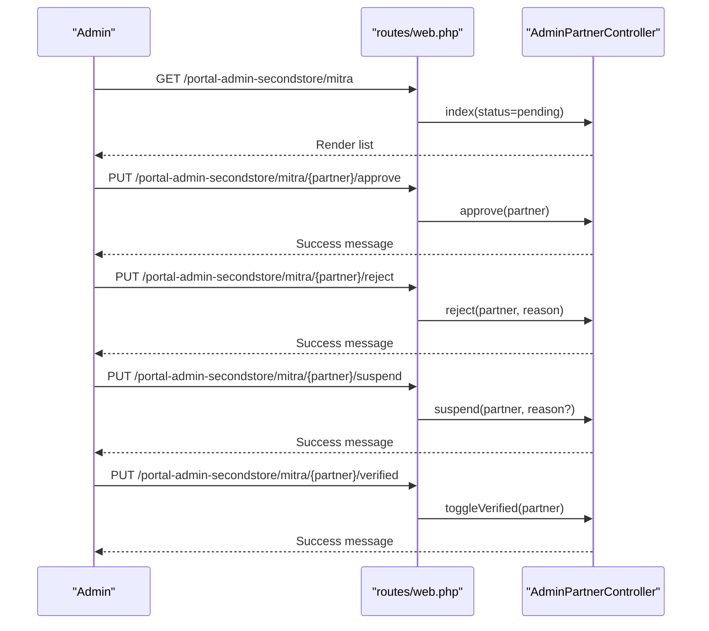

**Diagram sources**
- [routes/web.php:178-183](file://routes/web.php#L178-L183)
- [app/Http/Controllers/AdminPartnerController.php:30-74](file://app/Http/Controllers/AdminPartnerController.php#L30-L74)

**Section sources**
- [app/Http/Controllers/AdminPartnerController.php:15-75](file://app/Http/Controllers/AdminPartnerController.php#L15-L75)
- [database/migrations/2026_05_24_093205_create_partners_table.php:24-26](file://database/migrations/2026_05_24_093205_create_partners_table.php#L24-L26)

### Product Moderation
Endpoints list products and support activation/deactivation and deletion. Pagination is applied for listing.

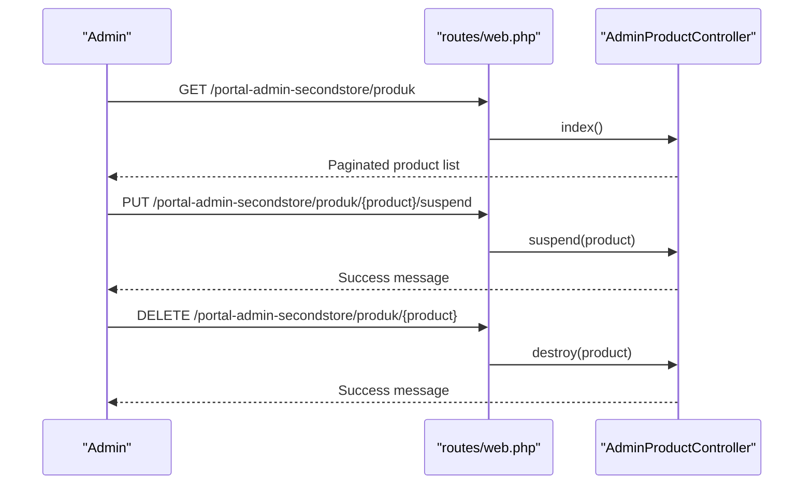

**Diagram sources**
- [routes/web.php:185-188](file://routes/web.php#L185-L188)
- [app/Http/Controllers/AdminProductController.php:11-36](file://app/Http/Controllers/AdminProductController.php#L11-L36)

**Section sources**
- [app/Http/Controllers/AdminProductController.php:11-36](file://app/Http/Controllers/AdminProductController.php#L11-L36)

### Review Moderation
Endpoints list reviews and support approving or hiding them, along with deletion. Approve/hide set moderation timestamps and assigner.

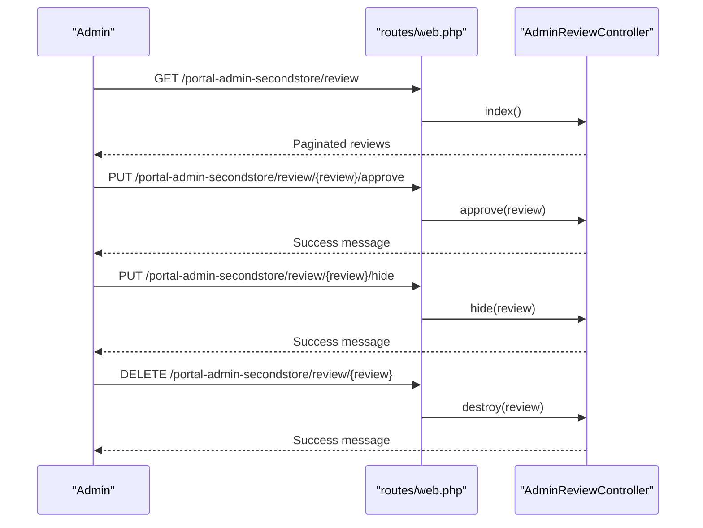

**Diagram sources**
- [routes/web.php:190-194](file://routes/web.php#L190-L194)
- [app/Http/Controllers/AdminReviewController.php:23-47](file://app/Http/Controllers/AdminReviewController.php#L23-L47)

**Section sources**
- [app/Http/Controllers/AdminReviewController.php:11-47](file://app/Http/Controllers/AdminReviewController.php#L11-L47)
- [database/migrations/2026_05_24_093454_create_reviews_table.php:12-20](file://database/migrations/2026_05_24_093454_create_reviews_table.php#L12-L20)

### Report Resolution
Endpoints list reports filtered by status and support resolving with optional notes and ignoring reports.

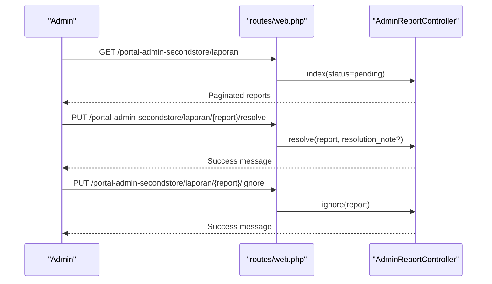

**Diagram sources**
- [routes/web.php:196-199](file://routes/web.php#L196-L199)
- [app/Http/Controllers/AdminReportController.php:27-50](file://app/Http/Controllers/AdminReportController.php#L27-L50)

**Section sources**
- [app/Http/Controllers/AdminReportController.php:12-50](file://app/Http/Controllers/AdminReportController.php#L12-L50)
- [database/migrations/2026_05_24_093849_create_product_reports_table.php:17](file://database/migrations/2026_05_24_093849_create_product_reports_table.php#L17)

### Article Management
Endpoints manage editorial articles: listing, creating, updating, and deleting. Publishing toggles publication timestamp and author defaults.

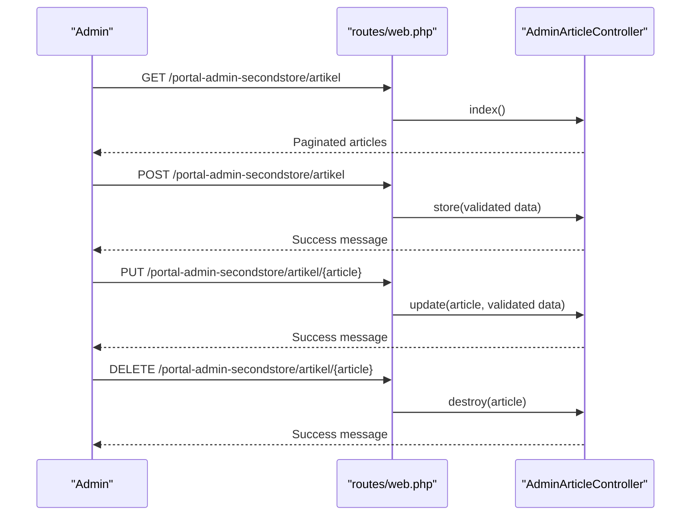

**Diagram sources**
- [routes/web.php:210-216](file://routes/web.php#L210-L216)
- [app/Http/Controllers/AdminArticleController.php:46-128](file://app/Http/Controllers/AdminArticleController.php#L46-L128)

**Section sources**
- [app/Http/Controllers/AdminArticleController.php:30-161](file://app/Http/Controllers/AdminArticleController.php#L30-L161)
- [database/migrations/2026_05_28_131137_create_articles_table.php:12-18](file://database/migrations/2026_05_28_131137_create_articles_table.php#L12-L18)

### UGC Moderation
Endpoints list UGC photos and support approving, rejecting, toggling featured status, and deleting submissions.

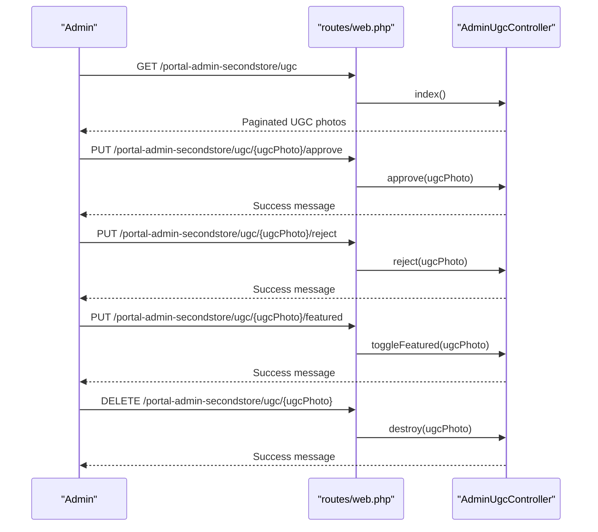

**Diagram sources**
- [routes/web.php:218-223](file://routes/web.php#L218-L223)
- [app/Http/Controllers/AdminUgcController.php:20-42](file://app/Http/Controllers/AdminUgcController.php#L20-L42)

**Section sources**
- [app/Http/Controllers/AdminUgcController.php:10-42](file://app/Http/Controllers/AdminUgcController.php#L10-L42)
- [database/migrations/2026_05_28_131139_create_ugc_photos_table.php:16-17](file://database/migrations/2026_05_28_131139_create_ugc_photos_table.php#L16-L17)

### System Analytics
The analytics endpoint aggregates top partners/products, tier distributions, totals, and total views. The dashboard endpoint provides summary cards and recent pending partners.

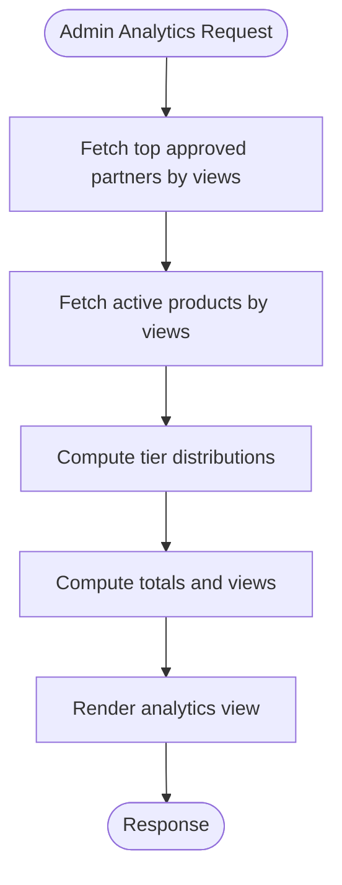

**Diagram sources**
- [app/Http/Controllers/AdminDashboardController.php:31-65](file://app/Http/Controllers/AdminDashboardController.php#L31-L65)

**Section sources**
- [app/Http/Controllers/AdminDashboardController.php:16-65](file://app/Http/Controllers/AdminDashboardController.php#L16-L65)

### Bulk Operations and Export (Overview)
While bulk operations and export are primarily exposed for partners in the partner area, the admin area focuses on moderation and analytics. Bulk endpoints for products are available under the partner prefix and can be leveraged by admins for product management tasks.

**Section sources**
- [routes/web.php:135-138](file://routes/web.php#L135-L138)

## Dependency Analysis
Administrative controllers depend on Eloquent models and Laravel’s request validation. Routing groups protect endpoints with middleware. Configuration drives the admin entry path and credentials.

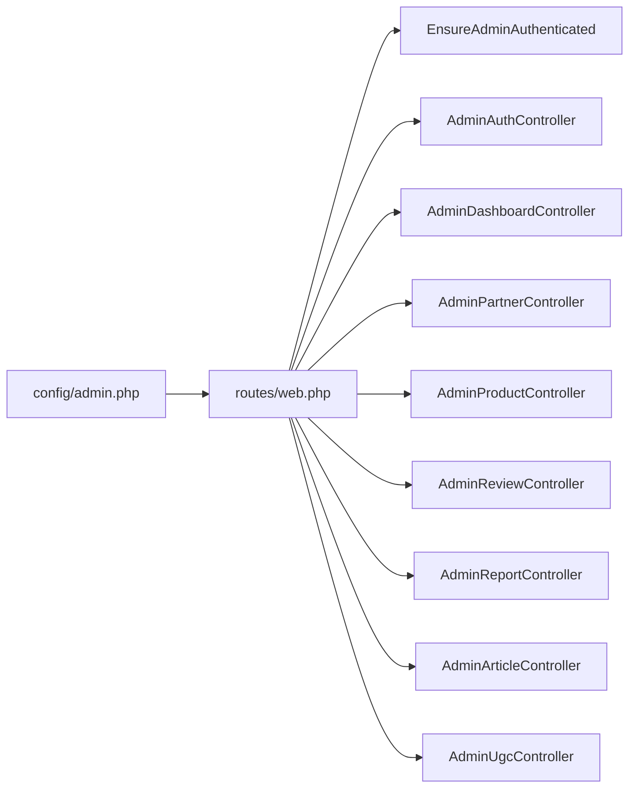

**Diagram sources**
- [routes/web.php:169-239](file://routes/web.php#L169-L239)
- [config/admin.php:4](file://config/admin.php#L4)

**Section sources**
- [routes/web.php:169-239](file://routes/web.php#L169-L239)
- [config/admin.php:4-7](file://config/admin.php#L4-L7)

## Performance Considerations
- Use pagination for listing endpoints to limit payload sizes.
- Apply selective eager loading for related models to reduce N+1 queries.
- Indexes on status filters and timestamps improve report and UGC listing performance.
- Avoid heavy computations in controllers; offload to model scopes or jobs when needed.

## Troubleshooting Guide
- Authentication failures: Verify admin credentials and session state. Ensure the admin entry path matches configuration.
- Access denied: Confirm EnsureAdminAuthenticated middleware is applied to admin routes.
- Validation errors: Review request payloads for required fields and constraints enforced by controllers.
- Missing data: Confirm database migrations are applied and related foreign keys exist.

**Section sources**
- [app/Http/Middleware/EnsureAdminAuthenticated.php:16-23](file://app/Http/Middleware/EnsureAdminAuthenticated.php#L16-L23)
- [config/admin.php:4-7](file://config/admin.php#L4-L7)

## Conclusion
The administrative control panel provides a comprehensive suite of moderation and analytics capabilities. Administrators can manage partners, moderate content, resolve reports, curate editorial content, and monitor platform performance. Access is secured via session-based authentication and middleware protection.

## Appendices

### API Reference Summary

- Authentication
  - POST /portal-admin-secondstore/login
  - POST /portal-admin-secondstore/logout

- Dashboard
  - GET /portal-admin-secondstore/
  - GET /portal-admin-secondstore/analitik

- Partner Management
  - GET /portal-admin-secondstore/mitra
  - PUT /portal-admin-secondstore/mitra/{partner}/approve
  - PUT /portal-admin-secondstore/mitra/{partner}/reject
  - PUT /portal-admin-secondstore/mitra/{partner}/suspend
  - PUT /portal-admin-secondstore/mitra/{partner}/verified

- Product Moderation
  - GET /portal-admin-secondstore/produk
  - PUT /portal-admin-secondstore/produk/{product}/suspend
  - DELETE /portal-admin-secondstore/produk/{product}

- Review Moderation
  - GET /portal-admin-secondstore/review
  - PUT /portal-admin-secondstore/review/{review}/approve
  - PUT /portal-admin-secondstore/review/{review}/hide
  - DELETE /portal-admin-secondstore/review/{review}

- Report Resolution
  - GET /portal-admin-secondstore/laporan
  - PUT /portal-admin-secondstore/laporan/{report}/resolve
  - PUT /portal-admin-secondstore/laporan/{report}/ignore

- Article Management
  - GET /portal-admin-secondstore/artikel
  - POST /portal-admin-secondstore/artikel
  - PUT /portal-admin-secondstore/artikel/{article}
  - DELETE /portal-admin-secondstore/artikel/{article}

- UGC Moderation
  - GET /portal-admin-secondstore/ugc
  - PUT /portal-admin-secondstore/ugc/{ugcPhoto}/approve
  - PUT /portal-admin-secondstore/ugc/{ugcPhoto}/reject
  - PUT /portal-admin-secondstore/ugc/{ugcPhoto}/featured
  - DELETE /portal-admin-secondstore/ugc/{ugcPhoto}

- Notifications and Badges
  - GET /portal-admin-secondstore/notifikasi
  - POST /portal-admin-secondstore/notifikasi/{id}/read
  - POST /portal-admin-secondstore/notifikasi/read-all
  - GET /portal-admin-secondstore/badges
  - POST /portal-admin-secondstore/badges
  - POST /portal-admin-secondstore/badges/assign
  - DELETE /portal-admin-secondstore/badges/{badge}

- System Analytics
  - GET /portal-admin-secondstore/analitik

Note: Replace portal-admin-secondstore with the configured admin entry path.

**Section sources**
- [routes/web.php:170-239](file://routes/web.php#L170-L239)
- [config/admin.php:4](file://config/admin.php#L4)

### Data Models Overview
```mermaid
erDiagram
PARTNERS {
bigint id PK
bigint user_id FK
string store_name
string store_slug UK
enum status
boolean is_verified
timestamp approved_at
text rejection_reason
timestamps
}
REVIEWS {
bigint id PK
bigint user_id FK
bigint product_id FK
tinyint rating
text comment
timestamps
}
PRODUCT_REPORTS {
bigint id PK
bigint user_id FK
bigint product_id FK
string reason
text detail
enum status
timestamps
}
ARTICLES {
bigint id PK
string slug UK
string title
string category
string cover_image
text excerpt
text content
string author
boolean is_published
timestamp published_at
json related_product_ids
timestamps
}
UGC_PHOTOS {
bigint id PK
bigint user_id FK
bigint product_id FK
string submitter_name
string submitter_instagram
string photo
text caption
enum status
boolean is_featured
timestamps
}
USERS ||--o{ PARTNERS : "owns"
PRODUCTS ||--o{ REVIEWS : "rated"
PRODUCTS ||--o{ PRODUCT_REPORTS : "reported"
USERS ||--o{ REVIEWS : "submitted"
USERS ||--o{ PRODUCT_REPORTS : "filed"
USERS ||--o{ UGC_PHOTOS : "submitted"
PRODUCTS ||--o{ UGC_PHOTOS : "referenced"
```

**Diagram sources**
- [database/migrations/2026_05_24_093205_create_partners_table.php:11-30](file://database/migrations/2026_05_24_093205_create_partners_table.php#L11-L30)
- [database/migrations/2026_05_24_093454_create_reviews_table.php:11-21](file://database/migrations/2026_05_24_093454_create_reviews_table.php#L11-L21)
- [database/migrations/2026_05_24_093849_create_product_reports_table.php:11-21](file://database/migrations/2026_05_24_093849_create_product_reports_table.php#L11-L21)
- [database/migrations/2026_05_28_131137_create_articles_table.php:8-21](file://database/migrations/2026_05_28_131137_create_articles_table.php#L8-L21)
- [database/migrations/2026_05_28_131139_create_ugc_photos_table.php:8-21](file://database/migrations/2026_05_28_131139_create_ugc_photos_table.php#L8-L21)

### Security and Compliance Notes
- Role-based access control: Admin-only routes protected by EnsureAdminAuthenticated middleware.
- Session-based authentication: Credentials checked against configuration; successful login sets a session flag.
- Audit trail: Moderation actions record timestamps and identifiers of the moderator.
- Activity logging: Consider integrating activity log models for comprehensive audit trails.

**Section sources**
- [app/Http/Middleware/EnsureAdminAuthenticated.php:16-23](file://app/Http/Middleware/EnsureAdminAuthenticated.php#L16-L23)
- [app/Http/Controllers/AdminReviewController.php:25-29](file://app/Http/Controllers/AdminReviewController.php#L25-L29)
- [app/Http/Controllers/AdminReportController.php:33-37](file://app/Http/Controllers/AdminReportController.php#L33-L37)

### API v1 (Optional)
A minimal API route exists for authenticated users via Sanctum. Extend this for administrative client integrations if needed.

**Section sources**
- [routes/api.php:17-19](file://routes/api.php#L17-L19)