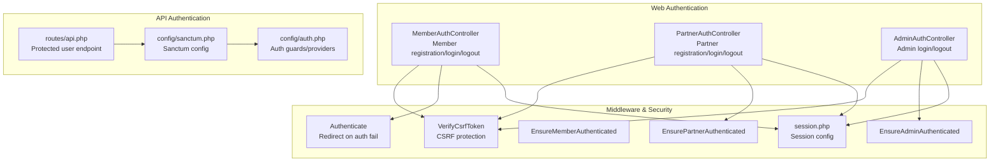
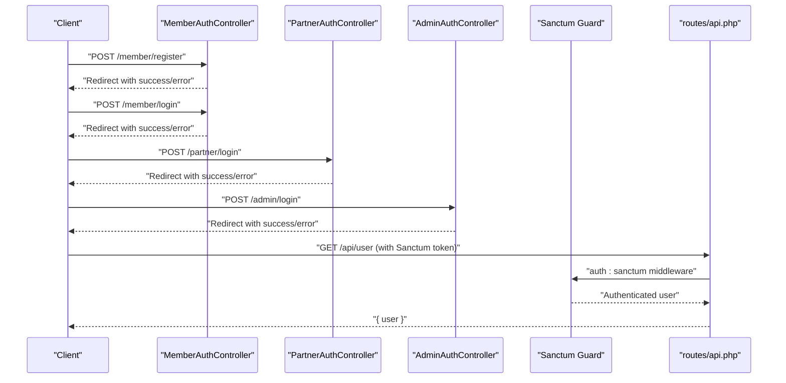
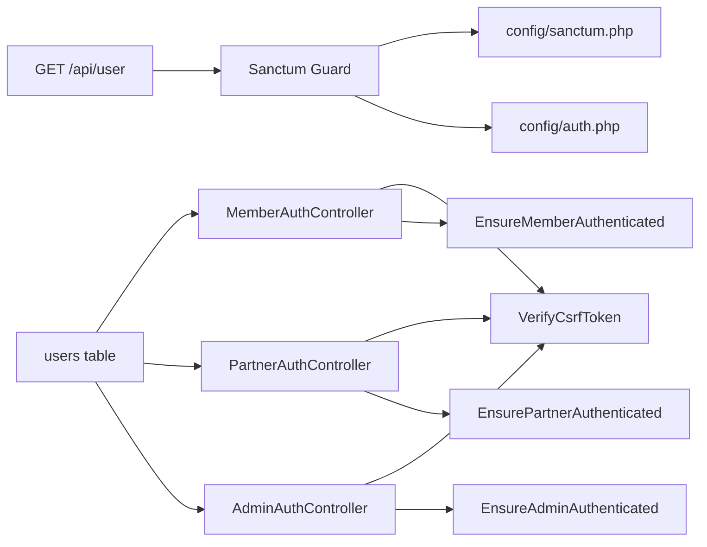

# Authentication Endpoints

<cite>
**Referenced Files in This Document**
- [MemberAuthController.php](file://app/Http/Controllers/Member/MemberAuthController.php)
- [PartnerAuthController.php](file://app/Http/Controllers/Partner/PartnerAuthController.php)
- [AdminAuthController.php](file://app/Http/Controllers/AdminAuthController.php)
- [api.php](file://routes/api.php)
- [sanctum.php](file://config/sanctum.php)
- [auth.php](file://config/auth.php)
- [VerifyCsrfToken.php](file://app/Http/Middleware/VerifyCsrfToken.php)
- [Authenticate.php](file://app/Http/Middleware/Authenticate.php)
- [EnsureMemberAuthenticated.php](file://app/Http/Middleware/EnsureMemberAuthenticated.php)
- [EnsurePartnerAuthenticated.php](file://app/Http/Middleware/EnsurePartnerAuthenticated.php)
- [EnsureAdminAuthenticated.php](file://app/Http/Middleware/EnsureAdminAuthenticated.php)
- [User.php](file://app/Models/User.php)
- [create_users_table.php](file://database/migrations/2014_10_12_000000_create_users_table.php)
- [session.php](file://config/session.php)
</cite>

## Table of Contents
1. [Introduction](#introduction)
2. [Project Structure](#project-structure)
3. [Core Components](#core-components)
4. [Architecture Overview](#architecture-overview)
5. [Detailed Component Analysis](#detailed-component-analysis)
6. [Dependency Analysis](#dependency-analysis)
7. [Performance Considerations](#performance-considerations)
8. [Troubleshooting Guide](#troubleshooting-guide)
9. [Conclusion](#conclusion)
10. [Appendices](#appendices)

## Introduction
This document provides API documentation for authentication endpoints in the platform, focusing on member registration and login, partner registration and login, admin authentication, and token management via Laravel Sanctum. It covers request/response schemas, validation rules, role-based flows, error handling, and security considerations such as CSRF protection, rate limiting, and secure token storage.

## Project Structure
Authentication is implemented across dedicated controllers per role and a shared Sanctum configuration for API token management. Web routes are handled by role-specific controllers, while a minimal API route exposes a protected endpoint to return the authenticated user.

**Diagram sources**
- [MemberAuthController.php:1-129](file://app/Http/Controllers/Member/MemberAuthController.php#L1-L129)
- [PartnerAuthController.php:1-60](file://app/Http/Controllers/Partner/PartnerAuthController.php#L1-L60)
- [AdminAuthController.php:1-54](file://app/Http/Controllers/AdminAuthController.php#L1-L54)
- [api.php:1-20](file://routes/api.php#L1-L20)
- [sanctum.php:1-84](file://config/sanctum.php#L1-L84)
- [auth.php:1-120](file://config/auth.php#L1-L120)
- [VerifyCsrfToken.php:1-18](file://app/Http/Middleware/VerifyCsrfToken.php#L1-L18)
- [Authenticate.php:1-18](file://app/Http/Middleware/Authenticate.php#L1-L18)
- [EnsureMemberAuthenticated.php:1-21](file://app/Http/Middleware/EnsureMemberAuthenticated.php#L1-L21)
- [EnsurePartnerAuthenticated.php:1-28](file://app/Http/Middleware/EnsurePartnerAuthenticated.php#L1-L28)
- [EnsureAdminAuthenticated.php:1-25](file://app/Http/Middleware/EnsureAdminAuthenticated.php#L1-L25)
- [session.php:1-215](file://config/session.php#L1-L215)

**Section sources**
- [MemberAuthController.php:1-129](file://app/Http/Controllers/Member/MemberAuthController.php#L1-L129)
- [PartnerAuthController.php:1-60](file://app/Http/Controllers/Partner/PartnerAuthController.php#L1-L60)
- [AdminAuthController.php:1-54](file://app/Http/Controllers/AdminAuthController.php#L1-L54)
- [api.php:1-20](file://routes/api.php#L1-L20)
- [sanctum.php:1-84](file://config/sanctum.php#L1-L84)
- [auth.php:1-120](file://config/auth.php#L1-L120)
- [VerifyCsrfToken.php:1-18](file://app/Http/Middleware/VerifyCsrfToken.php#L1-L18)
- [Authenticate.php:1-18](file://app/Http/Middleware/Authenticate.php#L1-L18)
- [EnsureMemberAuthenticated.php:1-21](file://app/Http/Middleware/EnsureMemberAuthenticated.php#L1-L21)
- [EnsurePartnerAuthenticated.php:1-28](file://app/Http/Middleware/EnsurePartnerAuthenticated.php#L1-L28)
- [EnsureAdminAuthenticated.php:1-25](file://app/Http/Middleware/EnsureAdminAuthenticated.php#L1-L25)
- [session.php:1-215](file://config/session.php#L1-L215)

## Core Components
- Member authentication: Registration, login, logout, and password reset flows for individual users.
- Partner authentication: Login with approval checks and role gating for partner accounts.
- Admin authentication: Session-based admin login with constant-time credential comparison.
- API token management: Sanctum-protected endpoint returning the authenticated user.

Key implementation highlights:
- Validation rules enforce strong input constraints for registration and login.
- Role checks and middleware ensure proper authorization per route.
- Sanctum configuration governs stateful domains, guards, token lifetime, and middleware stack.

**Section sources**
- [MemberAuthController.php:44-63](file://app/Http/Controllers/Member/MemberAuthController.php#L44-L63)
- [MemberAuthController.php:23-36](file://app/Http/Controllers/Member/MemberAuthController.php#L23-L36)
- [MemberAuthController.php:65-71](file://app/Http/Controllers/Member/MemberAuthController.php#L65-L71)
- [MemberAuthController.php:81-95](file://app/Http/Controllers/Member/MemberAuthController.php#L81-L95)
- [PartnerAuthController.php:19-50](file://app/Http/Controllers/Partner/PartnerAuthController.php#L19-L50)
- [PartnerAuthController.php:52-58](file://app/Http/Controllers/Partner/PartnerAuthController.php#L52-L58)
- [AdminAuthController.php:20-43](file://app/Http/Controllers/AdminAuthController.php#L20-L43)
- [AdminAuthController.php:45-52](file://app/Http/Controllers/AdminAuthController.php#L45-L52)
- [api.php:17-19](file://routes/api.php#L17-L19)
- [sanctum.php:18-50](file://config/sanctum.php#L18-L50)
- [auth.php:38-47](file://config/auth.php#L38-L47)

## Architecture Overview
The authentication architecture separates concerns by role and leverages Laravel’s session and Sanctum token systems. Web endpoints are handled by role-specific controllers, while the API route requires Sanctum-issued tokens or session authentication.

**Diagram sources**
- [MemberAuthController.php:38-63](file://app/Http/Controllers/Member/MemberAuthController.php#L38-L63)
- [PartnerAuthController.php:13-50](file://app/Http/Controllers/Partner/PartnerAuthController.php#L13-L50)
- [AdminAuthController.php:11-43](file://app/Http/Controllers/AdminAuthController.php#L11-L43)
- [api.php:17-19](file://routes/api.php#L17-L19)
- [sanctum.php:36-50](file://config/sanctum.php#L36-L50)

## Detailed Component Analysis

### Member Authentication Endpoints
- POST /member/register
  - Purpose: Register a new member user.
  - Validation rules:
    - name: required, string, max length 100
    - email: required, email, unique in users table
    - password: required, min 8 characters, confirmed
  - Behavior:
    - Creates a new user with role set to member.
    - Logs the user in and regenerates session.
    - Redirects to catalog index with success message.
  - Error responses:
    - Validation errors returned as field-specific messages.
    - Redirect back preserving input.

- POST /member/login
  - Purpose: Authenticate a member user.
  - Validation rules:
    - email: required, email
    - password: required
  - Behavior:
    - Attempts authentication with credentials and optional remember flag.
    - On success, regenerates session and redirects to intended route.
    - On failure, returns back with error message.

- POST /member/logout
  - Purpose: Log out the current member.
  - Behavior:
    - Clears session, regenerates CSRF token, and redirects to home.

- POST /member/forgot-password
  - Purpose: Generate a password reset link.
  - Validation rules:
    - email: required, email, must exist in users table
  - Behavior:
    - Generates a random token and stores hashed token with creation timestamp.
    - Returns a reset link (in development) and success message.

- GET /member/reset-password?token={token}&email={email}
  - Purpose: Present reset password form pre-filled with token and email.

- POST /member/reset-password
  - Purpose: Apply the new password using token and email.
  - Validation rules:
    - token: required
    - email: required, email, exists in users table
    - password: required, min 8 characters, confirmed
  - Behavior:
    - Validates token against stored hashed token.
    - Updates user password and clears reset token.
    - Redirects to login with success message.

Security and session management:
- CSRF protection is enforced by VerifyCsrfToken middleware.
- Session lifetime and cookie attributes are governed by session.php.
- Authentication failures redirect to login with JSON expectation handling.

**Section sources**
- [MemberAuthController.php:44-63](file://app/Http/Controllers/Member/MemberAuthController.php#L44-L63)
- [MemberAuthController.php:23-36](file://app/Http/Controllers/Member/MemberAuthController.php#L23-L36)
- [MemberAuthController.php:65-71](file://app/Http/Controllers/Member/MemberAuthController.php#L65-L71)
- [MemberAuthController.php:81-95](file://app/Http/Controllers/Member/MemberAuthController.php#L81-L95)
- [MemberAuthController.php:97-127](file://app/Http/Controllers/Member/MemberAuthController.php#L97-L127)
- [VerifyCsrfToken.php:1-18](file://app/Http/Middleware/VerifyCsrfToken.php#L1-L18)
- [session.php:34-35](file://config/session.php#L34-L35)
- [Authenticate.php:13-16](file://app/Http/Middleware/Authenticate.php#L13-L16)

### Partner Authentication Endpoints
- POST /partner/login
  - Purpose: Authenticate a partner user.
  - Validation rules:
    - email: required, email
    - password: required
  - Behavior:
    - Attempts authentication via partner guard.
    - Ensures the user belongs to a partner record and that the partner is approved.
    - On success, regenerates session and redirects to partner dashboard.
    - On failure or unapproved account, returns back with appropriate error messages.

- POST /partner/logout
  - Purpose: Log out the current partner.
  - Behavior:
    - Clears session, regenerates CSRF token, and redirects to partner login.

Role gating and middleware:
- EnsurePartnerAuthenticated middleware enforces session validity and approval status.

**Section sources**
- [PartnerAuthController.php:19-50](file://app/Http/Controllers/Partner/PartnerAuthController.php#L19-L50)
- [PartnerAuthController.php:52-58](file://app/Http/Controllers/Partner/PartnerAuthController.php#L52-L58)
- [EnsurePartnerAuthenticated.php:11-26](file://app/Http/Middleware/EnsurePartnerAuthenticated.php#L11-L26)

### Admin Authentication Endpoints
- POST /admin/login
  - Purpose: Authenticate administrator.
  - Validation rules:
    - username: required, string
    - password: required, string
  - Behavior:
    - Compares credentials against configuration values using constant-time comparison.
    - On success, regenerates session, sets admin authentication flag, and redirects to admin dashboard.
    - On failure, returns back with error message.

- POST /admin/logout
  - Purpose: Log out the current admin.
  - Behavior:
    - Removes admin authentication flag, regenerates CSRF token, and redirects to admin login.

Session-based admin flow:
- EnsureAdminAuthenticated middleware checks for admin authentication flag.

**Section sources**
- [AdminAuthController.php:20-43](file://app/Http/Controllers/AdminAuthController.php#L20-L43)
- [AdminAuthController.php:45-52](file://app/Http/Controllers/AdminAuthController.php#L45-L52)
- [EnsureAdminAuthenticated.php:16-23](file://app/Http/Middleware/EnsureAdminAuthenticated.php#L16-L23)

### API Token Management
- GET /api/user
  - Purpose: Return the authenticated user.
  - Authentication:
    - Requires Sanctum-protected session or token.
  - Response:
    - Returns the authenticated user object.

Sanctum configuration:
- Stateful domains define trusted origins for stateful API authentication.
- Guard selection includes web driver for session-based authentication.
- Token expiration is configurable; default is null (no expiration).
- Middleware stack includes CSRF verification and cookie encryption.

**Section sources**
- [api.php:17-19](file://routes/api.php#L17-L19)
- [sanctum.php:18-50](file://config/sanctum.php#L18-L50)
- [sanctum.php:77-81](file://config/sanctum.php#L77-L81)
- [auth.php:38-47](file://config/auth.php#L38-L47)

## Dependency Analysis
Authentication depends on Laravel’s session and Sanctum guard configuration, with role-specific middleware enforcing access policies.

**Diagram sources**
- [MemberAuthController.php:1-129](file://app/Http/Controllers/Member/MemberAuthController.php#L1-L129)
- [PartnerAuthController.php:1-60](file://app/Http/Controllers/Partner/PartnerAuthController.php#L1-L60)
- [AdminAuthController.php:1-54](file://app/Http/Controllers/AdminAuthController.php#L1-L54)
- [VerifyCsrfToken.php:1-18](file://app/Http/Middleware/VerifyCsrfToken.php#L1-L18)
- [EnsureMemberAuthenticated.php:1-21](file://app/Http/Middleware/EnsureMemberAuthenticated.php#L1-L21)
- [EnsurePartnerAuthenticated.php:1-28](file://app/Http/Middleware/EnsurePartnerAuthenticated.php#L1-L28)
- [EnsureAdminAuthenticated.php:1-25](file://app/Http/Middleware/EnsureAdminAuthenticated.php#L1-L25)
- [api.php:17-19](file://routes/api.php#L17-L19)
- [sanctum.php:1-84](file://config/sanctum.php#L1-L84)
- [auth.php:1-120](file://config/auth.php#L1-L120)
- [create_users_table.php:14-22](file://database/migrations/2014_10_12_000000_create_users_table.php#L14-L22)

**Section sources**
- [sanctum.php:18-50](file://config/sanctum.php#L18-L50)
- [auth.php:38-47](file://config/auth.php#L38-L47)
- [create_users_table.php:14-22](file://database/migrations/2014_10_12_000000_create_users_table.php#L14-L22)

## Performance Considerations
- Session lifetime: Adjust SESSION_LIFETIME to balance security and user experience.
- Sanctum expiration: Configure token expiration to limit long-lived tokens.
- Middleware overhead: Ensure CSRF and session middleware are only applied where necessary.
- Database queries: Keep validation queries efficient; avoid N+1 during authentication flows.

[No sources needed since this section provides general guidance]

## Troubleshooting Guide
Common issues and resolutions:
- Invalid credentials:
  - Member login returns field-specific error; verify email/password format.
  - Partner login returns account approval errors; confirm partner status.
  - Admin login uses constant-time comparison; ensure exact username/password.

- CSRF failures:
  - Ensure forms include CSRF token; verify VerifyCsrfToken exclusions if any.

- Session problems:
  - Confirm session lifetime and secure cookie settings align with deployment.
  - Regenerate session after login/logout to prevent fixation.

- Sanctum token issues:
  - Verify stateful domains and middleware stack.
  - Check token expiration and guard configuration.

**Section sources**
- [MemberAuthController.php:30-36](file://app/Http/Controllers/Member/MemberAuthController.php#L30-L36)
- [PartnerAuthController.php:26-47](file://app/Http/Controllers/Partner/PartnerAuthController.php#L26-L47)
- [AdminAuthController.php:30-42](file://app/Http/Controllers/AdminAuthController.php#L30-L42)
- [VerifyCsrfToken.php:14-16](file://app/Http/Middleware/VerifyCsrfToken.php#L14-L16)
- [session.php:34-35](file://config/session.php#L34-L35)
- [sanctum.php:18-50](file://config/sanctum.php#L18-L50)

## Conclusion
The authentication system integrates role-specific controllers, middleware-based authorization, and Sanctum for API token management. Strong validation, CSRF protection, and session configuration provide a robust foundation. Administrators can tailor token lifetimes and stateful domains to meet security requirements.

[No sources needed since this section summarizes without analyzing specific files]

## Appendices

### Request/Response Schemas

- POST /member/register
  - Request body:
    - name: string, required, max 100
    - email: string, required, email, unique
    - password: string, required, min 8, confirmed
  - Response:
    - Redirect with success message on success.
    - Field-specific errors on validation failure.

- POST /member/login
  - Request body:
    - email: string, required, email
    - password: string, required
    - remember: boolean, optional
  - Response:
    - Redirect on success.
    - Error message on failure.

- POST /member/logout
  - No body required.
  - Response: Redirect to home.

- POST /member/forgot-password
  - Request body:
    - email: string, required, email, exists in users
  - Response:
    - Success message with reset link.

- POST /member/reset-password
  - Request body:
    - token: string, required
    - email: string, required, email, exists in users
    - password: string, required, min 8, confirmed
  - Response:
    - Redirect to login with success message.

- POST /partner/login
  - Request body:
    - email: string, required, email
    - password: string, required
    - remember: boolean, optional
  - Response:
    - Redirect on success.
    - Error message if not approved or credentials invalid.

- POST /partner/logout
  - No body required.
  - Response: Redirect to partner login.

- POST /admin/login
  - Request body:
    - username: string, required
    - password: string, required
  - Response:
    - Redirect on success.
    - Error message on failure.

- POST /admin/logout
  - No body required.
  - Response: Redirect to admin login.

- GET /api/user
  - Headers:
    - Authorization: Bearer <token> or valid session cookie
  - Response:
    - JSON object containing authenticated user.

**Section sources**
- [MemberAuthController.php:44-63](file://app/Http/Controllers/Member/MemberAuthController.php#L44-L63)
- [MemberAuthController.php:23-36](file://app/Http/Controllers/Member/MemberAuthController.php#L23-L36)
- [MemberAuthController.php:65-71](file://app/Http/Controllers/Member/MemberAuthController.php#L65-L71)
- [MemberAuthController.php:81-95](file://app/Http/Controllers/Member/MemberAuthController.php#L81-L95)
- [MemberAuthController.php:97-127](file://app/Http/Controllers/Member/MemberAuthController.php#L97-L127)
- [PartnerAuthController.php:19-50](file://app/Http/Controllers/Partner/PartnerAuthController.php#L19-L50)
- [PartnerAuthController.php:52-58](file://app/Http/Controllers/Partner/PartnerAuthController.php#L52-L58)
- [AdminAuthController.php:20-43](file://app/Http/Controllers/AdminAuthController.php#L20-L43)
- [AdminAuthController.php:45-52](file://app/Http/Controllers/AdminAuthController.php#L45-L52)
- [api.php:17-19](file://routes/api.php#L17-L19)

### Security Considerations
- CSRF protection:
  - Enabled by VerifyCsrfToken middleware; ensure forms submit tokens.
- Rate limiting:
  - Consider adding rate-limit middleware around login endpoints.
- Secure token storage:
  - Sanctum tokens are short-lived by default; configure expiration as needed.
- Session security:
  - Adjust secure, httpOnly, and sameSite cookie attributes in session.php.
- Multi-factor authentication:
  - Integrate MFA by extending login flows to require secondary factor post initial authentication.

**Section sources**
- [VerifyCsrfToken.php:14-16](file://app/Http/Middleware/VerifyCsrfToken.php#L14-L16)
- [sanctum.php:49](file://config/sanctum.php#L49)
- [session.php:171-184](file://config/session.php#L171-L184)
- [session.php:199](file://config/session.php#L199)