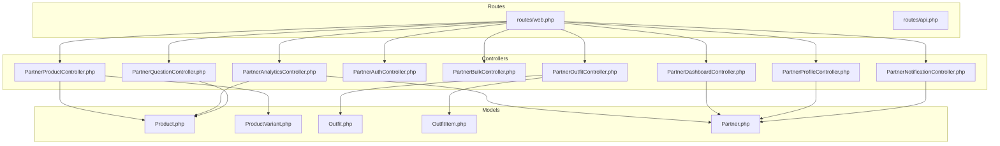
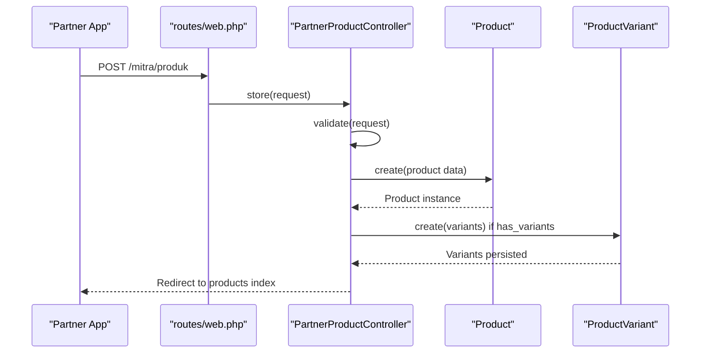
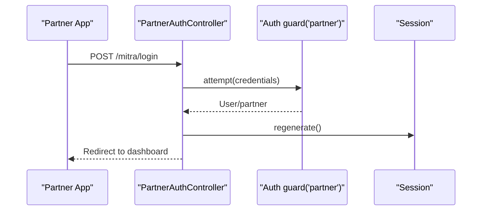
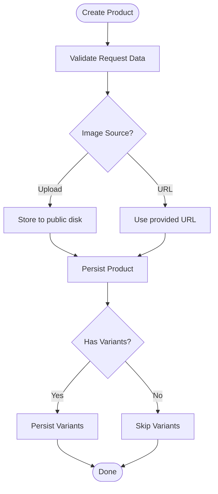
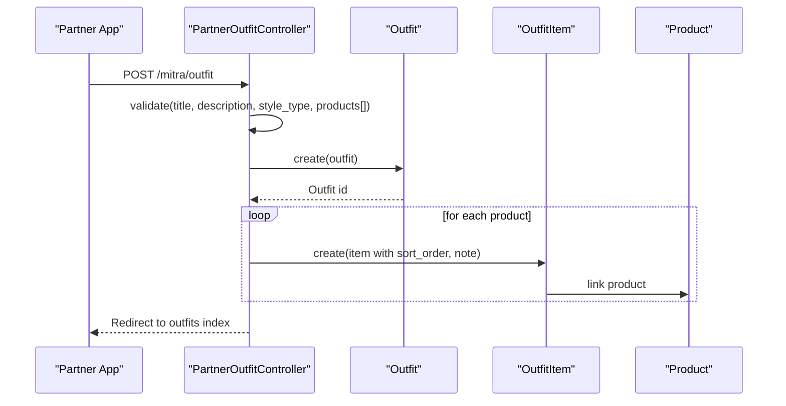
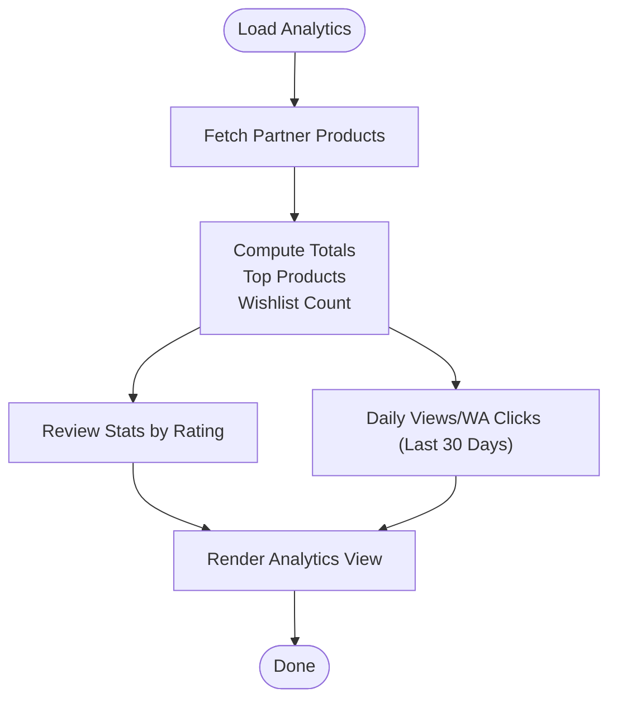
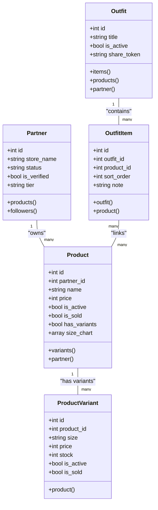

# Partner Integration APIs

<cite>
**Referenced Files in This Document**
- [routes/web.php](file://routes/web.php)
- [routes/api.php](file://routes/api.php)
- [PartnerProductController.php](file://app/Http/Controllers/Partner/PartnerProductController.php)
- [PartnerOutfitController.php](file://app/Http/Controllers/Partner/PartnerOutfitController.php)
- [PartnerAnalyticsController.php](file://app/Http/Controllers/Partner/PartnerAnalyticsController.php)
- [PartnerAuthController.php](file://app/Http/Controllers/Partner/PartnerAuthController.php)
- [PartnerBulkController.php](file://app/Http/Controllers/Partner/PartnerBulkController.php)
- [PartnerDashboardController.php](file://app/Http/Controllers/Partner/PartnerDashboardController.php)
- [PartnerProfileController.php](file://app/Http/Controllers/Partner/PartnerProfileController.php)
- [PartnerQuestionController.php](file://app/Http/Controllers/Partner/PartnerQuestionController.php)
- [PartnerNotificationController.php](file://app/Http/Controllers/Partner/PartnerNotificationController.php)
- [Product.php](file://app/Models/Product.php)
- [ProductVariant.php](file://app/Models/ProductVariant.php)
- [Outfit.php](file://app/Models/Outfit.php)
- [OutfitItem.php](file://app/Models/OutfitItem.php)
- [Partner.php](file://app/Models/Partner.php)
</cite>

## Table of Contents
1. [Introduction](#introduction)
2. [Project Structure](#project-structure)
3. [Core Components](#core-components)
4. [Architecture Overview](#architecture-overview)
5. [Detailed Component Analysis](#detailed-component-analysis)
6. [Dependency Analysis](#dependency-analysis)
7. [Performance Considerations](#performance-considerations)
8. [Troubleshooting Guide](#troubleshooting-guide)
9. [Conclusion](#conclusion)
10. [Appendices](#appendices)

## Introduction
This document describes the Partner Integration APIs for store owners to manage products, create outfits, analyze performance, and handle bulk operations. It consolidates the available backend routes and controllers to provide a practical guide for integrating with the platform’s partner-facing capabilities. Where applicable, conceptual guidance is included for endpoints not yet implemented in the current codebase.

## Project Structure
The partner integration is primarily exposed via web routes grouped under the “mitra” namespace. Authentication guards separate members and partners. Product, outfit, analytics, and profile operations are handled by dedicated controllers. Models define domain entities and relationships.

**Diagram sources**
- [routes/web.php:118-167](file://routes/web.php#L118-L167)
- [routes/api.php:17-19](file://routes/api.php#L17-L19)
- [PartnerProductController.php:14-337](file://app/Http/Controllers/Partner/PartnerProductController.php#L14-L337)
- [PartnerOutfitController.php:13-92](file://app/Http/Controllers/Partner/PartnerOutfitController.php#L13-L92)
- [PartnerAnalyticsController.php:10-60](file://app/Http/Controllers/Partner/PartnerAnalyticsController.php#L10-L60)
- [PartnerAuthController.php:11-60](file://app/Http/Controllers/Partner/PartnerAuthController.php#L11-L60)
- [PartnerBulkController.php:10-75](file://app/Http/Controllers/Partner/PartnerBulkController.php#L10-L75)
- [PartnerDashboardController.php:8-26](file://app/Http/Controllers/Partner/PartnerDashboardController.php#L8-L26)
- [PartnerProfileController.php:11-49](file://app/Http/Controllers/Partner/PartnerProfileController.php#L11-L49)
- [PartnerQuestionController.php:10-54](file://app/Http/Controllers/Partner/PartnerQuestionController.php#L10-L54)
- [PartnerNotificationController.php:7-21](file://app/Http/Controllers/Partner/PartnerNotificationController.php#L7-L21)
- [Product.php:9-132](file://app/Models/Product.php#L9-L132)
- [ProductVariant.php:6-23](file://app/Models/ProductVariant.php#L6-L23)
- [Outfit.php:8-60](file://app/Models/Outfit.php#L8-L60)
- [OutfitItem.php:7-28](file://app/Models/OutfitItem.php#L7-L28)
- [Partner.php:8-123](file://app/Models/Partner.php#L8-L123)

**Section sources**
- [routes/web.php:118-167](file://routes/web.php#L118-L167)
- [routes/api.php:17-19](file://routes/api.php#L17-L19)

## Core Components
- Partner authentication and dashboard
- Product lifecycle (CRUD, variants, bulk actions)
- Outfit creation and lookbook publishing
- Analytics and insights
- Store profile management
- Q&A and notifications

**Section sources**
- [PartnerAuthController.php:11-60](file://app/Http/Controllers/Partner/PartnerAuthController.php#L11-L60)
- [PartnerDashboardController.php:8-26](file://app/Http/Controllers/Partner/PartnerDashboardController.php#L8-L26)
- [PartnerProductController.php:14-337](file://app/Http/Controllers/Partner/PartnerProductController.php#L14-L337)
- [PartnerOutfitController.php:13-92](file://app/Http/Controllers/Partner/PartnerOutfitController.php#L13-L92)
- [PartnerAnalyticsController.php:10-60](file://app/Http/Controllers/Partner/PartnerAnalyticsController.php#L10-L60)
- [PartnerProfileController.php:11-49](file://app/Http/Controllers/Partner/PartnerProfileController.php#L11-L49)
- [PartnerQuestionController.php:10-54](file://app/Http/Controllers/Partner/PartnerQuestionController.php#L10-L54)
- [PartnerNotificationController.php:7-21](file://app/Http/Controllers/Partner/PartnerNotificationController.php#L7-L21)

## Architecture Overview
The partner integration follows a traditional MVC pattern:
- Routes define endpoints under the “mitra” namespace and apply partner authentication middleware.
- Controllers orchestrate requests, validate inputs, and coordinate model operations.
- Models encapsulate persistence, casting, and derived attributes.
- Views render partner dashboards and forms; responses are typically redirects with flash messages.

**Diagram sources**
- [routes/web.php:127-133](file://routes/web.php#L127-L133)
- [PartnerProductController.php:42-133](file://app/Http/Controllers/Partner/PartnerProductController.php#L42-L133)
- [Product.php:9-132](file://app/Models/Product.php#L9-L132)
- [ProductVariant.php:6-23](file://app/Models/ProductVariant.php#L6-L23)

## Detailed Component Analysis

### Partner Authentication
- Login: Validates credentials and checks partner approval status; redirects to dashboard upon success.
- Logout: Clears session and invalidates CSRF token.

**Diagram sources**
- [PartnerAuthController.php:19-50](file://app/Http/Controllers/Partner/PartnerAuthController.php#L19-L50)

**Section sources**
- [PartnerAuthController.php:11-60](file://app/Http/Controllers/Partner/PartnerAuthController.php#L11-L60)
- [routes/web.php:119-122](file://routes/web.php#L119-L122)

### Product Management
Endpoints:
- List/create: GET/POST /mitra/produk
- Edit/update/delete: GET/PUT/DELETE /mitra/produk/{product}
- Variants: POST /mitra/produk/{product}/variants and DELETE /mitra/produk/{product}/variants/{variant}
- Bulk operations: POST /mitra/produk/bulk-update, POST /mitra/produk/bulk-delete, POST /mitra/produk/export

Key capabilities:
- Product creation with metadata, images (upload or URL), size chart, variants, and SEO fields.
- Variant management per product with size, price, condition, and stock.
- Bulk activation/deactivation, marking sold/new arrival, and CSV export.

**Diagram sources**
- [PartnerProductController.php:42-133](file://app/Http/Controllers/Partner/PartnerProductController.php#L42-L133)
- [Product.php:13-34](file://app/Models/Product.php#L13-L34)
- [ProductVariant.php:8-16](file://app/Models/ProductVariant.php#L8-L16)

**Section sources**
- [routes/web.php:127-142](file://routes/web.php#L127-L142)
- [PartnerProductController.php:14-337](file://app/Http/Controllers/Partner/PartnerProductController.php#L14-L337)
- [PartnerBulkController.php:10-75](file://app/Http/Controllers/Partner/PartnerBulkController.php#L10-L75)

### Outfit Creation and Lookbook Publishing
Endpoints:
- List/create: GET/POST /mitra/outfit
- Delete: DELETE /mitra/outfit/{outfit}

Workflow:
- Create an Outfit with a title, description, style type, and associate 2–6 products.
- Outfit items are stored with sort order and optional notes.
- Outfits are visible in the lookbook when active.

**Diagram sources**
- [routes/web.php:148-152](file://routes/web.php#L148-L152)
- [PartnerOutfitController.php:49-82](file://app/Http/Controllers/Partner/PartnerOutfitController.php#L49-L82)
- [Outfit.php:19-26](file://app/Models/Outfit.php#L19-L26)
- [OutfitItem.php:9-16](file://app/Models/OutfitItem.php#L9-L16)

**Section sources**
- [routes/web.php:148-152](file://routes/web.php#L148-L152)
- [PartnerOutfitController.php:13-92](file://app/Http/Controllers/Partner/PartnerOutfitController.php#L13-L92)
- [Outfit.php:8-60](file://app/Models/Outfit.php#L8-L60)
- [OutfitItem.php:7-28](file://app/Models/OutfitItem.php#L7-L28)

### Analytics and Insights
Endpoint:
- GET /mitra/analitik

Capabilities:
- Total products, active products, total views, WhatsApp clicks.
- Top products by views, wishlist count, review distribution.
- Daily views/wa_clicks over last 30 days.
- Follower count, average rating, tier badge/name.

**Diagram sources**
- [routes/web.php:154-156](file://routes/web.php#L154-L156)
- [PartnerAnalyticsController.php:17-58](file://app/Http/Controllers/Partner/PartnerAnalyticsController.php#L17-L58)
- [Partner.php:33-43](file://app/Models/Partner.php#L33-L43)
- [Product.php:41-79](file://app/Models/Product.php#L41-L79)

**Section sources**
- [routes/web.php:154-156](file://routes/web.php#L154-L156)
- [PartnerAnalyticsController.php:10-60](file://app/Http/Controllers/Partner/PartnerAnalyticsController.php#L10-L60)
- [Partner.php:8-123](file://app/Models/Partner.php#L8-L123)
- [Product.php:9-132](file://app/Models/Product.php#L9-L132)

### Store Profile Management
Endpoint:
- GET/PUT /mitra/profil

Features:
- Update store name, description, location, social links, and logo (upload or keep existing).

**Section sources**
- [routes/web.php:144-146](file://routes/web.php#L144-L146)
- [PartnerProfileController.php:11-49](file://app/Http/Controllers/Partner/PartnerProfileController.php#L11-L49)
- [Partner.php:10-26](file://app/Models/Partner.php#L10-L26)

### Q&A and Notifications
- Q&A: List questions and answer via GET/PUT /mitra/pertanyaan and PUT /mitra/pertanyaan/{question}/jawab.
- Notifications: List notifications via GET /mitra/notifikasi.

**Section sources**
- [routes/web.php:158-165](file://routes/web.php#L158-L165)
- [PartnerQuestionController.php:10-54](file://app/Http/Controllers/Partner/PartnerQuestionController.php#L10-L54)
- [PartnerNotificationController.php:7-21](file://app/Http/Controllers/Partner/PartnerNotificationController.php#L7-L21)

### Order Management and Fulfillment
- Current codebase does not expose order management endpoints for partners.
- Recommendation: Introduce endpoints for retrieving orders, updating fulfillment status, and shipping coordination. These would typically include:
  - GET /mitra/orders
  - GET /mitra/orders/{id}
  - PUT /mitra/orders/{id}/fulfill
  - PUT /mitra/orders/{id}/ship
- Integration with external shipping providers and internal logistics systems should be handled via background jobs and webhooks.

[No sources needed since this section provides general guidance]

### Inventory Sync and Automated Alerts
- Current codebase supports product stock at the product level and per-variant stock.
- Recommendations:
  - Add endpoints to synchronize stock quantities and receive real-time updates.
  - Implement webhook handlers for stock changes to trigger automated reordering or alerts.
  - Example endpoint ideas:
    - POST /mitra/inventory/sync
    - POST /mitra/inventory/alerts/register
- Stock change events can be emitted and consumed asynchronously to avoid blocking API responses.

**Section sources**
- [Product.php:22-24](file://app/Models/Product.php#L22-L24)
- [ProductVariant.php:10-11](file://app/Models/ProductVariant.php#L10-L11)

### Webhook Implementations
- Inventory change webhook: POST /webhook/inventory/{partner_id}
- Order confirmation webhook: POST /webhook/order/{partner_id}
- Promotional campaign webhook: POST /webhook/promo/{partner_id}
- Payloads should include product identifiers, quantities, timestamps, and event-specific metadata.
- Implement signature verification and idempotency to prevent replay attacks and duplicate processing.

[No sources needed since this section provides general guidance]

### Partner Onboarding, Approval, and Compliance
- Public registration: GET/POST /daftar-mitra
- Partner login/logout: GET/POST /mitra/login, POST /mitra/logout
- Dashboard: GET /mitra/dashboard
- Admin approval workflow exists for partners; partner-side onboarding is limited to login and dashboard access.

**Section sources**
- [routes/web.php:68-74](file://routes/web.php#L68-L74)
- [routes/web.php:119-122](file://routes/web.php#L119-L122)
- [routes/web.php:124-125](file://routes/web.php#L124-L125)
- [PartnerAuthController.php:11-60](file://app/Http/Controllers/Partner/PartnerAuthController.php#L11-L60)
- [PartnerDashboardController.php:8-26](file://app/Http/Controllers/Partner/PartnerDashboardController.php#L8-L26)

## Dependency Analysis

**Diagram sources**
- [Partner.php:8-123](file://app/Models/Partner.php#L8-L123)
- [Product.php:9-132](file://app/Models/Product.php#L9-L132)
- [ProductVariant.php:6-23](file://app/Models/ProductVariant.php#L6-L23)
- [Outfit.php:8-60](file://app/Models/Outfit.php#L8-L60)
- [OutfitItem.php:7-28](file://app/Models/OutfitItem.php#L7-L28)

**Section sources**
- [Partner.php:8-123](file://app/Models/Partner.php#L8-L123)
- [Product.php:9-132](file://app/Models/Product.php#L9-L132)
- [ProductVariant.php:6-23](file://app/Models/ProductVariant.php#L6-L23)
- [Outfit.php:8-60](file://app/Models/Outfit.php#L8-L60)
- [OutfitItem.php:7-28](file://app/Models/OutfitItem.php#L7-L28)

## Performance Considerations
- Use pagination for analytics and question listings to limit payload sizes.
- Batch operations (bulk update/delete) reduce round-trips for product management.
- Indexes on product queries (name, brand, description) improve search performance.
- Offload heavy analytics computations to background jobs to keep API responses responsive.

[No sources needed since this section provides general guidance]

## Troubleshooting Guide
- Authentication failures: Ensure partner account is approved; rejected or suspended accounts are blocked from login.
- Authorization errors: Many endpoints check ownership (e.g., product deletion requires matching partner_id).
- Validation errors: Confirm request payloads meet controller validation rules (e.g., product variants require size).
- File uploads: Verify image size limits and supported formats; logo and product images are stored on the public disk.

**Section sources**
- [PartnerAuthController.php:34-43](file://app/Http/Controllers/Partner/PartnerAuthController.php#L34-L43)
- [PartnerProductController.php:247-259](file://app/Http/Controllers/Partner/PartnerProductController.php#L247-L259)
- [PartnerProfileController.php:36-41](file://app/Http/Controllers/Partner/PartnerProfileController.php#L36-L41)

## Conclusion
The partner integration provides a solid foundation for product management, outfit creation, and analytics. To support advanced workflows such as inventory synchronization, order management, and webhooks, extend the existing routes and controllers with dedicated endpoints and asynchronous processing. The current models and relationships enable scalable enhancements aligned with the existing architecture.

## Appendices
- API endpoints summary:
  - Authentication: POST /mitra/login, POST /mitra/logout
  - Dashboard: GET /mitra/dashboard
  - Products: GET/POST /mitra/produk, GET/PUT/DELETE /mitra/produk/{product}, POST/DELETE /mitra/produk/{product}/variants[/...]
  - Bulk: POST /mitra/produk/bulk-update, POST /mitra/produk/bulk-delete, POST /mitra/produk/export
  - Outfits: GET/POST /mitra/outfit, DELETE /mitra/outfit/{outfit}
  - Analytics: GET /mitra/analitik
  - Profile: GET/PUT /mitra/profil
  - Q&A: GET /mitra/pertanyaan, PUT /mitra/pertanyaan/{question}/jawab
  - Notifications: GET /mitra/notifikasi

[No sources needed since this section summarizes endpoints without analyzing specific files]