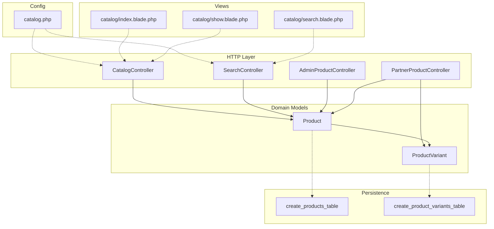
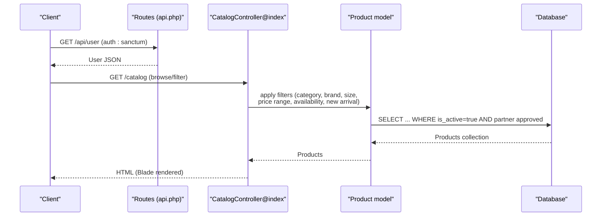
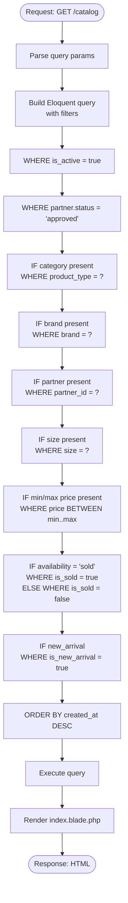
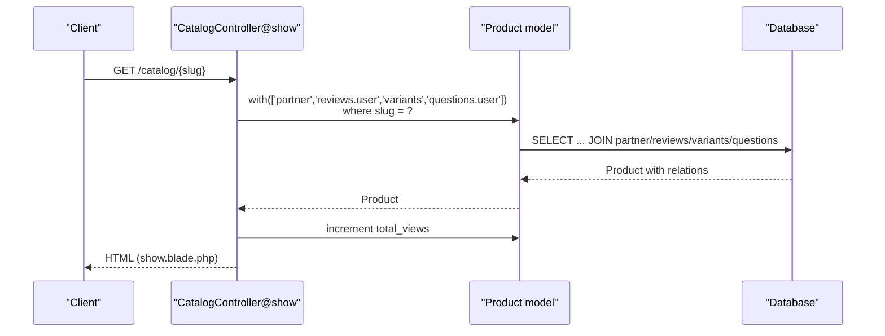
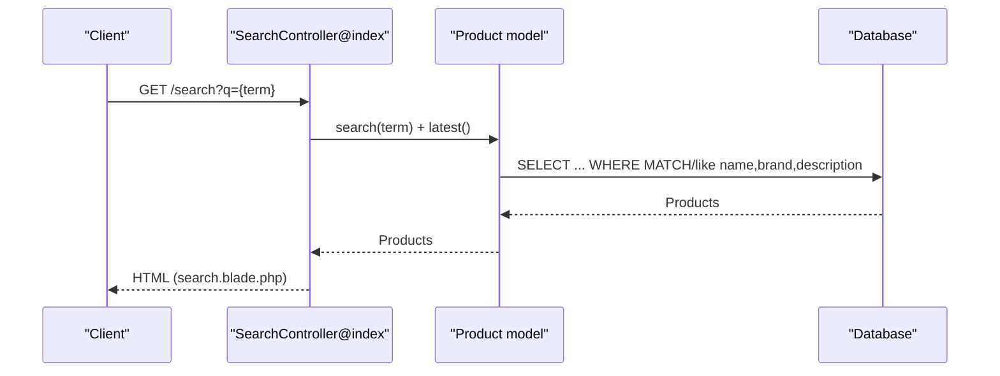
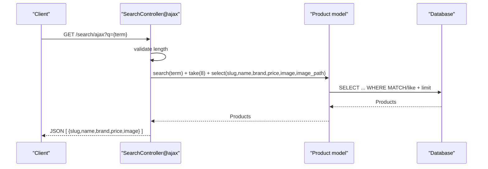
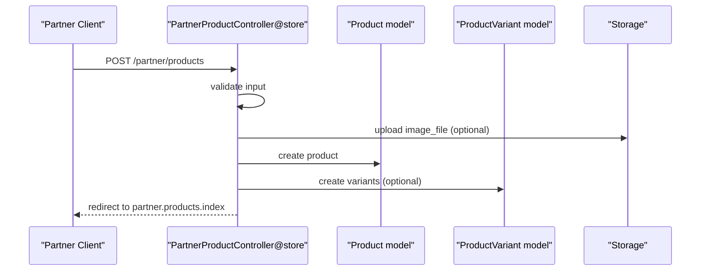
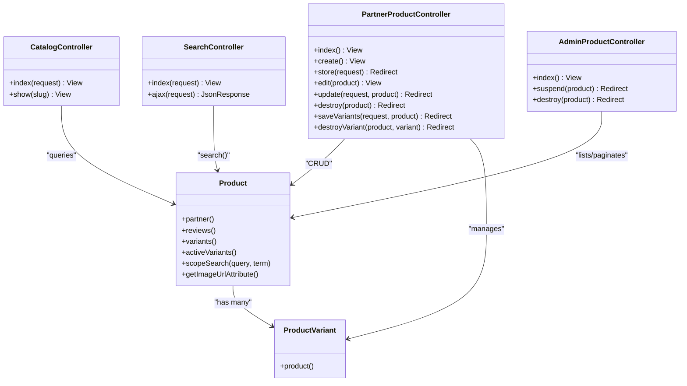

# Product Catalog APIs

<cite>
**Referenced Files in This Document**
- [CatalogController.php](file://app/Http/Controllers/CatalogController.php)
- [SearchController.php](file://app/Http/Controllers/SearchController.php)
- [Product.php](file://app/Models/Product.php)
- [ProductVariant.php](file://app/Models/ProductVariant.php)
- [PartnerProductController.php](file://app/Http/Controllers/Partner/PartnerProductController.php)
- [AdminProductController.php](file://app/Http/Controllers/AdminProductController.php)
- [api.php](file://routes/api.php)
- [catalog.php](file://config/catalog.php)
- [2026_05_04_125734_create_products_table.php](file://database/migrations/2026_05_04_125734_create_products_table.php)
- [2026_07_01_100002_create_product_variants_table.php](file://database/migrations/2026_07_01_100002_create_product_variants_table.php)
- [index.blade.php](file://resources/views/catalog/index.blade.php)
- [show.blade.php](file://resources/views/catalog/show.blade.php)
- [search.blade.php](file://resources/views/catalog/search.blade.php)
</cite>

## Table of Contents
1. [Introduction](#introduction)
2. [Project Structure](#project-structure)
3. [Core Components](#core-components)
4. [Architecture Overview](#architecture-overview)
5. [Detailed Component Analysis](#detailed-component-analysis)
6. [Dependency Analysis](#dependency-analysis)
7. [Performance Considerations](#performance-considerations)
8. [Troubleshooting Guide](#troubleshooting-guide)
9. [Conclusion](#conclusion)
10. [Appendices](#appendices)

## Introduction
This document provides comprehensive API documentation for product catalog endpoints in the KatalogThrift platform. It covers product browsing, search, filtering, and detail retrieval. The documentation explains request parameters, response schemas, and backend behavior derived from controllers, models, and configuration. It also includes guidance on advanced search queries, bulk product retrieval, and real-time inventory considerations, along with caching and performance optimization strategies.

## Project Structure
The product catalog functionality spans controllers, Eloquent models, migrations, Blade templates, and configuration. Controllers handle HTTP requests and orchestrate model queries. Models define relationships and attributes, including search scopes and computed fields. Migrations define the underlying database schema. Blade templates render frontend experiences that complement the API surface.

**Diagram sources**
- [CatalogController.php:12-146](file://app/Http/Controllers/CatalogController.php#L12-L146)
- [SearchController.php:8-55](file://app/Http/Controllers/SearchController.php#L8-L55)
- [AdminProductController.php:9-36](file://app/Http/Controllers/AdminProductController.php#L9-L36)
- [PartnerProductController.php:14-336](file://app/Http/Controllers/Partner/PartnerProductController.php#L14-L336)
- [Product.php:9-131](file://app/Models/Product.php#L9-L131)
- [ProductVariant.php:6-22](file://app/Models/ProductVariant.php#L6-L22)
- [2026_05_04_125734_create_products_table.php:14-26](file://database/migrations/2026_05_04_125734_create_products_table.php#L14-L26)
- [2026_07_01_100002_create_product_variants_table.php:10-22](file://database/migrations/2026_07_01_100002_create_product_variants_table.php#L10-L22)
- [catalog.php:3-28](file://config/catalog.php#L3-L28)
- [index.blade.php:194-240](file://resources/views/catalog/index.blade.php#L194-L240)
- [show.blade.php:338-352](file://resources/views/catalog/show.blade.php#L338-L352)
- [search.blade.php:50-53](file://resources/views/catalog/search.blade.php#L50-L53)

**Section sources**
- [CatalogController.php:12-146](file://app/Http/Controllers/CatalogController.php#L12-L146)
- [SearchController.php:8-55](file://app/Http/Controllers/SearchController.php#L8-L55)
- [Product.php:9-131](file://app/Models/Product.php#L9-L131)
- [ProductVariant.php:6-22](file://app/Models/ProductVariant.php#L6-L22)
- [2026_05_04_125734_create_products_table.php:14-26](file://database/migrations/2026_05_04_125734_create_products_table.php#L14-L26)
- [2026_07_01_100002_create_product_variants_table.php:10-22](file://database/migrations/2026_07_01_100002_create_product_variants_table.php#L10-L22)
- [catalog.php:3-28](file://config/catalog.php#L3-L28)
- [index.blade.php:194-240](file://resources/views/catalog/index.blade.php#L194-L240)
- [show.blade.php:338-352](file://resources/views/catalog/show.blade.php#L338-L352)
- [search.blade.php:50-53](file://resources/views/catalog/search.blade.php#L50-L53)

## Core Components
- CatalogController: Handles product browsing, filtering, and detail retrieval. Implements category, brand, size, price range, availability, and new arrival filters. Provides related and pairing suggestions.
- SearchController: Implements keyword search with a full-text or LIKE-based scope and AJAX autocomplete.
- Product model: Defines fillable attributes, casts, relationships, and a search scope. Computes image URLs and SEO metadata.
- ProductVariant model: Manages variant records linked to a product, including size, price overrides, stock, and conditions.
- PartnerProductController: Supports product creation, updates, variants management for partners.
- AdminProductController: Provides administrative listing and toggling of product activity.
- Configuration: Defines product categories, social links, and defaults used across views and controllers.
- Views: Present browsing, search, and detail experiences; they reflect the current API behavior and parameters.

**Section sources**
- [CatalogController.php:30-82](file://app/Http/Controllers/CatalogController.php#L30-L82)
- [SearchController.php:10-54](file://app/Http/Controllers/SearchController.php#L10-L54)
- [Product.php:13-34](file://app/Models/Product.php#L13-L34)
- [ProductVariant.php:8-16](file://app/Models/ProductVariant.php#L8-L16)
- [PartnerProductController.php:42-133](file://app/Http/Controllers/Partner/PartnerProductController.php#L42-L133)
- [AdminProductController.php:11-29](file://app/Http/Controllers/AdminProductController.php#L11-L29)
- [catalog.php:14-28](file://config/catalog.php#L14-L28)

## Architecture Overview
The catalog system follows a layered architecture:
- HTTP controllers receive requests and delegate to models.
- Models encapsulate domain logic, relationships, and search capabilities.
- Views render frontend experiences; they also reflect the current API behavior and parameters.
- Configuration centralizes product types and defaults.

**Diagram sources**
- [api.php:17-19](file://routes/api.php#L17-L19)
- [CatalogController.php:30-82](file://app/Http/Controllers/CatalogController.php#L30-L82)
- [Product.php:121-130](file://app/Models/Product.php#L121-L130)

## Detailed Component Analysis

### Product Listing and Filtering (GET /catalog)
- Endpoint: GET /catalog
- Purpose: Browse products with optional filters and sorting.
- Filters (query parameters):
  - category: Product type key (from configuration).
  - brand: Brand name.
  - partner: Partner ID.
  - size: Size value.
  - min_price: Minimum price (integer).
  - max_price: Maximum price (integer).
  - availability: "available" or "sold".
  - new_arrival: Boolean flag to include new arrivals.
- Sorting: Latest order by creation time.
- Response: HTML page rendering product grid with filter UI and results.
- Additional data exposed to the view:
  - allSizes: Distinct sizes for filter dropdown.
  - allPartners: Approved partners for filter dropdown.
  - productTypes: Category definitions and counts.
  - categoryCounts: Count per category for tabs.

**Diagram sources**
- [CatalogController.php:30-82](file://app/Http/Controllers/CatalogController.php#L30-L82)
- [index.blade.php:194-240](file://resources/views/catalog/index.blade.php#L194-L240)

**Section sources**
- [CatalogController.php:30-82](file://app/Http/Controllers/CatalogController.php#L30-L82)
- [index.blade.php:194-240](file://resources/views/catalog/index.blade.php#L194-L240)

### Product Detail Retrieval (GET /catalog/{slug})
- Endpoint: GET /catalog/{slug}
- Purpose: Retrieve product detail, including variants, reviews, questions, and related items.
- Path parameter:
  - slug: Product slug.
- Behavior:
  - Loads product with partner, reviews, variants, and questions.
  - Increments total views.
  - Generates pairing suggestions based on configured product types.
  - Provides related products and user-specific data (e.g., wishlist, follow status).
- Response: HTML page rendering product detail, variants, reviews, Q&A, pairings, and related products.

**Diagram sources**
- [CatalogController.php:84-146](file://app/Http/Controllers/CatalogController.php#L84-L146)
- [show.blade.php:338-352](file://resources/views/catalog/show.blade.php#L338-L352)

**Section sources**
- [CatalogController.php:84-146](file://app/Http/Controllers/CatalogController.php#L84-L146)
- [show.blade.php:338-352](file://resources/views/catalog/show.blade.php#L338-L352)

### Search API (GET /search)
- Endpoint: GET /search
- Purpose: Keyword-based search with results page.
- Query parameters:
  - q: Search term.
- Behavior:
  - Applies a full-text search scope (MySQL MATCH/AGAINST or fallback LIKE) across name, brand, and description.
  - Returns products ordered by latest.
- Response: HTML page rendering search results and a live search input.

**Diagram sources**
- [SearchController.php:10-31](file://app/Http/Controllers/SearchController.php#L10-L31)
- [Product.php:121-130](file://app/Models/Product.php#L121-L130)

**Section sources**
- [SearchController.php:10-31](file://app/Http/Controllers/SearchController.php#L10-L31)
- [Product.php:121-130](file://app/Models/Product.php#L121-L130)

### Autocomplete API (GET /search/ajax)
- Endpoint: GET /search/ajax
- Purpose: Lightweight autocomplete for live search.
- Query parameters:
  - q: Search term (minimum length enforced server-side).
- Behavior:
  - Returns a JSON array of suggested products with minimal fields (slug, name, brand, price, image).
  - Limits results and filters active, approved partner products.
- Response: JSON array of suggestion objects.

**Diagram sources**
- [SearchController.php:33-54](file://app/Http/Controllers/SearchController.php#L33-L54)

**Section sources**
- [SearchController.php:33-54](file://app/Http/Controllers/SearchController.php#L33-L54)

### Product Variants Management (Partner)
- Endpoint: POST /partner/products
- Purpose: Create product with optional variants.
- Request body (validated):
  - name, brand, product_type, color, color_hex, style_type, price, size, condition, description, story, image_file or image, shopee_url, tokopedia_url, is_active, is_new_arrival, has_size_chart, size_chart, size_unit, has_variants, variants[].size, variants[].price, variants[].stock, meta_title, meta_description, meta_keywords.
- Behavior:
  - Creates product with slug generation.
  - Optionally creates variants with size, price overrides, stock, and conditions.
  - Handles image upload or external URL.
- Response: Redirect to partner product index with success message.

**Diagram sources**
- [PartnerProductController.php:42-133](file://app/Http/Controllers/Partner/PartnerProductController.php#L42-L133)

**Section sources**
- [PartnerProductController.php:42-133](file://app/Http/Controllers/Partner/PartnerProductController.php#L42-L133)

### Administrative Product Management
- Endpoint: GET /admin/products
- Purpose: Admin listing with pagination.
- Response: HTML page listing products with activity toggle and delete actions.

**Section sources**
- [AdminProductController.php:11-22](file://app/Http/Controllers/AdminProductController.php#L11-L22)

### API Authentication Route
- Endpoint: GET /api/user
- Middleware: auth:sanctum
- Response: Current authenticated user.

**Section sources**
- [api.php:17-19](file://routes/api.php#L17-L19)

## Dependency Analysis
- Controllers depend on models for data access and on configuration for product types and defaults.
- Product model depends on database schema and provides search scope and computed attributes.
- Views depend on controller-provided data and configuration for rendering UI and filters.
- PartnerProductController depends on Product and ProductVariant models and file storage for images.

**Diagram sources**
- [CatalogController.php:12-146](file://app/Http/Controllers/CatalogController.php#L12-L146)
- [SearchController.php:8-55](file://app/Http/Controllers/SearchController.php#L8-L55)
- [AdminProductController.php:9-36](file://app/Http/Controllers/AdminProductController.php#L9-L36)
- [PartnerProductController.php:14-336](file://app/Http/Controllers/Partner/PartnerProductController.php#L14-L336)
- [Product.php:36-84](file://app/Models/Product.php#L36-L84)
- [ProductVariant.php:18-21](file://app/Models/ProductVariant.php#L18-L21)

**Section sources**
- [CatalogController.php:12-146](file://app/Http/Controllers/CatalogController.php#L12-L146)
- [SearchController.php:8-55](file://app/Http/Controllers/SearchController.php#L8-L55)
- [AdminProductController.php:9-36](file://app/Http/Controllers/AdminProductController.php#L9-L36)
- [PartnerProductController.php:14-336](file://app/Http/Controllers/Partner/PartnerProductController.php#L14-L336)
- [Product.php:36-84](file://app/Models/Product.php#L36-L84)
- [ProductVariant.php:18-21](file://app/Models/ProductVariant.php#L18-L21)

## Performance Considerations
- Indexing: Ensure indexes on frequently filtered columns (e.g., product_type, brand, size, price, is_active, partner_id, slug). The search scope leverages MySQL MATCH/AGAINST when applicable; consider a full-text index on name, brand, description.
- Pagination: Admin listing uses pagination; consider adding pagination to browsing endpoints for large catalogs.
- Selectivity: Limit columns in autocomplete and search listings to reduce payload size.
- Caching:
  - Cache category counts and distinct sizes for filter dropdowns.
  - Cache product lists with applied filters for popular combinations.
  - Cache product detail pages with short TTLs to balance freshness and performance.
- CDN: Serve product images via CDN to improve load times.
- Asynchronous updates: For real-time inventory, consider event-driven updates and client-side cache invalidation.

[No sources needed since this section provides general guidance]

## Troubleshooting Guide
- Empty search results:
  - Verify minimum length requirement for autocomplete and ensure search term meets criteria.
  - Confirm database search index exists and is up-to-date.
- Incorrect filters:
  - Ensure query parameters match expected keys (category, brand, partner, size, min_price, max_price, availability, new_arrival).
  - Check that availability values are "available" or "sold".
- Variant visibility:
  - Confirm has_variants flag and that variants exist for the product.
  - Verify stock and active flags for variants.
- Authentication:
  - Ensure Sanctum tokens are included for /api/user endpoint.

**Section sources**
- [SearchController.php:33-54](file://app/Http/Controllers/SearchController.php#L33-L54)
- [Product.php:121-130](file://app/Models/Product.php#L121-L130)
- [PartnerProductController.php:119-129](file://app/Http/Controllers/Partner/PartnerProductController.php#L119-L129)

## Conclusion
The product catalog system provides robust browsing, filtering, search, and detail experiences. Controllers encapsulate business logic, models define relationships and search capabilities, and configuration centralizes product taxonomy. By applying indexing, pagination, and caching strategies, performance can be optimized for large catalogs. The documented endpoints and parameters enable developers to integrate with the platform effectively.

[No sources needed since this section summarizes without analyzing specific files]

## Appendices

### Request Parameters Reference
- GET /catalog
  - category: string (product type key)
  - brand: string
  - partner: integer (partner ID)
  - size: string
  - min_price: integer
  - max_price: integer
  - availability: string ("available" | "sold")
  - new_arrival: boolean
- GET /search
  - q: string (minimum length enforced)
- GET /search/ajax
  - q: string (minimum length enforced)
- POST /partner/products
  - name, brand, product_type, color, color_hex, style_type, price, size, condition, description, story, image_file or image, shopee_url, tokopedia_url, is_active, is_new_arrival, has_size_chart, size_chart, size_unit, has_variants, variants[].size, variants[].price, variants[].stock, meta_title, meta_description, meta_keywords

**Section sources**
- [CatalogController.php:30-82](file://app/Http/Controllers/CatalogController.php#L30-L82)
- [SearchController.php:10-54](file://app/Http/Controllers/SearchController.php#L10-L54)
- [PartnerProductController.php:42-73](file://app/Http/Controllers/Partner/PartnerProductController.php#L42-L73)

### Response Schemas
- GET /search/ajax (JSON array)
  - Objects include: slug, name, brand, price (formatted), image (URL).
- GET /catalog (HTML)
  - Renders product grid with filter UI and results.
- GET /catalog/{slug} (HTML)
  - Renders product detail, variants, reviews, Q&A, pairings, and related products.
- GET /admin/products (HTML)
  - Renders product listing with controls.

**Section sources**
- [SearchController.php:47-53](file://app/Http/Controllers/SearchController.php#L47-L53)
- [index.blade.php:267-334](file://resources/views/catalog/index.blade.php#L267-L334)
- [show.blade.php:338-352](file://resources/views/catalog/show.blade.php#L338-L352)
- [AdminProductController.php:11-22](file://app/Http/Controllers/AdminProductController.php#L11-L22)

### Advanced Queries and Bulk Operations
- Advanced search:
  - Use full-text search scope for broad matches across name, brand, and description.
  - Combine filters for precise targeting (e.g., category + brand + price range).
- Bulk product retrieval:
  - Paginate product listings for efficient loading.
  - Cache filtered lists to reduce repeated computation.
- Real-time inventory:
  - Track variant stock and availability flags.
  - Invalidate caches upon stock changes and refresh client state.

**Section sources**
- [Product.php:121-130](file://app/Models/Product.php#L121-L130)
- [ProductVariant.php:8-16](file://app/Models/ProductVariant.php#L8-L16)
- [PartnerProductController.php:293-321](file://app/Http/Controllers/Partner/PartnerProductController.php#L293-L321)

### Search Indexing Considerations
- Full-text index: Create a full-text index on name, brand, description for optimal search performance.
- Fallback: The search scope includes a LIKE-based fallback for non-MySQL environments.
- Relevance: Consider ranking by relevance and recency for improved UX.

**Section sources**
- [Product.php:121-130](file://app/Models/Product.php#L121-L130)