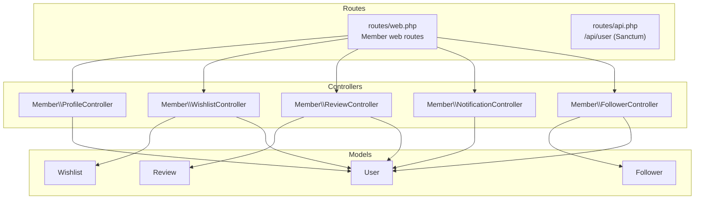
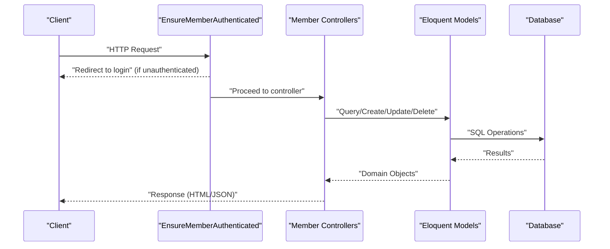
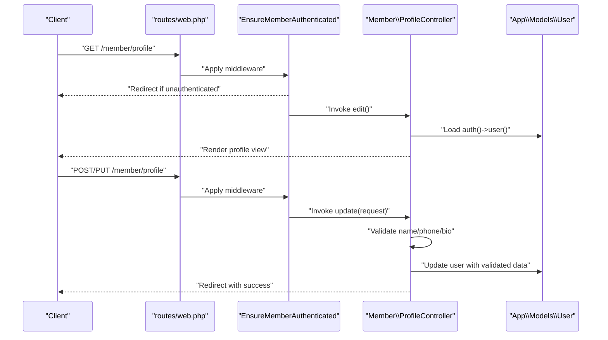
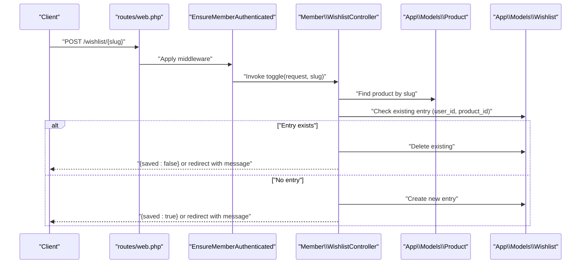
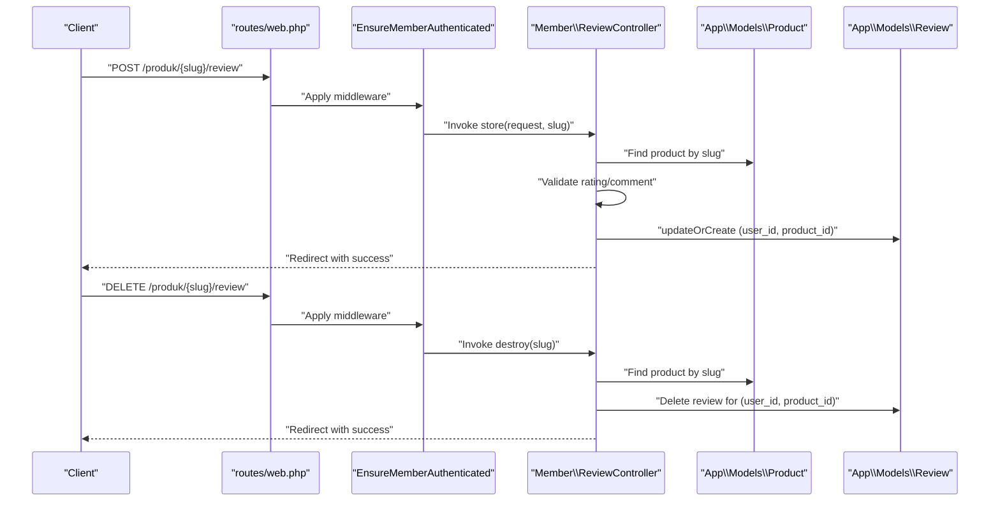
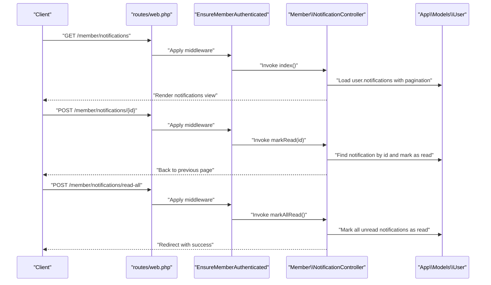
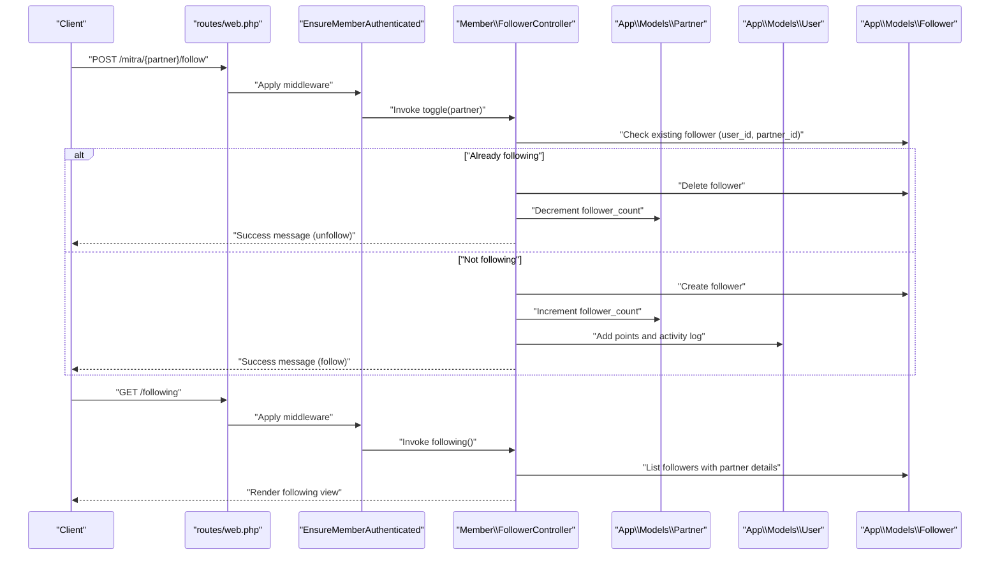
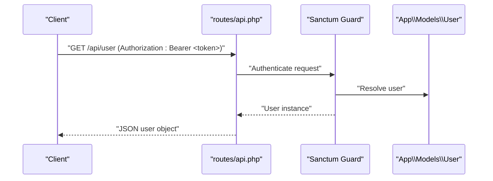
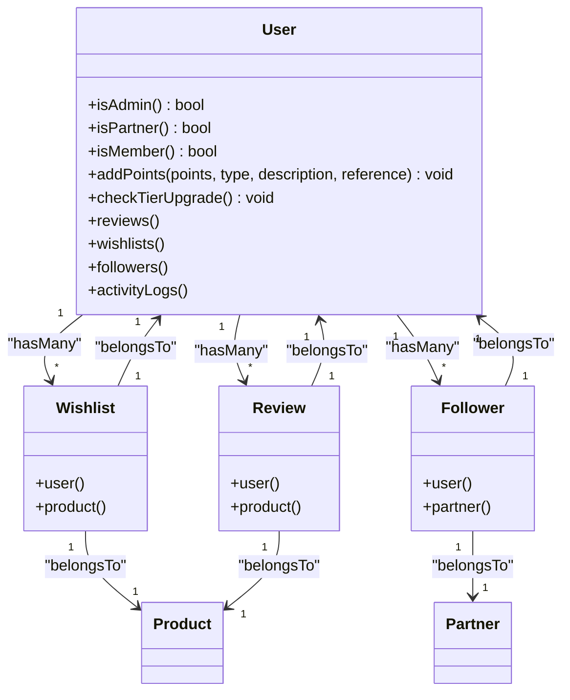

# User Management APIs

<cite>
**Referenced Files in This Document**
- [api.php](file://routes/api.php)
- [web.php](file://routes/web.php)
- [ProfileController.php](file://app/Http/Controllers/Member/ProfileController.php)
- [WishlistController.php](file://app/Http/Controllers/Member/WishlistController.php)
- [ReviewController.php](file://app/Http/Controllers/Member/ReviewController.php)
- [NotificationController.php](file://app/Http/Controllers/Member/NotificationController.php)
- [FollowerController.php](file://app/Http/Controllers/Member/FollowerController.php)
- [User.php](file://app/Models/User.php)
- [Wishlist.php](file://app/Models/Wishlist.php)
- [Review.php](file://app/Models/Review.php)
- [Follower.php](file://app/Models/Follower.php)
- [2026_05_24_093454_create_reviews_table.php](file://database/migrations/2026_05_24_093454_create_reviews_table.php)
- [2026_05_24_093819_create_wishlists_table.php](file://database/migrations/2026_05_24_093819_create_wishlists_table.php)
- [2026_07_01_100003_create_followers_table.php](file://database/migrations/2026_07_01_100003_create_followers_table.php)
- [EnsureMemberAuthenticated.php](file://app/Http/Middleware/EnsureMemberAuthenticated.php)
- [profile.blade.php](file://resources/views/member/profile.blade.php)
- [notifications.blade.php](file://resources/views/member/notifications.blade.php)
</cite>

## Table of Contents
1. [Introduction](#introduction)
2. [Project Structure](#project-structure)
3. [Core Components](#core-components)
4. [Architecture Overview](#architecture-overview)
5. [Detailed Component Analysis](#detailed-component-analysis)
6. [Dependency Analysis](#dependency-analysis)
7. [Performance Considerations](#performance-considerations)
8. [Troubleshooting Guide](#troubleshooting-guide)
9. [Conclusion](#conclusion)
10. [Appendices](#appendices)

## Introduction
This document provides comprehensive API documentation for member user management endpoints in the platform. It covers:
- Profile management endpoints for retrieving and updating user profiles with validation rules and field permissions
- Wishlist CRUD operations including add/remove items and JSON responses for client integrations
- Review submission endpoints with rating systems, comment support, and moderation metadata
- Notification preferences and read/unread management for user engagement
- Follower/following endpoints for social interactions and content discovery
- Request/response schemas for user data, privacy-related attributes, and activity feeds
- Data protection compliance, user consent management, and GDPR considerations

Where applicable, the document maps endpoints to actual controller actions and models, and includes diagrams to illustrate flows and relationships.

## Project Structure
The member-facing endpoints are primarily implemented as web routes guarded by member authentication middleware. An API route exists for authenticated user retrieval via Sanctum tokens. The relevant controllers and models are organized under the Member namespace and Eloquent models.

**Diagram sources**
- [web.php:88-103](file://routes/web.php#L88-L103)
- [api.php:17-19](file://routes/api.php#L17-L19)
- [ProfileController.php:1-33](file://app/Http/Controllers/Member/ProfileController.php#L1-L33)
- [WishlistController.php:1-48](file://app/Http/Controllers/Member/WishlistController.php#L1-L48)
- [ReviewController.php:1-41](file://app/Http/Controllers/Member/ReviewController.php#L1-L41)
- [NotificationController.php:1-32](file://app/Http/Controllers/Member/NotificationController.php#L1-L32)
- [FollowerController.php:1-45](file://app/Http/Controllers/Member/FollowerController.php#L1-L45)
- [User.php:1-131](file://app/Models/User.php#L1-L131)
- [Wishlist.php:1-29](file://app/Models/Wishlist.php#L1-L29)
- [Review.php:1-30](file://app/Models/Review.php#L1-L30)
- [Follower.php:1-23](file://app/Models/Follower.php#L1-L23)

**Section sources**
- [web.php:88-103](file://routes/web.php#L88-L103)
- [api.php:17-19](file://routes/api.php#L17-L19)

## Core Components
- Authentication and Authorization
  - Member-only routes are protected by the EnsureMemberAuthenticated middleware.
  - The Sanctum API endpoint returns the authenticated user object for token-based clients.
- Controllers
  - ProfileController: edit/update user profile fields.
  - WishlistController: list and toggle wishlist entries; supports JSON responses.
  - ReviewController: submit/update/delete reviews with rating and comment.
  - NotificationController: list notifications and mark as read/unread.
  - FollowerController: toggle follow relationship with a partner and list following.
- Models
  - User: defines fillable/hidden attributes, roles, gamification points, and relations.
  - Wishlist: belongs to User and Product; unique composite key.
  - Review: belongs to User and Product; includes moderation metadata.
  - Follower: belongs to User and Partner; tracks follow relationships.

**Section sources**
- [EnsureMemberAuthenticated.php:1-21](file://app/Http/Middleware/EnsureMemberAuthenticated.php#L1-L21)
- [api.php:17-19](file://routes/api.php#L17-L19)
- [ProfileController.php:1-33](file://app/Http/Controllers/Member/ProfileController.php#L1-L33)
- [WishlistController.php:1-48](file://app/Http/Controllers/Member/WishlistController.php#L1-L48)
- [ReviewController.php:1-41](file://app/Http/Controllers/Member/ReviewController.php#L1-L41)
- [NotificationController.php:1-32](file://app/Http/Controllers/Member/NotificationController.php#L1-L32)
- [FollowerController.php:1-45](file://app/Http/Controllers/Member/FollowerController.php#L1-L45)
- [User.php:1-131](file://app/Models/User.php#L1-L131)
- [Wishlist.php:1-29](file://app/Models/Wishlist.php#L1-L29)
- [Review.php:1-30](file://app/Models/Review.php#L1-L30)
- [Follower.php:1-23](file://app/Models/Follower.php#L1-L23)

## Architecture Overview
The member user management architecture follows a layered pattern:
- HTTP Layer: Routes define endpoints and bind to controllers.
- Controller Layer: Implements business logic, validates requests, and interacts with models.
- Model Layer: Encapsulates persistence, relationships, and domain rules.
- Middleware Layer: Enforces authentication and authorization.

**Diagram sources**
- [EnsureMemberAuthenticated.php:1-21](file://app/Http/Middleware/EnsureMemberAuthenticated.php#L1-L21)
- [web.php:88-103](file://routes/web.php#L88-L103)
- [ProfileController.php:1-33](file://app/Http/Controllers/Member/ProfileController.php#L1-L33)
- [WishlistController.php:1-48](file://app/Http/Controllers/Member/WishlistController.php#L1-L48)
- [ReviewController.php:1-41](file://app/Http/Controllers/Member/ReviewController.php#L1-L41)
- [NotificationController.php:1-32](file://app/Http/Controllers/Member/NotificationController.php#L1-L32)
- [FollowerController.php:1-45](file://app/Http/Controllers/Member/FollowerController.php#L1-L45)
- [User.php:1-131](file://app/Models/User.php#L1-L131)
- [Wishlist.php:1-29](file://app/Models/Wishlist.php#L1-L29)
- [Review.php:1-30](file://app/Models/Review.php#L1-L30)
- [Follower.php:1-23](file://app/Models/Follower.php#L1-L23)

## Detailed Component Analysis

### Profile Management API
- Purpose: Retrieve and update member profile fields.
- Authentication: Member-only routes.
- Validation Rules:
  - name: required, string, max length constraint
  - phone: nullable, string, max length constraint
  - bio: nullable, string, max length constraint
- Field Permissions:
  - Fillable fields include name, email, password, role, avatar, phone, bio, points, tier.
  - Hidden fields include password, remember_token.
- Endpoints:
  - GET /member/profile (edit view)
  - PUT/PATCH /member/profile (update)
- Notes:
  - The update action persists validated fields to the authenticated user record.
  - The profile view template renders editable fields for name, phone, and bio.

**Diagram sources**
- [web.php:88-103](file://routes/web.php#L88-L103)
- [EnsureMemberAuthenticated.php:1-21](file://app/Http/Middleware/EnsureMemberAuthenticated.php#L1-L21)
- [ProfileController.php:1-33](file://app/Http/Controllers/Member/ProfileController.php#L1-L33)
- [User.php:1-131](file://app/Models/User.php#L1-L131)
- [profile.blade.php:65-71](file://resources/views/member/profile.blade.php#L65-L71)

**Section sources**
- [ProfileController.php:19-31](file://app/Http/Controllers/Member/ProfileController.php#L19-L31)
- [User.php:14-26](file://app/Models/User.php#L14-L26)
- [profile.blade.php:65-71](file://resources/views/member/profile.blade.php#L65-L71)

### Wishlist Management API
- Purpose: Manage user wishlist entries per product slug.
- Authentication: Member-only routes.
- Endpoints:
  - GET /wishlist: List current user’s wishlist with product and partner details.
  - POST /wishlist/{slug}: Toggle save/remove item; returns JSON {saved: boolean} when requested as JSON.
- Behavior:
  - If an existing entry exists, it is deleted; otherwise, a new entry is created.
  - Non-JSON requests return a redirect with a success message; JSON requests return a JSON object.
- Data Model:
  - Composite unique key on (user_id, product_id).
  - Timestamp created_at is stored on creation.

**Diagram sources**
- [web.php:93-94](file://routes/web.php#L93-L94)
- [EnsureMemberAuthenticated.php:1-21](file://app/Http/Middleware/EnsureMemberAuthenticated.php#L1-L21)
- [WishlistController.php:25-46](file://app/Http/Controllers/Member/WishlistController.php#L25-L46)
- [Wishlist.php:11-14](file://app/Models/Wishlist.php#L11-L14)
- [2026_05_24_093819_create_wishlists_table.php:11-19](file://database/migrations/2026_05_24_093819_create_wishlists_table.php#L11-L19)

**Section sources**
- [WishlistController.php:15-46](file://app/Http/Controllers/Member/WishlistController.php#L15-L46)
- [Wishlist.php:1-29](file://app/Models/Wishlist.php#L1-L29)
- [2026_05_24_093819_create_wishlists_table.php:1-27](file://database/migrations/2026_05_24_093819_create_wishlists_table.php#L1-L27)

### Review Submission API
- Purpose: Submit, update, and delete reviews for a product identified by slug.
- Authentication: Member-only routes.
- Endpoints:
  - POST /produk/{slug}/review: Create or update review with rating and optional comment.
  - DELETE /produk/{slug}/review: Remove the user’s review for the product.
- Validation Rules:
  - rating: required, integer, min 1, max 5
  - comment: nullable, string, max length constraint
- Moderation Metadata:
  - Reviews include moderation fields: is_approved, admin_note, moderated_at, moderated_by.
- Behavior:
  - Uses updateOrCreate keyed by (user_id, product_id) to ensure one review per user-product pair.

**Diagram sources**
- [web.php:90-91](file://routes/web.php#L90-L91)
- [EnsureMemberAuthenticated.php:1-21](file://app/Http/Middleware/EnsureMemberAuthenticated.php#L1-L21)
- [ReviewController.php:13-39](file://app/Http/Controllers/Member/ReviewController.php#L13-L39)
- [Review.php:9-14](file://app/Models/Review.php#L9-L14)
- [2026_05_24_093454_create_reviews_table.php:11-21](file://database/migrations/2026_05_24_093454_create_reviews_table.php#L11-L21)

**Section sources**
- [ReviewController.php:13-39](file://app/Http/Controllers/Member/ReviewController.php#L13-L39)
- [Review.php:1-30](file://app/Models/Review.php#L1-L30)
- [2026_05_24_093454_create_reviews_table.php:1-29](file://database/migrations/2026_05_24_093454_create_reviews_table.php#L1-L29)

### Notification Preferences API
- Purpose: Manage notification read/unread state for the authenticated member.
- Authentication: Member-only routes.
- Endpoints:
  - GET /member/notifications: Paginated list of notifications for the user.
  - POST /member/notifications/{id}: Mark a single notification as read.
  - POST /member/notifications/read-all: Mark all unread notifications as read.
- Behavior:
  - Notifications are retrieved via the user’s notifications relation and paginated.
  - Marking as read uses the notification resource’s markAsRead method.

**Diagram sources**
- [web.php:88-103](file://routes/web.php#L88-L103)
- [EnsureMemberAuthenticated.php:1-21](file://app/Http/Middleware/EnsureMemberAuthenticated.php#L1-L21)
- [NotificationController.php:10-30](file://app/Http/Controllers/Member/NotificationController.php#L10-L30)
- [notifications.blade.php:42-74](file://resources/views/member/notifications.blade.php#L42-L74)

**Section sources**
- [NotificationController.php:10-30](file://app/Http/Controllers/Member/NotificationController.php#L10-L30)
- [notifications.blade.php:42-74](file://resources/views/member/notifications.blade.php#L42-L74)

### Follower/Following API
- Purpose: Allow members to follow/unfollow partners and view their following list.
- Authentication: Member-only routes.
- Endpoints:
  - POST /mitra/{partner}/follow: Toggle follow relationship with a partner.
  - GET /following: List all followed partners with details.
- Behavior:
  - On follow: increments partner follower_count and adds points to the user via activity log.
  - On unfollow: decrements partner follower_count and removes the follower record.
  - Returns a success message indicating the action taken.

**Diagram sources**
- [web.php:98-100](file://routes/web.php#L98-L100)
- [EnsureMemberAuthenticated.php:1-21](file://app/Http/Middleware/EnsureMemberAuthenticated.php#L1-L21)
- [FollowerController.php:12-43](file://app/Http/Controllers/Member/FollowerController.php#L12-L43)
- [Follower.php:9-11](file://app/Models/Follower.php#L9-L11)
- [2026_07_01_100003_create_followers_table.php:10-18](file://database/migrations/2026_07_01_100003_create_followers_table.php#L10-L18)

**Section sources**
- [FollowerController.php:12-43](file://app/Http/Controllers/Member/FollowerController.php#L12-L43)
- [Follower.php:1-23](file://app/Models/Follower.php#L1-L23)
- [2026_07_01_100003_create_followers_table.php:1-26](file://database/migrations/2026_07_01_100003_create_followers_table.php#L1-L26)

### API Access Token Endpoint
- Purpose: Retrieve the authenticated user via token-based authentication.
- Endpoint: GET /api/user
- Authentication: Requires Sanctum token.
- Response: The authenticated user object (filtered by hidden attributes).

**Diagram sources**
- [api.php:17-19](file://routes/api.php#L17-L19)
- [User.php:19-26](file://app/Models/User.php#L19-L26)

**Section sources**
- [api.php:17-19](file://routes/api.php#L17-L19)
- [User.php:19-26](file://app/Models/User.php#L19-L26)

## Dependency Analysis
The controllers depend on their respective models and Laravel’s request/response lifecycle. The User model encapsulates roles, points, and relations. The database schema enforces referential integrity and uniqueness constraints for reviews and wishlists.

**Diagram sources**
- [User.php:33-66](file://app/Models/User.php#L33-L66)
- [Wishlist.php:19-27](file://app/Models/Wishlist.php#L19-L27)
- [Review.php:20-28](file://app/Models/Review.php#L20-L28)
- [Follower.php:13-21](file://app/Models/Follower.php#L13-L21)

**Section sources**
- [User.php:1-131](file://app/Models/User.php#L1-L131)
- [Wishlist.php:1-29](file://app/Models/Wishlist.php#L1-L29)
- [Review.php:1-30](file://app/Models/Review.php#L1-L30)
- [Follower.php:1-23](file://app/Models/Follower.php#L1-L23)

## Performance Considerations
- Pagination: Notification listing uses pagination to limit payload sizes.
- Eager Loading: Wishlist listing eager-loads product and partner relations to reduce N+1 queries.
- Unique Constraints: Composite unique keys on reviews and wishlists prevent duplicates and simplify lookups.
- Middleware Overhead: EnsureMemberAuthenticated performs a simple check before dispatching to controllers.

[No sources needed since this section provides general guidance]

## Troubleshooting Guide
- Authentication Failures
  - Symptom: Redirect to login on member-only routes.
  - Cause: Missing or invalid member authentication.
  - Resolution: Ensure member authentication middleware is applied and credentials are valid.
- Validation Errors
  - Profile update errors: name must meet length constraints; phone and bio are optional but length-limited.
  - Review submission errors: rating must be an integer between 1 and 5; comment is optional.
- JSON vs HTML Responses
  - Wishlist toggle returns JSON {saved: boolean} when the request expects JSON; otherwise, redirects with messages.
- Notification Read Status
  - If marking notifications as read fails, verify the notification ID belongs to the authenticated user.

**Section sources**
- [EnsureMemberAuthenticated.php:13-16](file://app/Http/Middleware/EnsureMemberAuthenticated.php#L13-L16)
- [ProfileController.php:22-26](file://app/Http/Controllers/Member/ProfileController.php#L22-L26)
- [ReviewController.php:17-20](file://app/Http/Controllers/Member/ReviewController.php#L17-L20)
- [WishlistController.php:41-45](file://app/Http/Controllers/Member/WishlistController.php#L41-L45)
- [NotificationController.php:19-30](file://app/Http/Controllers/Member/NotificationController.php#L19-L30)

## Conclusion
The member user management APIs provide a cohesive set of endpoints for profile maintenance, wishlist management, review submission, notification handling, and social following. They leverage Laravel’s routing, middleware, Eloquent models, and database constraints to deliver a secure and scalable solution. The documented endpoints, validations, and flows serve as a reference for integrating client applications while maintaining data integrity and user privacy.

[No sources needed since this section summarizes without analyzing specific files]

## Appendices

### Request/Response Schemas

- Profile Update Request (application/x-www-form-urlencoded)
  - Fields:
    - name: string, required, max length
    - phone: string, nullable, max length
    - bio: string, nullable, max length
  - Notes: Sent to the profile update endpoint.

- Wishlist Toggle Request
  - Path Parameter:
    - slug: string, product identifier
  - Response (JSON):
    - saved: boolean

- Review Submission Request (application/x-www-form-urlencoded)
  - Path Parameter:
    - slug: string, product identifier
  - Fields:
    - rating: integer, required, min 1, max 5
    - comment: string, nullable, max length
  - Response: Redirect with success message.

- Notification Management
  - GET /member/notifications: Paginated list of notifications.
  - POST /member/notifications/{id}: Mark a notification as read.
  - POST /member/notifications/read-all: Mark all unread notifications as read.

- Follower Toggle
  - Path Parameters:
    - partner: Partner model binding
  - Response: Redirect with success message indicating follow/unfollow action.

**Section sources**
- [ProfileController.php:22-26](file://app/Http/Controllers/Member/ProfileController.php#L22-L26)
- [WishlistController.php:27-45](file://app/Http/Controllers/Member/WishlistController.php#L27-L45)
- [ReviewController.php:17-25](file://app/Http/Controllers/Member/ReviewController.php#L17-L25)
- [NotificationController.php:10-30](file://app/Http/Controllers/Member/NotificationController.php#L10-L30)
- [FollowerController.php:12-29](file://app/Http/Controllers/Member/FollowerController.php#L12-L29)

### Data Protection and GDPR Compliance
- Data Minimization
  - Profile fields collected are limited to name, phone, and bio.
  - Hidden attributes exclude sensitive fields from API responses.
- Consent and Transparency
  - Users receive notifications for actions (e.g., following) and can manage read/unread states.
  - Moderation metadata for reviews supports transparency and compliance.
- Data Retention and Deletion
  - Unique constraints and cascade deletes maintain referential integrity; implement retention policies aligned with legal obligations.
- Privacy Controls
  - Notification preferences are managed via read/unread toggles; extend to opt-out mechanisms if required by policy.

**Section sources**
- [User.php:19-26](file://app/Models/User.php#L19-L26)
- [Review.php:16-18](file://app/Models/Review.php#L16-L18)
- [2026_05_24_093454_create_reviews_table.php:15-18](file://database/migrations/2026_05_24_093454_create_reviews_table.php#L15-L18)