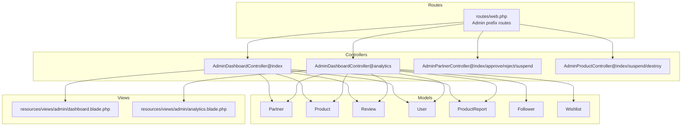
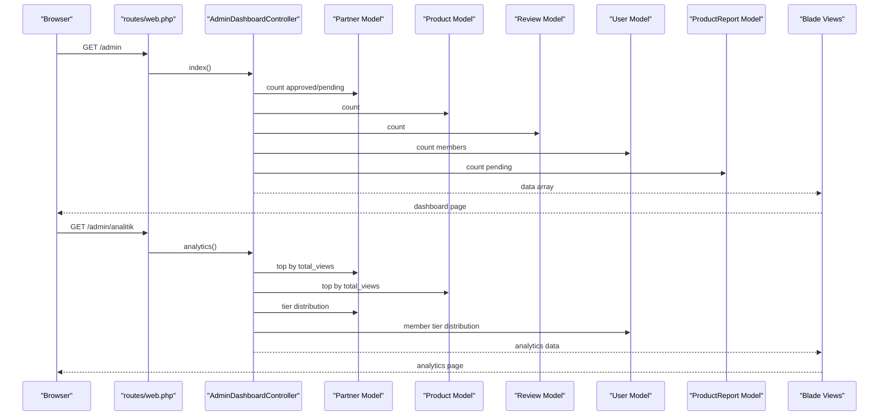
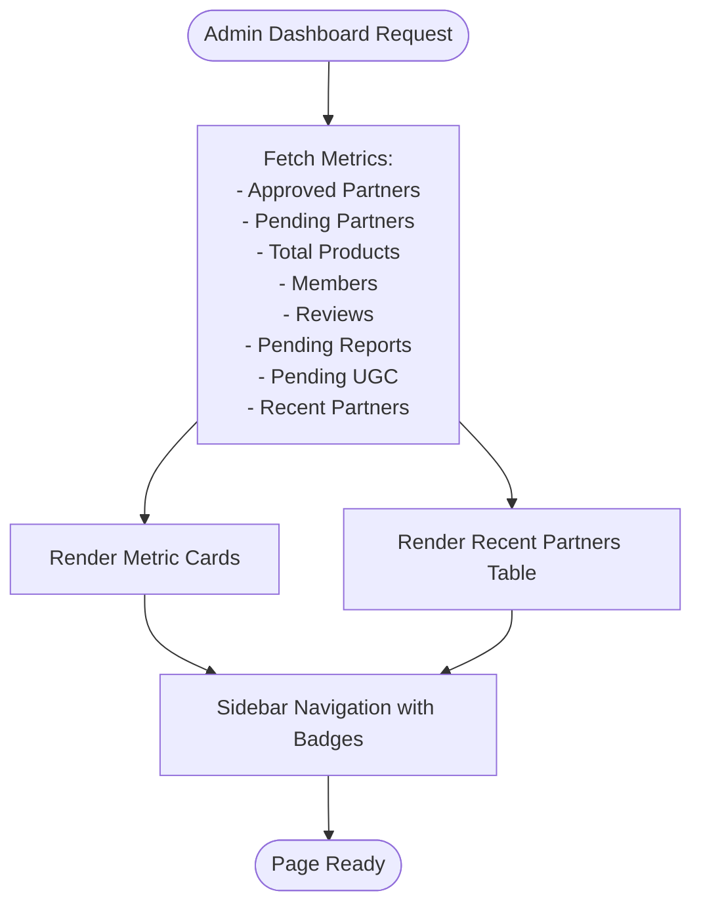
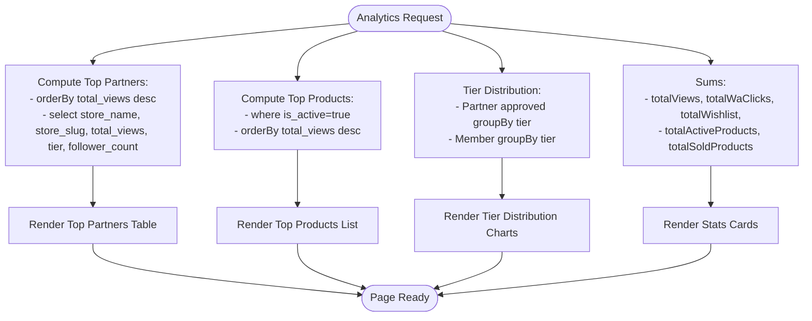
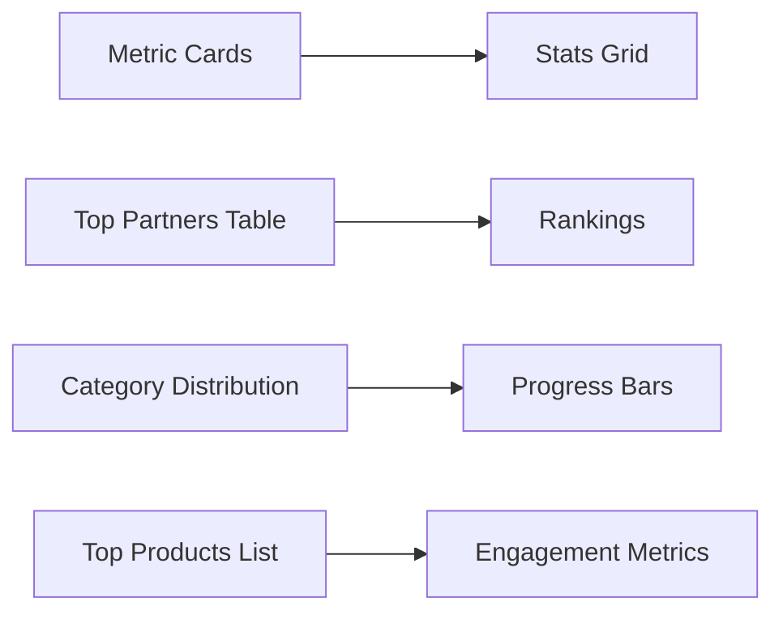
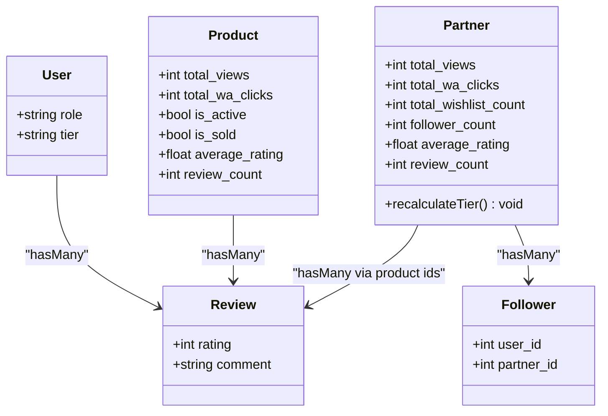
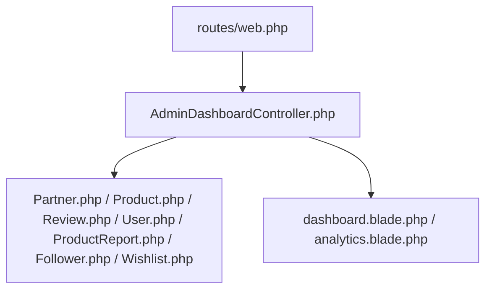

# Admin Dashboard and Analytics

<cite>
**Referenced Files in This Document**
- [AdminDashboardController.php](file://app/Http/Controllers/AdminDashboardController.php)
- [web.php](file://routes/web.php)
- [dashboard.blade.php](file://resources/views/admin/dashboard.blade.php)
- [analytics.blade.php](file://resources/views/admin/analytics.blade.php)
- [Partner.php](file://app/Models/Partner.php)
- [Product.php](file://app/Models/Product.php)
- [Review.php](file://app/Models/Review.php)
- [User.php](file://app/Models/User.php)
- [ProductReport.php](file://app/Models/ProductReport.php)
- [Follower.php](file://app/Models/Follower.php)
- [Wishlist.php](file://app/Models/Wishlist.php)
- [AdminPartnerController.php](file://app/Http/Controllers/AdminPartnerController.php)
- [AdminProductController.php](file://app/Http/Controllers/AdminProductController.php)
- [catalog.php](file://config/catalog.php)
</cite>

## Table of Contents
1. [Introduction](#introduction)
2. [Project Structure](#project-structure)
3. [Core Components](#core-components)
4. [Architecture Overview](#architecture-overview)
5. [Detailed Component Analysis](#detailed-component-analysis)
6. [Dependency Analysis](#dependency-analysis)
7. [Performance Considerations](#performance-considerations)
8. [Troubleshooting Guide](#troubleshooting-guide)
9. [Conclusion](#conclusion)
10. [Appendices](#appendices)

## Introduction
This document describes the Admin Dashboard and Analytics system, focusing on:
- Dashboard overview with key metrics: total partners, pending approvals, product counts, member statistics, review volumes, and pending reports.
- Analytics reporting features: top-performing partners, popular products, tier distribution analysis, and system-wide performance metrics.
- Data visualization components, real-time statistics, and business intelligence features.
- Practical examples of navigation, metric interpretation, and trend analysis workflows.
- Integration between dashboard widgets and underlying data models, performance optimization for large datasets, and custom reporting capabilities.

## Project Structure
The Admin Dashboard and Analytics are implemented via:
- Web routes under the admin prefix that map to controller actions.
- Controllers that compute aggregated metrics and pass them to Blade templates.
- Blade views that render cards, tables, and progress bars for quick insights.
- Eloquent models that encapsulate relationships and computed attributes used in analytics.

**Diagram sources**
- [web.php:170-239](file://routes/web.php#L170-L239)
- [AdminDashboardController.php:14-66](file://app/Http/Controllers/AdminDashboardController.php#L14-L66)
- [AdminPartnerController.php:13-76](file://app/Http/Controllers/AdminPartnerController.php#L13-L76)
- [AdminProductController.php:9-37](file://app/Http/Controllers/AdminProductController.php#L9-L37)
- [dashboard.blade.php:1-130](file://resources/views/admin/dashboard.blade.php#L1-L130)
- [analytics.blade.php:1-110](file://resources/views/admin/analytics.blade.php#L1-L110)
- [Partner.php:8-123](file://app/Models/Partner.php#L8-L123)
- [Product.php:9-132](file://app/Models/Product.php#L9-L132)
- [Review.php:7-30](file://app/Models/Review.php#L7-L30)
- [User.php:10-131](file://app/Models/User.php#L10-L131)
- [ProductReport.php:7-27](file://app/Models/ProductReport.php#L7-L27)
- [Follower.php:6-23](file://app/Models/Follower.php#L6-L23)
- [Wishlist.php:7-29](file://app/Models/Wishlist.php#L7-L29)

**Section sources**
- [web.php:170-239](file://routes/web.php#L170-L239)
- [AdminDashboardController.php:14-66](file://app/Http/Controllers/AdminDashboardController.php#L14-L66)
- [dashboard.blade.php:1-130](file://resources/views/admin/dashboard.blade.php#L1-L130)
- [analytics.blade.php:1-110](file://resources/views/admin/analytics.blade.php#L1-L110)

## Core Components
- AdminDashboardController
  - Provides the dashboard overview and analytics pages.
  - Aggregates counts and lists for rendering in Blade templates.
- Blade Templates
  - dashboard.blade.php renders key metrics cards and recent partner approvals.
  - analytics.blade.php renders system-wide stats and top performers.
- Models
  - Partner, Product, Review, User, ProductReport, Follower, Wishlist provide relationships and computed attributes used in analytics.

Key responsibilities:
- Dashboard overview: total partners, pending approvals, total products, member counts, review totals, pending reports, pending UGC, and recent partner approvals.
- Analytics: top partners by views, top products by views, tier distributions for partners and members, plus additional metrics like total views, total WhatsApp clicks, total wishlist, total active products, and total sold products.

**Section sources**
- [AdminDashboardController.php:16-65](file://app/Http/Controllers/AdminDashboardController.php#L16-L65)
- [dashboard.blade.php:89-126](file://resources/views/admin/dashboard.blade.php#L89-L126)
- [analytics.blade.php:64-106](file://resources/views/admin/analytics.blade.php#L64-L106)
- [Partner.php:28-121](file://app/Models/Partner.php#L28-L121)
- [Product.php:36-130](file://app/Models/Product.php#L36-L130)
- [Review.php:20-29](file://app/Models/Review.php#L20-L29)
- [User.php:28-130](file://app/Models/User.php#L28-L130)
- [ProductReport.php:17-26](file://app/Models/ProductReport.php#L17-L26)
- [Follower.php:13-22](file://app/Models/Follower.php#L13-L22)
- [Wishlist.php:19-28](file://app/Models/Wishlist.php#L19-L28)

## Architecture Overview
The admin analytics pipeline follows a standard MVC pattern:
- Routes define admin endpoints.
- Controllers fetch data from models and pass it to views.
- Views render cards, tables, and progress bars.

**Diagram sources**
- [web.php:174-239](file://routes/web.php#L174-L239)
- [AdminDashboardController.php:16-65](file://app/Http/Controllers/AdminDashboardController.php#L16-L65)
- [Partner.php:8-123](file://app/Models/Partner.php#L8-L123)
- [Product.php:9-132](file://app/Models/Product.php#L9-L132)
- [Review.php:7-30](file://app/Models/Review.php#L7-L30)
- [User.php:10-131](file://app/Models/User.php#L10-L131)
- [ProductReport.php:7-27](file://app/Models/ProductReport.php#L7-L27)
- [dashboard.blade.php:1-130](file://resources/views/admin/dashboard.blade.php#L1-L130)
- [analytics.blade.php:1-110](file://resources/views/admin/analytics.blade.php#L1-L110)

## Detailed Component Analysis

### Admin Dashboard Overview
The dashboard aggregates key operational metrics:
- Total approved partners
- Pending partner applications
- Total products
- Member count
- Total reviews
- Pending reports
- Pending UGC photos
- Recent partner approvals (up to five)

Rendering highlights:
- Metric cards for quick at-a-glance insights.
- Sidebar navigation with badges indicating pending items.
- Action buttons for approving new partners.

**Diagram sources**
- [AdminDashboardController.php:16-29](file://app/Http/Controllers/AdminDashboardController.php#L16-L29)
- [dashboard.blade.php:89-126](file://resources/views/admin/dashboard.blade.php#L89-L126)

**Section sources**
- [AdminDashboardController.php:16-29](file://app/Http/Controllers/AdminDashboardController.php#L16-L29)
- [dashboard.blade.php:89-126](file://resources/views/admin/dashboard.blade.php#L89-L126)
- [web.php:174-182](file://routes/web.php#L174-L182)

### Analytics Reporting Features
The analytics page presents:
- System-wide stats: total product views, total WhatsApp clicks, total wishlist, total active products, total sold products.
- Top-performing partners by product count and engagement metrics.
- Category distribution visualization for products.
- Tier distribution for partners and members.

**Diagram sources**
- [AdminDashboardController.php:31-65](file://app/Http/Controllers/AdminDashboardController.php#L31-L65)
- [analytics.blade.php:64-106](file://resources/views/admin/analytics.blade.php#L64-L106)

**Section sources**
- [AdminDashboardController.php:31-65](file://app/Http/Controllers/AdminDashboardController.php#L31-L65)
- [analytics.blade.php:64-106](file://resources/views/admin/analytics.blade.php#L64-L106)

### Data Visualization Components
- Metric cards: grid layout displaying counts and labels.
- Progress bars: category distribution rendered as horizontal bars with percentages.
- Tables: recent partners and top performers with action controls.

**Diagram sources**
- [dashboard.blade.php:22-28](file://resources/views/admin/dashboard.blade.php#L22-L28)
- [analytics.blade.php:94-106](file://resources/views/admin/analytics.blade.php#L94-L106)

**Section sources**
- [dashboard.blade.php:22-28](file://resources/views/admin/dashboard.blade.php#L22-L28)
- [analytics.blade.php:94-106](file://resources/views/admin/analytics.blade.php#L94-L106)

### Real-Time Statistics and Business Intelligence
- Computed attributes in models support real-time insights:
  - Partner average rating and review count derived from related reviews.
  - Product average rating and review count derived from related reviews.
  - Follower counts for partners.
- Tier calculations help classify performance dynamically.

**Diagram sources**
- [Partner.php:61-121](file://app/Models/Partner.php#L61-L121)
- [Product.php:86-94](file://app/Models/Product.php#L86-L94)
- [Review.php:16-28](file://app/Models/Review.php#L16-L28)
- [User.php:33-66](file://app/Models/User.php#L33-L66)
- [Follower.php:13-22](file://app/Models/Follower.php#L13-L22)

**Section sources**
- [Partner.php:61-121](file://app/Models/Partner.php#L61-L121)
- [Product.php:86-94](file://app/Models/Product.php#L86-L94)
- [Review.php:16-28](file://app/Models/Review.php#L16-L28)
- [User.php:33-66](file://app/Models/User.php#L33-L66)
- [Follower.php:13-22](file://app/Models/Follower.php#L13-L22)

### Practical Examples and Workflows
- Dashboard navigation
  - From the admin login, navigate to the dashboard to see key metrics.
  - Use sidebar links to manage partners, products, reviews, reports, UGC, badges, and analytics.
- Metric interpretation
  - Pending approvals: use the badge count to prioritize review and approval actions.
  - Top partners/products: focus on high-traffic stores and items to inform promotional decisions.
  - Tier distributions: assess performance segmentation across partners and members.
- Trend analysis
  - Compare top partners and products across timeframes by re-running analytics.
  - Monitor category distribution shifts to guide inventory and editorial strategies.

[No sources needed since this section provides general guidance]

### Integration Between Widgets and Data Models
- AdminDashboardController delegates aggregation to Eloquent queries and model relations.
- Blade templates consume controller-provided arrays and model attributes.
- Routes bind URLs to controller actions, ensuring consistent navigation.

**Section sources**
- [AdminDashboardController.php:16-65](file://app/Http/Controllers/AdminDashboardController.php#L16-L65)
- [web.php:174-239](file://routes/web.php#L174-L239)
- [dashboard.blade.php:1-130](file://resources/views/admin/dashboard.blade.php#L1-L130)
- [analytics.blade.php:1-110](file://resources/views/admin/analytics.blade.php#L1-L110)

### Custom Reporting Capabilities
- Current analytics include top performers and distributions.
- To extend reporting:
  - Add new controller actions to compute additional aggregations.
  - Introduce new Blade templates or sections to visualize new metrics.
  - Leverage existing model relations and computed attributes to minimize duplication.

[No sources needed since this section provides general guidance]

## Dependency Analysis
The admin analytics stack exhibits low coupling and clear separation of concerns:
- Routes depend on controllers.
- Controllers depend on models for data retrieval.
- Views depend on controller-provided data and model attributes.

**Diagram sources**
- [web.php:174-239](file://routes/web.php#L174-L239)
- [AdminDashboardController.php:14-66](file://app/Http/Controllers/AdminDashboardController.php#L14-L66)
- [Partner.php:8-123](file://app/Models/Partner.php#L8-L123)
- [Product.php:9-132](file://app/Models/Product.php#L9-L132)
- [Review.php:7-30](file://app/Models/Review.php#L7-L30)
- [User.php:10-131](file://app/Models/User.php#L10-L131)
- [ProductReport.php:7-27](file://app/Models/ProductReport.php#L7-L27)
- [Follower.php:6-23](file://app/Models/Follower.php#L6-L23)
- [Wishlist.php:7-29](file://app/Models/Wishlist.php#L7-L29)
- [dashboard.blade.php:1-130](file://resources/views/admin/dashboard.blade.php#L1-L130)
- [analytics.blade.php:1-110](file://resources/views/admin/analytics.blade.php#L1-L110)

**Section sources**
- [web.php:174-239](file://routes/web.php#L174-L239)
- [AdminDashboardController.php:14-66](file://app/Http/Controllers/AdminDashboardController.php#L14-L66)

## Performance Considerations
- Prefer aggregated queries and plucks to avoid loading unnecessary records.
- Use pagination for large lists (e.g., partner and product listings).
- Consider indexing frequently filtered columns (status, role, is_active, is_sold) to speed up counts and sorts.
- Cache periodic aggregates if real-time updates are not required.
- Minimize N+1 queries by eager-loading relationships in controllers.

[No sources needed since this section provides general guidance]

## Troubleshooting Guide
- Missing analytics data
  - Verify that Partner and Product models have populated total_views and related metrics.
  - Confirm that Review records exist for accurate average ratings.
- Incorrect counts
  - Ensure filters align with intended statuses (approved vs pending, active vs sold).
  - Validate that computed attributes (average_rating, review_count) are recalculated as needed.
- Navigation badges not updating
  - Confirm route bindings and controller actions for pending counts.
  - Check sidebar rendering logic for badge visibility.

**Section sources**
- [AdminDashboardController.php:16-65](file://app/Http/Controllers/AdminDashboardController.php#L16-L65)
- [AdminPartnerController.php:15-76](file://app/Http/Controllers/AdminPartnerController.php#L15-L76)
- [AdminProductController.php:11-37](file://app/Http/Controllers/AdminProductController.php#L11-L37)
- [Partner.php:61-121](file://app/Models/Partner.php#L61-L121)
- [Product.php:86-94](file://app/Models/Product.php#L86-L94)
- [Review.php:16-28](file://app/Models/Review.php#L16-L28)

## Conclusion
The Admin Dashboard and Analytics system provides a concise yet powerful interface for monitoring platform health and performance. It leverages Eloquent relationships and computed attributes to deliver actionable insights, while Blade templates present data in digestible formats. Extending the system involves adding new controller actions, views, and model computations aligned with business needs.

[No sources needed since this section summarizes without analyzing specific files]

## Appendices
- Configuration
  - Store branding and catalog metadata influence page titles and labels.

**Section sources**
- [catalog.php:4-10](file://config/catalog.php#L4-L10)