# Administrative System

<cite>
**Referenced Files in This Document**
- [AdminAuthController.php](file://app/Http/Controllers/AdminAuthController.php)
- [AdminDashboardController.php](file://app/Http/Controllers/AdminDashboardController.php)
- [AdminPartnerController.php](file://app/Http/Controllers/AdminPartnerController.php)
- [AdminProductController.php](file://app/Http/Controllers/AdminProductController.php)
- [AdminReportController.php](file://app/Http/Controllers/AdminReportController.php)
- [AdminUgcController.php](file://app/Http/Controllers/AdminUgcController.php)
- [AdminReviewController.php](file://app/Http/Controllers/AdminReviewController.php)
- [AdminOutfitController.php](file://app/Http/Controllers/AdminOutfitController.php)
- [EnsureAdminAuthenticated.php](file://app/Http/Middleware/EnsureAdminAuthenticated.php)
- [web.php](file://routes/web.php)
- [admin.php](file://config/admin.php)
- [dashboard.blade.php](file://resources/views/admin/dashboard.blade.php)
- [analytics.blade.php](file://resources/views/admin/analytics.blade.php)
- [ActivityLog.php](file://app/Models/ActivityLog.php)
</cite>

## Table of Contents
1. [Introduction](#introduction)
2. [Project Structure](#project-structure)
3. [Core Components](#core-components)
4. [Architecture Overview](#architecture-overview)
5. [Detailed Component Analysis](#detailed-component-analysis)
6. [Dependency Analysis](#dependency-analysis)
7. [Performance Considerations](#performance-considerations)
8. [Troubleshooting Guide](#troubleshooting-guide)
9. [Conclusion](#conclusion)
10. [Appendices](#appendices)

## Introduction
This document describes KatalogThrift’s administrative system, focusing on the admin dashboard, analytics, moderation, content management, partner oversight, and operational controls. It explains how administrators authenticate, navigate the admin portal, moderate content, manage partners and products, review reports and UGC, and monitor platform performance. Practical workflows and security measures are included to guide daily administrative tasks.

## Project Structure
The admin system is organized around dedicated controllers, middleware, routes, and Blade templates. Controllers encapsulate actions for dashboards, moderation, analytics, and content management. Routes define the admin entry path and grouped endpoints under the admin namespace. Middleware enforces admin authentication. Blade templates render the admin UI.

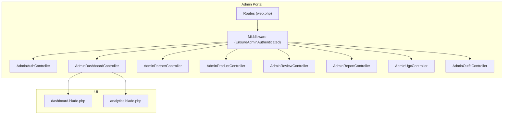

**Diagram sources**
- [web.php:169-239](file://routes/web.php#L169-L239)
- [EnsureAdminAuthenticated.php:1-25](file://app/Http/Middleware/EnsureAdminAuthenticated.php#L1-L25)
- [AdminAuthController.php:1-54](file://app/Http/Controllers/AdminAuthController.php#L1-L54)
- [AdminDashboardController.php:1-67](file://app/Http/Controllers/AdminDashboardController.php#L1-L67)
- [AdminPartnerController.php:1-76](file://app/Http/Controllers/AdminPartnerController.php#L1-L76)
- [AdminProductController.php:1-37](file://app/Http/Controllers/AdminProductController.php#L1-L37)
- [AdminReviewController.php:1-49](file://app/Http/Controllers/AdminReviewController.php#L1-L49)
- [AdminReportController.php:1-52](file://app/Http/Controllers/AdminReportController.php#L1-L52)
- [AdminUgcController.php:1-44](file://app/Http/Controllers/AdminUgcController.php#L1-L44)
- [AdminOutfitController.php:1-175](file://app/Http/Controllers/AdminOutfitController.php#L1-L175)
- [dashboard.blade.php:1-130](file://resources/views/admin/dashboard.blade.php#L1-L130)
- [analytics.blade.php:1-110](file://resources/views/admin/analytics.blade.php#L1-L110)

**Section sources**
- [web.php:169-239](file://routes/web.php#L169-L239)
- [admin.php:1-8](file://config/admin.php#L1-L8)

## Core Components
- Authentication and Access Control
  - Admin login/logout via controller with session-based authentication and constant-time credential comparison.
  - Middleware ensures only authenticated admin requests proceed to admin routes.
  - Configuration defines admin entry path and credentials.

- Dashboard and Analytics
  - Dashboard aggregates counts for approved partners, pending partners, total products, members, reviews, pending reports, and pending UGC.
  - Analytics page presents top-performing partners/products, tier distributions, and summary metrics.

- Moderation and Content Management
  - Partner management: approve, reject, suspend, toggle verified badge.
  - Product management: activate/deactivate and delete.
  - Review moderation: approve or hide; delete reviews.
  - Report resolution: mark resolved or ignored with resolution notes.
  - UGC moderation: approve, reject, toggle featured, delete photos.
  - Curated Outfit management: create, edit, delete, toggle active; associate products with hotspots and notes.

- Operational Controls
  - Admin entry path configured via environment variables.
  - CSRF protection enforced for admin forms.
  - Pagination used across listings for performance and usability.

**Section sources**
- [AdminAuthController.php:11-52](file://app/Http/Controllers/AdminAuthController.php#L11-L52)
- [EnsureAdminAuthenticated.php:16-23](file://app/Http/Middleware/EnsureAdminAuthenticated.php#L16-L23)
- [admin.php:4-7](file://config/admin.php#L4-L7)
- [AdminDashboardController.php:16-65](file://app/Http/Controllers/AdminDashboardController.php#L16-L65)
- [AdminPartnerController.php:15-75](file://app/Http/Controllers/AdminPartnerController.php#L15-L75)
- [AdminProductController.php:11-36](file://app/Http/Controllers/AdminProductController.php#L11-L36)
- [AdminReviewController.php:11-48](file://app/Http/Controllers/AdminReviewController.php#L11-L48)
- [AdminReportController.php:12-51](file://app/Http/Controllers/AdminReportController.php#L12-L51)
- [AdminUgcController.php:10-43](file://app/Http/Controllers/AdminUgcController.php#L10-L43)
- [AdminOutfitController.php:15-175](file://app/Http/Controllers/AdminOutfitController.php#L15-L175)

## Architecture Overview
The admin portal is a server-rendered MVC application:
- Routes define the admin entry path and grouped endpoints.
- Middleware enforces admin authentication.
- Controllers fetch data from Eloquent models and pass it to Blade views.
- Views render navigation, statistics, and actionable forms.

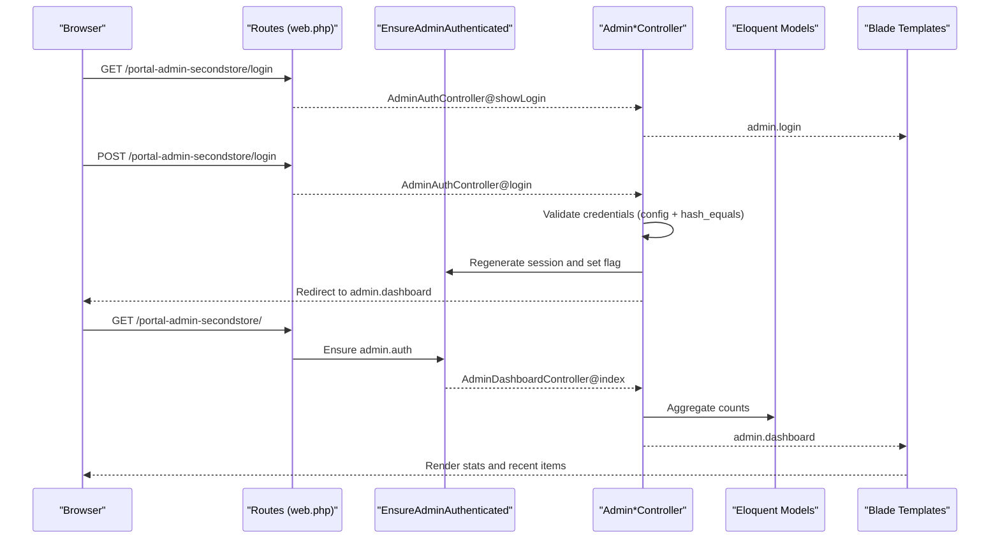

**Diagram sources**
- [web.php:170-177](file://routes/web.php#L170-L177)
- [EnsureAdminAuthenticated.php:16-23](file://app/Http/Middleware/EnsureAdminAuthenticated.php#L16-L23)
- [AdminAuthController.php:20-43](file://app/Http/Controllers/AdminAuthController.php#L20-L43)
- [AdminDashboardController.php:16-29](file://app/Http/Controllers/AdminDashboardController.php#L16-L29)
- [dashboard.blade.php:52-126](file://resources/views/admin/dashboard.blade.php#L52-L126)

## Detailed Component Analysis

### Admin Authentication and Access Control
- Login flow validates credentials against configuration values using constant-time comparison to mitigate timing attacks. On success, a new session is regenerated and an admin flag is stored.
- Logout invalidates the session and regenerates the CSRF token.
- Middleware checks the admin session flag and redirects unauthenticated requests to the login page.

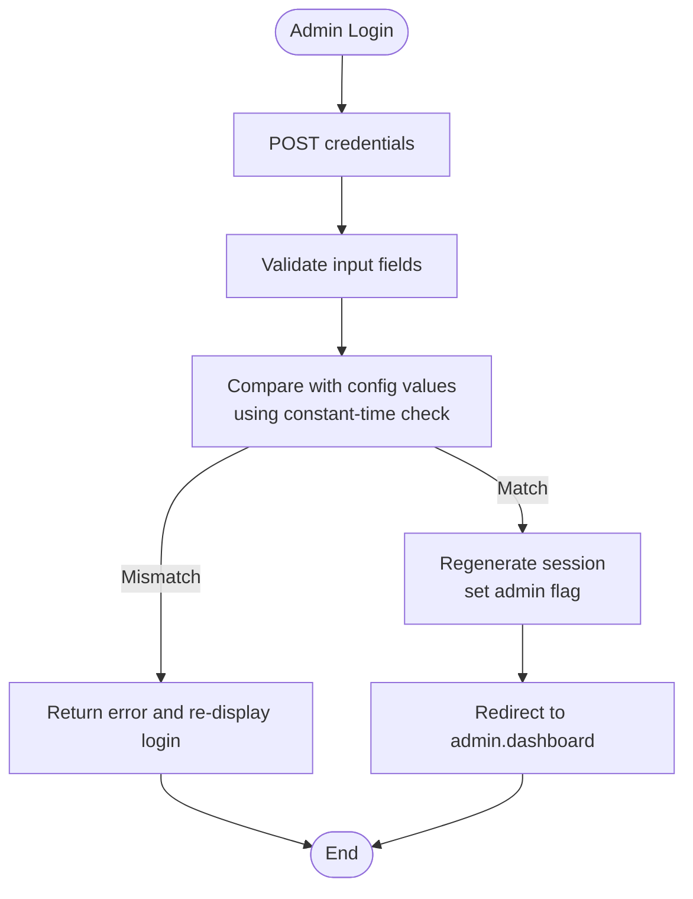

**Diagram sources**
- [AdminAuthController.php:20-43](file://app/Http/Controllers/AdminAuthController.php#L20-L43)
- [admin.php:5-6](file://config/admin.php#L5-L6)

**Section sources**
- [AdminAuthController.php:11-52](file://app/Http/Controllers/AdminAuthController.php#L11-L52)
- [EnsureAdminAuthenticated.php:16-23](file://app/Http/Middleware/EnsureAdminAuthenticated.php#L16-L23)
- [admin.php:4-7](file://config/admin.php#L4-L7)

### Admin Dashboard
- Displays key metrics: total approved partners, pending partners, total products, total members, total reviews, pending reports, and pending UGC.
- Shows recent pending partner registrations with quick approve/action buttons.
- Navigation includes links to partner management, product listings, curated outfits, editorial, UGC, reviews, reports, badges, analytics, notifications, and a link to the public site.

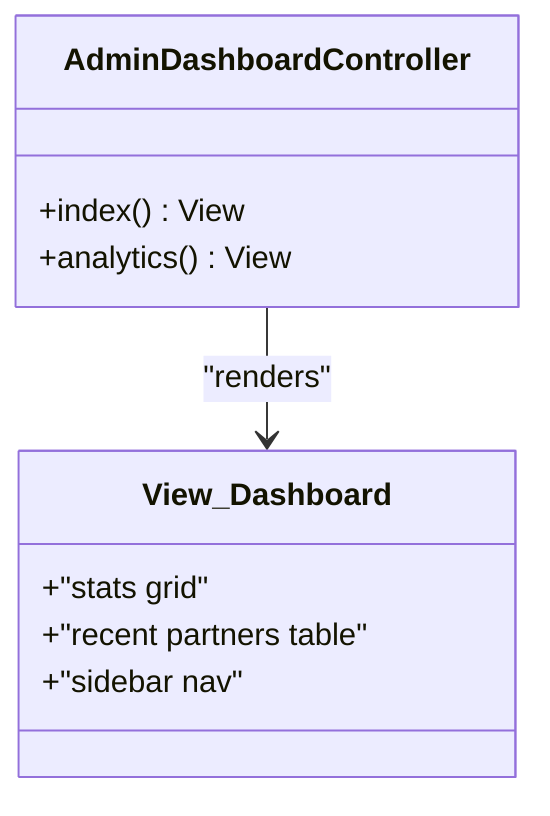

**Diagram sources**
- [AdminDashboardController.php:16-29](file://app/Http/Controllers/AdminDashboardController.php#L16-L29)
- [dashboard.blade.php:89-126](file://resources/views/admin/dashboard.blade.php#L89-L126)

**Section sources**
- [AdminDashboardController.php:16-29](file://app/Http/Controllers/AdminDashboardController.php#L16-L29)
- [dashboard.blade.php:1-130](file://resources/views/admin/dashboard.blade.php#L1-L130)

### Analytics Reporting
- Presents aggregated metrics such as total product views, WhatsApp clicks, wishlist totals, active products, and sold products.
- Lists top partners by active product count and top products by views.
- Shows tier distribution for partners and members.

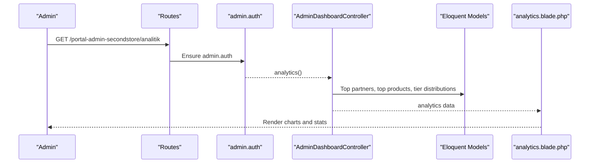

**Diagram sources**
- [web.php:237-237](file://routes/web.php#L237-L237)
- [AdminDashboardController.php:31-65](file://app/Http/Controllers/AdminDashboardController.php#L31-L65)
- [analytics.blade.php:64-106](file://resources/views/admin/analytics.blade.php#L64-L106)

**Section sources**
- [AdminDashboardController.php:31-65](file://app/Http/Controllers/AdminDashboardController.php#L31-L65)
- [analytics.blade.php:1-110](file://resources/views/admin/analytics.blade.php#L1-L110)

### Partner Management and Approval
- Index filters by status (pending, approved, suspended, rejected) with pagination.
- Approve sets status to approved and clears rejection reason.
- Reject requires a reason and marks status as rejected.
- Suspend optionally records a reason and marks status as suspended.
- Toggle verified badge on/off for a partner.

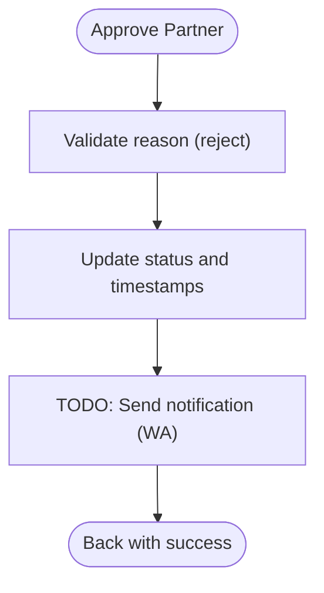

**Diagram sources**
- [AdminPartnerController.php:30-53](file://app/Http/Controllers/AdminPartnerController.php#L30-L53)

**Section sources**
- [AdminPartnerController.php:15-75](file://app/Http/Controllers/AdminPartnerController.php#L15-L75)

### Product Management
- Index lists products with partner relations and paginated results.
- Toggle activation/deactivation of a product.
- Delete a product permanently.

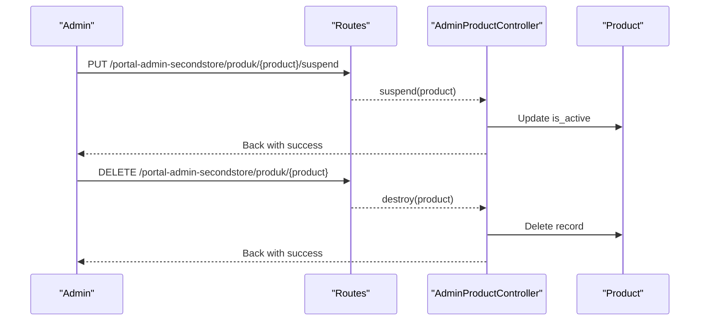

**Diagram sources**
- [web.php:186-188](file://routes/web.php#L186-L188)
- [AdminProductController.php:24-35](file://app/Http/Controllers/AdminProductController.php#L24-L35)

**Section sources**
- [AdminProductController.php:11-36](file://app/Http/Controllers/AdminProductController.php#L11-L36)

### Review Moderation
- Index lists reviews with user and product/partner relations.
- Approve sets approval flag and records moderator metadata.
- Hide removes visibility while retaining the record.
- Destroy deletes the review.

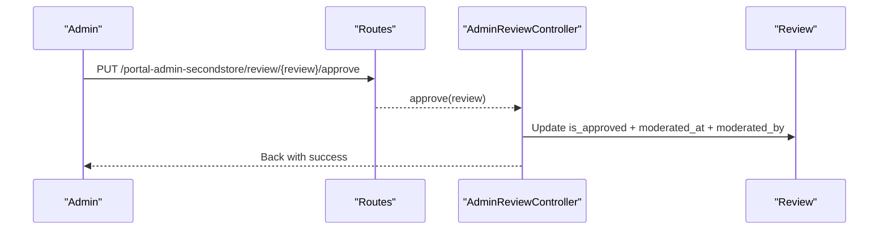

**Diagram sources**
- [web.php:191-194](file://routes/web.php#L191-L194)
- [AdminReviewController.php:23-30](file://app/Http/Controllers/AdminReviewController.php#L23-L30)

**Section sources**
- [AdminReviewController.php:11-48](file://app/Http/Controllers/AdminReviewController.php#L11-L48)

### Report Management
- Index filters by status (pending, resolved, ignored) with pagination.
- Resolve marks a report as resolved and optionally stores resolution notes and the resolver identity.
- Ignore marks a report as ignored with resolver identity.

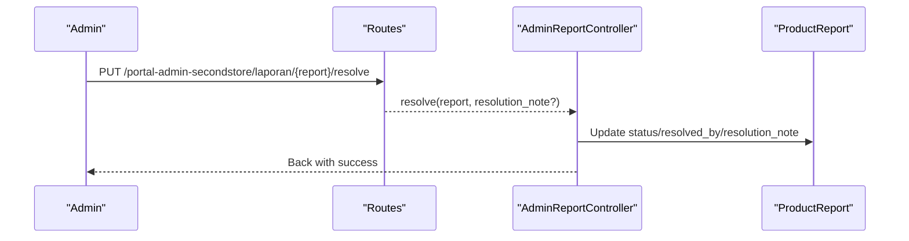

**Diagram sources**
- [web.php:196-199](file://routes/web.php#L196-L199)
- [AdminReportController.php:27-39](file://app/Http/Controllers/AdminReportController.php#L27-L39)

**Section sources**
- [AdminReportController.php:12-51](file://app/Http/Controllers/AdminReportController.php#L12-L51)

### UGC Moderation
- Index lists UGC photos with user and product/partner relations.
- Approve makes a photo visible in community.
- Reject hides a photo.
- Toggle featured promotes/removes a photo from featured.
- Destroy deletes a photo.

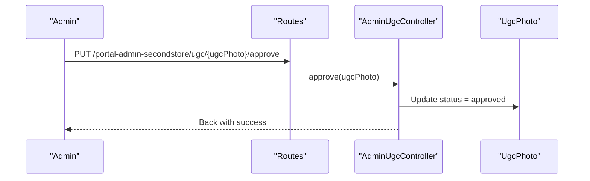

**Diagram sources**
- [web.php:218-223](file://routes/web.php#L218-L223)
- [AdminUgcController.php:20-24](file://app/Http/Controllers/AdminUgcController.php#L20-L24)

**Section sources**
- [AdminUgcController.php:10-43](file://app/Http/Controllers/AdminUgcController.php#L10-L43)

### Curated Outfit Management
- Create form preloads eligible products and styles; supports cover image upload and optional cover video.
- Store persists the outfit, associates products with sort order, notes, and hotspots, and returns to index.
- Edit loads existing items and allows updates; replaces associated items on save.
- Destroy removes cover image (if stored), associated items, and the outfit.
- Toggle active switches visibility.

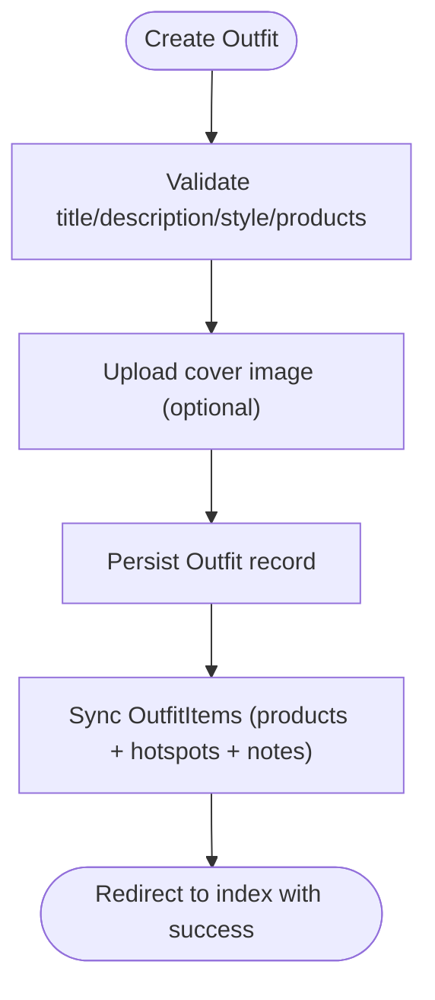

**Diagram sources**
- [AdminOutfitController.php:44-82](file://app/Http/Controllers/AdminOutfitController.php#L44-L82)
- [AdminOutfitController.php:159-173](file://app/Http/Controllers/AdminOutfitController.php#L159-L173)

**Section sources**
- [AdminOutfitController.php:15-175](file://app/Http/Controllers/AdminOutfitController.php#L15-L175)

### Conceptual Overview
- Spam Detection Systems: No explicit spam detection logic is present in the reviewed controllers. Administrators rely on manual moderation of reports, reviews, UGC, and partner applications.
- Automated Moderation Features: No automated moderation hooks are implemented in the reviewed code. Moderation actions are initiated manually by admins.
- Content Moderation and Editorial Workflows: Editorial article management exists under the admin namespace; moderation workflows are handled via approvals/hides and status toggles.
- Quality Control Measures: Tier distributions and top performer lists support quality oversight; activation/deactivation flags control visibility.

[No sources needed since this section doesn't analyze specific source files]

## Dependency Analysis
- Route-to-Middleware-to-Controller
  - Admin routes are grouped under a configurable entry path and protected by the admin.auth middleware alias.
  - Controllers depend on Eloquent models for data retrieval and persistence.
- View-to-Controller Data Flow
  - Controllers pass aggregated data to Blade views for rendering statistics and actionable tables.

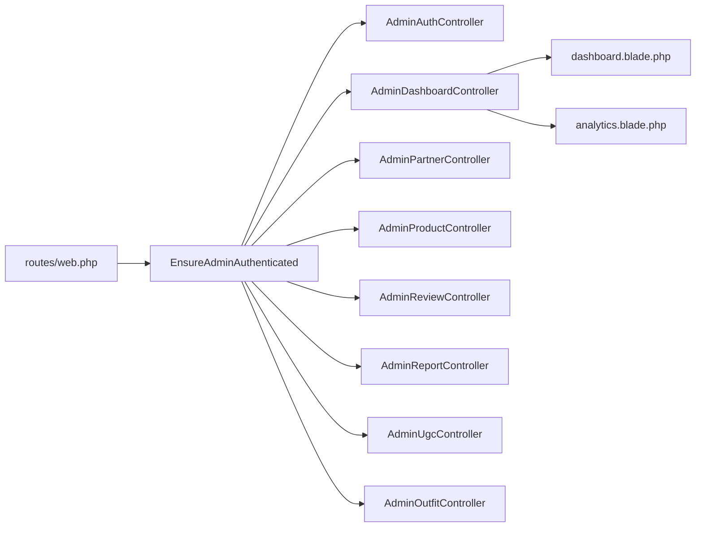

**Diagram sources**
- [web.php:169-239](file://routes/web.php#L169-L239)
- [EnsureAdminAuthenticated.php:16-23](file://app/Http/Middleware/EnsureAdminAuthenticated.php#L16-L23)
- [AdminDashboardController.php:16-65](file://app/Http/Controllers/AdminDashboardController.php#L16-L65)
- [dashboard.blade.php:1-130](file://resources/views/admin/dashboard.blade.php#L1-L130)
- [analytics.blade.php:1-110](file://resources/views/admin/analytics.blade.php#L1-L110)

**Section sources**
- [web.php:169-239](file://routes/web.php#L169-L239)

## Performance Considerations
- Pagination is used across listings (partners, products, reviews, reports, UGC) to limit payload sizes and improve responsiveness.
- Aggregation queries in the dashboard controller compute counts and top performers; consider caching these metrics for high-traffic periods.
- Image uploads for outfits should be optimized; ensure appropriate disk quotas and consider CDN integration for cover images.

[No sources needed since this section provides general guidance]

## Troubleshooting Guide
- Admin login fails
  - Verify admin credentials in configuration and ensure constant-time comparison succeeds.
  - Confirm session regeneration and admin flag setting after successful login.
- Unauthorized access attempts
  - Ensure admin.auth middleware is applied to admin routes and that the session flag is present.
- Reports not updating
  - Check resolution note validation and that resolved_by is populated upon resolution or ignore actions.
- UGC moderation actions not reflected
  - Confirm status updates and deletion of UGC photos; verify file deletion for stored cover images.
- Outfit creation/update issues
  - Validate product arrays, hotspot coordinates, and cover image constraints; ensure associated items are synced correctly.

**Section sources**
- [AdminAuthController.php:20-43](file://app/Http/Controllers/AdminAuthController.php#L20-L43)
- [EnsureAdminAuthenticated.php:16-23](file://app/Http/Middleware/EnsureAdminAuthenticated.php#L16-L23)
- [AdminReportController.php:27-50](file://app/Http/Controllers/AdminReportController.php#L27-L50)
- [AdminUgcController.php:20-42](file://app/Http/Controllers/AdminUgcController.php#L20-L42)
- [AdminOutfitController.php:44-82](file://app/Http/Controllers/AdminOutfitController.php#L44-L82)

## Conclusion
KatalogThrift’s administrative system provides a focused, session-based admin portal with robust moderation capabilities across partners, products, reviews, reports, UGC, and curated outfits. The dashboard and analytics pages offer essential oversight, while middleware and configuration enforce secure access. Manual moderation remains central, with opportunities to extend automated moderation and spam detection in future iterations.

[No sources needed since this section summarizes without analyzing specific files]

## Appendices

### Practical Admin Workflows
- Approving a New Partner
  - Navigate to partner index filtered by pending.
  - Approve the partner; optionally send a notification (placeholder).
  - Observe updated counts on the dashboard.
- Resolving a Product Report
  - Open the reports index and filter by pending.
  - Resolve the report with a resolution note and confirm success feedback.
- Managing Curated Outfits
  - Create an outfit with 2–6 products, add notes and hotspots, and publish.
  - Edit or toggle active status as needed; delete when removing.

**Section sources**
- [AdminPartnerController.php:30-41](file://app/Http/Controllers/AdminPartnerController.php#L30-L41)
- [AdminReportController.php:27-40](file://app/Http/Controllers/AdminReportController.php#L27-L40)
- [AdminOutfitController.php:28-82](file://app/Http/Controllers/AdminOutfitController.php#L28-L82)

### Security and Audit Notes
- Admin credentials are validated against configuration values using constant-time comparison.
- Session-based authentication with CSRF protection for admin forms.
- Activity logging model exists for capturing admin actions; integrate moderation actions to populate activity logs for auditability.

**Section sources**
- [AdminAuthController.php:30-33](file://app/Http/Controllers/AdminAuthController.php#L30-L33)
- [ActivityLog.php:1-23](file://app/Models/ActivityLog.php#L1-L23)