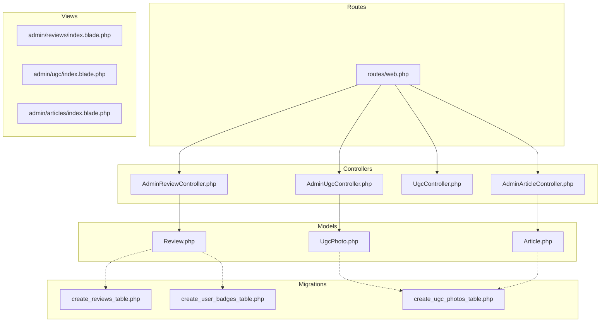
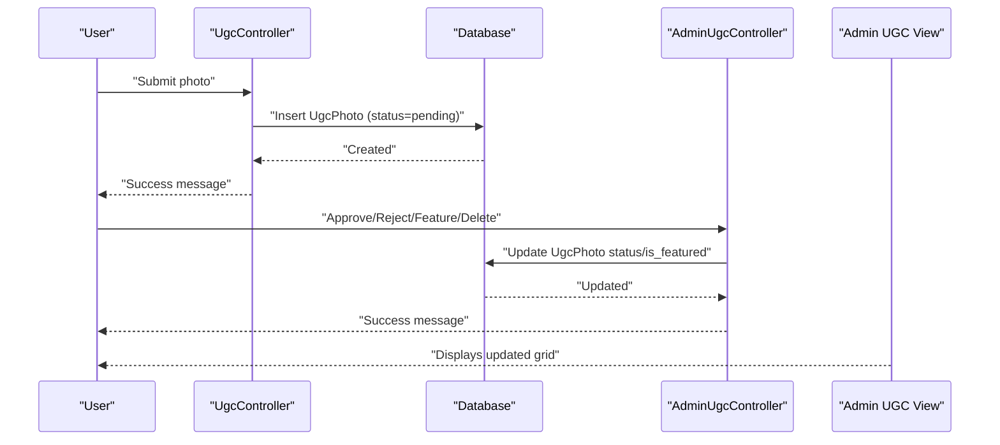
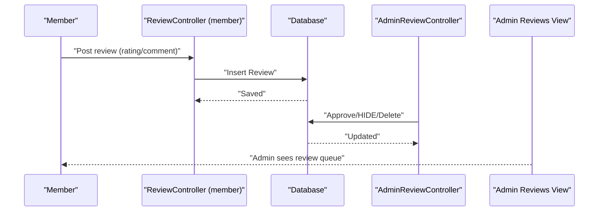
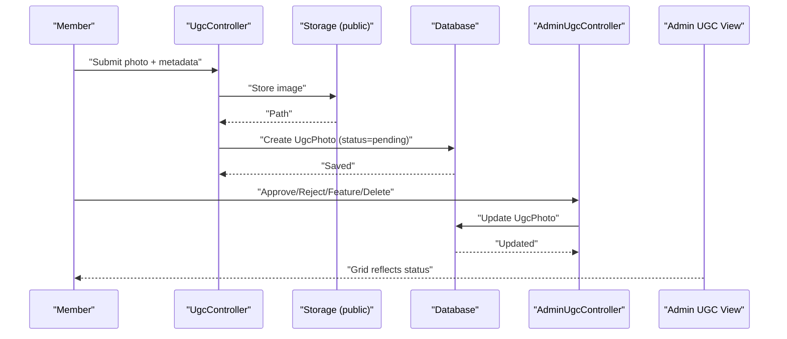
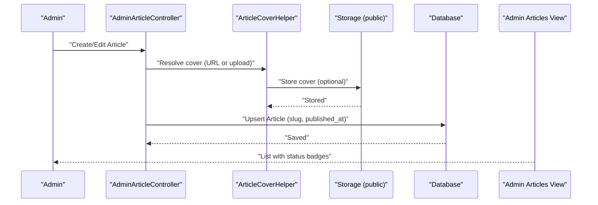
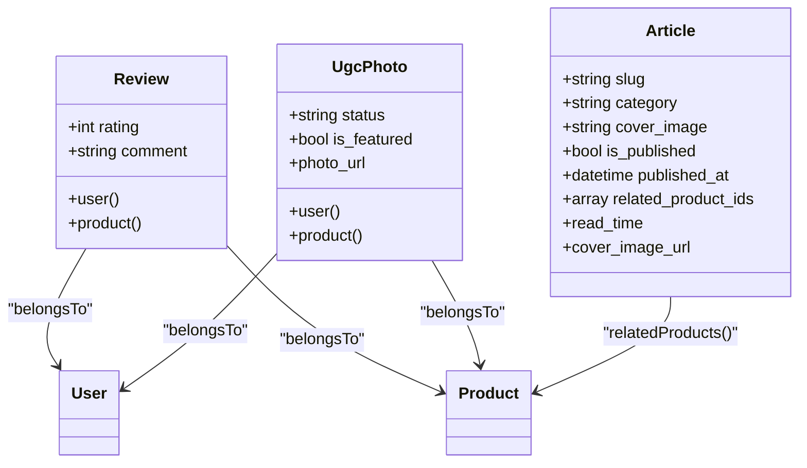
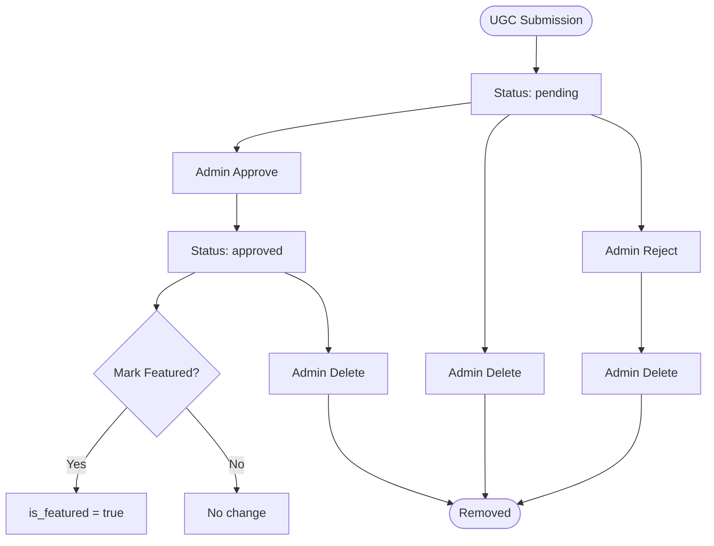
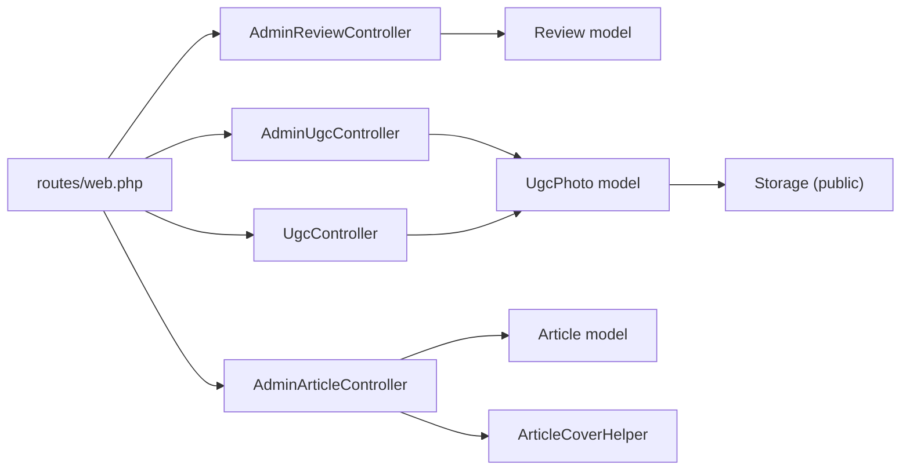

# Content Moderation and Workflow

<cite>
**Referenced Files in This Document**
- [AdminReviewController.php](file://app/Http/Controllers/AdminReviewController.php)
- [AdminUgcController.php](file://app/Http/Controllers/AdminUgcController.php)
- [UgcController.php](file://app/Http/Controllers/UgcController.php)
- [AdminArticleController.php](file://app/Http/Controllers/AdminArticleController.php)
- [Review.php](file://app/Models/Review.php)
- [UgcPhoto.php](file://app/Models/UgcPhoto.php)
- [Article.php](file://app/Models/Article.php)
- [2026_05_24_093454_create_reviews_table.php](file://database/migrations/2026_05_24_093454_create_reviews_table.php)
- [2026_05_28_131139_create_ugc_photos_table.php](file://database/migrations/2026_05_28_131139_create_ugc_photos_table.php)
- [2026_07_01_100006_create_user_badges_table.php](file://database/migrations/2026_07_01_100006_create_user_badges_table.php)
- [web.php](file://routes/web.php)
- [index.blade.php (Admin Reviews)](file://resources/views/admin/reviews/index.blade.php)
- [index.blade.php (Admin UGC)](file://resources/views/admin/ugc/index.blade.php)
- [index.blade.php (Admin Articles)](file://resources/views/admin/articles/index.blade.php)
</cite>

## Table of Contents
1. [Introduction](#introduction)
2. [Project Structure](#project-structure)
3. [Core Components](#core-components)
4. [Architecture Overview](#architecture-overview)
5. [Detailed Component Analysis](#detailed-component-analysis)
6. [Dependency Analysis](#dependency-analysis)
7. [Performance Considerations](#performance-considerations)
8. [Troubleshooting Guide](#troubleshooting-guide)
9. [Conclusion](#conclusion)
10. [Appendices](#appendices)

## Introduction
This document describes the content moderation and editorial workflow systems implemented in the platform. It covers user-generated content (UGC) moderation for photos, review moderation workflows, editorial content management, and publishing pipelines. It also outlines manual moderation actions, status tracking, and administrative controls visible in the current codebase. Automated detection, keyword filtering, and advanced compliance reporting are not present in the current implementation and are therefore not documented here.

## Project Structure
The moderation and editorial features are organized around:
- Controllers for admin-managed workflows (reviews, UGC, articles)
- Frontend controllers for UGC submission
- Eloquent models representing content entities
- Database migrations defining schema and statuses
- Blade templates implementing admin UIs
- Routes binding URLs to controllers

**Diagram sources**
- [web.php:190-224](file://routes/web.php#L190-L224)
- [AdminReviewController.php:11-47](file://app/Http/Controllers/AdminReviewController.php#L11-L47)
- [AdminUgcController.php:10-42](file://app/Http/Controllers/AdminUgcController.php#L10-L42)
- [UgcController.php:11-47](file://app/Http/Controllers/UgcController.php#L11-L47)
- [AdminArticleController.php:30-128](file://app/Http/Controllers/AdminArticleController.php#L30-L128)
- [Review.php:1-30](file://app/Models/Review.php#L1-L30)
- [UgcPhoto.php:1-24](file://app/Models/UgcPhoto.php#L1-L24)
- [Article.php:1-48](file://app/Models/Article.php#L1-L48)
- [2026_05_24_093454_create_reviews_table.php:11-21](file://database/migrations/2026_05_24_093454_create_reviews_table.php#L11-L21)
- [2026_05_28_131139_create_ugc_photos_table.php:8-21](file://database/migrations/2026_05_28_131139_create_ugc_photos_table.php#L8-L21)
- [2026_07_01_100006_create_user_badges_table.php:36-47](file://database/migrations/2026_07_01_100006_create_user_badges_table.php#L36-L47)
- [index.blade.php (Admin Reviews):50-81](file://resources/views/admin/reviews/index.blade.php#L50-L81)
- [index.blade.php (Admin UGC):65-113](file://resources/views/admin/ugc/index.blade.php#L65-L113)
- [index.blade.php (Admin Articles):53-86](file://resources/views/admin/articles/index.blade.php#L53-L86)

**Section sources**
- [web.php:190-224](file://routes/web.php#L190-L224)
- [AdminReviewController.php:11-47](file://app/Http/Controllers/AdminReviewController.php#L11-L47)
- [AdminUgcController.php:10-42](file://app/Http/Controllers/AdminUgcController.php#L10-L42)
- [UgcController.php:11-47](file://app/Http/Controllers/UgcController.php#L11-L47)
- [AdminArticleController.php:30-128](file://app/Http/Controllers/AdminArticleController.php#L30-L128)
- [Review.php:1-30](file://app/Models/Review.php#L1-L30)
- [UgcPhoto.php:1-24](file://app/Models/UgcPhoto.php#L1-L24)
- [Article.php:1-48](file://app/Models/Article.php#L1-L48)
- [2026_05_24_093454_create_reviews_table.php:11-21](file://database/migrations/2026_05_24_093454_create_reviews_table.php#L11-L21)
- [2026_05_28_131139_create_ugc_photos_table.php:8-21](file://database/migrations/2026_05_28_131139_create_ugc_photos_table.php#L8-L21)
- [2026_07_01_100006_create_user_badges_table.php:36-47](file://database/migrations/2026_07_01_100006_create_user_badges_table.php#L36-L47)
- [index.blade.php (Admin Reviews):50-81](file://resources/views/admin/reviews/index.blade.php#L50-L81)
- [index.blade.php (Admin UGC):65-113](file://resources/views/admin/ugc/index.blade.php#L65-L113)
- [index.blade.php (Admin Articles):53-86](file://resources/views/admin/articles/index.blade.php#L53-L86)

## Core Components
- Review moderation: AdminReviewController exposes index, approve, hide, and delete endpoints. Reviews are stored with user, product, rating, and comment. Additional moderation fields (approval flag, admin note, timestamps, moderator ID) are defined in a later migration.
- UGC photo moderation: AdminUgcController manages pending/approved/rejected photos and toggles featured status. UgcController handles photo submissions by authenticated users with validation and pending status assignment.
- Editorial content management: AdminArticleController supports CRUD for articles, including slug generation, published status, excerpt auto-generation, and cover image handling via helper and storage.
- Status and visibility: UgcPhoto tracks status and featured flag; Article tracks published status and related product IDs.

**Section sources**
- [AdminReviewController.php:11-47](file://app/Http/Controllers/AdminReviewController.php#L11-L47)
- [AdminUgcController.php:10-42](file://app/Http/Controllers/AdminUgcController.php#L10-L42)
- [UgcController.php:24-47](file://app/Http/Controllers/UgcController.php#L24-L47)
- [AdminArticleController.php:46-128](file://app/Http/Controllers/AdminArticleController.php#L46-L128)
- [Review.php:9-18](file://app/Models/Review.php#L9-L18)
- [UgcPhoto.php:9-13](file://app/Models/UgcPhoto.php#L9-L13)
- [Article.php:10-19](file://app/Models/Article.php#L10-L19)

## Architecture Overview
The moderation and editorial workflows follow a standard MVC pattern with explicit admin routes and controllers.

**Diagram sources**
- [UgcController.php:24-47](file://app/Http/Controllers/UgcController.php#L24-L47)
- [AdminUgcController.php:20-42](file://app/Http/Controllers/AdminUgcController.php#L20-L42)
- [2026_05_28_131139_create_ugc_photos_table.php](file://database/migrations/2026_05_28_131139_create_ugc_photos_table.php#L16)
- [index.blade.php (Admin UGC):84-105](file://resources/views/admin/ugc/index.blade.php#L84-L105)

**Section sources**
- [web.php](file://routes/web.php#L62)
- [web.php:218-223](file://routes/web.php#L218-L223)
- [UgcController.php:24-47](file://app/Http/Controllers/UgcController.php#L24-L47)
- [AdminUgcController.php:20-42](file://app/Http/Controllers/AdminUgcController.php#L20-L42)
- [index.blade.php (Admin UGC):84-105](file://resources/views/admin/ugc/index.blade.php#L84-L105)

## Detailed Component Analysis

### Review Moderation Workflow
Reviews are managed under AdminReviewController with approve/hide/delete actions. The model defines fillable attributes and relationships to user and product. A later migration adds approval flag, admin note, moderation timestamps, and moderator ID to support auditability.

**Diagram sources**
- [web.php:90-91](file://routes/web.php#L90-L91)
- [AdminReviewController.php:23-47](file://app/Http/Controllers/AdminReviewController.php#L23-L47)
- [Review.php:9-18](file://app/Models/Review.php#L9-L18)
- [2026_07_01_100006_create_user_badges_table.php:36-41](file://database/migrations/2026_07_01_100006_create_user_badges_table.php#L36-L41)
- [index.blade.php (Admin Reviews):58-78](file://resources/views/admin/reviews/index.blade.php#L58-L78)

**Section sources**
- [AdminReviewController.php:11-47](file://app/Http/Controllers/AdminReviewController.php#L11-L47)
- [Review.php:9-18](file://app/Models/Review.php#L9-L18)
- [2026_07_01_100006_create_user_badges_table.php:36-41](file://database/migrations/2026_07_01_100006_create_user_badges_table.php#L36-L41)
- [index.blade.php (Admin Reviews):58-78](file://resources/views/admin/reviews/index.blade.php#L58-L78)

### UGC Photo Moderation Workflow
UGC submission is handled by UgcController, which validates inputs and stores images under the public disk. Photos are initially pending. AdminUgcController approves, rejects, toggles featured, and deletes photos. The UgcPhoto model resolves public URLs for display.

**Diagram sources**
- [UgcController.php:24-47](file://app/Http/Controllers/UgcController.php#L24-L47)
- [AdminUgcController.php:20-42](file://app/Http/Controllers/AdminUgcController.php#L20-L42)
- [UgcPhoto.php:18-22](file://app/Models/UgcPhoto.php#L18-L22)
- [2026_05_28_131139_create_ugc_photos_table.php:16-17](file://database/migrations/2026_05_28_131139_create_ugc_photos_table.php#L16-L17)
- [index.blade.php (Admin UGC):84-105](file://resources/views/admin/ugc/index.blade.php#L84-L105)

**Section sources**
- [UgcController.php:24-47](file://app/Http/Controllers/UgcController.php#L24-L47)
- [AdminUgcController.php:10-42](file://app/Http/Controllers/AdminUgcController.php#L10-L42)
- [UgcPhoto.php:18-22](file://app/Models/UgcPhoto.php#L18-L22)
- [2026_05_28_131139_create_ugc_photos_table.php:16-17](file://database/migrations/2026_05_28_131139_create_ugc_photos_table.php#L16-L17)
- [index.blade.php (Admin UGC):84-105](file://resources/views/admin/ugc/index.blade.php#L84-L105)

### Editorial Content Management and Publishing
AdminArticleController supports creating, editing, publishing, and deleting articles. It generates slugs, auto-generates excerpts, manages cover images (via helper and storage), and toggles published status with timestamps.

**Diagram sources**
- [AdminArticleController.php:46-128](file://app/Http/Controllers/AdminArticleController.php#L46-L128)
- [Article.php:38-46](file://app/Models/Article.php#L38-L46)
- [index.blade.php (Admin Articles):63-78](file://resources/views/admin/articles/index.blade.php#L63-L78)

**Section sources**
- [AdminArticleController.php:46-128](file://app/Http/Controllers/AdminArticleController.php#L46-L128)
- [Article.php:38-46](file://app/Models/Article.php#L38-L46)
- [index.blade.php (Admin Articles):63-78](file://resources/views/admin/articles/index.blade.php#L63-L78)

### Data Models and Status Tracking
- Review: rating, comment, user/product relations; additional moderation fields added via migration.
- UgcPhoto: status (pending/approved/rejected), featured flag, user/product relations, and URL resolution.
- Article: slug, category, cover image, published status, related product IDs, and read time calculation.

**Diagram sources**
- [Review.php:9-28](file://app/Models/Review.php#L9-L28)
- [UgcPhoto.php:9-22](file://app/Models/UgcPhoto.php#L9-L22)
- [Article.php:10-36](file://app/Models/Article.php#L10-L36)

**Section sources**
- [Review.php:9-28](file://app/Models/Review.php#L9-L28)
- [UgcPhoto.php:9-22](file://app/Models/UgcPhoto.php#L9-L22)
- [Article.php:10-36](file://app/Models/Article.php#L10-L36)

### Moderation Queues, Batch Actions, and Lifecycle
- Moderation queues:
  - Reviews: AdminReviewController index lists reviews with pagination for moderation actions.
  - UGC: AdminUgcController index lists photos with status badges and action buttons for approve/reject/feature/delete.
  - Reports: Related report management exists in routes and migrations; admin UI for reports is present in views.
- Batch processing: No explicit batch endpoints are exposed in the current controllers; bulk operations would require new controller actions and routes.
- Content lifecycle:
  - UGC: pending → approved/rejected; approved photos may be marked featured.
  - Reviews: approved/hide/delete; moderation metadata tracked in DB.
  - Articles: draft → published (with published_at timestamp).

**Diagram sources**
- [AdminUgcController.php:20-42](file://app/Http/Controllers/AdminUgcController.php#L20-L42)
- [UgcController.php:24-47](file://app/Http/Controllers/UgcController.php#L24-L47)
- [2026_05_28_131139_create_ugc_photos_table.php](file://database/migrations/2026_05_28_131139_create_ugc_photos_table.php#L16)

**Section sources**
- [AdminReviewController.php:11-47](file://app/Http/Controllers/AdminReviewController.php#L11-L47)
- [AdminUgcController.php:10-42](file://app/Http/Controllers/AdminUgcController.php#L10-L42)
- [UgcController.php:24-47](file://app/Http/Controllers/UgcController.php#L24-L47)
- [index.blade.php (Admin Reviews):58-78](file://resources/views/admin/reviews/index.blade.php#L58-L78)
- [index.blade.php (Admin UGC):84-105](file://resources/views/admin/ugc/index.blade.php#L84-L105)

## Dependency Analysis
Controllers depend on models and storage helpers. Routes bind URLs to controllers. Views render moderation UIs and status badges.

**Diagram sources**
- [web.php:190-224](file://routes/web.php#L190-L224)
- [AdminReviewController.php](file://app/Http/Controllers/AdminReviewController.php#L5)
- [AdminUgcController.php](file://app/Http/Controllers/AdminUgcController.php#L4)
- [UgcController.php](file://app/Http/Controllers/UgcController.php#L4)
- [AdminArticleController.php](file://app/Http/Controllers/AdminArticleController.php#L5)
- [UgcPhoto.php](file://app/Models/UgcPhoto.php#L5)
- [Article.php](file://app/Models/Article.php#L4)

**Section sources**
- [web.php:190-224](file://routes/web.php#L190-L224)
- [AdminReviewController.php](file://app/Http/Controllers/AdminReviewController.php#L5)
- [AdminUgcController.php](file://app/Http/Controllers/AdminUgcController.php#L4)
- [UgcController.php](file://app/Http/Controllers/UgcController.php#L4)
- [AdminArticleController.php](file://app/Http/Controllers/AdminArticleController.php#L5)
- [UgcPhoto.php](file://app/Models/UgcPhoto.php#L5)
- [Article.php](file://app/Models/Article.php#L4)

## Performance Considerations
- Pagination is used in admin listings to limit payload sizes.
- Image uploads are validated for size and type; consider optimizing image processing and CDN integration for production scale.
- Cover image handling for articles uses helper and storage; ensure efficient caching and resizing strategies.

## Troubleshooting Guide
- UGC submission failures: Validate file type and size constraints; ensure storage permissions for public disk.
- Review moderation errors: Confirm admin authentication middleware and CSRF tokens in forms.
- Article publishing issues: Verify cover image URL validation and slug uniqueness logic.
- Status inconsistencies: Check database migration for moderation fields and ensure admin actions update appropriate columns.

**Section sources**
- [UgcController.php:26-32](file://app/Http/Controllers/UgcController.php#L26-L32)
- [AdminArticleController.php:133-160](file://app/Http/Controllers/AdminArticleController.php#L133-L160)
- [2026_07_01_100006_create_user_badges_table.php:36-41](file://database/migrations/2026_07_01_100006_create_user_badges_table.php#L36-L41)

## Conclusion
The platform implements straightforward moderation workflows for reviews, UGC photos, and editorial content. Admin controllers provide explicit endpoints for approval, rejection, feature toggling, and deletion, with supporting models and views. Advanced automation (keyword filtering, AI detection), batch operations, and compliance reporting are not present in the current codebase and would require additional development.

## Appendices
- Administrative UIs:
  - Reviews: [index.blade.php (Admin Reviews):50-81](file://resources/views/admin/reviews/index.blade.php#L50-L81)
  - UGC: [index.blade.php (Admin UGC):65-113](file://resources/views/admin/ugc/index.blade.php#L65-L113)
  - Articles: [index.blade.php (Admin Articles):53-86](file://resources/views/admin/articles/index.blade.php#L53-L86)
- Routes:
  - Reviews: [web.php:190-194](file://routes/web.php#L190-L194)
  - UGC: [web.php:218-223](file://routes/web.php#L218-L223)
  - Articles: [web.php:210-216](file://routes/web.php#L210-L216)