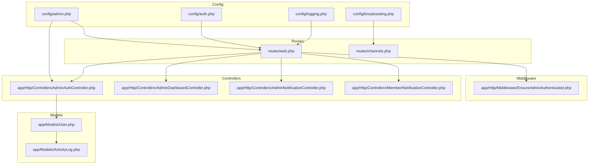
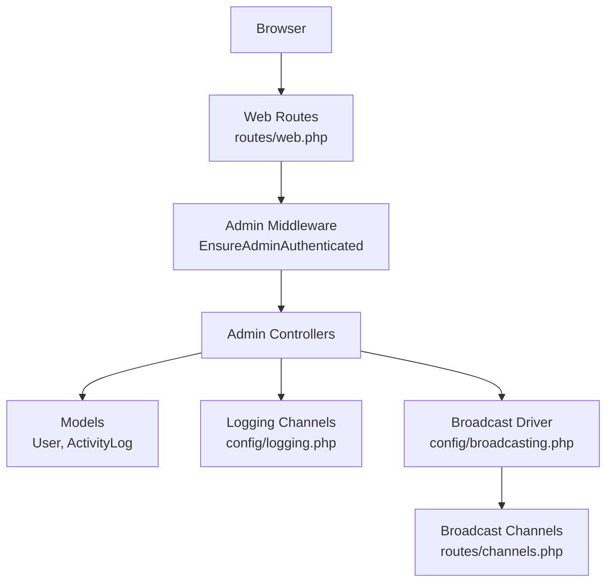
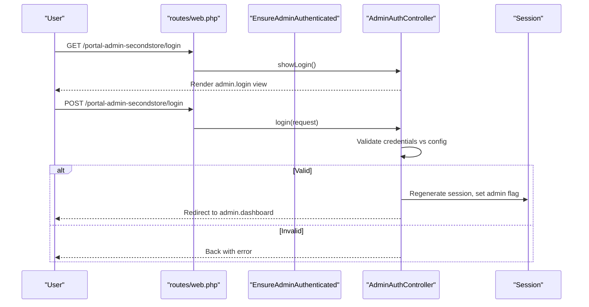
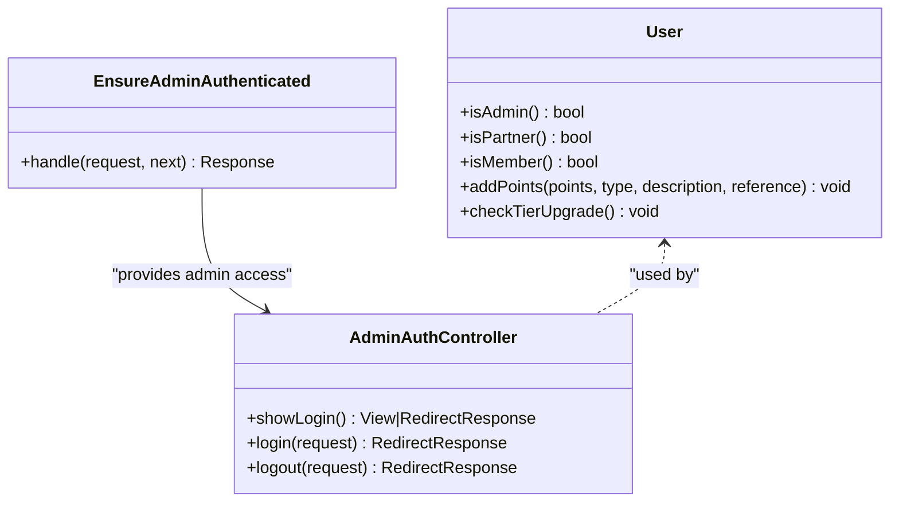
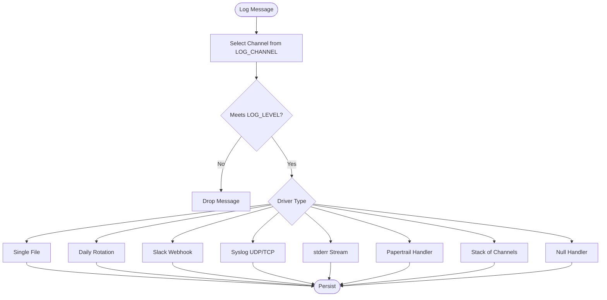
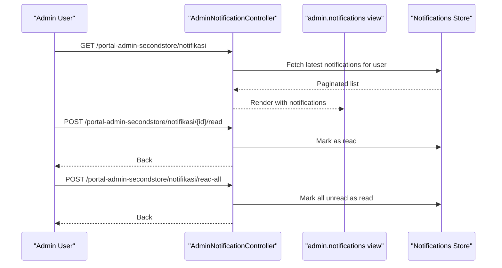
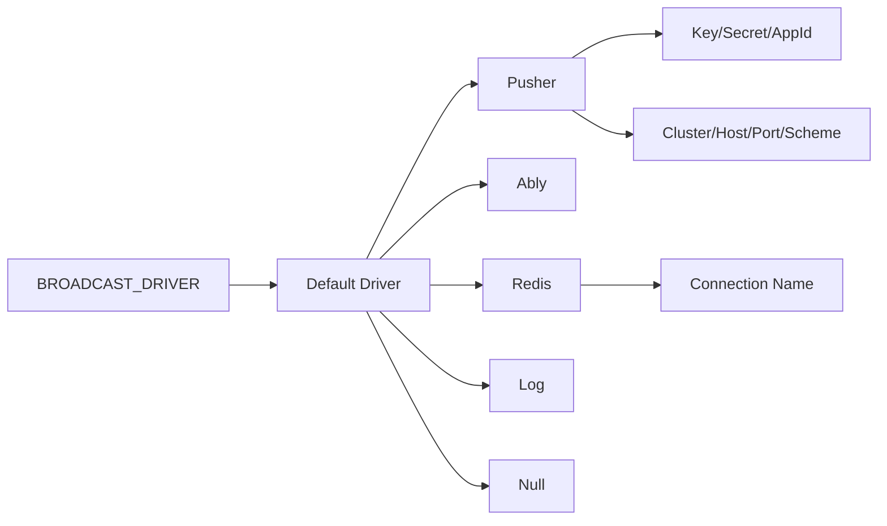
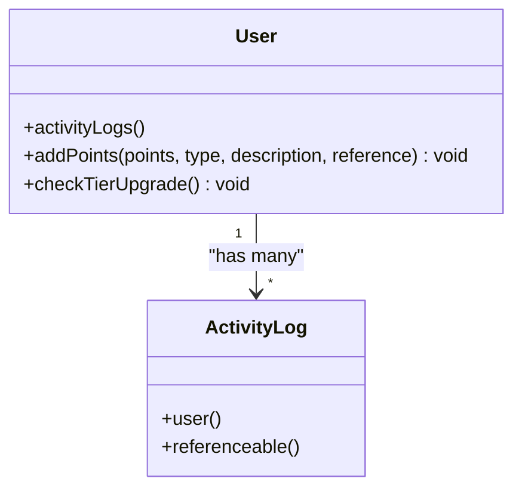
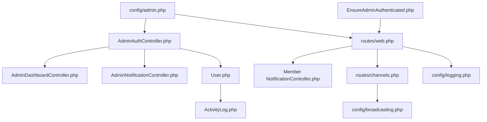

# System Administration Tools

<cite>
**Referenced Files in This Document**
- [admin.php](file://config/admin.php)
- [auth.php](file://config/auth.php)
- [broadcasting.php](file://config/broadcasting.php)
- [logging.php](file://config/logging.php)
- [EnsureAdminAuthenticated.php](file://app/Http/Middleware/EnsureAdminAuthenticated.php)
- [AdminAuthController.php](file://app/Http/Controllers/AdminAuthController.php)
- [AdminDashboardController.php](file://app/Http/Controllers/AdminDashboardController.php)
- [AdminNotificationController.php](file://app/Http/Controllers/AdminNotificationController.php)
- [NotificationController.php (Member)](file://app/Http/Controllers/Member/NotificationController.php)
- [channels.php](file://routes/channels.php)
- [web.php](file://routes/web.php)
- [User.php](file://app/Models/User.php)
- [ActivityLog.php](file://app/Models/ActivityLog.php)
</cite>

## Table of Contents
1. [Introduction](#introduction)
2. [Project Structure](#project-structure)
3. [Core Components](#core-components)
4. [Architecture Overview](#architecture-overview)
5. [Detailed Component Analysis](#detailed-component-analysis)
6. [Dependency Analysis](#dependency-analysis)
7. [Performance Considerations](#performance-considerations)
8. [Troubleshooting Guide](#troubleshooting-guide)
9. [Conclusion](#conclusion)
10. [Appendices](#appendices)

## Introduction
This document describes the system administration and operational tools implemented in the platform. It covers administrative interface configuration, permission management, access control, monitoring and logging, notification administration, communication channels, maintenance and disaster recovery, auditing and compliance, and operational troubleshooting. The goal is to enable administrators to configure, operate, monitor, and secure the system effectively.

## Project Structure
The administrative domain is organized around:
- Configuration files for admin credentials, authentication, broadcasting, and logging
- Web routes that expose admin endpoints under a configurable entry path
- Middleware enforcing admin authentication
- Controllers implementing admin login/logout, dashboards, analytics, and notifications
- Models supporting user roles, activity logging, and broadcasting channels

**Diagram sources**
- [admin.php](file://config/admin.php)
- [auth.php](file://config/auth.php)
- [broadcasting.php](file://config/broadcasting.php)
- [logging.php](file://config/logging.php)
- [web.php](file://routes/web.php)
- [channels.php](file://routes/channels.php)
- [EnsureAdminAuthenticated.php](file://app/Http/Middleware/EnsureAdminAuthenticated.php)
- [AdminAuthController.php](file://app/Http/Controllers/AdminAuthController.php)
- [AdminDashboardController.php](file://app/Http/Controllers/AdminDashboardController.php)
- [AdminNotificationController.php](file://app/Http/Controllers/AdminNotificationController.php)
- [NotificationController.php (Member)](file://app/Http/Controllers/Member/NotificationController.php)
- [User.php](file://app/Models/User.php)
- [ActivityLog.php](file://app/Models/ActivityLog.php)

**Section sources**
- [admin.php](file://config/admin.php)
- [auth.php](file://config/auth.php)
- [broadcasting.php](file://config/broadcasting.php)
- [logging.php](file://config/logging.php)
- [web.php](file://routes/web.php)
- [channels.php](file://routes/channels.php)
- [EnsureAdminAuthenticated.php](file://app/Http/Middleware/EnsureAdminAuthenticated.php)
- [AdminAuthController.php](file://app/Http/Controllers/AdminAuthController.php)
- [AdminDashboardController.php](file://app/Http/Controllers/AdminDashboardController.php)
- [AdminNotificationController.php](file://app/Http/Controllers/AdminNotificationController.php)
- [NotificationController.php (Member)](file://app/Http/Controllers/Member/NotificationController.php)
- [User.php](file://app/Models/User.php)
- [ActivityLog.php](file://app/Models/ActivityLog.php)

## Core Components
- Administrative interface configuration: Admin entry path, username, and password are configured via environment-backed keys.
- Authentication and guards: Session-based guards for web and partner contexts; admin-specific middleware enforces admin session state.
- Access control: Admin area is protected by a dedicated middleware that checks a session flag.
- Monitoring and logging: Centralized logging channels including daily rotation, Slack, syslog, stderr, and Papertrail.
- Notifications: Admin and member notification centers with per-user read/unread management.
- Broadcasting: Configurable broadcaster driver and a private user channel authorization callback.
- Auditing and activity tracking: User activity logs with points and tier updates.

**Section sources**
- [admin.php](file://config/admin.php)
- [auth.php](file://config/auth.php)
- [EnsureAdminAuthenticated.php](file://app/Http/Middleware/EnsureAdminAuthenticated.php)
- [logging.php](file://config/logging.php)
- [broadcasting.php](file://config/broadcasting.php)
- [channels.php](file://routes/channels.php)
- [User.php](file://app/Models/User.php)
- [ActivityLog.php](file://app/Models/ActivityLog.php)

## Architecture Overview
The admin subsystem integrates configuration, routing, middleware, controllers, and models to deliver a secure, observable, and manageable administrative experience.

**Diagram sources**
- [web.php](file://routes/web.php)
- [EnsureAdminAuthenticated.php](file://app/Http/Middleware/EnsureAdminAuthenticated.php)
- [User.php](file://app/Models/User.php)
- [ActivityLog.php](file://app/Models/ActivityLog.php)
- [logging.php](file://config/logging.php)
- [broadcasting.php](file://config/broadcasting.php)
- [channels.php](file://routes/channels.php)

## Detailed Component Analysis

### Administrative Interface Configuration
- Admin entry path: Defined in configuration and used as a URL prefix for all admin routes.
- Credentials: Username and password are environment-backed and validated using constant-time comparison.
- Login flow: Validates credentials against configuration, regenerates session, sets admin flag, and redirects to dashboard.

**Diagram sources**
- [web.php](file://routes/web.php)
- [EnsureAdminAuthenticated.php](file://app/Http/Middleware/EnsureAdminAuthenticated.php)
- [AdminAuthController.php](file://app/Http/Controllers/AdminAuthController.php)
- [admin.php](file://config/admin.php)

**Section sources**
- [admin.php](file://config/admin.php)
- [web.php](file://routes/web.php)
- [AdminAuthController.php](file://app/Http/Controllers/AdminAuthController.php)
- [EnsureAdminAuthenticated.php](file://app/Http/Middleware/EnsureAdminAuthenticated.php)

### Permission Management and Access Control
- Guards and providers: Session-based guards for web and partner contexts; Eloquent provider for users.
- Admin middleware: Enforces admin session state; blocks unauthorized access to admin routes.
- Role-based helpers: User model exposes role checks and computed attributes for tiers.

**Diagram sources**
- [auth.php](file://config/auth.php)
- [EnsureAdminAuthenticated.php](file://app/Http/Middleware/EnsureAdminAuthenticated.php)
- [AdminAuthController.php](file://app/Http/Controllers/AdminAuthController.php)
- [User.php](file://app/Models/User.php)

**Section sources**
- [auth.php](file://config/auth.php)
- [EnsureAdminAuthenticated.php](file://app/Http/Middleware/EnsureAdminAuthenticated.php)
- [AdminAuthController.php](file://app/Http/Controllers/AdminAuthController.php)
- [User.php](file://app/Models/User.php)

### System Monitoring and Logging
- Default channel and deprecation channel: Centralized selection of default and deprecation logging channels.
- Channel drivers: Single-file, daily rotation, Slack, syslog, stderr, Papertrail, stack, and null.
- Environment overrides: Levels, webhook URLs, syslog host/port, and formatter selection.

**Diagram sources**
- [logging.php](file://config/logging.php)

**Section sources**
- [logging.php](file://config/logging.php)

### Notification System Administration
- Admin notifications: Paginated list, mark single unread, mark all unread as read.
- Member notifications: Same UX pattern for end users.
- Broadcasting: Private user channel authorization ensures only the authenticated user receives personal events.

**Diagram sources**
- [web.php](file://routes/web.php)
- [AdminNotificationController.php](file://app/Http/Controllers/AdminNotificationController.php)
- [NotificationController.php (Member)](file://app/Http/Controllers/Member/NotificationController.php)
- [channels.php](file://routes/channels.php)

**Section sources**
- [web.php](file://routes/web.php)
- [AdminNotificationController.php](file://app/Http/Controllers/AdminNotificationController.php)
- [NotificationController.php (Member)](file://app/Http/Controllers/Member/NotificationController.php)
- [channels.php](file://routes/channels.php)

### Communication Channel Management
- Default driver: Controlled by environment variable; supports pusher, ably, redis, log, and null.
- Pusher configuration: Key, secret, app ID, cluster/host/port/scheme, TLS usage.
- Redis connection: Uses named connection for pub/sub.
- Authorization: Private user channel allows only the matching user ID.

**Diagram sources**
- [broadcasting.php](file://config/broadcasting.php)
- [channels.php](file://routes/channels.php)

**Section sources**
- [broadcasting.php](file://config/broadcasting.php)
- [channels.php](file://routes/channels.php)

### System Maintenance and Disaster Recovery
- Daily log rotation: Ensures long-term log availability and disk hygiene.
- Slack/Papertrail integration: Enables external alerting and centralized log aggregation.
- Session-based admin: No persistent tokens stored server-side; rely on session lifecycle and CSRF protection.
- Recommendations:
  - Schedule regular backups of database and storage/app/public.
  - Enable automated log archival and retention policies.
  - Configure health checks at reverse proxy/gateway level.
  - Maintain offsite backups and test restoration procedures quarterly.

**Section sources**
- [logging.php](file://config/logging.php)
- [web.php](file://routes/web.php)

### Logging and Auditing
- Activity logs: Users’ actions are recorded with associated points and optional reference metadata; automatic tier recalculation occurs after point grants.
- Audit trail: Each activity log entry links to the acting user and optionally to related entities.

**Diagram sources**
- [User.php](file://app/Models/User.php)
- [ActivityLog.php](file://app/Models/ActivityLog.php)

**Section sources**
- [User.php](file://app/Models/User.php)
- [ActivityLog.php](file://app/Models/ActivityLog.php)

### Operational Workflows and Examples
- Admin login and dashboard:
  - Navigate to admin login page under the configured entry path.
  - Submit credentials; on success, redirected to admin dashboard.
  - From dashboard, access analytics and manage content.
- Notification administration:
  - Open admin notifications center.
  - Mark individual items as read or mark all unread as read.
- Member notification management:
  - Member notifications center supports the same operations.

**Section sources**
- [web.php](file://routes/web.php)
- [AdminAuthController.php](file://app/Http/Controllers/AdminAuthController.php)
- [AdminDashboardController.php](file://app/Http/Controllers/AdminDashboardController.php)
- [AdminNotificationController.php](file://app/Http/Controllers/AdminNotificationController.php)
- [NotificationController.php (Member)](file://app/Http/Controllers/Member/NotificationController.php)

## Dependency Analysis
Administrative components depend on configuration, routing, middleware, controllers, and models. The admin entry path and credentials are central to route exposure and authentication.

**Diagram sources**
- [admin.php](file://config/admin.php)
- [web.php](file://routes/web.php)
- [EnsureAdminAuthenticated.php](file://app/Http/Middleware/EnsureAdminAuthenticated.php)
- [AdminAuthController.php](file://app/Http/Controllers/AdminAuthController.php)
- [AdminDashboardController.php](file://app/Http/Controllers/AdminDashboardController.php)
- [AdminNotificationController.php](file://app/Http/Controllers/AdminNotificationController.php)
- [NotificationController.php (Member)](file://app/Http/Controllers/Member/NotificationController.php)
- [User.php](file://app/Models/User.php)
- [ActivityLog.php](file://app/Models/ActivityLog.php)
- [channels.php](file://routes/channels.php)
- [broadcasting.php](file://config/broadcasting.php)
- [logging.php](file://config/logging.php)

**Section sources**
- [admin.php](file://config/admin.php)
- [web.php](file://routes/web.php)
- [EnsureAdminAuthenticated.php](file://app/Http/Middleware/EnsureAdminAuthenticated.php)
- [AdminAuthController.php](file://app/Http/Controllers/AdminAuthController.php)
- [AdminDashboardController.php](file://app/Http/Controllers/AdminDashboardController.php)
- [AdminNotificationController.php](file://app/Http/Controllers/AdminNotificationController.php)
- [NotificationController.php (Member)](file://app/Http/Controllers/Member/NotificationController.php)
- [User.php](file://app/Models/User.php)
- [ActivityLog.php](file://app/Models/ActivityLog.php)
- [channels.php](file://routes/channels.php)
- [broadcasting.php](file://config/broadcasting.php)
- [logging.php](file://config/logging.php)

## Performance Considerations
- Logging:
  - Prefer daily rotation for large deployments to avoid single large log files.
  - Use stderr or syslog for containerized environments to integrate with log collectors.
- Broadcasting:
  - Choose Redis or Pusher for production; ensure proper scaling and TLS termination.
- Admin routes:
  - Keep admin entry path obscure and rotate credentials regularly.
  - Limit concurrent admin sessions and enforce timeouts via session configuration.

[No sources needed since this section provides general guidance]

## Troubleshooting Guide
- Admin login fails:
  - Verify admin entry path matches configuration and environment.
  - Confirm credentials align with configured username/password.
  - Check session regeneration and admin flag persistence.
- Unauthorized access to admin routes:
  - Ensure admin middleware is applied to admin routes.
  - Confirm session state reflects admin authentication.
- Notifications not updating:
  - Verify user-specific channel authorization for private channels.
  - Check notification retrieval and marking logic in controllers.
- Logs missing or at wrong level:
  - Validate default channel and level settings.
  - Confirm driver-specific configuration (e.g., Slack webhook URL, Papertrail host/port).

**Section sources**
- [web.php](file://routes/web.php)
- [EnsureAdminAuthenticated.php](file://app/Http/Middleware/EnsureAdminAuthenticated.php)
- [AdminAuthController.php](file://app/Http/Controllers/AdminAuthController.php)
- [AdminNotificationController.php](file://app/Http/Controllers/AdminNotificationController.php)
- [NotificationController.php (Member)](file://app/Http/Controllers/Member/NotificationController.php)
- [channels.php](file://routes/channels.php)
- [logging.php](file://config/logging.php)

## Conclusion
The administrative subsystem provides a configurable, secure, and observable foundation for managing users, content, and communications. Administrators can leverage session-based access control, structured logging, notification centers, and broadcast channels to operate the system reliably. Applying the recommended maintenance and security practices will further strengthen operational resilience.

[No sources needed since this section summarizes without analyzing specific files]

## Appendices
- Security hardening checklist:
  - Rotate admin credentials periodically.
  - Restrict admin entry path and firewall access.
  - Enable CSRF protection and rate-limit login attempts.
  - Use HTTPS and secure cookies.
- Compliance reporting:
  - Export activity logs and notification records as needed.
  - Maintain audit trails for user actions and admin interventions.

[No sources needed since this section provides general guidance]