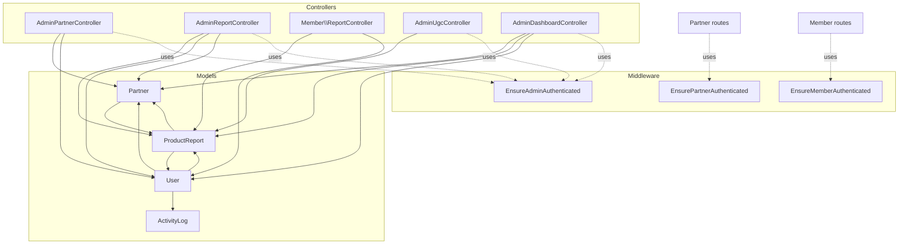
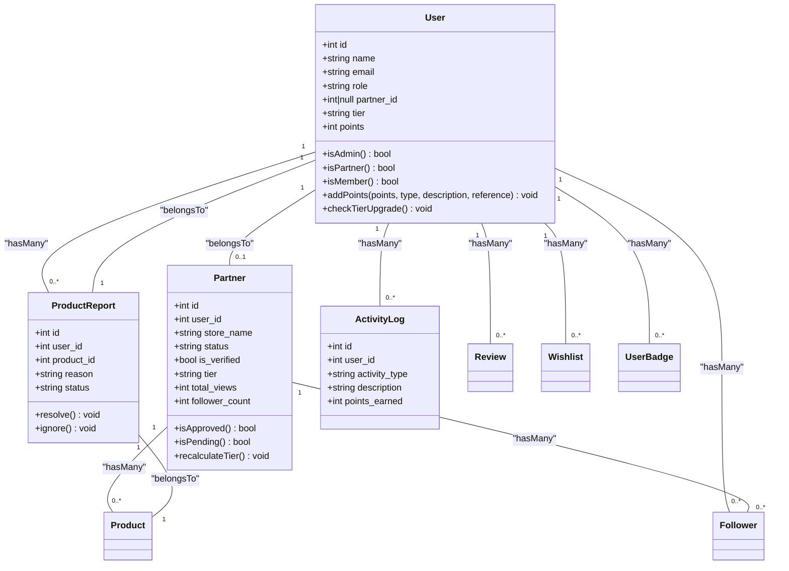
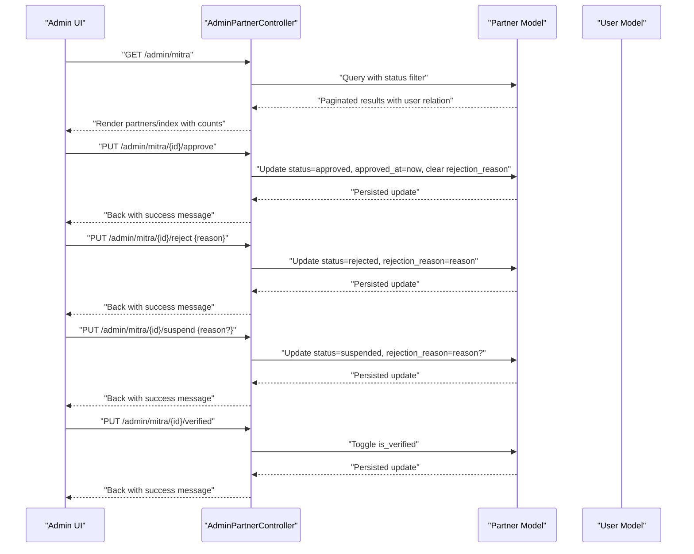
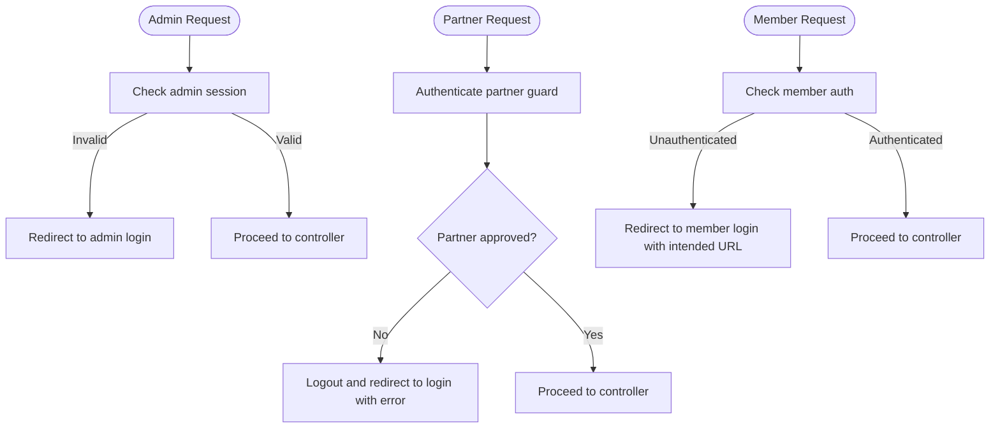
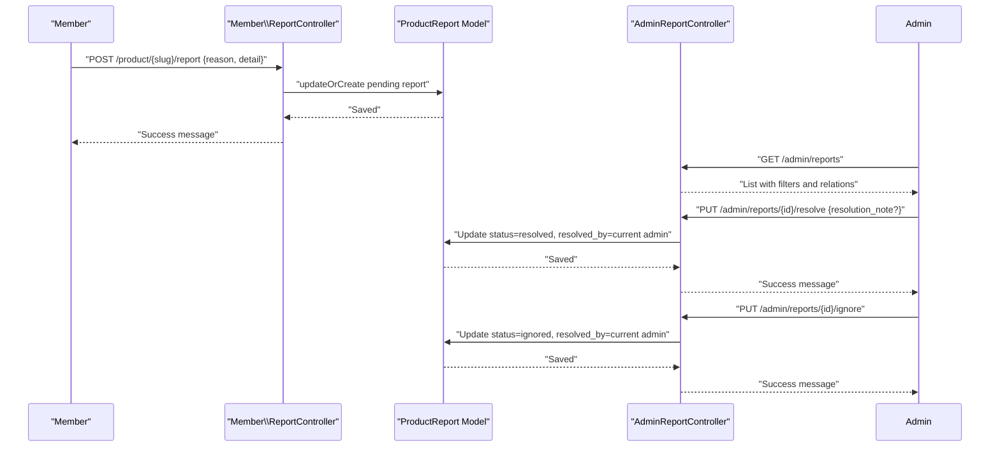
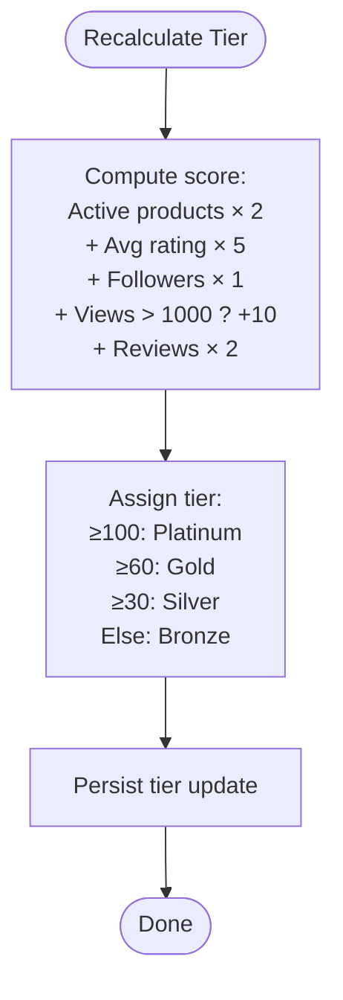
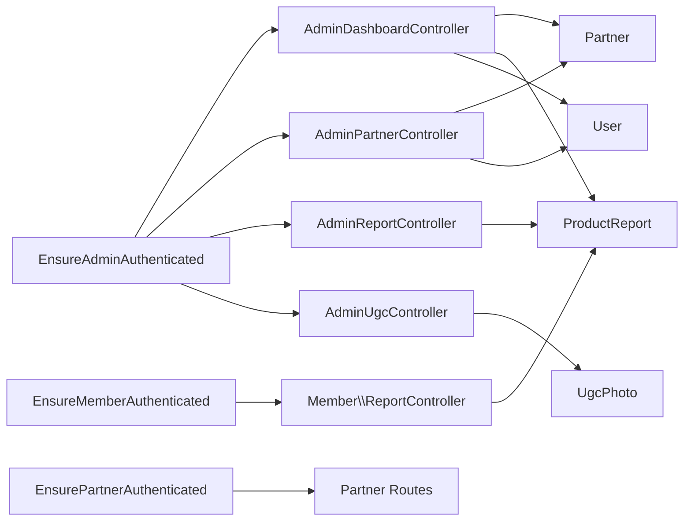

# User Moderation and Management

<cite>
**Referenced Files in This Document**
- [AdminPartnerController.php](file://app/Http/Controllers/AdminPartnerController.php)
- [AdminReportController.php](file://app/Http/Controllers/AdminReportController.php)
- [Member/ReportController.php](file://app/Http/Controllers/Member/ReportController.php)
- [AdminUgcController.php](file://app/Http/Controllers/AdminUgcController.php)
- [AdminDashboardController.php](file://app/Http/Controllers/AdminDashboardController.php)
- [User.php](file://app/Models/User.php)
- [Partner.php](file://app/Models/Partner.php)
- [ProductReport.php](file://app/Models/ProductReport.php)
- [ActivityLog.php](file://app/Models/ActivityLog.php)
- [2026_05_24_093026_add_role_to_users_table.php](file://database/migrations/2026_05_24_093026_add_role_to_users_table.php)
- [EnsureAdminAuthenticated.php](file://app/Http/Middleware/EnsureAdminAuthenticated.php)
- [EnsurePartnerAuthenticated.php](file://app/Http/Middleware/EnsurePartnerAuthenticated.php)
- [EnsureMemberAuthenticated.php](file://app/Http/Middleware/EnsureMemberAuthenticated.php)
- [AdminAuthController.php](file://app/Http/Controllers/AdminAuthController.php)
- [partners/index.blade.php](file://resources/views/admin/partners/index.blade.php)
</cite>

## Table of Contents
1. [Introduction](#introduction)
2. [Project Structure](#project-structure)
3. [Core Components](#core-components)
4. [Architecture Overview](#architecture-overview)
5. [Detailed Component Analysis](#detailed-component-analysis)
6. [Dependency Analysis](#dependency-analysis)
7. [Performance Considerations](#performance-considerations)
8. [Troubleshooting Guide](#troubleshooting-guide)
9. [Conclusion](#conclusion)
10. [Appendices](#appendices)

## Introduction
This document provides comprehensive documentation for the user moderation and management systems within the platform. It covers partner account management (approval workflows, status tracking, performance monitoring), user account oversight and role management, report handling and violation detection, automated moderation tools, spam prevention and content filtering, community guideline enforcement, verification processes, identity confirmation, and account security features. It also includes practical moderation workflows, decision-making criteria, appeal processes, bulk operations, deactivation procedures, and audit trail maintenance.

## Project Structure
The moderation and management capabilities are implemented across controllers, models, middleware, and views:
- Controllers manage administrative actions (partner approvals/rejections/suspensions, report resolution, UGC moderation) and member report submissions.
- Models define roles, statuses, and relationships for users, partners, reports, and activity logs.
- Middleware enforces authentication and role-based access for admin, partner, and member contexts.
- Views present dashboards, analytics, and moderation interfaces.

**Diagram sources**
- [AdminPartnerController.php:13-75](file://app/Http/Controllers/AdminPartnerController.php#L13-L75)
- [AdminReportController.php:10-51](file://app/Http/Controllers/AdminReportController.php#L10-L51)
- [Member/ReportController.php:11-29](file://app/Http/Controllers/Member/ReportController.php#L11-L29)
- [AdminUgcController.php:8-43](file://app/Http/Controllers/AdminUgcController.php#L8-L43)
- [AdminDashboardController.php:14-66](file://app/Http/Controllers/AdminDashboardController.php#L14-L66)
- [User.php:10-130](file://app/Models/User.php#L10-L130)
- [Partner.php:8-122](file://app/Models/Partner.php#L8-L122)
- [ProductReport.php:7-26](file://app/Models/ProductReport.php#L7-L26)
- [ActivityLog.php:6-22](file://app/Models/ActivityLog.php#L6-L22)
- [EnsureAdminAuthenticated.php:9-24](file://app/Http/Middleware/EnsureAdminAuthenticated.php#L9-L24)
- [EnsurePartnerAuthenticated.php:9-27](file://app/Http/Middleware/EnsurePartnerAuthenticated.php#L9-L27)
- [EnsureMemberAuthenticated.php:9-20](file://app/Http/Middleware/EnsureMemberAuthenticated.php#L9-L20)

**Section sources**
- [AdminPartnerController.php:13-75](file://app/Http/Controllers/AdminPartnerController.php#L13-L75)
- [AdminReportController.php:10-51](file://app/Http/Controllers/AdminReportController.php#L10-L51)
- [Member/ReportController.php:11-29](file://app/Http/Controllers/Member/ReportController.php#L11-L29)
- [AdminUgcController.php:8-43](file://app/Http/Controllers/AdminUgcController.php#L8-L43)
- [AdminDashboardController.php:14-66](file://app/Http/Controllers/AdminDashboardController.php#L14-L66)
- [User.php:10-130](file://app/Models/User.php#L10-L130)
- [Partner.php:8-122](file://app/Models/Partner.php#L8-L122)
- [ProductReport.php:7-26](file://app/Models/ProductReport.php#L7-L26)
- [ActivityLog.php:6-22](file://app/Models/ActivityLog.php#L6-L22)
- [EnsureAdminAuthenticated.php:9-24](file://app/Http/Middleware/EnsureAdminAuthenticated.php#L9-L24)
- [EnsurePartnerAuthenticated.php:9-27](file://app/Http/Middleware/EnsurePartnerAuthenticated.php#L9-L27)
- [EnsureMemberAuthenticated.php:9-20](file://app/Http/Middleware/EnsureMemberAuthenticated.php#L9-L20)

## Core Components
- Role and Authentication Model: Users have roles (admin, partner, member) and are linked to Partners. Roles and foreign keys are defined via migration.
- Partner Management: Approve, reject, suspend, and toggle verified badges for partners; track status and rejection reasons.
- Report Handling: Members submit product reports; admins resolve or ignore reports with resolution notes and tracking by resolver.
- UGC Moderation: Admins approve, reject, feature, or delete user-generated content photos.
- Activity Logging: Users’ points and activity logs record moderation-triggered events and gamification updates.
- Analytics and Dashboards: Admin dashboard aggregates counts and top performers; analytics page shows distribution and metrics.

**Section sources**
- [User.php:14-130](file://app/Models/User.php#L14-L130)
- [Partner.php:10-122](file://app/Models/Partner.php#L10-L122)
- [AdminPartnerController.php:30-74](file://app/Http/Controllers/AdminPartnerController.php#L30-L74)
- [AdminReportController.php:27-50](file://app/Http/Controllers/AdminReportController.php#L27-L50)
- [Member/ReportController.php:13-28](file://app/Http/Controllers/Member/ReportController.php#L13-L28)
- [AdminUgcController.php:20-42](file://app/Http/Controllers/AdminUgcController.php#L20-L42)
- [ActivityLog.php:8-21](file://app/Models/ActivityLog.php#L8-L21)
- [AdminDashboardController.php:16-65](file://app/Http/Controllers/AdminDashboardController.php#L16-L65)
- [2026_05_24_093026_add_role_to_users_table.php:9-22](file://database/migrations/2026_05_24_093026_add_role_to_users_table.php#L9-L22)

## Architecture Overview
The moderation system follows a layered MVC pattern with role-based middleware enforcing access control. Administrative actions are handled by dedicated controllers, while member-facing moderation is exposed through member controllers. Models encapsulate business logic for roles, statuses, and performance calculations.

**Diagram sources**
- [User.php:10-130](file://app/Models/User.php#L10-L130)
- [Partner.php:8-122](file://app/Models/Partner.php#L8-L122)
- [ProductReport.php:7-26](file://app/Models/ProductReport.php#L7-L26)
- [ActivityLog.php:6-22](file://app/Models/ActivityLog.php#L6-L22)

## Detailed Component Analysis

### Partner Account Management
- Approval Workflow:
  - Pending partners are listed with tabs for filtering by status.
  - Admin can approve pending partners, setting status to approved and recording approval timestamp.
  - Rejection requires a reason and sets status to rejected with rejection reason stored.
  - Suspension allows temporary deactivation with optional reason.
  - Verified badge toggling is supported for approved partners.
- Status Tracking:
  - Status values include pending, approved, rejected, suspended.
  - Rejection reason is persisted for transparency.
- Performance Monitoring:
  - Partner model exposes performance metrics (average rating, review count, follower count, total views).
  - Tier calculation considers product count, ratings, followers, views threshold, and review count.
  - Dashboard displays top partners by views and tier distributions.

**Diagram sources**
- [AdminPartnerController.php:15-74](file://app/Http/Controllers/AdminPartnerController.php#L15-L74)
- [Partner.php:28-48](file://app/Models/Partner.php#L28-L48)
- [User.php:28-31](file://app/Models/User.php#L28-L31)
- [partners/index.blade.php:78-124](file://resources/views/admin/partners/index.blade.php#L78-L124)

**Section sources**
- [AdminPartnerController.php:15-74](file://app/Http/Controllers/AdminPartnerController.php#L15-L74)
- [Partner.php:61-121](file://app/Models/Partner.php#L61-L121)
- [AdminDashboardController.php:33-47](file://app/Http/Controllers/AdminDashboardController.php#L33-L47)
- [partners/index.blade.php:78-124](file://resources/views/admin/partners/index.blade.php#L78-L124)

### User Account Oversight and Role Management
- Role Model:
  - Users have roles: admin, partner, member.
  - Users belong to Partner via partner_id.
- Access Control:
  - Admin authentication middleware ensures only authorized sessions access admin routes.
  - Partner authentication middleware validates partner login and approved status.
  - Member authentication middleware redirects unauthenticated members to login.
- Decision-Making Criteria:
  - Role checks (isAdmin, isPartner, isMember) enable role-specific logic.
  - Partner approval depends on status field and middleware validation.

**Diagram sources**
- [EnsureAdminAuthenticated.php:16-22](file://app/Http/Middleware/EnsureAdminAuthenticated.php#L16-L22)
- [EnsurePartnerAuthenticated.php:13-23](file://app/Http/Middleware/EnsurePartnerAuthenticated.php#L13-L23)
- [EnsureMemberAuthenticated.php:13-16](file://app/Http/Middleware/EnsureMemberAuthenticated.php#L13-L16)
- [AdminAuthController.php:11-52](file://app/Http/Controllers/AdminAuthController.php#L11-L52)
- [User.php:68-81](file://app/Models/User.php#L68-L81)

**Section sources**
- [2026_05_24_093026_add_role_to_users_table.php:11-14](file://database/migrations/2026_05_24_093026_add_role_to_users_table.php#L11-L14)
- [EnsureAdminAuthenticated.php:16-22](file://app/Http/Middleware/EnsureAdminAuthenticated.php#L16-L22)
- [EnsurePartnerAuthenticated.php:13-23](file://app/Http/Middleware/EnsurePartnerAuthenticated.php#L13-L23)
- [EnsureMemberAuthenticated.php:13-16](file://app/Http/Middleware/EnsureMemberAuthenticated.php#L13-L16)
- [AdminAuthController.php:11-52](file://app/Http/Controllers/AdminAuthController.php#L11-L52)
- [User.php:68-81](file://app/Models/User.php#L68-L81)

### Report Handling Procedures and Violation Detection
- Submission:
  - Members submit product reports with predefined reasons and optional details; status defaults to pending.
- Resolution:
  - Admins resolve reports with optional resolution notes and mark resolved_by.
  - Admins can ignore reports, marking them as ignored.
- Tracking:
  - Reports are paginated and filtered by status; includes relations to user and product’s partner for context.

**Diagram sources**
- [Member/ReportController.php:13-28](file://app/Http/Controllers/Member/ReportController.php#L13-L28)
- [ProductReport.php:7-26](file://app/Models/ProductReport.php#L7-L26)
- [AdminReportController.php:12-50](file://app/Http/Controllers/AdminReportController.php#L12-L50)

**Section sources**
- [Member/ReportController.php:13-28](file://app/Http/Controllers/Member/ReportController.php#L13-L28)
- [AdminReportController.php:12-50](file://app/Http/Controllers/AdminReportController.php#L12-L50)
- [ProductReport.php:7-26](file://app/Models/ProductReport.php#L7-L26)

### Automated Moderation Tools and Spam Prevention
- Automated Tier Recalculation:
  - Partner tier recalculated based on active product count, average rating, follower count, high-view threshold, and review count.
- Activity Logging:
  - Points and activity logs capture moderation-triggered events and gamification updates.
- UGC Moderation:
  - Admins can approve, reject, feature, or delete UGC photos to enforce community guidelines and prevent spam.

**Diagram sources**
- [Partner.php:104-121](file://app/Models/Partner.php#L104-L121)
- [ActivityLog.php:8-21](file://app/Models/ActivityLog.php#L8-L21)

**Section sources**
- [Partner.php:104-121](file://app/Models/Partner.php#L104-L121)
- [ActivityLog.php:8-21](file://app/Models/ActivityLog.php#L8-L21)
- [AdminUgcController.php:20-42](file://app/Http/Controllers/AdminUgcController.php#L20-L42)

### Community Guideline Enforcement and Content Filtering
- UGC Filtering:
  - Admins can approve or reject UGC photos; featured toggling highlights compliant content.
- Report-Based Enforcement:
  - Reports drive moderation actions; resolved or ignored reports maintain audit trails.
- Verification Badge:
  - Verified badge toggle for partners supports identity confirmation and trust signals.

**Section sources**
- [AdminUgcController.php:20-36](file://app/Http/Controllers/AdminUgcController.php#L20-L36)
- [AdminPartnerController.php:69-74](file://app/Http/Controllers/AdminPartnerController.php#L69-L74)

### User Verification Processes and Identity Confirmation
- Identity Confirmation:
  - Verified badge can be toggled for partners; UI indicates verified status.
- Account Security:
  - Admin authentication uses session-based guard with secure credentials comparison.
  - Partner guard enforces approved status; unauthorized access is blocked and logged out.

**Section sources**
- [AdminPartnerController.php:69-74](file://app/Http/Controllers/AdminPartnerController.php#L69-L74)
- [AdminAuthController.php:20-43](file://app/Http/Controllers/AdminAuthController.php#L20-L43)
- [EnsurePartnerAuthenticated.php:13-23](file://app/Http/Middleware/EnsurePartnerAuthenticated.php#L13-L23)

### Bulk Operations, Deactivation, and Audit Trail Maintenance
- Bulk Operations:
  - Admin dashboard lists pending items across partners, reports, and UGC for batch oversight.
- Deactivation Procedures:
  - Suspend action sets partner status to suspended with optional reason; re-approval restores status.
- Audit Trail:
  - Activity logs record user activities and points; reports track resolver actions and notes.

**Section sources**
- [AdminDashboardController.php:16-28](file://app/Http/Controllers/AdminDashboardController.php#L16-L28)
- [AdminPartnerController.php:55-67](file://app/Http/Controllers/AdminPartnerController.php#L55-L67)
- [ActivityLog.php:8-21](file://app/Models/ActivityLog.php#L8-L21)
- [AdminReportController.php:27-40](file://app/Http/Controllers/AdminReportController.php#L27-L40)

## Dependency Analysis
Moderation components depend on:
- Controllers depend on models for persistence and business logic.
- Middleware enforces authentication and role checks.
- Views render moderation interfaces and dashboards.

**Diagram sources**
- [EnsureAdminAuthenticated.php:16-22](file://app/Http/Middleware/EnsureAdminAuthenticated.php#L16-L22)
- [EnsureMemberAuthenticated.php:13-16](file://app/Http/Middleware/EnsureMemberAuthenticated.php#L13-L16)
- [EnsurePartnerAuthenticated.php:13-23](file://app/Http/Middleware/EnsurePartnerAuthenticated.php#L13-L23)
- [AdminPartnerController.php:15-74](file://app/Http/Controllers/AdminPartnerController.php#L15-L74)
- [AdminReportController.php:12-50](file://app/Http/Controllers/AdminReportController.php#L12-L50)
- [Member/ReportController.php:13-28](file://app/Http/Controllers/Member/ReportController.php#L13-L28)
- [AdminUgcController.php:10-42](file://app/Http/Controllers/AdminUgcController.php#L10-L42)
- [AdminDashboardController.php:16-65](file://app/Http/Controllers/AdminDashboardController.php#L16-L65)
- [Partner.php:28-48](file://app/Models/Partner.php#L28-L48)
- [ProductReport.php:17-25](file://app/Models/ProductReport.php#L17-L25)

**Section sources**
- [EnsureAdminAuthenticated.php:16-22](file://app/Http/Middleware/EnsureAdminAuthenticated.php#L16-L22)
- [EnsureMemberAuthenticated.php:13-16](file://app/Http/Middleware/EnsureMemberAuthenticated.php#L13-L16)
- [EnsurePartnerAuthenticated.php:13-23](file://app/Http/Middleware/EnsurePartnerAuthenticated.php#L13-L23)
- [AdminPartnerController.php:15-74](file://app/Http/Controllers/AdminPartnerController.php#L15-L74)
- [AdminReportController.php:12-50](file://app/Http/Controllers/AdminReportController.php#L12-L50)
- [Member/ReportController.php:13-28](file://app/Http/Controllers/Member/ReportController.php#L13-L28)
- [AdminUgcController.php:10-42](file://app/Http/Controllers/AdminUgcController.php#L10-L42)
- [AdminDashboardController.php:16-65](file://app/Http/Controllers/AdminDashboardController.php#L16-L65)

## Performance Considerations
- Pagination:
  - Controllers paginate results for partners, reports, and UGC to reduce load.
- Aggregation:
  - Dashboard computes counts and top performers server-side to minimize client-side processing.
- Indexing:
  - Status filters and timestamps support efficient queries for moderation queues.

[No sources needed since this section provides general guidance]

## Troubleshooting Guide
- Admin Login Issues:
  - Ensure session-based admin authentication and secure credential comparison.
- Partner Access Denied:
  - Confirm partner guard user belongs to an approved partner; unauthorized users are logged out.
- Report Resolution Failures:
  - Validate resolution note constraints and resolver assignment.
- UGC Moderation Errors:
  - Confirm photo status transitions and deletion permissions.

**Section sources**
- [AdminAuthController.php:20-43](file://app/Http/Controllers/AdminAuthController.php#L20-L43)
- [EnsurePartnerAuthenticated.php:13-23](file://app/Http/Middleware/EnsurePartnerAuthenticated.php#L13-L23)
- [AdminReportController.php:27-40](file://app/Http/Controllers/AdminReportController.php#L27-L40)
- [AdminUgcController.php:20-42](file://app/Http/Controllers/AdminUgcController.php#L20-L42)

## Conclusion
The moderation and management system integrates role-based access control, robust reporting and UGC moderation, automated performance tracking, and comprehensive audit trails. Administrative dashboards streamline oversight, while member and partner middleware ensure secure and appropriate access. The modular design enables scalable enhancements for spam prevention, content filtering, and community guideline enforcement.

[No sources needed since this section summarizes without analyzing specific files]

## Appendices
- Practical Examples:
  - Partner Approval: Navigate to partners list, select “Approve” for pending entries.
  - Report Resolution: From reports list, choose “Resolve” with a resolution note or “Ignore.”
  - UGC Management: Approve, reject, or feature photos; delete inappropriate content.
  - Appeal Process: Pending decisions can be revisited; rejection reasons are recorded for transparency.
- Decision-Making Criteria:
  - Approve when identity and listings meet standards; reject with clear reasons; suspend temporarily for policy violations.
- Bulk Operations:
  - Use dashboard filters and pagination to batch moderate reports and UGC.
- Deactivation and Verification:
  - Suspend or activate partners; toggle verified badge to confirm identities.

[No sources needed since this section provides general guidance]