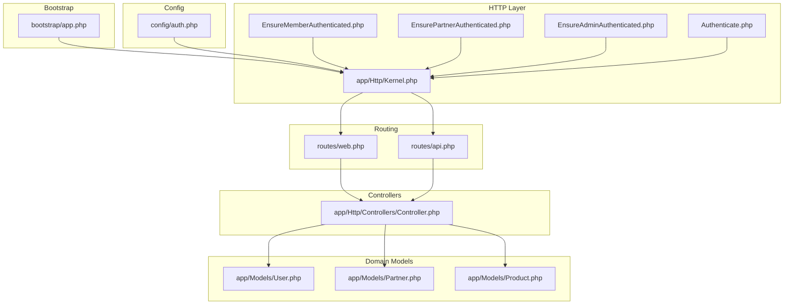
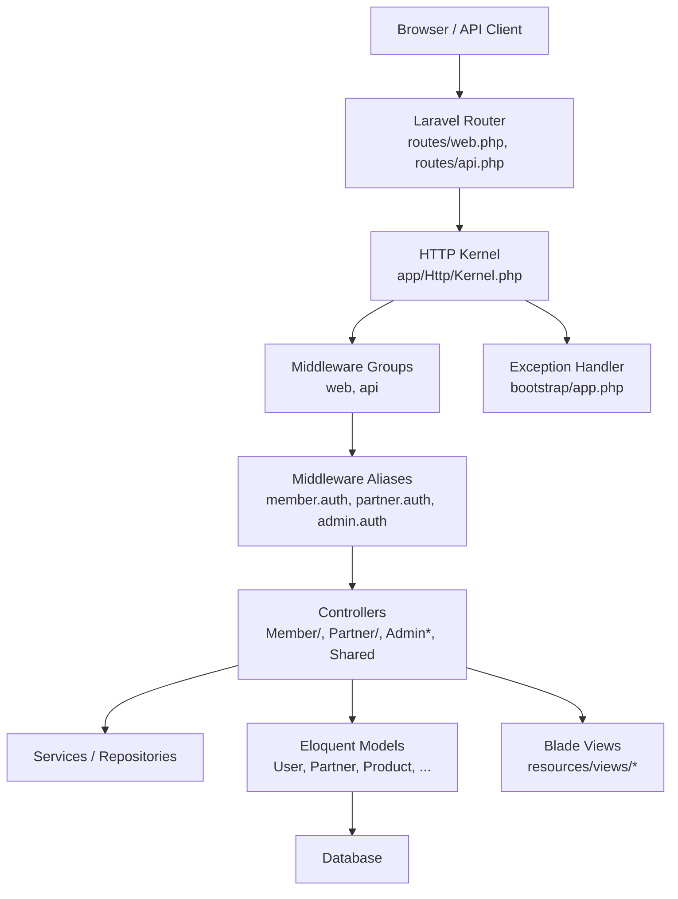
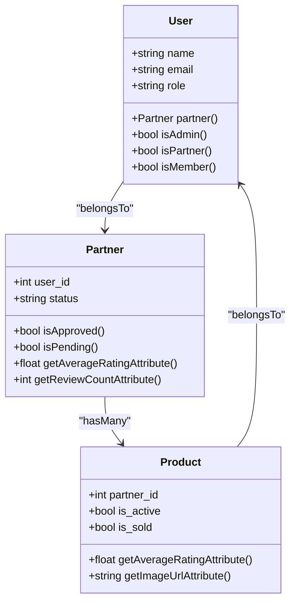
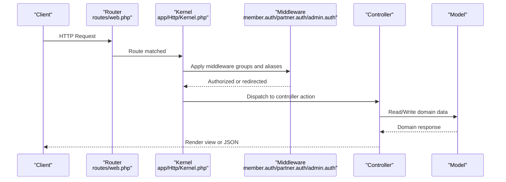
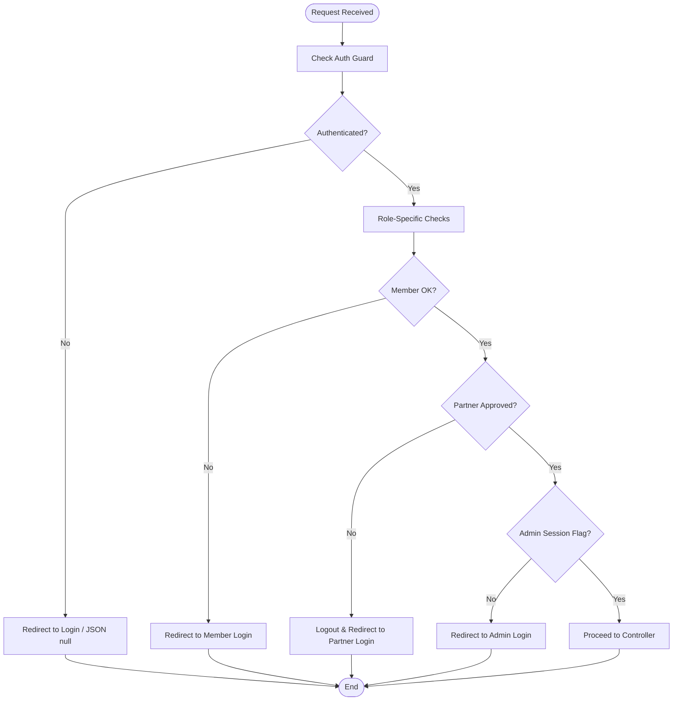
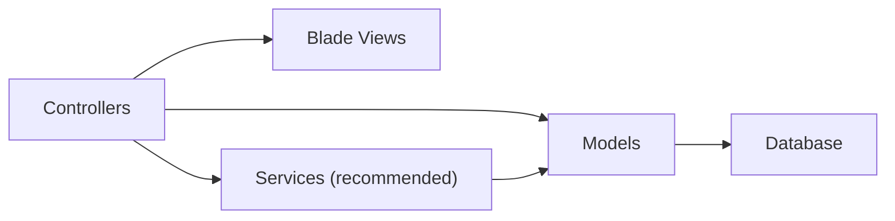
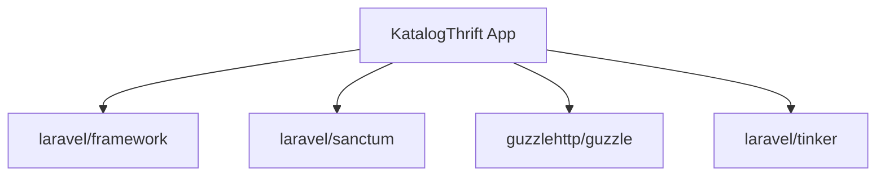

# Architecture Overview

<cite>
**Referenced Files in This Document**
- [bootstrap/app.php](file://bootstrap/app.php)
- [app/Http/Kernel.php](file://app/Http/Kernel.php)
- [routes/web.php](file://routes/web.php)
- [routes/api.php](file://routes/api.php)
- [config/auth.php](file://config/auth.php)
- [app/Http/Middleware/Authenticate.php](file://app/Http/Middleware/Authenticate.php)
- [app/Http/Middleware/EnsureMemberAuthenticated.php](file://app/Http/Middleware/EnsureMemberAuthenticated.php)
- [app/Http/Middleware/EnsurePartnerAuthenticated.php](file://app/Http/Middleware/EnsurePartnerAuthenticated.php)
- [app/Http/Middleware/EnsureAdminAuthenticated.php](file://app/Http/Middleware/EnsureAdminAuthenticated.php)
- [app/Providers/AuthServiceProvider.php](file://app/Providers/AuthServiceProvider.php)
- [app/Http/Controllers/Controller.php](file://app/Http/Controllers/Controller.php)
- [app/Models/User.php](file://app/Models/User.php)
- [app/Models/Partner.php](file://app/Models/Partner.php)
- [app/Models/Product.php](file://app/Models/Product.php)
- [composer.json](file://composer.json)
</cite>

## Table of Contents
1. [Introduction](#introduction)
2. [Project Structure](#project-structure)
3. [Core Components](#core-components)
4. [Architecture Overview](#architecture-overview)
5. [Detailed Component Analysis](#detailed-component-analysis)
6. [Dependency Analysis](#dependency-analysis)
7. [Performance Considerations](#performance-considerations)
8. [Troubleshooting Guide](#troubleshooting-guide)
9. [Conclusion](#conclusion)
10. [Appendices](#appendices)

## Introduction
This document presents the architecture of KatalogThrift, a Laravel-based full-stack application implementing a multi-role system (Member, Partner, Administrator) with a clear separation of concerns across controllers, models, views, and services. It explains the MVC architecture, service provider registration, dependency injection container, application bootstrap process, routing architecture (web and API), middleware pipeline, and request flow. Cross-cutting concerns such as authentication, authorization, logging, and caching are documented alongside technology stack decisions, architectural patterns, and scalability considerations.

## Project Structure
KatalogThrift follows Laravel’s conventional structure with clear boundaries:
- Bootstrap: application instantiation and IoC container bindings
- Config: environment-specific configuration (authentication, caching, logging, etc.)
- Database: migrations and seeders defining the domain schema
- Routes: web and API route definitions grouped by role and feature
- App: HTTP kernel, middleware, controllers, models, providers, and support utilities
- Resources: Blade views organized by role and feature
- Public: static assets and entry point

**Diagram sources**
- [bootstrap/app.php:14-42](file://bootstrap/app.php#L14-L42)
- [app/Http/Kernel.php:16-70](file://app/Http/Kernel.php#L16-L70)
- [routes/web.php:44-239](file://routes/web.php#L44-L239)
- [routes/api.php:17-19](file://routes/api.php#L17-L19)
- [config/auth.php:38-47](file://config/auth.php#L38-L47)
- [app/Http/Middleware/EnsureMemberAuthenticated.php:11-19](file://app/Http/Middleware/EnsureMemberAuthenticated.php#L11-L19)
- [app/Http/Middleware/EnsurePartnerAuthenticated.php:11-26](file://app/Http/Middleware/EnsurePartnerAuthenticated.php#L11-L26)
- [app/Http/Middleware/EnsureAdminAuthenticated.php:16-23](file://app/Http/Middleware/EnsureAdminAuthenticated.php#L16-L23)
- [app/Http/Middleware/Authenticate.php:13-16](file://app/Http/Middleware/Authenticate.php#L13-L16)
- [app/Http/Controllers/Controller.php:9-12](file://app/Http/Controllers/Controller.php#L9-L12)
- [app/Models/User.php:10-131](file://app/Models/User.php#L10-L131)
- [app/Models/Partner.php:8-123](file://app/Models/Partner.php#L8-L123)
- [app/Models/Product.php:9-132](file://app/Models/Product.php#L9-L132)

**Section sources**
- [bootstrap/app.php:14-42](file://bootstrap/app.php#L14-L42)
- [app/Http/Kernel.php:16-70](file://app/Http/Kernel.php#L16-L70)
- [routes/web.php:44-239](file://routes/web.php#L44-L239)
- [routes/api.php:17-19](file://routes/api.php#L17-L19)
- [config/auth.php:38-47](file://config/auth.php#L38-L47)

## Core Components
- Application bootstrap: creates the Laravel application instance and binds kernels and exception handler to the container
- HTTP Kernel: defines global middleware stack, middleware groups (web, api), and middleware aliases
- Routing: web routes for public pages, member actions, partner dashboards, and admin panels; minimal API route for authenticated user retrieval
- Authentication and Authorization: per-role middleware enforcing authentication and approval checks; Eloquent models with role predicates and relations
- Controllers: base controller enabling validation and authorization traits; role-scoped controllers under Member/, Partner/, and Admin* namespaces
- Models: domain entities with relationships, computed attributes, and helper methods for gamification and analytics

Key implementation references:
- Container bindings and singleton resolution: [bootstrap/app.php:29-42](file://bootstrap/app.php#L29-L42)
- Global middleware, groups, and aliases: [app/Http/Kernel.php:16-70](file://app/Http/Kernel.php#L16-L70)
- Web routes and role-based groups: [routes/web.php:44-239](file://routes/web.php#L44-L239)
- Minimal API route: [routes/api.php:17-19](file://routes/api.php#L17-L19)
- Authentication guards and providers: [config/auth.php:38-76](file://config/auth.php#L38-L76)
- Role-aware middleware: [app/Http/Middleware/EnsureMemberAuthenticated.php:11-19](file://app/Http/Middleware/EnsureMemberAuthenticated.php#L11-L19), [app/Http/Middleware/EnsurePartnerAuthenticated.php:11-26](file://app/Http/Middleware/EnsurePartnerAuthenticated.php#L11-L26), [app/Http/Middleware/EnsureAdminAuthenticated.php:16-23](file://app/Http/Middleware/EnsureAdminAuthenticated.php#L16-L23)
- Base controller: [app/Http/Controllers/Controller.php:9-12](file://app/Http/Controllers/Controller.php#L9-L12)
- Domain models: [app/Models/User.php:10-131](file://app/Models/User.php#L10-L131), [app/Models/Partner.php:8-123](file://app/Models/Partner.php#L8-L123), [app/Models/Product.php:9-132](file://app/Models/Product.php#L9-L132)

**Section sources**
- [bootstrap/app.php:29-42](file://bootstrap/app.php#L29-L42)
- [app/Http/Kernel.php:16-70](file://app/Http/Kernel.php#L16-L70)
- [routes/web.php:44-239](file://routes/web.php#L44-L239)
- [routes/api.php:17-19](file://routes/api.php#L17-L19)
- [config/auth.php:38-76](file://config/auth.php#L38-L76)
- [app/Http/Middleware/EnsureMemberAuthenticated.php:11-19](file://app/Http/Middleware/EnsureMemberAuthenticated.php#L11-L19)
- [app/Http/Middleware/EnsurePartnerAuthenticated.php:11-26](file://app/Http/Middleware/EnsurePartnerAuthenticated.php#L11-L26)
- [app/Http/Middleware/EnsureAdminAuthenticated.php:16-23](file://app/Http/Middleware/EnsureAdminAuthenticated.php#L16-L23)
- [app/Http/Controllers/Controller.php:9-12](file://app/Http/Controllers/Controller.php#L9-L12)
- [app/Models/User.php:10-131](file://app/Models/User.php#L10-L131)
- [app/Models/Partner.php:8-123](file://app/Models/Partner.php#L8-L123)
- [app/Models/Product.php:9-132](file://app/Models/Product.php#L9-L132)

## Architecture Overview
KatalogThrift employs a layered MVC architecture:
- Presentation Layer: Blade views organized by role and feature
- Controller Layer: Role-scoped controllers handling requests and delegating to services/models
- Model Layer: Eloquent models encapsulating domain logic and persistence
- Infrastructure Layer: HTTP kernel, middleware, routing, and configuration

**Diagram sources**
- [routes/web.php:44-239](file://routes/web.php#L44-L239)
- [routes/api.php:17-19](file://routes/api.php#L17-L19)
- [app/Http/Kernel.php:16-70](file://app/Http/Kernel.php#L16-L70)
- [app/Http/Middleware/EnsureMemberAuthenticated.php:11-19](file://app/Http/Middleware/EnsureMemberAuthenticated.php#L11-L19)
- [app/Http/Middleware/EnsurePartnerAuthenticated.php:11-26](file://app/Http/Middleware/EnsurePartnerAuthenticated.php#L11-L26)
- [app/Http/Middleware/EnsureAdminAuthenticated.php:16-23](file://app/Http/Middleware/EnsureAdminAuthenticated.php#L16-L23)
- [bootstrap/app.php:29-42](file://bootstrap/app.php#L29-L42)

## Detailed Component Analysis

### Multi-Role System Architecture
KatalogThrift supports three primary roles:
- Member: browsing, saving items, posting reviews/reports, following partners, managing notifications, and profile updates
- Partner: product and outfit management, bulk operations, analytics, answering questions, and profile updates
- Administrator: moderation, content management, system analytics, and administrative controls

Authentication and authorization are enforced via dedicated middleware and guard configuration:
- Member guard: session-based authentication for general users
- Partner guard: session-based authentication scoped to partner accounts
- Admin: session flag-based admin gate

**Diagram sources**
- [app/Models/User.php:10-131](file://app/Models/User.php#L10-L131)
- [app/Models/Partner.php:8-123](file://app/Models/Partner.php#L8-L123)
- [app/Models/Product.php:9-132](file://app/Models/Product.php#L9-L132)

**Section sources**
- [routes/web.php:89-116](file://routes/web.php#L89-L116)
- [routes/web.php:119-167](file://routes/web.php#L119-L167)
- [routes/web.php:170-239](file://routes/web.php#L170-L239)
- [config/auth.php:38-47](file://config/auth.php#L38-L47)
- [app/Http/Middleware/EnsureMemberAuthenticated.php:11-19](file://app/Http/Middleware/EnsureMemberAuthenticated.php#L11-L19)
- [app/Http/Middleware/EnsurePartnerAuthenticated.php:11-26](file://app/Http/Middleware/EnsurePartnerAuthenticated.php#L11-L26)
- [app/Http/Middleware/EnsureAdminAuthenticated.php:16-23](file://app/Http/Middleware/EnsureAdminAuthenticated.php#L16-L23)
- [app/Models/User.php:68-81](file://app/Models/User.php#L68-L81)
- [app/Models/Partner.php:72-81](file://app/Models/Partner.php#L72-L81)

### Routing Architecture and Request Flow
Web routes are grouped by functionality and role:
- Public routes: landing, catalog, editorial, community, UGC submission, partner listings, and subscription
- Member-authenticated routes: reviews, reports, wishlist toggles, saved outfits, follow/unfollow, notifications, profile, badges
- Partner routes: prefixed under “/mitra”, covering dashboard, products, variants, bulk operations, analytics, questions, and notifications
- Admin routes: under a configurable admin entry path, covering moderation and management

API routes currently expose a single authenticated endpoint returning the current user.

**Diagram sources**
- [routes/web.php:44-239](file://routes/web.php#L44-L239)
- [app/Http/Kernel.php:16-70](file://app/Http/Kernel.php#L16-L70)
- [app/Http/Middleware/EnsureMemberAuthenticated.php:11-19](file://app/Http/Middleware/EnsureMemberAuthenticated.php#L11-L19)
- [app/Http/Middleware/EnsurePartnerAuthenticated.php:11-26](file://app/Http/Middleware/EnsurePartnerAuthenticated.php#L11-L26)
- [app/Http/Middleware/EnsureAdminAuthenticated.php:16-23](file://app/Http/Middleware/EnsureAdminAuthenticated.php#L16-L23)

**Section sources**
- [routes/web.php:44-239](file://routes/web.php#L44-L239)
- [routes/api.php:17-19](file://routes/api.php#L17-L19)
- [app/Http/Kernel.php:16-70](file://app/Http/Kernel.php#L16-L70)

### Authentication and Authorization Pipeline
- Global authentication fallback: centralized middleware redirects unauthenticated users appropriately depending on request type
- Role-specific middleware:
  - Member: ensures session-based login and redirects to login with intended URL
  - Partner: validates session, checks associated partner existence and approval status
  - Admin: checks admin session flag set upon admin login
- Guard configuration: session-based guards for web and partner scopes

**Diagram sources**
- [app/Http/Middleware/Authenticate.php:13-16](file://app/Http/Middleware/Authenticate.php#L13-L16)
- [app/Http/Middleware/EnsureMemberAuthenticated.php:11-19](file://app/Http/Middleware/EnsureMemberAuthenticated.php#L11-L19)
- [app/Http/Middleware/EnsurePartnerAuthenticated.php:11-26](file://app/Http/Middleware/EnsurePartnerAuthenticated.php#L11-L26)
- [app/Http/Middleware/EnsureAdminAuthenticated.php:16-23](file://app/Http/Middleware/EnsureAdminAuthenticated.php#L16-L23)
- [config/auth.php:38-47](file://config/auth.php#L38-L47)

**Section sources**
- [app/Http/Middleware/Authenticate.php:13-16](file://app/Http/Middleware/Authenticate.php#L13-L16)
- [app/Http/Middleware/EnsureMemberAuthenticated.php:11-19](file://app/Http/Middleware/EnsureMemberAuthenticated.php#L11-L19)
- [app/Http/Middleware/EnsurePartnerAuthenticated.php:11-26](file://app/Http/Middleware/EnsurePartnerAuthenticated.php#L11-L26)
- [app/Http/Middleware/EnsureAdminAuthenticated.php:16-23](file://app/Http/Middleware/EnsureAdminAuthenticated.php#L16-L23)
- [config/auth.php:38-47](file://config/auth.php#L38-L47)

### MVC Separation of Concerns
- Controllers: thin orchestration layer inheriting shared authorization/validation capabilities
- Models: encapsulate domain logic, relationships, computed attributes, and helper methods
- Views: role-specific Blade templates rendering UI for public, member, partner, and admin contexts
- Services: while not explicitly shown in the provided files, services can be introduced to encapsulate business logic and improve testability

**Section sources**
- [app/Http/Controllers/Controller.php:9-12](file://app/Http/Controllers/Controller.php#L9-L12)
- [app/Models/User.php:10-131](file://app/Models/User.php#L10-L131)
- [app/Models/Partner.php:8-123](file://app/Models/Partner.php#L8-L123)
- [app/Models/Product.php:9-132](file://app/Models/Product.php#L9-L132)

## Dependency Analysis
KatalogThrift relies on Laravel 10 and key ecosystem packages:
- laravel/framework: core framework
- laravel/sanctum: stateless API authentication
- guzzlehttp/guzzle: HTTP client for external integrations
- laravel/tinker: REPL for development

**Diagram sources**
- [composer.json:7-12](file://composer.json#L7-L12)

**Section sources**
- [composer.json:7-12](file://composer.json#L7-L12)

## Performance Considerations
- Middleware ordering: global middleware runs on every request; keep expensive operations out of global stack or move to targeted middleware groups
- Database queries: leverage Eloquent relationships and computed attributes; consider indexing for search scopes and frequent filters
- Caching: implement cache headers middleware and application-level caching for expensive computations (e.g., analytics)
- Asset delivery: optimize images and leverage CDN for media assets stored via Storage facade
- API throttling: utilize built-in throttle middleware for rate limiting on public endpoints

## Troubleshooting Guide
Common areas to inspect:
- Authentication redirection loops: verify middleware aliases and session guards
- Partner approval failures: confirm partner status and approval checks in middleware
- Admin session state: ensure admin login sets the required session flag
- CSRF and CORS: confirm middleware groups include CSRF verification and CORS handling

**Section sources**
- [app/Http/Middleware/EnsureMemberAuthenticated.php:11-19](file://app/Http/Middleware/EnsureMemberAuthenticated.php#L11-L19)
- [app/Http/Middleware/EnsurePartnerAuthenticated.php:11-26](file://app/Http/Middleware/EnsurePartnerAuthenticated.php#L11-L26)
- [app/Http/Middleware/EnsureAdminAuthenticated.php:16-23](file://app/Http/Middleware/EnsureAdminAuthenticated.php#L16-L23)
- [app/Http/Kernel.php:16-46](file://app/Http/Kernel.php#L16-L46)

## Conclusion
KatalogThrift’s architecture cleanly separates presentation, controllers, models, and infrastructure while enforcing a robust multi-role authentication and authorization model. The routing and middleware pipeline ensure secure and predictable request handling across Member, Partner, and Administrator contexts. With clear domain models and recommended service-layer abstractions, the application is well-positioned for maintainability, scalability, and future enhancements.

## Appendices
- Technology Stack Decisions:
  - Laravel 10 for structured MVC and ecosystem integration
  - Sanctum for API authentication and SPA compatibility
  - Eloquent ORM for expressive data modeling
  - Blade for server-rendered views with role-specific templates
- Architectural Patterns:
  - MVC with role-scoped controllers
  - Middleware pipeline for cross-cutting concerns
  - Eloquent models encapsulating domain logic and relations
- Scalability Considerations:
  - Horizontal scaling via stateless API routes and session-backed web routes
  - Background jobs for heavy operations (e.g., analytics recalculation)
  - CDN and caching for media and computed metrics