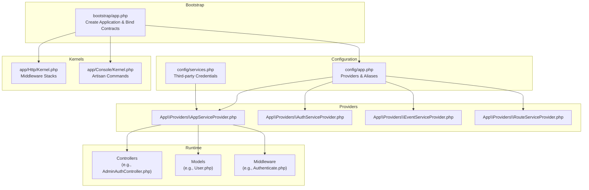
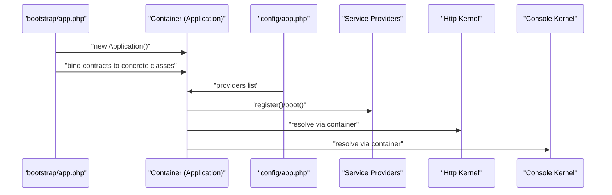
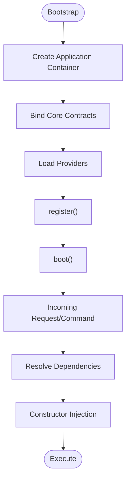
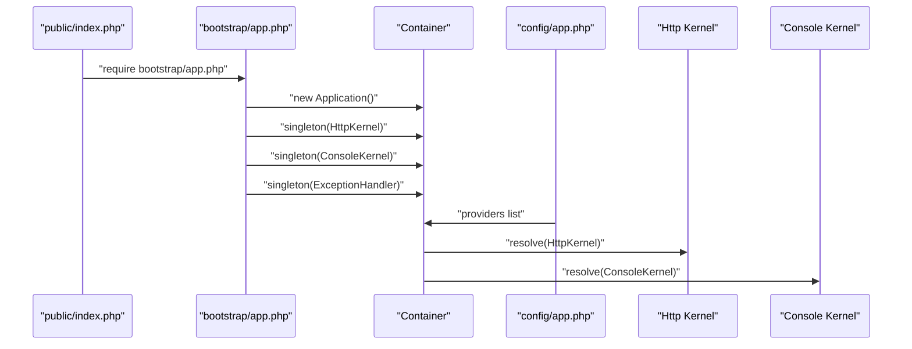
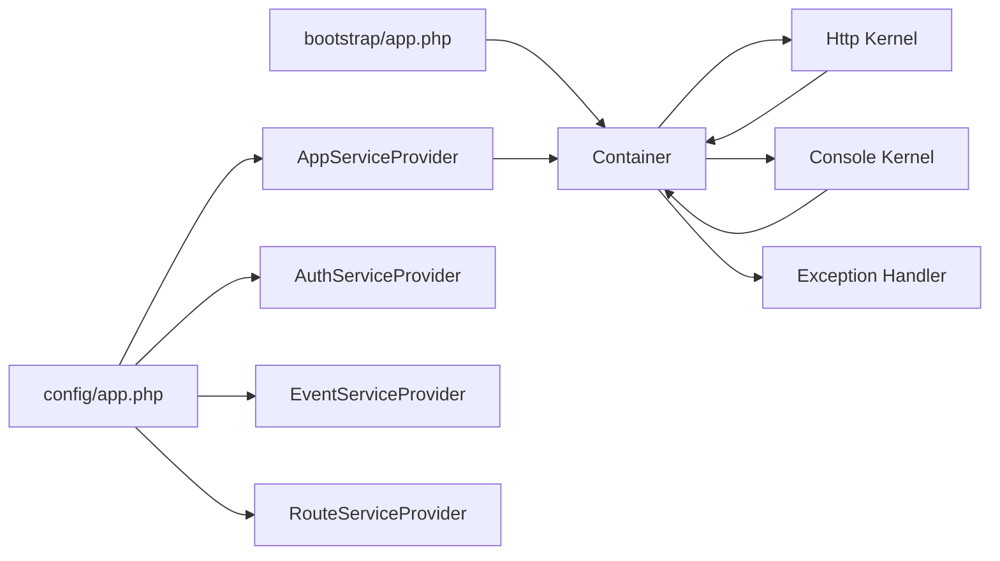

# Dependency Injection Container

<cite>
**Referenced Files in This Document**
- [app.php](file://bootstrap/app.php)
- [app.php](file://config/app.php)
- [app.php](file://config/services.php)
- [Kernel.php](file://app/Console/Kernel.php)
- [Kernel.php](file://app/Http/Kernel.php)
- [Authenticate.php](file://app/Http/Middleware/Authenticate.php)
- [AppServiceProvider.php](file://app/Providers/AppServiceProvider.php)
- [AuthServiceProvider.php](file://app/Providers/AuthServiceProvider.php)
- [EventServiceProvider.php](file://app/Providers/EventServiceProvider.php)
- [RouteServiceProvider.php](file://app/Providers/RouteServiceProvider.php)
- [Controller.php](file://app/Http/Controllers/Controller.php)
- [AdminAuthController.php](file://app/Http/Controllers/AdminAuthController.php)
- [ProfileController.php](file://app/Http/Controllers/Member/ProfileController.php)
- [User.php](file://app/Models/User.php)
</cite>

## Table of Contents
1. [Introduction](#introduction)
2. [Project Structure](#project-structure)
3. [Core Components](#core-components)
4. [Architecture Overview](#architecture-overview)
5. [Detailed Component Analysis](#detailed-component-analysis)
6. [Dependency Analysis](#dependency-analysis)
7. [Performance Considerations](#performance-considerations)
8. [Troubleshooting Guide](#troubleshooting-guide)
9. [Conclusion](#conclusion)
10. [Appendices](#appendices)

## Introduction
This document explains KatalogThrift’s dependency injection and service container implementation rooted in Laravel’s IoC container. It covers how the container acts as the “glue” for all components, automatic dependency resolution via constructor injection, and how contracts are bound to concrete implementations. It also documents service binding strategies (singleton, factory, prototype), the application bootstrap process, contextual binding concepts, abstract factories, testing strategies, and how Laravel’s macroable traits and container extensions integrate with the system.

## Project Structure
KatalogThrift follows Laravel conventions:
- The container instance is created early in the bootstrap process and bound to core interfaces.
- Service providers register and expose application services.
- HTTP and Console kernels define request lifecycles and middleware stacks.
- Controllers, middleware, and models rely on automatic resolution via the container.

**Diagram sources**
- [app.php:14-42](file://bootstrap/app.php#L14-L42)
- [app.php:158-171](file://config/app.php#L158-L171)
- [app.php:1-35](file://config/services.php#L1-L35)
- [Kernel.php:16-70](file://app/Http/Kernel.php#L16-L70)
- [Kernel.php:13-26](file://app/Console/Kernel.php#L13-L26)
- [AppServiceProvider.php:12-23](file://app/Providers/AppServiceProvider.php#L12-L23)
- [AuthServiceProvider.php:15-25](file://app/Providers/AuthServiceProvider.php#L15-L25)
- [EventServiceProvider.php:17-29](file://app/Providers/EventServiceProvider.php#L17-L29)
- [RouteServiceProvider.php:25-39](file://app/Providers/RouteServiceProvider.php#L25-L39)
- [AdminAuthController.php:9-53](file://app/Http/Controllers/AdminAuthController.php#L9-L53)
- [User.php:10-131](file://app/Models/User.php#L10-L131)
- [Authenticate.php:8-17](file://app/Http/Middleware/Authenticate.php#L8-L17)

**Section sources**
- [app.php:14-42](file://bootstrap/app.php#L14-L42)
- [app.php:158-171](file://config/app.php#L158-L171)
- [app.php:1-35](file://config/services.php#L1-L35)
- [Kernel.php:16-70](file://app/Http/Kernel.php#L16-L70)
- [Kernel.php:13-26](file://app/Console/Kernel.php#L13-L26)

## Core Components
- Application instance and container: Created at bootstrap and serves as the IoC container for the system.
- Contract-to-concrete bindings: Core interfaces are bound to concrete implementations (HTTP kernel, Console kernel, exception handler).
- Service providers: Centralized registration and bootstrapping of application services.
- Kernels: Define middleware stacks and command loading for HTTP and CLI lifecycles.
- Controllers, middleware, and models: Rely on automatic dependency resolution via constructor injection.

Key bindings established at bootstrap:
- HTTP Kernel contract to application HTTP kernel implementation.
- Console Kernel contract to application Console kernel implementation.
- Exception Handler contract to application exception handler.

Provider registration:
- Default providers merged with application-specific providers (App, Auth, Event, Route).

**Section sources**
- [app.php:29-42](file://bootstrap/app.php#L29-L42)
- [app.php:158-171](file://config/app.php#L158-L171)

## Architecture Overview
The container orchestrates the application lifecycle:
- Bootstrap creates the container and binds core contracts.
- Providers register services and expose bindings.
- Kernels load middleware and commands.
- Requests are resolved through the container, which injects dependencies into controllers, middleware, and models.

**Diagram sources**
- [app.php:14-42](file://bootstrap/app.php#L14-L42)
- [app.php:158-171](file://config/app.php#L158-L171)
- [Kernel.php:7-7](file://app/Http/Kernel.php#L7-L7)
- [Kernel.php:8-8](file://app/Console/Kernel.php#L8-L8)

## Detailed Component Analysis

### Container Lifecycle and Resolution Order
- Creation: The container is instantiated at bootstrap and becomes the central registry for bindings.
- Binding phase: Contracts are bound to concrete implementations (e.g., HTTP kernel).
- Provider phase: Providers run register() and boot() to add additional bindings and services.
- Resolution phase: On each request or command, the container resolves dependencies via constructor injection and parameter type-hints.

Resolution order highlights:
- Singleton bindings are reused across the request lifecycle.
- Unbound types are resolved using reflection and built-in resolvers.
- Fallback mechanisms include resolving facades and framework defaults.

**Diagram sources**
- [app.php:14-42](file://bootstrap/app.php#L14-L42)
- [app.php:158-171](file://config/app.php#L158-L171)

**Section sources**
- [app.php:14-42](file://bootstrap/app.php#L14-L42)
- [app.php:158-171](file://config/app.php#L158-L171)

### Service Binding Strategies
- Singleton bindings: Established at bootstrap for core contracts (HTTP kernel, Console kernel, exception handler). These instances persist for the application lifetime.
- Prototype bindings: Default behavior for unbound types; new instances are created per resolution.
- Factory bindings: Implemented via closure or callback in a provider’s register() method to control instantiation logic and dependencies.

Contextual binding:
- Laravel supports contextual binding to override bindings for specific resolutions. While not explicitly shown in the examined files, this pattern is commonly used in providers to tailor dependencies for specific controllers or contexts.

Abstract factories:
- Use closures in register() to encapsulate creation logic and pass container-managed dependencies to constructors.

Testing strategies:
- Replace bindings with test doubles using bind()/singleton() in tests.
- Use container::shouldReceive() patterns for mocks.
- Isolate container usage behind interfaces to simplify mocking.

**Section sources**
- [app.php:29-42](file://bootstrap/app.php#L29-L42)
- [AppServiceProvider.php:12-23](file://app/Providers/AppServiceProvider.php#L12-L23)

### Application Bootstrap Process
- The bootstrap file constructs the Application container and immediately binds core contracts to concrete classes.
- The configuration file lists autoloaded providers, ensuring they participate in the container lifecycle.
- Kernels are resolved by the container and used to handle requests and CLI commands.

**Diagram sources**
- [app.php:14-42](file://bootstrap/app.php#L14-L42)
- [app.php:158-171](file://config/app.php#L158-L171)
- [Kernel.php:7-7](file://app/Http/Kernel.php#L7-L7)
- [Kernel.php:8-8](file://app/Console/Kernel.php#L8-L8)

**Section sources**
- [app.php:14-42](file://bootstrap/app.php#L14-L42)
- [app.php:158-171](file://config/app.php#L158-L171)
- [Kernel.php:7-7](file://app/Http/Kernel.php#L7-L7)
- [Kernel.php:8-8](file://app/Console/Kernel.php#L8-L8)

### Constructor Injection Patterns
- Controllers: Extend a base controller class that integrates with the framework. Dependencies are typically injected via constructor injection in larger applications; in the examined controllers, dependencies are accessed via helpers or configuration.
- Models: Eloquent models do not rely on constructor injection but benefit from container-managed relations and services injected elsewhere.
- Middleware: Middleware classes receive the request and can leverage container-resolved dependencies internally.
- Services: Provided via service providers and resolved by the container when injected into controllers or other services.

Examples of injection points:
- Controllers: Access to Request and response helpers; dependencies can be injected via constructor.
- Middleware: Authentication middleware receives the request and delegates to framework gates.
- Models: Relations and helper methods operate on model attributes and external services.

Note: The examined controller files demonstrate usage of request and configuration helpers rather than explicit constructor injection. This does not preclude constructor injection; it reflects current implementation choices.

**Section sources**
- [Controller.php:9-12](file://app/Http/Controllers/Controller.php#L9-L12)
- [AdminAuthController.php:9-53](file://app/Http/Controllers/AdminAuthController.php#L9-L53)
- [ProfileController.php:9-32](file://app/Http/Controllers/Member/ProfileController.php#L9-L32)
- [Authenticate.php:8-17](file://app/Http/Middleware/Authenticate.php#L8-L17)
- [User.php:10-131](file://app/Models/User.php#L10-L131)

### Contextual Binding and Abstract Factories
- Contextual binding allows overriding a binding for a specific resolution. This is commonly implemented in a provider’s register() method to tailor dependencies for specific controllers or scenarios.
- Abstract factories are closures or callbacks registered in providers to encapsulate complex instantiation logic and supply container-managed dependencies.

These patterns are widely used in Laravel applications and complement the singleton and prototype strategies.

**Section sources**
- [AppServiceProvider.php:12-23](file://app/Providers/AppServiceProvider.php#L12-L23)

### Container Testing Strategies
- Replace bindings with mocks or fakes using bind()/singleton() in tests.
- Use container-driven mocks to verify interactions.
- Keep dependencies interface-based to simplify substitution in tests.

[No sources needed since this section provides general guidance]

### Laravel Macroable Traits and Container Extensions
- Laravel’s macroable traits enable extending classes with dynamic methods at runtime. The container participates by resolving and injecting dependencies into macro implementations.
- Container extensions can register custom resolution logic or aliases to support advanced composition patterns.

[No sources needed since this section provides general guidance]

## Dependency Analysis
The container’s dependency graph centers around:
- Bootstrap bindings for core contracts.
- Provider registrations contributing additional bindings.
- Kernels resolving middleware stacks and commands.
- Runtime components (controllers, middleware, models) relying on automatic resolution.

**Diagram sources**
- [app.php:14-42](file://bootstrap/app.php#L14-L42)
- [app.php:158-171](file://config/app.php#L158-L171)
- [Kernel.php:7-7](file://app/Http/Kernel.php#L7-L7)
- [Kernel.php:8-8](file://app/Console/Kernel.php#L8-L8)
- [AppServiceProvider.php:12-23](file://app/Providers/AppServiceProvider.php#L12-L23)
- [AuthServiceProvider.php:22-25](file://app/Providers/AuthServiceProvider.php#L22-L25)
- [EventServiceProvider.php:26-29](file://app/Providers/EventServiceProvider.php#L26-L29)
- [RouteServiceProvider.php:39-39](file://app/Providers/RouteServiceProvider.php#L39-L39)

**Section sources**
- [app.php:14-42](file://bootstrap/app.php#L14-L42)
- [app.php:158-171](file://config/app.php#L158-L171)
- [Kernel.php:7-7](file://app/Http/Kernel.php#L7-L7)
- [Kernel.php:8-8](file://app/Console/Kernel.php#L8-L8)

## Performance Considerations
- Prefer singleton bindings for expensive services to avoid repeated instantiation.
- Minimize heavy work in register(); defer to boot() when possible.
- Use caching and compiled service caches to speed up provider discovery and resolution.
- Keep dependency graphs shallow to reduce resolution overhead.

[No sources needed since this section provides general guidance]

## Troubleshooting Guide
- Unresolvable dependencies: Ensure the container can reflectively construct the class or register a binding/closure.
- Incorrect singleton behavior: Verify that the binding is indeed a singleton and not being overridden elsewhere.
- Provider not registering: Confirm the provider is listed in the autoloaded providers configuration.
- Middleware resolution issues: Check that middleware classes are resolvable and do not rely on unavailable dependencies.

**Section sources**
- [app.php:29-42](file://bootstrap/app.php#L29-L42)
- [app.php:158-171](file://config/app.php#L158-L171)

## Conclusion
KatalogThrift leverages Laravel’s IoC container to unify application components through contract-to-concrete bindings, automatic dependency resolution, and a structured bootstrap and provider lifecycle. While the examined controller files primarily use helpers and configuration, the container supports constructor injection and advanced patterns such as contextual binding, abstract factories, and testing strategies. By aligning service bindings and provider registrations with the container lifecycle, the application remains maintainable, extensible, and testable.

## Appendices
- Third-party service credentials are centralized in the services configuration file, enabling container-managed service registration and resolution downstream.

**Section sources**
- [app.php:1-35](file://config/services.php#L1-L35)