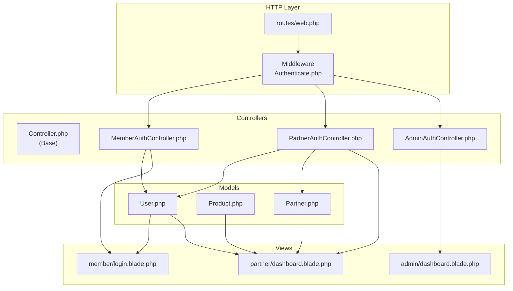
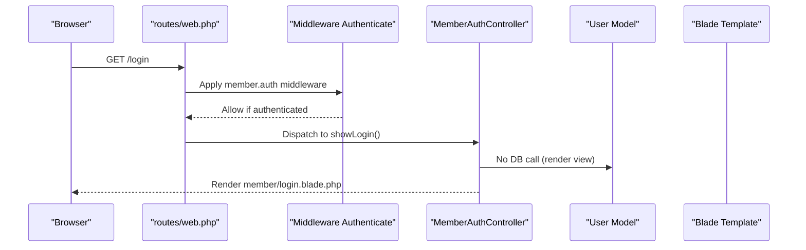
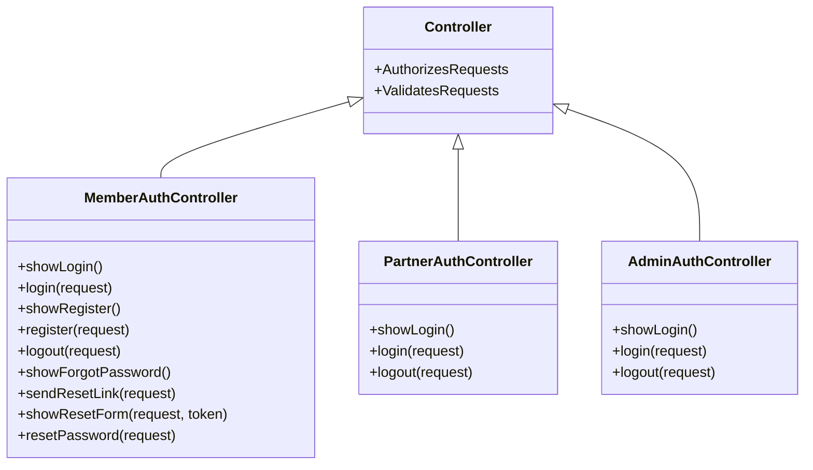
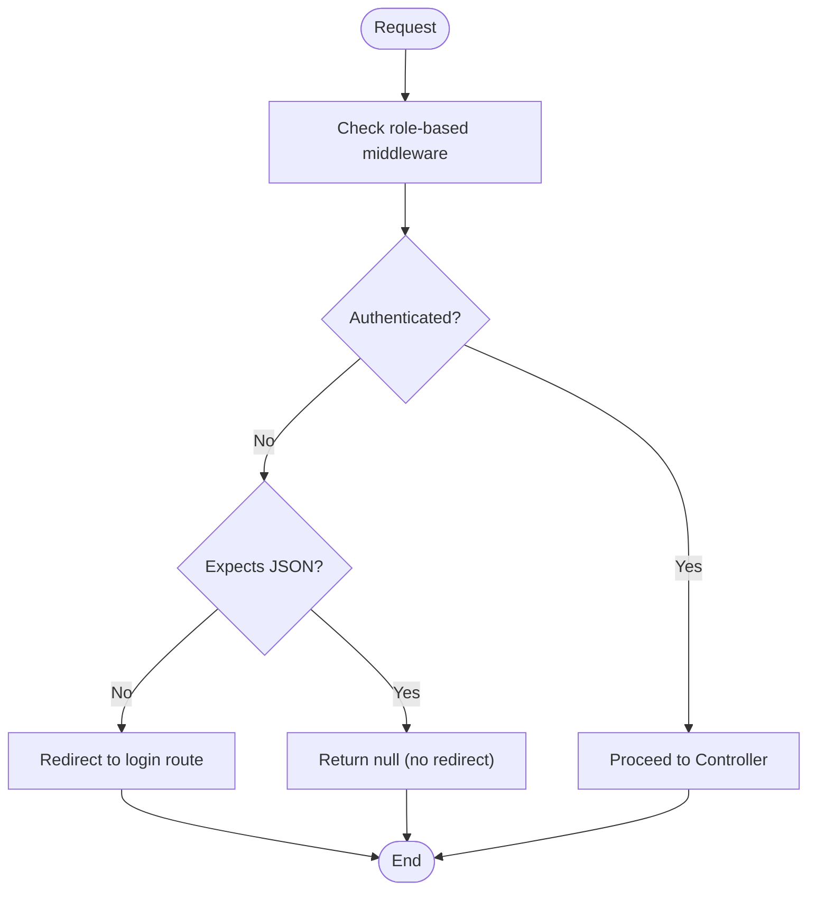
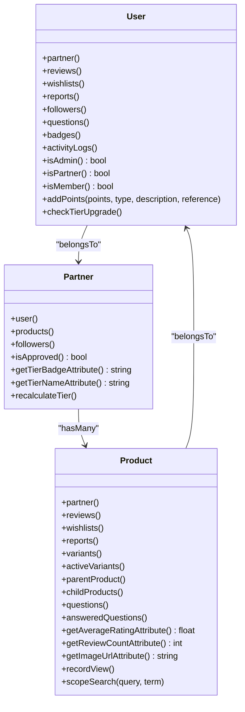
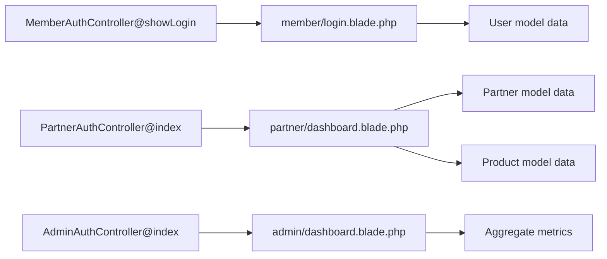
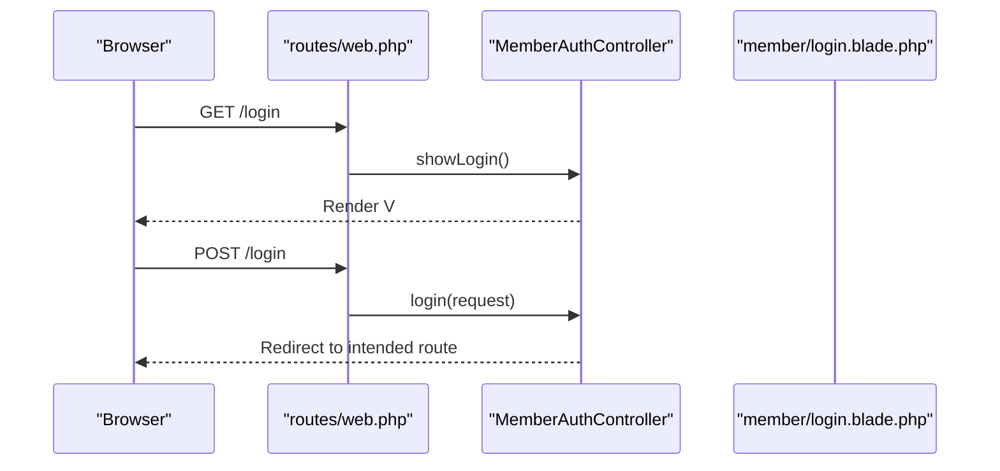
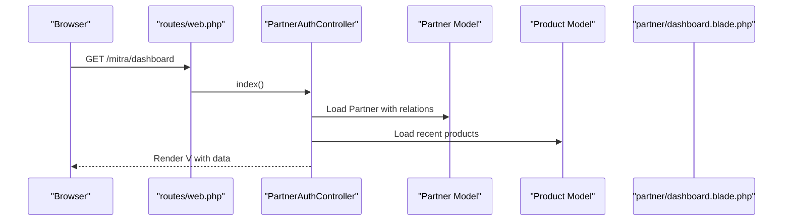
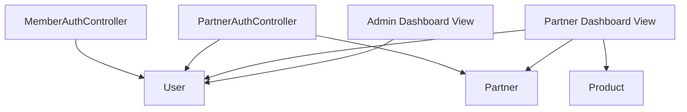

# MVC Pattern Implementation

<cite>
**Referenced Files in This Document**
- [Controller.php](file://app/Http/Controllers/Controller.php)
- [web.php](file://routes/web.php)
- [Authenticate.php](file://app/Http/Middleware/Authenticate.php)
- [MemberAuthController.php](file://app/Http/Controllers/Member/MemberAuthController.php)
- [PartnerAuthController.php](file://app/Http/Controllers/Partner/PartnerAuthController.php)
- [AdminAuthController.php](file://app/Http/Controllers/AdminAuthController.php)
- [User.php](file://app/Models/User.php)
- [Product.php](file://app/Models/Product.php)
- [Partner.php](file://app/Models/Partner.php)
- [login.blade.php](file://resources/views/member/login.blade.php)
- [dashboard.blade.php](file://resources/views/partner/dashboard.blade.php)
- [admin_dashboard.blade.php](file://resources/views/admin/dashboard.blade.php)
- [2014_10_12_000000_create_users_table.php](file://database/migrations/2014_10_12_000000_create_users_table.php)
</cite>

## Table of Contents
1. [Introduction](#introduction)
2. [Project Structure](#project-structure)
3. [Core Components](#core-components)
4. [Architecture Overview](#architecture-overview)
5. [Detailed Component Analysis](#detailed-component-analysis)
6. [Dependency Analysis](#dependency-analysis)
7. [Performance Considerations](#performance-considerations)
8. [Troubleshooting Guide](#troubleshooting-guide)
9. [Conclusion](#conclusion)

## Introduction
This document explains how KatalogThrift implements Laravel’s Model-View-Controller (MVC) pattern. It focuses on how the Controller layer orchestrates requests, how the Model layer encapsulates data and relationships, and how the View layer renders HTML using Blade templates. We also cover middleware-driven authentication, role-specific controllers, Eloquent relationships, and practical examples of request flows from controller to model to view.

## Project Structure
KatalogThrift follows Laravel conventions:
- Controllers under app/Http/Controllers, grouped by roles (Member, Partner, Admin)
- Models under app/Models representing domain entities
- Views under resources/views organized by role and feature
- Routes under routes/web.php defining HTTP endpoints per role and feature
- Middleware under app/Http/Middleware controlling access per role

**Diagram sources**
- [web.php:1-240](file://routes/web.php#L1-L240)
- [Authenticate.php:1-18](file://app/Http/Middleware/Authenticate.php#L1-L18)
- [Controller.php:1-13](file://app/Http/Controllers/Controller.php#L1-L13)
- [MemberAuthController.php:1-129](file://app/Http/Controllers/Member/MemberAuthController.php#L1-L129)
- [PartnerAuthController.php:1-60](file://app/Http/Controllers/Partner/PartnerAuthController.php#L1-L60)
- [AdminAuthController.php:1-54](file://app/Http/Controllers/AdminAuthController.php#L1-L54)
- [User.php:1-131](file://app/Models/User.php#L1-L131)
- [Product.php:1-132](file://app/Models/Product.php#L1-L132)
- [Partner.php:1-123](file://app/Models/Partner.php#L1-L123)
- [login.blade.php:1-59](file://resources/views/member/login.blade.php#L1-L59)
- [dashboard.blade.php:1-135](file://resources/views/partner/dashboard.blade.php#L1-L135)
- [admin_dashboard.blade.php:1-130](file://resources/views/admin/dashboard.blade.php#L1-L130)

**Section sources**
- [web.php:1-240](file://routes/web.php#L1-L240)
- [Controller.php:1-13](file://app/Http/Controllers/Controller.php#L1-L13)

## Core Components
- Base Controller: Provides shared authorization and validation traits.
- Role-specific Controllers: MemberAuthController, PartnerAuthController, AdminAuthController handle role-based authentication and actions.
- Models: User, Product, Partner define attributes, casts, relationships, and helper methods.
- Views: Blade templates render role-specific dashboards and forms.

Key responsibilities:
- Controller: Accepts requests, validates input, interacts with Models, and returns Views or redirects.
- Model: Encapsulates persistence, relationships, computed attributes, and helper logic.
- View: Renders data passed from Controllers, leveraging Blade’s template inheritance and components.

**Section sources**
- [Controller.php:9-12](file://app/Http/Controllers/Controller.php#L9-L12)
- [MemberAuthController.php:15-71](file://app/Http/Controllers/Member/MemberAuthController.php#L15-L71)
- [PartnerAuthController.php:11-58](file://app/Http/Controllers/Partner/PartnerAuthController.php#L11-L58)
- [AdminAuthController.php:9-52](file://app/Http/Controllers/AdminAuthController.php#L9-L52)
- [User.php:10-131](file://app/Models/User.php#L10-L131)
- [Product.php:9-132](file://app/Models/Product.php#L9-L132)
- [Partner.php:8-123](file://app/Models/Partner.php#L8-L123)

## Architecture Overview
The MVC flow in KatalogThrift:
- HTTP requests reach routes/web.php, which dispatch to role-specific controllers.
- Controllers use middleware to enforce authentication per guard/session.
- Controllers call Models to fetch or persist data.
- Controllers pass data to Blade views for rendering.

**Diagram sources**
- [web.php:76-80](file://routes/web.php#L76-L80)
- [Authenticate.php:13-16](file://app/Http/Middleware/Authenticate.php#L13-L16)
- [MemberAuthController.php:17-21](file://app/Http/Controllers/Member/MemberAuthController.php#L17-L21)
- [login.blade.php:1-59](file://resources/views/member/login.blade.php#L1-L59)

## Detailed Component Analysis

### Base Controller and Role-Specific Controllers
- Base Controller: Extends Laravel’s BaseController and uses AuthorizesRequests and ValidatesRequests traits for consistent authorization and validation behavior across all controllers.
- MemberAuthController: Handles member login/register/logout and password reset flows, validating input, authenticating via the default guard, and rendering member-specific views.
- PartnerAuthController: Handles partner login with guard('partner'), validates account approval and status, and renders partner dashboard after successful login.
- AdminAuthController: Manages admin login via session-based guard, storing an admin flag in the session and rendering admin dashboard.

**Diagram sources**
- [Controller.php:9-12](file://app/Http/Controllers/Controller.php#L9-L12)
- [MemberAuthController.php:15-128](file://app/Http/Controllers/Member/MemberAuthController.php#L15-L128)
- [PartnerAuthController.php:11-58](file://app/Http/Controllers/Partner/PartnerAuthController.php#L11-L58)
- [AdminAuthController.php:9-52](file://app/Http/Controllers/AdminAuthController.php#L9-L52)

**Section sources**
- [Controller.php:9-12](file://app/Http/Controllers/Controller.php#L9-L12)
- [MemberAuthController.php:17-71](file://app/Http/Controllers/Member/MemberAuthController.php#L17-L71)
- [PartnerAuthController.php:13-58](file://app/Http/Controllers/Partner/PartnerAuthController.php#L13-L58)
- [AdminAuthController.php:11-52](file://app/Http/Controllers/AdminAuthController.php#L11-L52)

### Authentication Middleware and Guards
- Authenticate middleware defines the redirect path for unauthenticated users depending on JSON expectations.
- Member routes apply member.auth middleware group; Partner routes apply partner.auth; Admin routes apply admin.auth middleware group (configured via route prefixes and middleware assignments).

**Diagram sources**
- [Authenticate.php:13-16](file://app/Http/Middleware/Authenticate.php#L13-L16)
- [web.php:89-116](file://routes/web.php#L89-L116)
- [web.php:119-167](file://routes/web.php#L119-L167)
- [web.php:170-239](file://routes/web.php#L170-L239)

**Section sources**
- [Authenticate.php:13-16](file://app/Http/Middleware/Authenticate.php#L13-L16)
- [web.php:89-116](file://routes/web.php#L89-L116)
- [web.php:119-167](file://routes/web.php#L119-L167)
- [web.php:170-239](file://routes/web.php#L170-L239)

### Model Layer: Eloquent Relationships, Attributes, and Helpers
- User: Defines fillable, hidden, casts, belongsTo Partner, hasMany for Reviews, Wishlists, Reports, Followers, Questions, UserBadges, and ActivityLogs. Includes role checks and gamification helpers (addPoints, checkTierUpgrade).
- Product: BelongsTo Partner, hasMany Reviews, Wishlists, Reports, Variants, Questions; computed attributes average rating and counts; image URL resolution; search scope.
- Partner: BelongsTo User, hasMany Products and Followers; computed attributes average rating and counts; logo URL resolution; tier helpers and recalculation.

**Diagram sources**
- [User.php:28-129](file://app/Models/User.php#L28-L129)
- [Partner.php:28-121](file://app/Models/Partner.php#L28-L121)
- [Product.php:36-130](file://app/Models/Product.php#L36-L130)

**Section sources**
- [User.php:14-131](file://app/Models/User.php#L14-L131)
- [Product.php:13-132](file://app/Models/Product.php#L13-L132)
- [Partner.php:10-123](file://app/Models/Partner.php#L10-L123)

### View Layer: Blade Templates, Layout Inheritance, and Data Binding
- Member Login: Renders a styled form with CSRF protection, binds errors and success messages, and posts to member.login.submit.
- Partner Dashboard: Sidebar navigation, stats cards, product listings, and links to manage products, analytics, questions, notifications, and profile.
- Admin Dashboard: Navigation for managing partners, products, editorial, UGC, reviews, reports, badges, analytics, and notifications.

**Diagram sources**
- [MemberAuthController.php:17-21](file://app/Http/Controllers/Member/MemberAuthController.php#L17-L21)
- [PartnerAuthController.php:13-17](file://app/Http/Controllers/Partner/PartnerAuthController.php#L13-L17)
- [AdminAuthController.php:11-17](file://app/Http/Controllers/AdminAuthController.php#L11-L17)
- [login.blade.php:38-45](file://resources/views/member/login.blade.php#L38-L45)
- [dashboard.blade.php:70-131](file://resources/views/partner/dashboard.blade.php#L70-L131)
- [admin_dashboard.blade.php:79-126](file://resources/views/admin/dashboard.blade.php#L79-L126)

**Section sources**
- [login.blade.php:1-59](file://resources/views/member/login.blade.php#L1-L59)
- [dashboard.blade.php:1-135](file://resources/views/partner/dashboard.blade.php#L1-L135)
- [admin_dashboard.blade.php:1-130](file://resources/views/admin/dashboard.blade.php#L1-L130)

### Practical Examples: Request Flow from Controller to Model to View

#### Example 1: Member Login
- Route: GET /login mapped to MemberAuthController@showLogin
- Controller: Validates presence of existing session; renders member/login.blade.php
- View: Displays login form; on submit, POST to member.login.submit handled by MemberAuthController@login which authenticates via default guard and redirects

**Diagram sources**
- [web.php:76-80](file://routes/web.php#L76-L80)
- [MemberAuthController.php:17-36](file://app/Http/Controllers/Member/MemberAuthController.php#L17-L36)
- [login.blade.php:38-45](file://resources/views/member/login.blade.php#L38-L45)

#### Example 2: Partner Dashboard Rendering
- Route: GET /mitra/dashboard mapped to PartnerAuthController@index
- Controller: Uses partner.auth middleware; loads Partner and related data (products, reviews, ratings)
- View: partner/dashboard.blade.php receives $partner, $totalProducts, $activeProducts, $soldProducts, $reviewCount, $avgRating, $recentProducts

**Diagram sources**
- [web.php:124-125](file://routes/web.php#L124-L125)
- [PartnerAuthController.php:13-17](file://app/Http/Controllers/Partner/PartnerAuthController.php#L13-L17)
- [Partner.php:28-48](file://app/Models/Partner.php#L28-L48)
- [Product.php:36-79](file://app/Models/Product.php#L36-L79)
- [dashboard.blade.php:70-131](file://resources/views/partner/dashboard.blade.php#L70-L131)

### Data Validation and Error Handling Approaches
- Validation: Controllers use request()->validate() to validate credentials and inputs, returning back() with errors on failure.
- Authentication Failures: PartnerAuthController checks partner existence and approval status, returning appropriate error messages.
- Session Management: Controllers invalidate and regenerate tokens on logout to prevent session fixation.

Best practices observed:
- Keep validation close to the controller action.
- Use guard-specific attempts for role-based authentication.
- Centralize redirect logic in middleware for consistent UX.

**Section sources**
- [MemberAuthController.php:25-36](file://app/Http/Controllers/Member/MemberAuthController.php#L25-L36)
- [PartnerAuthController.php:21-50](file://app/Http/Controllers/Partner/PartnerAuthController.php#L21-L50)
- [AdminAuthController.php:22-43](file://app/Http/Controllers/AdminAuthController.php#L22-L43)

### Controller Composition, Service Injection, and View Rendering Optimization
- Composition: Controllers extend a base class that provides authorization and validation traits, promoting reuse.
- Service Injection: While not explicitly shown in the analyzed files, Laravel’s container supports injecting services into controllers via constructor or method parameters.
- View Rendering: Blade templates bind model attributes directly, minimizing logic in controllers and keeping views declarative.

Recommendations:
- Inject services via constructor to decouple controllers from concrete implementations.
- Use view composers or Blade components for reusable UI fragments.
- Cache expensive computed attributes (e.g., Partner averages) to reduce N+1 queries.

**Section sources**
- [Controller.php:9-12](file://app/Http/Controllers/Controller.php#L9-L12)
- [Partner.php:61-70](file://app/Models/Partner.php#L61-L70)
- [Product.php:86-94](file://app/Models/Product.php#L86-L94)

## Dependency Analysis
The following diagram shows key dependencies among controllers, models, and views:

**Diagram sources**
- [MemberAuthController.php:5-12](file://app/Http/Controllers/Member/MemberAuthController.php#L5-L12)
- [PartnerAuthController.php:5-9](file://app/Http/Controllers/Partner/PartnerAuthController.php#L5-L9)
- [User.php:28-31](file://app/Models/User.php#L28-L31)
- [Partner.php:28-36](file://app/Models/Partner.php#L28-L36)
- [Product.php:36-44](file://app/Models/Product.php#L36-L44)
- [dashboard.blade.php:70-131](file://resources/views/partner/dashboard.blade.php#L70-L131)

**Section sources**
- [MemberAuthController.php:5-12](file://app/Http/Controllers/Member/MemberAuthController.php#L5-L12)
- [PartnerAuthController.php:5-9](file://app/Http/Controllers/Partner/PartnerAuthController.php#L5-L9)
- [User.php:28-31](file://app/Models/User.php#L28-L31)
- [Partner.php:28-36](file://app/Models/Partner.php#L28-L36)
- [Product.php:36-44](file://app/Models/Product.php#L36-L44)
- [dashboard.blade.php:70-131](file://resources/views/partner/dashboard.blade.php#L70-L131)

## Performance Considerations
- Eager loading: Use with() or load() to avoid N+1 queries when rendering Partner dashboard with products and reviews.
- Computed attributes: Cache expensive aggregates (e.g., Partner average rating) to reduce repeated joins.
- Image URLs: Prefer stored paths and resolve via Storage::url to minimize redundant computations.
- Middleware: Keep authentication checks lightweight; avoid heavy logic in middleware.

## Troubleshooting Guide
Common issues and resolutions:
- Authentication loops: Ensure middleware is applied to the correct routes and guards. Verify session state for admin and partner guards.
- Validation errors: Confirm request()->validate() rules match form fields and return proper error keys.
- Unauthorized access: Check role checks (isAdmin(), isPartner(), isMember()) and partner approval status before granting access.
- View rendering: Ensure all variables passed to views (e.g., $partner, $totalProducts) are resolved before rendering.

**Section sources**
- [Authenticate.php:13-16](file://app/Http/Middleware/Authenticate.php#L13-L16)
- [MemberAuthController.php:25-36](file://app/Http/Controllers/Member/MemberAuthController.php#L25-L36)
- [PartnerAuthController.php:29-43](file://app/Http/Controllers/Partner/PartnerAuthController.php#L29-L43)
- [User.php:68-81](file://app/Models/User.php#L68-L81)
- [Partner.php:72-80](file://app/Models/Partner.php#L72-L80)

## Conclusion
KatalogThrift demonstrates a clean MVC separation:
- Controllers orchestrate role-specific flows and delegate validation and authorization to middleware and traits.
- Models encapsulate relationships, computed attributes, and helper logic for gamification and analytics.
- Views render role-scoped dashboards and forms with minimal logic, relying on data supplied by controllers.

By adhering to these patterns—centralized middleware, trait-based authorization/validation, Eloquent relationships, and Blade-driven rendering—KatalogThrift achieves maintainable, testable, and scalable code.