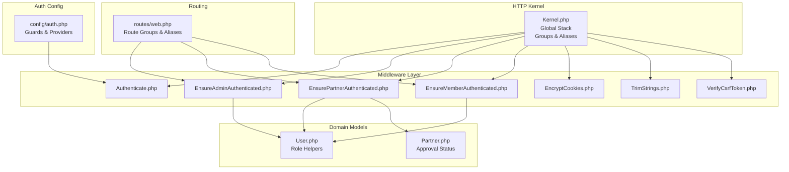
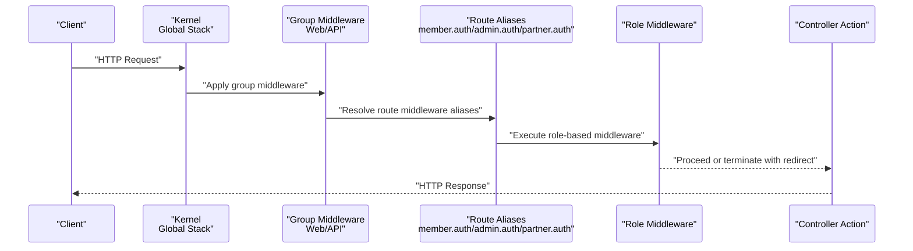
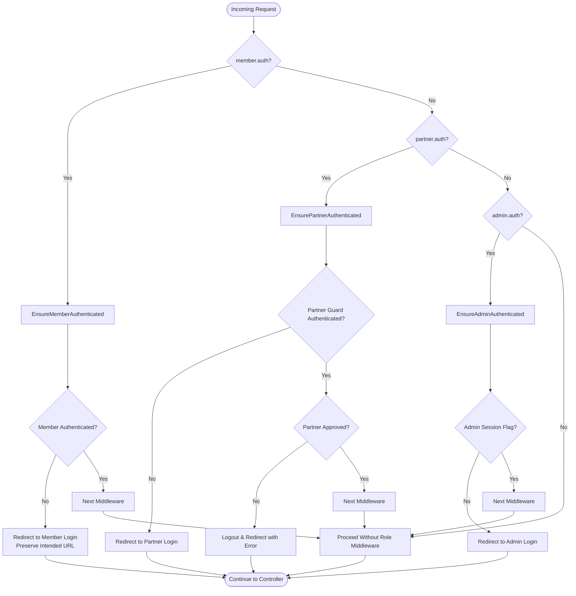
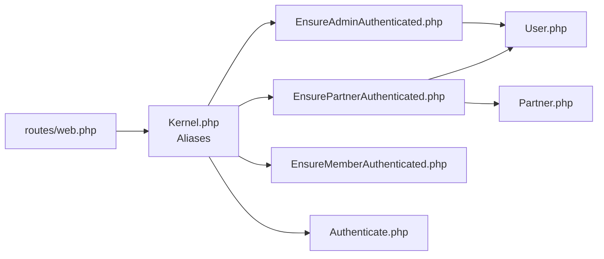

# Middleware Pipeline Architecture

<cite>
**Referenced Files in This Document**
- [Kernel.php](file://app/Http/Kernel.php)
- [Authenticate.php](file://app/Http/Middleware/Authenticate.php)
- [EnsureAdminAuthenticated.php](file://app/Http/Middleware/EnsureAdminAuthenticated.php)
- [EnsureMemberAuthenticated.php](file://app/Http/Middleware/EnsureMemberAuthenticated.php)
- [EnsurePartnerAuthenticated.php](file://app/Http/Middleware/EnsurePartnerAuthenticated.php)
- [EncryptCookies.php](file://app/Http/Middleware/EncryptCookies.php)
- [TrimStrings.php](file://app/Http/Middleware/TrimStrings.php)
- [VerifyCsrfToken.php](file://app/Http/Middleware/VerifyCsrfToken.php)
- [auth.php](file://config/auth.php)
- [web.php](file://routes/web.php)
- [User.php](file://app/Models/User.php)
- [Partner.php](file://app/Models/Partner.php)
</cite>

## Table of Contents
1. [Introduction](#introduction)
2. [Project Structure](#project-structure)
3. [Core Components](#core-components)
4. [Architecture Overview](#architecture-overview)
5. [Detailed Component Analysis](#detailed-component-analysis)
6. [Dependency Analysis](#dependency-analysis)
7. [Performance Considerations](#performance-considerations)
8. [Troubleshooting Guide](#troubleshooting-guide)
9. [Conclusion](#conclusion)

## Introduction
This document explains KatalogThrift’s middleware pipeline architecture with a focus on the global middleware stack, route middleware registration, and middleware ordering in the kernel. It details the authentication middleware chain and role-based access control for Member, Partner, and Administrator users. It also covers custom middleware implementation patterns, request/response modification, early termination scenarios, middleware grouping strategies, priority handling, performance considerations, testing approaches, exception handling, debugging, and integration with Laravel’s event system and request lifecycle.

## Project Structure
KatalogThrift organizes middleware configuration centrally in the HTTP kernel and registers role-specific middleware via aliases. Routes apply middleware groups and individual aliases to enforce access control per area (public, member, partner, admin). Authentication guards and providers are configured under the auth configuration.

**Diagram sources**
- [Kernel.php:16-70](file://app/Http/Kernel.php#L16-L70)
- [web.php:89-116](file://routes/web.php#L89-L116)
- [web.php:119-167](file://routes/web.php#L119-L167)
- [web.php:170-239](file://routes/web.php#L170-L239)
- [auth.php:38-47](file://config/auth.php#L38-L47)
- [User.php:68-82](file://app/Models/User.php#L68-L82)
- [Partner.php:72-81](file://app/Models/Partner.php#L72-L81)

**Section sources**
- [Kernel.php:16-70](file://app/Http/Kernel.php#L16-L70)
- [web.php:89-116](file://routes/web.php#L89-L116)
- [web.php:119-167](file://routes/web.php#L119-L167)
- [web.php:170-239](file://routes/web.php#L170-L239)
- [auth.php:38-47](file://config/auth.php#L38-L47)

## Core Components
- Global middleware stack: Runs on every request, including proxy trust, CORS, maintenance prevention, post size validation, string trimming, and empty string conversion.
- Middleware groups: 
  - Web group: Cookies, queued cookies, session, shared errors, CSRF verification, and route bindings.
  - API group: Throttling and route bindings.
- Middleware aliases:
  - Role-based authentication: admin.auth, partner.auth, member.auth.
  - General authentication: auth.
- Role-based middleware:
  - EnsureAdminAuthenticated: checks admin session flag.
  - EnsurePartnerAuthenticated: validates partner guard and approval status.
  - EnsureMemberAuthenticated: checks member authentication and redirects unauthenticated users.
  - Authenticate: centralized redirect logic for authentication failures.

**Section sources**
- [Kernel.php:16-46](file://app/Http/Kernel.php#L16-L46)
- [Kernel.php:55-70](file://app/Http/Kernel.php#L55-L70)
- [EnsureAdminAuthenticated.php:16-23](file://app/Http/Middleware/EnsureAdminAuthenticated.php#L16-L23)
- [EnsurePartnerAuthenticated.php:11-25](file://app/Http/Middleware/EnsurePartnerAuthenticated.php#L11-L25)
- [EnsureMemberAuthenticated.php:11-18](file://app/Http/Middleware/EnsureMemberAuthenticated.php#L11-L18)
- [Authenticate.php:13-16](file://app/Http/Middleware/Authenticate.php#L13-L16)

## Architecture Overview
The middleware pipeline executes in a deterministic order:
1. Global middleware stack runs for every request.
2. Route group middleware is applied based on the matched route’s group.
3. Route middleware aliases are resolved and executed in sequence.
4. Controller action receives the modified request and returns a response.
Role-based middleware enforces access control by checking session/guard state and user attributes, potentially terminating the chain early with redirects.

**Diagram sources**
- [Kernel.php:16-46](file://app/Http/Kernel.php#L16-L46)
- [web.php:89-116](file://routes/web.php#L89-L116)
- [web.php:119-167](file://routes/web.php#L119-L167)
- [web.php:170-239](file://routes/web.php#L170-L239)

## Detailed Component Analysis

### Global Middleware Stack
- Purpose: Normalize and secure requests globally.
- Includes proxy trust, CORS, maintenance mode handling, post size validation, string trimming, and empty string conversion.
- Execution: Always runs first, ensuring downstream middleware and controllers operate on sanitized inputs.

**Section sources**
- [Kernel.php:16-24](file://app/Http/Kernel.php#L16-L24)

### Middleware Groups
- Web group:
  - Cookies encryption, queued cookies, session start, shared errors, CSRF verification, and route binding substitution.
- API group:
  - Request throttling and route binding substitution.

These groups encapsulate common cross-cutting concerns for their respective transport contexts.

**Section sources**
- [Kernel.php:31-46](file://app/Http/Kernel.php#L31-L46)

### Middleware Aliases and Route Registration
- Aliases:
  - auth → Authenticate
  - member.auth → EnsureMemberAuthenticated
  - partner.auth → EnsurePartnerAuthenticated
  - admin.auth → EnsureAdminAuthenticated
- Routes apply these aliases to group blocks:
  - Member-protected routes use member.auth.
  - Partner-protected routes use partner.auth.
  - Admin-protected routes use admin.auth.

This pattern centralizes access control enforcement and improves readability.

**Section sources**
- [Kernel.php:55-70](file://app/Http/Kernel.php#L55-L70)
- [web.php:89-116](file://routes/web.php#L89-L116)
- [web.php:119-167](file://routes/web.php#L119-L167)
- [web.php:170-239](file://routes/web.php#L170-L239)

### Authentication Middleware Chain and Role-Based Access Control
- Member access control:
  - Uses member.auth alias mapped to EnsureMemberAuthenticated.
  - Checks member authentication; if not authenticated, redirects to member login while preserving intended URL.
- Partner access control:
  - Uses partner.auth alias mapped to EnsurePartnerAuthenticated.
  - Checks partner guard authentication and verifies partner approval status; terminates early with redirect and error if not approved.
- Admin access control:
  - Uses admin.auth alias mapped to EnsureAdminAuthenticated.
  - Checks admin session flag; terminates early with redirect to admin login if not authenticated.

**Diagram sources**
- [web.php:89-116](file://routes/web.php#L89-L116)
- [web.php:119-167](file://routes/web.php#L119-L167)
- [web.php:170-239](file://routes/web.php#L170-L239)
- [EnsureMemberAuthenticated.php:11-18](file://app/Http/Middleware/EnsureMemberAuthenticated.php#L11-L18)
- [EnsurePartnerAuthenticated.php:11-25](file://app/Http/Middleware/EnsurePartnerAuthenticated.php#L11-L25)
- [EnsureAdminAuthenticated.php:16-23](file://app/Http/Middleware/EnsureAdminAuthenticated.php#L16-L23)

**Section sources**
- [web.php:89-116](file://routes/web.php#L89-L116)
- [web.php:119-167](file://routes/web.php#L119-L167)
- [web.php:170-239](file://routes/web.php#L170-L239)
- [EnsureMemberAuthenticated.php:11-18](file://app/Http/Middleware/EnsureMemberAuthenticated.php#L11-L18)
- [EnsurePartnerAuthenticated.php:11-25](file://app/Http/Middleware/EnsurePartnerAuthenticated.php#L11-L25)
- [EnsureAdminAuthenticated.php:16-23](file://app/Http/Middleware/EnsureAdminAuthenticated.php#L16-L23)

### Custom Middleware Implementation Patterns
- Pattern: handle(Request, Closure): Response
  - Read request/session/guard state.
  - Optionally modify request attributes.
  - Early return with redirect or abort to terminate the chain.
  - Call $next($request) to pass control downstream.
- Examples:
  - EnsureMemberAuthenticated: checks auth and redirects with intended URL preservation.
  - EnsurePartnerAuthenticated: validates guard and approval; logs out and redirects with error if not approved.
  - EnsureAdminAuthenticated: checks admin session flag and redirects otherwise.

**Section sources**
- [EnsureMemberAuthenticated.php:11-18](file://app/Http/Middleware/EnsureMemberAuthenticated.php#L11-L18)
- [EnsurePartnerAuthenticated.php:11-25](file://app/Http/Middleware/EnsurePartnerAuthenticated.php#L11-L25)
- [EnsureAdminAuthenticated.php:16-23](file://app/Http/Middleware/EnsureAdminAuthenticated.php#L16-L23)

### Request/Response Modification and Early Termination
- Request modification:
  - Middleware can set session flags (e.g., admin authentication).
  - Middleware can read and adjust request attributes before invoking $next.
- Early termination:
  - Redirects to login routes with appropriate messages.
  - Immediate response to prevent controller execution.
- Downstream propagation:
  - $next($request) passes the modified request to the next middleware/controller.

**Section sources**
- [EnsureAdminAuthenticated.php:18-20](file://app/Http/Middleware/EnsureAdminAuthenticated.php#L18-L20)
- [EnsurePartnerAuthenticated.php:13-23](file://app/Http/Middleware/EnsurePartnerAuthenticated.php#L13-L23)
- [EnsureMemberAuthenticated.php:13-16](file://app/Http/Middleware/EnsureMemberAuthenticated.php#L13-L16)

### Conditional Middleware Application
- Routes conditionally apply middleware via route groups:
  - Member-protected group applies member.auth.
  - Partner-protected group applies partner.auth.
  - Admin-protected group applies admin.auth.
- This ensures only relevant role middleware is enforced per route.

**Section sources**
- [web.php:89-116](file://routes/web.php#L89-L116)
- [web.php:119-167](file://routes/web.php#L119-L167)
- [web.php:170-239](file://routes/web.php#L170-L239)

### Middleware Ordering in the Kernel
- Global stack precedes group middleware.
- Group middleware precedes route aliases.
- Within each layer, ordering follows declaration order in the kernel and route files.
- For example, CSRF verification occurs after cookies and session initialization in the web group.

**Section sources**
- [Kernel.php:16-46](file://app/Http/Kernel.php#L16-L46)
- [Kernel.php:31-46](file://app/Http/Kernel.php#L31-L46)

### Integration with Laravel’s Event System and Request Lifecycle
- Authentication middleware leverages Laravel’s session and guard systems, which integrate with events and notifications.
- Domain models (User, Partner) encapsulate role and approval logic, supporting event-driven updates (e.g., tier recalculations and activity logging).

**Section sources**
- [User.php:68-82](file://app/Models/User.php#L68-L82)
- [Partner.php:72-81](file://app/Models/Partner.php#L72-L81)

## Dependency Analysis
The routing layer depends on kernel-defined aliases and groups. Role middleware depends on guards and models for state checks. Authentication redirection behavior is influenced by the centralized Authenticate middleware.

**Diagram sources**
- [web.php:89-116](file://routes/web.php#L89-L116)
- [web.php:119-167](file://routes/web.php#L119-L167)
- [web.php:170-239](file://routes/web.php#L170-L239)
- [Kernel.php:55-70](file://app/Http/Kernel.php#L55-L70)
- [EnsureAdminAuthenticated.php:16-23](file://app/Http/Middleware/EnsureAdminAuthenticated.php#L16-L23)
- [EnsurePartnerAuthenticated.php:11-25](file://app/Http/Middleware/EnsurePartnerAuthenticated.php#L11-L25)
- [EnsureMemberAuthenticated.php:11-18](file://app/Http/Middleware/EnsureMemberAuthenticated.php#L11-L18)
- [User.php:68-82](file://app/Models/User.php#L68-L82)
- [Partner.php:72-81](file://app/Models/Partner.php#L72-L81)
- [Authenticate.php:13-16](file://app/Http/Middleware/Authenticate.php#L13-L16)

**Section sources**
- [web.php:89-116](file://routes/web.php#L89-L116)
- [web.php:119-167](file://routes/web.php#L119-L167)
- [web.php:170-239](file://routes/web.php#L170-L239)
- [Kernel.php:55-70](file://app/Http/Kernel.php#L55-L70)
- [User.php:68-82](file://app/Models/User.php#L68-L82)
- [Partner.php:72-81](file://app/Models/Partner.php#L72-L81)
- [Authenticate.php:13-16](file://app/Http/Middleware/Authenticate.php#L13-L16)

## Performance Considerations
- Minimize heavy operations inside middleware; defer to services or caching.
- Prefer guard-based checks over repeated database queries; leverage session flags for admin state.
- Keep global middleware minimal to reduce overhead on every request.
- Use route throttling in the API group to protect endpoints under load.

[No sources needed since this section provides general guidance]

## Troubleshooting Guide
- Authentication redirects unexpectedly:
  - Verify member.auth, partner.auth, and admin.auth aliases are applied to the correct route groups.
  - Confirm session flags and guard states align with expectations.
- Partner access denied:
  - Ensure the partner user is associated and approved; review approval logic in partner middleware.
- Member access blocked:
  - Check intended URL preservation and login route availability.
- Debugging middleware chains:
  - Add logging around middleware entry/exit and guard checks.
  - Temporarily remove or bypass middleware to isolate issues.

**Section sources**
- [web.php:89-116](file://routes/web.php#L89-L116)
- [web.php:119-167](file://routes/web.php#L119-L167)
- [web.php:170-239](file://routes/web.php#L170-L239)
- [EnsurePartnerAuthenticated.php:17-23](file://app/Http/Middleware/EnsurePartnerAuthenticated.php#L17-L23)
- [EnsureMemberAuthenticated.php:13-16](file://app/Http/Middleware/EnsureMemberAuthenticated.php#L13-L16)
- [EnsureAdminAuthenticated.php:18-20](file://app/Http/Middleware/EnsureAdminAuthenticated.php#L18-L20)

## Conclusion
KatalogThrift’s middleware pipeline combines a concise global stack, structured middleware groups, and role-based middleware aliases to enforce access control across Member, Partner, and Admin domains. The kernel’s ordering and route-level grouping ensure predictable execution, while centralized authentication middleware provides consistent redirect behavior. By leveraging guard states, session flags, and domain models, the system achieves robust RBAC with clear extension points for customization, performance optimization, and maintainability.