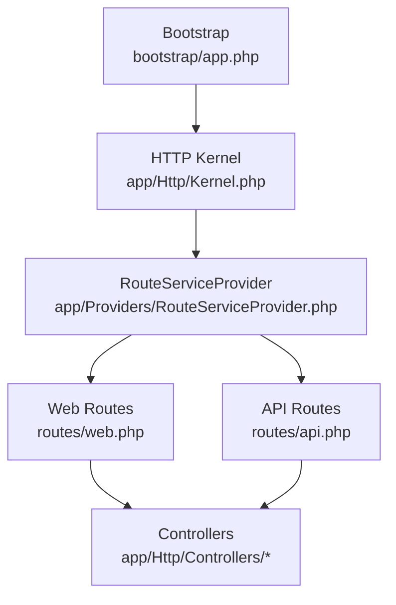
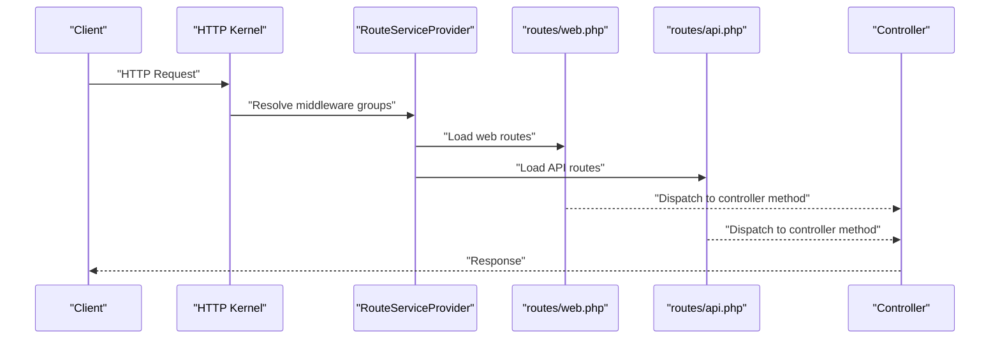
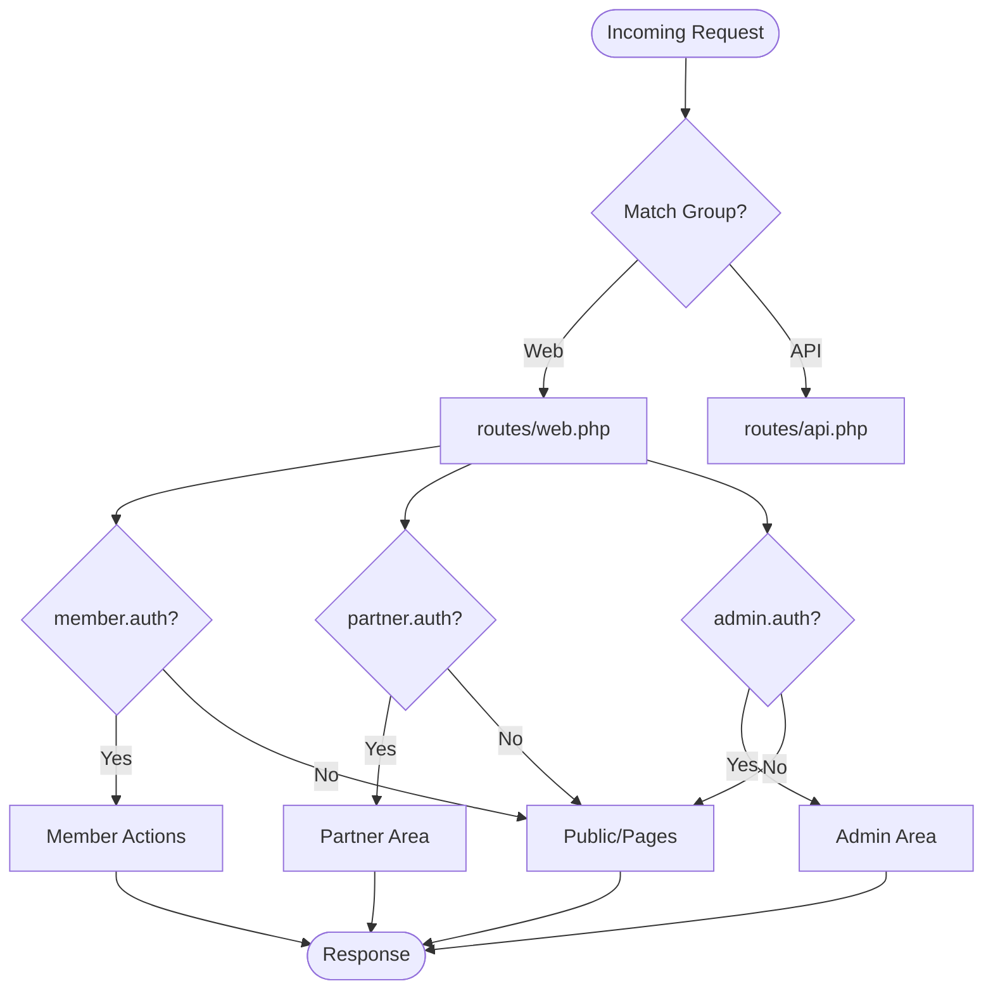
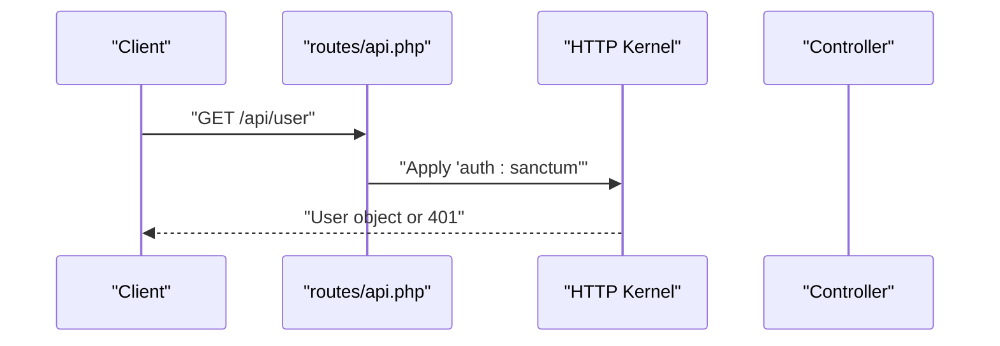
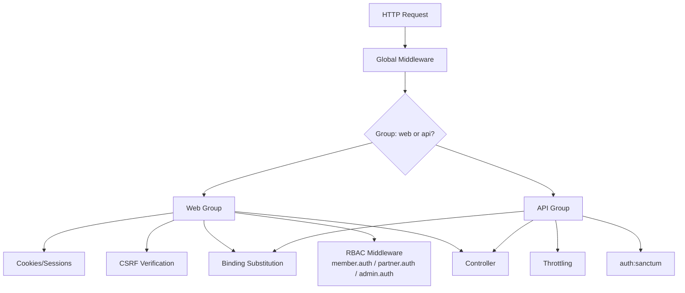
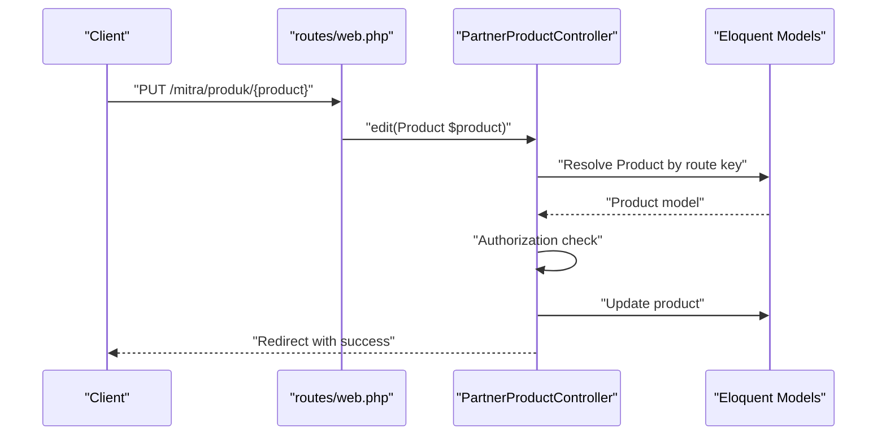
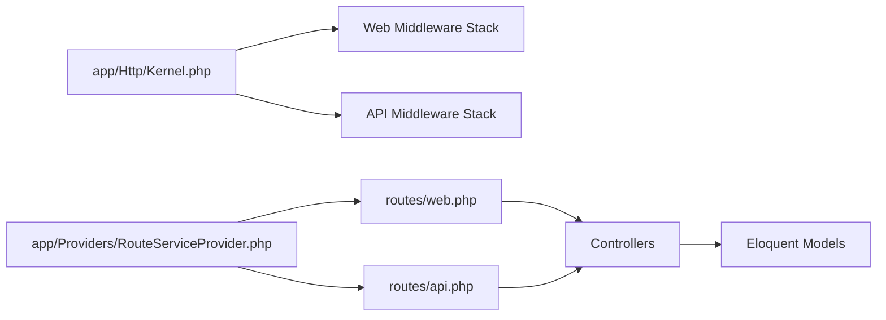

# Routing System Architecture

<cite>
**Referenced Files in This Document**
- [routes/web.php](file://routes/web.php)
- [routes/api.php](file://routes/api.php)
- [app/Http/Kernel.php](file://app/Http/Kernel.php)
- [app/Providers/RouteServiceProvider.php](file://app/Providers/RouteServiceProvider.php)
- [app/Http/Middleware/Authenticate.php](file://app/Http/Middleware/Authenticate.php)
- [app/Http/Middleware/EnsureAdminAuthenticated.php](file://app/Http/Middleware/EnsureAdminAuthenticated.php)
- [app/Http/Middleware/EnsureMemberAuthenticated.php](file://app/Http/Middleware/EnsureMemberAuthenticated.php)
- [app/Http/Middleware/EnsurePartnerAuthenticated.php](file://app/Http/Middleware/EnsurePartnerAuthenticated.php)
- [app/Http/Middleware/VerifyCsrfToken.php](file://app/Http/Middleware/VerifyCsrfToken.php)
- [config/cors.php](file://config/cors.php)
- [config/admin.php](file://config/admin.php)
- [app/Http/Controllers/CatalogController.php](file://app/Http/Controllers/CatalogController.php)
- [app/Http/Controllers/Member/ReviewController.php](file://app/Http/Controllers/Member/ReviewController.php)
- [app/Http/Controllers/Partner/PartnerProductController.php](file://app/Http/Controllers/Partner/PartnerProductController.php)
</cite>

## Table of Contents
1. [Introduction](#introduction)
2. [Project Structure](#project-structure)
3. [Core Components](#core-components)
4. [Architecture Overview](#architecture-overview)
5. [Detailed Component Analysis](#detailed-component-analysis)
6. [Dependency Analysis](#dependency-analysis)
7. [Performance Considerations](#performance-considerations)
8. [Troubleshooting Guide](#troubleshooting-guide)
9. [Conclusion](#conclusion)

## Introduction
This document explains KatalogThrift’s routing architecture with a focus on both web and API routes. It covers route registration, URL patterns, parameter binding, and model binding. It also documents the middleware pipeline (authentication, CORS, CSRF, and role-based access control), route grouping and namespaces, resource-like patterns, named routes and URL generation, caching and performance strategies, and exception handling within routing contexts.

## Project Structure
KatalogThrift organizes routes into two primary files:
- Web routes: [routes/web.php](file://routes/web.php)
- API routes: [routes/api.php](file://routes/api.php)

The kernel defines middleware stacks for web and API groups, while the service provider registers routes under appropriate middleware and prefixes.

**Diagram sources**
- [bootstrap/app.php:14-55](file://bootstrap/app.php#L14-L55)
- [app/Http/Kernel.php:7-71](file://app/Http/Kernel.php#L7-L71)
- [app/Providers/RouteServiceProvider.php:11-39](file://app/Providers/RouteServiceProvider.php#L11-L39)
- [routes/web.php:1-240](file://routes/web.php#L1-L240)
- [routes/api.php:1-20](file://routes/api.php#L1-L20)

**Section sources**
- [routes/web.php:1-240](file://routes/web.php#L1-L240)
- [routes/api.php:1-20](file://routes/api.php#L1-L20)
- [app/Http/Kernel.php:7-71](file://app/Http/Kernel.php#L7-L71)
- [app/Providers/RouteServiceProvider.php:11-39](file://app/Providers/RouteServiceProvider.php#L11-L39)

## Core Components
- Route registration and grouping:
  - Web routes are grouped under the “web” middleware stack and include public pages, search, editorial/blog, UGC, VIP membership, member actions, partner area, and admin area.
  - API routes are registered under the “api” middleware stack and include a Sanctum-protected endpoint for retrieving the authenticated user.
- Middleware pipeline:
  - Global middleware includes trust proxies, CORS, maintenance mode, trimming, and empty string conversion.
  - Web group includes cookies, sessions, CSRF verification, and binding substitution.
  - API group includes throttling and binding substitution.
- Role-based middleware:
  - Member, partner, and admin guards enforce role-specific authentication and approval checks.
- Named routes and URL generation:
  - Routes are named for consistent URL generation across controllers and views.
- Model binding:
  - Controllers accept Eloquent models by type-hinted route parameters (e.g., product and variant routes).

**Section sources**
- [routes/web.php:44-240](file://routes/web.php#L44-L240)
- [routes/api.php:17-19](file://routes/api.php#L17-L19)
- [app/Http/Kernel.php:16-70](file://app/Http/Kernel.php#L16-L70)
- [app/Http/Middleware/EnsureMemberAuthenticated.php:11-19](file://app/Http/Middleware/EnsureMemberAuthenticated.php#L11-L19)
- [app/Http/Middleware/EnsurePartnerAuthenticated.php:11-25](file://app/Http/Middleware/EnsurePartnerAuthenticated.php#L11-L25)
- [app/Http/Middleware/EnsureAdminAuthenticated.php:16-22](file://app/Http/Middleware/EnsureAdminAuthenticated.php#L16-L22)

## Architecture Overview
The routing architecture follows Laravel conventions:
- RouteServiceProvider binds middleware groups and prefixes to route files.
- Kernel defines middleware stacks for web and API.
- Controllers implement parameter binding and validation.

**Diagram sources**
- [app/Providers/RouteServiceProvider.php:31-38](file://app/Providers/RouteServiceProvider.php#L31-L38)
- [app/Http/Kernel.php:31-46](file://app/Http/Kernel.php#L31-L46)
- [routes/web.php:44-240](file://routes/web.php#L44-L240)
- [routes/api.php:17-19](file://routes/api.php#L17-L19)

## Detailed Component Analysis

### Web Routes: Registration, Groups, Namespaces, and Patterns
- Public routes:
  - Home, catalog index, lookbook, about page, product detail by slug, and shared outfit token.
- Search:
  - Index and AJAX endpoints.
- Editorial/blog:
  - Articles index and article detail by slug.
- Community and UGC:
  - Community index and submission endpoint.
- VIP membership:
  - Subscribe and unsubscribe endpoints using tokens.
- Public partner pages:
  - Partners index, detail by slug, registration forms, and submission endpoints.
- Member authentication and password reset:
  - Login, logout, register, forgot/reset flows with named routes.
- Member actions (requires member.auth):
  - Reviews (store/destroy), reports, wishlist toggle, saved outfits, follow/unfollow, Q&A, notifications, profile edit/update, badges.
- Partner area (requires partner.auth):
  - Dashboard, CRUD for products (including bulk operations and variants), partner profile, curated outfits, analytics, questions, and notifications.
  - Routes are grouped under a “mitra” prefix with a “partner.” name prefix.
- Admin area (requires admin.auth):
  - Login, logout, dashboard, and management endpoints for partners, products, reviews, reports, curated outfits, articles, UGC, notifications, and badges.
  - Admin entry path is configurable via environment.

**Diagram sources**
- [routes/web.php:44-240](file://routes/web.php#L44-L240)
- [app/Http/Middleware/EnsureMemberAuthenticated.php:11-19](file://app/Http/Middleware/EnsureMemberAuthenticated.php#L11-L19)
- [app/Http/Middleware/EnsurePartnerAuthenticated.php:11-25](file://app/Http/Middleware/EnsurePartnerAuthenticated.php#L11-L25)
- [app/Http/Middleware/EnsureAdminAuthenticated.php:16-22](file://app/Http/Middleware/EnsureAdminAuthenticated.php#L16-L22)

**Section sources**
- [routes/web.php:44-240](file://routes/web.php#L44-L240)
- [config/admin.php:4](file://config/admin.php#L4)

### API Routes: Authentication and Endpoint Exposure
- API routes are registered under the “api” middleware group.
- A single endpoint verifies Sanctum-protected identity and returns the current user.

**Diagram sources**
- [routes/api.php:17-19](file://routes/api.php#L17-L19)
- [app/Http/Kernel.php:41-45](file://app/Http/Kernel.php#L41-L45)

**Section sources**
- [routes/api.php:17-19](file://routes/api.php#L17-L19)
- [app/Http/Kernel.php:41-45](file://app/Http/Kernel.php#L41-L45)

### Middleware Pipeline: Authentication, CORS, CSRF, and RBAC
- Global middleware:
  - Trust proxies, CORS, maintenance mode, trim strings, convert empty strings to null.
- Web group:
  - Cookies, queued cookies, session, share errors, CSRF verification, binding substitution.
- API group:
  - Throttling, binding substitution.
- Authentication redirection:
  - Non-authenticated requests redirect based on JSON expectation.
- Role-based middleware:
  - Member guard checks session presence and intended URL.
  - Partner guard checks guard-specific auth and approval status.
  - Admin guard checks admin session flag.
- CSRF:
  - CSRF verification enabled by default; exclusions can be configured.

**Diagram sources**
- [app/Http/Kernel.php:16-70](file://app/Http/Kernel.php#L16-L70)
- [app/Http/Middleware/Authenticate.php:13-16](file://app/Http/Middleware/Authenticate.php#L13-L16)
- [app/Http/Middleware/EnsureMemberAuthenticated.php:11-19](file://app/Http/Middleware/EnsureMemberAuthenticated.php#L11-L19)
- [app/Http/Middleware/EnsurePartnerAuthenticated.php:11-25](file://app/Http/Middleware/EnsurePartnerAuthenticated.php#L11-L25)
- [app/Http/Middleware/EnsureAdminAuthenticated.php:16-22](file://app/Http/Middleware/EnsureAdminAuthenticated.php#L16-L22)
- [routes/api.php:17-19](file://routes/api.php#L17-L19)

**Section sources**
- [app/Http/Kernel.php:16-70](file://app/Http/Kernel.php#L16-L70)
- [app/Http/Middleware/Authenticate.php:13-16](file://app/Http/Middleware/Authenticate.php#L13-L16)
- [app/Http/Middleware/EnsureMemberAuthenticated.php:11-19](file://app/Http/Middleware/EnsureMemberAuthenticated.php#L11-L19)
- [app/Http/Middleware/EnsurePartnerAuthenticated.php:11-25](file://app/Http/Middleware/EnsurePartnerAuthenticated.php#L11-L25)
- [app/Http/Middleware/EnsureAdminAuthenticated.php:16-22](file://app/Http/Middleware/EnsureAdminAuthenticated.php#L16-L22)
- [app/Http/Middleware/VerifyCsrfToken.php:14-16](file://app/Http/Middleware/VerifyCsrfToken.php#L14-L16)

### Parameter Binding, Model Binding, and Validation
- Type-hinted model binding:
  - Controllers accept Eloquent models (e.g., Product, ProductVariant) via route parameters, enabling automatic resolution and authorization checks.
- Route parameter patterns:
  - Slugs and tokens are captured as parameters (e.g., product slug, shared outfit token).
- Validation:
  - Controllers validate inputs using request validation prior to persistence.
- Example patterns:
  - Product detail by slug.
  - Product variant management with nested parameters.
  - Review creation/deletion by product slug.

**Diagram sources**
- [routes/web.php:127-142](file://routes/web.php#L127-L142)
- [app/Http/Controllers/Partner/PartnerProductController.php:135-147](file://app/Http/Controllers/Partner/PartnerProductController.php#L135-L147)
- [app/Http/Controllers/Partner/PartnerProductController.php:293-321](file://app/Http/Controllers/Partner/PartnerProductController.php#L293-L321)

**Section sources**
- [routes/web.php:89-116](file://routes/web.php#L89-L116)
- [routes/web.php:127-142](file://routes/web.php#L127-L142)
- [app/Http/Controllers/Member/ReviewController.php:13-28](file://app/Http/Controllers/Member/ReviewController.php#L13-L28)
- [app/Http/Controllers/Partner/PartnerProductController.php:135-147](file://app/Http/Controllers/Partner/PartnerProductController.php#L135-L147)
- [app/Http/Controllers/Partner/PartnerProductController.php:293-321](file://app/Http/Controllers/Partner/PartnerProductController.php#L293-L321)

### Route Groups, Namespaces, and Resource Routing Patterns
- Route groups:
  - Member actions grouped under “member.auth.”
  - Partner area grouped under “mitra” prefix with “partner.” name prefix.
  - Admin area grouped under configurable “admin” entry path with “admin.” name prefix.
- Namespaces:
  - Controllers are organized by feature folders (Member, Partner, Admin) and accessed via fully qualified class names in route declarations.
- Resource-like patterns:
  - Partner product CRUD and variant management follow RESTful conventions with explicit named routes.

**Section sources**
- [routes/web.php:89-116](file://routes/web.php#L89-L116)
- [routes/web.php:119-167](file://routes/web.php#L119-L167)
- [routes/web.php:170-239](file://routes/web.php#L170-L239)
- [config/admin.php:4](file://config/admin.php#L4)

### Named Routes and URL Generation
- Routes are explicitly named (e.g., “catalog.show”, “member.login”, “partner.products.index”, “admin.partners.index”).
- Controllers reference named routes for redirects and navigation, ensuring consistency across the application.

**Section sources**
- [routes/web.php:45-50](file://routes/web.php#L45-L50)
- [routes/web.php:76-86](file://routes/web.php#L76-L86)
- [routes/web.php:128-133](file://routes/web.php#L128-L133)
- [routes/web.php:178-183](file://routes/web.php#L178-L183)

### Route Constraints, Validation Middleware, and Exception Handling
- Route constraints:
  - Slugs and tokens constrain parameters for product detail and shared outfit access.
- Validation middleware:
  - Controllers validate inputs before persisting changes (e.g., product creation/update, review submission).
- Exception handling:
  - Authentication middleware redirects unauthenticated users; partner middleware enforces approval checks and logs out invalid states.

**Section sources**
- [routes/web.php:49](file://routes/web.php#L49)
- [routes/web.php:50](file://routes/web.php#L50)
- [app/Http/Middleware/Authenticate.php:13-16](file://app/Http/Middleware/Authenticate.php#L13-L16)
- [app/Http/Middleware/EnsurePartnerAuthenticated.php:18-23](file://app/Http/Middleware/EnsurePartnerAuthenticated.php#L18-L23)
- [app/Http/Controllers/Member/ReviewController.php:17-25](file://app/Http/Controllers/Member/ReviewController.php#L17-L25)
- [app/Http/Controllers/Partner/PartnerProductController.php:44-73](file://app/Http/Controllers/Partner/PartnerProductController.php#L44-L73)

## Dependency Analysis
The routing subsystem depends on the HTTP kernel, service provider, and middleware stack. Controllers depend on model binding and validation.

**Diagram sources**
- [app/Http/Kernel.php:31-46](file://app/Http/Kernel.php#L31-L46)
- [app/Providers/RouteServiceProvider.php:31-38](file://app/Providers/RouteServiceProvider.php#L31-L38)
- [routes/web.php:44-240](file://routes/web.php#L44-L240)
- [routes/api.php:17-19](file://routes/api.php#L17-L19)

**Section sources**
- [app/Http/Kernel.php:31-46](file://app/Http/Kernel.php#L31-L46)
- [app/Providers/RouteServiceProvider.php:31-38](file://app/Providers/RouteServiceProvider.php#L31-L38)
- [routes/web.php:44-240](file://routes/web.php#L44-L240)
- [routes/api.php:17-19](file://routes/api.php#L17-L19)

## Performance Considerations
- Route caching:
  - Laravel supports route caching to reduce boot overhead. The application writes compiled and scanned route artifacts to storage; route caching can further accelerate dispatch.
- Throttling:
  - API group applies throttling middleware to limit request rates.
- CORS:
  - CORS configuration allows cross-origin requests for API paths and CSRF cookie endpoint.
- Binding substitution:
  - Substitution middleware resolves route parameters to bound models efficiently.

Recommendations:
- Enable route caching in production environments.
- Tune throttle limits per API needs.
- Configure CORS origins and credentials appropriately for frontend integration.

**Section sources**
- [app/Http/Kernel.php:41-45](file://app/Http/Kernel.php#L41-L45)
- [config/cors.php:18-32](file://config/cors.php#L18-L32)
- [storage/framework/.gitignore:6](file://storage/framework/.gitignore#L6)

## Troubleshooting Guide
Common issues and resolutions:
- Authentication failures:
  - Member/partner/admin guards redirect to login routes; verify session state and approval status.
- CSRF errors:
  - CSRF verification applies to web forms; ensure tokens are present and cookies are accepted.
- CORS preflight failures:
  - Confirm allowed origins and methods match client requests.
- Route not found:
  - Verify named routes and parameter constraints (slugs, tokens).
- Partner account restrictions:
  - Partner middleware enforces approval; ensure partner records and statuses are valid.

**Section sources**
- [app/Http/Middleware/EnsureMemberAuthenticated.php:13-16](file://app/Http/Middleware/EnsureMemberAuthenticated.php#L13-L16)
- [app/Http/Middleware/EnsurePartnerAuthenticated.php:18-23](file://app/Http/Middleware/EnsurePartnerAuthenticated.php#L18-L23)
- [app/Http/Middleware/VerifyCsrfToken.php:14-16](file://app/Http/Middleware/VerifyCsrfToken.php#L14-L16)
- [config/cors.php:18-32](file://config/cors.php#L18-L32)

## Conclusion
KatalogThrift’s routing system cleanly separates concerns across web and API layers, employs robust middleware for security and rate limiting, and leverages named routes and model binding for maintainable and scalable endpoints. Role-based middleware ensures proper access control, while route grouping and namespaces improve organization. For production, enable route caching, tune throttling, and configure CORS and CSRF appropriately to optimize performance and security.