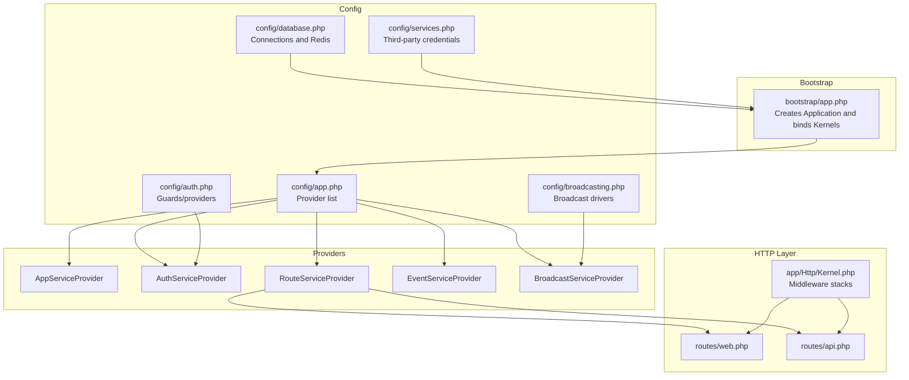
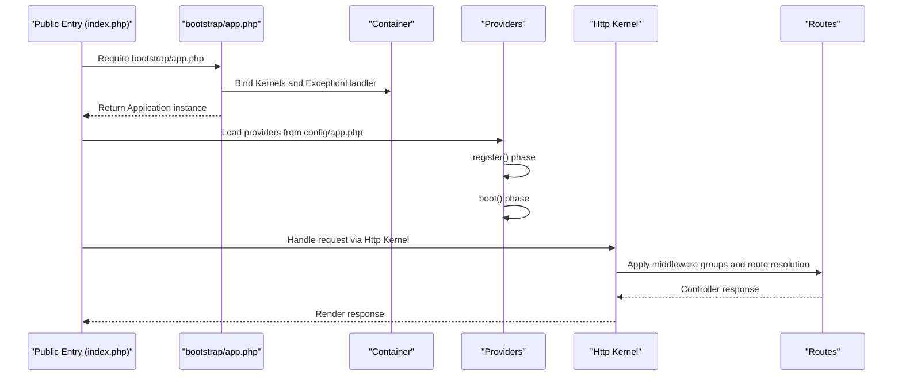
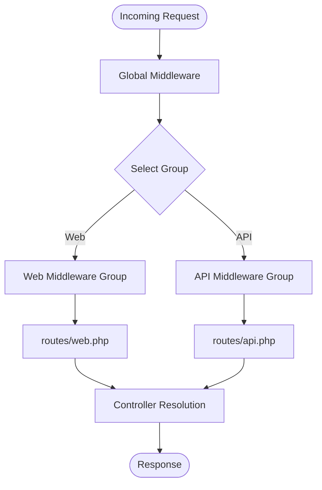
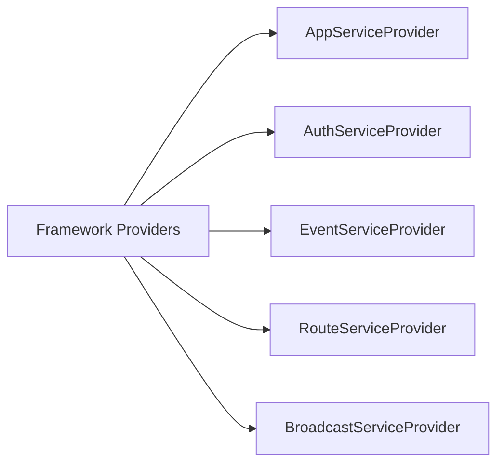

# Service Provider Architecture

<cite>
**Referenced Files in This Document**
- [AppServiceProvider.php](file://app/Providers/AppServiceProvider.php)
- [AuthServiceProvider.php](file://app/Providers/AuthServiceProvider.php)
- [RouteServiceProvider.php](file://app/Providers/RouteServiceProvider.php)
- [EventServiceProvider.php](file://app/Providers/EventServiceProvider.php)
- [BroadcastServiceProvider.php](file://app/Providers/BroadcastServiceProvider.php)
- [app.php](file://bootstrap/app.php)
- [app.php](file://config/app.php)
- [broadcasting.php](file://config/broadcasting.php)
- [auth.php](file://config/auth.php)
- [database.php](file://config/database.php)
- [services.php](file://config/services.php)
- [Kernel.php](file://app/Http/Kernel.php)
- [Kernel.php](file://app/Console/Kernel.php)
- [web.php](file://routes/web.php)
- [api.php](file://routes/api.php)
- [composer.json](file://composer.json)
</cite>

## Table of Contents
1. [Introduction](#introduction)
2. [Project Structure](#project-structure)
3. [Core Components](#core-components)
4. [Architecture Overview](#architecture-overview)
5. [Detailed Component Analysis](#detailed-component-analysis)
6. [Dependency Analysis](#dependency-analysis)
7. [Performance Considerations](#performance-considerations)
8. [Troubleshooting Guide](#troubleshooting-guide)
9. [Conclusion](#conclusion)

## Introduction
This document explains Laravel’s service provider architecture in KatalogThrift. It covers how providers are registered, how the application boots, and how the dependency injection container is configured. It documents the roles of built-in and custom providers, including AppServiceProvider, AuthServiceProvider, RouteServiceProvider, EventServiceProvider, and BroadcastServiceProvider. It also details binding interfaces to implementations, singleton registrations, configuration publishing, registering custom services, event listeners, and middleware bindings. Finally, it outlines the application lifecycle from provider registration to request handling, service resolution, and shutdown, including provider ordering, conditional loading, and environment-specific registrations.

## Project Structure
KatalogThrift follows Laravel conventions:
- Providers live under app/Providers and are autoloaded via config/app.php.
- The bootstrap/app.php file creates the application instance and binds kernel interfaces to concrete classes.
- Routing is grouped by middleware stacks in routes/web.php and routes/api.php.
- Configuration files under config/ define services, authentication, broadcasting, and database settings.
- Middleware stacks are defined in app/Http/Kernel.php and app/Console/Kernel.php.

**Diagram sources**
- [app.php:14-55](file://bootstrap/app.php#L14-L55)
- [app.php:158-171](file://config/app.php#L158-L171)
- [auth.php:38-76](file://config/auth.php#L38-L76)
- [broadcasting.php:18-69](file://config/broadcasting.php#L18-L69)
- [database.php:18-149](file://config/database.php#L18-L149)
- [services.php:17-34](file://config/services.php#L17-L34)
- [AppServiceProvider.php:7-24](file://app/Providers/AppServiceProvider.php#L7-L24)
- [AuthServiceProvider.php:8-26](file://app/Providers/AuthServiceProvider.php#L8-L26)
- [RouteServiceProvider.php:11-39](file://app/Providers/RouteServiceProvider.php#L11-L39)
- [EventServiceProvider.php:10-38](file://app/Providers/EventServiceProvider.php#L10-L38)
- [BroadcastServiceProvider.php:8-19](file://app/Providers/BroadcastServiceProvider.php#L8-L19)
- [Kernel.php:7-71](file://app/Http/Kernel.php#L7-L71)
- [web.php:44-239](file://routes/web.php#L44-L239)
- [api.php:17-19](file://routes/api.php#L17-L19)

**Section sources**
- [app.php:14-55](file://bootstrap/app.php#L14-L55)
- [app.php:158-171](file://config/app.php#L158-L171)
- [Kernel.php:7-71](file://app/Http/Kernel.php#L7-L71)
- [web.php:44-239](file://routes/web.php#L44-L239)
- [api.php:17-19](file://routes/api.php#L17-L19)

## Core Components
- Application bootstrap and container bindings are established in bootstrap/app.php. It registers singleton bindings for HTTP and Console kernels and the exception handler.
- Provider registration is centralized in config/app.php under the providers array. Laravel merges default providers with application providers, ensuring predictable load order.
- Middleware stacks are defined in app/Http/Kernel.php and app/Console/Kernel.php, enabling per-request and per-command behavior.

Key responsibilities:
- AppServiceProvider: Empty hooks for application-level bindings and boot logic.
- AuthServiceProvider: Declares model-policy mappings and boot logic for auth.
- RouteServiceProvider: Registers rate limits and routes for API and web.
- EventServiceProvider: Defines event-listener mappings and discovery behavior.
- BroadcastServiceProvider: Boots broadcasting routes and channel definitions.

**Section sources**
- [app.php:29-42](file://bootstrap/app.php#L29-L42)
- [app.php:158-171](file://config/app.php#L158-L171)
- [AppServiceProvider.php:7-24](file://app/Providers/AppServiceProvider.php#L7-L24)
- [AuthServiceProvider.php:8-26](file://app/Providers/AuthServiceProvider.php#L8-L26)
- [RouteServiceProvider.php:11-39](file://app/Providers/RouteServiceProvider.php#L11-L39)
- [EventServiceProvider.php:10-38](file://app/Providers/EventServiceProvider.php#L10-L38)
- [BroadcastServiceProvider.php:8-19](file://app/Providers/BroadcastServiceProvider.php#L8-L19)
- [Kernel.php:16-70](file://app/Http/Kernel.php#L16-L70)
- [Kernel.php:8-26](file://app/Console/Kernel.php#L8-L26)

## Architecture Overview
The service provider architecture in KatalogThrift is layered:
- Bootstrap layer initializes the container and binds core interfaces.
- Provider registration layer loads application providers in a defined order.
- Boot layer configures routing, throttling, broadcasting, and events.
- Runtime layer handles requests through middleware stacks and resolves services from the container.

**Diagram sources**
- [app.php:14-55](file://bootstrap/app.php#L14-L55)
- [app.php:158-171](file://config/app.php#L158-L171)
- [Kernel.php:16-70](file://app/Http/Kernel.php#L16-L70)
- [web.php:44-239](file://routes/web.php#L44-L239)
- [api.php:17-19](file://routes/api.php#L17-L19)

## Detailed Component Analysis

### AppServiceProvider
Role:
- Provides empty register() and boot() hooks for application-level bindings and initialization.
- Suitable for registering custom services, facades, and cross-cutting concerns.

Binding patterns:
- Use the container to bind interfaces to implementations in register().
- Use singleton() for single-instance services.
- Use alias() for convenience bindings.

Configuration publishing:
- Not applicable in this provider; use dedicated packages or custom Artisan commands for publishing.

Environment-specific behavior:
- Conditionally register bindings based on environment variables.

**Section sources**
- [AppServiceProvider.php:7-24](file://app/Providers/AppServiceProvider.php#L7-L24)

### AuthServiceProvider
Role:
- Declares model-to-policy mappings via protected policies array.
- Boot method is reserved for authorization logic and gate definitions.

Authorization flow:
- Policies enforce permissions on models.
- Gates can be defined in boot() to augment authorization logic.

**Section sources**
- [AuthServiceProvider.php:8-26](file://app/Providers/AuthServiceProvider.php#L8-L26)
- [auth.php:38-76](file://config/auth.php#L38-L76)

### RouteServiceProvider
Role:
- Defines rate limiting for API traffic.
- Registers routes for API and web middleware groups.

Routing flow:
- API routes are prefixed and grouped under the api middleware.
- Web routes are grouped under the web middleware.
- HOME constant defines the default redirect path post-authentication.

**Section sources**
- [RouteServiceProvider.php:11-39](file://app/Providers/RouteServiceProvider.php#L11-L39)
- [web.php:44-239](file://routes/web.php#L44-L239)
- [api.php:17-19](file://routes/api.php#L17-L19)

### EventServiceProvider
Role:
- Maps Registered event to SendEmailVerificationNotification listener.
- Controls automatic discovery of events/listeners via shouldDiscoverEvents().

Discovery behavior:
- Returning false disables auto-discovery, relying on explicit mappings.

**Section sources**
- [EventServiceProvider.php:10-38](file://app/Providers/EventServiceProvider.php#L10-L38)

### BroadcastServiceProvider
Role:
- Boots broadcasting routes and includes channel definitions.
- Integrates with config/broadcasting.php to select driver and connection options.

**Section sources**
- [BroadcastServiceProvider.php:8-19](file://app/Providers/BroadcastServiceProvider.php#L8-L19)
- [broadcasting.php:18-69](file://config/broadcasting.php#L18-L69)

### Middleware and Kernel Integration
- Global middleware runs on every request.
- Middleware groups (web, api) apply specific stacks to route collections.
- Middleware aliases enable convenient route assignments.

**Diagram sources**
- [Kernel.php:16-70](file://app/Http/Kernel.php#L16-L70)
- [web.php:44-239](file://routes/web.php#L44-L239)
- [api.php:17-19](file://routes/api.php#L17-L19)

**Section sources**
- [Kernel.php:16-70](file://app/Http/Kernel.php#L16-L70)
- [web.php:44-239](file://routes/web.php#L44-L239)
- [api.php:17-19](file://routes/api.php#L17-L19)

## Dependency Analysis
Provider load order is determined by config/app.php. The order ensures:
- Core framework providers are loaded first.
- Application providers are loaded afterward, enabling them to depend on framework services.

**Diagram sources**
- [app.php:158-171](file://config/app.php#L158-L171)

Additional external dependencies:
- Composer-managed packages influence provider loading via Laravel package discovery scripts.

**Section sources**
- [app.php:158-171](file://config/app.php#L158-L171)
- [composer.json:36-38](file://composer.json#L36-L38)

## Performance Considerations
- Keep provider boot() logic lightweight; defer heavy operations to lazy initialization.
- Use singleton() for expensive services to avoid repeated instantiation.
- Leverage configuration caching and preloading where appropriate.
- Minimize unnecessary middleware in global stacks to reduce per-request overhead.

## Troubleshooting Guide
Common issues and resolutions:
- Provider not loaded: Verify provider class is present in config/app.php providers array and PSR-4 autoloading is correct.
- Middleware not applied: Confirm route belongs to the intended middleware group and aliases are registered in app/Http/Kernel.php.
- Broadcasting errors: Check config/broadcasting.php driver selection and credentials; ensure BroadcastServiceProvider is enabled.
- Authentication failures: Validate guards and providers in config/auth.php; confirm policies are mapped in AuthServiceProvider.
- Database connectivity: Review config/database.php connections and environment variables.

**Section sources**
- [app.php:158-171](file://config/app.php#L158-L171)
- [Kernel.php:16-70](file://app/Http/Kernel.php#L16-L70)
- [broadcasting.php:18-69](file://config/broadcasting.php#L18-L69)
- [auth.php:38-76](file://config/auth.php#L38-L76)
- [database.php:18-149](file://config/database.php#L18-L149)

## Conclusion
KatalogThrift’s service provider architecture leverages Laravel’s predictable provider lifecycle and container bindings to modularize application concerns. Providers encapsulate registration and boot logic, while configuration files centralize environment-specific settings. Middleware stacks and routing are cleanly separated, enabling maintainable request handling. Following the outlined patterns ensures scalable customization of services, events, broadcasting, and authentication.