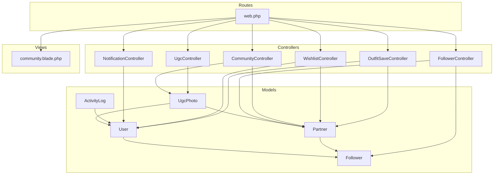
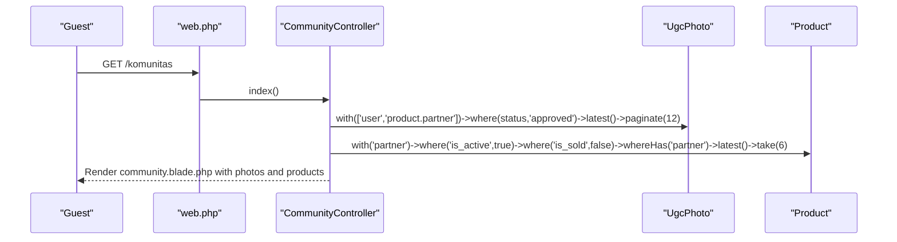
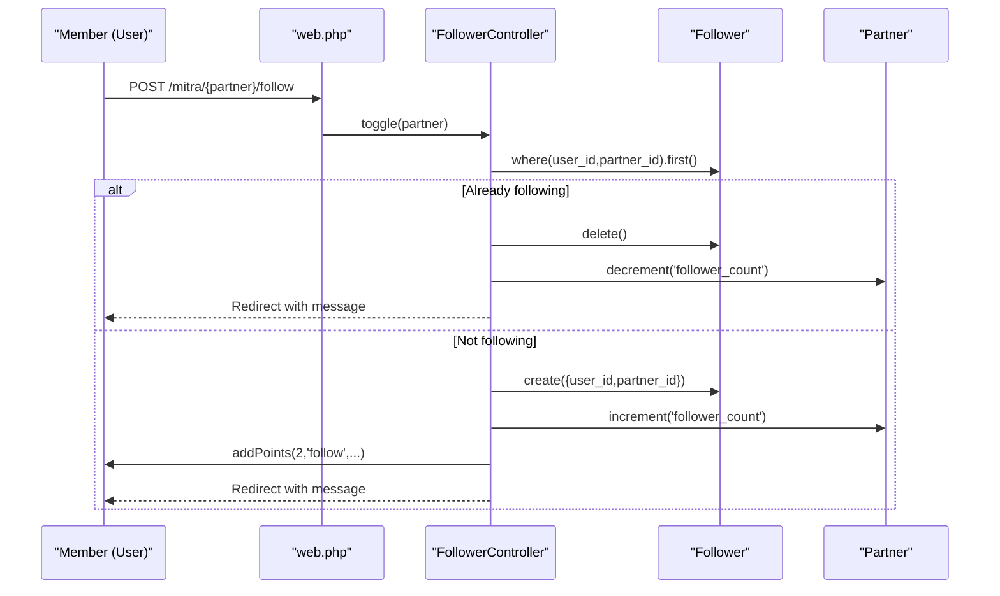
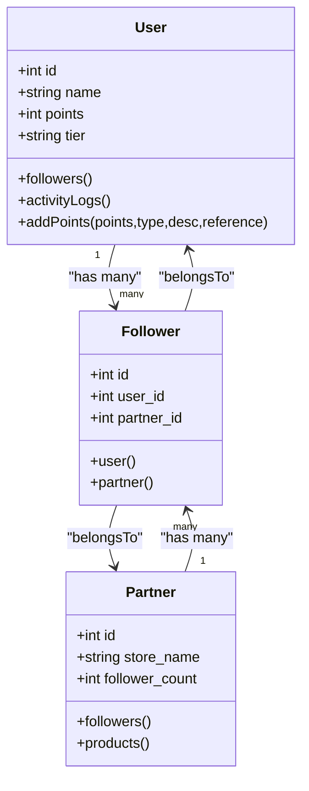
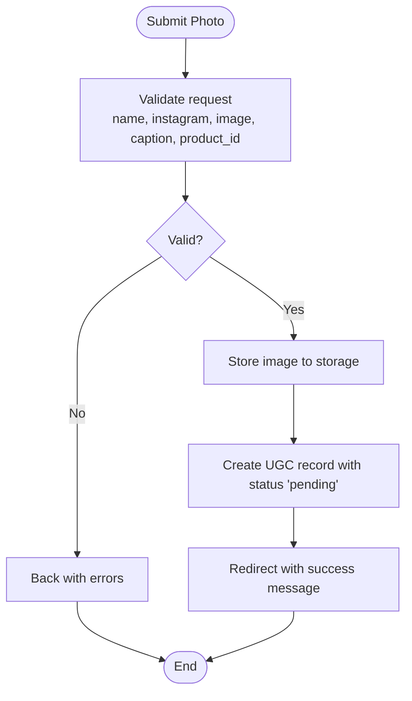
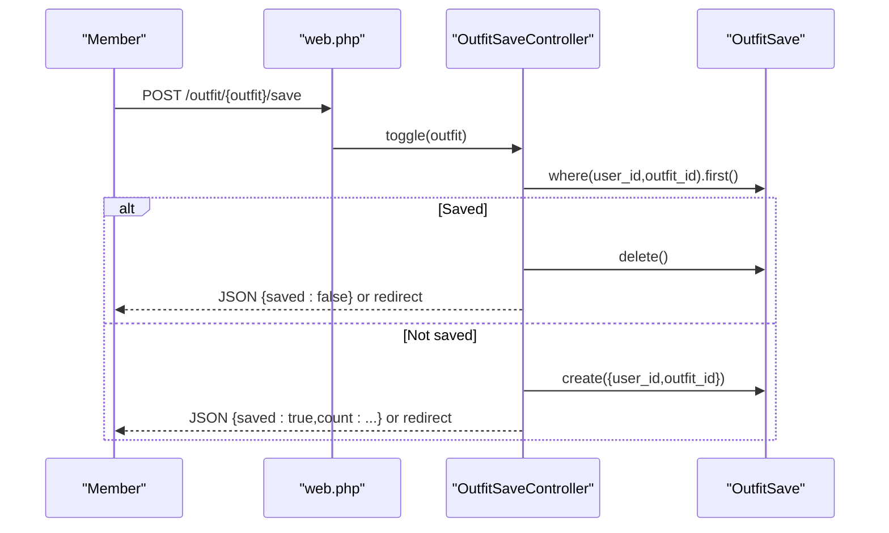
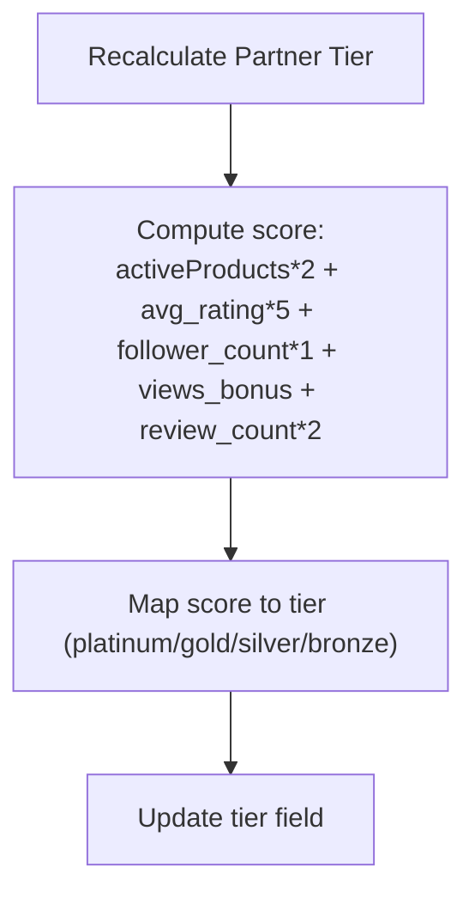
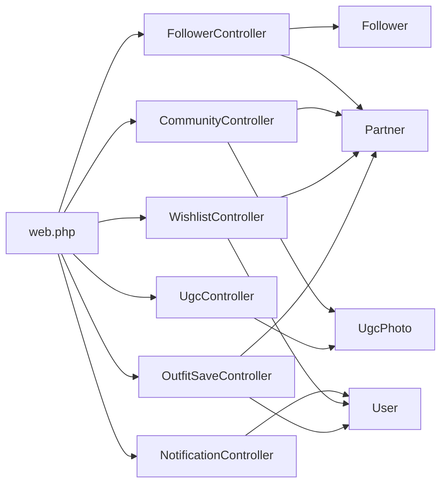

# Community and Social Features

<cite>
**Referenced Files in This Document**
- [Follower.php](file://app/Models/Follower.php)
- [FollowerController.php](file://app/Http/Controllers/Member/FollowerController.php)
- [CommunityController.php](file://app/Http/Controllers/CommunityController.php)
- [create_followers_table.php](file://database/migrations/2026_07_01_100003_create_followers_table.php)
- [community.blade.php](file://resources/views/public/community.blade.php)
- [User.php](file://app/Models/User.php)
- [Partner.php](file://app/Models/Partner.php)
- [ProfileController.php](file://app/Http/Controllers/Member/ProfileController.php)
- [NotificationController.php](file://app/Http/Controllers/Member/NotificationController.php)
- [ActivityLog.php](file://app/Models/ActivityLog.php)
- [UgcPhoto.php](file://app/Models/UgcPhoto.php)
- [UgcController.php](file://app/Http/Controllers/UgcController.php)
- [WishlistController.php](file://app/Http/Controllers/Member/WishlistController.php)
- [OutfitSaveController.php](file://app/Http/Controllers/Member/OutfitSaveController.php)
- [web.php](file://routes/web.php)
</cite>

## Table of Contents
1. [Introduction](#introduction)
2. [Project Structure](#project-structure)
3. [Core Components](#core-components)
4. [Architecture Overview](#architecture-overview)
5. [Detailed Component Analysis](#detailed-component-analysis)
6. [Dependency Analysis](#dependency-analysis)
7. [Performance Considerations](#performance-considerations)
8. [Troubleshooting Guide](#troubleshooting-guide)
9. [Conclusion](#conclusion)
10. [Appendices](#appendices)

## Introduction
This document explains KatalogThrift’s community and social features with a focus on:
- Follower/following system and social graph management
- Community discovery, UGC submission, and social sharing
- User relationship tracking, gamification, and activity logging
- Privacy controls, moderation, and community guidelines enforcement
- Community analytics and engagement optimization strategies
- Examples of community building workflows and retention features

## Project Structure
Key modules involved in community and social features:
- Models: User, Partner, Follower, UgcPhoto, ActivityLog
- Controllers: Member FollowerController, CommunityController, UgcController, NotificationController, WishlistController, OutfitSaveController
- Views: public/community.blade.php
- Routes: web.php

**Diagram sources**
- [Follower.php:1-23](file://app/Models/Follower.php#L1-L23)
- [User.php:1-131](file://app/Models/User.php#L1-L131)
- [Partner.php:1-123](file://app/Models/Partner.php#L1-L123)
- [UgcPhoto.php:1-24](file://app/Models/UgcPhoto.php#L1-L24)
- [ActivityLog.php:1-23](file://app/Models/ActivityLog.php#L1-L23)
- [FollowerController.php:1-45](file://app/Http/Controllers/Member/FollowerController.php#L1-L45)
- [CommunityController.php:1-30](file://app/Http/Controllers/CommunityController.php#L1-L30)
- [UgcController.php:1-49](file://app/Http/Controllers/UgcController.php#L1-L49)
- [NotificationController.php:1-32](file://app/Http/Controllers/Member/NotificationController.php#L1-L32)
- [WishlistController.php:1-48](file://app/Http/Controllers/Member/WishlistController.php#L1-L48)
- [OutfitSaveController.php:1-49](file://app/Http/Controllers/Member/OutfitSaveController.php#L1-L49)
- [community.blade.php:1-180](file://resources/views/public/community.blade.php#L1-L180)
- [web.php:1-240](file://routes/web.php#L1-L240)

**Section sources**
- [web.php:60-116](file://routes/web.php#L60-L116)
- [community.blade.php:1-180](file://resources/views/public/community.blade.php#L1-L180)

## Core Components
- Follower model and controller implement the follower/following system between Users and Partners, with follower counts maintained on Partner records.
- CommunityController aggregates UGC photos and featured products for public discovery.
- UgcController handles UGC photo submissions with approval workflows.
- User model integrates gamification via points and tier progression, plus activity logging for actions.
- NotificationController provides notification listing and read/unread management for members.
- WishlistController and OutfitSaveController support personalization and saving features that indirectly drive engagement.

**Section sources**
- [Follower.php:1-23](file://app/Models/Follower.php#L1-L23)
- [FollowerController.php:1-45](file://app/Http/Controllers/Member/FollowerController.php#L1-L45)
- [CommunityController.php:1-30](file://app/Http/Controllers/CommunityController.php#L1-L30)
- [UgcController.php:1-49](file://app/Http/Controllers/UgcController.php#L1-L49)
- [User.php:104-129](file://app/Models/User.php#L104-L129)
- [ActivityLog.php:1-23](file://app/Models/ActivityLog.php#L1-L23)
- [NotificationController.php:1-32](file://app/Http/Controllers/Member/NotificationController.php#L1-L32)
- [WishlistController.php:1-48](file://app/Http/Controllers/Member/WishlistController.php#L1-L48)
- [OutfitSaveController.php:1-49](file://app/Http/Controllers/Member/OutfitSaveController.php#L1-L49)

## Architecture Overview
The social ecosystem centers around three axes:
- Identity and relationships: Users follow Partners; relationships stored in Followers table.
- Community content: UGC photos submitted by users, curated by admins, and surfaced publicly.
- Engagement and retention: Personal lists (wishlist/outfit saves), notifications, and gamification (points/tier).

**Diagram sources**
- [web.php:60-62](file://routes/web.php#L60-L62)
- [CommunityController.php:11-28](file://app/Http/Controllers/CommunityController.php#L11-L28)
- [UgcPhoto.php:15-22](file://app/Models/UgcPhoto.php#L15-L22)
- [Partner.php:33-43](file://app/Models/Partner.php#L33-L43)

## Detailed Component Analysis

### Follower/Following System
- Relationship model: Follower links user_id and partner_id with a unique constraint and foreign keys.
- Toggle logic: Controller checks existing follow record; creates or deletes accordingly, increments/decrements Partner follower_count, and awards User points with activity logging.
- Following page: Lists current follows with Partner relations for display.

**Diagram sources**
- [web.php:98-100](file://routes/web.php#L98-L100)
- [FollowerController.php:12-29](file://app/Http/Controllers/Member/FollowerController.php#L12-L29)
- [Follower.php:6-22](file://app/Models/Follower.php#L6-L22)
- [Partner.php:45-48](file://app/Models/Partner.php#L45-L48)
- [User.php:104-117](file://app/Models/User.php#L104-L117)

**Section sources**
- [create_followers_table.php:10-18](file://database/migrations/2026_07_01_100003_create_followers_table.php#L10-L18)
- [Follower.php:6-22](file://app/Models/Follower.php#L6-L22)
- [FollowerController.php:12-43](file://app/Http/Controllers/Member/FollowerController.php#L12-L43)
- [User.php:48-51](file://app/Models/User.php#L48-L51)
- [Partner.php:45-48](file://app/Models/Partner.php#L45-L48)

### Social Graph Management and User Relationship Tracking
- User-Follower: One-to-many from User to Follower.
- Partner-Follower: One-to-many from Partner to Follower.
- Follower uniqueness: Ensures a user can follow a partner only once.
- Follower count maintenance: Increment/decrement on follow/unfollow toggles.

**Diagram sources**
- [User.php:48-51](file://app/Models/User.php#L48-L51)
- [Partner.php:45-48](file://app/Models/Partner.php#L45-L48)
- [Follower.php:13-21](file://app/Models/Follower.php#L13-L21)

**Section sources**
- [create_followers_table.php:10-18](file://database/migrations/2026_07_01_100003_create_followers_table.php#L10-L18)
- [Follower.php:6-22](file://app/Models/Follower.php#L6-L22)
- [User.php:104-117](file://app/Models/User.php#L104-L117)

### Community Discovery and UGC Submission
- CommunityController aggregates approved UGC photos and active/suitable products for discovery.
- UgcController validates and stores submissions under pending status; admins approve/reject later.
- community.blade.php renders UGC grid, submission steps, and form.

**Diagram sources**
- [UgcController.php:24-47](file://app/Http/Controllers/UgcController.php#L24-L47)
- [UgcPhoto.php:9-13](file://app/Models/UgcPhoto.php#L9-L13)

**Section sources**
- [CommunityController.php:11-28](file://app/Http/Controllers/CommunityController.php#L11-L28)
- [UgcController.php:11-22](file://app/Http/Controllers/UgcController.php#L11-L22)
- [UgcController.php:24-47](file://app/Http/Controllers/UgcController.php#L24-L47)
- [community.blade.php:87-170](file://resources/views/public/community.blade.php#L87-L170)

### Social Sharing and Content Amplification
- Outfit share token route exists for public sharing; OutfitSaveController supports saving outfits for later viewing.
- WishlistController allows adding/removing products to wishlist, aiding discovery and future purchases.
- These features increase content visibility and encourage repeat visits.

**Diagram sources**
- [web.php:95-96](file://routes/web.php#L95-L96)
- [OutfitSaveController.php:15-34](file://app/Http/Controllers/Member/OutfitSaveController.php#L15-L34)

**Section sources**
- [web.php:50](file://routes/web.php#L50)
- [OutfitSaveController.php:15-47](file://app/Http/Controllers/Member/OutfitSaveController.php#L15-L47)
- [WishlistController.php:25-46](file://app/Http/Controllers/Member/WishlistController.php#L25-L46)

### Network Effects and Recommendation Signals
- Partner tier calculation considers follower_count, review metrics, and product activity, reinforcing network effects by elevating popular Partners.
- Follower count updates act as a signal of community interest.

**Diagram sources**
- [Partner.php:104-121](file://app/Models/Partner.php#L104-L121)

**Section sources**
- [Partner.php:104-121](file://app/Models/Partner.php#L104-L121)

### Privacy Controls, Blocking, and Guidelines Enforcement
- Moderation pipeline: UGC submissions are pending and require admin approval before appearing in CommunityController feed.
- Admin routes manage UGC approval, rejection, and feature toggles.
- No explicit blocking mechanism found in the reviewed files; privacy controls are primarily enforced via moderation and content approval workflows.

**Section sources**
- [UgcController.php:24-47](file://app/Http/Controllers/UgcController.php#L24-L47)
- [CommunityController.php:11-28](file://app/Http/Controllers/CommunityController.php#L11-L28)
- [web.php:218-223](file://routes/web.php#L218-L223)

### Community Analytics and Engagement Metrics
- Partner analytics fields include total views, WhatsApp clicks, wishlist counts, and follower counts—metrics that reflect community engagement.
- ActivityLog tracks user activities and points earned, enabling internal analytics on member behavior.

**Section sources**
- [Partner.php:18-26](file://app/Models/Partner.php#L18-L26)
- [ActivityLog.php:8-11](file://app/Models/ActivityLog.php#L8-L11)
- [User.php:104-117](file://app/Models/User.php#L104-L117)

### User Retention and Social Proof Mechanisms
- Gamification: Points awarded for following Partners; automatic tier upgrade based on accumulated points.
- Social proof: Community page showcases real customer photos and products, encouraging participation.
- Notifications: Centralized inbox for member updates and read/unread management.

**Section sources**
- [FollowerController.php:24](file://app/Http/Controllers/Member/FollowerController.php#L24)
- [User.php:104-129](file://app/Models/User.php#L104-L129)
- [community.blade.php:70-114](file://resources/views/public/community.blade.php#L70-L114)
- [NotificationController.php:10-30](file://app/Http/Controllers/Member/NotificationController.php#L10-L30)

### External Integrations and Cross-Platform Identity
- Partner profiles include external platform links (WhatsApp, Shopee, Tokopedia, Instagram, TikTok), enabling cross-platform identity and traffic redirection.
- No explicit OAuth integration observed in the reviewed files.

**Section sources**
- [Partner.php:10-20](file://app/Models/Partner.php#L10-L20)

## Dependency Analysis
- Controllers depend on Eloquent models and routing definitions.
- Views render aggregated data from models and controllers.
- Routes bind URLs to controllers and define middleware scopes.

**Diagram sources**
- [web.php:60-116](file://routes/web.php#L60-L116)
- [FollowerController.php:1-45](file://app/Http/Controllers/Member/FollowerController.php#L1-L45)
- [CommunityController.php:1-30](file://app/Http/Controllers/CommunityController.php#L1-L30)
- [UgcController.php:1-49](file://app/Http/Controllers/UgcController.php#L1-L49)
- [NotificationController.php:1-32](file://app/Http/Controllers/Member/NotificationController.php#L1-L32)
- [WishlistController.php:1-48](file://app/Http/Controllers/Member/WishlistController.php#L1-L48)
- [OutfitSaveController.php:1-49](file://app/Http/Controllers/Member/OutfitSaveController.php#L1-L49)

**Section sources**
- [web.php:60-116](file://routes/web.php#L60-L116)

## Performance Considerations
- Pagination: CommunityController paginates UGC photos; consider indexing status and created_at for efficient queries.
- Aggregation: CommunityController eager-loads relations; ensure foreign keys and indexes exist on user_id, product_id, and partner_id.
- UGC storage: Image uploads are validated for size and type; ensure storage disk performance aligns with expected upload volume.
- Follower toggling: Unique constraint prevents duplicates; ensure indexes on user_id and partner_id for fast lookup.

## Troubleshooting Guide
- Follow toggle issues: Verify unique constraint on followers and foreign keys; confirm follower_count updates on toggle.
- UGC submission errors: Validate client-side and server-side rules; ensure storage permissions and image constraints are met.
- Notifications unread state: Confirm notification ownership and read/unread transitions.
- Community page empty: Check UGC status filtering and approvals; ensure product/partner statuses meet criteria.

**Section sources**
- [create_followers_table.php:15-17](file://database/migrations/2026_07_01_100003_create_followers_table.php#L15-L17)
- [FollowerController.php:12-29](file://app/Http/Controllers/Member/FollowerController.php#L12-L29)
- [UgcController.php:26-32](file://app/Http/Controllers/UgcController.php#L26-L32)
- [NotificationController.php:19-30](file://app/Http/Controllers/Member/NotificationController.php#L19-L30)
- [CommunityController.php:13-20](file://app/Http/Controllers/CommunityController.php#L13-L20)

## Conclusion
KatalogThrift’s community and social features are built around a clean follower model, a public UGC pipeline, and member-driven engagement tools. The system leverages follower counts, gamification, and curated content to foster network effects and retention. While moderation and privacy controls are enforced via UGC approval workflows, additional blocking mechanisms could further strengthen user safety. Partner analytics and tier calculations reinforce community signals and incentivize engagement.

## Appendices
- Community building workflow example:
  - Discover products and Partners via public pages.
  - Follow Partners to receive social proof and earn points.
  - Submit UGC photos for approval and gain visibility.
  - Save outfits and manage wishlists to deepen engagement.
  - Receive notifications about account and community updates.

[No sources needed since this section provides general guidance]