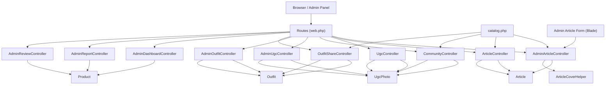
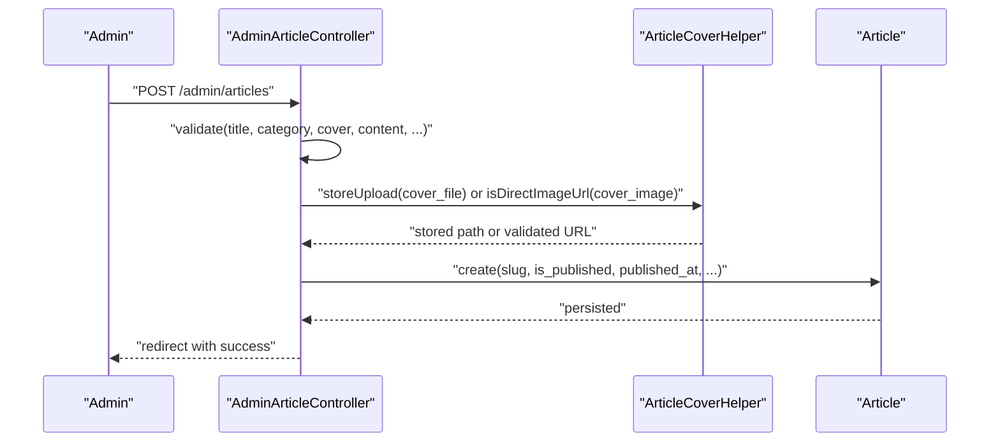
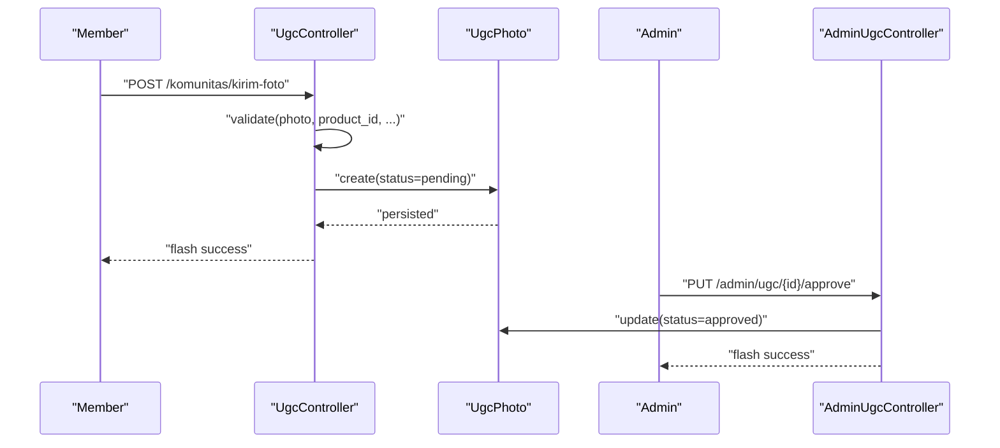
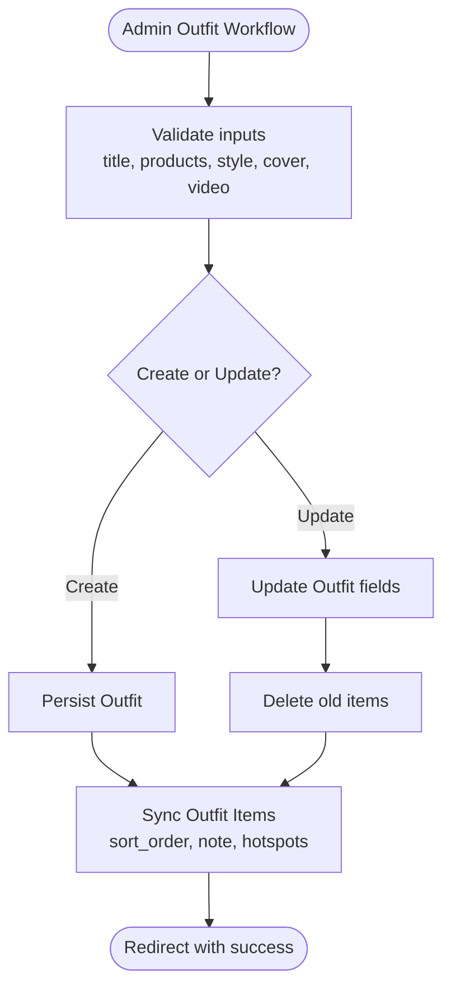
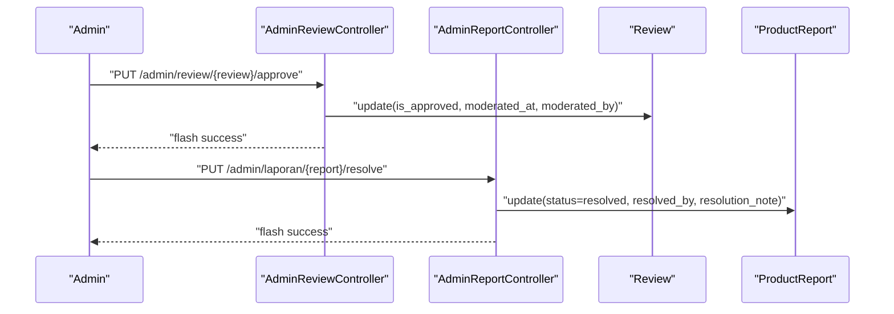
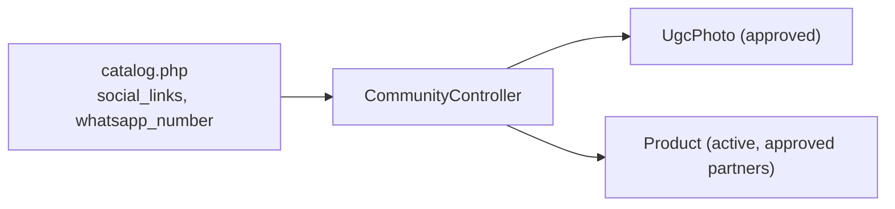
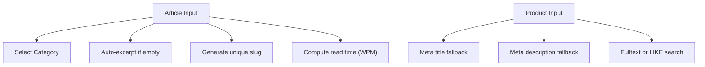
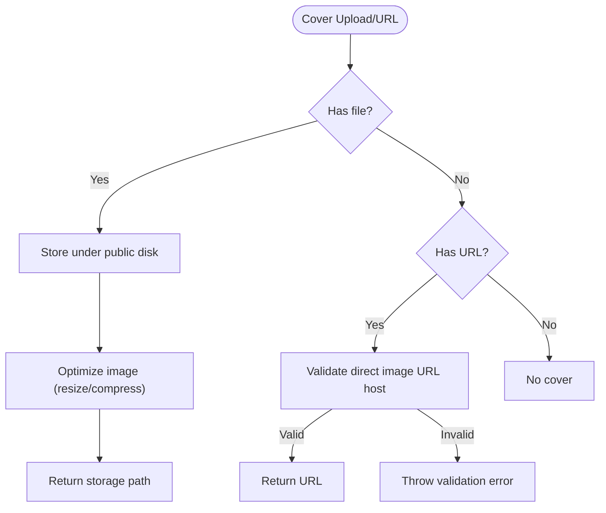
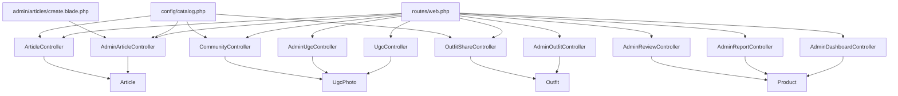

# Content Management System

<cite>
**Referenced Files in This Document**
- [AdminArticleController.php](file://app/Http/Controllers/AdminArticleController.php)
- [ArticleController.php](file://app/Http/Controllers/ArticleController.php)
- [UgcController.php](file://app/Http/Controllers/UgcController.php)
- [CommunityController.php](file://app/Http/Controllers/CommunityController.php)
- [AdminUgcController.php](file://app/Http/Controllers/AdminUgcController.php)
- [AdminOutfitController.php](file://app/Http/Controllers/AdminOutfitController.php)
- [OutfitShareController.php](file://app/Http/Controllers/OutfitShareController.php)
- [Article.php](file://app/Models/Article.php)
- [UgcPhoto.php](file://app/Models/UgcPhoto.php)
- [Outfit.php](file://app/Models/Outfit.php)
- [ArticleCoverHelper.php](file://app/Support/ArticleCoverHelper.php)
- [Product.php](file://app/Models/Product.php)
- [AdminReportController.php](file://app/Http/Controllers/AdminReportController.php)
- [AdminReviewController.php](file://app/Http/Controllers/AdminReviewController.php)
- [AdminDashboardController.php](file://app/Http/Controllers/AdminDashboardController.php)
- [web.php](file://routes/web.php)
- [catalog.php](file://config/catalog.php)
- [create.blade.php](file://resources/views/admin/articles/create.blade.php)
</cite>

## Table of Contents
1. [Introduction](#introduction)
2. [Project Structure](#project-structure)
3. [Core Components](#core-components)
4. [Architecture Overview](#architecture-overview)
5. [Detailed Component Analysis](#detailed-component-analysis)
6. [Dependency Analysis](#dependency-analysis)
7. [Performance Considerations](#performance-considerations)
8. [Troubleshooting Guide](#troubleshooting-guide)
9. [Conclusion](#conclusion)
10. [Appendices](#appendices)

## Introduction
This document explains KatalogThrift’s content management system with a focus on editorial content (articles), community features (user-generated content), lookbook curation, outfit sharing, moderation, media handling, SEO, analytics, and operational workflows. It synthesizes controller actions, model behaviors, routing, configuration, and templates to present practical, code-backed guidance for content creators, moderators, and administrators.

## Project Structure
The CMS spans controllers, models, support utilities, configuration, and Blade templates:
- Controllers orchestrate requests for articles, UGC, lookbook/outfits, and moderation.
- Models define data structures, casts, relations, and helper attributes.
- Support utilities handle media validation, URL resolution, and image optimization.
- Routes bind URLs to controllers.
- Configuration centralizes branding, social links, and catalog metadata.
- Views render admin/editorial forms and public pages.

```mermaid
graph TB
subgraph "Routes"
R1["web.php<br/>Public & Admin routes"]
end
subgraph "Controllers"
C_ArtEdit["AdminArticleController.php"]
C_ArtPub["ArticleController.php"]
C_UgcSub["UgcController.php"]
C_Comm["CommunityController.php"]
C_AdminUGC["AdminUgcController.php"]
C_AdminOutfit["AdminOutfitController.php"]
C_OutfitShare["OutfitShareController.php"]
C_AdminDash["AdminDashboardController.php"]
C_AdminReport["AdminReportController.php"]
C_AdminReview["AdminReviewController.php"]
end
subgraph "Models"
M_Article["Article.php"]
M_Ugc["UgcPhoto.php"]
M_Outfit["Outfit.php"]
M_Product["Product.php"]
end
subgraph "Support"
S_Cover["ArticleCoverHelper.php"]
end
subgraph "Config"
CFG["catalog.php"]
end
subgraph "Views"
V_Create["create.blade.php"]
end
R1 --> C_ArtEdit
R1 --> C_ArtPub
R1 --> C_UgcSub
R1 --> C_Comm
R1 --> C_AdminUGC
R1 --> C_AdminOutfit
R1 --> C_OutfitShare
R1 --> C_AdminDash
R1 --> C_AdminReport
R1 --> C_AdminReview
C_ArtEdit --> M_Article
C_ArtPub --> M_Article
C_UgcSub --> M_Ugc
C_AdminUGC --> M_Ugc
C_Comm --> M_Ugc
C_AdminOutfit --> M_Outfit
C_OutfitShare --> M_Outfit
C_AdminDash --> M_Product
C_AdminReport --> M_Product
C_AdminReview --> M_Product
C_ArtEdit --> S_Cover
C_ArtPub --> M_Article
C_UgcSub --> M_Ugc
C_Comm --> M_Ugc
C_AdminUGC --> M_Ugc
C_AdminOutfit --> M_Outfit
C_OutfitShare --> M_Outfit
CFG --> C_ArtEdit
CFG --> C_ArtPub
CFG --> C_Comm
CFG --> C_OutfitShare
CFG --> V_Create
```

**Diagram sources**
- [web.php:1-240](file://routes/web.php#L1-L240)
- [AdminArticleController.php:1-162](file://app/Http/Controllers/AdminArticleController.php#L1-L162)
- [ArticleController.php:1-46](file://app/Http/Controllers/ArticleController.php#L1-L46)
- [UgcController.php:1-49](file://app/Http/Controllers/UgcController.php#L1-L49)
- [CommunityController.php:1-30](file://app/Http/Controllers/CommunityController.php#L1-L30)
- [AdminUgcController.php:1-44](file://app/Http/Controllers/AdminUgcController.php#L1-L44)
- [AdminOutfitController.php:1-175](file://app/Http/Controllers/AdminOutfitController.php#L1-L175)
- [OutfitShareController.php:1-29](file://app/Http/Controllers/OutfitShareController.php#L1-L29)
- [AdminDashboardController.php:1-67](file://app/Http/Controllers/AdminDashboardController.php#L1-L67)
- [AdminReportController.php:1-52](file://app/Http/Controllers/AdminReportController.php#L1-L52)
- [AdminReviewController.php:1-49](file://app/Http/Controllers/AdminReviewController.php#L1-L49)
- [Article.php:1-48](file://app/Models/Article.php#L1-L48)
- [UgcPhoto.php:1-24](file://app/Models/UgcPhoto.php#L1-L24)
- [Outfit.php:1-60](file://app/Models/Outfit.php#L1-L60)
- [Product.php:1-132](file://app/Models/Product.php#L1-L132)
- [ArticleCoverHelper.php:1-129](file://app/Support/ArticleCoverHelper.php#L1-L129)
- [catalog.php:1-141](file://config/catalog.php#L1-L141)
- [create.blade.php:1-150](file://resources/views/admin/articles/create.blade.php#L1-L150)

**Section sources**
- [web.php:1-240](file://routes/web.php#L1-L240)
- [catalog.php:1-141](file://config/catalog.php#L1-L141)

## Core Components
- Articles: Creation, editing, publishing, categorization, excerpts, slugs, and cover image handling with validation and optimization.
- User-Generated Content (UGC): Submission pipeline, moderation queue, approval/rejection, and feature toggles.
- Lookbook & Outfits: Admin-driven curation with product pairings, hotspots, cover images/videos, and shareable tokens.
- Community Hub: Aggregated UGC gallery and curated product discovery.
- Moderation: Reviews, reports, and administrative dashboards for oversight.
- SEO & Media: Product SEO helpers, article read-time, and optimized image processing for covers.
- Routing & Templates: Clear URL patterns and admin/editorial forms.

**Section sources**
- [AdminArticleController.php:46-118](file://app/Http/Controllers/AdminArticleController.php#L46-L118)
- [ArticleController.php:10-44](file://app/Http/Controllers/ArticleController.php#L10-L44)
- [UgcController.php:24-47](file://app/Http/Controllers/UgcController.php#L24-L47)
- [AdminUgcController.php:20-42](file://app/Http/Controllers/AdminUgcController.php#L20-L42)
- [AdminOutfitController.php:44-157](file://app/Http/Controllers/AdminOutfitController.php#L44-L157)
- [OutfitShareController.php:10-27](file://app/Http/Controllers/OutfitShareController.php#L10-L27)
- [CommunityController.php:11-28](file://app/Http/Controllers/CommunityController.php#L11-L28)
- [AdminReviewController.php:23-41](file://app/Http/Controllers/AdminReviewController.php#L23-L41)
- [AdminReportController.php:27-50](file://app/Http/Controllers/AdminReportController.php#L27-L50)
- [Article.php:27-46](file://app/Models/Article.php#L27-L46)
- [ArticleCoverHelper.php:62-127](file://app/Support/ArticleCoverHelper.php#L62-L127)
- [Product.php:104-130](file://app/Models/Product.php#L104-L130)

## Architecture Overview
The system follows MVC with explicit separation of concerns:
- Controllers handle HTTP requests and delegate to models and helpers.
- Models encapsulate persistence, casting, and derived attributes.
- Support utilities centralize cross-cutting concerns like media validation and optimization.
- Routes define the surface area for public and admin workflows.
- Configuration supplies branding, social links, and catalog metadata.

**Diagram sources**
- [web.php:1-240](file://routes/web.php#L1-L240)
- [AdminArticleController.php:1-162](file://app/Http/Controllers/AdminArticleController.php#L1-L162)
- [ArticleController.php:1-46](file://app/Http/Controllers/ArticleController.php#L1-L46)
- [UgcController.php:1-49](file://app/Http/Controllers/UgcController.php#L1-L49)
- [CommunityController.php:1-30](file://app/Http/Controllers/CommunityController.php#L1-L30)
- [AdminUgcController.php:1-44](file://app/Http/Controllers/AdminUgcController.php#L1-L44)
- [AdminOutfitController.php:1-175](file://app/Http/Controllers/AdminOutfitController.php#L1-L175)
- [OutfitShareController.php:1-29](file://app/Http/Controllers/OutfitShareController.php#L1-L29)
- [AdminDashboardController.php:1-67](file://app/Http/Controllers/AdminDashboardController.php#L1-L67)
- [AdminReportController.php:1-52](file://app/Http/Controllers/AdminReportController.php#L1-L52)
- [AdminReviewController.php:1-49](file://app/Http/Controllers/AdminReviewController.php#L1-L49)
- [Article.php:1-48](file://app/Models/Article.php#L1-L48)
- [UgcPhoto.php:1-24](file://app/Models/UgcPhoto.php#L1-L24)
- [Outfit.php:1-60](file://app/Models/Outfit.php#L1-L60)
- [Product.php:1-132](file://app/Models/Product.php#L1-L132)
- [ArticleCoverHelper.php:1-129](file://app/Support/ArticleCoverHelper.php#L1-L129)
- [catalog.php:1-141](file://config/catalog.php#L1-L141)
- [create.blade.php:1-150](file://resources/views/admin/articles/create.blade.php#L1-L150)

## Detailed Component Analysis

### Article Management (Creation, Editing, Publishing)
- Admin workflow:
  - Create: Validates title, category, optional cover URL or file, excerpt, content, author, and publish flag. Generates slug and published timestamp when applicable. Supports direct image URL validation and file upload with optimization.
  - Edit: Re-validates and conditionally updates cover image, regenerates slug if title changes, sets published timestamp on first publish.
  - Delete: Removes cover file if stored locally and deletes the article.
- Public consumption:
  - Index filters by category and paginates.
  - Show resolves published articles by slug and fetches related articles by category.

**Diagram sources**
- [AdminArticleController.php:46-118](file://app/Http/Controllers/AdminArticleController.php#L46-L118)
- [ArticleCoverHelper.php:62-127](file://app/Support/ArticleCoverHelper.php#L62-L127)
- [Article.php:38-46](file://app/Models/Article.php#L38-L46)

**Section sources**
- [AdminArticleController.php:46-118](file://app/Http/Controllers/AdminArticleController.php#L46-L118)
- [ArticleController.php:10-44](file://app/Http/Controllers/ArticleController.php#L10-L44)
- [Article.php:27-46](file://app/Models/Article.php#L27-L46)
- [ArticleCoverHelper.php:62-127](file://app/Support/ArticleCoverHelper.php#L62-L127)
- [create.blade.php:77-113](file://resources/views/admin/articles/create.blade.php#L77-L113)

### User-Generated Content (UGC) Submission and Moderation
- Submission:
  - Validates submitter info, photo, optional product association, and caption.
  - Stores image under public disk and creates UGC record with pending status.
- Moderation:
  - Approve/reject toggles status.
  - Toggle featured promotes posts to highlighted.
  - Delete removes records.
- Community:
  - Public gallery displays approved photos with user/product/partner context.

**Diagram sources**
- [UgcController.php:24-47](file://app/Http/Controllers/UgcController.php#L24-L47)
- [UgcPhoto.php:18-22](file://app/Models/UgcPhoto.php#L18-L22)
- [AdminUgcController.php:20-42](file://app/Http/Controllers/AdminUgcController.php#L20-L42)
- [CommunityController.php:11-28](file://app/Http/Controllers/CommunityController.php#L11-L28)

**Section sources**
- [UgcController.php:24-47](file://app/Http/Controllers/UgcController.php#L24-L47)
- [AdminUgcController.php:20-42](file://app/Http/Controllers/AdminUgcController.php#L20-L42)
- [CommunityController.php:11-28](file://app/Http/Controllers/CommunityController.php#L11-L28)
- [UgcPhoto.php:18-22](file://app/Models/UgcPhoto.php#L18-L22)

### Lookbook Curation and Outfit Sharing
- Admin curation:
  - Create/edit outfits with title, description, style type, active flag, cover image/video, and product pairings.
  - Syncs items with sort order, notes, and hotspots per product.
  - Toggle active status and delete with cleanup of associated items.
- Sharing:
  - Outfit share page resolves by token, loads products with partner context, and exposes save state for logged-in users.

**Diagram sources**
- [AdminOutfitController.php:44-157](file://app/Http/Controllers/AdminOutfitController.php#L44-L157)
- [OutfitShareController.php:10-27](file://app/Http/Controllers/OutfitShareController.php#L10-L27)
- [Outfit.php:19-58](file://app/Models/Outfit.php#L19-L58)

**Section sources**
- [AdminOutfitController.php:44-157](file://app/Http/Controllers/AdminOutfitController.php#L44-L157)
- [OutfitShareController.php:10-27](file://app/Http/Controllers/OutfitShareController.php#L10-L27)
- [Outfit.php:19-58](file://app/Models/Outfit.php#L19-L58)

### Moderation Workflows (Reviews and Reports)
- Reviews:
  - Approve hides/displays reviews and records moderator metadata.
  - Destroy removes review permanently.
- Reports:
  - Resolve marks as resolved with notes and assigns resolver.
  - Ignore marks as ignored.

**Diagram sources**
- [AdminReviewController.php:23-41](file://app/Http/Controllers/AdminReviewController.php#L23-L41)
- [AdminReportController.php:27-50](file://app/Http/Controllers/AdminReportController.php#L27-L50)

**Section sources**
- [AdminReviewController.php:23-41](file://app/Http/Controllers/AdminReviewController.php#L23-L41)
- [AdminReportController.php:27-50](file://app/Http/Controllers/AdminReportController.php#L27-L50)

### Community Features and Social Integration
- Community hub aggregates approved UGC and active products from approved partners.
- Social links and WhatsApp number are configurable and surfaced in templates and controllers.

**Diagram sources**
- [CommunityController.php:11-28](file://app/Http/Controllers/CommunityController.php#L11-L28)
- [catalog.php:29-34](file://config/catalog.php#L29-L34)

**Section sources**
- [CommunityController.php:11-28](file://app/Http/Controllers/CommunityController.php#L11-L28)
- [catalog.php:29-34](file://config/catalog.php#L29-L34)

### Content Categorization, Tagging, and SEO
- Articles:
  - Categories via controller constants and template selection.
  - Excerpt auto-generation from content when missing.
  - Slug generation ensuring uniqueness.
  - Read time computed from word count.
- Products:
  - SEO helpers provide meta title/description fallbacks.
  - Full-text search supported via MySQL MATCH or LIKE depending on configuration.

**Diagram sources**
- [AdminArticleController.php:20-28](file://app/Http/Controllers/AdminArticleController.php#L20-L28)
- [ArticleController.php:17-22](file://app/Http/Controllers/ArticleController.php#L17-L22)
- [Article.php:27-46](file://app/Models/Article.php#L27-L46)
- [Product.php:104-130](file://app/Models/Product.php#L104-L130)

**Section sources**
- [AdminArticleController.php:20-28](file://app/Http/Controllers/AdminArticleController.php#L20-L28)
- [Article.php:27-46](file://app/Models/Article.php#L27-L46)
- [Product.php:104-130](file://app/Models/Product.php#L104-L130)

### Media Management, Image Processing, and Delivery
- Cover image handling:
  - Accepts uploaded files or direct image URLs with host validation.
  - Stores uploads under public disk and optimizes images (resize/compress) after upload.
  - Resolves URLs for display, supporting direct URLs, storage paths, and assets.
- UGC photos:
  - Stored under public disk with URL resolution via Storage facade.

**Diagram sources**
- [AdminArticleController.php:133-160](file://app/Http/Controllers/AdminArticleController.php#L133-L160)
- [ArticleCoverHelper.php:10-38](file://app/Support/ArticleCoverHelper.php#L10-L38)
- [ArticleCoverHelper.php:62-127](file://app/Support/ArticleCoverHelper.php#L62-L127)
- [UgcPhoto.php:18-22](file://app/Models/UgcPhoto.php#L18-L22)

**Section sources**
- [AdminArticleController.php:133-160](file://app/Http/Controllers/AdminArticleController.php#L133-L160)
- [ArticleCoverHelper.php:10-38](file://app/Support/ArticleCoverHelper.php#L10-L38)
- [ArticleCoverHelper.php:62-127](file://app/Support/ArticleCoverHelper.php#L62-L127)
- [UgcPhoto.php:18-22](file://app/Models/UgcPhoto.php#L18-L22)

### Content Scheduling, Drafts, and Automation
- Articles:
  - Publish flag controls visibility and timestamps on first publish.
  - Slugs regenerate on title change to maintain canonical URLs.
- Outfits:
  - Active flag toggles visibility; share token generated automatically on creation.
- Automation:
  - Image optimization runs post-upload for article covers.
  - Share tokens are randomized for outfit sharing.

**Section sources**
- [AdminArticleController.php:62-64](file://app/Http/Controllers/AdminArticleController.php#L62-L64)
- [AdminArticleController.php:106-113](file://app/Http/Controllers/AdminArticleController.php#L106-L113)
- [Article.php:38-46](file://app/Models/Article.php#L38-L46)
- [Outfit.php:21-26](file://app/Models/Outfit.php#L21-L26)

### Content Analytics, Engagement Tracking, and Performance Metrics
- Admin dashboard:
  - Counts for partners, products, members, reviews, pending reports, and pending UGC.
  - Analytics view aggregates top partners/products by views, tier distributions, totals, and aggregated view counts.
- Product engagement:
  - Average rating and review count helpers.
  - View recording helper for page impressions.

**Section sources**
- [AdminDashboardController.php:16-29](file://app/Http/Controllers/AdminDashboardController.php#L16-L29)
- [AdminDashboardController.php:31-65](file://app/Http/Controllers/AdminDashboardController.php#L31-L65)
- [Product.php:86-94](file://app/Models/Product.php#L86-L94)
- [Product.php:115-119](file://app/Models/Product.php#L115-L119)

### Practical Examples

#### Article Creation Workflow
- Open admin create form, choose category, optionally upload cover or paste direct image URL, write title/content, auto-excerpt if blank, select publish now, submit, and confirm success message.

**Section sources**
- [create.blade.php:77-113](file://resources/views/admin/articles/create.blade.php#L77-L113)
- [AdminArticleController.php:46-74](file://app/Http/Controllers/AdminArticleController.php#L46-L74)

#### Moderation Procedure (UGC)
- Approve a pending UGC photo to display in community; reject if inappropriate; toggle featured for highlight; delete if necessary.

**Section sources**
- [AdminUgcController.php:20-42](file://app/Http/Controllers/AdminUgcController.php#L20-L42)

#### Community Management Best Practices
- Encourage submissions with clear guidelines; moderate promptly; feature standout content; engage with submitters; monitor reports and reviews.

**Section sources**
- [AdminReportController.php:27-50](file://app/Http/Controllers/AdminReportController.php#L27-L50)
- [AdminReviewController.php:23-41](file://app/Http/Controllers/AdminReviewController.php#L23-L41)
- [CommunityController.php:11-28](file://app/Http/Controllers/CommunityController.php#L11-L28)

### Content Security Measures, Spam Prevention, and Quality Control
- Input validation enforces safe sizes, MIME types, and URL formats for uploads and cover URLs.
- Direct image URL validation blocks unsafe hosts and ensures proper extensions.
- Image optimization reduces risk of oversized payloads and improves performance.
- Moderation queues and admin controls provide quality gates for UGC and reviews.

**Section sources**
- [AdminArticleController.php:48-57](file://app/Http/Controllers/AdminArticleController.php#L48-L57)
- [AdminArticleController.php:143-150](file://app/Http/Controllers/AdminArticleController.php#L143-L150)
- [ArticleCoverHelper.php:10-38](file://app/Support/ArticleCoverHelper.php#L10-L38)
- [ArticleCoverHelper.php:70-127](file://app/Support/ArticleCoverHelper.php#L70-L127)
- [AdminUgcController.php:20-42](file://app/Http/Controllers/AdminUgcController.php#L20-L42)
- [AdminReviewController.php:23-41](file://app/Http/Controllers/AdminReviewController.php#L23-L41)

## Dependency Analysis
Key dependencies and coupling:
- Controllers depend on models and helpers; minimal cross-controller coupling.
- Routes bind cleanly to controllers; admin routes prefixed for isolation.
- Configuration drives branding and social integrations across controllers and views.

**Diagram sources**
- [web.php:1-240](file://routes/web.php#L1-L240)
- [AdminArticleController.php:1-162](file://app/Http/Controllers/AdminArticleController.php#L1-L162)
- [ArticleController.php:1-46](file://app/Http/Controllers/ArticleController.php#L1-L46)
- [UgcController.php:1-49](file://app/Http/Controllers/UgcController.php#L1-L49)
- [CommunityController.php:1-30](file://app/Http/Controllers/CommunityController.php#L1-L30)
- [AdminUgcController.php:1-44](file://app/Http/Controllers/AdminUgcController.php#L1-L44)
- [AdminOutfitController.php:1-175](file://app/Http/Controllers/AdminOutfitController.php#L1-L175)
- [OutfitShareController.php:1-29](file://app/Http/Controllers/OutfitShareController.php#L1-L29)
- [AdminDashboardController.php:1-67](file://app/Http/Controllers/AdminDashboardController.php#L1-L67)
- [AdminReportController.php:1-52](file://app/Http/Controllers/AdminReportController.php#L1-L52)
- [AdminReviewController.php:1-49](file://app/Http/Controllers/AdminReviewController.php#L1-L49)
- [Article.php:1-48](file://app/Models/Article.php#L1-L48)
- [UgcPhoto.php:1-24](file://app/Models/UgcPhoto.php#L1-L24)
- [Outfit.php:1-60](file://app/Models/Outfit.php#L1-L60)
- [Product.php:1-132](file://app/Models/Product.php#L1-L132)
- [catalog.php:1-141](file://config/catalog.php#L1-L141)
- [create.blade.php:1-150](file://resources/views/admin/articles/create.blade.php#L1-L150)

**Section sources**
- [web.php:1-240](file://routes/web.php#L1-L240)
- [catalog.php:1-141](file://config/catalog.php#L1-L141)

## Performance Considerations
- Image optimization reduces payload sizes for article covers and UGC photos, improving load times.
- Pagination is used in listings (articles, UGC, reviews, reports) to limit memory and response size.
- Read time calculation uses word count to estimate time-to-read, aiding UX without heavy computation.
- Product view counters increment on demand to avoid frequent writes.

[No sources needed since this section provides general guidance]

## Troubleshooting Guide
- Cover image errors:
  - Direct URL rejected: ensure image URL points to a direct image resource and not proxy/iframe domains.
  - File upload failures: verify file size limits and accepted MIME types.
- Slug conflicts:
  - Changing titles regenerates slugs; ensure canonical redirects are configured at the web server level.
- Missing images:
  - For stored images, verify public disk availability and asset resolution logic.

**Section sources**
- [AdminArticleController.php:143-150](file://app/Http/Controllers/AdminArticleController.php#L143-L150)
- [ArticleCoverHelper.php:10-38](file://app/Support/ArticleCoverHelper.php#L10-L38)
- [ArticleCoverHelper.php:40-60](file://app/Support/ArticleCoverHelper.php#L40-L60)
- [Article.php:38-46](file://app/Models/Article.php#L38-L46)

## Conclusion
KatalogThrift’s CMS integrates editorial content, community participation, lookbook curation, and moderation into a cohesive system. Controllers and models enforce validation and normalization, while configuration and helpers standardize branding and media handling. The result is a robust foundation for content creation, discovery, and quality assurance.

[No sources needed since this section summarizes without analyzing specific files]

## Appendices

### Appendix A: Key Routes for Content Workflows
- Articles: admin CRUD under /admin/artikel; public index/show under /editorial.
- UGC: submission under /komunitas/kirim-foto; admin moderation under /admin/ugc.
- Outfits: admin CRUD under /admin/outfit; public share under /outfit/s/{token}.
- Community: public gallery under /komunitas.

**Section sources**
- [web.php:56-66](file://routes/web.php#L56-L66)
- [web.php:201-224](file://routes/web.php#L201-L224)
- [web.php:50](file://routes/web.php#L50)