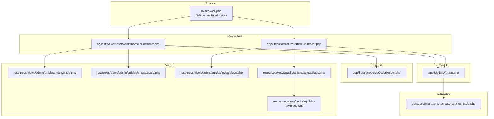
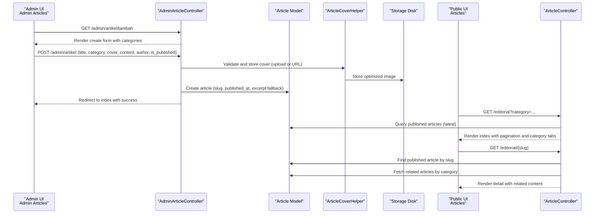
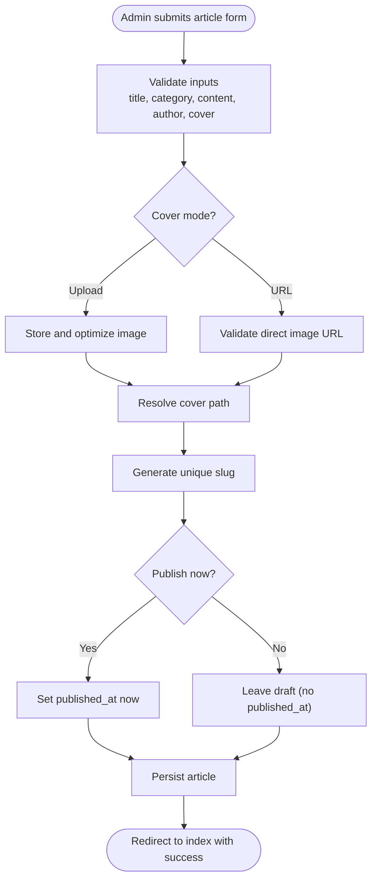
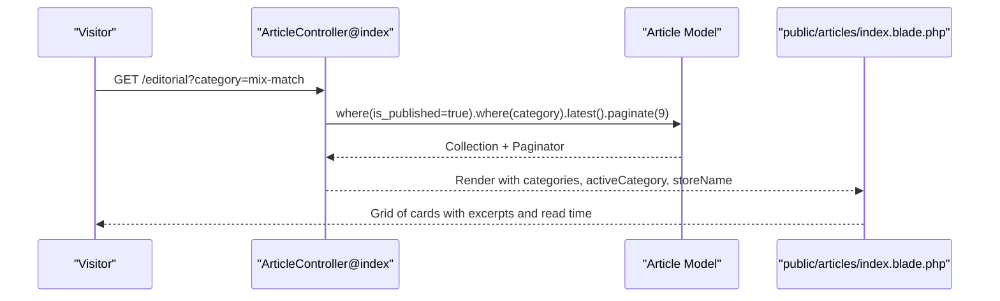
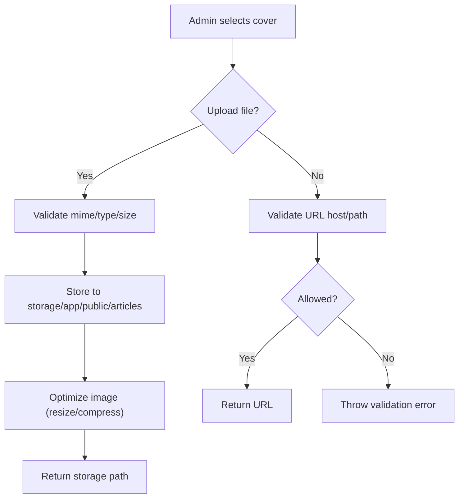
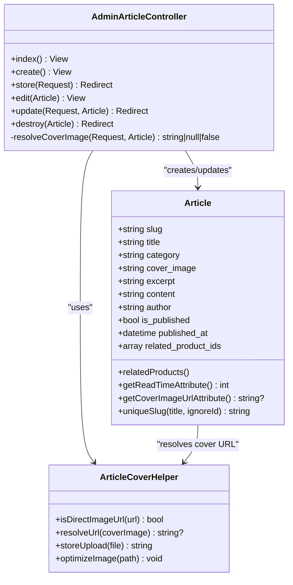
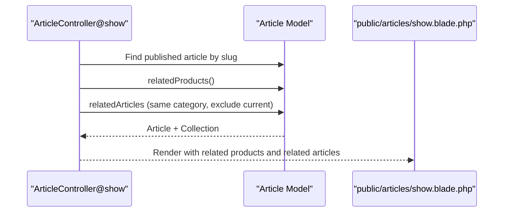
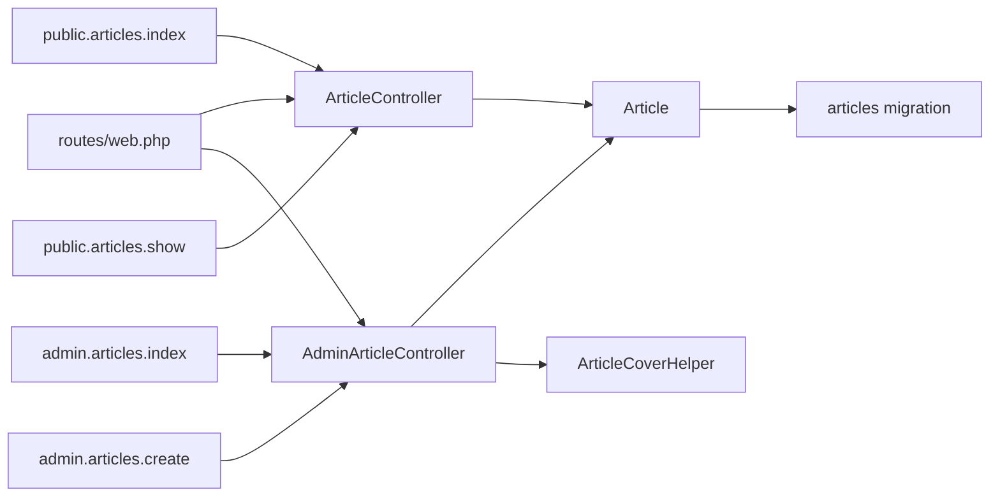
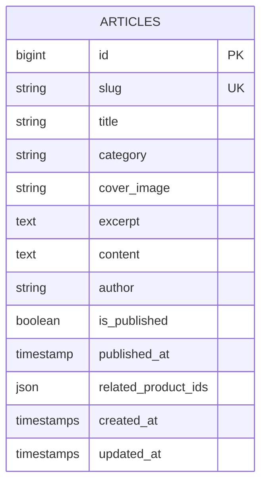

# Editorial Content Management

<cite>
**Referenced Files in This Document**
- [AdminArticleController.php](file://app/Http/Controllers/AdminArticleController.php)
- [ArticleController.php](file://app/Http/Controllers/ArticleController.php)
- [Article.php](file://app/Models/Article.php)
- [ArticleCoverHelper.php](file://app/Support/ArticleCoverHelper.php)
- [2026_05_28_131137_create_articles_table.php](file://database/migrations/2026_05_28_131137_create_articles_table.php)
- [web.php](file://routes/web.php)
- [catalog.php](file://config/catalog.php)
- [index.blade.php (Admin Articles)](file://resources/views/admin/articles/index.blade.php)
- [create.blade.php (Admin Articles)](file://resources/views/admin/articles/create.blade.php)
- [index.blade.php (Public Articles)](file://resources/views/public/articles/index.blade.php)
- [show.blade.php (Public Articles)](file://resources/views/public/articles/show.blade.php)
- [public-nav.blade.php](file://resources/views/partials/public-nav.blade.php)
- [cache.php](file://config/cache.php)
</cite>

## Table of Contents
1. [Introduction](#introduction)
2. [Project Structure](#project-structure)
3. [Core Components](#core-components)
4. [Architecture Overview](#architecture-overview)
5. [Detailed Component Analysis](#detailed-component-analysis)
6. [Dependency Analysis](#dependency-analysis)
7. [Performance Considerations](#performance-considerations)
8. [Troubleshooting Guide](#troubleshooting-guide)
9. [Conclusion](#conclusion)
10. [Appendices](#appendices)

## Introduction
This document describes KatalogThrift’s editorial content management system centered around the “Editorial” feature. It covers the article creation workflow, categories (mix-match, tips-perawatan, tren, panduan), publishing status management, and SEO-related metadata handling. It documents the admin interface for content editors (CRUD, draft management, publishing), the public-facing article listing and detail pages (pagination, filtering by category, related content recommendations), media handling for article covers, content formatting standards, and metadata management. Practical examples illustrate content creation, moderation-like publishing decisions, and scheduling via publish toggle. Performance optimization, caching strategies, and mobile-responsive design considerations are also addressed.

## Project Structure
The editorial system spans controllers, models, support utilities, Blade templates, routes, and configuration. The admin area exposes CRUD operations for articles, while the public area renders listings and detail pages with category filters and related content.

**Diagram sources**
- [web.php:56-58](file://routes/web.php#L56-L58)
- [AdminArticleController.php:13-162](file://app/Http/Controllers/AdminArticleController.php#L13-L162)
- [ArticleController.php:8-46](file://app/Http/Controllers/ArticleController.php#L8-L46)
- [Article.php:8-48](file://app/Models/Article.php#L8-L48)
- [ArticleCoverHelper.php:8-129](file://app/Support/ArticleCoverHelper.php#L8-L129)
- [2026_05_28_131137_create_articles_table.php:6-24](file://database/migrations/2026_05_28_131137_create_articles_table.php#L6-L24)
- [index.blade.php (Admin Articles):35-89](file://resources/views/admin/articles/index.blade.php#L35-L89)
- [create.blade.php (Admin Articles):40-150](file://resources/views/admin/articles/create.blade.php#L40-L150)
- [index.blade.php (Public Articles):48-104](file://resources/views/public/articles/index.blade.php#L48-L104)
- [show.blade.php (Public Articles):62-147](file://resources/views/public/articles/show.blade.php#L62-L147)
- [public-nav.blade.php:1-27](file://resources/views/partials/public-nav.blade.php#L1-L27)

**Section sources**
- [web.php:56-58](file://routes/web.php#L56-L58)
- [AdminArticleController.php:13-162](file://app/Http/Controllers/AdminArticleController.php#L13-L162)
- [ArticleController.php:8-46](file://app/Http/Controllers/ArticleController.php#L8-L46)
- [Article.php:8-48](file://app/Models/Article.php#L8-L48)
- [ArticleCoverHelper.php:8-129](file://app/Support/ArticleCoverHelper.php#L8-L129)
- [2026_05_28_131137_create_articles_table.php:6-24](file://database/migrations/2026_05_28_131137_create_articles_table.php#L6-L24)
- [index.blade.php (Admin Articles):35-89](file://resources/views/admin/articles/index.blade.php#L35-L89)
- [create.blade.php (Admin Articles):40-150](file://resources/views/admin/articles/create.blade.php#L40-L150)
- [index.blade.php (Public Articles):48-104](file://resources/views/public/articles/index.blade.php#L48-L104)
- [show.blade.php (Public Articles):62-147](file://resources/views/public/articles/show.blade.php#L62-L147)
- [public-nav.blade.php:1-27](file://resources/views/partials/public-nav.blade.php#L1-L27)

## Core Components
- AdminArticleController: Handles admin CRUD for articles, cover image resolution (upload vs URL), slug generation, publishing toggle, and deletion.
- ArticleController: Serves public listing and detail pages, filters by category, and recommends related articles.
- Article model: Defines fillable attributes, casting booleans and arrays, related product retrieval, read time calculation, cover URL resolution, and unique slug generation.
- ArticleCoverHelper: Validates direct image URLs, resolves cover image URLs, and optimizes uploaded images.
- Routes: Expose public endpoints for editorial listing and detail pages.
- Views: Admin CRUD UI and public listing/detail pages with category tabs and related content.

Key capabilities:
- Categories: mix-match, tips-perawatan, tren, panduan
- Publishing: Draft vs published with published_at timestamp
- Media: Upload or direct URL; optimized resizing and compression
- SEO: Read time, cover URL resolution, and public navigation integration

**Section sources**
- [AdminArticleController.php:20-28](file://app/Http/Controllers/AdminArticleController.php#L20-L28)
- [ArticleController.php:10-29](file://app/Http/Controllers/ArticleController.php#L10-L29)
- [Article.php:10-19](file://app/Models/Article.php#L10-L19)
- [ArticleCoverHelper.php:10-60](file://app/Support/ArticleCoverHelper.php#L10-L60)
- [web.php:56-58](file://routes/web.php#L56-L58)
- [index.blade.php (Public Articles):58-63](file://resources/views/public/articles/index.blade.php#L58-L63)

## Architecture Overview
The editorial system follows a layered MVC pattern:
- Routes define endpoints for public listing and detail.
- Controllers orchestrate queries, validations, and view rendering.
- Models encapsulate data access, casting, and derived attributes.
- Support utilities handle media transformations and URL resolution.
- Blade templates render admin and public UIs.

**Diagram sources**
- [web.php:210-217](file://routes/web.php#L210-L217)
- [AdminArticleController.php:38-74](file://app/Http/Controllers/AdminArticleController.php#L38-L74)
- [ArticleController.php:10-44](file://app/Http/Controllers/ArticleController.php#L10-L44)
- [Article.php:21-36](file://app/Models/Article.php#L21-L36)
- [ArticleCoverHelper.php:62-68](file://app/Support/ArticleCoverHelper.php#L62-L68)

## Detailed Component Analysis

### Admin Article Creation and Publishing Workflow
- Categories are predefined and surfaced in the admin form.
- Cover image supports two modes:
  - Upload file: validated and stored under the articles directory, then optimized.
  - Direct URL: validated against allowed hosts and blocked domains.
- Slug is generated from the title and guaranteed unique.
- Publishing toggle sets published_at on publish.
- Excerpt is auto-generated from content if empty.
- Deletion removes stored cover images when applicable.

**Diagram sources**
- [AdminArticleController.php:46-74](file://app/Http/Controllers/AdminArticleController.php#L46-L74)
- [ArticleCoverHelper.php:62-68](file://app/Support/ArticleCoverHelper.php#L62-L68)
- [Article.php:38-46](file://app/Models/Article.php#L38-L46)

**Section sources**
- [AdminArticleController.php:20-28](file://app/Http/Controllers/AdminArticleController.php#L20-L28)
- [AdminArticleController.php:46-74](file://app/Http/Controllers/AdminArticleController.php#L46-L74)
- [ArticleCoverHelper.php:10-38](file://app/Support/ArticleCoverHelper.php#L10-L38)
- [Article.php:38-46](file://app/Models/Article.php#L38-L46)

### Public Listing and Detail Pages
- Listing page:
  - Filters by category via query param.
  - Paginated grid with lazy image loading and meta info.
  - Category tabs for quick navigation.
- Detail page:
  - Displays cover, title, author, read time, published date.
  - Shows related products if linked in article.
  - Recommends related articles by category (excluding current).
  - Provides share actions.

**Diagram sources**
- [ArticleController.php:10-29](file://app/Http/Controllers/ArticleController.php#L10-L29)
- [index.blade.php (Public Articles):58-93](file://resources/views/public/articles/index.blade.php#L58-L93)

**Section sources**
- [ArticleController.php:10-29](file://app/Http/Controllers/ArticleController.php#L10-L29)
- [index.blade.php (Public Articles):58-93](file://resources/views/public/articles/index.blade.php#L58-L93)
- [show.blade.php (Public Articles):65-126](file://resources/views/public/articles/show.blade.php#L65-L126)

### Media Handling and Cover Resolution
- Allowed direct image URLs are validated against a whitelist and blocked host list.
- Uploaded images are stored under the public disk and optimized (resize and compress) before persisting.
- Cover URL resolution supports absolute, storage-relative, and public asset paths.

**Diagram sources**
- [AdminArticleController.php:133-160](file://app/Http/Controllers/AdminArticleController.php#L133-L160)
- [ArticleCoverHelper.php:10-38](file://app/Support/ArticleCoverHelper.php#L10-L38)
- [ArticleCoverHelper.php:62-68](file://app/Support/ArticleCoverHelper.php#L62-L68)
- [ArticleCoverHelper.php:40-60](file://app/Support/ArticleCoverHelper.php#L40-L60)

**Section sources**
- [AdminArticleController.php:133-160](file://app/Http/Controllers/AdminArticleController.php#L133-L160)
- [ArticleCoverHelper.php:10-38](file://app/Support/ArticleCoverHelper.php#L10-L38)
- [ArticleCoverHelper.php:40-60](file://app/Support/ArticleCoverHelper.php#L40-L60)

### Content Formatting Standards
- Content is stored as plain text with newlines preserved.
- Rendering uses whitespace-aware formatting to maintain readability.
- Excerpt is truncated to a concise summary when not provided.

Practical implications:
- Writers should use plain text and rely on automatic newline rendering.
- Excerpts are recommended for richer previews but auto-generated if missing.

**Section sources**
- [2026_05_28_131137_create_articles_table.php:15](file://database/migrations/2026_05_28_131137_create_articles_table.php#L15)
- [AdminArticleController.php:67-69](file://app/Http/Controllers/AdminArticleController.php#L67-L69)
- [show.blade.php (Public Articles):28](file://resources/views/public/articles/show.blade.php#L28)

### Metadata Management
- Read time is computed from word count and displayed on public pages.
- Cover image URL resolution ensures safe and valid assets.
- Public navigation integrates editorial access for visitors.

**Section sources**
- [Article.php:27-31](file://app/Models/Article.php#L27-L31)
- [Article.php:33-36](file://app/Models/Article.php#L33-L36)
- [public-nav.blade.php:8](file://resources/views/partials/public-nav.blade.php#L8)

### Admin Interface: CRUD, Drafts, and Publishing
- Index lists articles with status badges, author, and publish date; includes action links.
- Create form collects title, category, author, cover (file or URL), excerpt, content, and publish toggle.
- Edit updates metadata and cover; slug re-generation occurs only when title changes.
- Delete removes persisted cover images when stored locally.

**Diagram sources**
- [AdminArticleController.php:13-162](file://app/Http/Controllers/AdminArticleController.php#L13-L162)
- [Article.php:8-48](file://app/Models/Article.php#L8-L48)
- [ArticleCoverHelper.php:8-129](file://app/Support/ArticleCoverHelper.php#L8-L129)

**Section sources**
- [index.blade.php (Admin Articles):60-85](file://resources/views/admin/articles/index.blade.php#L60-L85)
- [create.blade.php (Admin Articles):59-119](file://resources/views/admin/articles/create.blade.php#L59-L119)
- [AdminArticleController.php:120-128](file://app/Http/Controllers/AdminArticleController.php#L120-L128)

### Public Article Detail Page: Related Content Recommendations
- Related products: retrieved from linked product IDs when present.
- Related articles: latest articles in the same category excluding the current article.

**Diagram sources**
- [ArticleController.php:31-44](file://app/Http/Controllers/ArticleController.php#L31-L44)
- [Article.php:21-25](file://app/Models/Article.php#L21-L25)

**Section sources**
- [ArticleController.php:31-44](file://app/Http/Controllers/ArticleController.php#L31-L44)
- [Article.php:21-25](file://app/Models/Article.php#L21-L25)
- [show.blade.php (Public Articles):84-126](file://resources/views/public/articles/show.blade.php#L84-L126)

## Dependency Analysis
- Controllers depend on the Article model and ArticleCoverHelper for media operations.
- Routes bind public endpoints to ArticleController and admin endpoints to AdminArticleController.
- Views depend on controller-provided data and configuration for store branding.

**Diagram sources**
- [web.php:56-58](file://routes/web.php#L56-L58)
- [web.php:210-217](file://routes/web.php#L210-L217)
- [AdminArticleController.php:13-162](file://app/Http/Controllers/AdminArticleController.php#L13-L162)
- [ArticleController.php:8-46](file://app/Http/Controllers/ArticleController.php#L8-L46)
- [Article.php:8-48](file://app/Models/Article.php#L8-L48)
- [2026_05_28_131137_create_articles_table.php:6-24](file://database/migrations/2026_05_28_131137_create_articles_table.php#L6-L24)

**Section sources**
- [web.php:56-58](file://routes/web.php#L56-L58)
- [web.php:210-217](file://routes/web.php#L210-L217)
- [AdminArticleController.php:13-162](file://app/Http/Controllers/AdminArticleController.php#L13-L162)
- [ArticleController.php:8-46](file://app/Http/Controllers/ArticleController.php#L8-L46)
- [Article.php:8-48](file://app/Models/Article.php#L8-L48)

## Performance Considerations
- Image optimization: Uploaded article covers are resized and compressed to reduce bandwidth and improve load times.
- Lazy loading: Public card images use lazy loading to defer offscreen resource loading.
- Pagination: Admin and public listings use pagination to limit payload sizes.
- Read time: Computed server-side from content length to inform users without client-side parsing.
- Mobile-first design: Responsive grids and navigation adapt to smaller screens.

Recommendations:
- Enable CDN for public storage assets to further reduce latency.
- Consider browser caching headers for static assets.
- Use responsive image serving (sizes/srcset) for higher-DPI displays.
- Implement server-side caching for frequently accessed article listings.

**Section sources**
- [ArticleCoverHelper.php:70-127](file://app/Support/ArticleCoverHelper.php#L70-L127)
- [index.blade.php (Public Articles):74-78](file://resources/views/public/articles/index.blade.php#L74-L78)
- [Article.php:27-31](file://app/Models/Article.php#L27-L31)
- [index.blade.php (Public Articles):32](file://resources/views/public/articles/index.blade.php#L32)

## Troubleshooting Guide
- Cover URL validation errors:
  - Occur when pasting non-direct image links or blocked hosts. Use direct image URLs ending with supported extensions or upload files.
- Cover file validation errors:
  - Occur on unsupported formats, invalid MIME types, or oversized files. Ensure JPEG, PNG, WEBP, or GIF under the size limit.
- Slug conflicts:
  - Automatically resolved by appending incremental suffixes; avoid editing titles after publication if maintaining canonical URLs is desired.
- Published vs draft behavior:
  - Publishing toggles visibility on the public site; drafts remain invisible until published.
- Deleting articles:
  - Stored cover images are removed; external URLs are ignored.

**Section sources**
- [AdminArticleController.php:146-150](file://app/Http/Controllers/AdminArticleController.php#L146-L150)
- [AdminArticleController.php:52-56](file://app/Http/Controllers/AdminArticleController.php#L52-L56)
- [Article.php:38-46](file://app/Models/Article.php#L38-L46)
- [AdminArticleController.php:120-128](file://app/Http/Controllers/AdminArticleController.php#L120-L128)

## Conclusion
KatalogThrift’s editorial content management system provides a streamlined admin workflow for creating, publishing, and managing articles with robust media handling and SEO-friendly attributes. The public interface delivers a mobile-responsive experience with category filtering, pagination, and related content recommendations. By leveraging image optimization, pagination, and configuration-driven branding, the system balances ease of use with performance and scalability.

## Appendices

### Practical Examples

- Creating an article:
  - Navigate to the admin article creation page, choose a category, set author, upload or provide a direct cover URL, write plain-text content, optionally add an excerpt, and select publish now if ready.
- Publishing and scheduling:
  - To schedule publication, leave publish now unchecked and revisit later to publish; published_at is set upon first enabling publish.
- Moderation-like process:
  - Treat drafts as internal review stage; publish only after approval. There is no dedicated approval workflow; publishing toggles visibility.
- Managing related products:
  - Populate related product IDs in the article to surface related products on the detail page.

**Section sources**
- [create.blade.php (Admin Articles):59-119](file://resources/views/admin/articles/create.blade.php#L59-L119)
- [AdminArticleController.php:62-64](file://app/Http/Controllers/AdminArticleController.php#L62-L64)
- [show.blade.php (Public Articles):84-101](file://resources/views/public/articles/show.blade.php#L84-L101)

### Data Model Overview

**Diagram sources**
- [2026_05_28_131137_create_articles_table.php:8-21](file://database/migrations/2026_05_28_131137_create_articles_table.php#L8-L21)

### Caching Strategy
- Default cache driver is configurable; adjust CACHE_DRIVER and related settings for production environments.
- Consider caching frequently accessed article listings or computed read times for improved response times.

**Section sources**
- [cache.php:18](file://config/cache.php#L18)
- [cache.php:34-96](file://config/cache.php#L34-L96)