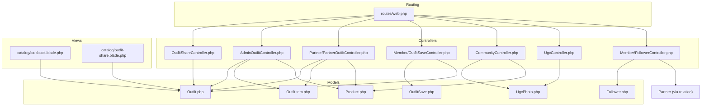
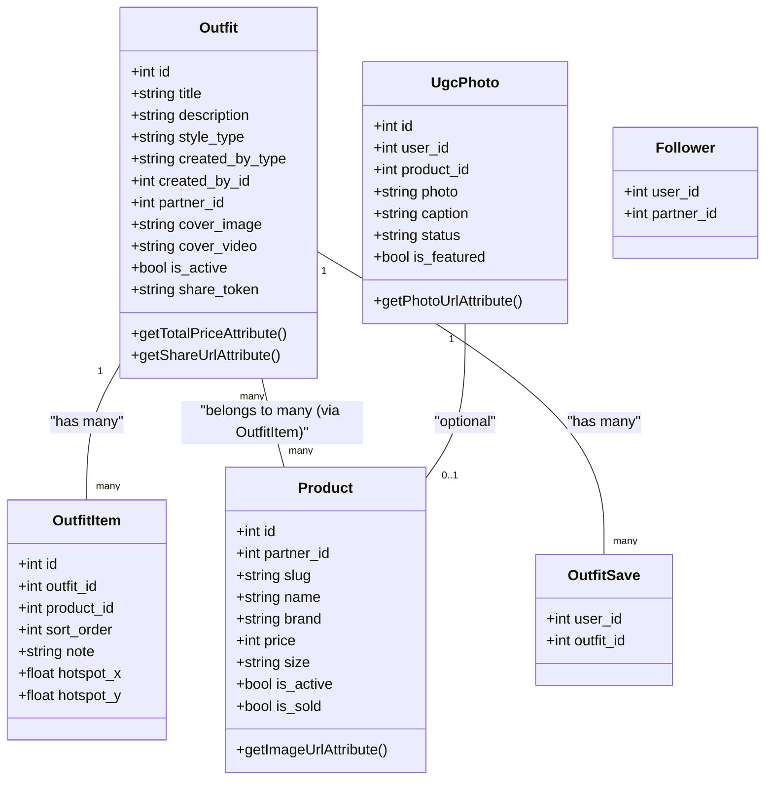
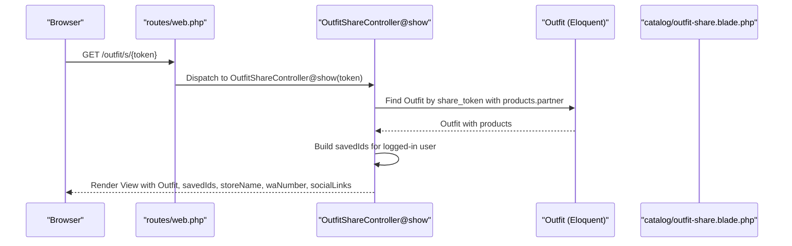
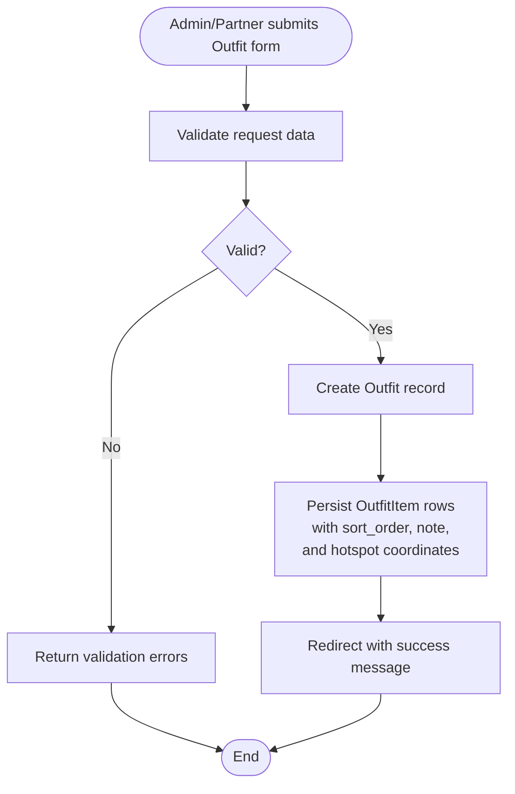
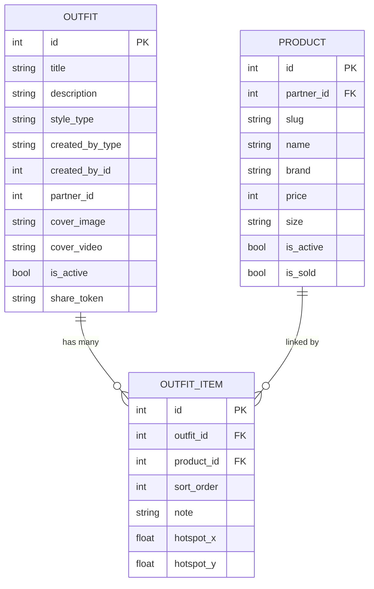
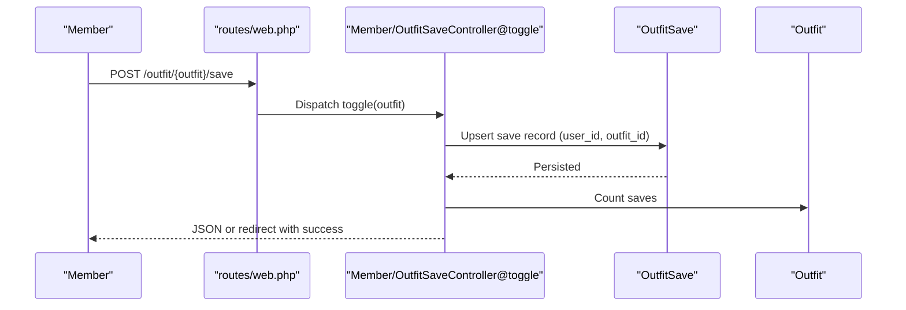
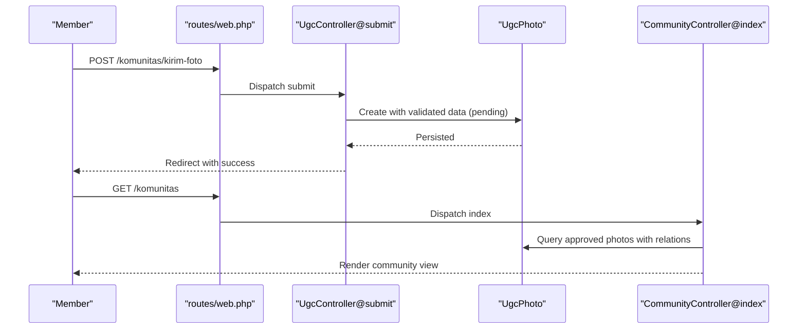
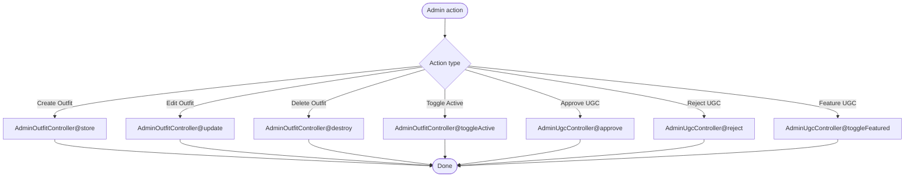
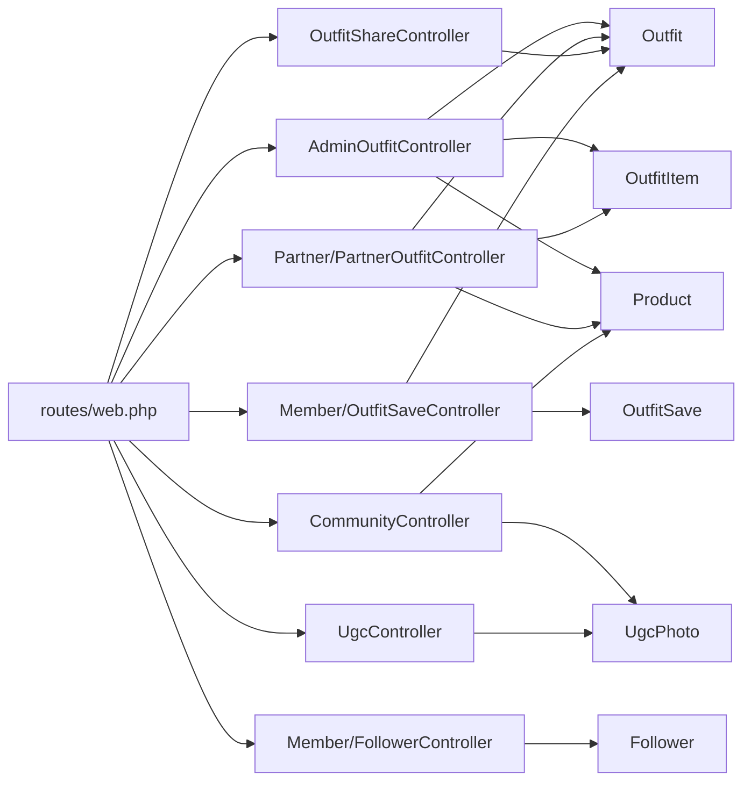

# Lookbook and Outfit Curation

<cite>
**Referenced Files in This Document**
- [routes/web.php](file://routes/web.php)
- [resources/views/catalog/lookbook.blade.php](file://resources/views/catalog/lookbook.blade.php)
- [resources/views/catalog/outfit-share.blade.php](file://resources/views/catalog/outfit-share.blade.php)
- [app/Http/Controllers/OutfitShareController.php](file://app/Http/Controllers/OutfitShareController.php)
- [app/Http/Controllers/AdminOutfitController.php](file://app/Http/Controllers/AdminOutfitController.php)
- [app/Http/Controllers/Partner/PartnerOutfitController.php](file://app/Http/Controllers/Partner/PartnerOutfitController.php)
- [app/Http/Controllers/Member/OutfitSaveController.php](file://app/Http/Controllers/Member/OutfitSaveController.php)
- [app/Http/Controllers/CommunityController.php](file://app/Http/Controllers/CommunityController.php)
- [app/Http/Controllers/UgcController.php](file://app/Http/Controllers/UgcController.php)
- [app/Models/Outfit.php](file://app/Models/Outfit.php)
- [app/Models/OutfitItem.php](file://app/Models/OutfitItem.php)
- [app/Models/OutfitSave.php](file://app/Models/OutfitSave.php)
- [app/Models/Product.php](file://app/Models/Product.php)
- [app/Models/UgcPhoto.php](file://app/Models/UgcPhoto.php)
- [app/Models/Follower.php](file://app/Models/Follower.php)
- [app/Http/Controllers/Member/FollowerController.php](file://app/Http/Controllers/Member/FollowerController.php)
</cite>

## Table of Contents
1. [Introduction](#introduction)
2. [Project Structure](#project-structure)
3. [Core Components](#core-components)
4. [Architecture Overview](#architecture-overview)
5. [Detailed Component Analysis](#detailed-component-analysis)
6. [Dependency Analysis](#dependency-analysis)
7. [Performance Considerations](#performance-considerations)
8. [Troubleshooting Guide](#troubleshooting-guide)
9. [Conclusion](#conclusion)
10. [Appendices](#appendices)

## Introduction
This document explains KatalogThrift’s lookbook and outfit curation system. It covers how curated looks are created and managed, how items are associated with outfits, how lookbooks are presented to users, and how saving, sharing, and social features work. It also documents administrative controls for lookbook curation, content moderation, and community contributions such as user-generated content and follower interactions.

## Project Structure
The lookbook and outfit curation system spans routing, controllers, models, and Blade templates. Key areas include:
- Public lookbook presentation and sharing
- Outfit creation via admin and partner roles
- Saving and viewing saved outfits
- Community contribution and moderation
- Social interaction via followers

**Diagram sources**
- [routes/web.php:44-240](file://routes/web.php#L44-L240)
- [app/Http/Controllers/OutfitShareController.php:1-29](file://app/Http/Controllers/OutfitShareController.php#L1-L29)
- [app/Http/Controllers/AdminOutfitController.php:1-175](file://app/Http/Controllers/AdminOutfitController.php#L1-L175)
- [app/Http/Controllers/Partner/PartnerOutfitController.php:1-92](file://app/Http/Controllers/Partner/PartnerOutfitController.php#L1-L92)
- [app/Http/Controllers/Member/OutfitSaveController.php:1-49](file://app/Http/Controllers/Member/OutfitSaveController.php#L1-L49)
- [app/Http/Controllers/CommunityController.php:1-30](file://app/Http/Controllers/CommunityController.php#L1-L30)
- [app/Http/Controllers/UgcController.php:1-49](file://app/Http/Controllers/UgcController.php#L1-L49)
- [app/Http/Controllers/Member/FollowerController.php:1-45](file://app/Http/Controllers/Member/FollowerController.php#L1-L45)
- [app/Models/Outfit.php:1-60](file://app/Models/Outfit.php#L1-L60)
- [app/Models/OutfitItem.php:1-28](file://app/Models/OutfitItem.php#L1-L28)
- [app/Models/OutfitSave.php:1-17](file://app/Models/OutfitSave.php#L1-L17)
- [app/Models/Product.php:1-132](file://app/Models/Product.php#L1-L132)
- [app/Models/UgcPhoto.php:1-24](file://app/Models/UgcPhoto.php#L1-L24)
- [app/Models/Follower.php:1-23](file://app/Models/Follower.php#L1-L23)
- [resources/views/catalog/lookbook.blade.php:1-261](file://resources/views/catalog/lookbook.blade.php#L1-L261)
- [resources/views/catalog/outfit-share.blade.php](file://resources/views/catalog/outfit-share.blade.php)

**Section sources**
- [routes/web.php:44-240](file://routes/web.php#L44-L240)

## Core Components
- Outfit: represents a curated look with metadata, creator attribution, cover media, and associations to products via OutfitItem.
- OutfitItem: junction model linking Outfit to Product with ordering, notes, and hotspot coordinates for interactive lookbook.
- Product: item details, pricing, variants, and lookbook-specific pairing tips.
- OutfitSave: user-to-outfit many-to-many via a simple pivot table.
- UgcPhoto: user-submitted photos linked to products and moderated by admins.
- Follower: member-to-partner follow relationship with counts and activity.

Key behaviors:
- Outfit creation supports admin and partner roles with distinct workflows.
- Lookbook displays curated outfits with hotspots and bundle purchase links.
- Outfit sharing uses a one-time share token.
- Saved outfits are persisted per user.
- Community contributes photos awaiting moderation.

**Section sources**
- [app/Models/Outfit.php:1-60](file://app/Models/Outfit.php#L1-L60)
- [app/Models/OutfitItem.php:1-28](file://app/Models/OutfitItem.php#L1-L28)
- [app/Models/Product.php:1-132](file://app/Models/Product.php#L1-L132)
- [app/Models/OutfitSave.php:1-17](file://app/Models/OutfitSave.php#L1-L17)
- [app/Models/UgcPhoto.php:1-24](file://app/Models/UgcPhoto.php#L1-L24)
- [app/Models/Follower.php:1-23](file://app/Models/Follower.php#L1-L23)

## Architecture Overview
The system separates concerns across roles:
- Admin: creates and curates official lookbooks, manages active state, and sets hotspots.
- Partner: builds mixed-merchant looks from approved products and publishes to lookbook.
- Member: saves looks, shares via tokenized URLs, follows stores, and interacts with community.
- Public: views lookbook and shared outfits.

**Diagram sources**
- [app/Models/Outfit.php:1-60](file://app/Models/Outfit.php#L1-L60)
- [app/Models/OutfitItem.php:1-28](file://app/Models/OutfitItem.php#L1-L28)
- [app/Models/Product.php:1-132](file://app/Models/Product.php#L1-L132)
- [app/Models/OutfitSave.php:1-17](file://app/Models/OutfitSave.php#L1-L17)
- [app/Models/UgcPhoto.php:1-24](file://app/Models/UgcPhoto.php#L1-L24)
- [app/Models/Follower.php:1-23](file://app/Models/Follower.php#L1-L23)

## Detailed Component Analysis

### Lookbook Presentation and Sharing
- Lookbook page aggregates curated Outfits and renders cinematic cards with optional video or fallback flatlay images.
- Hotspots on images link to product pages; tooltips show product name and price.
- Users can save looks and share via Web Share API or clipboard.
- Shared look URL uses a one-time share token.

**Diagram sources**
- [routes/web.php:50](file://routes/web.php#L50)
- [app/Http/Controllers/OutfitShareController.php:10-27](file://app/Http/Controllers/OutfitShareController.php#L10-L27)
- [app/Models/Outfit.php:33-48](file://app/Models/Outfit.php#L33-L48)
- [resources/views/catalog/outfit-share.blade.php](file://resources/views/catalog/outfit-share.blade.php)

**Section sources**
- [resources/views/catalog/lookbook.blade.php:114-227](file://resources/views/catalog/lookbook.blade.php#L114-L227)
- [app/Http/Controllers/OutfitShareController.php:10-27](file://app/Http/Controllers/OutfitShareController.php#L10-L27)
- [app/Models/Outfit.php:19-26](file://app/Models/Outfit.php#L19-L26)

### Outfit Creation Workflows
- Admin workflow:
  - Validates title, description, style type, active flag, products array (2–6), notes, hotspots, and optional cover image/video.
  - Creates Outfit with random share token and persists OutfitItem rows with sort order, notes, and rounded hotspot coordinates.
- Partner workflow:
  - Validates title, description, style type, and products array.
  - Creates Outfit with created_by_type/partner_id and persists OutfitItem rows with sort order and notes.

**Diagram sources**
- [app/Http/Controllers/AdminOutfitController.php:44-82](file://app/Http/Controllers/AdminOutfitController.php#L44-L82)
- [app/Http/Controllers/AdminOutfitController.php:159-173](file://app/Http/Controllers/AdminOutfitController.php#L159-L173)
- [app/Http/Controllers/Partner/PartnerOutfitController.php:49-82](file://app/Http/Controllers/Partner/PartnerOutfitController.php#L49-L82)

**Section sources**
- [app/Http/Controllers/AdminOutfitController.php:44-82](file://app/Http/Controllers/AdminOutfitController.php#L44-L82)
- [app/Http/Controllers/Partner/PartnerOutfitController.php:49-82](file://app/Http/Controllers/Partner/PartnerOutfitController.php#L49-L82)

### Outfit-Item Relationship Management and Visual Composition
- Outfit belongs to Partner and has many OutfitItem entries ordered by sort_order.
- OutfitItem belongs to Outfit and Product, and optionally carries hotspot coordinates for interactive hotspots.
- Products are linked to Outfit via OutfitItem with pivot attributes for ordering and notes.

**Diagram sources**
- [app/Models/Outfit.php:28-38](file://app/Models/Outfit.php#L28-L38)
- [app/Models/OutfitItem.php:9-16](file://app/Models/OutfitItem.php#L9-L16)
- [app/Models/Product.php:13-25](file://app/Models/Product.php#L13-L25)

**Section sources**
- [app/Models/Outfit.php:28-38](file://app/Models/Outfit.php#L28-L38)
- [app/Models/OutfitItem.php:18-26](file://app/Models/OutfitItem.php#L18-L26)
- [app/Models/Product.php:36-39](file://app/Models/Product.php#L36-L39)

### Save Functionality and Personalization
- Logged-in users can toggle saving an outfit; saves persist in OutfitSave.
- Saved outfits are listed under a dedicated route and view.
- Lookbook card indicates whether an outfit is saved and provides a save button.

**Diagram sources**
- [routes/web.php:96](file://routes/web.php#L96)
- [app/Http/Controllers/Member/OutfitSaveController.php:15-34](file://app/Http/Controllers/Member/OutfitSaveController.php#L15-L34)
- [app/Models/OutfitSave.php:9-12](file://app/Models/OutfitSave.php#L9-L12)
- [app/Models/Outfit.php:45-48](file://app/Models/Outfit.php#L45-L48)

**Section sources**
- [app/Http/Controllers/Member/OutfitSaveController.php:15-49](file://app/Http/Controllers/Member/OutfitSaveController.php#L15-L49)
- [resources/views/catalog/lookbook.blade.php:196-216](file://resources/views/catalog/lookbook.blade.php#L196-L216)

### Community Features: UGC and Followers
- Community index aggregates approved UGC photos and active products.
- UGC submission validates inputs, stores image, and records pending status.
- Followers toggle membership-to-partner follow relationships and increment/decrement follower counts.

**Diagram sources**
- [routes/web.php:62](file://routes/web.php#L62)
- [app/Http/Controllers/UgcController.php:24-47](file://app/Http/Controllers/UgcController.php#L24-L47)
- [app/Models/UgcPhoto.php:9-13](file://app/Models/UgcPhoto.php#L9-L13)
- [app/Http/Controllers/CommunityController.php:11-28](file://app/Http/Controllers/CommunityController.php#L11-L28)

**Section sources**
- [app/Http/Controllers/UgcController.php:24-47](file://app/Http/Controllers/UgcController.php#L24-L47)
- [app/Http/Controllers/CommunityController.php:11-28](file://app/Http/Controllers/CommunityController.php#L11-L28)
- [app/Http/Controllers/Member/FollowerController.php:12-29](file://app/Http/Controllers/Member/FollowerController.php#L12-L29)

### Admin Oversight and Content Moderation
- Admin manages curated Outfits: create, edit, delete, activate/deactivate.
- Admin approves/rejects UGC photos and can feature selected posts.
- Admin controls partner approval and product moderation.

**Diagram sources**
- [app/Http/Controllers/AdminOutfitController.php:15-82](file://app/Http/Controllers/AdminOutfitController.php#L15-L82)
- [app/Http/Controllers/AdminOutfitController.php:100-157](file://app/Http/Controllers/AdminOutfitController.php#L100-L157)
- [routes/web.php:218-223](file://routes/web.php#L218-L223)

**Section sources**
- [app/Http/Controllers/AdminOutfitController.php:15-157](file://app/Http/Controllers/AdminOutfitController.php#L15-L157)
- [routes/web.php:218-223](file://routes/web.php#L218-L223)

## Dependency Analysis
- Routing defines endpoints for lookbook, sharing, saving, community, and moderation.
- Controllers depend on Eloquent models to enforce business rules and data integrity.
- Views render UI and bind server-side data, including hotspots and share actions.

**Diagram sources**
- [routes/web.php:44-240](file://routes/web.php#L44-L240)
- [app/Http/Controllers/AdminOutfitController.php:1-175](file://app/Http/Controllers/AdminOutfitController.php#L1-L175)
- [app/Http/Controllers/Partner/PartnerOutfitController.php:1-92](file://app/Http/Controllers/Partner/PartnerOutfitController.php#L1-L92)
- [app/Http/Controllers/OutfitShareController.php:1-29](file://app/Http/Controllers/OutfitShareController.php#L1-L29)
- [app/Http/Controllers/Member/OutfitSaveController.php:1-49](file://app/Http/Controllers/Member/OutfitSaveController.php#L1-L49)
- [app/Http/Controllers/CommunityController.php:1-30](file://app/Http/Controllers/CommunityController.php#L1-L30)
- [app/Http/Controllers/UgcController.php:1-49](file://app/Http/Controllers/UgcController.php#L1-L49)
- [app/Http/Controllers/Member/FollowerController.php:1-45](file://app/Http/Controllers/Member/FollowerController.php#L1-L45)

**Section sources**
- [routes/web.php:44-240](file://routes/web.php#L44-L240)

## Performance Considerations
- Eager loading: Controllers load related models (e.g., Outfit with products.partner, UGC with user/product) to avoid N+1 queries.
- Pagination: Community and UGC lists use pagination to limit payload sizes.
- Image/video assets: Cover media stored in public disk; consider CDN and lazy-loading for large grids.
- Hotspot precision: Coordinates are rounded to two decimals to reduce storage overhead while maintaining usability.

## Troubleshooting Guide
- Outfit not appearing in lookbook:
  - Confirm Outfit.is_active is true and Outfit.created_by_type is set appropriately.
  - Ensure Outfit has at least two OutfitItem entries and valid Product linkage.
- Share link fails:
  - Verify Outfit.share_token exists and route matches the controller action.
- Save toggle not working:
  - Ensure user is authenticated and OutfitSave upsert succeeds.
- UGC not visible:
  - Confirm UgcPhoto.status is approved and product filters are satisfied.
- Follower count not updating:
  - Verify Follower upsert/delete and Partner follower_count increments/decrements occur.

**Section sources**
- [app/Http/Controllers/AdminOutfitController.php:15-82](file://app/Http/Controllers/AdminOutfitController.php#L15-L82)
- [app/Http/Controllers/OutfitShareController.php:10-18](file://app/Http/Controllers/OutfitShareController.php#L10-L18)
- [app/Http/Controllers/Member/OutfitSaveController.php:17-27](file://app/Http/Controllers/Member/OutfitSaveController.php#L17-L27)
- [app/Http/Controllers/UgcController.php:26-47](file://app/Http/Controllers/UgcController.php#L26-L47)
- [app/Http/Controllers/Member/FollowerController.php:14-26](file://app/Http/Controllers/Member/FollowerController.php#L14-L26)

## Conclusion
KatalogThrift’s lookbook and outfit curation system integrates role-based creation, robust item-product relationships, and social features. Admins curate official looks with hotspots and media, partners compose cross-merchant looks, and members save, share, and engage through community contributions and follow actions. Moderation and quality controls ensure content integrity.

## Appendices

### Lookbook Display Elements
- Cinematic grid with hover zoom and video badge support.
- Hotspots with animated tooltips and product links.
- Total price calculation from linked products.
- Save/share actions with Web Share fallback.

**Section sources**
- [resources/views/catalog/lookbook.blade.php:32-216](file://resources/views/catalog/lookbook.blade.php#L32-L216)

### Styling Guidelines and Best Practices
- Outfit composition:
  - Minimum 2–6 items per look; maintain visual balance and complementary styles.
  - Use notes to explain styling tips or pairing suggestions.
- Hotspots:
  - Place hotspots precisely; keep coordinates within 0–100 range.
  - Provide clear product names/prices in tooltips.
- Media:
  - Prefer vertical aspect ratio for cinematic effect; include optional video for dynamic presentation.
- Community engagement:
  - Encourage UGC with clear submission guidelines and hashtags.
  - Moderate UGC promptly and feature high-quality posts.

[No sources needed since this section provides general guidance]