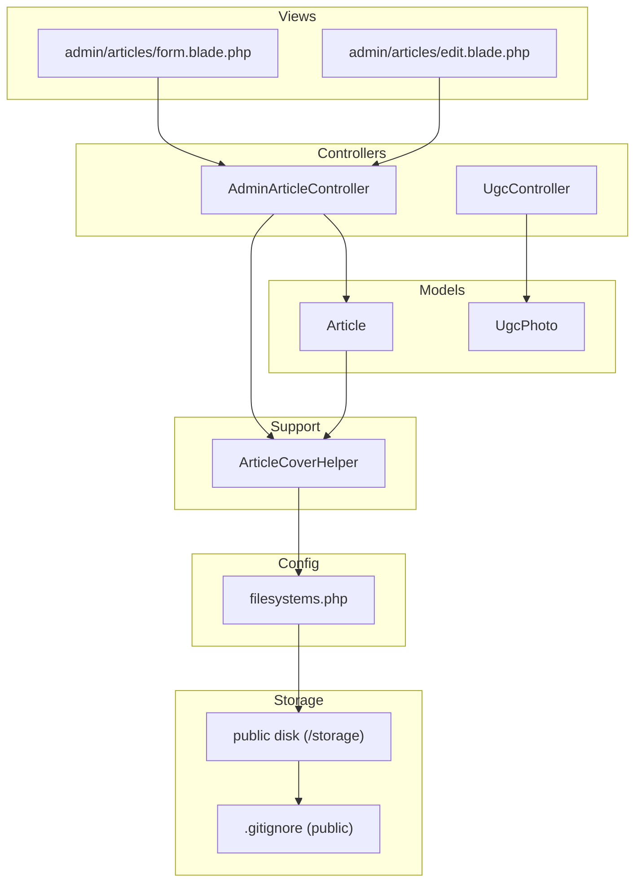
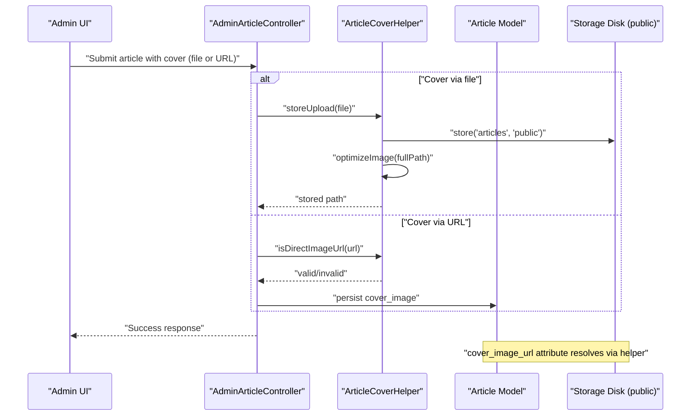
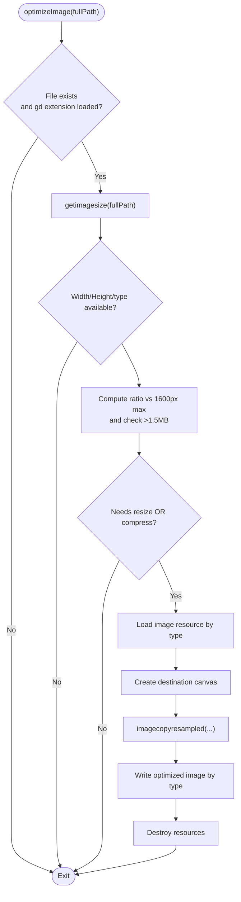
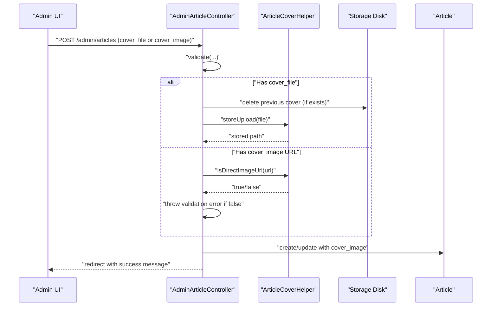
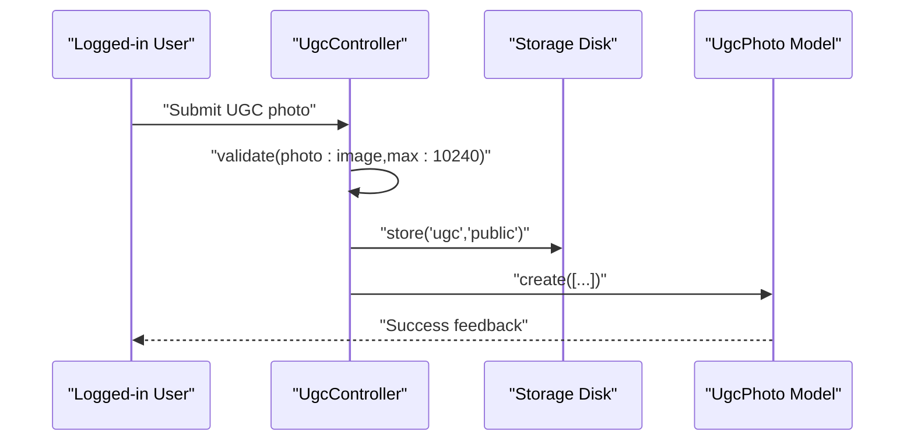
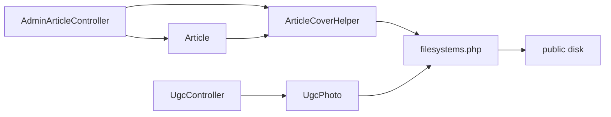

# Media and Asset Management

<cite>
**Referenced Files in This Document**
- [ArticleCoverHelper.php](file://app/Support/ArticleCoverHelper.php)
- [AdminArticleController.php](file://app/Http/Controllers/AdminArticleController.php)
- [Article.php](file://app/Models/Article.php)
- [UgcController.php](file://app/Http/Controllers/UgcController.php)
- [UgcPhoto.php](file://app/Models/UgcPhoto.php)
- [filesystems.php](file://config/filesystems.php)
- [2026_05_28_131139_create_ugc_photos_table.php](file://database/migrations/2026_05_28_131139_create_ugc_photos_table.php)
- [form.blade.php](file://resources/views/admin/articles/form.blade.php)
- [edit.blade.php](file://resources/views/admin/articles/edit.blade.php)
- [.gitignore](file://storage/app/public/.gitignore)
</cite>

## Table of Contents
1. [Introduction](#introduction)
2. [Project Structure](#project-structure)
3. [Core Components](#core-components)
4. [Architecture Overview](#architecture-overview)
5. [Detailed Component Analysis](#detailed-component-analysis)
6. [Dependency Analysis](#dependency-analysis)
7. [Performance Considerations](#performance-considerations)
8. [Troubleshooting Guide](#troubleshooting-guide)
9. [Conclusion](#conclusion)
10. [Appendices](#appendices)

## Introduction
This document describes KatalogThrift’s media and asset management system with a focus on image processing workflows, file upload handling, and storage optimization. It documents the ArticleCoverHelper functionality for validating, resolving, storing, and optimizing article cover images, and explains how uploaded images are organized, served, and secured. It also covers supported formats, size limits, compression settings, CDN integration points, content delivery optimization, security measures, access control, hotlink protection, automated processing pipelines, batch operations, maintenance procedures, performance optimization techniques, and mobile-responsive image delivery.

## Project Structure
The media and asset management spans several layers:
- Controllers handle uploads and updates for articles and user-generated content (UGC).
- Models encapsulate attributes and helpers for generating URLs.
- Helpers centralize image validation, resolution, and optimization logic.
- Configuration defines local and cloud storage disks and symbolic links.
- Views provide UI for selecting cover images via file or URL.
- Migrations define the UGC photo schema.

**Diagram sources**
- [AdminArticleController.php:1-162](file://app/Http/Controllers/AdminArticleController.php#L1-L162)
- [UgcController.php:1-49](file://app/Http/Controllers/UgcController.php#L1-L49)
- [Article.php:1-48](file://app/Models/Article.php#L1-L48)
- [UgcPhoto.php:1-24](file://app/Models/UgcPhoto.php#L1-L24)
- [ArticleCoverHelper.php:1-129](file://app/Support/ArticleCoverHelper.php#L1-L129)
- [filesystems.php:1-77](file://config/filesystems.php#L1-L77)
- [form.blade.php:103-120](file://resources/views/admin/articles/form.blade.php#L103-L120)
- [edit.blade.php:76-123](file://resources/views/admin/articles/edit.blade.php#L76-L123)
- [.gitignore:1-3](file://storage/app/public/.gitignore#L1-L3)

**Section sources**
- [AdminArticleController.php:1-162](file://app/Http/Controllers/AdminArticleController.php#L1-L162)
- [UgcController.php:1-49](file://app/Http/Controllers/UgcController.php#L1-L49)
- [Article.php:1-48](file://app/Models/Article.php#L1-L48)
- [UgcPhoto.php:1-24](file://app/Models/UgcPhoto.php#L1-L24)
- [ArticleCoverHelper.php:1-129](file://app/Support/ArticleCoverHelper.php#L1-L129)
- [filesystems.php:1-77](file://config/filesystems.php#L1-L77)
- [form.blade.php:103-120](file://resources/views/admin/articles/form.blade.php#L103-L120)
- [edit.blade.php:76-123](file://resources/views/admin/articles/edit.blade.php#L76-L123)
- [.gitignore:1-3](file://storage/app/public/.gitignore#L1-L3)

## Core Components
- ArticleCoverHelper: Validates direct image URLs, resolves cover image URLs, stores uploads, and optimizes images.
- AdminArticleController: Handles article creation and updates, including cover image selection via file or URL, and deletion cleanup.
- Article model: Exposes a computed cover image URL attribute resolved via ArticleCoverHelper.
- UgcController and UgcPhoto: Manage UGC photo submissions, storage paths, and URL generation.
- Filesystems configuration: Defines local public disk and S3 disk, and sets the storage symlink.
- UGC photos migration: Defines schema for UGC photo records.

Key responsibilities:
- Image validation and hotlink protection for external URLs.
- Local storage organization under the public disk.
- Automatic image optimization for dimension and file size.
- URL resolution for both stored paths and direct URLs.
- Access to assets via public disk with optional CDN integration.

**Section sources**
- [ArticleCoverHelper.php:1-129](file://app/Support/ArticleCoverHelper.php#L1-L129)
- [AdminArticleController.php:1-162](file://app/Http/Controllers/AdminArticleController.php#L1-L162)
- [Article.php:1-48](file://app/Models/Article.php#L1-L48)
- [UgcController.php:1-49](file://app/Http/Controllers/UgcController.php#L1-L49)
- [UgcPhoto.php:1-24](file://app/Models/UgcPhoto.php#L1-L24)
- [filesystems.php:1-77](file://config/filesystems.php#L1-L77)
- [2026_05_28_131139_create_ugc_photos_table.php:1-25](file://database/migrations/2026_05_28_131139_create_ugc_photos_table.php#L1-L25)

## Architecture Overview
The media pipeline integrates controller actions, helpers, models, and storage configuration to deliver optimized images and secure access.

**Diagram sources**
- [AdminArticleController.php:46-74](file://app/Http/Controllers/AdminArticleController.php#L46-L74)
- [AdminArticleController.php:133-160](file://app/Http/Controllers/AdminArticleController.php#L133-L160)
- [ArticleCoverHelper.php:62-68](file://app/Support/ArticleCoverHelper.php#L62-L68)
- [ArticleCoverHelper.php:70-127](file://app/Support/ArticleCoverHelper.php#L70-L127)
- [Article.php:33-36](file://app/Models/Article.php#L33-L36)

## Detailed Component Analysis

### ArticleCoverHelper
Responsibilities:
- Validate direct image URLs against blocked and allowed hosts and extensions.
- Resolve cover image URLs for rendering, supporting both direct URLs and stored paths.
- Store uploaded files to the public disk under a dedicated folder.
- Optimize images by resizing and compressing based on dimensions and file size thresholds.

Processing logic highlights:
- URL validation checks hostnames and file extensions, with explicit allow/block lists.
- Resolution supports absolute paths, relative storage paths, and direct URLs.
- Optimization applies gd-based transformations with target maximum dimension and per-format quality/compression.

**Diagram sources**
- [ArticleCoverHelper.php:70-127](file://app/Support/ArticleCoverHelper.php#L70-L127)

**Section sources**
- [ArticleCoverHelper.php:10-38](file://app/Support/ArticleCoverHelper.php#L10-L38)
- [ArticleCoverHelper.php:40-60](file://app/Support/ArticleCoverHelper.php#L40-L60)
- [ArticleCoverHelper.php:62-68](file://app/Support/ArticleCoverHelper.php#L62-L68)
- [ArticleCoverHelper.php:70-127](file://app/Support/ArticleCoverHelper.php#L70-L127)

### AdminArticleController
Responsibilities:
- Validate article creation/update requests, including cover image via file or URL.
- Resolve cover image selection logic, replacing previous files and enforcing validation rules.
- Persist slug, publication status, and timestamps.
- Delete associated cover images from storage when an article is removed.

Key behaviors:
- Accepts cover_file with allowed image MIME types and a maximum file size.
- Enforces URL validity via ArticleCoverHelper and throws validation errors for invalid URLs.
- Returns appropriate messages and redirects after successful operations.

**Diagram sources**
- [AdminArticleController.php:46-74](file://app/Http/Controllers/AdminArticleController.php#L46-L74)
- [AdminArticleController.php:85-118](file://app/Http/Controllers/AdminArticleController.php#L85-L118)
- [AdminArticleController.php:133-160](file://app/Http/Controllers/AdminArticleController.php#L133-L160)
- [ArticleCoverHelper.php:10-38](file://app/Support/ArticleCoverHelper.php#L10-L38)
- [ArticleCoverHelper.php:62-68](file://app/Support/ArticleCoverHelper.php#L62-L68)

**Section sources**
- [AdminArticleController.php:46-74](file://app/Http/Controllers/AdminArticleController.php#L46-L74)
- [AdminArticleController.php:85-118](file://app/Http/Controllers/AdminArticleController.php#L85-L118)
- [AdminArticleController.php:120-128](file://app/Http/Controllers/AdminArticleController.php#L120-L128)
- [AdminArticleController.php:133-160](file://app/Http/Controllers/AdminArticleController.php#L133-L160)

### Article Model
Responsibilities:
- Provide a computed cover image URL attribute that resolves via ArticleCoverHelper.
- Offer helper methods for slugs and related product associations.

Behavior:
- Uses ArticleCoverHelper::resolveUrl to normalize cover_image values into publicly accessible URLs.

**Section sources**
- [Article.php:33-36](file://app/Models/Article.php#L33-L36)
- [Article.php:38-46](file://app/Models/Article.php#L38-L46)

### UGC Photo Submission
Responsibilities:
- Validate UGC photo submissions with size limits and image constraints.
- Store uploaded images under a dedicated folder in the public disk.
- Provide a URL attribute that resolves either direct URLs or storage URLs.

**Diagram sources**
- [UgcController.php:24-47](file://app/Http/Controllers/UgcController.php#L24-L47)
- [UgcPhoto.php:18-22](file://app/Models/UgcPhoto.php#L18-L22)

**Section sources**
- [UgcController.php:24-47](file://app/Http/Controllers/UgcController.php#L24-L47)
- [UgcPhoto.php:18-22](file://app/Models/UgcPhoto.php#L18-L22)
- [2026_05_28_131139_create_ugc_photos_table.php:8-21](file://database/migrations/2026_05_28_131139_create_ugc_photos_table.php#L8-L21)

### Filesystem Configuration and Storage Organization
- Default disk is configurable via environment variable; public disk is configured for local storage with a public URL endpoint.
- A symbolic link maps public/storage to storage/app/public for web-accessible assets.
- S3 disk is configured for cloud storage integration.

Organization:
- Articles: stored under articles/ in the public disk.
- UGC photos: stored under ugc/ in the public disk.
- Public visibility ensures assets are accessible via the public URL.

**Section sources**
- [filesystems.php:16](file://config/filesystems.php#L16)
- [filesystems.php:39-57](file://config/filesystems.php#L39-L57)
- [filesystems.php:72-74](file://config/filesystems.php#L72-L74)

### CDN Integration and Content Delivery Optimization
- Public disk exposes assets via APP_URL/storage, suitable for CDN mapping.
- S3 disk configuration supports offloading assets to cloud storage with CDN-friendly URLs.
- Recommended approach: Map CDN domain to APP_URL or AWS_URL and serve images from CDN for global distribution and reduced latency.

Note: This section provides conceptual guidance aligned with the configuration; actual CDN setup requires environment configuration and DNS mapping outside the scope of the referenced files.

[No sources needed since this section doesn't analyze specific source files]

### Security Measures, Access Control, and Hotlink Protection
- URL validation blocks unsafe hosts and enforces allowed image extensions.
- Public disk visibility enables controlled access via storage URLs.
- Deletion of cover images during article removal prevents orphaned assets.
- UGC submissions enforce image validation and size limits.

**Section sources**
- [ArticleCoverHelper.php:10-38](file://app/Support/ArticleCoverHelper.php#L10-L38)
- [AdminArticleController.php:120-128](file://app/Http/Controllers/AdminArticleController.php#L120-L128)
- [UgcController.php:26-32](file://app/Http/Controllers/UgcController.php#L26-L32)

### Automated Processing Pipelines and Batch Operations
- On article cover upload, automatic optimization runs immediately after storage.
- On article update, previous cover images are deleted automatically when replaced.
- UGC submissions are processed synchronously; batch operations can be introduced via queued jobs if needed.

**Section sources**
- [ArticleCoverHelper.php:62-68](file://app/Support/ArticleCoverHelper.php#L62-L68)
- [ArticleCoverHelper.php:70-127](file://app/Support/ArticleCoverHelper.php#L70-L127)
- [AdminArticleController.php:135-140](file://app/Http/Controllers/AdminArticleController.php#L135-L140)

### Maintenance Procedures
- Remove unused or oversized images manually or via scripts targeting the public disk.
- Regularly prune expired drafts and outdated content to reduce storage footprint.
- Monitor disk usage and rotate logs to maintain performance.

[No sources needed since this section provides general guidance]

## Dependency Analysis
The following diagram shows key dependencies among components involved in media handling.

**Diagram sources**
- [AdminArticleController.php:1-162](file://app/Http/Controllers/AdminArticleController.php#L1-L162)
- [Article.php:1-48](file://app/Models/Article.php#L1-L48)
- [UgcController.php:1-49](file://app/Http/Controllers/UgcController.php#L1-L49)
- [UgcPhoto.php:1-24](file://app/Models/UgcPhoto.php#L1-L24)
- [ArticleCoverHelper.php:1-129](file://app/Support/ArticleCoverHelper.php#L1-L129)
- [filesystems.php:1-77](file://config/filesystems.php#L1-L77)

**Section sources**
- [AdminArticleController.php:1-162](file://app/Http/Controllers/AdminArticleController.php#L1-L162)
- [Article.php:1-48](file://app/Models/Article.php#L1-L48)
- [UgcController.php:1-49](file://app/Http/Controllers/UgcController.php#L1-L49)
- [UgcPhoto.php:1-24](file://app/Models/UgcPhoto.php#L1-L24)
- [ArticleCoverHelper.php:1-129](file://app/Support/ArticleCoverHelper.php#L1-L129)
- [filesystems.php:1-77](file://config/filesystems.php#L1-L77)

## Performance Considerations
- Image optimization reduces dimensions and file sizes, lowering bandwidth and improving load times.
- Use CDN to cache and serve assets globally with shorter latencies.
- Lazy loading and responsive image attributes can be added at the presentation layer to further improve perceived performance.
- Compress images at optimal quality settings and prefer modern formats (WebP/AVIF) where supported by clients.

[No sources needed since this section provides general guidance]

## Troubleshooting Guide
Common issues and resolutions:
- Invalid cover URL: Ensure the URL points to a direct image hosted on allowed domains and uses supported extensions.
- Missing cover image: Verify the stored path exists on the public disk and the symbolic link is intact.
- Large file uploads rejected: Reduce image size or dimensions to meet the maximum allowed limit.
- Orphaned images: Confirm deletion logic removes previous covers during updates and that cron jobs or manual cleanup are performed periodically.

**Section sources**
- [AdminArticleController.php:146-150](file://app/Http/Controllers/AdminArticleController.php#L146-L150)
- [ArticleCoverHelper.php:50-59](file://app/Support/ArticleCoverHelper.php#L50-L59)
- [UgcController.php:29](file://app/Http/Controllers/UgcController.php#L29)

## Conclusion
KatalogThrift’s media and asset management system centers around a robust helper for validating, resolving, storing, and optimizing images, integrated with controllers and models to streamline article and UGC workflows. The configuration supports both local and cloud storage, enabling CDN integration and scalable content delivery. Security and access control are enforced through URL validation and controlled disk visibility. Performance is improved through automatic optimization and can be further enhanced with CDN caching and client-side optimizations.

[No sources needed since this section summarizes without analyzing specific files]

## Appendices

### Supported Formats and Size Limits
- Allowed image formats for uploads: JPEG, PNG, WebP, GIF.
- Maximum file size for article cover uploads: 10 MB.
- Maximum file size for UGC photo uploads: 10 MB.
- Image optimization threshold: Resizes if width or height exceeds 1600 pixels; compresses if file size exceeds 1.5 MB.

**Section sources**
- [AdminArticleController.php:52](file://app/Http/Controllers/AdminArticleController.php#L52)
- [AdminArticleController.php:91](file://app/Http/Controllers/AdminArticleController.php#L91)
- [UgcController.php:29](file://app/Http/Controllers/UgcController.php#L29)
- [ArticleCoverHelper.php:82-85](file://app/Support/ArticleCoverHelper.php#L82-L85)

### Compression Settings
- JPEG quality: 82
- PNG compression level: 7
- WebP quality: 82
- GIF preserved without recompression

**Section sources**
- [ArticleCoverHelper.php:117-123](file://app/Support/ArticleCoverHelper.php#L117-L123)

### Backup and Disaster Recovery
- Back up storage/app/public regularly to preserve uploaded assets.
- Maintain separate backups for database and storage to enable restoration of both metadata and media.
- For S3 integration, ensure bucket lifecycle policies and cross-region replication are configured.

[No sources needed since this section provides general guidance]

### Mobile-Responsive Image Delivery
- Serve appropriately sized images to reduce payload on mobile networks.
- Combine with lazy loading and responsive breakpoints at the presentation layer to improve mobile performance.

[No sources needed since this section provides general guidance]