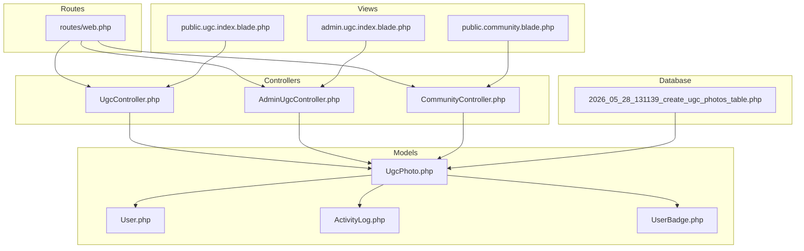
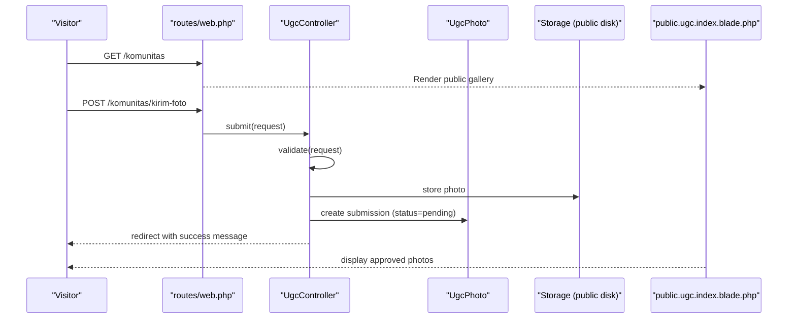
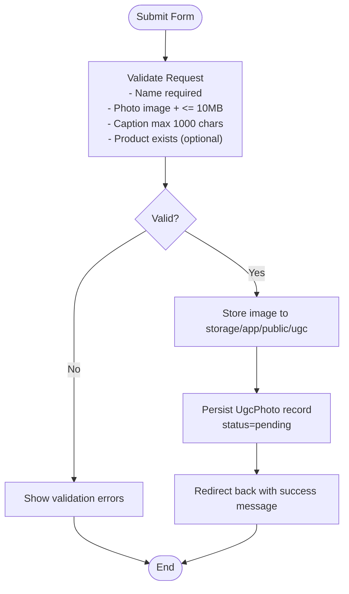
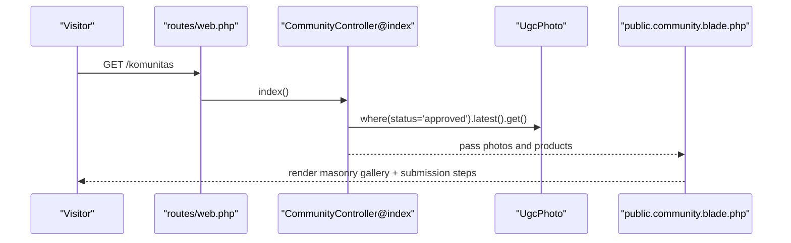
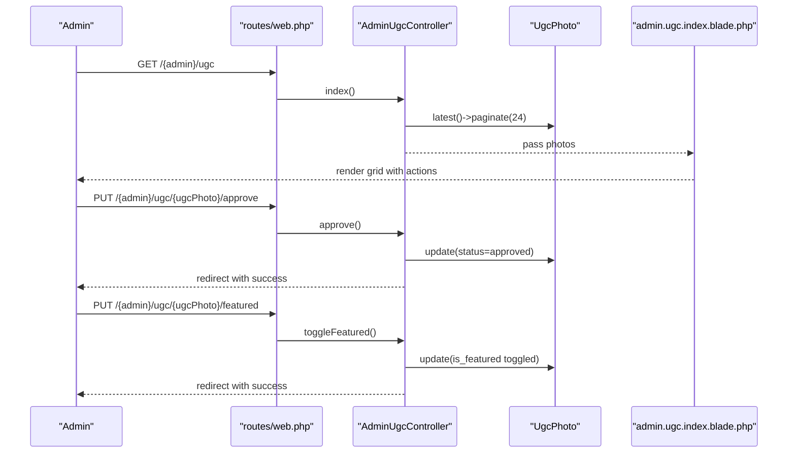
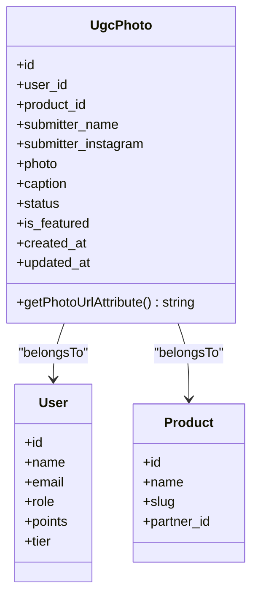
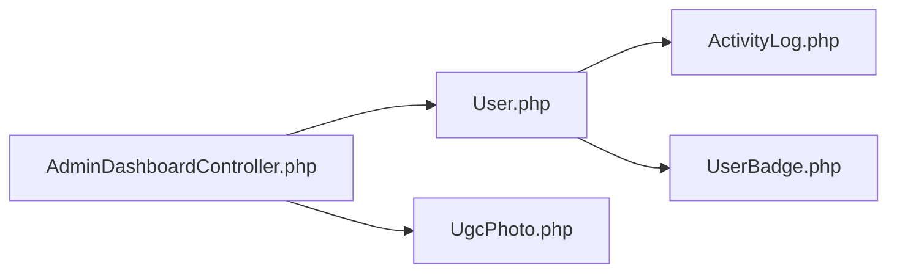
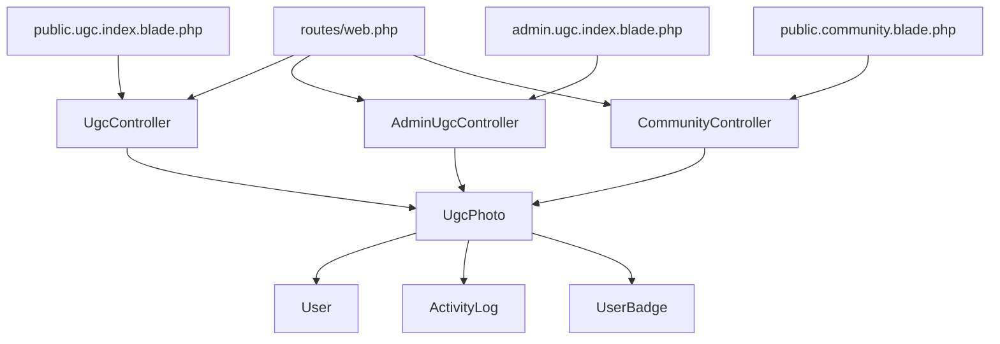

# User-Generated Content (UGC)

<cite>
**Referenced Files in This Document**
- [UgcController.php](file://app/Http/Controllers/UgcController.php)
- [AdminUgcController.php](file://app/Http/controllers/AdminUgcController.php)
- [UgcPhoto.php](file://app/Models/UgcPhoto.php)
- [2026_05_28_131139_create_ugc_photos_table.php](file://database/migrations/2026_05_28_131139_create_ugc_photos_table.php)
- [public.ugc.index.blade.php](file://resources/views/public/ugc/index.blade.php)
- [admin.ugc.index.blade.php](file://resources/views/admin/ugc/index.blade.php)
- [web.php](file://routes/web.php)
- [CommunityController.php](file://app/Http/Controllers/CommunityController.php)
- [User.php](file://app/Models/User.php)
- [ActivityLog.php](file://app/Models/ActivityLog.php)
- [UserBadge.php](file://app/Models/UserBadge.php)
- [AdminDashboardController.php](file://app/Http/Controllers/AdminDashboardController.php)
- [public.community.blade.php](file://resources/views/public/community.blade.php)
</cite>

## Table of Contents
1. [Introduction](#introduction)
2. [Project Structure](#project-structure)
3. [Core Components](#core-components)
4. [Architecture Overview](#architecture-overview)
5. [Detailed Component Analysis](#detailed-component-analysis)
6. [Dependency Analysis](#dependency-analysis)
7. [Performance Considerations](#performance-considerations)
8. [Troubleshooting Guide](#troubleshooting-guide)
9. [Conclusion](#conclusion)
10. [Appendices](#appendices)

## Introduction
This document describes KatalogThrift’s User-Generated Content (UGC) system with a focus on photo submissions, moderation, approvals, and public display. It also covers the admin moderation interface, content validation rules, file upload restrictions, and the integration of gamification and analytics. The UGC workflow spans three primary areas:
- Submission by users via a public form
- Moderation and approval by administrators
- Public gallery display and optional “Featured” promotion

## Project Structure
The UGC system is implemented across controllers, models, views, routes, and supporting domain models. The following diagram maps the main components and their relationships.

**Diagram sources**
- [web.php](file://routes/web.php)
- [UgcController.php](file://app/Http/Controllers/UgcController.php)
- [AdminUgcController.php](file://app/Http/Controllers/AdminUgcController.php)
- [CommunityController.php](file://app/Http/Controllers/CommunityController.php)
- [UgcPhoto.php](file://app/Models/UgcPhoto.php)
- [User.php](file://app/Models/User.php)
- [ActivityLog.php](file://app/Models/ActivityLog.php)
- [UserBadge.php](file://app/Models/UserBadge.php)
- [public.ugc.index.blade.php](file://resources/views/public/ugc/index.blade.php)
- [admin.ugc.index.blade.php](file://resources/views/admin/ugc/index.blade.php)
- [public.community.blade.php](file://resources/views/public/community.blade.php)
- [2026_05_28_131139_create_ugc_photos_table.php](file://database/migrations/2026_05_28_131139_create_ugc_photos_table.php)

**Section sources**
- [web.php](file://routes/web.php)
- [UgcController.php](file://app/Http/Controllers/UgcController.php)
- [AdminUgcController.php](file://app/Http/Controllers/AdminUgcController.php)
- [CommunityController.php](file://app/Http/Controllers/CommunityController.php)
- [UgcPhoto.php](file://app/Models/UgcPhoto.php)
- [User.php](file://app/Models/User.php)
- [ActivityLog.php](file://app/Models/ActivityLog.php)
- [UserBadge.php](file://app/Models/UserBadge.php)
- [public.ugc.index.blade.php](file://resources/views/public/ugc/index.blade.php)
- [admin.ugc.index.blade.php](file://resources/views/admin/ugc/index.blade.php)
- [public.community.blade.php](file://resources/views/public/community.blade.php)
- [2026_05_28_131139_create_ugc_photos_table.php](file://database/migrations/2026_05_28_131139_create_ugc_photos_table.php)

## Core Components
- UgcController: Handles public UGC photo submission and public gallery display.
- AdminUgcController: Provides admin moderation actions (approve, reject, toggle featured, delete).
- UgcPhoto model: Stores submission metadata, status, and computed photo URL.
- Routes: Define submission endpoint and admin moderation endpoints.
- Views: Public gallery and submission form; admin moderation grid.
- CommunityController: Supplies approved UGC for the community page and product suggestions.
- User model: Supports gamification and tier mechanics; integrates with activity logs.
- ActivityLog and UserBadge: Track user contributions and badges.

**Section sources**
- [UgcController.php](file://app/Http/Controllers/UgcController.php)
- [AdminUgcController.php](file://app/Http/Controllers/AdminUgcController.php)
- [UgcPhoto.php](file://app/Models/UgcPhoto.php)
- [web.php](file://routes/web.php)
- [public.ugc.index.blade.php](file://resources/views/public/ugc/index.blade.php)
- [admin.ugc.index.blade.php](file://resources/views/admin/ugc/index.blade.php)
- [CommunityController.php](file://app/Http/Controllers/CommunityController.php)
- [User.php](file://app/Models/User.php)
- [ActivityLog.php](file://app/Models/ActivityLog.php)
- [UserBadge.php](file://app/Models/UserBadge.php)

## Architecture Overview
The UGC system follows a straightforward request-response pattern with validation, persistence, moderation, and rendering.

**Diagram sources**
- [web.php](file://routes/web.php)
- [UgcController.php](file://app/Http/Controllers/UgcController.php)
- [UgcPhoto.php](file://app/Models/UgcPhoto.php)
- [public.ugc.index.blade.php](file://resources/views/public/ugc/index.blade.php)

## Detailed Component Analysis

### Submission Workflow (Public)
- Endpoint: POST /komunitas/kirim-foto mapped to UgcController@submit
- Validation rules enforce:
  - Submitter name required
  - Optional Instagram handle
  - Photo required, must be an image, max 10MB
  - Optional caption, max 1000 characters
  - Optional product association (must exist in products table)
- Persistence:
  - Photo stored under storage/app/public/ugc with a unique path
  - UgcPhoto record created with status pending and optional associations
- Feedback:
  - Success message shown on the public gallery after redirect

**Diagram sources**
- [UgcController.php](file://app/Http/Controllers/UgcController.php)
- [public.ugc.index.blade.php](file://resources/views/public/ugc/index.blade.php)

**Section sources**
- [UgcController.php](file://app/Http/Controllers/UgcController.php)
- [public.ugc.index.blade.php](file://resources/views/public/ugc/index.blade.php)
- [web.php](file://routes/web.php)

### Public Gallery Display
- Endpoint: GET /komunitas renders CommunityController@index
- Approved UGC retrieval:
  - UgcPhoto with product relations
  - Status approved and latest order
- Rendering:
  - Masonry layout with author, optional Instagram, optional caption, and product link
- Submission panel:
  - Same form as public.ugc.index.blade.php for convenience

**Diagram sources**
- [web.php](file://routes/web.php)
- [CommunityController.php](file://app/Http/Controllers/CommunityController.php)
- [public.community.blade.php](file://resources/views/public/community.blade.php)

**Section sources**
- [CommunityController.php](file://app/Http/Controllers/CommunityController.php)
- [public.community.blade.php](file://resources/views/public/community.blade.php)
- [web.php](file://routes/web.php)

### Admin Moderation Interface
- Endpoint: GET /{admin}/ugc renders admin.ugc.index.blade.php
- Actions:
  - Approve: sets status to approved
  - Reject: sets status to rejected
  - Toggle Featured: flips is_featured flag
  - Delete: removes the submission
- Pagination: 24 items per page
- Visual indicators: status badges and featured tag

**Diagram sources**
- [web.php](file://routes/web.php)
- [AdminUgcController.php](file://app/Http/Controllers/AdminUgcController.php)
- [admin.ugc.index.blade.php](file://resources/views/admin/ugc/index.blade.php)

**Section sources**
- [AdminUgcController.php](file://app/Http/Controllers/AdminUgcController.php)
- [admin.ugc.index.blade.php](file://resources/views/admin/ugc/index.blade.php)
- [web.php](file://routes/web.php)

### Data Model and Storage
- UgcPhoto fields:
  - user_id (nullable)
  - product_id (nullable)
  - submitter_name, submitter_instagram (nullable)
  - photo (stored path)
  - caption (nullable)
  - status (pending, approved, rejected)
  - is_featured (boolean)
  - timestamps
- Relationships:
  - Belongs to User and Product
  - Computed photo_url attribute resolves local storage URLs
- Migration defines foreign keys and constraints.

**Diagram sources**
- [UgcPhoto.php](file://app/Models/UgcPhoto.php)
- [User.php](file://app/Models/User.php)
- [2026_05_28_131139_create_ugc_photos_table.php](file://database/migrations/2026_05_28_131139_create_ugc_photos_table.php)

**Section sources**
- [UgcPhoto.php](file://app/Models/UgcPhoto.php)
- [2026_05_28_131139_create_ugc_photos_table.php](file://database/migrations/2026_05_28_131139_create_ugc_photos_table.php)

### Gamification, Reputation, and Analytics
- User model enhancements:
  - Points accumulation and tier progression
  - Activity log creation for actions (e.g., UGC submission)
- User badges:
  - Badges table tracks earned badges per user
- Admin analytics:
  - Pending UGC count on admin dashboard
  - Member tier distribution and top partners/products

**Diagram sources**
- [User.php](file://app/Models/User.php)
- [ActivityLog.php](file://app/Models/ActivityLog.php)
- [UserBadge.php](file://app/Models/UserBadge.php)
- [AdminDashboardController.php](file://app/Http/Controllers/AdminDashboardController.php)

**Section sources**
- [User.php](file://app/Models/User.php)
- [ActivityLog.php](file://app/Models/ActivityLog.php)
- [UserBadge.php](file://app/Models/UserBadge.php)
- [AdminDashboardController.php](file://app/Http/Controllers/AdminDashboardController.php)

## Dependency Analysis
- Controllers depend on UgcPhoto model and illuminate requests/responses.
- Views depend on controller-provided data and route helpers.
- Routes bind endpoints to controllers.
- Admin moderation depends on admin middleware and pagination.
- Public gallery depends on approved status filter.

**Diagram sources**
- [web.php](file://routes/web.php)
- [UgcController.php](file://app/Http/Controllers/UgcController.php)
- [AdminUgcController.php](file://app/Http/Controllers/AdminUgcController.php)
- [CommunityController.php](file://app/Http/Controllers/CommunityController.php)
- [UgcPhoto.php](file://app/Models/UgcPhoto.php)
- [User.php](file://app/Models/User.php)
- [ActivityLog.php](file://app/Models/ActivityLog.php)
- [UserBadge.php](file://app/Models/UserBadge.php)
- [public.ugc.index.blade.php](file://resources/views/public/ugc/index.blade.php)
- [admin.ugc.index.blade.php](file://resources/views/admin/ugc/index.blade.php)
- [public.community.blade.php](file://resources/views/public/community.blade.php)

**Section sources**
- [web.php](file://routes/web.php)
- [UgcController.php](file://app/Http/Controllers/UgcController.php)
- [AdminUgcController.php](file://app/Http/Controllers/AdminUgcController.php)
- [CommunityController.php](file://app/Http/Controllers/CommunityController.php)
- [UgcPhoto.php](file://app/Models/UgcPhoto.php)
- [User.php](file://app/Models/User.php)
- [ActivityLog.php](file://app/Models/ActivityLog.php)
- [UserBadge.php](file://app/Models/UserBadge.php)
- [public.ugc.index.blade.php](file://resources/views/public/ugc/index.blade.php)
- [admin.ugc.index.blade.php](file://resources/views/admin/ugc/index.blade.php)
- [public.community.blade.php](file://resources/views/public/community.blade.php)

## Performance Considerations
- Image size limit: 10MB to reduce storage and bandwidth costs.
- Pagination: Admin grid paginates 24 items; public galleries paginate as needed.
- Lazy loading: Views mark images with lazy loading attributes.
- Foreign keys: Database constraints ensure referential integrity for user/product associations.

[No sources needed since this section provides general guidance]

## Troubleshooting Guide
Common issues and resolutions:
- Validation failures on submission:
  - Ensure the photo is an image and under 10MB.
  - Confirm required fields meet length limits.
- No photos appear in public gallery:
  - Photos must be approved; pending/rejected photos are excluded.
- Admin actions not applying:
  - Verify admin authentication and CSRF tokens in forms.
- Storage path resolution:
  - The computed photo URL handles local storage paths automatically.

**Section sources**
- [UgcController.php](file://app/Http/Controllers/UgcController.php)
- [UgcPhoto.php](file://app/Models/UgcPhoto.php)
- [admin.ugc.index.blade.php](file://resources/views/admin/ugc/index.blade.php)
- [public.ugc.index.blade.php](file://resources/views/public/ugc/index.blade.php)

## Conclusion
KatalogThrift’s UGC system provides a clear submission-to-publication pipeline with robust moderation controls. Administrators can efficiently manage submissions, promote standout content, and maintain quality standards. Users benefit from a straightforward submission process and visibility in the community gallery. The system’s foundation supports future enhancements such as automated filtering, advanced analytics, and expanded gamification features.

[No sources needed since this section summarizes without analyzing specific files]

## Appendices

### Submission Form Fields and Restrictions
- Required:
  - Submitter name
  - Photo (image, <= 10MB)
- Optional:
  - Instagram handle
  - Caption (<= 1000 characters)
  - Associated product (must exist)

**Section sources**
- [UgcController.php](file://app/Http/Controllers/UgcController.php)
- [public.community.blade.php](file://resources/views/public/community.blade.php)
- [public.ugc.index.blade.php](file://resources/views/public/ugc/index.blade.php)

### Admin Moderation Controls
- Approve: Publishes to public gallery
- Reject: Removes from consideration
- Toggle Featured: Promotes to landing/community highlights
- Delete: Permanently removes submission

**Section sources**
- [AdminUgcController.php](file://app/Http/Controllers/AdminUgcController.php)
- [admin.ugc.index.blade.php](file://resources/views/admin/ugc/index.blade.php)

### Public Gallery Display Details
- Approved-only, latest-first
- Includes author, optional Instagram, optional caption, and product link
- Responsive masonry layout

**Section sources**
- [UgcController.php](file://app/Http/Controllers/UgcController.php)
- [public.ugc.index.blade.php](file://resources/views/public/ugc/index.blade.php)
- [public.community.blade.php](file://resources/views/public/community.blade.php)

### Gamification and Analytics References
- User points and tiers tracked via User model methods
- Activity logs created for UGC submissions
- Admin dashboard shows pending UGC counts

**Section sources**
- [User.php](file://app/Models/User.php)
- [ActivityLog.php](file://app/Models/ActivityLog.php)
- [AdminDashboardController.php](file://app/Http/Controllers/AdminDashboardController.php)