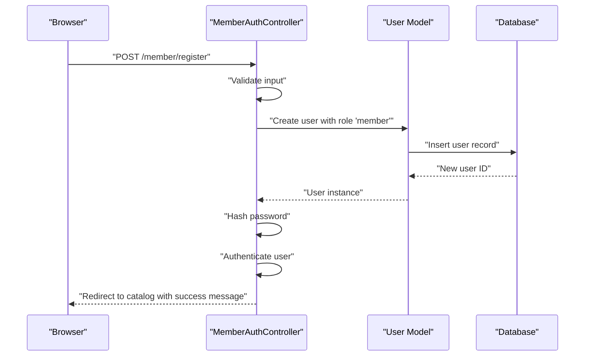
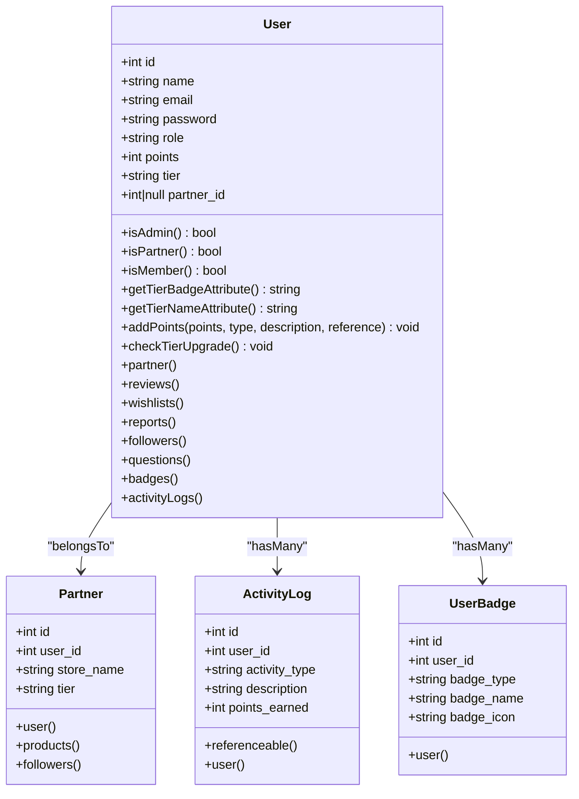
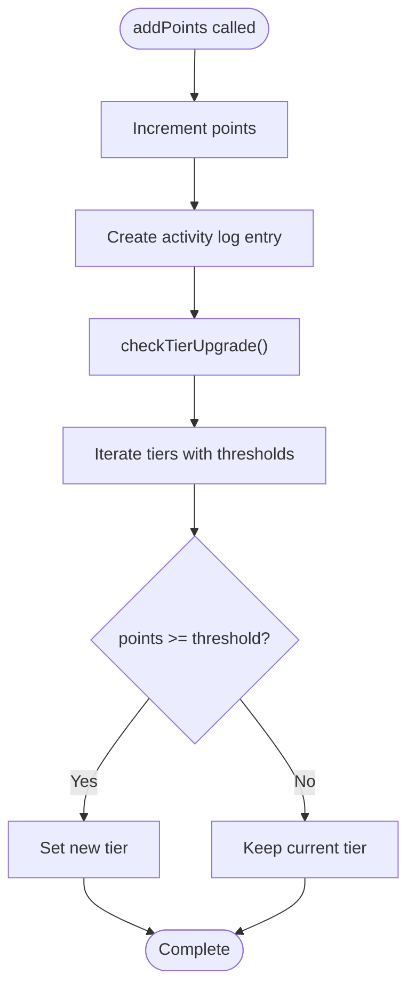
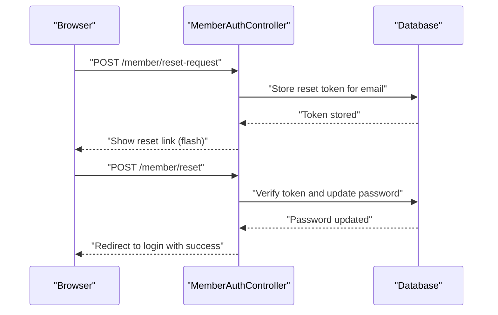
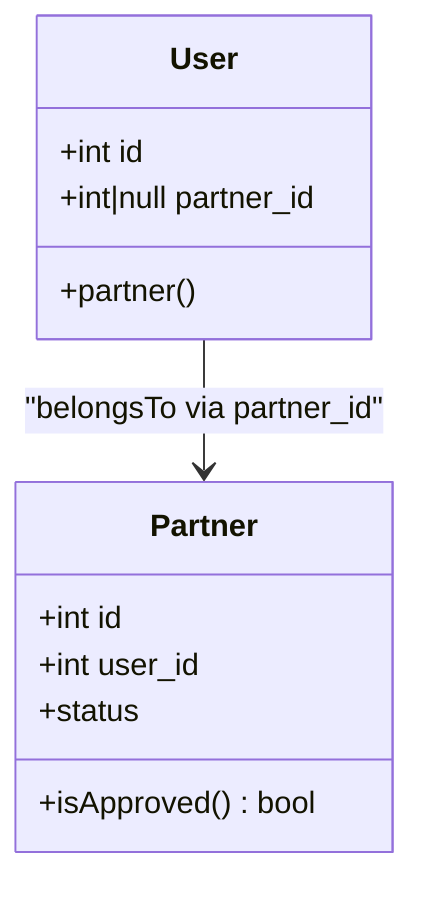
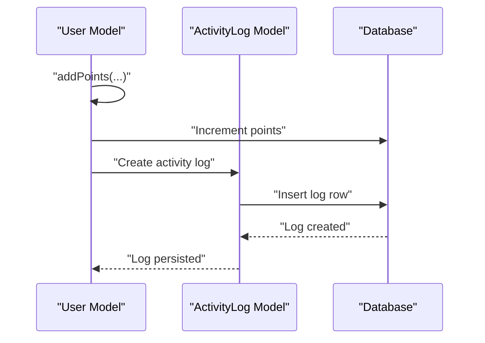
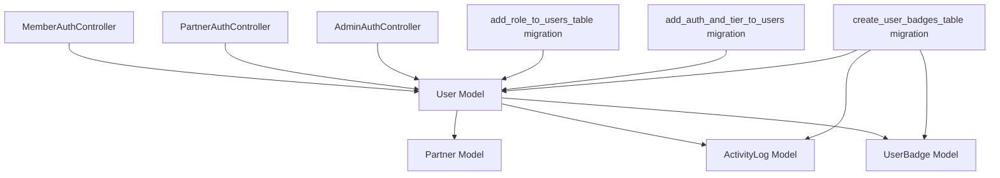

# Core User Model

<cite>
**Referenced Files in This Document**
- [User.php](file://app/Models/User.php)
- [Partner.php](file://app/Models/Partner.php)
- [ActivityLog.php](file://app/Models/ActivityLog.php)
- [UserBadge.php](file://app/Models/UserBadge.php)
- [MemberAuthController.php](file://app/Http/Controllers/Member/MemberAuthController.php)
- [PartnerAuthController.php](file://app/Http/Controllers/Partner/PartnerAuthController.php)
- [AdminAuthController.php](file://app/Http/Controllers/AdminAuthController.php)
- [2014_10_12_000000_create_users_table.php](file://database/migrations/2014_10_12_000000_create_users_table.php)
- [2026_05_24_093026_add_role_to_users_table.php](file://database/migrations/2026_05_24_093026_add_role_to_users_table.php)
- [2026_07_01_100000_add_auth_and_tier_to_users.php](file://database/migrations/2026_07_01_100000_add_auth_and_tier_to_users.php)
- [2026_07_01_100006_create_user_badges_table.php](file://database/migrations/2026_07_01_100006_create_user_badges_table.php)
- [2014_10_12_100000_create_password_reset_tokens_table.php](file://database/migrations/2014_10_12_100000_create_password_reset_tokens_table.php)
- [UserFactory.php](file://database/factories/UserFactory.php)
- [badges.blade.php](file://resources/views/member/badges.blade.php)
- [profile.blade.php](file://resources/views/member/profile.blade.php)
</cite>

## Table of Contents
1. [Introduction](#introduction)
2. [Project Structure](#project-structure)
3. [Core Components](#core-components)
4. [Architecture Overview](#architecture-overview)
5. [Detailed Component Analysis](#detailed-component-analysis)
6. [Dependency Analysis](#dependency-analysis)
7. [Performance Considerations](#performance-considerations)
8. [Troubleshooting Guide](#troubleshooting-guide)
9. [Conclusion](#conclusion)

## Introduction
This document provides comprehensive documentation for the User model, which underpins KatalogThrift's multi-role authentication system. It covers role-based permissions (admin, partner, member), the gamification system (points and tier progression), authentication features, the relationship with the Partner model via foreign keys, password hashing, and email verification. It also explains role-based access control methods, the tier badge system with emoji representations, point accumulation logic, user registration workflows, automatic tier upgrades, and activity logging for audit trails.

## Project Structure
The User model resides in the application models layer and integrates with controllers, migrations, factories, and views to deliver a cohesive authentication and gamification experience. The following diagram maps the primary components involved in the User model ecosystem.

```mermaid
graph TB
subgraph "Models"
User["User Model<br/>app/Models/User.php"]
Partner["Partner Model<br/>app/Models/Partner.php"]
ActivityLog["ActivityLog Model<br/>app/Models/ActivityLog.php"]
UserBadge["UserBadge Model<br/>app/Models/UserBadge.php"]
end
subgraph "Controllers"
MemberAuth["MemberAuthController<br/>app/Http/Controllers/Member/MemberAuthController.php"]
PartnerAuth["PartnerAuthController<br/>app/Http/Controllers/Partner/PartnerAuthController.php"]
AdminAuth["AdminAuthController<br/>app/Http/Controllers/AdminAuthController.php"]
end
subgraph "Migrations"
MIG_CreateUsers["create_users_table<br/>database/migrations/2014_10_12_000000_create_users_table.php"]
MIG_AddRole["add_role_to_users_table<br/>database/migrations/2026_05_24_093026_add_role_to_users_table.php"]
MIG_AddAuthTier["add_auth_and_tier_to_users<br/>database/migrations/2026_07_01_100000_add_auth_and_tier_to_users.php"]
MIG_UserBadges["create_user_badges_table<br/>database/migrations/2026_07_01_100006_create_user_badges_table.php"]
MIG_PasswordReset["create_password_reset_tokens_table<br/>database/migrations/2014_10_12_100000_create_password_reset_tokens_table.php"]
end
subgraph "Factories"
UserFactory["UserFactory<br/>database/factories/UserFactory.php"]
end
subgraph "Views"
BadgesView["member/badges.blade.php"]
ProfileView["member/profile.blade.php"]
end
MemberAuth --> User
PartnerAuth --> User
AdminAuth --> User
User --> Partner
User --> ActivityLog
User --> UserBadge
UserFactory --> User
MIG_CreateUsers --> User
MIG_AddRole --> User
MIG_AddAuthTier --> User
MIG_UserBadges --> User
MIG_UserBadges --> ActivityLog
MIG_UserBadges --> UserBadge
BadgesView --> User
ProfileView --> User
```

**Diagram sources**
- [User.php:10-131](file://app/Models/User.php#L10-L131)
- [Partner.php:8-123](file://app/Models/Partner.php#L8-L123)
- [ActivityLog.php:6-23](file://app/Models/ActivityLog.php#L6-L23)
- [UserBadge.php:6-18](file://app/Models/UserBadge.php#L6-L18)
- [MemberAuthController.php:15-129](file://app/Http/Controllers/Member/MemberAuthController.php#L15-L129)
- [PartnerAuthController.php:11-60](file://app/Http/Controllers/Partner/PartnerAuthController.php#L11-L60)
- [AdminAuthController.php:9-54](file://app/Http/Controllers/AdminAuthController.php#L9-L54)
- [2014_10_12_000000_create_users_table.php:14-22](file://database/migrations/2014_10_12_000000_create_users_table.php#L14-L22)
- [2026_05_24_093026_add_role_to_users_table.php:11-14](file://database/migrations/2026_05_24_093026_add_role_to_users_table.php#L11-L14)
- [2026_07_01_100000_add_auth_and_tier_to_users.php:11-17](file://database/migrations/2026_07_01_100000_add_auth_and_tier_to_users.php#L11-L17)
- [2026_07_01_100006_create_user_badges_table.php:10-33](file://database/migrations/2026_07_01_100006_create_user_badges_table.php#L10-L33)
- [2014_10_12_100000_create_password_reset_tokens_table.php:14-17](file://database/migrations/2014_10_12_100000_create_password_reset_tokens_table.php#L14-L17)
- [UserFactory.php:24-44](file://database/factories/UserFactory.php#L24-L44)
- [badges.blade.php:51-73](file://resources/views/member/badges.blade.php#L51-L73)
- [profile.blade.php:54-61](file://resources/views/member/profile.blade.php#L54-L61)

**Section sources**
- [User.php:10-131](file://app/Models/User.php#L10-L131)
- [Partner.php:8-123](file://app/Models/Partner.php#L8-L123)
- [ActivityLog.php:6-23](file://app/Models/ActivityLog.php#L6-L23)
- [UserBadge.php:6-18](file://app/Models/UserBadge.php#L6-L18)
- [MemberAuthController.php:15-129](file://app/Http/Controllers/Member/MemberAuthController.php#L15-L129)
- [PartnerAuthController.php:11-60](file://app/Http/Controllers/Partner/PartnerAuthController.php#L11-L60)
- [AdminAuthController.php:9-54](file://app/Http/Controllers/AdminAuthController.php#L9-L54)
- [2014_10_12_000000_create_users_table.php:14-22](file://database/migrations/2014_10_12_000000_create_users_table.php#L14-L22)
- [2026_05_24_093026_add_role_to_users_table.php:11-14](file://database/migrations/2026_05_24_093026_add_role_to_users_table.php#L11-L14)
- [2026_07_01_100000_add_auth_and_tier_to_users.php:11-17](file://database/migrations/2026_07_01_100000_add_auth_and_tier_to_users.php#L11-L17)
- [2026_07_01_100006_create_user_badges_table.php:10-33](file://database/migrations/2026_07_01_100006_create_user_badges_table.php#L10-L33)
- [2014_10_12_100000_create_password_reset_tokens_table.php:14-17](file://database/migrations/2014_10_12_100000_create_password_reset_tokens_table.php#L14-L17)
- [UserFactory.php:24-44](file://database/factories/UserFactory.php#L24-L44)
- [badges.blade.php:51-73](file://resources/views/member/badges.blade.php#L51-L73)
- [profile.blade.php:54-61](file://resources/views/member/profile.blade.php#L54-L61)

## Core Components
- Role-based permissions: The User model defines three roles—admin, partner, and member—enabling role-based access control through dedicated methods.
- Gamification system: Users accumulate points and progress through tiers (regular, silver, gold, platinum) with emoji-based tier badges and names.
- Authentication features: Password hashing, email verification, and password reset token management are integrated into the User model and supporting controllers.
- Partner relationship: Users can be linked to a Partner record via a nullable foreign key, enabling partner-specific workflows.
- Activity logging: Every point-earning action creates an activity log entry for auditability and reporting.

Key implementation highlights:
- Roles: Accessor methods for role checks and a migration adding the role column and partner_id foreign key.
- Gamification: Point accumulation and automatic tier upgrade logic with a predefined threshold mapping.
- Authentication: Registration controller assigns the member role, hashing passwords, and managing password resets.
- Partner linkage: Eloquent relationship and controller logic validating partner accounts and statuses.
- Activity logging: Centralized creation of activity logs with polymorphic reference support.

**Section sources**
- [User.php:68-81](file://app/Models/User.php#L68-L81)
- [User.php:105-129](file://app/Models/User.php#L105-L129)
- [2026_05_24_093026_add_role_to_users_table.php:11-14](file://database/migrations/2026_05_24_093026_add_role_to_users_table.php#L11-L14)
- [MemberAuthController.php:44-63](file://app/Http/Controllers/Member/MemberAuthController.php#L44-L63)
- [2014_10_12_100000_create_password_reset_tokens_table.php:14-17](file://database/migrations/2014_10_12_100000_create_password_reset_tokens_table.php#L14-L17)

## Architecture Overview
The User model orchestrates multi-role authentication and gamification. It collaborates with Partner for partner-specific operations, ActivityLog for audit trails, and controllers for authentication flows. The following sequence diagram illustrates the user registration workflow and role assignment.

**Diagram sources**
- [MemberAuthController.php:44-63](file://app/Http/Controllers/Member/MemberAuthController.php#L44-L63)
- [User.php:14-17](file://app/Models/User.php#L14-L17)

**Section sources**
- [MemberAuthController.php:44-63](file://app/Http/Controllers/Member/MemberAuthController.php#L44-L63)
- [User.php:14-17](file://app/Models/User.php#L14-L17)

## Detailed Component Analysis

### User Model
The User model extends the framework’s base authenticatable class and incorporates Sanctum tokens, factory generation, and notifications. It defines fillable attributes, hidden fields, and attribute casts for secure and predictable behavior.

Key capabilities:
- Role-based access control:
  - isAdmin: checks if role equals admin
  - isPartner: checks if role equals partner
  - isMember: checks if role equals member
- Tier badge and name helpers:
  - getTierBadgeAttribute: returns emoji based on tier
  - getTierNameAttribute: returns human-readable tier name
- Gamification:
  - addPoints: increments points, logs activity, and triggers tier upgrade
  - checkTierUpgrade: evaluates points against thresholds and updates tier if needed
- Relationships:
  - partner: belongs to Partner
  - reviews, wishlists, reports, followers, questions: hasMany related models
  - badges: hasMany UserBadge
  - activityLogs: hasMany ActivityLog

**Diagram sources**
- [User.php:14-131](file://app/Models/User.php#L14-L131)
- [Partner.php:28-31](file://app/Models/Partner.php#L28-L31)
- [ActivityLog.php:13-21](file://app/Models/ActivityLog.php#L13-L21)
- [UserBadge.php:13-16](file://app/Models/UserBadge.php#L13-L16)

**Section sources**
- [User.php:14-131](file://app/Models/User.php#L14-L131)

### Role-Based Access Control Methods
The User model exposes three simple boolean methods to determine the user’s role:
- isAdmin: returns true when role equals admin
- isPartner: returns true when role equals partner
- isMember: returns true when role equals member

These methods enable middleware and controllers to enforce role-based restrictions across the application.

**Section sources**
- [User.php:68-81](file://app/Models/User.php#L68-L81)

### Tier Badge System and Emoji Representation
The User model provides two helpful attributes for displaying tier information:
- getTierBadgeAttribute: maps tier values to emojis (platinum → 💎, gold → 🥇, silver → 🥈, default → 🥉)
- getTierNameAttribute: maps tier values to readable names (platinum → Platinum, gold → Gold, silver → Silver, default → Regular)

These attributes are consumed by frontend views to render user tier prominently.

**Section sources**
- [User.php:84-102](file://app/Models/User.php#L84-L102)
- [badges.blade.php:54-56](file://resources/views/member/badges.blade.php#L54-L56)

### Point Accumulation and Automatic Tier Upgrades
Point accumulation is handled by the addPoints method, which:
- Increments the user’s points by the specified amount
- Creates an activity log entry with metadata (type, description, points earned, and optional reference)
- Triggers checkTierUpgrade to evaluate whether the user qualifies for a higher tier

checkTierUpgrade uses a predefined mapping of minimum points per tier and updates the user’s tier if the current points exceed the threshold for a higher tier.

**Diagram sources**
- [User.php:105-129](file://app/Models/User.php#L105-L129)

**Section sources**
- [User.php:105-129](file://app/Models/User.php#L105-L129)

### Authentication Features
- Password hashing: During registration, passwords are hashed before storage.
- Email verification: The users table includes an email_verified_at field for verification timestamps.
- Password reset: A dedicated token table stores reset tokens, validated before allowing password changes.

**Diagram sources**
- [MemberAuthController.php:81-95](file://app/Http/Controllers/Member/MemberAuthController.php#L81-L95)
- [MemberAuthController.php:106-127](file://app/Http/Controllers/Member/MemberAuthController.php#L106-L127)
- [2014_10_12_100000_create_password_reset_tokens_table.php:14-17](file://database/migrations/2014_10_12_100000_create_password_reset_tokens_table.php#L14-L17)

**Section sources**
- [MemberAuthController.php:44-63](file://app/Http/Controllers/Member/MemberAuthController.php#L44-L63)
- [MemberAuthController.php:81-95](file://app/Http/Controllers/Member/MemberAuthController.php#L81-L95)
- [MemberAuthController.php:106-127](file://app/Http/Controllers/Member/MemberAuthController.php#L106-L127)
- [2014_10_12_000000_create_users_table.php:18-18](file://database/migrations/2014_10_12_000000_create_users_table.php#L18-L18)
- [2014_10_12_100000_create_password_reset_tokens_table.php:14-17](file://database/migrations/2014_10_12_100000_create_password_reset_tokens_table.php#L14-L17)

### Relationship with Partner Model
The User model belongs to a Partner via a foreign key (partner_id). This enables partner-specific operations and validations, such as ensuring the associated Partner account is approved before granting access.

**Diagram sources**
- [User.php:28-31](file://app/Models/User.php#L28-L31)
- [Partner.php:72-80](file://app/Models/Partner.php#L72-L80)

**Section sources**
- [User.php:28-31](file://app/Models/User.php#L28-L31)
- [PartnerAuthController.php:29-43](file://app/Http/Controllers/Partner/PartnerAuthController.php#L29-L43)

### Activity Logging Integration
Every point-earning action creates an ActivityLog entry with:
- user_id
- activity_type
- description
- points_earned
- referenceable_id and referenceable_type (polymorphic)

This supports audit trails and reporting of user activities.

**Diagram sources**
- [User.php:108-116](file://app/Models/User.php#L108-L116)
- [ActivityLog.php:8-11](file://app/Models/ActivityLog.php#L8-L11)

**Section sources**
- [User.php:108-116](file://app/Models/User.php#L108-L116)
- [ActivityLog.php:8-11](file://app/Models/ActivityLog.php#L8-L11)

### Frontend Integration
The frontend renders user tier, points, and recent activity logs. The badges page displays:
- Tier card with emoji badge and points
- Progress bar indicating proximity to the next tier
- List of earned badges
- Recent activity log entries

The profile page shows user details including tier and points.

**Section sources**
- [badges.blade.php:51-73](file://resources/views/member/badges.blade.php#L51-L73)
- [badges.blade.php:90-103](file://resources/views/member/badges.blade.php#L90-L103)
- [profile.blade.php:54-61](file://resources/views/member/profile.blade.php#L54-L61)

## Dependency Analysis
The User model depends on several supporting components:
- Partner: for partner-specific operations and validations
- ActivityLog: for audit trails and reporting
- UserBadge: for gamified achievements
- MemberAuthController: for registration and authentication flows
- PartnerAuthController: for partner login and validation
- AdminAuthController: for administrative access
- Migrations: define schema for roles, authentication fields, and gamification attributes
- Factories: provide seeded user data for development and testing

**Diagram sources**
- [User.php:14-131](file://app/Models/User.php#L14-L131)
- [Partner.php:8-123](file://app/Models/Partner.php#L8-L123)
- [ActivityLog.php:6-23](file://app/Models/ActivityLog.php#L6-L23)
- [UserBadge.php:6-18](file://app/Models/UserBadge.php#L6-L18)
- [MemberAuthController.php:15-129](file://app/Http/Controllers/Member/MemberAuthController.php#L15-L129)
- [PartnerAuthController.php:11-60](file://app/Http/Controllers/Partner/PartnerAuthController.php#L11-L60)
- [AdminAuthController.php:9-54](file://app/Http/Controllers/AdminAuthController.php#L9-L54)
- [2026_05_24_093026_add_role_to_users_table.php:11-14](file://database/migrations/2026_05_24_093026_add_role_to_users_table.php#L11-L14)
- [2026_07_01_100000_add_auth_and_tier_to_users.php:11-17](file://database/migrations/2026_07_01_100000_add_auth_and_tier_to_users.php#L11-L17)
- [2026_07_01_100006_create_user_badges_table.php:10-33](file://database/migrations/2026_07_01_100006_create_user_badges_table.php#L10-L33)

**Section sources**
- [User.php:14-131](file://app/Models/User.php#L14-L131)
- [Partner.php:8-123](file://app/Models/Partner.php#L8-L123)
- [ActivityLog.php:6-23](file://app/Models/ActivityLog.php#L6-L23)
- [UserBadge.php:6-18](file://app/Models/UserBadge.php#L6-L18)
- [MemberAuthController.php:15-129](file://app/Http/Controllers/Member/MemberAuthController.php#L15-L129)
- [PartnerAuthController.php:11-60](file://app/Http/Controllers/Partner/PartnerAuthController.php#L11-L60)
- [AdminAuthController.php:9-54](file://app/Http/Controllers/AdminAuthController.php#L9-L54)
- [2026_05_24_093026_add_role_to_users_table.php:11-14](file://database/migrations/2026_05_24_093026_add_role_to_users_table.php#L11-L14)
- [2026_07_01_100000_add_auth_and_tier_to_users.php:11-17](file://database/migrations/2026_07_01_100000_add_auth_and_tier_to_users.php#L11-L17)
- [2026_07_01_100006_create_user_badges_table.php:10-33](file://database/migrations/2026_07_01_100006_create_user_badges_table.php#L10-L33)

## Performance Considerations
- Point updates and tier checks: The addPoints method performs an increment operation followed by a single activity log insert and a linear scan over tier thresholds. This is efficient for typical workloads but consider caching tier thresholds or precomputing tier boundaries if scaling to very high write volumes.
- Polymorphic references: Using morphs in activity logs adds flexibility but may require careful indexing on large datasets. Ensure appropriate database indexes on referenceable_id/type for performance-sensitive queries.
- Password hashing: Hashing occurs during registration and password reset. Ensure server-side hashing is performed with strong algorithms and consider rate limiting for brute-force protection.

## Troubleshooting Guide
Common issues and resolutions:
- User registration fails validation:
  - Ensure name, email, and password meet validation rules and the email is unique.
  - Confirm the role defaults to member during registration.
- Partner login denied:
  - Verify the user has a valid Partner record and that the partner status is approved.
  - Check for pending, rejected, or suspended statuses and handle messages accordingly.
- Password reset errors:
  - Confirm the reset token exists and matches the hashed token stored in the password_reset_tokens table.
  - Ensure the email exists in the users table before attempting reset.
- Tier upgrade not triggered:
  - Verify points accumulation via addPoints and that thresholds are met for the next tier.
  - Confirm checkTierUpgrade runs after point addition.

**Section sources**
- [MemberAuthController.php:46-57](file://app/Http/Controllers/Member/MemberAuthController.php#L46-L57)
- [PartnerAuthController.php:29-43](file://app/Http/Controllers/Partner/PartnerAuthController.php#L29-L43)
- [MemberAuthController.php:106-127](file://app/Http/Controllers/Member/MemberAuthController.php#L106-L127)
- [User.php:105-129](file://app/Models/User.php#L105-L129)

## Conclusion
The User model is central to KatalogThrift’s multi-role authentication and gamification systems. It provides robust role checks, a tier badge system with emoji representation, and a reliable point accumulation mechanism with automatic tier upgrades. Through its relationships with Partner, ActivityLog, and UserBadge, and its integration with authentication controllers and migrations, it delivers a scalable foundation for user management, activity tracking, and engagement incentives.