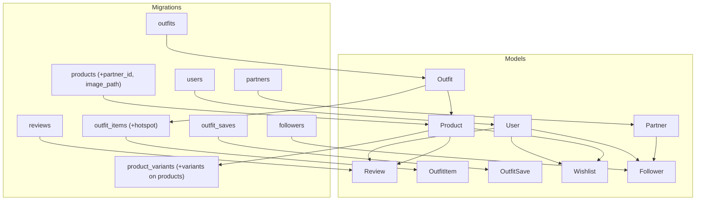
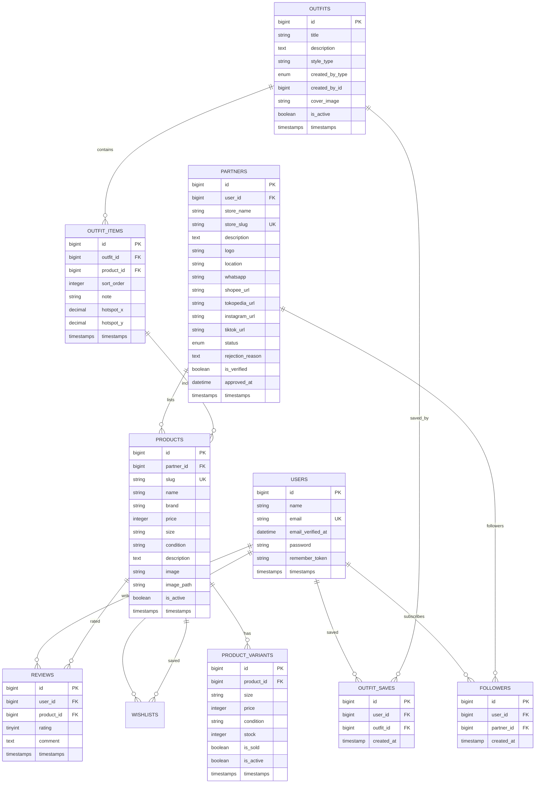
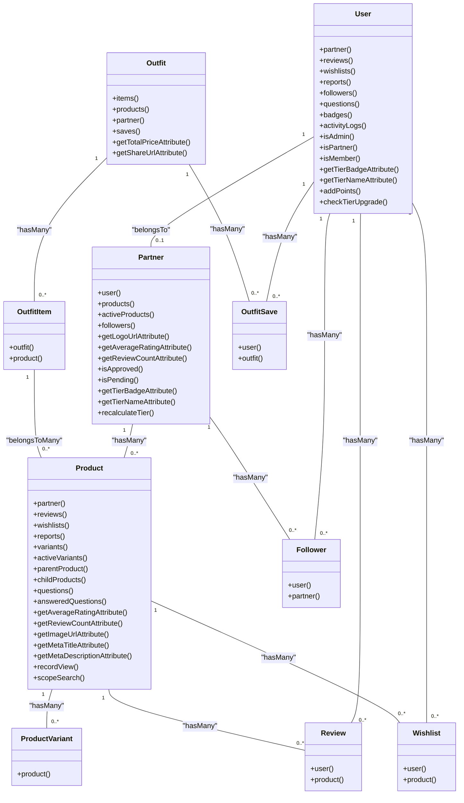

# Database Models and Data Schema

<cite>
**Referenced Files in This Document**
- [2014_10_12_000000_create_users_table.php](file://database/migrations/2014_10_12_000000_create_users_table.php)
- [2026_05_24_093205_create_partners_table.php](file://database/migrations/2026_05_24_093205_create_partners_table.php)
- [2026_05_24_093340_add_partner_id_to_products_table.php](file://database/migrations/2026_05_24_093340_add_partner_id_to_products_table.php)
- [2026_05_04_125734_create_products_table.php](file://database/migrations/2026_05_04_125734_create_products_table.php)
- [2026_07_01_100002_create_product_variants_table.php](file://database/migrations/2026_07_01_100002_create_product_variants_table.php)
- [2026_05_24_093454_create_reviews_table.php](file://database/migrations/2026_05_24_093454_create_reviews_table.php)
- [2026_05_24_093628_create_outfits_table.php](file://database/migrations/2026_05_24_093628_create_outfits_table.php)
- [2026_05_24_093802_create_outfit_items_table.php](file://database/migrations/2026_05_24_093802_create_outfit_items_table.php)
- [2026_05_25_013311_create_outfit_saves_table.php](file://database/migrations/2026_05_25_013311_create_outfit_saves_table.php)
- [2026_07_01_100003_create_followers_table.php](file://database/migrations/2026_07_01_100003_create_followers_table.php)
- [2026_05_28_131107_add_hotspot_to_outfit_items_table.php](file://database/migrations/2026_05_28_131107_add_hotspot_to_outfit_items_table.php)
- [2026_07_01_100001_add_tier_and_analytics_to_partners.php](file://database/migrations/2026_07_01_100001_add_tier_and_analytics_to_partners.php)
- [User.php](file://app/Models/User.php)
- [Partner.php](file://app/Models/Partner.php)
- [Product.php](file://app/Models/Product.php)
- [Review.php](file://app/Models/Review.php)
- [Wishlist.php](file://app/Models/Wishlist.php)
- [Follower.php](file://app/Models/Follower.php)
- [Outfit.php](file://app/Models/Outfit.php)
</cite>

## Table of Contents
1. [Introduction](#introduction)
2. [Project Structure](#project-structure)
3. [Core Components](#core-components)
4. [Architecture Overview](#architecture-overview)
5. [Detailed Component Analysis](#detailed-component-analysis)
6. [Dependency Analysis](#dependency-analysis)
7. [Performance Considerations](#performance-considerations)
8. [Troubleshooting Guide](#troubleshooting-guide)
9. [Conclusion](#conclusion)
10. [Appendices](#appendices)

## Introduction
This document provides comprehensive data model documentation for KatalogThrift’s database schema and Eloquent models. It focuses on the core entities Users, Products, Partners, Outfits, Reviews, Wishlists, and Followers, detailing table schemas, constraints, indexes, foreign keys, cascading behaviors, and referential integrity rules. It also documents model attributes, accessors/mutators, relationship methods, validation/business logic, and data lifecycle management. Diagrams illustrate entity relationships and data flow, while appendices include sample data examples, common query patterns, migration procedures, schema versioning, caching strategies, indexing recommendations, and database tuning best practices.

## Project Structure
The data model spans migrations under database/migrations and Eloquent models under app/Models. Migrations define tables, columns, data types, constraints, and foreign keys. Models encapsulate fillable attributes, casts, relationships, accessors/mutators, scopes, and business logic.

**Diagram sources**
- [2014_10_12_000000_create_users_table.php:14-22](file://database/migrations/2014_10_12_000000_create_users_table.php#L14-L22)
- [2026_05_24_093205_create_partners_table.php:11-30](file://database/migrations/2026_05_24_093205_create_partners_table.php#L11-L30)
- [2026_05_04_125734_create_products_table.php:14-26](file://database/migrations/2026_05_04_125734_create_products_table.php#L14-L26)
- [2026_05_24_093340_add_partner_id_to_products_table.php:11-15](file://database/migrations/2026_05_24_093340_add_partner_id_to_products_table.php#L11-L15)
- [2026_07_01_100002_create_product_variants_table.php:10-22](file://database/migrations/2026_07_01_100002_create_product_variants_table.php#L10-L22)
- [2026_05_24_093454_create_reviews_table.php:11-21](file://database/migrations/2026_05_24_093454_create_reviews_table.php#L11-L21)
- [2026_05_24_093628_create_outfits_table.php:11-21](file://database/migrations/2026_05_24_093628_create_outfits_table.php#L11-L21)
- [2026_05_24_093802_create_outfit_items_table.php:11-20](file://database/migrations/2026_05_24_093802_create_outfit_items_table.php#L11-L20)
- [2026_05_25_013311_create_outfit_saves_table.php:11-19](file://database/migrations/2026_05_25_013311_create_outfit_saves_table.php#L11-L19)
- [2026_07_01_100003_create_followers_table.php:10-18](file://database/migrations/2026_07_01_100003_create_followers_table.php#L10-L18)
- [2026_05_28_131107_add_hotspot_to_outfit_items_table.php:8-12](file://database/migrations/2026_05_28_131107_add_hotspot_to_outfit_items_table.php#L8-L12)
- [2026_07_01_100001_add_tier_and_analytics_to_partners.php:10-16](file://database/migrations/2026_07_01_100001_add_tier_and_analytics_to_partners.php#L10-L16)

**Section sources**
- [2014_10_12_000000_create_users_table.php:14-22](file://database/migrations/2014_10_12_000000_create_users_table.php#L14-L22)
- [2026_05_24_093205_create_partners_table.php:11-30](file://database/migrations/2026_05_24_093205_create_partners_table.php#L11-L30)
- [2026_05_04_125734_create_products_table.php:14-26](file://database/migrations/2026_05_04_125734_create_products_table.php#L14-L26)
- [2026_05_24_093340_add_partner_id_to_products_table.php:11-15](file://database/migrations/2026_05_24_093340_add_partner_id_to_products_table.php#L11-L15)
- [2026_07_01_100002_create_product_variants_table.php:10-22](file://database/migrations/2026_07_01_100002_create_product_variants_table.php#L10-L22)
- [2026_05_24_093454_create_reviews_table.php:11-21](file://database/migrations/2026_05_24_093454_create_reviews_table.php#L11-L21)
- [2026_05_24_093628_create_outfits_table.php:11-21](file://database/migrations/2026_05_24_093628_create_outfits_table.php#L11-L21)
- [2026_05_24_093802_create_outfit_items_table.php:11-20](file://database/migrations/2026_05_24_093802_create_outfit_items_table.php#L11-L20)
- [2026_05_25_013311_create_outfit_saves_table.php:11-19](file://database/migrations/2026_05_25_013311_create_outfit_saves_table.php#L11-L19)
- [2026_07_01_100003_create_followers_table.php:10-18](file://database/migrations/2026_07_01_100003_create_followers_table.php#L10-L18)
- [2026_05_28_131107_add_hotspot_to_outfit_items_table.php:8-12](file://database/migrations/2026_05_28_131107_add_hotspot_to_outfit_items_table.php#L8-L12)
- [2026_07_01_100001_add_tier_and_analytics_to_partners.php:10-16](file://database/migrations/2026_07_01_100001_add_tier_and_analytics_to_partners.php#L10-L16)

## Core Components
This section summarizes the core entities and their primary responsibilities:
- Users: Authentication, roles, gamification points/tier, activity logs, and relationships to reviews, wishlists, reports, questions, badges, and followers.
- Partners: Store profiles, verification, status, tier analytics, and relationships to users, products, and followers.
- Products: Catalog items, branding, pricing, condition, images, SEO metadata, variants, and relationships to partners, variants, reviews, wishlists, reports, and questions.
- Product Variants: Size-specific variants with stock, pricing overrides, conditions, and activation flags.
- Outfits: Look collections with share tokens, cover assets, creator attribution, and relationships to items, products, and saves.
- Outfit Items: Many-to-many linkage between outfits and products with sort order, notes, and optional hotspots.
- Outfit Saves: User save history for outfits.
- Reviews: Ratings and comments per product by users.
- Wishlists: User-product save records.
- Followers: User-partner follow relationships.

**Section sources**
- [User.php:14-26](file://app/Models/User.php#L14-L26)
- [Partner.php:10-26](file://app/Models/Partner.php#L10-L26)
- [Product.php:13-34](file://app/Models/Product.php#L13-L34)
- [Review.php:9-18](file://app/Models/Review.php#L9-L18)
- [Wishlist.php:11-17](file://app/Models/Wishlist.php#L11-L17)
- [Follower.php:9-11](file://app/Models/Follower.php#L9-L11)
- [Outfit.php:10-17](file://app/Models/Outfit.php#L10-L17)

## Architecture Overview
The schema enforces referential integrity via foreign keys with explicit cascade/delete rules. Users can be associated with Partners (one-to-one via user_id), Products belong to Partners (optional), and Reviews/Wishlists connect Users to Products. Outfits are linked to Products via OutfitItems, and OutfitSaves track user saves. Followers connect Users to Partners.

**Diagram sources**
- [2014_10_12_000000_create_users_table.php:14-22](file://database/migrations/2014_10_12_000000_create_users_table.php#L14-L22)
- [2026_05_24_093205_create_partners_table.php:11-30](file://database/migrations/2026_05_24_093205_create_partners_table.php#L11-L30)
- [2026_05_04_125734_create_products_table.php:14-26](file://database/migrations/2026_05_04_125734_create_products_table.php#L14-L26)
- [2026_05_24_093340_add_partner_id_to_products_table.php:11-15](file://database/migrations/2026_05_24_093340_add_partner_id_to_products_table.php#L11-L15)
- [2026_07_01_100002_create_product_variants_table.php:10-22](file://database/migrations/2026_07_01_100002_create_product_variants_table.php#L10-L22)
- [2026_05_24_093454_create_reviews_table.php:11-21](file://database/migrations/2026_05_24_093454_create_reviews_table.php#L11-L21)
- [2026_05_24_093628_create_outfits_table.php:11-21](file://database/migrations/2026_05_24_093628_create_outfits_table.php#L11-L21)
- [2026_05_24_093802_create_outfit_items_table.php:11-20](file://database/migrations/2026_05_24_093802_create_outfit_items_table.php#L11-L20)
- [2026_05_25_013311_create_outfit_saves_table.php:11-19](file://database/migrations/2026_05_25_013311_create_outfit_saves_table.php#L11-L19)
- [2026_07_01_100003_create_followers_table.php:10-18](file://database/migrations/2026_07_01_100003_create_followers_table.php#L10-L18)
- [2026_05_28_131107_add_hotspot_to_outfit_items_table.php:8-12](file://database/migrations/2026_05_28_131107_add_hotspot_to_outfit_items_table.php#L8-L12)

## Detailed Component Analysis

### Users
- Purpose: Authentication and authorization, role-based access, gamification (points, tier), activity logging, and relationships to reviews, wishlists, reports, questions, badges, and followers.
- Fillable attributes: name, email, password, role, partner_id, avatar, phone, bio, points, tier.
- Hidden attributes: password, remember_token.
- Casts: email_verified_at as datetime, password as hashed.
- Relationships:
  - belongsTo Partner via optional partner_id.
  - hasMany Review, Wishlist, ProductReport, ProductQuestion, UserBadge, ActivityLog.
- Accessors/Mutators:
  - isAdmin, isPartner, isMember predicates.
  - Tier badge/name helpers.
  - addPoints, checkTierUpgrade for gamification.
- Validation/business logic:
  - Role-based middleware integration via controllers.
  - Tier upgrade based on accumulated points thresholds.

**Section sources**
- [User.php:14-26](file://app/Models/User.php#L14-L26)
- [User.php:28-66](file://app/Models/User.php#L28-L66)
- [User.php:68-81](file://app/Models/User.php#L68-L81)
- [User.php:84-102](file://app/Models/User.php#L84-L102)
- [User.php:105-129](file://app/Models/User.php#L105-L129)

### Partners
- Purpose: Merchant/store profiles, verification, status moderation, tier analytics, and relationships to users, products, and followers.
- Fillable attributes: user_id, store_name, store_slug, description, logo, location, contact URLs, status, rejection_reason, is_verified, approved_at, tier, total_* metrics, analytics_data.
- Casts: is_verified as boolean, approved_at as datetime, analytics_data as array.
- Relationships:
  - belongsTo User.
  - hasMany Product, Follower.
  - activeProducts scope filters is_active=true and is_sold=false.
- Accessors/Mutators:
  - Logo URL resolution (storage or fallback avatar).
  - Average rating and review count computed via related product reviews.
  - Tier badge/name helpers.
  - recalculateTier computes tier based on score derived from counts and metrics.
- Validation/business logic:
  - Status transitions: pending/approved/rejected/suspended.
  - Tier scoring and auto-recalculation.

**Section sources**
- [Partner.php:10-26](file://app/Models/Partner.php#L10-L26)
- [Partner.php:28-48](file://app/Models/Partner.php#L28-L48)
- [Partner.php:50-59](file://app/Models/Partner.php#L50-L59)
- [Partner.php:61-70](file://app/Models/Partner.php#L61-L70)
- [Partner.php:72-80](file://app/Models/Partner.php#L72-L80)
- [Partner.php:83-101](file://app/Models/Partner.php#L83-L101)
- [Partner.php:104-121](file://app/Models/Partner.php#L104-L121)

### Products
- Purpose: Catalog items with branding, pricing, condition, images, SEO metadata, variants, and relationships to reviews, wishlists, reports, questions, and variants.
- Fillable attributes: extensive set covering branding, pricing, sizing, condition, descriptions, lookbook fields, images, store links, flags, SEO, and analytics counters.
- Casts: booleans for flags, arrays for lookbook_pairing and size_chart.
- Relationships:
  - belongsTo Partner.
  - hasMany Review, Wishlist, ProductReport, ProductVariant, ProductQuestion.
  - belongsToMany Partner via pivot for lookbook pairing (conceptual).
  - belongsTo/hasMany self for variant groups (parent/child).
- Accessors/Mutators:
  - Average rating and review count via related reviews.
  - Image URL resolution via storage or raw URL.
  - Meta title/description helpers with defaults.
  - recordView increments total_views.
- Scopes:
  - scopeSearch supports MySQL full-text search or fallback LIKE pattern matching.

**Section sources**
- [Product.php:13-34](file://app/Models/Product.php#L13-L34)
- [Product.php:36-79](file://app/Models/Product.php#L36-L79)
- [Product.php:86-94](file://app/Models/Product.php#L86-L94)
- [Product.php:96-102](file://app/Models/Product.php#L96-L102)
- [Product.php:105-113](file://app/Models/Product.php#L105-L113)
- [Product.php:116-119](file://app/Models/Product.php#L116-L119)
- [Product.php:122-130](file://app/Models/Product.php#L122-L130)

### Product Variants
- Purpose: Size-specific variants with optional price override, stock, condition, and activation flags.
- Constraints:
  - Unique composite key on product_id and size.
  - Cascading delete from parent Product.
- Additional product columns introduced:
  - parent_product_id, size_display, stock, has_variants.

**Section sources**
- [2026_07_01_100002_create_product_variants_table.php:10-22](file://database/migrations/2026_07_01_100002_create_product_variants_table.php#L10-L22)
- [2026_07_01_100002_create_product_variants_table.php:24-30](file://database/migrations/2026_07_01_100002_create_product_variants_table.php#L24-L30)

### Reviews
- Purpose: Ratings and optional comments per product by users.
- Constraints:
  - Unique composite key on user_id and product_id.
  - Cascading deletes on user/product removal.
- Relationships:
  - belongsTo User and Product.

**Section sources**
- [2026_05_24_093454_create_reviews_table.php:11-21](file://database/migrations/2026_05_24_093454_create_reviews_table.php#L11-L21)
- [Review.php:9-18](file://app/Models/Review.php#L9-L18)
- [Review.php:20-28](file://app/Models/Review.php#L20-L28)

### Wishlists
- Purpose: User-product save records with timestamps.
- Constraints:
  - Unique composite key on user_id and product_id.
  - Cascading deletes on user/product removal.
- Timestamp behavior:
  - No automatic updated_at; created_at defaults to current timestamp.

**Section sources**
- [2026_05_24_093819_create_wishlists_table.php:11-19](file://database/migrations/2026_05_24_093819_create_wishlists_table.php#L11-L19)
- [Wishlist.php:9-17](file://app/Models/Wishlist.php#L9-L17)
- [Wishlist.php:19-27](file://app/Models/Wishlist.php#L19-L27)

### Followers
- Purpose: User-partner follow relationships.
- Constraints:
  - Unique composite key on user_id and partner_id.
  - Cascading deletes on user/partner removal.
- Timestamp behavior:
  - No automatic updated_at; created_at defaults to current timestamp.

**Section sources**
- [2026_07_01_100003_create_followers_table.php:10-18](file://database/migrations/2026_07_01_100003_create_followers_table.php#L10-L18)
- [Follower.php:8-11](file://app/Models/Follower.php#L8-L11)
- [Follower.php:13-21](file://app/Models/Follower.php#L13-L21)

### Outfits
- Purpose: Look collections with share tokens, cover assets, creator attribution, and relationships to items, products, and saves.
- Constraints:
  - Created-by type with enum; created_by_id references either admin or partner contexts.
- Relationships:
  - hasMany OutfitItem ordered by sort_order.
  - belongsToMany Product via OutfitItem with pivot sort_order and note.
  - belongsTo Partner.
  - hasMany OutfitSave.
- Accessors/Mutators:
  - Share token auto-generated on creation if absent.
  - Total price computed from contained product prices.
  - Share URL helper.

**Section sources**
- [2026_05_24_093628_create_outfits_table.php:11-21](file://database/migrations/2026_05_24_093628_create_outfits_table.php#L11-L21)
- [Outfit.php:19-26](file://app/Models/Outfit.php#L19-L26)
- [Outfit.php:28-48](file://app/Models/Outfit.php#L28-L48)
- [Outfit.php:50-58](file://app/Models/Outfit.php#L50-L58)

### Outfit Items
- Purpose: Many-to-many linkage between Outfits and Products with ordering and optional hotspots.
- Constraints:
  - Cascading deletes on outfit/product removal.
- Hotspot fields:
  - hotspot_x and hotspot_y represent percentages from top-left corner.

**Section sources**
- [2026_05_24_093802_create_outfit_items_table.php:11-20](file://database/migrations/2026_05_24_093802_create_outfit_items_table.php#L11-L20)
- [2026_05_28_131107_add_hotspot_to_outfit_items_table.php:8-12](file://database/migrations/2026_05_28_131107_add_hotspot_to_outfit_items_table.php#L8-L12)

### Outfit Saves
- Purpose: Track user saves of outfits.
- Constraints:
  - Unique composite key on user_id and outfit_id.
  - Cascading deletes on user/outfit removal.
- Timestamp behavior:
  - No automatic updated_at; created_at defaults to current timestamp.

**Section sources**
- [2026_05_25_013311_create_outfit_saves_table.php:11-19](file://database/migrations/2026_05_25_013311_create_outfit_saves_table.php#L11-L19)

### Cross-entity Relationships and Referential Integrity
- Users to Partners: One-to-one via user_id; onDelete cascade on user deletion; partner deletion sets product.partner_id to NULL.
- Products to Partners: Optional; onDelete set null preserves product ownership context.
- Products to Variants: One-to-many; onDelete cascade ensures variant cleanup.
- Reviews: Composite unique key; onDelete cascade on user/product.
- Wishlists: Composite unique key; onDelete cascade on user/product.
- OutfitItems: Cascading deletes; optional hotspots for UX.
- OutfitSaves: Composite unique key; onDelete cascade on user/outfit.
- Followers: Composite unique key; onDelete cascade on user/partner.

**Section sources**
- [2026_05_24_093205_create_partners_table.php](file://database/migrations/2026_05_24_093205_create_partners_table.php#L29)
- [2026_05_24_093340_add_partner_id_to_products_table.php](file://database/migrations/2026_05_24_093340_add_partner_id_to_products_table.php#L14)
- [2026_07_01_100002_create_product_variants_table.php](file://database/migrations/2026_07_01_100002_create_product_variants_table.php#L20)
- [2026_05_24_093454_create_reviews_table.php:18-20](file://database/migrations/2026_05_24_093454_create_reviews_table.php#L18-L20)
- [2026_05_24_093819_create_wishlists_table.php:16-18](file://database/migrations/2026_05_24_093819_create_wishlists_table.php#L16-L18)
- [2026_05_24_093802_create_outfit_items_table.php:18-19](file://database/migrations/2026_05_24_093802_create_outfit_items_table.php#L18-L19)
- [2026_05_25_013311_create_outfit_saves_table.php:16-18](file://database/migrations/2026_05_25_013311_create_outfit_saves_table.php#L16-L18)
- [2026_07_01_100003_create_followers_table.php:15-17](file://database/migrations/2026_07_01_100003_create_followers_table.php#L15-L17)

## Dependency Analysis
The models depend on each other through Eloquent relationships. The migrations define the underlying constraints. The following diagram maps model relationships to foreign keys and constraints.

**Diagram sources**
- [User.php:28-66](file://app/Models/User.php#L28-L66)
- [Partner.php:28-48](file://app/Models/Partner.php#L28-L48)
- [Product.php:36-79](file://app/Models/Product.php#L36-L79)
- [Review.php:20-28](file://app/Models/Review.php#L20-L28)
- [Wishlist.php:19-27](file://app/Models/Wishlist.php#L19-L27)
- [Follower.php:13-21](file://app/Models/Follower.php#L13-L21)
- [Outfit.php:28-48](file://app/Models/Outfit.php#L28-L48)

**Section sources**
- [User.php:28-66](file://app/Models/User.php#L28-L66)
- [Partner.php:28-48](file://app/Models/Partner.php#L28-L48)
- [Product.php:36-79](file://app/Models/Product.php#L36-L79)
- [Review.php:20-28](file://app/Models/Review.php#L20-L28)
- [Wishlist.php:19-27](file://app/Models/Wishlist.php#L19-L27)
- [Follower.php:13-21](file://app/Models/Follower.php#L13-L21)
- [Outfit.php:28-48](file://app/Models/Outfit.php#L28-L48)

## Performance Considerations
- Indexes and constraints:
  - Unique indexes on emails, slugs, and composite keys enforce uniqueness and enable fast lookups.
  - Foreign keys maintain referential integrity and support cascading behaviors.
- Query patterns:
  - Use eager loading (with) for relationships to avoid N+1 queries (e.g., Outfit.items, Product.reviews).
  - Apply scopes like Product::search for efficient filtering.
- Caching:
  - Cache computed attributes (averages, counts) periodically or invalidate on write operations.
  - Cache partner/product aggregates (e.g., follower_count, total_wishlist_count) to reduce joins.
- Full-text search:
  - Prefer MySQL MATCH/AGAINST for scalable text search; fallback LIKE for portability.
- Denormalization:
  - Consider storing computed metrics (e.g., average_rating, review_count) on Products and Partners for read-heavy workloads.
- Partitioning:
  - For large tables (products, reviews), consider partitioning by date or category to improve maintenance and query performance.

[No sources needed since this section provides general guidance]

## Troubleshooting Guide
- Duplicate entries:
  - Unique constraints on user_id+product_id for reviews/wishlists/outfit_saves prevent duplicates; handle duplicate key exceptions gracefully.
- Orphaned records:
  - Cascading deletes ensure child records are removed when parents are deleted; verify foreign keys exist in migrations.
- Missing partner association:
  - Products with nullable partner_id can exist; ensure UI/API handles absence of partner context.
- Tier recalculation:
  - Recalculate partner tiers after significant events (new products, ratings, views) to keep metrics accurate.
- Gamification points:
  - Ensure addPoints increments occur atomically and activity logs are created consistently.

**Section sources**
- [2026_05_24_093454_create_reviews_table.php:18-20](file://database/migrations/2026_05_24_093454_create_reviews_table.php#L18-L20)
- [2026_05_24_093819_create_wishlists_table.php:16-18](file://database/migrations/2026_05_24_093819_create_wishlists_table.php#L16-L18)
- [2026_05_25_013311_create_outfit_saves_table.php:16-18](file://database/migrations/2026_05_25_013311_create_outfit_saves_table.php#L16-L18)
- [2026_05_24_093340_add_partner_id_to_products_table.php](file://database/migrations/2026_05_24_093340_add_partner_id_to_products_table.php#L14)
- [Partner.php:104-121](file://app/Models/Partner.php#L104-L121)
- [User.php:105-129](file://app/Models/User.php#L105-L129)

## Conclusion
KatalogThrift’s schema and models establish a clear, normalized foundation for Users, Products, Partners, Outfits, Reviews, Wishlists, and Followers. Foreign keys and unique constraints ensure referential integrity and data consistency. Eloquent relationships and accessors simplify business logic and data retrieval. By leveraging scopes, eager loading, caching, and appropriate indexing, the system can scale efficiently while maintaining robust data lifecycle management.

[No sources needed since this section summarizes without analyzing specific files]

## Appendices

### A. Database Schema Reference

- Users
  - Columns: id (PK), name, email (UK), email_verified_at, password, remember_token, timestamps.
  - Relationships: belongsTo Partner (optional), hasMany Reviews, Wishlists, Reports, Questions, Badges, ActivityLogs.
  - Accessors: tier badge/name helpers; predicates isAdmin/isPartner/isMember.

- Partners
  - Columns: id (PK), user_id (FK), store_name, store_slug (UK), description, logo, location, contact URLs, status, rejection_reason, is_verified, approved_at, tier, total_* metrics, analytics_data, timestamps.
  - Relationships: belongsTo User, hasMany Products, Followers.
  - Accessors: logo URL, average rating, review count, tier badge/name; recalculateTier.

- Products
  - Columns: id (PK), partner_id (FK), slug (UK), name, brand, price, size, condition, description, image, image_path, is_active, timestamps.
  - Relationships: belongsTo Partner, hasMany Reviews, Wishlists, Reports, Variants, Questions.
  - Accessors: average rating, review count, image URL, meta title/description, recordView.
  - Scopes: search.

- Product Variants
  - Columns: id (PK), product_id (FK), size, price (override), condition, stock, is_sold, is_active, timestamps.
  - Constraints: unique(product_id, size); cascade delete on product.

- Reviews
  - Columns: id (PK), user_id (FK), product_id (FK), rating, comment, timestamps.
  - Constraints: unique(user_id, product_id); cascade delete on user/product.

- Wishlists
  - Columns: id (PK), user_id (FK), product_id (FK), created_at (default current timestamp).
  - Constraints: unique(user_id, product_id); cascade delete on user/product.

- Outfits
  - Columns: id (PK), title, description, style_type, created_by_type, created_by_id, cover_image, is_active, timestamps.
  - Relationships: hasMany OutfitItems, belongsToMany Products, belongsTo Partner, hasMany OutfitSaves.
  - Accessors: total price, share URL; boot hook generates share_token.

- Outfit Items
  - Columns: id (PK), outfit_id (FK), product_id (FK), sort_order, note, hotspot_x, hotspot_y, timestamps.
  - Constraints: cascade delete on outfit/product.

- Outfit Saves
  - Columns: id (PK), user_id (FK), outfit_id (FK), created_at (default current timestamp).
  - Constraints: unique(user_id, outfit_id); cascade delete on user/outfit.

- Followers
  - Columns: id (PK), user_id (FK), partner_id (FK), created_at (default current timestamp).
  - Constraints: unique(user_id, partner_id); cascade delete on user/partner.

**Section sources**
- [2014_10_12_000000_create_users_table.php:14-22](file://database/migrations/2014_10_12_000000_create_users_table.php#L14-L22)
- [2026_05_24_093205_create_partners_table.php:11-30](file://database/migrations/2026_05_24_093205_create_partners_table.php#L11-L30)
- [2026_05_04_125734_create_products_table.php:14-26](file://database/migrations/2026_05_04_125734_create_products_table.php#L14-L26)
- [2026_07_01_100002_create_product_variants_table.php:10-22](file://database/migrations/2026_07_01_100002_create_product_variants_table.php#L10-L22)
- [2026_05_24_093454_create_reviews_table.php:11-21](file://database/migrations/2026_05_24_093454_create_reviews_table.php#L11-L21)
- [2026_05_24_093819_create_wishlists_table.php:11-19](file://database/migrations/2026_05_24_093819_create_wishlists_table.php#L11-L19)
- [2026_05_24_093628_create_outfits_table.php:11-21](file://database/migrations/2026_05_24_093628_create_outfits_table.php#L11-L21)
- [2026_05_24_093802_create_outfit_items_table.php:11-20](file://database/migrations/2026_05_24_093802_create_outfit_items_table.php#L11-L20)
- [2026_05_25_013311_create_outfit_saves_table.php:11-19](file://database/migrations/2026_05_25_013311_create_outfit_saves_table.php#L11-L19)
- [2026_07_01_100003_create_followers_table.php:10-18](file://database/migrations/2026_07_01_100003_create_followers_table.php#L10-L18)
- [2026_05_28_131107_add_hotspot_to_outfit_items_table.php:8-12](file://database/migrations/2026_05_28_131107_add_hotspot_to_outfit_items_table.php#L8-L12)

### B. Sample Data Examples
- Users
  - role: enum with values admin, partner, member.
  - tier: enum with values regular, silver, gold, platinum.
- Partners
  - status: enum with values pending, approved, rejected, suspended.
  - tier: bronze, silver, gold, platinum.
- Products
  - is_active, has_variants, is_sold booleans.
  - size_chart, lookbook_pairing arrays.
- Reviews
  - rating: tiny integer representing star rating.
- Outfits
  - created_by_type: enum with values admin, partner.
  - share_token: random string generated on creation.

**Section sources**
- [2026_05_24_093205_create_partners_table.php:24-24](file://database/migrations/2026_05_24_093205_create_partners_table.php#L24-L24)
- [2026_07_01_100001_add_tier_and_analytics_to_partners.php:11-11](file://database/migrations/2026_07_01_100001_add_tier_and_analytics_to_partners.php#L11-L11)
- [2026_05_04_125734_create_products_table.php:24-24](file://database/migrations/2026_05_04_125734_create_products_table.php#L24-L24)
- [2026_07_01_100002_create_product_variants_table.php:13-18](file://database/migrations/2026_07_01_100002_create_product_variants_table.php#L13-L18)
- [2026_05_24_093454_create_reviews_table.php:15-15](file://database/migrations/2026_05_24_093454_create_reviews_table.php#L15-L15)
- [2026_05_24_093628_create_outfits_table.php:16-16](file://database/migrations/2026_05_24_093628_create_outfits_table.php#L16-L16)
- [Outfit.php:21-24](file://app/Models/Outfit.php#L21-L24)

### C. Common Query Patterns
- Fetch user with reviews and wishlisted products:
  - Eager load relationships to avoid N+1.
- List partner’s active products:
  - Use Partner.activeProducts scope.
- Compute product average rating and review count:
  - Use Product.getAverageRatingAttribute and getReviewCountAttribute.
- Search products:
  - Use Product.scopeSearch with term; leverages full-text or LIKE fallback.
- Get outfit with items and products:
  - Load Outfit.items and Outfit.products with pivot ordering.

**Section sources**
- [Partner.php:38-43](file://app/Models/Partner.php#L38-L43)
- [Product.php:86-94](file://app/Models/Product.php#L86-L94)
- [Product.php:122-130](file://app/Models/Product.php#L122-L130)
- [Outfit.php:28-38](file://app/Models/Outfit.php#L28-L38)

### D. Data Lifecycle Management
- Creation hooks:
  - Outfit boot hook generates share_token if absent.
- Deletion policies:
  - Cascade deletes propagate from Users, Products, Partners to dependent records.
- Updates:
  - Partner tier recalculated periodically or on significant events.
  - User tier updated after point accumulation.

**Section sources**
- [Outfit.php:19-26](file://app/Models/Outfit.php#L19-L26)
- [Partner.php:104-121](file://app/Models/Partner.php#L104-L121)
- [User.php:119-129](file://app/Models/User.php#L119-L129)

### E. Migration Procedures and Schema Versioning
- Adding foreign keys:
  - Use add_partner_id_to_products_table migration to introduce partner_id and image_path with foreign key to partners.
- Adding indexes/constraints:
  - product_variants migration adds unique(product_id, size) and cascading foreign key.
- Backward compatibility:
  - Dropping columns removes foreign keys and columns; ensure rollback restores schema safely.
- Best practices:
  - Keep migrations atomic and reversible.
  - Add indexes for frequently filtered columns (e.g., product.slug, user.email).
  - Use nullable foreign keys when relationships are optional (e.g., product.partner_id).

**Section sources**
- [2026_05_24_093340_add_partner_id_to_products_table.php:11-24](file://database/migrations/2026_05_24_093340_add_partner_id_to_products_table.php#L11-L24)
- [2026_07_01_100002_create_product_variants_table.php:20-39](file://database/migrations/2026_07_01_100002_create_product_variants_table.php#L20-L39)

### F. Caching Strategies and Indexing Recommendations
- Caching:
  - Cache product averages and counts; invalidate on write.
  - Cache partner aggregates (follower_count, total_wishlist_count).
- Indexing:
  - Ensure unique indexes on email, store_slug, product slug.
  - Index foreign keys (user_id, product_id, partner_id) for join-heavy queries.
  - Consider composite indexes for frequent filter combinations (e.g., product.is_active + product.created_at).
- Tuning:
  - Monitor slow queries and add appropriate indexes.
  - Use EXPLAIN to analyze query plans; prefer selective indexes.

[No sources needed since this section provides general guidance]