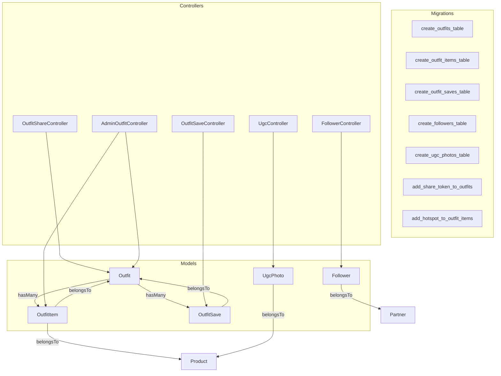
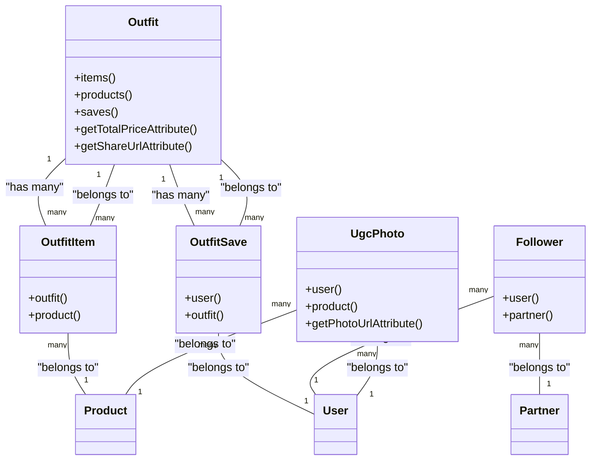
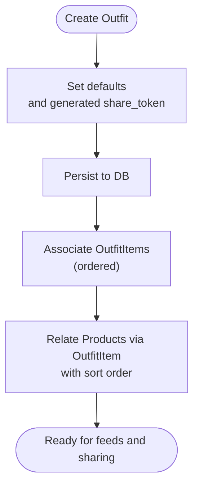
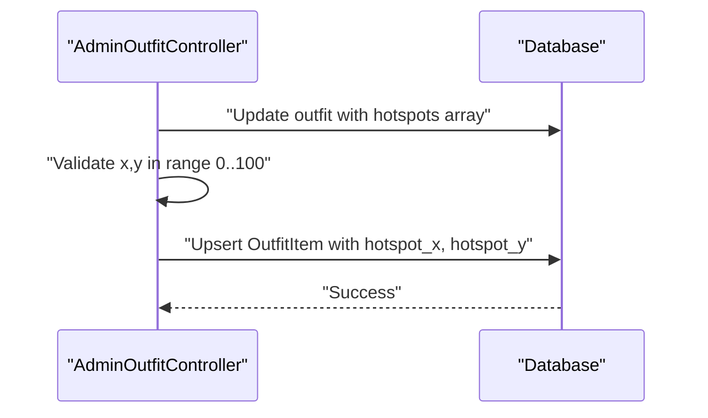
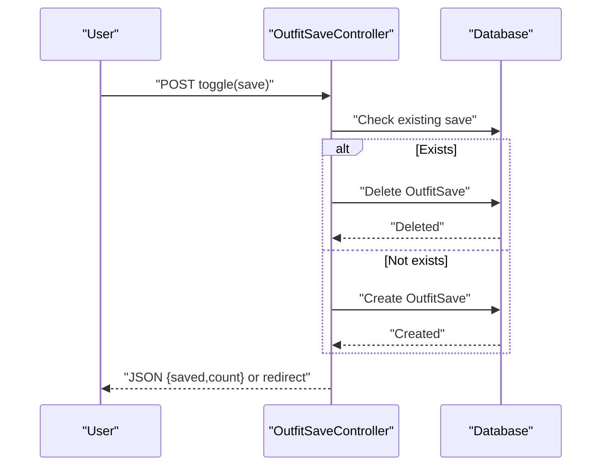
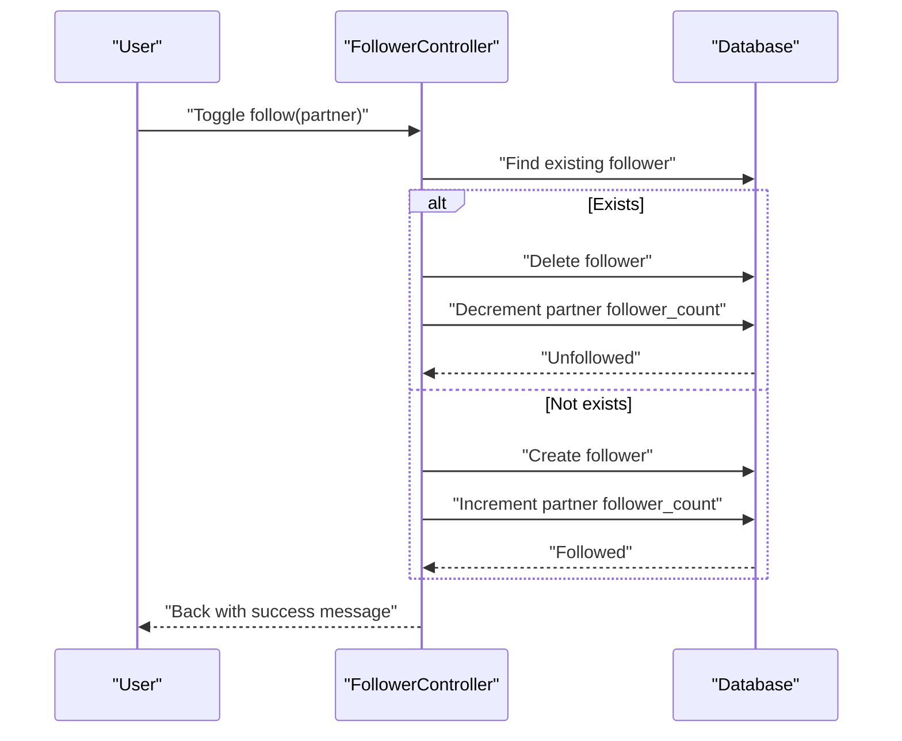
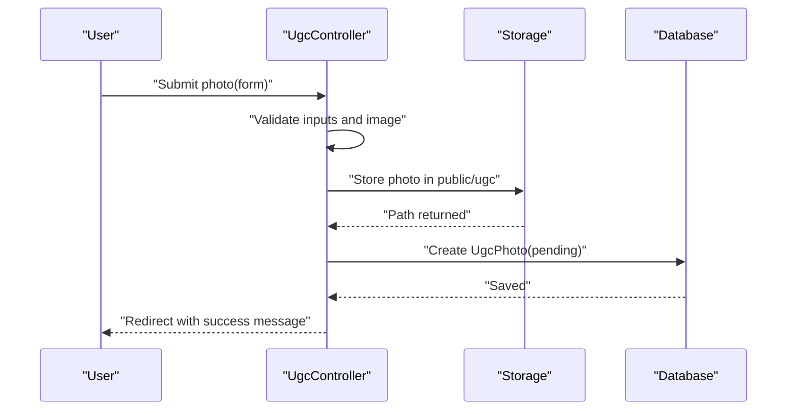
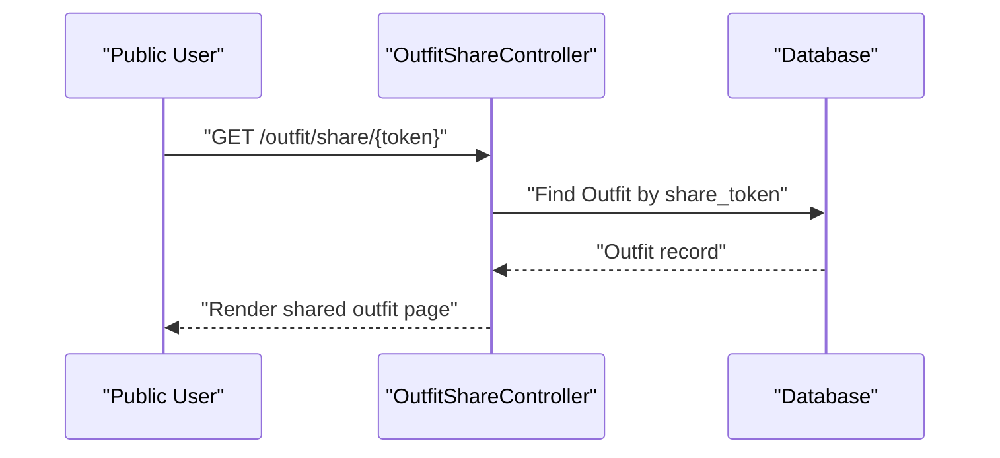
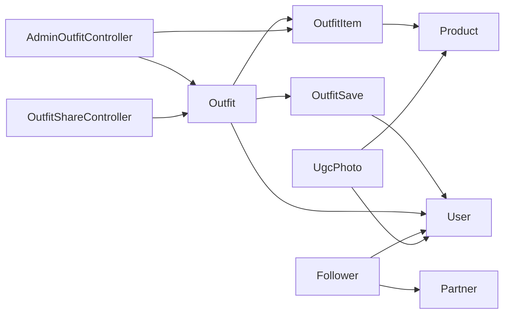

# Outfit and Community Models

<cite>
**Referenced Files in This Document**
- [Outfit.php](file://app/Models/Outfit.php)
- [OutfitItem.php](file://app/Models/OutfitItem.php)
- [OutfitSave.php](file://app/Models/OutfitSave.php)
- [Follower.php](file://app/Models/Follower.php)
- [UgcPhoto.php](file://app/Models/UgcPhoto.php)
- [2026_05_24_093628_create_outfits_table.php](file://database/migrations/2026_05_24_093628_create_outfits_table.php)
- [2026_05_24_093802_create_outfit_items_table.php](file://database/migrations/2026_05_24_093802_create_outfit_items_table.php)
- [2026_05_25_013311_create_outfit_saves_table.php](file://database/migrations/2026_05_25_013311_create_outfit_saves_table.php)
- [2026_07_01_100003_create_followers_table.php](file://database/migrations/2026_07_01_100003_create_followers_table.php)
- [2026_05_28_131139_create_ugc_photos_table.php](file://database/migrations/2026_05_28_131139_create_ugc_photos_table.php)
- [2026_05_25_013221_add_share_token_to_outfits_table.php](file://database/migrations/2026_05_25_013221_add_share_token_to_outfits_table.php)
- [2026_05_28_131107_add_hotspot_to_outfit_items_table.php](file://database/migrations/2026_05_28_131107_add_hotspot_to_outfit_items_table.php)
- [2026_06_07_100000_create_testimonials_table.php](file://database/migrations/2026_06_07_100000_create_testimonials_table.php)
- [OutfitSaveController.php](file://app/Http/Controllers/Member/OutfitSaveController.php)
- [FollowerController.php](file://app/Http/Controllers/Member/FollowerController.php)
- [UgcController.php](file://app/Http/Controllers/UgcController.php)
- [OutfitShareController.php](file://app/Http/Controllers/OutfitShareController.php)
- [AdminOutfitController.php](file://app/Http/Controllers/AdminOutfitController.php)
- [catalog.php](file://config/catalog.php)
</cite>

## Table of Contents
1. [Introduction](#introduction)
2. [Project Structure](#project-structure)
3. [Core Components](#core-components)
4. [Architecture Overview](#architecture-overview)
5. [Detailed Component Analysis](#detailed-component-analysis)
6. [Dependency Analysis](#dependency-analysis)
7. [Performance Considerations](#performance-considerations)
8. [Troubleshooting Guide](#troubleshooting-guide)
9. [Conclusion](#conclusion)

## Introduction
This document explains KatalogThrift’s community-driven models and related workflows: Outfit, OutfitItem, OutfitSave, Follower, and UgcPhoto. It covers how Outfits are curated collections of products created by users or partners, how OutfitItem acts as a pivot for many-to-many relationships between Outfits and Products, and how OutfitSave enables user favorites. It documents follower relationships for community building, the UGC photo submission system with moderation, the hotspot tagging system for OutfitItems, video cover support for rich media, and share tokens for public sharing. It also outlines query patterns for community feeds and performance optimization strategies for social features.

## Project Structure
The relevant models and migrations are located under app/Models and database/migrations. Controllers under app/Http/Controllers implement the business logic for saving outfits, following partners, submitting UGC photos, and sharing outfits via tokens. Configuration entries define platform features such as interactive lookbooks.

**Diagram sources**
- [Outfit.php:28-48](file://app/Models/Outfit.php#L28-L48)
- [OutfitItem.php:18-26](file://app/Models/OutfitItem.php#L18-L26)
- [OutfitSave.php:14-15](file://app/Models/OutfitSave.php#L14-L15)
- [Follower.php:13-21](file://app/Models/Follower.php#L13-L21)
- [UgcPhoto.php:15-16](file://app/Models/UgcPhoto.php#L15-L16)
- [2026_05_24_093628_create_outfits_table.php:11-21](file://database/migrations/2026_05_24_093628_create_outfits_table.php#L11-L21)
- [2026_05_24_093802_create_outfit_items_table.php:11-20](file://database/migrations/2026_05_24_093802_create_outfit_items_table.php#L11-L20)
- [2026_05_25_013311_create_outfit_saves_table.php:11-19](file://database/migrations/2026_05_25_013311_create_outfit_saves_table.php#L11-L19)
- [2026_07_01_100003_create_followers_table.php:10-18](file://database/migrations/2026_07_01_100003_create_followers_table.php#L10-L18)
- [2026_05_28_131139_create_ugc_photos_table.php:8-21](file://database/migrations/2026_05_28_131139_create_ugc_photos_table.php#L8-L21)
- [OutfitSaveController.php:15-34](file://app/Http/Controllers/Member/OutfitSaveController.php#L15-L34)
- [FollowerController.php:12-29](file://app/Http/Controllers/Member/FollowerController.php#L12-L29)
- [UgcController.php:24-47](file://app/Http/Controllers/UgcController.php#L24-L47)
- [OutfitShareController.php](file://app/Http/Controllers/OutfitShareController.php#L11)
- [AdminOutfitController.php:109-169](file://app/Http/Controllers/AdminOutfitController.php#L109-L169)

**Section sources**
- [Outfit.php:1-60](file://app/Models/Outfit.php#L1-L60)
- [OutfitItem.php:1-28](file://app/Models/OutfitItem.php#L1-L28)
- [OutfitSave.php:1-17](file://app/Models/OutfitSave.php#L1-L17)
- [Follower.php:1-23](file://app/Models/Follower.php#L1-L23)
- [UgcPhoto.php:1-24](file://app/Models/UgcPhoto.php#L1-L24)
- [2026_05_24_093628_create_outfits_table.php:1-29](file://database/migrations/2026_05_24_093628_create_outfits_table.php#L1-L29)
- [2026_05_24_093802_create_outfit_items_table.php:1-28](file://database/migrations/2026_05_24_093802_create_outfit_items_table.php#L1-L28)
- [2026_05_25_013311_create_outfit_saves_table.php:1-27](file://database/migrations/2026_05_25_013311_create_outfit_saves_table.php#L1-L27)
- [2026_07_01_100003_create_followers_table.php:1-26](file://database/migrations/2026_07_01_100003_create_followers_table.php#L1-L26)
- [2026_05_28_131139_create_ugc_photos_table.php:1-25](file://database/migrations/2026_05_28_131139_create_ugc_photos_table.php#L1-L25)

## Core Components
- Outfit: Represents a styled collection of products with metadata, optional cover image/video, and share token for public URLs. Includes helpers for total price computation and share URL generation.
- OutfitItem: Pivot model linking Outfit and Product with ordering, notes, and hotspot coordinates for interactive lookbooks.
- OutfitSave: Records user favorites for Outfit with a unique constraint to prevent duplicates.
- Follower: Tracks user-partner follow relationships with timestamps and cascading deletes.
- UgcPhoto: Manages user-generated photos with moderation status, optional product association, and storage URL resolution.

**Section sources**
- [Outfit.php:8-59](file://app/Models/Outfit.php#L8-L59)
- [OutfitItem.php:7-27](file://app/Models/OutfitItem.php#L7-L27)
- [OutfitSave.php:7-16](file://app/Models/OutfitSave.php#L7-L16)
- [Follower.php:6-22](file://app/Models/Follower.php#L6-L22)
- [UgcPhoto.php:7-23](file://app/Models/UgcPhoto.php#L7-L23)

## Architecture Overview
The community features revolve around Outfit as the central hub connecting Users, Products, Partners, and Moderation systems. OutfitItems embed hotspots for interactive experiences. OutfitSaves enable personalization and discovery. Followers connect Users to Partners for community building. UgcPhotos provide social proof and content for editorial feeds.

**Diagram sources**
- [Outfit.php:28-48](file://app/Models/Outfit.php#L28-L48)
- [OutfitItem.php:18-26](file://app/Models/OutfitItem.php#L18-L26)
- [OutfitSave.php:14-15](file://app/Models/OutfitSave.php#L14-L15)
- [Follower.php:13-21](file://app/Models/Follower.php#L13-L21)
- [UgcPhoto.php:15-22](file://app/Models/UgcPhoto.php#L15-L22)

## Detailed Component Analysis

### Outfit Model
- Purpose: Curates styled looks with metadata, cover assets, and shareability.
- Key relationships:
  - HasMany OutfitItem for ordered product linkage.
  - BelongsToMany Product via OutfitItem with pivot ordering.
  - HasMany OutfitSave for favorites.
- Attributes:
  - Auto-generates share_token during creation if absent.
  - Provides computed share URL and total price from associated products.
- Rich media:
  - Cover image field exists; cover video field is present in model fillable and validated by admin controller.

**Diagram sources**
- [Outfit.php:19-26](file://app/Models/Outfit.php#L19-L26)
- [Outfit.php:28-38](file://app/Models/Outfit.php#L28-L38)
- [2026_05_24_093628_create_outfits_table.php:11-21](file://database/migrations/2026_05_24_093628_create_outfits_table.php#L11-L21)
- [2026_05_25_013221_add_share_token_to_outfits_table.php:1-25](file://database/migrations/2026_05_25_013221_add_share_token_to_outfits_table.php#L1-L25)

**Section sources**
- [Outfit.php:8-59](file://app/Models/Outfit.php#L8-L59)
- [2026_05_24_093628_create_outfits_table.php:9-22](file://database/migrations/2026_05_24_093628_create_outfits_table.php#L9-L22)
- [2026_05_25_013221_add_share_token_to_outfits_table.php:1-25](file://database/migrations/2026_05_25_013221_add_share_token_to_outfits_table.php#L1-L25)

### OutfitItem Model and Hotspot Tagging
- Purpose: Bridge between Outfit and Product with ordering, notes, and hotspot coordinates.
- Hotspots:
  - Stored as percentages (0–100) from top-left corner.
  - Admin controller validates and persists per-product hotspots during outfit updates.
- Ordering:
  - Sort order maintained via pivot to ensure visual sequence.

**Diagram sources**
- [OutfitItem.php:9-16](file://app/Models/OutfitItem.php#L9-L16)
- [2026_05_28_131107_add_hotspot_to_outfit_items_table.php:1-25](file://database/migrations/2026_05_28_131107_add_hotspot_to_outfit_items_table.php#L1-L25)
- [AdminOutfitController.php:109-169](file://app/Http/Controllers/AdminOutfitController.php#L109-L169)

**Section sources**
- [OutfitItem.php:7-27](file://app/Models/OutfitItem.php#L7-L27)
- [2026_05_28_131107_add_hotspot_to_outfit_items_table.php:1-25](file://database/migrations/2026_05_28_131107_add_hotspot_to_outfit_items_table.php#L1-L25)
- [AdminOutfitController.php:109-169](file://app/Http/Controllers/AdminOutfitController.php#L109-L169)

### OutfitSave (Favorites)
- Purpose: Allow logged-in users to save Outfits; prevents duplicates via unique constraint.
- Controller behavior:
  - Toggle save/unsave.
  - Return JSON count for AJAX requests.
  - List saved Outfits with eager-loaded products and partner info.

**Diagram sources**
- [OutfitSaveController.php:15-34](file://app/Http/Controllers/Member/OutfitSaveController.php#L15-L34)
- [OutfitSave.php:14-15](file://app/Models/OutfitSave.php#L14-L15)
- [2026_05_25_013311_create_outfit_saves_table.php:11-19](file://database/migrations/2026_05_25_013311_create_outfit_saves_table.php#L11-L19)

**Section sources**
- [OutfitSaveController.php:13-48](file://app/Http/Controllers/Member/OutfitSaveController.php#L13-L48)
- [OutfitSave.php:7-16](file://app/Models/OutfitSave.php#L7-L16)
- [2026_05_25_013311_create_outfit_saves_table.php:1-27](file://database/migrations/2026_05_25_013311_create_outfit_saves_table.php#L1-L27)

### Follower (Community Following)
- Purpose: Enable users to follow partners; increments/decrements follower counts and awards points upon follow.
- Controller behavior:
  - Toggle follow/unfollow.
  - Retrieve following list with partner eager loading.

**Diagram sources**
- [FollowerController.php:12-29](file://app/Http/Controllers/Member/FollowerController.php#L12-L29)
- [Follower.php:13-21](file://app/Models/Follower.php#L13-L21)
- [2026_07_01_100003_create_followers_table.php:10-18](file://database/migrations/2026_07_01_100003_create_followers_table.php#L10-L18)

**Section sources**
- [FollowerController.php:10-44](file://app/Http/Controllers/Member/FollowerController.php#L10-L44)
- [Follower.php:6-22](file://app/Models/Follower.php#L6-L22)
- [2026_07_01_100003_create_followers_table.php:1-26](file://database/migrations/2026_07_01_100003_create_followers_table.php#L1-L26)

### UGC Photo Submission and Moderation
- Purpose: Allow users (including anonymous submissions) to submit photos linked to products; photos require moderation before appearing publicly.
- Controller behavior:
  - Validates required fields and image constraints.
  - Stores image to public disk under ugc folder.
  - Creates UgcPhoto record with pending status.
  - Public index lists approved photos with product eager loading.

**Diagram sources**
- [UgcController.php:24-47](file://app/Http/Controllers/UgcController.php#L24-L47)
- [UgcPhoto.php:18-22](file://app/Models/UgcPhoto.php#L18-L22)
- [2026_05_28_131139_create_ugc_photos_table.php:8-21](file://database/migrations/2026_05_28_131139_create_ugc_photos_table.php#L8-L21)

**Section sources**
- [UgcController.php:9-48](file://app/Http/Controllers/UgcController.php#L9-L48)
- [UgcPhoto.php:7-23](file://app/Models/UgcPhoto.php#L7-L23)
- [2026_05_28_131139_create_ugc_photos_table.php:1-25](file://database/migrations/2026_05_28_131139_create_ugc_photos_table.php#L1-L25)

### Share Token and Public Outfit Access
- Purpose: Allow sharing Outfits via a short, unique token without requiring authentication.
- Implementation:
  - Outfit automatically generates share_token if missing.
  - OutfitShareController resolves Outfit by share_token for public viewing.
  - Outfit provides share URL helper.

**Diagram sources**
- [Outfit.php:21-26](file://app/Models/Outfit.php#L21-L26)
- [Outfit.php:55-58](file://app/Models/Outfit.php#L55-L58)
- [OutfitShareController.php](file://app/Http/Controllers/OutfitShareController.php#L11)
- [2026_05_25_013221_add_share_token_to_outfits_table.php:1-25](file://database/migrations/2026_05_25_013221_add_share_token_to_outfits_table.php#L1-L25)

**Section sources**
- [Outfit.php:19-26](file://app/Models/Outfit.php#L19-L26)
- [Outfit.php:55-58](file://app/Models/Outfit.php#L55-L58)
- [OutfitShareController.php](file://app/Http/Controllers/OutfitShareController.php#L11)
- [2026_05_25_013221_add_share_token_to_outfits_table.php:1-25](file://database/migrations/2026_05_25_013221_add_share_token_to_outfits_table.php#L1-L25)

### Video Cover Support
- Outfit model fillable includes cover_video; validated and persisted by AdminOutfitController.
- Enables rich media presentation for Outfits.

**Section sources**
- [Outfit.php:12-13](file://app/Models/Outfit.php#L12-L13)
- [AdminOutfitController.php:73-73](file://app/Http/Controllers/AdminOutfitController.php#L73-L73)

### Lookbook Interactive Experience
- Hotspot tagging system allows interactive product tagging within Outfit images.
- Config entry references “Interactive Lookbook” feature.

**Section sources**
- [catalog.php:50-50](file://config/catalog.php#L50-L50)
- [2026_05_28_131107_add_hotspot_to_outfit_items_table.php:1-25](file://database/migrations/2026_05_28_131107_add_hotspot_to_outfit_items_table.php#L1-L25)

## Dependency Analysis
- Outfit depends on OutfitItem and OutfitSave; indirectly on Product via OutfitItem.
- OutfitItem depends on Outfit and Product.
- OutfitSave depends on User and Outfit.
- Follower depends on User and Partner.
- UgcPhoto depends on User and Product.
- AdminOutfitController orchestrates Outfit and OutfitItem updates including hotspots and cover video.
- OutfitShareController depends on Outfit share_token resolution.

**Diagram sources**
- [Outfit.php:28-48](file://app/Models/Outfit.php#L28-L48)
- [OutfitItem.php:18-26](file://app/Models/OutfitItem.php#L18-L26)
- [OutfitSave.php:14-15](file://app/Models/OutfitSave.php#L14-L15)
- [Follower.php:13-21](file://app/Models/Follower.php#L13-L21)
- [UgcPhoto.php:15-16](file://app/Models/UgcPhoto.php#L15-L16)
- [AdminOutfitController.php:109-169](file://app/Http/Controllers/AdminOutfitController.php#L109-L169)
- [OutfitShareController.php](file://app/Http/Controllers/OutfitShareController.php#L11)

**Section sources**
- [Outfit.php:28-48](file://app/Models/Outfit.php#L28-L48)
- [OutfitItem.php:18-26](file://app/Models/OutfitItem.php#L18-L26)
- [OutfitSave.php:14-15](file://app/Models/OutfitSave.php#L14-L15)
- [Follower.php:13-21](file://app/Models/Follower.php#L13-L21)
- [UgcPhoto.php:15-16](file://app/Models/UgcPhoto.php#L15-L16)
- [AdminOutfitController.php:109-169](file://app/Http/Controllers/AdminOutfitController.php#L109-L169)
- [OutfitShareController.php](file://app/Http/Controllers/OutfitShareController.php#L11)

## Performance Considerations
- Eager loading:
  - Use with relations for OutfitSave index to avoid N+1 queries when loading associated Outfit, Product, and Partner data.
  - Use with relations for UGC index to load product context efficiently.
- Unique constraints:
  - OutfitSave and Follower enforce uniqueness to prevent duplicate writes and simplify lookups.
- Indexes:
  - Foreign keys on outfit_items, outfit_saves, followers, and ugc_photos are implied by foreign() declarations; ensure appropriate database-level indexes exist for frequent join/filter columns (e.g., user_id, outfit_id, product_id).
- Pagination:
  - Apply pagination for community feeds (saved outfits, following list, UGC gallery) to limit payload sizes.
- Caching:
  - Cache frequently accessed Outfit metadata (e.g., share URL, total price) when appropriate to reduce repeated computations.
- Media:
  - Store thumbnails and optimize cover images/videos; leverage CDN for UGC photo URLs.

[No sources needed since this section provides general guidance]

## Troubleshooting Guide
- Duplicate saves:
  - If toggling fails to remove a save, verify unique constraint on user_id and outfit_id in outfit_saves.
- Follow count drift:
  - Ensure follower_count increments/decrements occur in toggle logic and that cascade deletes are functioning.
- UGC approval pipeline:
  - Confirm status transitions and moderation steps; ensure approved photos are filtered in public index.
- Hotspot validation:
  - Validate hotspot coordinates are within 0–100 range; persist rounded values to avoid precision issues.
- Share URL:
  - Confirm share_token is present and route resolves to OutfitShareController.

**Section sources**
- [2026_05_25_013311_create_outfit_saves_table.php:16-16](file://database/migrations/2026_05_25_013311_create_outfit_saves_table.php#L16-L16)
- [2026_07_01_100003_create_followers_table.php:15-15](file://database/migrations/2026_07_01_100003_create_followers_table.php#L15-L15)
- [UgcController.php:24-47](file://app/Http/Controllers/UgcController.php#L24-L47)
- [AdminOutfitController.php:109-169](file://app/Http/Controllers/AdminOutfitController.php#L109-L169)
- [OutfitShareController.php](file://app/Http/Controllers/OutfitShareController.php#L11)

## Conclusion
KatalogThrift’s community models form a cohesive ecosystem: Outfit curates styled looks, OutfitItem powers ordering and interactive hotspots, OutfitSave personalizes discovery, Follower builds community engagement, and UgcPhoto fuels social proof with moderation. The share token and cover video features enhance discoverability and richness. By leveraging eager loading, unique constraints, and thoughtful indexing, the platform can scale social features while maintaining responsive user experiences.