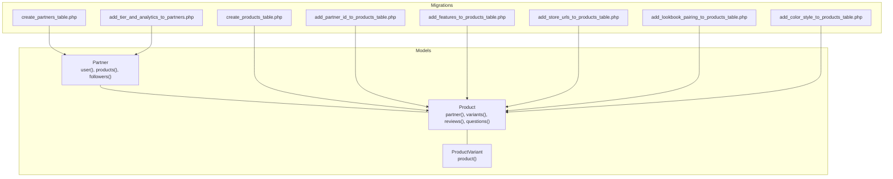
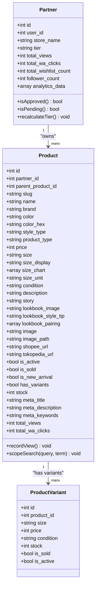
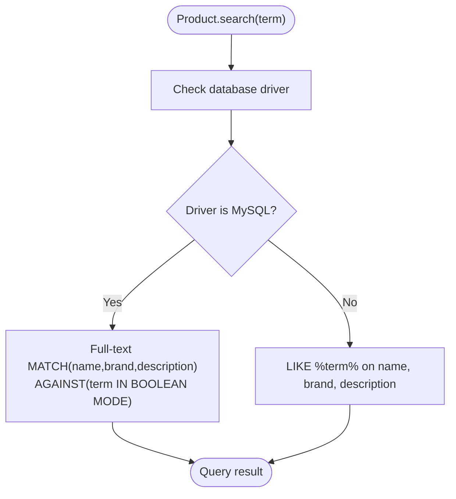
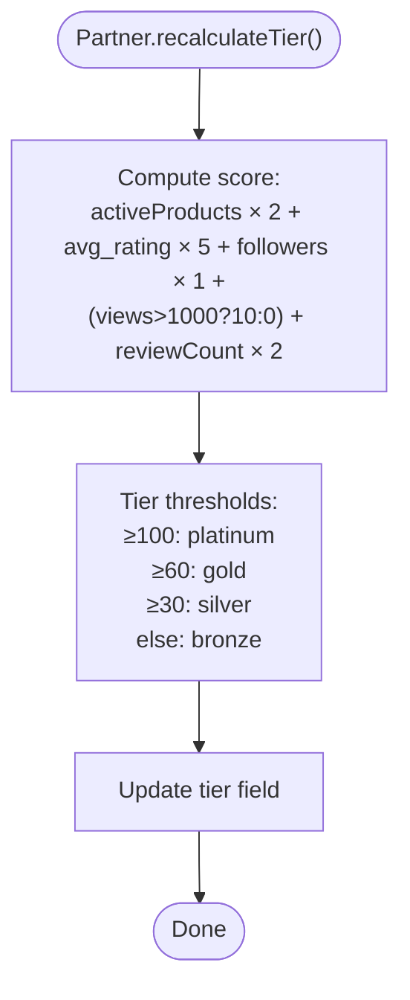
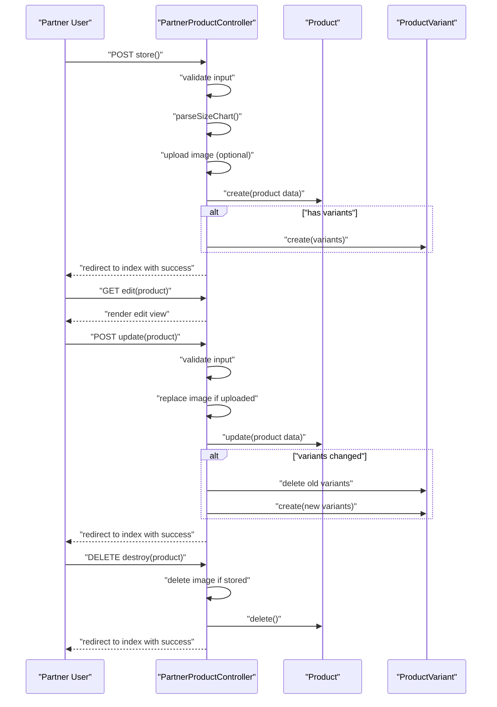
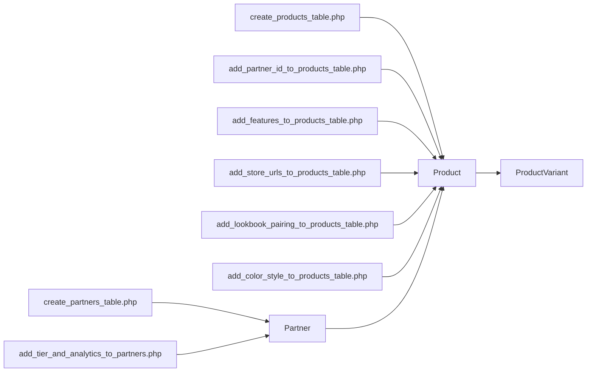

# Product and Partner Relationships

<cite>
**Referenced Files in This Document**
- [Product.php](file://app/Models/Product.php)
- [Partner.php](file://app/Models/Partner.php)
- [ProductVariant.php](file://app/Models/ProductVariant.php)
- [PartnerProductController.php](file://app/Http/Controllers/Partner/PartnerProductController.php)
- [create_partners_table.php](file://database/migrations/2026_05_24_093205_create_partners_table.php)
- [create_products_table.php](file://database/migrations/2026_05_04_125734_create_products_table.php)
- [add_partner_id_to_products_table.php](file://database/migrations/2026_05_24_093340_add_partner_id_to_products_table.php)
- [add_store_urls_to_products_table.php](file://database/migrations/2026_05_17_144621_add_store_urls_to_products_table.php)
- [add_features_to_products_table.php](file://database/migrations/2026_05_18_014049_add_features_to_products_table.php)
- [add_lookbook_pairing_to_products_table.php](file://database/migrations/2026_05_18_015859_add_lookbook_pairing_to_products_table.php)
- [add_color_style_to_products_table.php](file://database/migrations/2026_05_18_021133_add_color_style_to_products_table.php)
- [add_tier_and_analytics_to_partners.php](file://database/migrations/2026_07_01_100001_add_tier_and_analytics_to_partners.php)
</cite>

## Table of Contents
1. [Introduction](#introduction)
2. [Project Structure](#project-structure)
3. [Core Components](#core-components)
4. [Architecture Overview](#architecture-overview)
5. [Detailed Component Analysis](#detailed-component-analysis)
6. [Dependency Analysis](#dependency-analysis)
7. [Performance Considerations](#performance-considerations)
8. [Troubleshooting Guide](#troubleshooting-guide)
9. [Conclusion](#conclusion)

## Introduction
This document explains the Product and Partner model relationships in KatalogThrift’s marketplace system. It details how Products are associated with Partners as store owners, the foreign key relationships and cascading behaviors, and how the models expose attributes for pricing, inventory, size charts, color variations, SEO metadata, and lookbook pairings. It also documents Partner store management capabilities, performance analytics, approval workflows, and tier-based commission tracking. Finally, it outlines product listing processes, partner onboarding workflows, and inventory synchronization patterns, along with query optimization strategies for marketplace searches.

## Project Structure
The relevant models and migrations define the core domain objects and their persistence schema:
- Product model encapsulates product attributes, relationships, and search scopes.
- Partner model manages store ownership, approval status, analytics, and tier calculation.
- ProductVariant supports variant-based inventory per product.
- PartnerProductController orchestrates product creation, updates, and variant management for authenticated partners.

**Diagram sources**
- [Product.php:1-132](file://app/Models/Product.php#L1-L132)
- [Partner.php:1-123](file://app/Models/Partner.php#L1-L123)
- [ProductVariant.php:1-23](file://app/Models/ProductVariant.php#L1-L23)
- [create_products_table.php:1-37](file://database/migrations/2026_05_04_125734_create_products_table.php#L1-L37)
- [add_partner_id_to_products_table.php:1-26](file://database/migrations/2026_05_24_093340_add_partner_id_to_products_table.php#L1-L26)
- [create_partners_table.php:1-38](file://database/migrations/2026_05_24_093205_create_partners_table.php#L1-L38)
- [add_features_to_products_table.php:1-27](file://database/migrations/2026_05_18_014049_add_features_to_products_table.php#L1-L27)
- [add_store_urls_to_products_table.php:1-24](file://database/migrations/2026_05_17_144621_add_store_urls_to_products_table.php#L1-L24)
- [add_lookbook_pairing_to_products_table.php:1-24](file://database/migrations/2026_05_18_015859_add_lookbook_pairing_to_products_table.php#L1-L24)
- [add_color_style_to_products_table.php:1-26](file://database/migrations/2026_05_18_021133_add_color_style_to_products_table.php#L1-L26)
- [add_tier_and_analytics_to_partners.php:1-27](file://database/migrations/2026_07_01_100001_add_tier_and_analytics_to_partners.php#L1-L27)

**Section sources**
- [Product.php:1-132](file://app/Models/Product.php#L1-L132)
- [Partner.php:1-123](file://app/Models/Partner.php#L1-L123)
- [ProductVariant.php:1-23](file://app/Models/ProductVariant.php#L1-L23)
- [create_products_table.php:1-37](file://database/migrations/2026_05_04_125734_create_products_table.php#L1-L37)
- [add_partner_id_to_products_table.php:1-26](file://database/migrations/2026_05_24_093340_add_partner_id_to_products_table.php#L1-L26)
- [create_partners_table.php:1-38](file://database/migrations/2026_05_24_093205_create_partners_table.php#L1-L38)
- [add_features_to_products_table.php:1-27](file://database/migrations/2026_05_18_014049_add_features_to_products_table.php#L1-L27)
- [add_store_urls_to_products_table.php:1-24](file://database/migrations/2026_05_17_144621_add_store_urls_to_products_table.php#L1-L24)
- [add_lookbook_pairing_to_products_table.php:1-24](file://database/migrations/2026_05_18_015859_add_lookbook_pairing_to_products_table.php#L1-L24)
- [add_color_style_to_products_table.php:1-26](file://database/migrations/2026_05_18_021133_add_color_style_to_products_table.php#L1-L26)
- [add_tier_and_analytics_to_partners.php:1-27](file://database/migrations/2026_07_01_100001_add_tier_and_analytics_to_partners.php#L1-L27)

## Core Components
- Product model
  - Foreign key: partner_id references partners.id with cascade set null on delete.
  - Attributes include pricing, condition, size, story, lookbook assets, store links, SEO metadata, and counters.
  - Relationships: belongs to Partner, has many Variants, Reviews, Wishlists, Reports, Questions; self-referencing via parent_product_id for grouping.
  - Accessors: average rating, review count, image URL, meta title/description.
  - Scopes: search with MySQL full-text or fallback LIKE conditions.
- Partner model
  - Foreign key: user_id references users.id with cascade delete.
  - Attributes include store branding, social URLs, approval status, verification, tier, and analytics counters.
  - Relationships: belongs to User, has many Products and Followers.
  - Computed attributes: average rating and review count derived from owned products.
  - Approval helpers: isApproved, isPending.
  - Tier badge/name helpers and automatic tier recalculation based on performance metrics.
- ProductVariant model
  - Belongs to Product; stores per-variant price, stock, condition, and activation flags.

**Section sources**
- [Product.php:1-132](file://app/Models/Product.php#L1-L132)
- [Partner.php:1-123](file://app/Models/Partner.php#L1-L123)
- [ProductVariant.php:1-23](file://app/Models/ProductVariant.php#L1-L23)
- [add_partner_id_to_products_table.php:1-26](file://database/migrations/2026_05_24_093340_add_partner_id_to_products_table.php#L1-L26)
- [create_partners_table.php:1-38](file://database/migrations/2026_05_24_093205_create_partners_table.php#L1-L38)

## Architecture Overview
The marketplace centers on Partner-owned Products with optional variants. The controller layer enforces ownership and handles product lifecycle operations.

**Diagram sources**
- [Partner.php:1-123](file://app/Models/Partner.php#L1-L123)
- [Product.php:1-132](file://app/Models/Product.php#L1-L132)
- [ProductVariant.php:1-23](file://app/Models/ProductVariant.php#L1-L23)

## Detailed Component Analysis

### Product Model
Key aspects:
- Foreign key relationship: partner_id → partners.id with onDelete set null.
- Attributes for pricing and inventory: price, stock, is_sold, is_active, is_new_arrival, has_variants.
- Size and fit: size, size_display, size_chart (array), size_unit.
- Color and style: color, color_hex, style_type, product_type.
- Storytelling and lookbook: story, lookbook_image, lookbook_style_tip, lookbook_pairing (JSON array).
- Store links: shopee_url, tokopedia_url.
- SEO: meta_title, meta_description, meta_keywords.
- Analytics: total_views, total_wa_clicks.
- Relationships:
  - belongs to Partner.
  - has many Variants, Reviews, Wishlists, Reports, Questions.
  - self-referencing parent/child grouping via parent_product_id.
- Computed attributes:
  - Average rating and review count from related Reviews.
  - Image URL resolution from either external URL or stored path.
- Search scope:
  - Uses MySQL full-text MATCH ... AGAINST for boolean mode when configured to mysql.
  - Falls back to OR-ed LIKE conditions on name, brand, description otherwise.

**Diagram sources**
- [Product.php:121-130](file://app/Models/Product.php#L121-L130)

**Section sources**
- [Product.php:1-132](file://app/Models/Product.php#L1-L132)
- [add_partner_id_to_products_table.php:1-26](file://database/migrations/2026_05_24_093340_add_partner_id_to_products_table.php#L1-L26)
- [add_store_urls_to_products_table.php:1-24](file://database/migrations/2026_05_17_144621_add_store_urls_to_products_table.php#L1-L24)
- [add_features_to_products_table.php:1-27](file://database/migrations/2026_05_18_014049_add_features_to_products_table.php#L1-L27)
- [add_lookbook_pairing_to_products_table.php:1-24](file://database/migrations/2026_05_18_015859_add_lookbook_pairing_to_products_table.php#L1-L24)
- [add_color_style_to_products_table.php:1-26](file://database/migrations/2026_05_18_021133_add_color_style_to_products_table.php#L1-L26)

### Partner Model
Key aspects:
- Ownership: belongs to User with cascade delete.
- Store management: store_name, store_slug, description, logo, location, social URLs.
- Approval workflow: status enum with pending/approved/rejected/suspended, rejection_reason, approved_at, is_verified.
- Performance analytics: total_views, total_wa_clicks, total_wishlist_count, follower_count, analytics_data.
- Tier system: tier field with bronze/silver/gold/platinum, computed via recalculateTier based on:
  - Active product count × 2
  - Average rating × 5
  - Follower count × 1
  - Views threshold bonus
  - Review count × 2
- Relationships:
  - has many Products filtered by is_active and is_sold flags.
  - has many Followers.
  - belongs to User.
- Computed attributes:
  - Average rating and review count derived from owned products’ reviews.

**Diagram sources**
- [Partner.php:104-121](file://app/Models/Partner.php#L104-L121)

**Section sources**
- [Partner.php:1-123](file://app/Models/Partner.php#L1-L123)
- [create_partners_table.php:1-38](file://database/migrations/2026_05_24_093205_create_partners_table.php#L1-L38)
- [add_tier_and_analytics_to_partners.php:1-27](file://database/migrations/2026_07_01_100001_add_tier_and_analytics_to_partners.php#L1-L27)

### ProductVariant Model
Key aspects:
- Per-variant inventory and pricing: size, price, condition, stock, is_sold, is_active.
- Relationship: belongs to Product.

**Section sources**
- [ProductVariant.php:1-23](file://app/Models/ProductVariant.php#L1-L23)

### Partner Product Lifecycle (Controller)
The PartnerProductController coordinates product creation, editing, variant management, and deletion under partner authentication.

**Diagram sources**
- [PartnerProductController.php:1-337](file://app/Http/Controllers/Partner/PartnerProductController.php#L1-L337)

**Section sources**
- [PartnerProductController.php:1-337](file://app/Http/Controllers/Partner/PartnerProductController.php#L1-L337)

### Lookbook Pairing Functionality
Products support lookbook pairing as a JSON array of related items, enabling complementary item suggestions. The Product model exposes lookbook_pairing as an array cast, and the controller accepts and persists this field during create/update.

**Section sources**
- [Product.php:19-24](file://app/Models/Product.php#L19-L24)
- [add_lookbook_pairing_to_products_table.php:1-24](file://database/migrations/2026_05_18_015859_add_lookbook_pairing_to_products_table.php#L1-L24)
- [PartnerProductController.php:44-73](file://app/Http/Controllers/Partner/PartnerProductController.php#L44-L73)

### Product Categorization and Filtering
- Product type and style type fields enable categorization and filtering by product_type and style_type.
- Color and color_hex support color-based filters.
- Condition and size/unit support condition and sizing filters.
- Status flags (is_active, is_sold, is_new_arrival) support availability and freshness filters.
- Search scope supports full-text or LIKE-based search across name, brand, and description.

**Section sources**
- [Product.php:13-25](file://app/Models/Product.php#L13-L25)
- [add_color_style_to_products_table.php:1-26](file://database/migrations/2026_05_18_021133_add_color_style_to_products_table.php#L1-L26)
- [add_features_to_products_table.php:1-27](file://database/migrations/2026_05_18_014049_add_features_to_products_table.php#L1-L27)
- [Product.php:121-130](file://app/Models/Product.php#L121-L130)

## Dependency Analysis
- Product depends on Partner via foreign key; Partner has many Products.
- Product optionally groups variants via parent_product_id; Product has many Variants.
- Product and Partner depend on database migrations for schema definition.
- Controller depends on Product and ProductVariant models for CRUD operations.

**Diagram sources**
- [create_products_table.php:1-37](file://database/migrations/2026_05_04_125734_create_products_table.php#L1-L37)
- [add_partner_id_to_products_table.php:1-26](file://database/migrations/2026_05_24_093340_add_partner_id_to_products_table.php#L1-L26)
- [create_partners_table.php:1-38](file://database/migrations/2026_05_24_093205_create_partners_table.php#L1-L38)
- [add_features_to_products_table.php:1-27](file://database/migrations/2026_05_18_014049_add_features_to_products_table.php#L1-L27)
- [add_store_urls_to_products_table.php:1-24](file://database/migrations/2026_05_17_144621_add_store_urls_to_products_table.php#L1-L24)
- [add_lookbook_pairing_to_products_table.php:1-24](file://database/migrations/2026_05_18_015859_add_lookbook_pairing_to_products_table.php#L1-L24)
- [add_color_style_to_products_table.php:1-26](file://database/migrations/2026_05_18_021133_add_color_style_to_products_table.php#L1-L26)
- [add_tier_and_analytics_to_partners.php:1-27](file://database/migrations/2026_07_01_100001_add_tier_and_analytics_to_partners.php#L1-L27)

**Section sources**
- [Product.php:1-132](file://app/Models/Product.php#L1-L132)
- [Partner.php:1-123](file://app/Models/Partner.php#L1-L123)
- [ProductVariant.php:1-23](file://app/Models/ProductVariant.php#L1-L23)

## Performance Considerations
- Search optimization:
  - Prefer MySQL full-text search when configured for the database connection to leverage MATCH ... AGAINST for boolean-mode queries.
  - For non-MySQL drivers, the LIKE fallback scans name, brand, and description; ensure appropriate indexing on these columns.
- Eager loading:
  - Use with('variants') when listing partner products to avoid N+1 queries for variants.
- Denormalized analytics:
  - Product and Partner models maintain counters (total_views, total_wa_clicks, total_wishlist_count) to reduce joins for analytics rendering.
- Tier recalculation:
  - Recompute tier periodically or on significant events to keep performance indicators accurate without expensive real-time aggregations.
- Image handling:
  - Prefer storing images in public disk and resolving URLs via Storage facade to minimize overhead.

[No sources needed since this section provides general guidance]

## Troubleshooting Guide
- Product not visible to buyers:
  - Verify is_active is true and is_sold is false for the product and its variants.
  - Confirm partner status is approved and not suspended.
- Incorrect average rating or review count:
  - Ensure reviews are linked to product ids belonging to the partner’s products.
- Search returns unexpected results:
  - On non-MySQL drivers, confirm LIKE-based search covers the intended fields.
- Image not displaying:
  - Check image_path vs image URL precedence and storage permissions.
- Tier not updating:
  - Trigger recalculateTier or ensure performance metrics are populated.

**Section sources**
- [Partner.php:72-80](file://app/Models/Partner.php#L72-L80)
- [Partner.php:104-121](file://app/Models/Partner.php#L104-L121)
- [Product.php:27-34](file://app/Models/Product.php#L27-L34)
- [Product.php:96-102](file://app/Models/Product.php#L96-L102)
- [Product.php:121-130](file://app/Models/Product.php#L121-L130)

## Conclusion
KatalogThrift’s Product and Partner models form a cohesive marketplace domain with clear ownership semantics and rich product attributes. Products are owned by Partners with robust relationships to variants, reviews, and analytics. The controller layer enforces ownership and streamlines product lifecycle operations. Performance is supported through eager loading, denormalized counters, and configurable search strategies. Lookbook pairings and categorization fields enable discovery and filtering. Approval workflows and tier-based analytics provide governance and motivation for sellers.