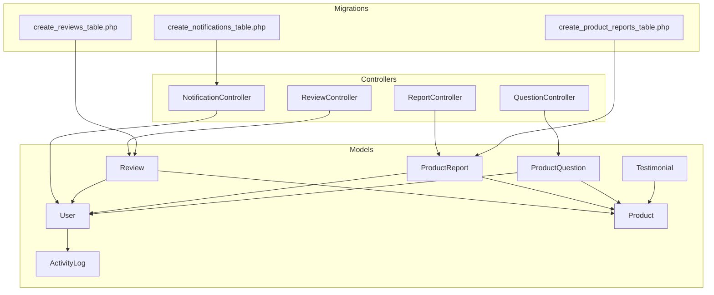
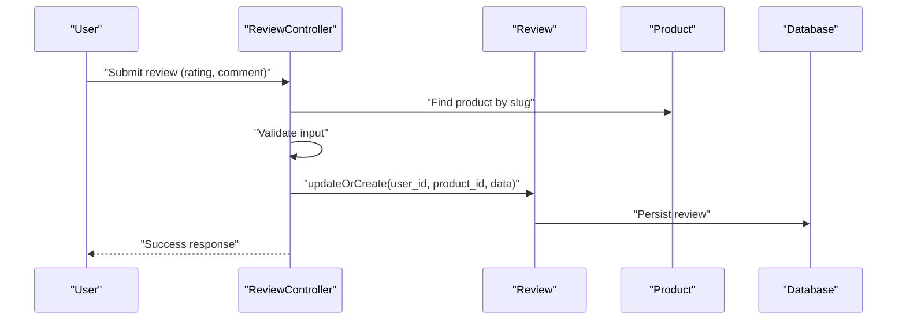
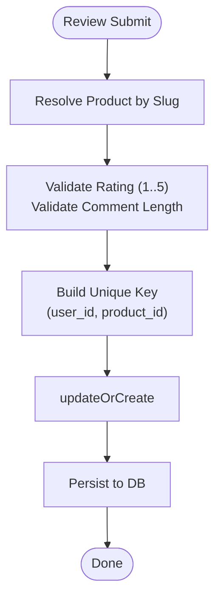
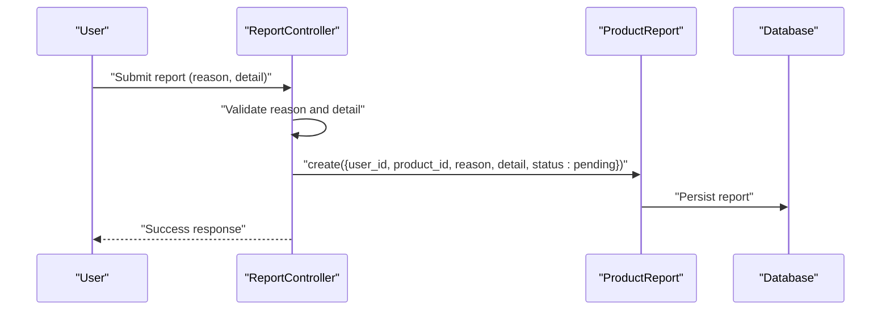
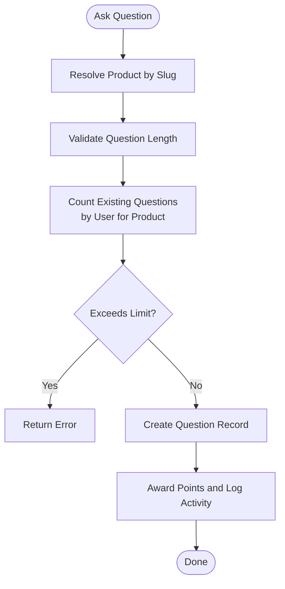
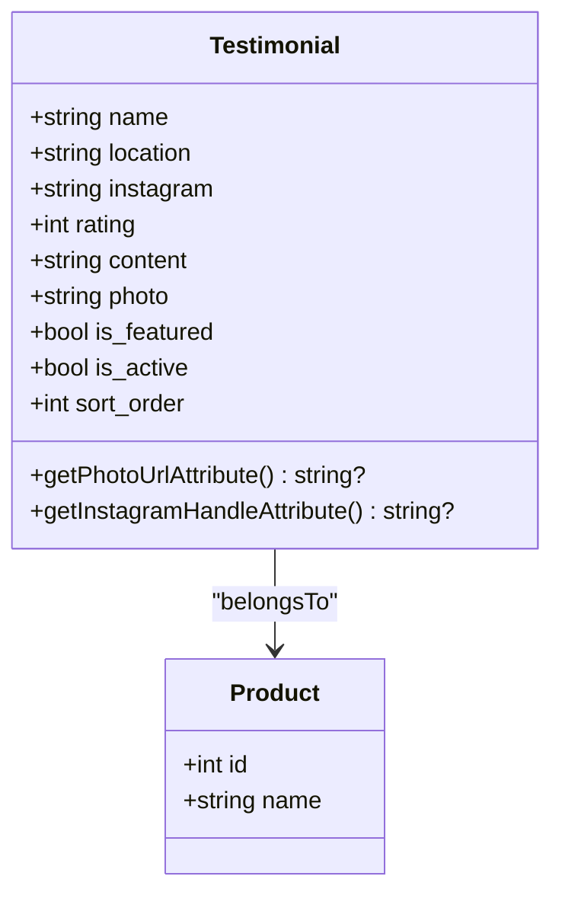
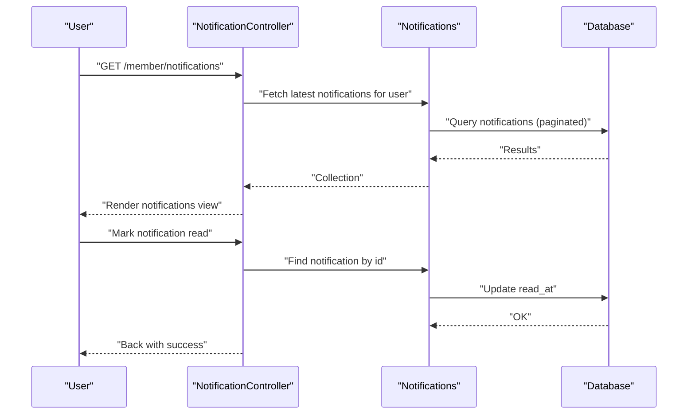
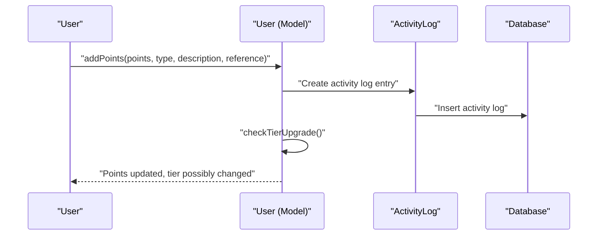
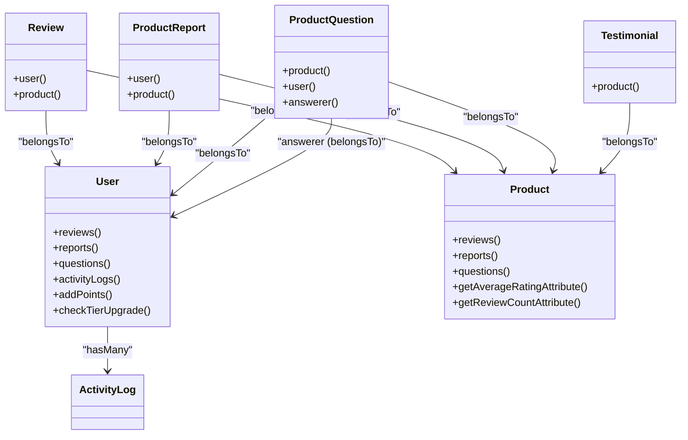

# Reviews, Reports, and Notifications

<cite>
**Referenced Files in This Document**
- [Review.php](file://app/Models/Review.php)
- [ProductReport.php](file://app/Models/ProductReport.php)
- [ProductQuestion.php](file://app/Models/ProductQuestion.php)
- [Testimonial.php](file://app/Models/Testimonial.php)
- [User.php](file://app/Models/User.php)
- [Product.php](file://app/Models/Product.php)
- [ReviewController.php](file://app/Http/Controllers/Member/ReviewController.php)
- [ReportController.php](file://app/Http/Controllers/Member/ReportController.php)
- [QuestionController.php](file://app/Http/Controllers/Member/QuestionController.php)
- [NotificationController.php](file://app/Http/Controllers/Member/NotificationController.php)
- [create_reviews_table.php](file://database/migrations/2026_05_24_093454_create_reviews_table.php)
- [create_product_reports_table.php](file://database/migrations/2026_05_24_093849_create_product_reports_table.php)
- [create_notifications_table.php](file://database/migrations/2026_07_01_100005_create_notifications_table.php)
- [ActivityLog.php](file://app/Models/ActivityLog.php)
- [2026_07_01_100000_add_auth_and_tier_to_users.php](file://database/migrations/2026_07_01_100000_add_auth_and_tier_to_users.php)
- [2026_07_01_100001_add_tier_and_analytics_to_partners.php](file://database/migrations/2026_07_01_100001_add_tier_and_analytics_to_partners.php)
</cite>

## Table of Contents
1. [Introduction](#introduction)
2. [Project Structure](#project-structure)
3. [Core Components](#core-components)
4. [Architecture Overview](#architecture-overview)
5. [Detailed Component Analysis](#detailed-component-analysis)
6. [Dependency Analysis](#dependency-analysis)
7. [Performance Considerations](#performance-considerations)
8. [Troubleshooting Guide](#troubleshooting-guide)
9. [Conclusion](#conclusion)

## Introduction
This document explains KatalogThrift’s review, reporting, and notification systems. It covers:
- Review model for product feedback and ratings
- ProductReport model for moderation and abuse reporting
- Notification infrastructure for user alerts and system messages
- ProductQuestion model for customer service interactions
- Testimonial model for featured customer stories
It also documents relationships among these models and their integration with User and Product, along with moderation workflows, content quality controls, spam prevention, and audit trail maintenance via activity logging.

## Project Structure
The relevant components are organized by domain:
- Models define data structures and relationships
- Member controllers handle user-facing submission and retrieval
- Migrations define database schemas
- Activity logging tracks user actions for auditing

**Diagram sources**
- [Review.php:1-30](file://app/Models/Review.php#L1-L30)
- [ProductReport.php:1-27](file://app/Models/ProductReport.php#L1-L27)
- [ProductQuestion.php:1-32](file://app/Models/ProductQuestion.php#L1-L32)
- [Testimonial.php:1-46](file://app/Models/Testimonial.php#L1-L46)
- [User.php:1-131](file://app/Models/User.php#L1-L131)
- [Product.php:1-132](file://app/Models/Product.php#L1-L132)
- [ReviewController.php:1-41](file://app/Http/Controllers/Member/ReviewController.php#L1-L41)
- [ReportController.php:1-30](file://app/Http/Controllers/Member/ReportController.php#L1-L30)
- [QuestionController.php:1-40](file://app/Http/Controllers/Member/QuestionController.php#L1-L40)
- [NotificationController.php:1-32](file://app/Http/Controllers/Member/NotificationController.php#L1-L32)
- [create_reviews_table.php:1-29](file://database/migrations/2026_05_24_093454_create_reviews_table.php#L1-L29)
- [create_product_reports_table.php:1-29](file://database/migrations/2026_05_24_093849_create_product_reports_table.php#L1-L29)
- [create_notifications_table.php:1-25](file://database/migrations/2026_07_01_100005_create_notifications_table.php#L1-L25)

**Section sources**
- [Review.php:1-30](file://app/Models/Review.php#L1-L30)
- [ProductReport.php:1-27](file://app/Models/ProductReport.php#L1-L27)
- [ProductQuestion.php:1-32](file://app/Models/ProductQuestion.php#L1-L32)
- [Testimonial.php:1-46](file://app/Models/Testimonial.php#L1-L46)
- [User.php:1-131](file://app/Models/User.php#L1-L131)
- [Product.php:1-132](file://app/Models/Product.php#L1-L132)
- [ReviewController.php:1-41](file://app/Http/Controllers/Member/ReviewController.php#L1-L41)
- [ReportController.php:1-30](file://app/Http/Controllers/Member/ReportController.php#L1-L30)
- [QuestionController.php:1-40](file://app/Http/Controllers/Member/QuestionController.php#L1-L40)
- [NotificationController.php:1-32](file://app/Http/Controllers/Member/NotificationController.php#L1-L32)
- [create_reviews_table.php:1-29](file://database/migrations/2026_05_24_093454_create_reviews_table.php#L1-L29)
- [create_product_reports_table.php:1-29](file://database/migrations/2026_05_24_093849_create_product_reports_table.php#L1-L29)
- [create_notifications_table.php:1-25](file://database/migrations/2026_07_01_100005_create_notifications_table.php#L1-L25)

## Core Components
- Review: Captures user ratings and optional comments for a product; enforces single review per user-product pair.
- ProductReport: Tracks moderation reports with predefined reasons and statuses.
- ProductQuestion: Manages customer questions with optional answers and an answerer linkage.
- Testimonial: Stores customer stories with optional photo, rating, and feature flags.
- User: Provides user-centric relationships, gamification points, tier tracking, and activity logging integration.
- Product: Exposes relationships to reviews, reports, and questions, plus computed metrics like average rating and counts.

Validation and constraints:
- Reviews: rating integer 1–5; comment up to 500 chars
- Reports: reason constrained to predefined values; detail up to 500 chars
- Questions: question up to 500 chars; anti-spam limit enforced
- Testimonials: booleans for feature and activity flags; integer rating

**Section sources**
- [ReviewController.php:17-25](file://app/Http/Controllers/Member/ReviewController.php#L17-L25)
- [ReportController.php:17-25](file://app/Http/Controllers/Member/ReportController.php#L17-L25)
- [QuestionController.php:16-37](file://app/Http/Controllers/Member/QuestionController.php#L16-L37)
- [Testimonial.php:10-19](file://app/Models/Testimonial.php#L10-L19)
- [Review.php:9-18](file://app/Models/Review.php#L9-L18)
- [ProductReport.php:9-15](file://app/Models/ProductReport.php#L9-L15)
- [ProductQuestion.php:8-15](file://app/Models/ProductQuestion.php#L8-L15)

## Architecture Overview
The system integrates user actions with persistence, moderation, and notifications. Reviews and reports are stored immediately upon submission. Questions are validated and rate-limited. Notifications are persisted via Laravel’s notifiable polymorphic mechanism and retrieved by users. Activity logs capture user actions for auditing.

**Diagram sources**
- [ReviewController.php:13-28](file://app/Http/Controllers/Member/ReviewController.php#L13-L28)
- [Review.php:1-30](file://app/Models/Review.php#L1-L30)
- [Product.php:1-132](file://app/Models/Product.php#L1-L132)

**Section sources**
- [ReviewController.php:1-41](file://app/Http/Controllers/Member/ReviewController.php#L1-L41)
- [Review.php:1-30](file://app/Models/Review.php#L1-L30)
- [Product.php:1-132](file://app/Models/Product.php#L1-L132)

## Detailed Component Analysis

### Review Model and Submission
- Purpose: Store user feedback with numeric rating and optional comment.
- Constraints:
  - Single review per user-product pair enforced by unique constraint.
  - Rating cast to integer; comment nullable.
- Relationships:
  - Belongs to User and Product.
- Submission flow:
  - Controller validates rating and comment length.
  - Uses updateOrCreate keyed by user and product to prevent duplicates.
- Quality control:
  - Enforces min/max rating range.
  - Limits comment length.

**Diagram sources**
- [ReviewController.php:13-28](file://app/Http/Controllers/Member/ReviewController.php#L13-L28)
- [create_reviews_table.php:11-21](file://database/migrations/2026_05_24_093454_create_reviews_table.php#L11-L21)

**Section sources**
- [Review.php:9-28](file://app/Models/Review.php#L9-L28)
- [ReviewController.php:17-25](file://app/Http/Controllers/Member/ReviewController.php#L17-L25)
- [create_reviews_table.php:11-21](file://database/migrations/2026_05_24_093454_create_reviews_table.php#L11-L21)

### Product Report Model and Moderation Workflow
- Purpose: Capture user-reported abuse or issues for moderation.
- Fields:
  - reason: constrained set of predefined values
  - detail: optional free-text
  - status: pending/resolved/ignored
- Relationships:
  - Belongs to User and Product.
- Submission flow:
  - Validates reason against allowed values and detail length.
  - Creates report with status set to pending.
- Moderation:
  - Status transitions managed by moderation workflows (admin/partner controllers not included here but integrate via status updates).

**Diagram sources**
- [ReportController.php:13-28](file://app/Http/Controllers/Member/ReportController.php#L13-L28)
- [ProductReport.php:1-27](file://app/Models/ProductReport.php#L1-L27)
- [create_product_reports_table.php:11-21](file://database/migrations/2026_05_24_093849_create_product_reports_table.php#L11-L21)

**Section sources**
- [ProductReport.php:9-25](file://app/Models/ProductReport.php#L9-L25)
- [ReportController.php:17-25](file://app/Http/Controllers/Member/ReportController.php#L17-L25)
- [create_product_reports_table.php:11-21](file://database/migrations/2026_05_24_093849_create_product_reports_table.php#L11-L21)

### Product Question Model and Customer Service Workflow
- Purpose: Enable customers to ask product-related questions with optional answers.
- Anti-spam measure:
  - Limits a user to a maximum number of questions per product.
- Answering:
  - Optional answer with timestamp and answerer linkage.
- Relationships:
  - Product, User, and answerer (User).
- Points and activity logging:
  - On successful question submission, user receives points and an activity log entry is created.

**Diagram sources**
- [QuestionController.php:12-37](file://app/Http/Controllers/Member/QuestionController.php#L12-L37)
- [User.php:105-117](file://app/Models/User.php#L105-L117)

**Section sources**
- [ProductQuestion.php:8-30](file://app/Models/ProductQuestion.php#L8-L30)
- [QuestionController.php:20-37](file://app/Http/Controllers/Member/QuestionController.php#L20-L37)
- [User.php:105-117](file://app/Models/User.php#L105-L117)

### Testimonial Model for Featured Stories
- Purpose: Collect customer stories with optional media, rating, and feature flags.
- Attributes:
  - Photo URL resolution and Instagram handle normalization.
  - Boolean flags for featured and active states.
- Relationship:
  - Belongs to Product.

**Diagram sources**
- [Testimonial.php:10-45](file://app/Models/Testimonial.php#L10-L45)

**Section sources**
- [Testimonial.php:10-45](file://app/Models/Testimonial.php#L10-L45)

### Notification Infrastructure and Delivery
- Notification storage:
  - Polymorphic notifications table supports type, data payload, and read tracking.
- Retrieval:
  - Member controller lists paginated notifications for the authenticated user and supports marking individual and all as read.
- Integration:
  - Notifications are associated with users via the notifiable morphism.

**Diagram sources**
- [NotificationController.php:10-30](file://app/Http/Controllers/Member/NotificationController.php#L10-L30)
- [create_notifications_table.php:10-17](file://database/migrations/2026_07_01_100005_create_notifications_table.php#L10-L17)

**Section sources**
- [NotificationController.php:10-30](file://app/Http/Controllers/Member/NotificationController.php#L10-L30)
- [create_notifications_table.php:10-17](file://database/migrations/2026_07_01_100005_create_notifications_table.php#L10-L17)

### Audit Trail and Activity Logging
- ActivityLog integration:
  - User.addPoints records activity entries with reference metadata and triggers tier checks.
- Tier tracking:
  - Users gain tiers based on accumulated points, with helper attributes for display.
- Audit trail:
  - All user-driven actions captured for compliance and insights.

**Diagram sources**
- [User.php:105-129](file://app/Models/User.php#L105-L129)
- [ActivityLog.php](file://app/Models/ActivityLog.php)

**Section sources**
- [User.php:105-129](file://app/Models/User.php#L105-L129)

## Dependency Analysis
Relationships among models and controllers:

**Diagram sources**
- [Review.php:20-28](file://app/Models/Review.php#L20-L28)
- [ProductReport.php:17-25](file://app/Models/ProductReport.php#L17-L25)
- [ProductQuestion.php:17-30](file://app/Models/ProductQuestion.php#L17-L30)
- [Testimonial.php:21-24](file://app/Models/Testimonial.php#L21-L24)
- [User.php:33-66](file://app/Models/User.php#L33-L66)
- [Product.php:41-84](file://app/Models/Product.php#L41-L84)

**Section sources**
- [Review.php:20-28](file://app/Models/Review.php#L20-L28)
- [ProductReport.php:17-25](file://app/Models/ProductReport.php#L17-L25)
- [ProductQuestion.php:17-30](file://app/Models/ProductQuestion.php#L17-L30)
- [Testimonial.php:21-24](file://app/Models/Testimonial.php#L21-L24)
- [User.php:33-66](file://app/Models/User.php#L33-L66)
- [Product.php:41-84](file://app/Models/Product.php#L41-L84)

## Performance Considerations
- Indexing and uniqueness:
  - Unique composite index on reviews prevents duplicate submissions and supports fast lookup.
- Aggregation caching:
  - Computed metrics (average rating, review count) on Product reduce repeated joins for display.
- Pagination:
  - Notification listing paginates results to avoid heavy loads.
- Anti-spam limits:
  - Question submission caps reduce excessive queries and improve service stability.

[No sources needed since this section provides general guidance]

## Troubleshooting Guide
Common issues and resolutions:
- Duplicate review submission:
  - Symptom: Validation or constraint error when submitting second review.
  - Cause: Unique index on user-product pair.
  - Resolution: Use updateOrCreate to safely re-save; inform user that review was updated.
- Report reason invalid:
  - Symptom: Form validation fails on reason field.
  - Cause: Reason not in allowed set.
  - Resolution: Ensure client sends one of the accepted values.
- Too many questions:
  - Symptom: Error after third question per product per user.
  - Cause: Anti-spam limit.
  - Resolution: Advise user to wait for answers or contact support.
- Unread notifications:
  - Symptom: Old notifications remain unread.
  - Resolution: Use “mark all as read” endpoint; verify read_at updates.

**Section sources**
- [ReviewController.php:22-25](file://app/Http/Controllers/Member/ReviewController.php#L22-L25)
- [ReportController.php:17-25](file://app/Http/Controllers/Member/ReportController.php#L17-L25)
- [QuestionController.php:20-27](file://app/Http/Controllers/Member/QuestionController.php#L20-L27)
- [NotificationController.php:19-30](file://app/Http/Controllers/Member/NotificationController.php#L19-L30)

## Conclusion
KatalogThrift’s review, reporting, and notification systems are built around clear model relationships and robust validation. Reviews and reports provide structured feedback and moderation signals, while questions enable customer support with anti-spam safeguards. Notifications offer a scalable alerting mechanism, and activity logging ensures a complete audit trail. Together, these components deliver a secure, auditable, and user-friendly platform for community engagement.