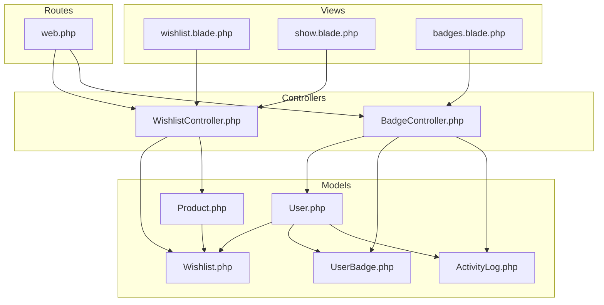
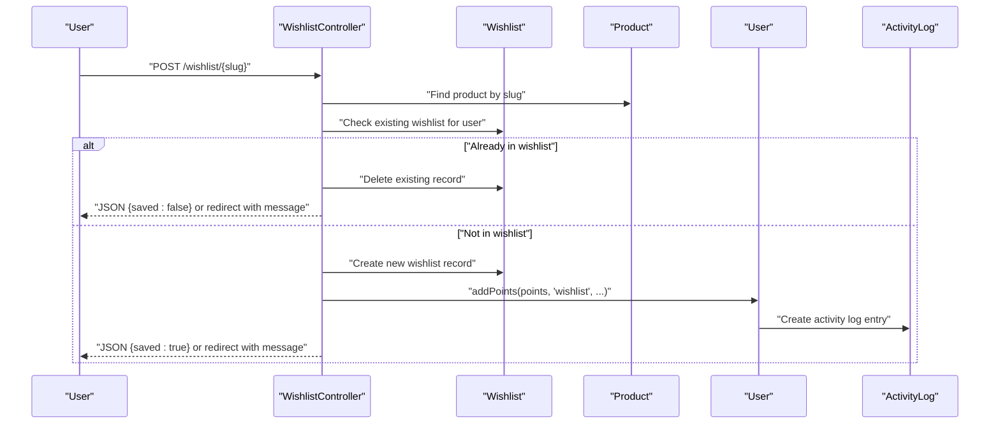
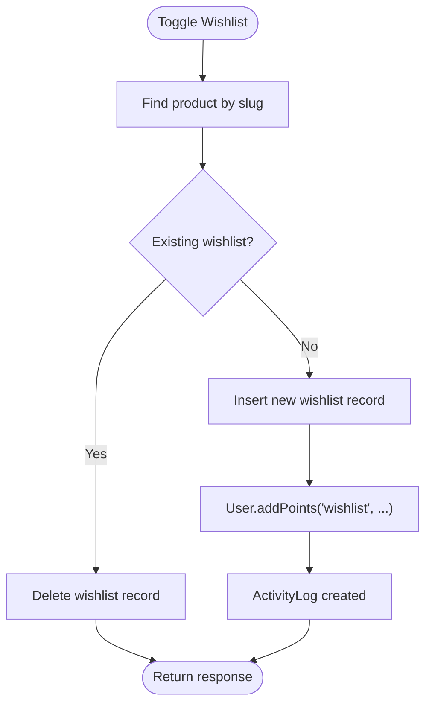
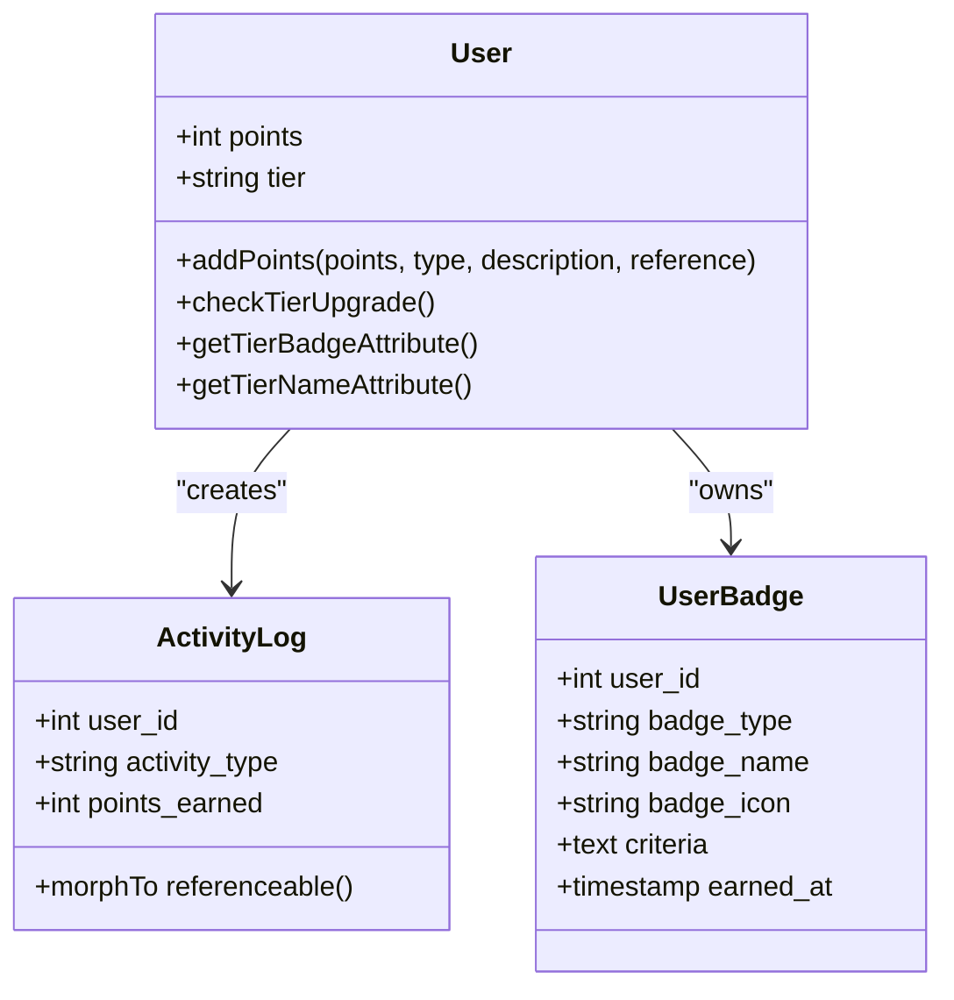
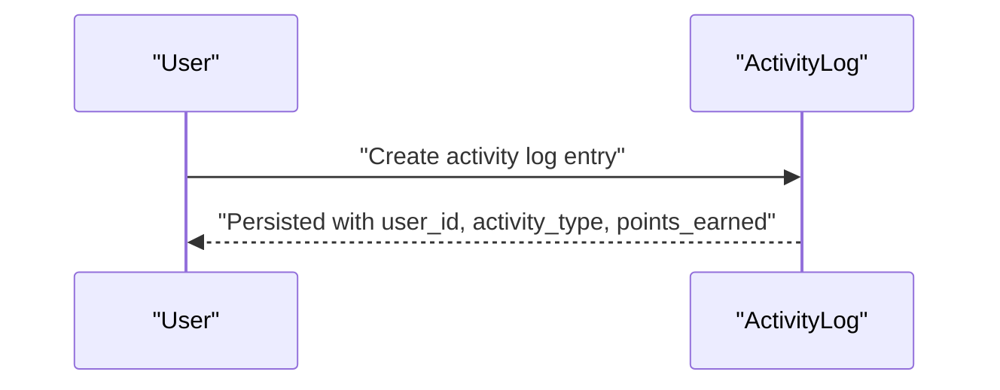
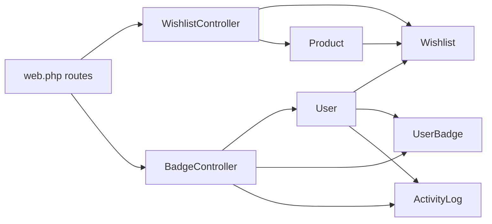

# User Interactions and Wishlist Management

<cite>
**Referenced Files in This Document**
- [Wishlist.php](file://app/Models/Wishlist.php)
- [UserBadge.php](file://app/Models/UserBadge.php)
- [ActivityLog.php](file://app/Models/ActivityLog.php)
- [User.php](file://app/Models/User.php)
- [Product.php](file://app/Models/Product.php)
- [WishlistController.php](file://app/Http/Controllers/Member/WishlistController.php)
- [BadgeController.php](file://app/Http/Controllers/Member/BadgeController.php)
- [web.php](file://routes/web.php)
- [2026_05_24_093819_create_wishlists_table.php](file://database/migrations/2026_05_24_093819_create_wishlists_table.php)
- [2026_07_01_100006_create_user_badges_table.php](file://database/migrations/2026_07_01_100006_create_user_badges_table.php)
- [2026_07_01_100000_add_auth_and_tier_to_users.php](file://database/migrations/2026_07_01_100000_add_auth_and_tier_to_users.php)
- [2026_07_01_100007_add_seo_and_search_to_products.php](file://database/migrations/2026_07_01_100007_add_seo_and_search_to_products.php)
- [wishlist.blade.php](file://resources/views/member/wishlist.blade.php)
- [show.blade.php](file://resources/views/catalog/show.blade.php)
- [badges.blade.php](file://resources/views/member/badges.blade.php)
</cite>

## Table of Contents
1. [Introduction](#introduction)
2. [Project Structure](#project-structure)
3. [Core Components](#core-components)
4. [Architecture Overview](#architecture-overview)
5. [Detailed Component Analysis](#detailed-component-analysis)
6. [Dependency Analysis](#dependency-analysis)
7. [Performance Considerations](#performance-considerations)
8. [Troubleshooting Guide](#troubleshooting-guide)
9. [Conclusion](#conclusion)
10. [Appendices](#appendices)

## Introduction
This document explains KatalogThrift's user interaction models with a focus on Wishlist management, the UserBadge gamification system, and ActivityLog tracking. It describes how users manage favorite products, how badges and points are earned and tracked, and how activity logs support behavioral analytics and audit trails. It also covers integration with the user points and tier progression mechanics, and outlines recommendations for data retention, privacy, and performance optimization.

## Project Structure
The relevant components are organized across Eloquent models, controllers, routes, and Blade templates:
- Models define domain entities and relationships (Wishlist, UserBadge, ActivityLog, User, Product).
- Controllers implement member-facing actions such as toggling wishlists and viewing badges.
- Routes bind URLs to controller actions under member-authenticated contexts.
- Views render user interfaces for wishlist and badges, and integrate with product pages.

**Diagram sources**
- [Wishlist.php:1-29](file://app/Models/Wishlist.php#L1-L29)
- [UserBadge.php:1-18](file://app/Models/UserBadge.php#L1-L18)
- [ActivityLog.php:1-23](file://app/Models/ActivityLog.php#L1-L23)
- [User.php:1-131](file://app/Models/User.php#L1-L131)
- [Product.php:1-132](file://app/Models/Product.php#L1-L132)
- [WishlistController.php:1-48](file://app/Http/Controllers/Member/WishlistController.php#L1-L48)
- [BadgeController.php:1-23](file://app/Http/Controllers/Member/BadgeController.php#L1-L23)
- [web.php:89-116](file://routes/web.php#L89-L116)
- [wishlist.blade.php:49-84](file://resources/views/member/wishlist.blade.php#L49-L84)
- [show.blade.php:392-398](file://resources/views/catalog/show.blade.php#L392-L398)
- [badges.blade.php:75-103](file://resources/views/member/badges.blade.php#L75-L103)

**Section sources**
- [web.php:89-116](file://routes/web.php#L89-L116)
- [WishlistController.php:1-48](file://app/Http/Controllers/Member/WishlistController.php#L1-L48)
- [BadgeController.php:1-23](file://app/Http/Controllers/Member/BadgeController.php#L1-L23)

## Core Components
- Wishlist: Stores user-product favorites with timestamps and uniqueness constraints.
- UserBadge: Tracks earned badges per user with metadata and timestamps.
- ActivityLog: Captures user actions, points earned, and optional references to related entities.
- User: Provides points accumulation, tier progression, and relationship definitions.
- Product: Contains product metadata and search capabilities.

Key implementation highlights:
- Wishlist toggling logic checks existing records and inserts/deletes accordingly.
- ActivityLog creation is triggered alongside points addition in the User model.
- Tier progression is computed based on accumulated points thresholds.

**Section sources**
- [Wishlist.php:1-29](file://app/Models/Wishlist.php#L1-L29)
- [UserBadge.php:1-18](file://app/Models/UserBadge.php#L1-L18)
- [ActivityLog.php:1-23](file://app/Models/ActivityLog.php#L1-L23)
- [User.php:104-129](file://app/Models/User.php#L104-L129)
- [Product.php:122-130](file://app/Models/Product.php#L122-L130)

## Architecture Overview
The system integrates user actions with persistence and analytics:
- Member actions (e.g., wishlist toggle) are handled by controllers.
- Models encapsulate relationships and business logic (points, tiers).
- ActivityLog serves as a central audit trail for behavioral analytics.
- Views render interactive UIs for wishlist and badges.

**Diagram sources**
- [WishlistController.php:25-46](file://app/Http/Controllers/Member/WishlistController.php#L25-L46)
- [Wishlist.php:1-29](file://app/Models/Wishlist.php#L1-L29)
- [Product.php:1-132](file://app/Models/Product.php#L1-L132)
- [User.php:104-117](file://app/Models/User.php#L104-L117)
- [ActivityLog.php:1-23](file://app/Models/ActivityLog.php#L1-L23)

## Detailed Component Analysis

### Wishlist Management
Wishlist enables users to save favorite products. The controller supports:
- Listing saved items with associated product and partner data.
- Toggling a product’s wishlist status for the authenticated user.
- Returning JSON for AJAX requests or redirect responses for web forms.

Operational flow:
- Lookup product by slug.
- Check if a wishlist record exists for the current user.
- Delete if present; otherwise insert a new record.
- For JSON requests, return a saved flag; otherwise flash a success message.

**Diagram sources**
- [WishlistController.php:25-46](file://app/Http/Controllers/Member/WishlistController.php#L25-L46)
- [User.php:104-117](file://app/Models/User.php#L104-L117)
- [ActivityLog.php:1-23](file://app/Models/ActivityLog.php#L1-L23)

Practical examples:
- Toggle wishlist from product page: see the form binding in the product show view.
- View wishlist collection: navigate to the wishlist route and render cards with product details.

**Section sources**
- [WishlistController.php:15-46](file://app/Http/Controllers/Member/WishlistController.php#L15-L46)
- [2026_05_24_093819_create_wishlists_table.php:11-19](file://database/migrations/2026_05_24_093819_create_wishlists_table.php#L11-L19)
- [show.blade.php:392-398](file://resources/views/catalog/show.blade.php#L392-L398)
- [wishlist.blade.php:49-84](file://resources/views/member/wishlist.blade.php#L49-L84)

### UserBadge System and Points/Tier Progression
Gamification comprises:
- Badge records with type, name, icon, criteria, and earned timestamp.
- Points accumulation per activity, persisted via ActivityLog.
- Automatic tier upgrade based on point thresholds.

Key behaviors:
- Points are added through the User model’s points helper, which also creates an ActivityLog entry and triggers tier evaluation.
- Tier names and emoji are derived from the current tier value.
- Badge listing and recent activity logs are exposed via the member badges view.

**Diagram sources**
- [User.php:104-129](file://app/Models/User.php#L104-L129)
- [ActivityLog.php:1-23](file://app/Models/ActivityLog.php#L1-L23)
- [UserBadge.php:1-18](file://app/Models/UserBadge.php#L1-L18)

Badge acquisition workflow:
- An action occurs (e.g., wishlist toggle), triggering points addition.
- ActivityLog captures the event with points and reference.
- Optional badge checks can be implemented in application logic to award badges based on criteria.

**Section sources**
- [User.php:104-129](file://app/Models/User.php#L104-L129)
- [2026_07_01_100006_create_user_badges_table.php:11-21](file://database/migrations/2026_07_01_100006_create_user_badges_table.php#L11-L21)
- [2026_07_01_100006_create_user_badges_table.php:24-33](file://database/migrations/2026_07_01_100006_create_user_badges_table.php#L24-L33)
- [BadgeController.php:9-21](file://app/Http/Controllers/Member/BadgeController.php#L9-L21)
- [badges.blade.php:75-103](file://resources/views/member/badges.blade.php#L75-L103)

### ActivityLog Tracking for Audit Trails
ActivityLog stores:
- User actions (e.g., wishlist, review, follow, question, share).
- Points earned per action.
- Optional polymorphic reference to related entities (e.g., product, outfit).
- Timestamps for creation and updates.

Usage:
- Created automatically when points are awarded.
- Used for recent activity feeds and analytics dashboards.

**Diagram sources**
- [User.php:108-115](file://app/Models/User.php#L108-L115)
- [ActivityLog.php:8-11](file://app/Models/ActivityLog.php#L8-L11)

**Section sources**
- [ActivityLog.php:1-23](file://app/Models/ActivityLog.php#L1-L23)
- [2026_07_01_100006_create_user_badges_table.php:24-33](file://database/migrations/2026_07_01_100006_create_user_badges_table.php#L24-L33)

### Relationship Between Wishlists and Recommendations
- Wishlist entries connect users to products and can inform personalized recommendations.
- Product search includes full-text indexing to support discovery.
- Wishlist statistics can be aggregated for analytics (e.g., per partner insights).

Recommendation integration:
- Use user wishlist preferences to bias recommendation scoring.
- Combine with product attributes (brand, category, rating) and search indices.

**Section sources**
- [2026_07_01_100007_add_seo_and_search_to_products.php:10-19](file://database/migrations/2026_07_01_100007_add_seo_and_search_to_products.php#L10-L19)
- [Product.php:122-130](file://app/Models/Product.php#L122-L130)

## Dependency Analysis
The following diagram maps core dependencies among models, controllers, and routes:

**Diagram sources**
- [WishlistController.php:1-48](file://app/Http/Controllers/Member/WishlistController.php#L1-L48)
- [BadgeController.php:1-23](file://app/Http/Controllers/Member/BadgeController.php#L1-L23)
- [Wishlist.php:1-29](file://app/Models/Wishlist.php#L1-L29)
- [UserBadge.php:1-18](file://app/Models/UserBadge.php#L1-L18)
- [ActivityLog.php:1-23](file://app/Models/ActivityLog.php#L1-L23)
- [User.php:1-131](file://app/Models/User.php#L1-L131)
- [Product.php:1-132](file://app/Models/Product.php#L1-L132)
- [web.php:89-116](file://routes/web.php#L89-L116)

**Section sources**
- [web.php:89-116](file://routes/web.php#L89-L116)
- [WishlistController.php:1-48](file://app/Http/Controllers/Member/WishlistController.php#L1-L48)
- [BadgeController.php:1-23](file://app/Http/Controllers/Member/BadgeController.php#L1-L23)

## Performance Considerations
- Indexing and constraints:
  - Unique composite index on (user_id, product_id) prevents duplicates and speeds lookups.
  - Foreign keys maintain referential integrity.
- Query optimization:
  - Eager load related data (product and partner) when listing wishlists.
  - Use pagination for activity logs and badges lists.
- Search performance:
  - Full-text index on product name, brand, and description improves search speed.
- Points and tier updates:
  - Batch tier recalculations can be scheduled if needed; current logic evaluates after each points update.
- Caching:
  - Cache frequently accessed user badges and recent activity logs for the member dashboard.

[No sources needed since this section provides general guidance]

## Troubleshooting Guide
Common scenarios and resolutions:
- Duplicate wishlist entries:
  - Ensure unique constraint is enforced; verify no concurrent requests bypass validation.
- Missing product in wishlist:
  - Confirm product slug resolution and that the product exists.
- Activity log not recorded:
  - Verify points addition path and that ActivityLog creation occurs after points increment.
- Tier not upgrading:
  - Check point thresholds and confirm the evaluation logic runs after points addition.

**Section sources**
- [2026_05_24_093819_create_wishlists_table.php:16-18](file://database/migrations/2026_05_24_093819_create_wishlists_table.php#L16-L18)
- [User.php:119-129](file://app/Models/User.php#L119-L129)

## Conclusion
KatalogThrift’s user interaction models provide a robust foundation for engagement:
- Wishlist management offers seamless favorite tracking with immediate feedback.
- The UserBadge and ActivityLog systems enable gamification and comprehensive audit trails.
- Points and tier mechanics incentivize participation while ActivityLog supports analytics.
- Product search and wishlist data can power personalized recommendations.
Future enhancements may include automated badge triggers, extended retention policies, and advanced analytics pipelines.

[No sources needed since this section summarizes without analyzing specific files]

## Appendices

### Data Retention and Privacy
- Retention:
  - Define lifecycle policies for ActivityLog and UserBadge records (e.g., retain activity logs for 12 months).
- Privacy:
  - Anonymize or pseudonymize logs where required.
  - Comply with data minimization and user consent requirements.

[No sources needed since this section provides general guidance]

### API and Integration Notes
- Member-authenticated routes handle wishlist toggles and badges access.
- The Sanctum-protected API endpoint returns authenticated user data for client-side integration.

**Section sources**
- [web.php:89-116](file://routes/web.php#L89-L116)
- [api.php:17-19](file://routes/api.php#L17-L19)