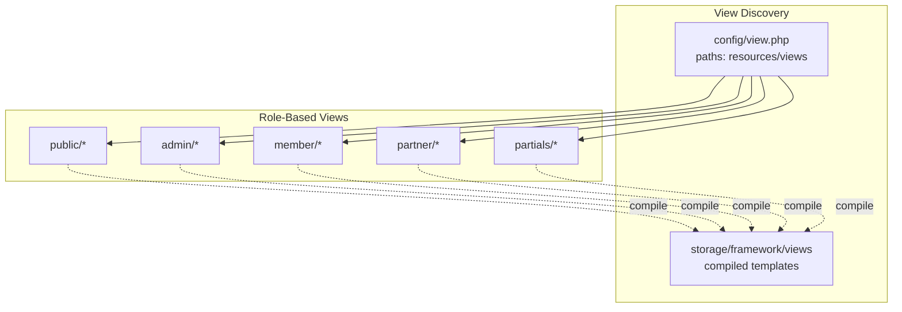
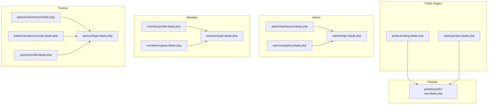
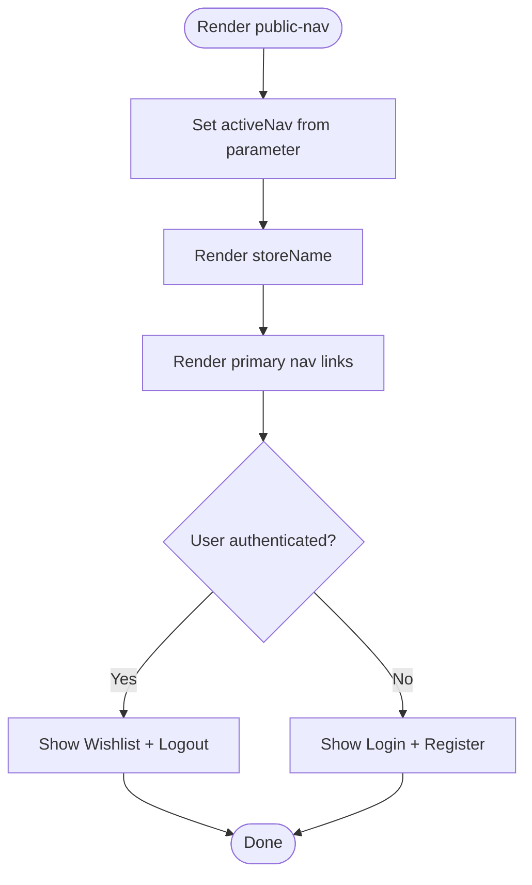
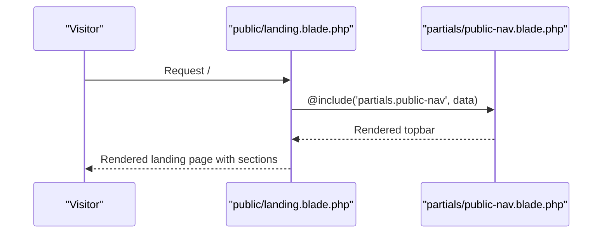
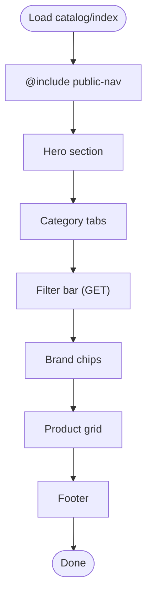
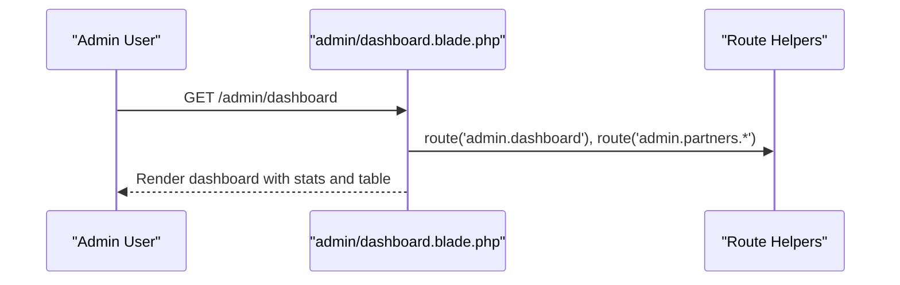
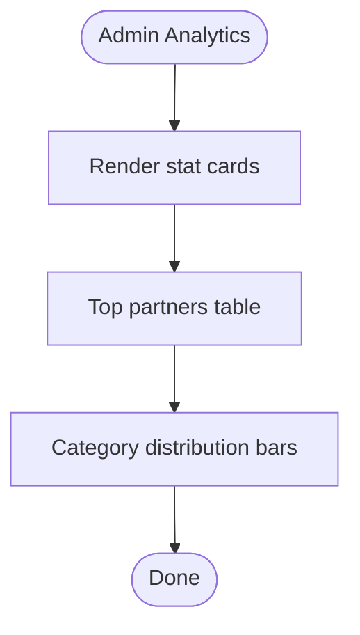
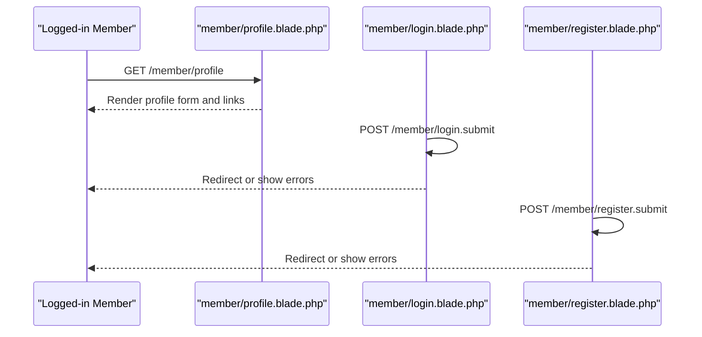
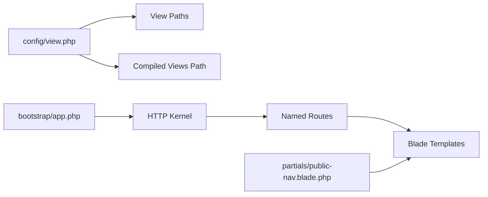

# Blade Templating System

<cite>
**Referenced Files in This Document**
- [welcome.blade.php](file://resources/views/welcome.blade.php)
- [public-nav.blade.php](file://resources/views/partials/public-nav.blade.php)
- [landing.blade.php](file://resources/views/public/landing.blade.php)
- [catalog/index.blade.php](file://resources/views/catalog/index.blade.php)
- [admin/dashboard.blade.php](file://resources/views/admin/dashboard.blade.php)
- [admin/analytics.blade.php](file://resources/views/admin/analytics.blade.php)
- [admin/login.blade.php](file://resources/views/admin/login.blade.php)
- [member/profile.blade.php](file://resources/views/member/profile.blade.php)
- [member/register.blade.php](file://resources/views/member/register.blade.php)
- [member/login.blade.php](file://resources/views/member/login.blade.php)
- [partner/dashboard.blade.php](file://resources/views/partner/dashboard.blade.php)
- [partner/products/create.blade.php](file://resources/views/partner/products/create.blade.php)
- [partner/profile.blade.php](file://resources/views/partner/profile.blade.php)
- [partner/login.blade.php](file://resources/views/partner/login.blade.php)
- [view.php](file://config/view.php)
- [app.php](file://bootstrap/app.php)
</cite>

## Table of Contents
1. [Introduction](#introduction)
2. [Project Structure](#project-structure)
3. [Core Components](#core-components)
4. [Architecture Overview](#architecture-overview)
5. [Detailed Component Analysis](#detailed-component-analysis)
6. [Dependency Analysis](#dependency-analysis)
7. [Performance Considerations](#performance-considerations)
8. [Troubleshooting Guide](#troubleshooting-guide)
9. [Conclusion](#conclusion)

## Introduction
This document explains KatalogThrift’s Blade templating system. It covers template inheritance patterns, layout composition, role-based views (admin, partner, member), Blade syntax and directives, loops and conditionals, partials and components, reusable UI patterns, data passing, dynamic rendering, naming conventions, discovery paths, caching, performance, and debugging techniques. The goal is to help developers understand how views are structured and how to extend or maintain them effectively.

## Project Structure
KatalogThrift organizes views under resources/views with clear role-based folders:
- admin/: Administrative dashboards and management pages
- member/: Member-facing pages (profile, login, registration)
- partner/: Partner (store) portal pages (dashboard, product management)
- public/: Public-facing pages (landing, catalog)
- partials/: Reusable partials (e.g., navigation)

The Blade compiler compiles templates into PHP classes and stores them in storage/framework/views by default. The view path is configured to point to resources/views.



**Diagram sources**
- [view.php:16-34](file://config/view.php#L16-L34)

**Section sources**
- [view.php:16-34](file://config/view.php#L16-L34)

## Core Components
- Partial templates: Shared UI fragments (e.g., public-nav) included across pages
- Role-specific layouts: Admin, partner, and member dashboards share common sidebar/navigation patterns
- Public landing and catalog: Responsive, data-driven pages with filters and grids
- Form-heavy partner product creation page: Demonstrates Blade forms, conditionals, and client-side helpers
- Authentication pages: Login and registration flows for admin, member, and partner roles

Key Blade constructs observed:
- Template inclusion: @include with data passing
- Conditional rendering: @if/@endif, @isset/@endisset, @auth/@endauth
- Looping: @foreach/@endforeach
- CSRF and form methods: @csrf, @method(...)
- Route helpers: route(...) for links and actions
- Escaping and formatting: e(), Str::limit(), number_format()

**Section sources**
- [public-nav.blade.php:1-27](file://resources/views/partials/public-nav.blade.php#L1-L27)
- [landing.blade.php:91-91](file://resources/views/public/landing.blade.php#L91-L91)
- [catalog/index.blade.php:194-239](file://resources/views/catalog/index.blade.php#L194-L239)
- [admin/dashboard.blade.php:85-126](file://resources/views/admin/dashboard.blade.php#L85-L126)
- [partner/products/create.blade.php:80-239](file://resources/views/partner/products/create.blade.php#L80-L239)

## Architecture Overview
The templating architecture follows a modular pattern:
- Partials encapsulate shared UI (navigation, branding)
- Role-specific master pages define layout scaffolding (sidebar, header, footer)
- Public pages compose partials and render dynamic content
- Forms submit to named routes with proper CSRF tokens



**Diagram sources**
- [landing.blade.php:91-91](file://resources/views/public/landing.blade.php#L91-L91)
- [catalog/index.blade.php:133-133](file://resources/views/catalog/index.blade.php#L133-L133)
- [public-nav.blade.php:1-27](file://resources/views/partials/public-nav.blade.php#L1-L27)
- [admin/dashboard.blade.php:47-77](file://resources/views/admin/dashboard.blade.php#L47-L77)
- [admin/analytics.blade.php:38-58](file://resources/views/admin/analytics.blade.php#L38-L58)
- [admin/login.blade.php:59-68](file://resources/views/admin/login.blade.php#L59-L68)
- [member/profile.blade.php:35-48](file://resources/views/member/profile.blade.php#L35-L48)
- [member/register.blade.php:28-45](file://resources/views/member/register.blade.php#L28-L45)
- [member/login.blade.php:38-44](file://resources/views/member/login.blade.php#L38-L44)
- [partner/dashboard.blade.php:47-68](file://resources/views/partner/dashboard.blade.php#L47-L68)
- [partner/products/create.blade.php:80-239](file://resources/views/partner/products/create.blade.php#L80-L239)
- [partner/profile.blade.php:64-103](file://resources/views/partner/profile.blade.php#L64-L103)
- [partner/login.blade.php:33-39](file://resources/views/partner/login.blade.php#L33-L39)

## Detailed Component Analysis

### Public Navigation Partial
Purpose: Provide a responsive topbar with brand, navigation links, and authentication controls. It accepts an activeNav parameter and renders active states accordingly. Uses @auth/@endauth to toggle between logged-in and guest states.



**Diagram sources**
- [public-nav.blade.php:1-27](file://resources/views/partials/public-nav.blade.php#L1-L27)

**Section sources**
- [public-nav.blade.php:1-27](file://resources/views/partials/public-nav.blade.php#L1-L27)

### Public Landing Page
Purpose: Entry point for anonymous users. Composes public-nav partial and renders hero, features, new arrivals, editorial, UGC, and footer. Demonstrates:
- @include with data passing
- @if/@endif blocks for conditional sections
- @foreach/@endforeach loops for grids
- route(...) helpers for internal and external links
- Number formatting and safe HTML rendering



**Diagram sources**
- [landing.blade.php:91-91](file://resources/views/public/landing.blade.php#L91-L91)
- [public-nav.blade.php:1-27](file://resources/views/partials/public-nav.blade.php#L1-L27)

**Section sources**
- [landing.blade.php:91-204](file://resources/views/public/landing.blade.php#L91-L204)

### Catalog Index Page
Purpose: Product catalog with filtering, sorting, and brand chips. Demonstrates:
- Complex @if/@else/@endif branching
- @foreach loops for product grids
- Dynamic route generation with filters
- Client-side script for brand filtering
- Number formatting and conditional badges



**Diagram sources**
- [catalog/index.blade.php:133-380](file://resources/views/catalog/index.blade.php#L133-L380)

**Section sources**
- [catalog/index.blade.php:192-334](file://resources/views/catalog/index.blade.php#L192-L334)

### Admin Dashboard
Purpose: Central administrative hub with stats, recent registrations, and navigation. Demonstrates:
- Sidebar navigation with active indicators
- Stats cards and alert messages
- Data-driven tables with conditional badges
- Route helpers and logout form with CSRF



**Diagram sources**
- [admin/dashboard.blade.php:53-126](file://resources/views/admin/dashboard.blade.php#L53-L126)

**Section sources**
- [admin/dashboard.blade.php:47-127](file://resources/views/admin/dashboard.blade.php#L47-L127)

### Admin Analytics
Purpose: Platform analytics with top partners and category distribution. Demonstrates:
- Stat cards with conditional coloring
- Data-driven tables
- Percentage bars for distribution



**Diagram sources**
- [admin/analytics.blade.php:64-106](file://resources/views/admin/analytics.blade.php#L64-L106)

**Section sources**
- [admin/analytics.blade.php:38-107](file://resources/views/admin/analytics.blade.php#L38-L107)

### Member Views
- Profile: Topbar, alerts, user info, editable fields, and quick links
- Login: Email/password form with errors and partner link
- Registration: Form with validation feedback



**Diagram sources**
- [member/profile.blade.php:35-80](file://resources/views/member/profile.blade.php#L35-L80)
- [member/login.blade.php:38-44](file://resources/views/member/login.blade.php#L38-L44)
- [member/register.blade.php:28-45](file://resources/views/member/register.blade.php#L28-L45)

**Section sources**
- [member/profile.blade.php:35-80](file://resources/views/member/profile.blade.php#L35-L80)
- [member/login.blade.php:31-36](file://resources/views/member/login.blade.php#L31-L36)
- [member/register.blade.php:28-45](file://resources/views/member/register.blade.php#L28-L45)

### Partner Views
- Dashboard: Stats, recent products, and navigation
- Product Creation: Multi-section form with tabs, size chart, variants, images, SEO, and status toggles
- Profile: Store info, links, and logo upload
- Login: Partner portal login with redirections

```mermaid
sequenceDiagram
participant Partner as "Partner User"
participant Dashboard as "partner/dashboard.blade.php"
participant Create as "partner/products/create.blade.php"
participant Profile as "partner/profile.blade.php"
participant Login as "partner/login.blade.php"
Partner->>Dashboard : GET /partner/dashboard
Dashboard-->>Partner : Render stats and product table
Partner->>Create : GET /partner/products/create
Create-->>Partner : Render form with tabs and previews
Partner->>Profile : GET /partner/profile
Profile-->>Partner : Render store info form
Login->>Login : POST /partner/login.submit
Login-->>Partner : Redirect or show errors
```

**Diagram sources**
- [partner/dashboard.blade.php:70-132](file://resources/views/partner/dashboard.blade.php#L70-L132)
- [partner/products/create.blade.php:80-239](file://resources/views/partner/products/create.blade.php#L80-L239)
- [partner/profile.blade.php:64-103](file://resources/views/partner/profile.blade.php#L64-L103)
- [partner/login.blade.php:33-39](file://resources/views/partner/login.blade.php#L33-L39)

**Section sources**
- [partner/dashboard.blade.php:70-132](file://resources/views/partner/dashboard.blade.php#L70-L132)
- [partner/products/create.blade.php:80-239](file://resources/views/partner/products/create.blade.php#L80-L239)
- [partner/profile.blade.php:64-103](file://resources/views/partner/profile.blade.php#L64-L103)
- [partner/login.blade.php:33-39](file://resources/views/partner/login.blade.php#L33-L39)

## Dependency Analysis
- View discovery: config/view.php defines the resources/views path and compiled storage location
- Application bootstrap: bootstrap/app.php initializes the framework and binds contracts; Blade compilation occurs during runtime unless cached
- Routing: Templates reference named routes via route(...), ensuring decoupling from hardcoded URLs
- Partials: public-nav is included across public pages, promoting reuse and consistency



**Diagram sources**
- [view.php:16-34](file://config/view.php#L16-L34)
- [app.php:14-42](file://bootstrap/app.php#L14-L42)
- [public-nav.blade.php:1-27](file://resources/views/partials/public-nav.blade.php#L1-L27)

**Section sources**
- [view.php:16-34](file://config/view.php#L16-L34)
- [app.php:14-42](file://bootstrap/app.php#L14-L42)

## Performance Considerations
- Template caching: Blade compiles templates to PHP classes; compiled views are stored in storage/framework/views. Use php artisan view:cache in production to speed up template resolution.
- Asset delivery: Prefer CDN-hosted fonts and icons; lazy-loading images in grids reduces initial payload.
- Minimal reflows: Client-side filtering in catalog uses DOM manipulation; keep lists reasonably sized to avoid heavy updates.
- Conditional rendering: Use @if/@endif judiciously to avoid rendering heavy blocks when data is absent.
- Partial reuse: Leverage partials (e.g., public-nav) to reduce duplication and improve maintainability.

[No sources needed since this section provides general guidance]

## Troubleshooting Guide
Common issues and remedies:
- Missing data variables: Ensure controllers pass required variables (e.g., $storeName, $products). Use @isset or defaults to prevent undefined variable notices.
- Incorrect route names: Verify named routes in route definitions; templates reference route('...').
- CSRF failures: Forms must include @csrf and use @method('PUT'|'DELETE') when required.
- Partial not found: Confirm partial path matches resources/views/partials/public-nav.blade.php.
- Compiled view conflicts: Clear compiled views with php artisan view:clear if stale templates cause unexpected behavior.

**Section sources**
- [admin/dashboard.blade.php:49-50](file://resources/views/admin/dashboard.blade.php#L49-L50)
- [catalog/index.blade.php:194-239](file://resources/views/catalog/index.blade.php#L194-L239)
- [public-nav.blade.php:4-4](file://resources/views/partials/public-nav.blade.php#L4-L4)

## Conclusion
KatalogThrift’s Blade templating system emphasizes modularity and role-based separation. Partials encapsulate shared UI, while role-specific dashboards provide cohesive experiences. Blade directives enable clean conditionals and loops, and route helpers ensure maintainable links. For optimal performance, leverage view caching, minimize unnecessary rendering, and reuse partials consistently. The structure supports scalable growth across admin, partner, member, and public domains.