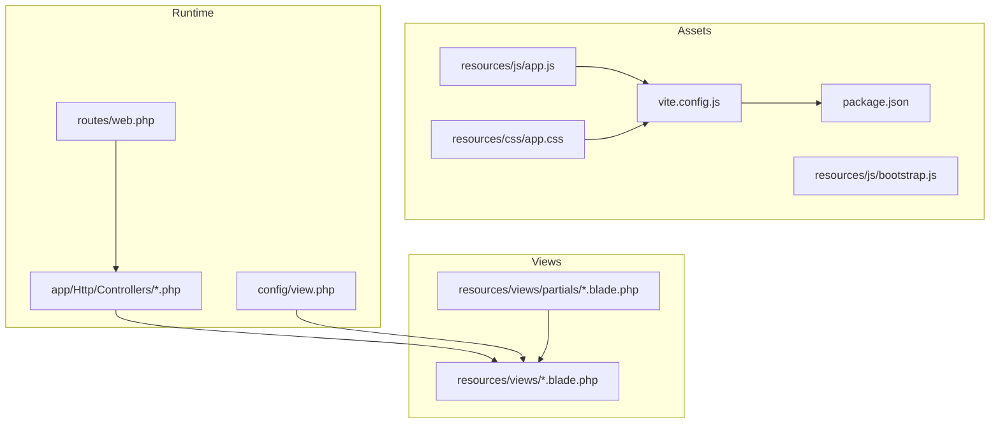
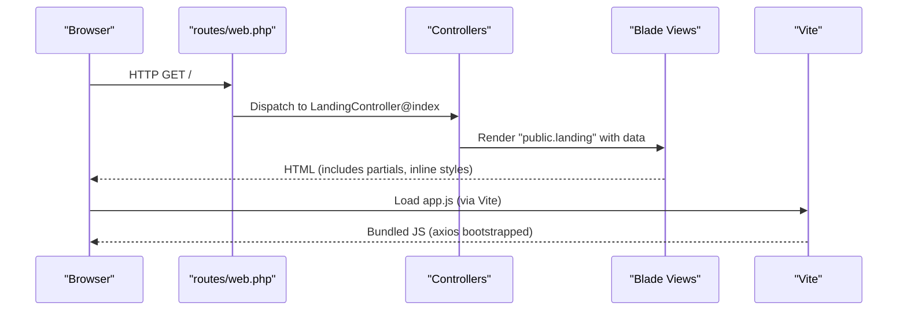
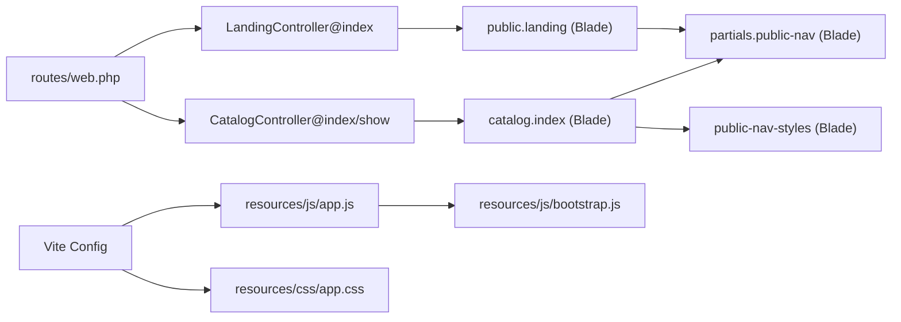

# Frontend Development

<cite>
**Referenced Files in This Document**
- [vite.config.js](file://vite.config.js)
- [package.json](file://package.json)
- [resources/css/app.css](file://resources/css/app.css)
- [resources/js/app.js](file://resources/js/app.js)
- [resources/js/bootstrap.js](file://resources/js/bootstrap.js)
- [resources/views/welcome.blade.php](file://resources/views/welcome.blade.php)
- [resources/views/partials/public-nav.blade.php](file://resources/views/partials/public-nav.blade.php)
- [resources/views/partials/public-nav-styles.blade.php](file://resources/views/partials/public-nav-styles.blade.php)
- [resources/views/member/login.blade.php](file://resources/views/member/login.blade.php)
- [resources/views/admin/dashboard.blade.php](file://resources/views/admin/dashboard.blade.php)
- [resources/views/catalog/index.blade.php](file://resources/views/catalog/index.blade.php)
- [app/Http/Controllers/CatalogController.php](file://app/Http/Controllers/CatalogController.php)
- [app/Http/Controllers/LandingController.php](file://app/Http/Controllers/LandingController.php)
- [routes/web.php](file://routes/web.php)
- [config/view.php](file://config/view.php)
</cite>

## Table of Contents
1. [Introduction](#introduction)
2. [Project Structure](#project-structure)
3. [Core Components](#core-components)
4. [Architecture Overview](#architecture-overview)
5. [Detailed Component Analysis](#detailed-component-analysis)
6. [Dependency Analysis](#dependency-analysis)
7. [Performance Considerations](#performance-considerations)
8. [Troubleshooting Guide](#troubleshooting-guide)
9. [Conclusion](#conclusion)
10. [Appendices](#appendices)

## Introduction
This document explains the frontend development approach for KatalogThrift’s Blade-based web application. It covers the Blade templating engine, layout composition, and component patterns; Tailwind CSS usage and custom styling; Vite asset bundling and JavaScript integration; frontend routing and form handling; AJAX interactions; security practices; and practical guidance for building reusable templates and interactive features.

## Project Structure
KatalogThrift organizes frontend assets and views as follows:
- Blade views live under resources/views and are discovered by the configured view path.
- Assets are managed via Vite with a Laravel plugin, sourcing JS from resources/js and CSS from resources/css.
- Controllers prepare data passed into Blade views, shaping the frontend content and behavior.

**Diagram sources**
- [routes/web.php:1-240](file://routes/web.php#L1-L240)
- [app/Http/Controllers/CatalogController.php:1-197](file://app/Http/Controllers/CatalogController.php#L1-L197)
- [app/Http/Controllers/LandingController.php:1-48](file://app/Http/Controllers/LandingController.php#L1-L48)
- [config/view.php:1-37](file://config/view.php#L1-L37)
- [vite.config.js:1-12](file://vite.config.js#L1-L12)
- [package.json:1-14](file://package.json#L1-L14)
- [resources/js/app.js:1-2](file://resources/js/app.js#L1-L2)
- [resources/js/bootstrap.js:1-33](file://resources/js/bootstrap.js#L1-L33)
- [resources/css/app.css:1-1](file://resources/css/app.css#L1-L1)

**Section sources**
- [config/view.php:16-36](file://config/view.php#L16-L36)
- [routes/web.php:1-240](file://routes/web.php#L1-L240)

## Core Components
- Blade templating engine: Views are resolved from resources/views and support includes, sections, and component-like partials.
- Asset pipeline: Vite compiles JS and CSS with hot module replacement during development and optimized builds for production.
- Bootstrap HTTP client: Axios is globally configured for XHR requests and CSRF-aware headers.
- Routing: Web routes map URLs to controllers that render Blade views with prepared data.

**Section sources**
- [resources/views/partials/public-nav.blade.php:1-27](file://resources/views/partials/public-nav.blade.php#L1-L27)
- [resources/views/catalog/index.blade.php:1-380](file://resources/views/catalog/index.blade.php#L1-L380)
- [vite.config.js:1-12](file://vite.config.js#L1-L12)
- [resources/js/bootstrap.js:1-33](file://resources/js/bootstrap.js#L1-L33)
- [routes/web.php:1-240](file://routes/web.php#L1-L240)

## Architecture Overview
The frontend rendering flow connects routes to controllers, which pass data to Blade views. Blade composes layouts and partials, while Vite bundles scripts and styles.

**Diagram sources**
- [routes/web.php:12-46](file://routes/web.php#L12-L46)
- [app/Http/Controllers/LandingController.php:12-46](file://app/Http/Controllers/LandingController.php#L12-L46)
- [resources/views/catalog/index.blade.php:1-380](file://resources/views/catalog/index.blade.php#L1-L380)
- [vite.config.js:1-12](file://vite.config.js#L1-L12)
- [resources/js/app.js:1-2](file://resources/js/app.js#L1-L2)
- [resources/js/bootstrap.js:1-33](file://resources/js/bootstrap.js#L1-L33)

## Detailed Component Analysis

### Blade Templating Engine and Layout Composition
- Partial inclusion: Views include reusable partials (e.g., navigation) and inject variables such as active nav and store name.
- Inline styles and Tailwind: Some pages embed scoped CSS; others rely on Tailwind utilities for rapid prototyping and responsive design.
- Data binding: Controllers prepare arrays and collections passed into views, enabling dynamic rendering of lists, filters, and computed values.

Practical example references:
- Navigation partial usage and variable injection: [resources/views/catalog/index.blade.php:133-133](file://resources/views/catalog/index.blade.php#L133-L133)
- Partial definition and conditional auth links: [resources/views/partials/public-nav.blade.php:1-27](file://resources/views/partials/public-nav.blade.php#L1-L27)
- Scoped CSS for topbar and page sections: [resources/views/catalog/index.blade.php:7-130](file://resources/views/catalog/index.blade.php#L7-L130)

**Section sources**
- [resources/views/partials/public-nav.blade.php:1-27](file://resources/views/partials/public-nav.blade.php#L1-L27)
- [resources/views/catalog/index.blade.php:7-130](file://resources/views/catalog/index.blade.php#L7-L130)
- [resources/views/catalog/index.blade.php:133-133](file://resources/views/catalog/index.blade.php#L133-L133)

### Tailwind CSS Integration and Responsive Design
- Utility-first classes: Tailwind utilities are applied directly in views for spacing, colors, shadows, and responsive breakpoints.
- Dark mode variants: Classes toggle dark variants and media queries enable responsive adjustments.
- Example patterns:
  - Background and text color toggles for light/dark modes.
  - Grid and gap utilities for product listings.
  - Responsive breakpoint classes for mobile-first layouts.

Reference examples:
- Tailwind utilities and dark mode classes: [resources/views/welcome.blade.php:14-16](file://resources/views/welcome.blade.php#L14-L16)
- Responsive grid and spacing: [resources/views/catalog/index.blade.php:80-129](file://resources/views/catalog/index.blade.php#L80-L129)

**Section sources**
- [resources/views/welcome.blade.php:14-16](file://resources/views/welcome.blade.php#L14-L16)
- [resources/views/catalog/index.blade.php:80-129](file://resources/views/catalog/index.blade.php#L80-L129)

### Custom Styling Approaches
- Scoped inline styles: Pages define CSS blocks for specific sections (e.g., topbar, hero, filters).
- CSS variables: Catalog theme defines a set of CSS variables for consistent theming across components.
- Partialized styles: Reusable style partials encapsulate component-specific CSS.

References:
- Inline CSS block for catalog page: [resources/views/catalog/index.blade.php:7-130](file://resources/views/catalog/index.blade.php#L7-L130)
- Style partial for navigation: [resources/views/partials/public-nav-styles.blade.php:1-12](file://resources/views/partials/public-nav-styles.blade.php#L1-L12)

**Section sources**
- [resources/views/catalog/index.blade.php:7-130](file://resources/views/catalog/index.blade.php#L7-L130)
- [resources/views/partials/public-nav-styles.blade.php:1-12](file://resources/views/partials/public-nav-styles.blade.php#L1-L12)

### Vite Asset Bundling and JavaScript Integration
- Inputs: Vite is configured to bundle resources/css/app.css and resources/js/app.js.
- Dev/build scripts: NPM scripts trigger Vite dev server and production builds.
- Bootstrap: resources/js/bootstrap.js wires axios defaults and comment blocks for optional Echo/Pusher integrations.

References:
- Vite configuration: [vite.config.js:1-12](file://vite.config.js#L1-L12)
- NPM scripts: [package.json:4-6](file://package.json#L4-L6)
- JS entry and bootstrap: [resources/js/app.js:1-2](file://resources/js/app.js#L1-L2), [resources/js/bootstrap.js:1-33](file://resources/js/bootstrap.js#L1-L33)

**Section sources**
- [vite.config.js:1-12](file://vite.config.js#L1-L12)
- [package.json:4-6](file://package.json#L4-L6)
- [resources/js/app.js:1-2](file://resources/js/app.js#L1-L2)
- [resources/js/bootstrap.js:1-33](file://resources/js/bootstrap.js#L1-L33)

### Frontend Routing and Form Handling
- Routes map to controllers that render Blade views with data.
- Forms use method attributes and CSRF tokens for secure submissions.
- AJAX interactions can leverage the global axios configuration.

References:
- Route definitions: [routes/web.php:1-240](file://routes/web.php#L1-L240)
- Login form with CSRF and redirects: [resources/views/member/login.blade.php:38-44](file://resources/views/member/login.blade.php#L38-L44)
- Admin dashboard with forms and navigation: [resources/views/admin/dashboard.blade.php:73-76](file://resources/views/admin/dashboard.blade.php#L73-L76)

**Section sources**
- [routes/web.php:1-240](file://routes/web.php#L1-L240)
- [resources/views/member/login.blade.php:38-44](file://resources/views/member/login.blade.php#L38-L44)
- [resources/views/admin/dashboard.blade.php:73-76](file://resources/views/admin/dashboard.blade.php#L73-L76)

### AJAX Interactions and Interactive Features
- Axios defaults are configured for XHR and automatic CSRF header handling.
- Client-side filtering and interactivity are demonstrated in catalog views using vanilla script blocks.
- Recommended enhancements:
  - Encapsulate interactive logic in modular JS modules imported by app.js.
  - Use fetch/axios for AJAX endpoints backing search or actions.

References:
- Axios bootstrap: [resources/js/bootstrap.js:7-10](file://resources/js/bootstrap.js#L7-L10)
- Client-side brand filtering script: [resources/views/catalog/index.blade.php:362-377](file://resources/views/catalog/index.blade.php#L362-L377)

**Section sources**
- [resources/js/bootstrap.js:7-10](file://resources/js/bootstrap.js#L7-L10)
- [resources/views/catalog/index.blade.php:362-377](file://resources/views/catalog/index.blade.php#L362-L377)

### Component Reusability and Template Inheritance Patterns
- Partials for navigation and styles promote reuse across pages.
- Blade includes pass variables to partials, enabling dynamic active states and branding.
- Consider extracting common UI patterns into dedicated partials and composing views with include directives.

References:
- Partial include with variables: [resources/views/catalog/index.blade.php:133-133](file://resources/views/catalog/index.blade.php#L133-L133)
- Partial definition: [resources/views/partials/public-nav.blade.php:1-27](file://resources/views/partials/public-nav.blade.php#L1-L27)

**Section sources**
- [resources/views/catalog/index.blade.php:133-133](file://resources/views/catalog/index.blade.php#L133-L133)
- [resources/views/partials/public-nav.blade.php:1-27](file://resources/views/partials/public-nav.blade.php#L1-L27)

### View Composition Patterns
- Controllers prepare data arrays and collections; views iterate and conditionally render content.
- Dynamic computed values (e.g., WhatsApp links, availability badges) are generated per item.
- Pagination and filtering are handled server-side via query parameters.

References:
- Data preparation in controllers: [app/Http/Controllers/CatalogController.php:30-82](file://app/Http/Controllers/CatalogController.php#L30-L82), [app/Http/Controllers/LandingController.php:12-46](file://app/Http/Controllers/LandingController.php#L12-L46)
- Product iteration and actions: [resources/views/catalog/index.blade.php:275-334](file://resources/views/catalog/index.blade.php#L275-L334)

**Section sources**
- [app/Http/Controllers/CatalogController.php:30-82](file://app/Http/Controllers/CatalogController.php#L30-L82)
- [app/Http/Controllers/LandingController.php:12-46](file://app/Http/Controllers/LandingController.php#L12-L46)
- [resources/views/catalog/index.blade.php:275-334](file://resources/views/catalog/index.blade.php#L275-L334)

### Frontend Security Measures
- CSRF protection: Forms include CSRF tokens; axios sends appropriate headers.
- Input validation: Blade templates render server-provided messages and old input values.
- XSS prevention: Blade escapes output by default; avoid raw() unless absolutely necessary and trusted.

References:
- CSRF-enabled forms: [resources/views/member/login.blade.php:38-44](file://resources/views/member/login.blade.php#L38-L44), [resources/views/admin/dashboard.blade.php:112-118](file://resources/views/admin/dashboard.blade.php#L112-L118)
- Old input usage: [resources/views/member/login.blade.php:41-41](file://resources/views/member/login.blade.php#L41-L41)

**Section sources**
- [resources/views/member/login.blade.php:38-44](file://resources/views/member/login.blade.php#L38-L44)
- [resources/views/admin/dashboard.blade.php:112-118](file://resources/views/admin/dashboard.blade.php#L112-L118)

### Practical Examples
- Creating a template:
  - Use a Blade view to include shared partials and render data from a controller.
  - Reference: [resources/views/catalog/index.blade.php:133-133](file://resources/views/catalog/index.blade.php#L133-L133)
- Styling implementation:
  - Apply Tailwind utilities for responsive grids and dark mode variants.
  - Reference: [resources/views/welcome.blade.php:14-16](file://resources/views/welcome.blade.php#L14-L16)
- Interactive feature development:
  - Add vanilla JS inside the view or modularize into app.js and bootstrap.js.
  - References: [resources/views/catalog/index.blade.php:362-377](file://resources/views/catalog/index.blade.php#L362-L377), [resources/js/bootstrap.js:7-10](file://resources/js/bootstrap.js#L7-L10)

**Section sources**
- [resources/views/catalog/index.blade.php:133-133](file://resources/views/catalog/index.blade.php#L133-L133)
- [resources/views/welcome.blade.php:14-16](file://resources/views/welcome.blade.php#L14-L16)
- [resources/views/catalog/index.blade.php:362-377](file://resources/views/catalog/index.blade.php#L362-L377)
- [resources/js/bootstrap.js:7-10](file://resources/js/bootstrap.js#L7-L10)

## Dependency Analysis
The frontend stack ties together routing, controllers, views, and Vite.

**Diagram sources**
- [routes/web.php:12-46](file://routes/web.php#L12-L46)
- [app/Http/Controllers/LandingController.php:12-46](file://app/Http/Controllers/LandingController.php#L12-L46)
- [app/Http/Controllers/CatalogController.php:30-82](file://app/Http/Controllers/CatalogController.php#L30-L82)
- [resources/views/partials/public-nav.blade.php:1-27](file://resources/views/partials/public-nav.blade.php#L1-L27)
- [resources/views/partials/public-nav-styles.blade.php:1-12](file://resources/views/partials/public-nav-styles.blade.php#L1-L12)
- [vite.config.js:1-12](file://vite.config.js#L1-L12)
- [resources/js/app.js:1-2](file://resources/js/app.js#L1-L2)
- [resources/js/bootstrap.js:1-33](file://resources/js/bootstrap.js#L1-L33)
- [resources/css/app.css:1-1](file://resources/css/app.css#L1-L1)

**Section sources**
- [routes/web.php:1-240](file://routes/web.php#L1-L240)
- [app/Http/Controllers/LandingController.php:12-46](file://app/Http/Controllers/LandingController.php#L12-L46)
- [app/Http/Controllers/CatalogController.php:30-82](file://app/Http/Controllers/CatalogController.php#L30-L82)
- [resources/views/partials/public-nav.blade.php:1-27](file://resources/views/partials/public-nav.blade.php#L1-L27)
- [resources/views/partials/public-nav-styles.blade.php:1-12](file://resources/views/partials/public-nav-styles.blade.php#L1-L12)
- [vite.config.js:1-12](file://vite.config.js#L1-L12)
- [resources/js/app.js:1-2](file://resources/js/app.js#L1-L2)
- [resources/js/bootstrap.js:1-33](file://resources/js/bootstrap.js#L1-L33)
- [resources/css/app.css:1-1](file://resources/css/app.css#L1-L1)

## Performance Considerations
- Prefer Tailwind utilities for minimal CSS overhead; avoid excessive inline styles.
- Lazy-load images and defer non-critical scripts.
- Use Vite’s built-in code splitting and tree-shaking in production builds.
- Minimize DOM updates in client-side scripts; batch operations where possible.

[No sources needed since this section provides general guidance]

## Troubleshooting Guide
- Blade view path issues:
  - Ensure resources/views is registered as a view path.
  - Reference: [config/view.php:16-36](file://config/view.php#L16-L36)
- Asset not updating in development:
  - Confirm Vite dev server is running and app.js is imported.
  - References: [vite.config.js:6-9](file://vite.config.js#L6-L9), [resources/js/app.js:1-2](file://resources/js/app.js#L1-L2)
- CSRF errors on forms:
  - Verify CSRF tokens are present and axios defaults are loaded.
  - References: [resources/views/member/login.blade.php:38-44](file://resources/views/member/login.blade.php#L38-L44), [resources/js/bootstrap.js:7-10](file://resources/js/bootstrap.js#L7-L10)
- Styling conflicts:
  - Isolate scoped styles and namespace selectors carefully; prefer Tailwind utilities for consistency.
  - Reference: [resources/views/catalog/index.blade.php:7-130](file://resources/views/catalog/index.blade.php#L7-L130)

**Section sources**
- [config/view.php:16-36](file://config/view.php#L16-L36)
- [vite.config.js:6-9](file://vite.config.js#L6-L9)
- [resources/js/app.js:1-2](file://resources/js/app.js#L1-L2)
- [resources/views/member/login.blade.php:38-44](file://resources/views/member/login.blade.php#L38-L44)
- [resources/js/bootstrap.js:7-10](file://resources/js/bootstrap.js#L7-L10)
- [resources/views/catalog/index.blade.php:7-130](file://resources/views/catalog/index.blade.php#L7-L130)

## Conclusion
KatalogThrift’s frontend leverages Blade for flexible, component-driven views, Tailwind for utility-first styling, and Vite for modern asset management. By structuring views around partials, centralizing HTTP client configuration, and enforcing CSRF and input validation, teams can build scalable, secure, and maintainable user interfaces. Extending with modular JavaScript and optimizing assets ensures good performance and developer experience.

[No sources needed since this section summarizes without analyzing specific files]

## Appendices
- Example references for quick start:
  - Welcome page with Tailwind utilities: [resources/views/welcome.blade.php:1-124](file://resources/views/welcome.blade.php#L1-L124)
  - Catalog index with filters and interactivity: [resources/views/catalog/index.blade.php:1-380](file://resources/views/catalog/index.blade.php#L1-L380)
  - Member login with forms and messages: [resources/views/member/login.blade.php:1-59](file://resources/views/member/login.blade.php#L1-L59)
  - Admin dashboard with navigation and alerts: [resources/views/admin/dashboard.blade.php:1-130](file://resources/views/admin/dashboard.blade.php#L1-L130)

**Section sources**
- [resources/views/welcome.blade.php:1-124](file://resources/views/welcome.blade.php#L1-L124)
- [resources/views/catalog/index.blade.php:1-380](file://resources/views/catalog/index.blade.php#L1-L380)
- [resources/views/member/login.blade.php:1-59](file://resources/views/member/login.blade.php#L1-L59)
- [resources/views/admin/dashboard.blade.php:1-130](file://resources/views/admin/dashboard.blade.php#L1-L130)