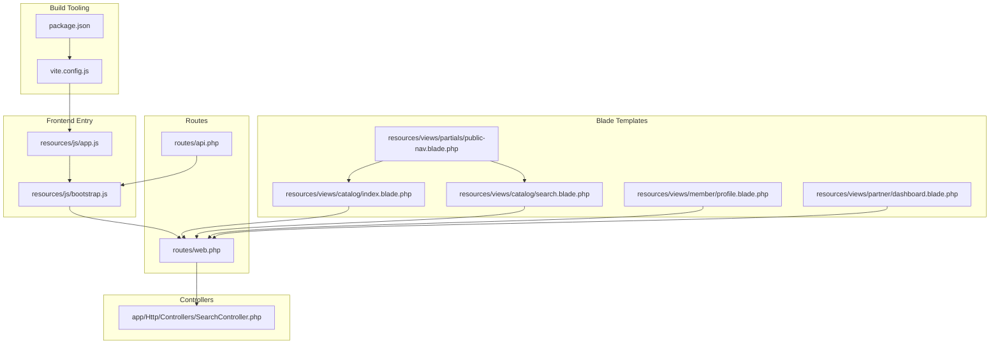
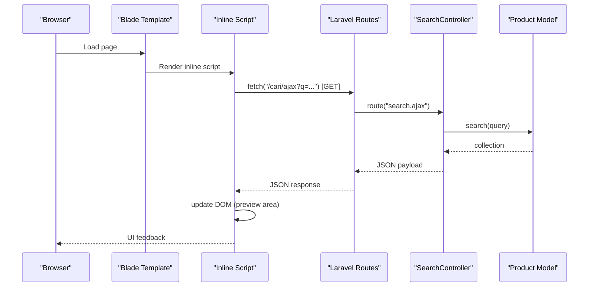
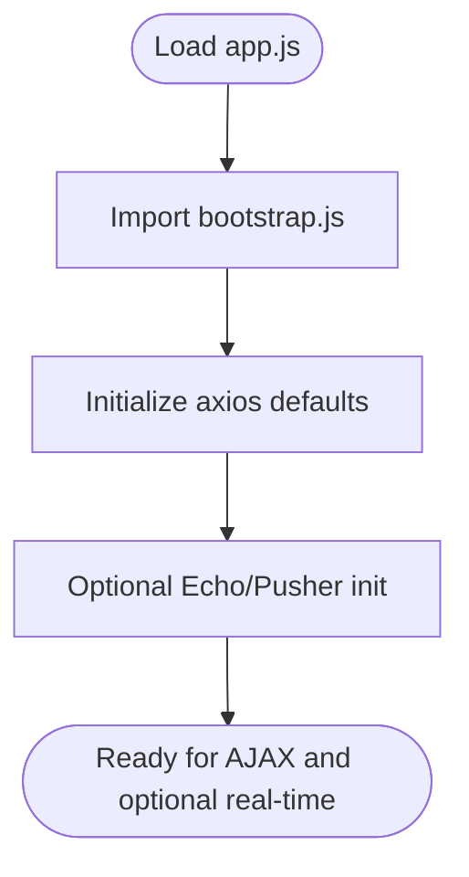
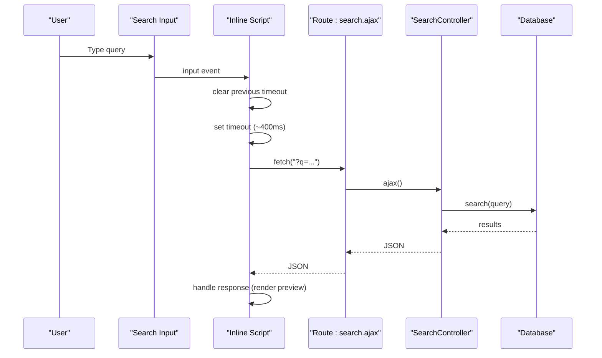
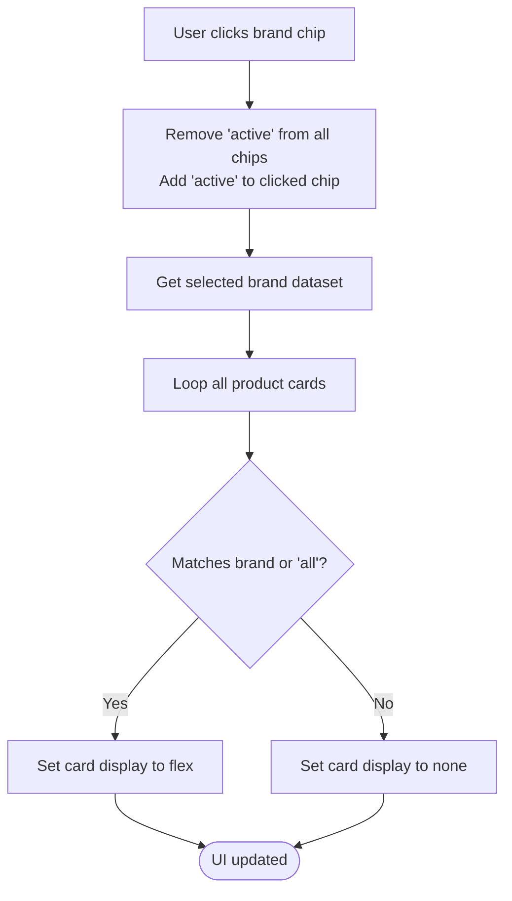
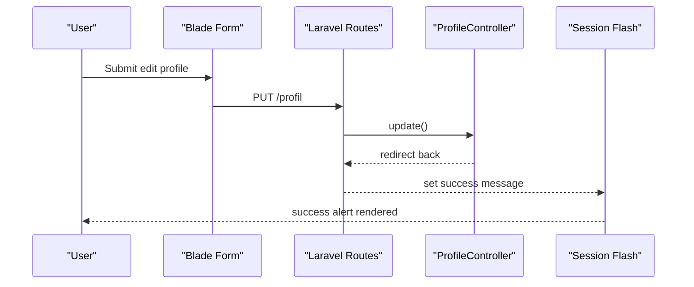
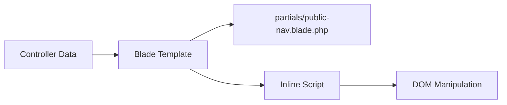
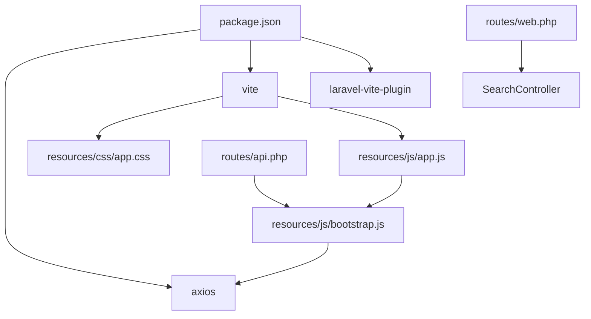

# JavaScript Integration

<cite>
**Referenced Files in This Document**
- [app.js](file://resources/js/app.js)
- [bootstrap.js](file://resources/js/bootstrap.js)
- [vite.config.js](file://vite.config.js)
- [package.json](file://package.json)
- [welcome.blade.php](file://resources/views/welcome.blade.php)
- [public-nav.blade.php](file://resources/views/partials/public-nav.blade.php)
- [catalog/index.blade.php](file://resources/views/catalog/index.blade.php)
- [catalog/search.blade.php](file://resources/views/catalog/search.blade.php)
- [member/profile.blade.php](file://resources/views/member/profile.blade.php)
- [partner/dashboard.blade.php](file://resources/views/partner/dashboard.blade.php)
- [web.php](file://routes/web.php)
- [api.php](file://routes/api.php)
- [SearchController.php](file://app/Http/Controllers/SearchController.php)
</cite>

## Table of Contents
1. [Introduction](#introduction)
2. [Project Structure](#project-structure)
3. [Core Components](#core-components)
4. [Architecture Overview](#architecture-overview)
5. [Detailed Component Analysis](#detailed-component-analysis)
6. [Dependency Analysis](#dependency-analysis)
7. [Performance Considerations](#performance-considerations)
8. [Troubleshooting Guide](#troubleshooting-guide)
9. [Conclusion](#conclusion)

## Introduction
This document explains the JavaScript integration and frontend interactivity in KatalogThrift. It covers the ES6 module setup, library integration patterns, AJAX interactions with the Laravel backend, form handling, dynamic content loading, DOM manipulation, event handling, and UI enhancements. It also documents how Blade templates pass data to JavaScript and how to progressively enhance functionality while maintaining compatibility.

## Project Structure
KatalogThrift uses Vite to bundle assets and Blade for server-rendered HTML. The frontend entry point initializes Axios for HTTP requests and leaves room for optional real-time features (commented Echo/Pusher integration). Blade templates embed inline scripts for lightweight interactivity and integrate with Laravel routes for AJAX and form submissions.

**Diagram sources**
- [vite.config.js:1-12](file://vite.config.js#L1-L12)
- [package.json:1-14](file://package.json#L1-L14)
- [app.js:1-2](file://resources/js/app.js#L1-L2)
- [bootstrap.js:1-33](file://resources/js/bootstrap.js#L1-L33)
- [public-nav.blade.php:1-27](file://resources/views/partials/public-nav.blade.php#L1-L27)
- [catalog/index.blade.php:1-380](file://resources/views/catalog/index.blade.php#L1-L380)
- [catalog/search.blade.php:1-117](file://resources/views/catalog/search.blade.php#L1-L117)
- [member/profile.blade.php:1-83](file://resources/views/member/profile.blade.php#L1-L83)
- [partner/dashboard.blade.php:1-135](file://resources/views/partner/dashboard.blade.php#L1-L135)
- [web.php:1-240](file://routes/web.php#L1-L240)
- [api.php:1-20](file://routes/api.php#L1-L20)
- [SearchController.php:1-56](file://app/Http/Controllers/SearchController.php#L1-L56)

**Section sources**
- [vite.config.js:1-12](file://vite.config.js#L1-L12)
- [package.json:1-14](file://package.json#L1-L14)
- [app.js:1-2](file://resources/js/app.js#L1-L2)
- [bootstrap.js:1-33](file://resources/js/bootstrap.js#L1-L33)
- [web.php:1-240](file://routes/web.php#L1-L240)
- [api.php:1-20](file://routes/api.php#L1-L20)

## Core Components
- ES6 Modules and Asset Pipeline
  - Vite compiles resources/css/app.css and resources/js/app.js with hot reload and build support.
  - app.js imports bootstrap.js to initialize global libraries.
  - bootstrap.js sets up Axios defaults and includes commented Echo/Pusher integration for real-time features.

- Axios Integration
  - Axios is globally available via window.axios and configured with a common header for XMLHttpRequest.
  - CSRF handling is automatic through the XSRF token cookie mechanism.

- Inline Scripts in Blade
  - Templates embed small inline scripts for DOM manipulation and AJAX calls.
  - Examples include brand filtering in the catalog index and a live search debounce in the search page.

- Form Handling
  - Forms use standard GET/POST actions routed through web.php controllers.
  - CSRF tokens are included via @csrf in Blade forms.

**Section sources**
- [vite.config.js:1-12](file://vite.config.js#L1-L12)
- [package.json:1-14](file://package.json#L1-L14)
- [app.js:1-2](file://resources/js/app.js#L1-L2)
- [bootstrap.js:1-33](file://resources/js/bootstrap.js#L1-L33)
- [catalog/index.blade.php:362-377](file://resources/views/catalog/index.blade.php#L362-L377)
- [catalog/search.blade.php:96-114](file://resources/views/catalog/search.blade.php#L96-L114)
- [web.php:1-240](file://routes/web.php#L1-L240)

## Architecture Overview
The frontend architecture combines server-rendered HTML (Blade) with minimal client-side JavaScript for interactivity. AJAX requests target Laravel routes, returning JSON for dynamic UI updates. Real-time features are optionally supported via Echo/Pusher (currently disabled).

**Diagram sources**
- [catalog/search.blade.php:96-114](file://resources/views/catalog/search.blade.php#L96-L114)
- [web.php:52-54](file://routes/web.php#L52-L54)
- [SearchController.php:33-54](file://app/Http/Controllers/SearchController.php#L33-L54)

## Detailed Component Analysis

### ES6 Modules and Bootstrap
- Purpose: Centralize library initialization and global configuration.
- Key responsibilities:
  - Import and expose Axios globally.
  - Configure default headers for HTTP requests.
  - Provide hooks for optional real-time features (Echo/Pusher).

**Diagram sources**
- [app.js:1-2](file://resources/js/app.js#L1-L2)
- [bootstrap.js:1-33](file://resources/js/bootstrap.js#L1-L33)

**Section sources**
- [app.js:1-2](file://resources/js/app.js#L1-L2)
- [bootstrap.js:1-33](file://resources/js/bootstrap.js#L1-L33)

### AJAX Live Search (Catalog Search Page)
- Behavior:
  - Debounced input listener on the search box.
  - Fetches JSON from the search AJAX endpoint when query length >= 2.
  - Currently logs the response; can be extended to render suggestions.

**Diagram sources**
- [catalog/search.blade.php:96-114](file://resources/views/catalog/search.blade.php#L96-L114)
- [web.php:52-54](file://routes/web.php#L52-L54)
- [SearchController.php:33-54](file://app/Http/Controllers/SearchController.php#L33-L54)

**Section sources**
- [catalog/search.blade.php:96-114](file://resources/views/catalog/search.blade.php#L96-L114)
- [web.php:52-54](file://routes/web.php#L52-L54)
- [SearchController.php:33-54](file://app/Http/Controllers/SearchController.php#L33-L54)

### Brand Filtering (Catalog Index Page)
- Behavior:
  - Clicking brand chips toggles active state and filters product cards by brand dataset.
  - Uses DOM queries to update visibility of product cards.

**Diagram sources**
- [catalog/index.blade.php:362-377](file://resources/views/catalog/index.blade.php#L362-L377)

**Section sources**
- [catalog/index.blade.php:362-377](file://resources/views/catalog/index.blade.php#L362-L377)

### Form Handling and CSRF Protection
- Member Profile Edit:
  - Blade form posts to route("member.profile.update") with PUT method.
  - @csrf ensures CSRF protection.
  - On success, a session message is shown.

- Partner Dashboard:
  - Logout uses a form with @csrf and POST to route("partner.logout").

- Wishlist Toggle (Catalog):
  - Uses a form posting to route("wishlist.toggle") with CSRF.

**Diagram sources**
- [member/profile.blade.php:62-71](file://resources/views/member/profile.blade.php#L62-L71)
- [web.php:110-116](file://routes/web.php#L110-L116)

**Section sources**
- [member/profile.blade.php:62-71](file://resources/views/member/profile.blade.php#L62-L71)
- [partner/dashboard.blade.php:63-66](file://resources/views/partner/dashboard.blade.php#L63-L66)
- [catalog/index.blade.php:314-318](file://resources/views/catalog/index.blade.php#L314-L318)
- [web.php:89-116](file://routes/web.php#L89-L116)

### Blade Integration and Data Passing
- Public navigation partial receives $activeNav and $storeName and renders links conditionally.
- Catalog pages pass computed data (e.g., $newArrivals, $productTypes, $allPartners) to Blade, which is later consumed by inline scripts for filtering and rendering.

**Diagram sources**
- [public-nav.blade.php:1-27](file://resources/views/partials/public-nav.blade.php#L1-L27)
- [catalog/index.blade.php:1-380](file://resources/views/catalog/index.blade.php#L1-L380)

**Section sources**
- [public-nav.blade.php:1-27](file://resources/views/partials/public-nav.blade.php#L1-L27)
- [catalog/index.blade.php:1-380](file://resources/views/catalog/index.blade.php#L1-L380)

### Real-Time Features (Optional)
- Echo and Pusher are imported but disabled by default in bootstrap.js.
- To enable, uncomment the Echo initialization block and configure environment variables.
- This enables Laravel Echo subscriptions and event broadcasting for real-time updates.

**Section sources**
- [bootstrap.js:18-32](file://resources/js/bootstrap.js#L18-L32)

## Dependency Analysis
- Build Dependencies
  - Vite builds CSS/JS bundles.
  - Laravel-Vite-Plugin integrates with Laravel routing and hot reload.

- Runtime Dependencies
  - Axios is imported and exposed globally for AJAX.
  - Laravel routes serve both HTML and JSON endpoints.

**Diagram sources**
- [package.json:1-14](file://package.json#L1-L14)
- [vite.config.js:1-12](file://vite.config.js#L1-L12)
- [app.js:1-2](file://resources/js/app.js#L1-L2)
- [bootstrap.js:1-33](file://resources/js/bootstrap.js#L1-L33)
- [web.php:52-54](file://routes/web.php#L52-L54)
- [api.php:1-20](file://routes/api.php#L1-L20)

**Section sources**
- [package.json:1-14](file://package.json#L1-L14)
- [vite.config.js:1-12](file://vite.config.js#L1-L12)
- [web.php:52-54](file://routes/web.php#L52-L54)
- [api.php:1-20](file://routes/api.php#L1-L20)

## Performance Considerations
- Debounce Input Events
  - Use timeouts to limit AJAX frequency during typing (already present in search template).
- Lazy Loading Images
  - Use loading="lazy" on images to improve initial render performance.
- Minimal Inline Scripts
  - Keep inline scripts small and scoped to reduce parsing overhead.
- Asset Bundling
  - Vite optimizes assets for production builds; ensure production mode is used.

## Troubleshooting Guide
- AJAX Requests Fail
  - Verify CSRF token presence in forms and that Axios defaults include the proper header.
  - Confirm route("search.ajax") resolves correctly and SearchController.ajax returns JSON.

- Real-Time Features Not Working
  - Ensure Echo/Pusher initialization is enabled and environment variables are set.

- Forms Not Submitting
  - Check @csrf inclusion and method spoofing for PUT/DELETE routes.

**Section sources**
- [bootstrap.js:1-33](file://resources/js/bootstrap.js#L1-L33)
- [web.php:52-54](file://routes/web.php#L52-L54)
- [SearchController.php:33-54](file://app/Http/Controllers/SearchController.php#L33-L54)

## Conclusion
KatalogThrift’s frontend integrates Blade-rendered HTML with lightweight, inline JavaScript for interactivity and AJAX-driven updates. The ES6 module setup centralizes library initialization, while Vite streamlines asset bundling. Forms leverage Laravel routing and CSRF protection, and optional real-time capabilities are available through Echo/Pusher. By following the patterns documented here—debounced input handling, minimal inline scripts, and structured form submissions—you can extend interactivity safely and efficiently.