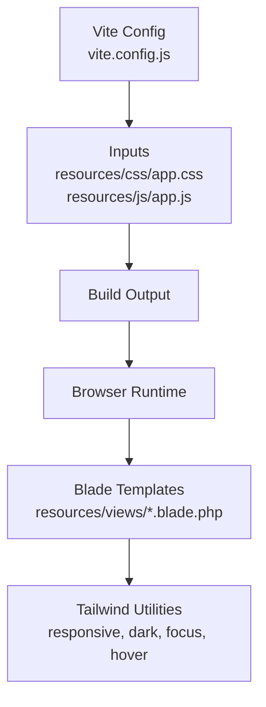
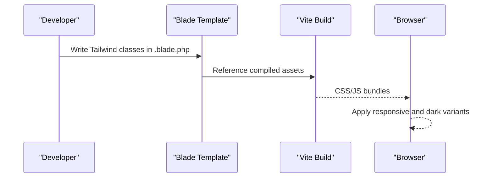
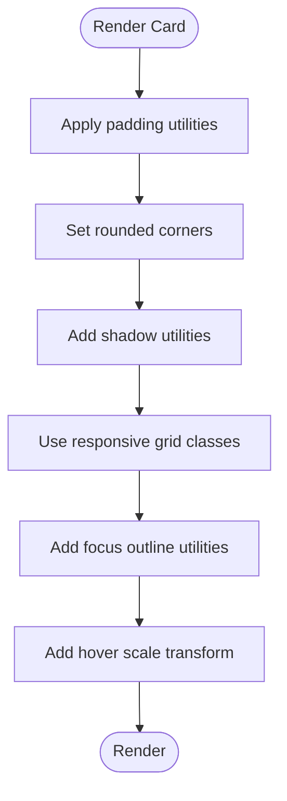
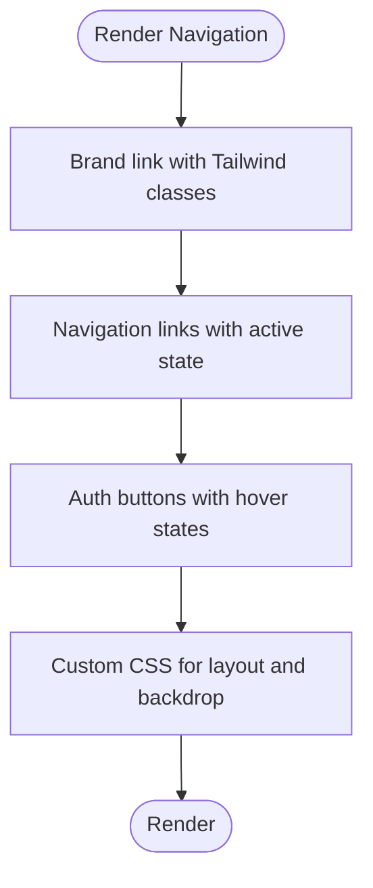
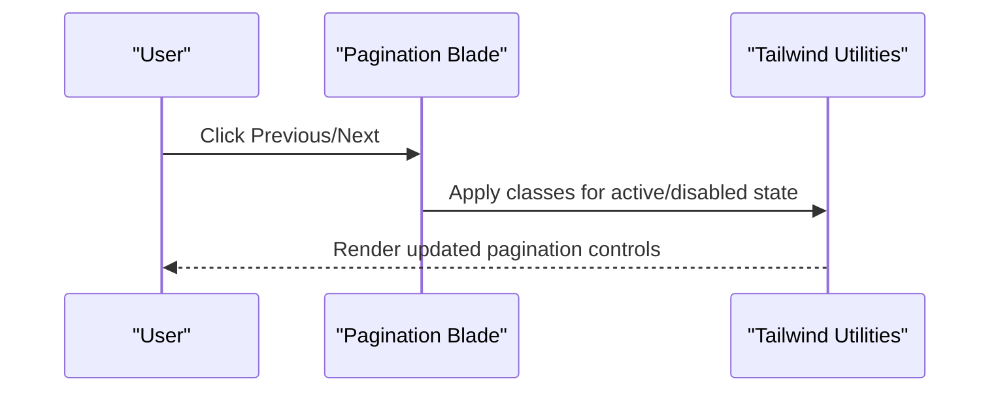
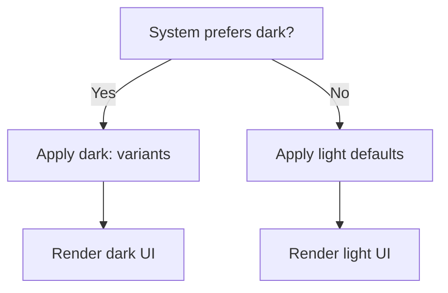
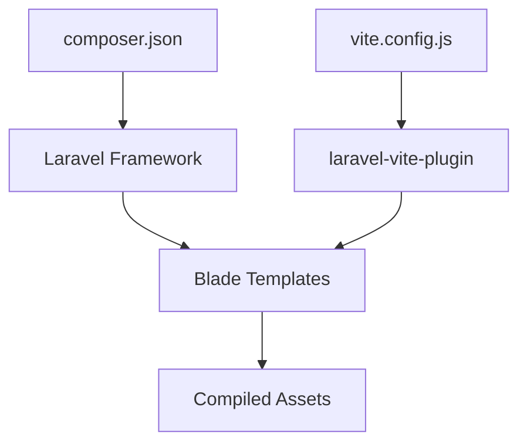

# Tailwind CSS Styling

<cite>
**Referenced Files in This Document**
- [package.json](file://package.json)
- [vite.config.js](file://vite.config.js)
- [resources/css/app.css](file://resources/css/app.css)
- [resources/js/app.js](file://resources/js/app.js)
- [resources/views/welcome.blade.php](file://resources/views/welcome.blade.php)
- [resources/views/partials/public-nav.blade.php](file://resources/views/partials/public-nav.blade.php)
- [resources/views/partials/public-nav-styles.blade.php](file://resources/views/partials/public-nav-styles.blade.php)
- [vendor/spatie/ignition/resources/compiled/ignition.css](file://vendor/spatie/ignition/resources/compiled/ignition.css)
- [vendor/laravel/framework/src/Illuminate/Foundation/Exceptions/views/minimal.blade.php](file://vendor/laravel/framework/src/Illuminate/Foundation/Exceptions/views/minimal.blade.php)
- [vendor/laravel/framework/src/Illuminate/Pagination/resources/views/simple-tailwind.blade.php](file://vendor/laravel/framework/src/Illuminate/Pagination/resources/views/simple-tailwind.blade.php)
</cite>

## Table of Contents
1. [Introduction](#introduction)
2. [Project Structure](#project-structure)
3. [Core Components](#core-components)
4. [Architecture Overview](#architecture-overview)
5. [Detailed Component Analysis](#detailed-component-analysis)
6. [Dependency Analysis](#dependency-analysis)
7. [Performance Considerations](#performance-considerations)
8. [Troubleshooting Guide](#troubleshooting-guide)
9. [Conclusion](#conclusion)

## Introduction
This document explains how Tailwind CSS is implemented and leveraged in KatalogThrift. It covers the utility-first approach, responsive design patterns, dark mode support, and component styling strategies visible in the repository. It also documents spacing systems, color palettes, typography scales, interactive states, and practical examples such as cards, forms, navigation, and responsive grids. Finally, it outlines performance optimization approaches and guidelines for maintaining design consistency and implementing design tokens.

## Project Structure
Tailwind CSS is integrated via Vite and Laravel’s asset pipeline. The primary entry points are:
- Vite configuration defines the input assets for CSS and JS.
- The Blade template demonstrates Tailwind utility usage across layout, components, and dark mode.
- Additional Blade components illustrate navigation and pagination styling.

**Diagram sources**
- [vite.config.js:1-12](file://vite.config.js#L1-L12)
- [resources/css/app.css:1-1](file://resources/css/app.css#L1-L1)
- [resources/js/app.js:1-1](file://resources/js/app.js#L1-L1)

**Section sources**
- [vite.config.js:1-12](file://vite.config.js#L1-L12)
- [package.json:1-14](file://package.json#L1-L14)

## Core Components
- Utility-first approach: Classes are applied directly in Blade templates to compose layouts and components without writing custom CSS.
- Responsive design: Breakpoints are used to adapt layouts across screen sizes.
- Dark mode: Prefers-color-scheme media queries enable dark variants of backgrounds, text, and shadows.
- Interactive states: Hover, focus, and group states are applied to improve UX.
- Component patterns: Cards, navigation, and pagination are styled using Tailwind utilities.

Examples visible in the repository:
- Responsive grid and spacing: [resources/views/welcome.blade.php:32-108](file://resources/views/welcome.blade.php#L32-L108)
- Dark mode backgrounds and text: [resources/views/welcome.blade.php:18-19](file://resources/views/welcome.blade.php#L18-L19)
- Interactive states and focus outlines: [resources/views/welcome.blade.php:20-22](file://resources/views/welcome.blade.php#L20-L22)
- Navigation component with custom CSS alongside Tailwind utilities: [resources/views/partials/public-nav.blade.php:1-27](file://resources/views/partials/public-nav.blade.php#L1-L27), [resources/views/partials/public-nav-styles.blade.php:1-12](file://resources/views/partials/public-nav-styles.blade.php#L1-L12)

**Section sources**
- [resources/views/welcome.blade.php:18-124](file://resources/views/welcome.blade.php#L18-L124)
- [resources/views/partials/public-nav.blade.php:1-27](file://resources/views/partials/public-nav.blade.php#L1-L27)
- [resources/views/partials/public-nav-styles.blade.php:1-12](file://resources/views/partials/public-nav-styles.blade.php#L1-L12)

## Architecture Overview
Tailwind utilities are consumed directly in Blade templates. The build pipeline compiles CSS and JS, while Blade renders HTML with Tailwind classes. Dark mode relies on media queries and class-based toggles.

**Diagram sources**
- [resources/views/welcome.blade.php:18-124](file://resources/views/welcome.blade.php#L18-L124)
- [vite.config.js:1-12](file://vite.config.js#L1-L12)

## Detailed Component Analysis

### Responsive Grid and Card Layouts
- Grid columns adapt using responsive modifiers.
- Cards combine padding, shadows, rounded corners, and focus states.
- Motion-safe transitions and scale transforms enhance interactivity.

**Diagram sources**
- [resources/views/welcome.blade.php:32-108](file://resources/views/welcome.blade.php#L32-L108)

**Section sources**
- [resources/views/welcome.blade.php:32-108](file://resources/views/welcome.blade.php#L32-L108)

### Navigation Component
- Uses semantic markup with links and forms.
- Combines Tailwind utilities with custom CSS for layout and blur effects.
- Active state and hover states are styled for clarity.

**Diagram sources**
- [resources/views/partials/public-nav.blade.php:1-27](file://resources/views/partials/public-nav.blade.php#L1-L27)
- [resources/views/partials/public-nav-styles.blade.php:1-12](file://resources/views/partials/public-nav-styles.blade.php#L1-L12)

**Section sources**
- [resources/views/partials/public-nav.blade.php:1-27](file://resources/views/partials/public-nav.blade.php#L1-L27)
- [resources/views/partials/public-nav-styles.blade.php:1-12](file://resources/views/partials/public-nav-styles.blade.php#L1-L12)

### Pagination Component
- Pagination controls use Tailwind utilities for spacing, borders, and dark mode variants.
- Focus states and transitions improve accessibility and feedback.

**Diagram sources**
- [vendor/laravel/framework/src/Illuminate/Pagination/resources/views/simple-tailwind.blade.php:4-15](file://vendor/laravel/framework/src/Illuminate/Pagination/resources/views/simple-tailwind.blade.php#L4-L15)

**Section sources**
- [vendor/laravel/framework/src/Illuminate/Pagination/resources/views/simple-tailwind.blade.php:4-15](file://vendor/laravel/framework/src/Illuminate/Pagination/resources/views/simple-tailwind.blade.php#L4-L15)

### Dark Mode Implementation
- Dark mode backgrounds and text colors are applied conditionally.
- Media query-based dark variants ensure automatic switching based on system preference.

**Diagram sources**
- [resources/views/welcome.blade.php:18-19](file://resources/views/welcome.blade.php#L18-L19)

**Section sources**
- [resources/views/welcome.blade.php:18-19](file://resources/views/welcome.blade.php#L18-L19)

### Exception View Styling
- Minimal exception view uses Tailwind utilities for layout and dark mode compatibility.

**Section sources**
- [vendor/laravel/framework/src/Illuminate/Foundation/Exceptions/views/minimal.blade.php:19](file://vendor/laravel/framework/src/Illuminate/Foundation/Exceptions/views/minimal.blade.php#L19)

## Dependency Analysis
- Build toolchain: Vite compiles CSS/JS entries defined in the Laravel plugin.
- Asset pipeline: Laravel’s Vite plugin integrates with Blade to resolve compiled assets.
- Vendor-provided components: Pagination and minimal exception views include Tailwind utilities.

**Diagram sources**
- [composer.json:1-67](file://composer.json#L1-L67)
- [vite.config.js:1-12](file://vite.config.js#L1-L12)

**Section sources**
- [composer.json:1-67](file://composer.json#L1-L67)
- [vite.config.js:1-12](file://vite.config.js#L1-L12)

## Performance Considerations
- Purge unused styles: Configure purge/extraction to remove unreachable utilities in production builds.
- Critical CSS injection: Inline critical above-the-fold CSS and defer non-critical styles.
- Bundle size management: Minimize custom CSS, reuse utility classes, and avoid redundant variants.
- Lazy loading and media-specific assets: Defer heavy assets until needed.

[No sources needed since this section provides general guidance]

## Troubleshooting Guide
- Tailwind utilities not applying:
  - Ensure the CSS entry is included in Vite inputs and built.
  - Confirm Blade templates reference compiled assets.
- Dark mode not rendering:
  - Verify dark: variants are present and system preference matches expectations.
- Vendor components missing styles:
  - Check vendor-provided Blade templates for Tailwind usage and ensure assets are built.

**Section sources**
- [vite.config.js:1-12](file://vite.config.js#L1-L12)
- [resources/views/welcome.blade.php:18-19](file://resources/views/welcome.blade.php#L18-L19)
- [vendor/laravel/framework/src/Illuminate/Pagination/resources/views/simple-tailwind.blade.php:4-15](file://vendor/laravel/framework/src/Illuminate/Pagination/resources/views/simple-tailwind.blade.php#L4-L15)

## Conclusion
KatalogThrift adopts a utility-first approach with Tailwind CSS, leveraging responsive and dark mode variants directly in Blade templates. The build pipeline integrates with Vite and Laravel’s asset management. By following the patterns demonstrated in the repository—responsive grids, card layouts, navigation, and pagination—teams can maintain consistency and scalability. For production, apply purging, critical CSS injection, and bundle optimization to achieve optimal performance.