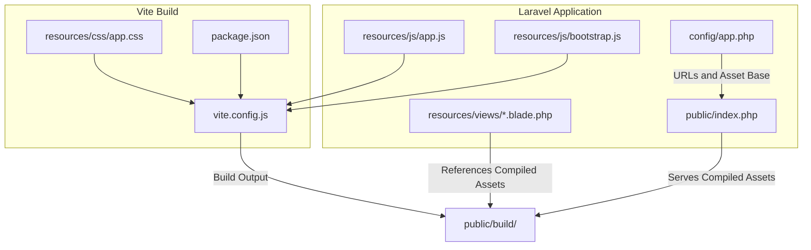
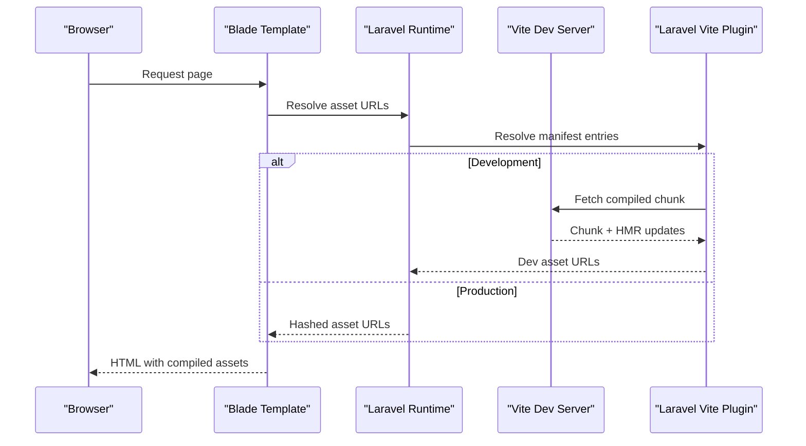
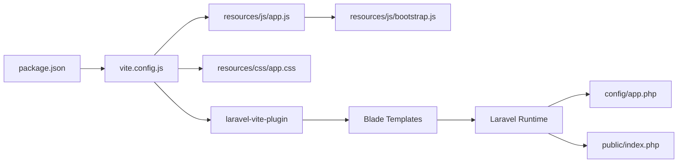

# Vite Asset Pipeline

<cite>
**Referenced Files in This Document**
- [vite.config.js](file://vite.config.js)
- [package.json](file://package.json)
- [resources/js/app.js](file://resources/js/app.js)
- [resources/js/bootstrap.js](file://resources/js/bootstrap.js)
- [resources/views/welcome.blade.php](file://resources/views/welcome.blade.php)
- [config/app.php](file://config/app.php)
- [composer.json](file://composer.json)
- [public/index.php](file://public/index.php)
</cite>

## Table of Contents
1. [Introduction](#introduction)
2. [Project Structure](#project-structure)
3. [Core Components](#core-components)
4. [Architecture Overview](#architecture-overview)
5. [Detailed Component Analysis](#detailed-component-analysis)
6. [Dependency Analysis](#dependency-analysis)
7. [Performance Considerations](#performance-considerations)
8. [Troubleshooting Guide](#troubleshooting-guide)
9. [Conclusion](#conclusion)
10. [Appendices](#appendices)

## Introduction
This document explains how KatalogThrift integrates Vite for asset bundling and the Laravel development workflow. It covers the Vite configuration, the Laravel plugin setup, and the asset compilation process. You will learn how JavaScript modules are bundled, how CSS is processed, and how Hot Module Replacement (HMR) works. The guide also addresses dependency management via npm/yarn, build optimization, production asset generation, development server configuration, environment-specific builds, asset versioning and cache busting, CDN integration, and practical examples for extending the build pipeline.

## Project Structure
KatalogThrift follows a standard Laravel layout with Vite assets under resources/js and resources/css. The Vite configuration defines entry points and enables the Laravel plugin for seamless integration with Laravel’s asset pipeline. The Laravel application bootstraps the frontend via resources/js/app.js and resources/js/bootstrap.js, while Blade templates render the final HTML and include compiled assets.

**Diagram sources**
- [vite.config.js:1-12](file://vite.config.js#L1-L12)
- [package.json:1-14](file://package.json#L1-L14)
- [resources/js/app.js:1-2](file://resources/js/app.js#L1-L2)
- [resources/js/bootstrap.js:1-33](file://resources/js/bootstrap.js#L1-L33)
- [resources/views/welcome.blade.php:1-124](file://resources/views/welcome.blade.php#L1-L124)
- [config/app.php:58-61](file://config/app.php#L58-L61)
- [public/index.php:1-56](file://public/index.php#L1-L56)

**Section sources**
- [vite.config.js:1-12](file://vite.config.js#L1-L12)
- [package.json:1-14](file://package.json#L1-L14)
- [resources/js/app.js:1-2](file://resources/js/app.js#L1-L2)
- [resources/js/bootstrap.js:1-33](file://resources/js/bootstrap.js#L1-L33)
- [resources/views/welcome.blade.php:1-124](file://resources/views/welcome.blade.php#L1-L124)
- [config/app.php:58-61](file://config/app.php#L58-L61)
- [public/index.php:1-56](file://public/index.php#L1-L56)

## Core Components
- Vite configuration: Defines plugins, entry points, and dev server behavior.
- Laravel plugin: Bridges Vite with Laravel’s asset discovery and HMR.
- Frontend entry points: resources/js/app.js and resources/css/app.css.
- Bootstrapping: resources/js/bootstrap.js initializes HTTP client and optional real-time features.
- Laravel runtime: config/app.php controls base URLs and asset base; public/index.php serves the app and compiled assets.

Key responsibilities:
- Vite compiles and serves JS/CSS during development and produces hashed artifacts for production.
- The Laravel plugin ensures HMR and asset manifest compatibility with Blade templates.
- Laravel resolves asset URLs using configured APP_URL and ASSET_URL.

**Section sources**
- [vite.config.js:1-12](file://vite.config.js#L1-L12)
- [package.json:1-14](file://package.json#L1-L14)
- [resources/js/app.js:1-2](file://resources/js/app.js#L1-L2)
- [resources/js/bootstrap.js:1-33](file://resources/js/bootstrap.js#L1-L33)
- [config/app.php:58-61](file://config/app.php#L58-L61)

## Architecture Overview
The asset pipeline connects Blade templates to Vite’s build system and Laravel’s runtime. During development, the Laravel plugin injects HMR scripts and resolves assets via Vite’s dev server. In production, Vite generates hashed filenames and outputs assets under public/build, which Laravel serves.

**Diagram sources**
- [resources/views/welcome.blade.php:1-124](file://resources/views/welcome.blade.php#L1-L124)
- [vite.config.js:1-12](file://vite.config.js#L1-L12)
- [config/app.php:58-61](file://config/app.php#L58-L61)

## Detailed Component Analysis

### Vite Configuration
- Plugins: laravel-vite-plugin is registered with input entries for CSS and JS and refresh enabled.
- Entry points: resources/css/app.css and resources/js/app.js are the primary bundles.
- Behavior: refresh:true enables automatic page reloads when watched files change.

Practical implications:
- Add additional CSS/JS entries to the input array to bundle new pages or features.
- Keep refresh enabled for rapid iteration; disable in CI or specific environments if needed.

**Section sources**
- [vite.config.js:4-11](file://vite.config.js#L4-L11)

### Package Scripts and Dependencies
- Scripts: dev runs Vite dev server; build creates production bundles.
- Dependencies: Vite, laravel-vite-plugin, and axios are declared as devDependencies.

Recommendations:
- Use yarn or npm to install/update dependencies.
- Keep Vite and laravel-vite-plugin aligned with Laravel’s documented versions.

**Section sources**
- [package.json:4-12](file://package.json#L4-L12)

### JavaScript Entry and Bootstrap
- resources/js/app.js imports the bootstrap file to initialize the environment.
- resources/js/bootstrap.js sets up axios defaults and includes commented Echo/Pusher configuration for real-time features.

Guidance:
- Import additional JS modules from resources/js/** to extend functionality.
- Uncomment Echo/Pusher lines and provide environment variables for real-time features.

**Section sources**
- [resources/js/app.js:1-2](file://resources/js/app.js#L1-L2)
- [resources/js/bootstrap.js:7-32](file://resources/js/bootstrap.js#L7-L32)

### CSS Processing
- resources/css/app.css is configured as a Vite entry point.
- Use PostCSS/Tailwind or other processors via Vite plugins if needed; ensure they are installed and configured in Vite.

Best practices:
- Keep global styles in app.css; component-specific styles can be imported from JS.
- Use environment variables for theme customization if applicable.

**Section sources**
- [vite.config.js:7](file://vite.config.js#L7)

### Hot Module Replacement (HMR)
- The Laravel plugin injects HMR scripts in development mode.
- refresh:true triggers page reloads when source files change.

Tips:
- Disable refresh in specific scenarios (e.g., long-running tests) by adjusting the plugin options.
- Use browser devtools to confirm HMR connections.

**Section sources**
- [vite.config.js:8](file://vite.config.js#L8)

### Laravel Integration and Asset Resolution
- config/app.php defines APP_URL and ASSET_URL, which Laravel uses to resolve asset paths.
- public/index.php is the front controller serving the application and compiled assets.

Notes:
- Ensure APP_URL points to the correct host/port for HMR and asset resolution.
- ASSET_URL can override asset base for CDN deployments.

**Section sources**
- [config/app.php:58-61](file://config/app.php#L58-L61)
- [public/index.php:1-56](file://public/index.php#L1-L56)

### Blade Templates and Asset References
- Blade templates reference compiled assets; the Laravel plugin ensures correct URLs in development and production.
- The welcome template demonstrates a typical page structure.

Action items:
- Reference compiled assets using Laravel’s asset helpers or Vite’s dev server URLs.
- Verify asset paths after building for production.

**Section sources**
- [resources/views/welcome.blade.php:1-124](file://resources/views/welcome.blade.php#L1-L124)

## Dependency Analysis
The asset pipeline depends on Vite and the Laravel plugin to orchestrate development and production builds. Laravel’s runtime resolves asset URLs based on configuration.

**Diagram sources**
- [package.json:1-14](file://package.json#L1-L14)
- [vite.config.js:1-12](file://vite.config.js#L1-L12)
- [resources/js/app.js:1-2](file://resources/js/app.js#L1-L2)
- [resources/js/bootstrap.js:1-33](file://resources/js/bootstrap.js#L1-L33)
- [resources/views/welcome.blade.php:1-124](file://resources/views/welcome.blade.php#L1-L124)
- [config/app.php:58-61](file://config/app.php#L58-L61)
- [public/index.php:1-56](file://public/index.php#L1-L56)

**Section sources**
- [package.json:1-14](file://package.json#L1-L14)
- [vite.config.js:1-12](file://vite.config.js#L1-L12)
- [resources/js/app.js:1-2](file://resources/js/app.js#L1-L2)
- [resources/js/bootstrap.js:1-33](file://resources/js/bootstrap.js#L1-L33)
- [resources/views/welcome.blade.php:1-124](file://resources/views/welcome.blade.php#L1-L124)
- [config/app.php:58-61](file://config/app.php#L58-L61)
- [public/index.php:1-56](file://public/index.php#L1-L56)

## Performance Considerations
- Minimize entry points to reduce initial payload.
- Split large CSS/JS into smaller chunks using dynamic imports.
- Enable tree shaking by using ES modules and avoiding unused imports.
- Use production builds for performance testing; avoid enabling refresh in CI.
- Leverage CDN integration via ASSET_URL for global distribution.

[No sources needed since this section provides general guidance]

## Troubleshooting Guide
Common issues and resolutions:
- HMR not working:
  - Confirm the Laravel plugin is enabled and entries match actual files.
  - Verify APP_URL and browser network tab for HMR websocket connections.
- 404 on compiled assets in production:
  - Ensure production build was executed and public/build exists.
  - Confirm APP_URL and ASSET_URL are correctly set.
- Axios or Echo errors:
  - Check environment variables and uncomment only required integrations.
- Slow builds:
  - Remove unnecessary dependencies and split bundles.
  - Use production builds for profiling.

**Section sources**
- [vite.config.js:4-11](file://vite.config.js#L4-L11)
- [config/app.php:58-61](file://config/app.php#L58-L61)
- [resources/js/bootstrap.js:7-32](file://resources/js/bootstrap.js#L7-L32)

## Conclusion
KatalogThrift’s Vite integration provides a modern, efficient asset pipeline powered by the Laravel plugin. With clear entry points, HMR support, and straightforward production builds, teams can iterate quickly in development and deliver optimized assets in production. Extend the pipeline by adding new entries, integrating additional CSS/JS, and leveraging CDN-backed asset delivery.

[No sources needed since this section summarizes without analyzing specific files]

## Appendices

### Practical Examples
- Importing assets:
  - Add imports in resources/js/app.js or component modules to include new features.
- Configuring plugins:
  - Install and configure PostCSS/Tailwind in Vite; ensure they are reflected in vite.config.js.
- Extending the build pipeline:
  - Add new entries to the laravel plugin input array for additional pages or features.
- Environment-specific builds:
  - Use environment variables to toggle features (e.g., Echo/Pusher) per environment.
- Asset versioning and cache busting:
  - Rely on Vite’s hashed filenames in production; serve via Laravel’s asset resolution.
- CDN integration:
  - Set ASSET_URL to a CDN origin; ensure APP_URL points to the correct domain.

**Section sources**
- [vite.config.js:6-9](file://vite.config.js#L6-L9)
- [resources/js/app.js:1-2](file://resources/js/app.js#L1-L2)
- [resources/js/bootstrap.js:7-32](file://resources/js/bootstrap.js#L7-L32)
- [config/app.php:58-61](file://config/app.php#L58-L61)