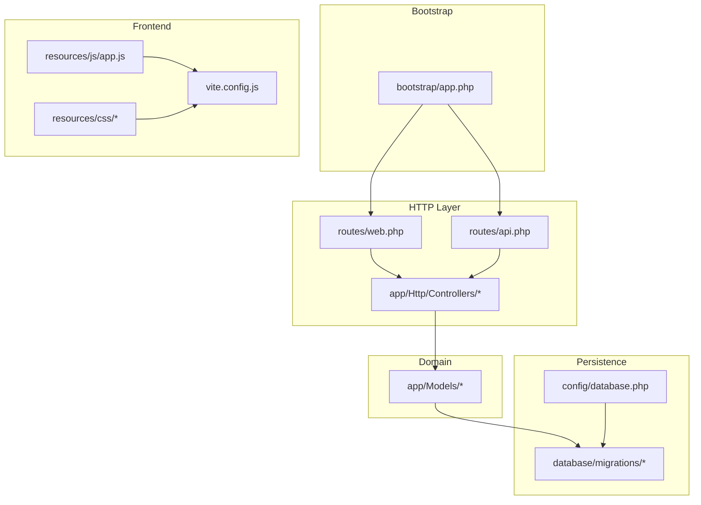
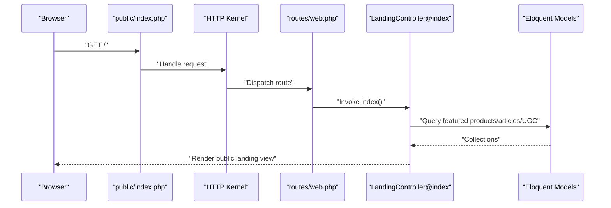
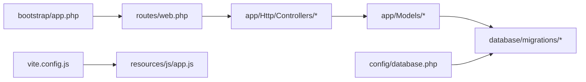

# Getting Started

<cite>
**Referenced Files in This Document**
- [README.md](file://README.md)
- [composer.json](file://composer.json)
- [package.json](file://package.json)
- [vite.config.js](file://vite.config.js)
- [config/app.php](file://config/app.php)
- [config/database.php](file://config/database.php)
- [routes/web.php](file://routes/web.php)
- [routes/api.php](file://routes/api.php)
- [bootstrap/app.php](file://bootstrap/app.php)
- [resources/js/app.js](file://resources/js/app.js)
- [app/Http/Controllers/LandingController.php](file://app/Http/Controllers/LandingController.php)
- [app/Models/User.php](file://app/Models/User.php)
- [database/migrations/2014_10_12_000000_create_users_table.php](file://database/migrations/2014_10_12_000000_create_users_table.php)
</cite>

## Table of Contents
1. [Introduction](#introduction)
2. [Project Structure](#project-structure)
3. [Core Components](#core-components)
4. [Architecture Overview](#architecture-overview)
5. [Detailed Component Analysis](#detailed-component-analysis)
6. [Dependency Analysis](#dependency-analysis)
7. [Performance Considerations](#performance-considerations)
8. [Troubleshooting Guide](#troubleshooting-guide)
9. [Conclusion](#conclusion)
10. [Appendices](#appendices)

## Introduction
KatalogThrift is a Laravel-based multi-mitra (multi-partner) thrift fashion marketplace that connects individual thrift stores with fashion-conscious consumers. It provides a unified platform for browsing curated products, discovering style stories, sharing outfits, and managing partner inventories. The application follows Laravel conventions with a layered MVC architecture, Eloquent ORM for persistence, Blade templates for rendering, and Vite for asset bundling.

This guide helps you install, configure, and run KatalogThrift locally, with step-by-step instructions and verification steps suitable for both newcomers to Laravel and experienced PHP developers.

## Project Structure
At a high level, the project is organized into:
- Application entry and bootstrapping: bootstrap/app.php
- Configuration: config/*.php
- HTTP layer: app/Http/*, routes/*.php
- Domain models: app/Models/*
- Database: database/migrations/*, database/seeders/*
- Frontend assets: resources/js/*, resources/css/*, vite.config.js
- Public assets and entry point: public/index.php
- Tests: tests/*

**Diagram sources**
- [bootstrap/app.php:14-55](file://bootstrap/app.php#L14-L55)
- [routes/web.php:1-240](file://routes/web.php#L1-L240)
- [routes/api.php:1-20](file://routes/api.php#L1-L20)
- [app/Http/Controllers/LandingController.php:10-47](file://app/Http/Controllers/LandingController.php#L10-L47)
- [app/Models/User.php:10-131](file://app/Models/User.php#L10-L131)
- [database/migrations/2014_10_12_000000_create_users_table.php:7-32](file://database/migrations/2014_10_12_000000_create_users_table.php#L7-L32)
- [config/database.php:18-96](file://config/database.php#L18-L96)
- [resources/js/app.js:1-2](file://resources/js/app.js#L1-L2)
- [vite.config.js:1-12](file://vite.config.js#L1-L12)

**Section sources**
- [bootstrap/app.php:14-55](file://bootstrap/app.php#L14-L55)
- [routes/web.php:1-240](file://routes/web.php#L1-L240)
- [routes/api.php:1-20](file://routes/api.php#L1-L20)
- [config/database.php:18-96](file://config/database.php#L18-L96)
- [vite.config.js:1-12](file://vite.config.js#L1-L12)

## Core Components
- Application bootstrap and kernel bindings: creates the container and binds HTTP/console kernels and exception handler.
- Routing: web.php defines public, member/partner/admin routes; api.php exposes a Sanctum-protected endpoint.
- Configuration: app.php sets application metadata, environment, debug, timezone, locale, encryption key, and service providers; database.php configures default connection and drivers.
- Models: Eloquent models encapsulate domain entities and relationships (e.g., User).
- Migrations: database schema is managed via migrations; the base users table is included.
- Frontend: Vite bundles JS/CSS via laravel-vite-plugin; resources/js/app.js wires bootstrap.

Key configuration touchpoints:
- Environment variables are resolved via config files (e.g., APP_* and DB_*).
- Service providers in config/app.php control which packages and application services are loaded.
- Database connections in config/database.php support mysql, pgsql, sqlite, sqlsrv.

Verification pointers:
- Ensure APP_KEY is generated and APP_ENV is set appropriately.
- Confirm DB_CONNECTION and credentials in .env match config/database.php defaults.

**Section sources**
- [bootstrap/app.php:14-55](file://bootstrap/app.php#L14-L55)
- [routes/web.php:44-239](file://routes/web.php#L44-L239)
- [routes/api.php:17-19](file://routes/api.php#L17-L19)
- [config/app.php:19-125](file://config/app.php#L19-L125)
- [config/app.php:158-171](file://config/app.php#L158-L171)
- [config/database.php:18-96](file://config/database.php#L18-L96)
- [app/Models/User.php:10-131](file://app/Models/User.php#L10-L131)
- [database/migrations/2014_10_12_000000_create_users_table.php:7-32](file://database/migrations/2014_10_12_000000_create_users_table.php#L7-L32)
- [resources/js/app.js:1-2](file://resources/js/app.js#L1-L2)
- [vite.config.js:4-11](file://vite.config.js#L4-L11)

## Architecture Overview
KatalogThrift follows a classic MVC pattern:
- Bootstrap initializes the application container and binds kernels.
- HTTP requests enter via public/index.php, routed through web.php.
- Controllers orchestrate requests, interact with models, and render views or JSON.
- Eloquent models define relationships and business logic.
- Migrations manage schema evolution.
- Vite compiles frontend assets.

**Diagram sources**
- [bootstrap/app.php:14-55](file://bootstrap/app.php#L14-L55)
- [routes/web.php:44-47](file://routes/web.php#L44-L47)
- [app/Http/Controllers/LandingController.php:12-46](file://app/Http/Controllers/LandingController.php#L12-L46)
- [app/Models/User.php:10-131](file://app/Models/User.php#L10-L131)

## Detailed Component Analysis

### Installation Prerequisites
- PHP 8.1+ with OpenSSL, PDO, Mbstring, Tokenizer, XML, and ZIP extensions.
- Composer for PHP dependency management.
- Node.js and npm/yarn for frontend asset compilation.
- MySQL (or compatible SQL server) for the primary database.

These requirements are reflected in composer.json and package.json, and Laravel’s documented minimum versions.

**Section sources**
- [composer.json:7-13](file://composer.json#L7-L13)
- [package.json:8-12](file://package.json#L8-L12)

### Step-by-Step Installation

1) Environment Setup
- Install PHP 8.1+ and enable required extensions.
- Install Composer globally.
- Install Node.js and npm.
- Install and configure MySQL.

2) Clone and Prepare
- Copy the repository to your development machine.
- Ensure the public directory is served by your web server (Apache/Nginx) pointing to public/.

3) Backend Dependencies
- Install PHP dependencies via Composer:
  - Run: composer install
- Generate application key:
  - Run: php artisan key:generate
- Create a local .env file:
  - Copy .env.example to .env (composer scripts handle this during project creation).
- Set APP_KEY and APP_ENV in .env as needed.

4) Database Configuration
- Configure database connection in .env:
  - Set DB_CONNECTION=mysql and appropriate DB_HOST, DB_PORT, DB_DATABASE, DB_USERNAME, DB_PASSWORD.
- Confirm config/database.php matches your environment (defaults to mysql).

5) Database Migration and Seeding
- Run migrations to create tables:
  - php artisan migrate
- Seed initial data if applicable:
  - php artisan db:seed (optional)

6) Frontend Assets
- Install frontend dependencies:
  - npm install
- Build assets:
  - npm run build
- Or run dev server for hot-reload:
  - npm run dev

7) Development Server
- Start Laravel development server:
  - php artisan serve
- Access the application at http://localhost:8000

Verification Steps
- Visit http://localhost:8000 and confirm the landing page loads.
- Ensure static assets (CSS/JS) are served without errors.
- Confirm database connectivity by checking migrations executed successfully.

Common Issues and Fixes
- Missing APP_KEY:
  - Run php artisan key:generate and re-verify .env.
- Composer autoload errors:
  - Run composer dump-autoload.
- Node/npm not found:
  - Ensure Node.js LTS is installed and PATH is configured.
- MySQL connection refused:
  - Verify DB credentials and that MySQL is running.
- Vite build failures:
  - Clear node_modules and reinstall; ensure port availability.

**Section sources**
- [composer.json:35-48](file://composer.json#L35-L48)
- [config/database.php:18-96](file://config/database.php#L18-L96)
- [routes/web.php:44-47](file://routes/web.php#L44-L47)
- [vite.config.js:4-11](file://vite.config.js#L4-L11)

### Initial Project Structure Overview
- bootstrap/app.php: Application bootstrap and kernel bindings.
- config/*.php: Application and environment-specific configuration.
- routes/web.php and routes/api.php: Web and API route definitions.
- app/Http/Controllers/*: Request handlers for public, member, partner, and admin areas.
- app/Models/*: Domain entities and relationships.
- database/migrations/*: Schema definitions.
- resources/js/app.js and vite.config.js: Frontend entry and Vite configuration.
- public/index.php: Front controller.

Key Areas to Explore
- Public routes: Landing, catalog, editorial, community, search, partner listings.
- Member area: Authentication, profile, wishlist, saved outfits, notifications.
- Partner area: Dashboard, product management, bulk operations, analytics, Q&A.
- Admin area: Partner moderation, product moderation, reviews, reports, articles, UGC, badges, analytics.

**Section sources**
- [bootstrap/app.php:14-55](file://bootstrap/app.php#L14-L55)
- [routes/web.php:44-239](file://routes/web.php#L44-L239)
- [routes/api.php:17-19](file://routes/api.php#L17-L19)
- [resources/js/app.js:1-2](file://resources/js/app.js#L1-L2)
- [vite.config.js:4-11](file://vite.config.js#L4-L11)

### Basic Usage Examples
- Browse landing page:
  - GET /
- View product detail:
  - GET /produk/{slug}
- Login (member):
  - GET /login
  - POST /login
- Partner dashboard:
  - GET /mitra/dashboard (after login)
- Admin panel:
  - GET {admin.entry_path}/ (default admin path configured in code)
- API user endpoint:
  - GET /api/user (requires Sanctum token)

Note: Replace placeholders like {slug} with actual values from your seeded data.

**Section sources**
- [routes/web.php:44-80](file://routes/web.php#L44-L80)
- [routes/web.php:119-167](file://routes/web.php#L119-L167)
- [routes/web.php:170-239](file://routes/web.php#L170-L239)
- [routes/api.php:17-19](file://routes/api.php#L17-L19)

## Dependency Analysis
High-level dependency relationships:
- bootstrap/app.php binds the application container and kernels.
- routes/web.php depends on controllers in app/Http/Controllers/.
- Controllers depend on Eloquent models in app/Models/.
- Models depend on database schema defined in database/migrations/.
- config/database.php defines database connections used by Eloquent.
- vite.config.js and resources/js/app.js integrate frontend tooling.

**Diagram sources**
- [bootstrap/app.php:14-55](file://bootstrap/app.php#L14-L55)
- [routes/web.php:1-240](file://routes/web.php#L1-L240)
- [app/Http/Controllers/LandingController.php:10-47](file://app/Http/Controllers/LandingController.php#L10-L47)
- [app/Models/User.php:10-131](file://app/Models/User.php#L10-L131)
- [database/migrations/2014_10_12_000000_create_users_table.php:7-32](file://database/migrations/2014_10_12_000000_create_users_table.php#L7-L32)
- [config/database.php:18-96](file://config/database.php#L18-L96)
- [resources/js/app.js:1-2](file://resources/js/app.js#L1-L2)
- [vite.config.js:1-12](file://vite.config.js#L1-L12)

**Section sources**
- [bootstrap/app.php:14-55](file://bootstrap/app.php#L14-L55)
- [routes/web.php:1-240](file://routes/web.php#L1-L240)
- [app/Models/User.php:10-131](file://app/Models/User.php#L10-L131)
- [database/migrations/2014_10_12_000000_create_users_table.php:7-32](file://database/migrations/2014_10_12_000000_create_users_table.php#L7-L32)
- [config/database.php:18-96](file://config/database.php#L18-L96)
- [resources/js/app.js:1-2](file://resources/js/app.js#L1-L2)
- [vite.config.js:1-12](file://vite.config.js#L1-L12)

## Performance Considerations
- Use production-ready PHP opcode caching (e.g., OPcache) and PHP-FPM.
- Keep APP_ENV=production for optimized behavior; set APP_DEBUG=false.
- Precompile assets in production using npm run build.
- Optimize database queries with eager loading (select relationships) and indexing where appropriate.
- Use queue workers for background jobs if enabled.
- Enable browser caching for static assets.

[No sources needed since this section provides general guidance]

## Troubleshooting Guide
- Composer install fails:
  - Ensure PHP version meets ^8.1 and network connectivity.
  - Clear Composer cache if needed.
- APP_KEY missing or invalid:
  - Regenerate with php artisan key:generate.
- Database connection errors:
  - Verify DB_* variables in .env and MySQL service status.
- Vite dev server port conflicts:
  - Change port or stop conflicting services.
- Laravel Sail users:
  - Follow Sail instructions to provision Docker-based environment if using Sail.

**Section sources**
- [composer.json:35-48](file://composer.json#L35-L48)
- [config/database.php:18-96](file://config/database.php#L18-L96)

## Conclusion
You now have the essentials to install, configure, and run KatalogThrift locally. Use the provided steps to set up dependencies, configure the database, compile assets, and start the development server. Explore routes/web.php to understand the application’s navigation and feature areas, and refer to the models and migrations to learn about the data model.

[No sources needed since this section summarizes without analyzing specific files]

## Appendices

### Appendix A: Quick Verification Checklist
- PHP 8.1+ running and Composer installed.
- Node.js and npm installed.
- MySQL running and accessible.
- .env configured with DB credentials.
- APP_KEY present.
- Composer dependencies installed.
- Migrations executed.
- Frontend dependencies installed and assets built.
- php artisan serve running and reachable at http://localhost:8000.

**Section sources**
- [composer.json:7-13](file://composer.json#L7-L13)
- [package.json:8-12](file://package.json#L8-L12)
- [config/database.php:18-96](file://config/database.php#L18-L96)
- [routes/web.php:44-47](file://routes/web.php#L44-L47)
- [vite.config.js:4-11](file://vite.config.js#L4-L11)