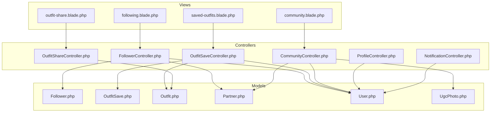
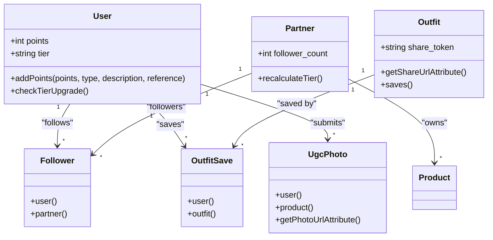
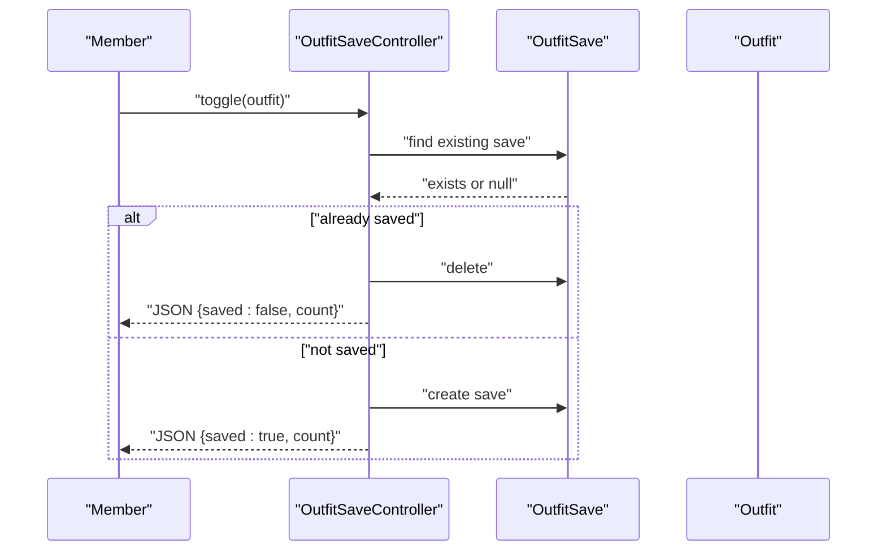
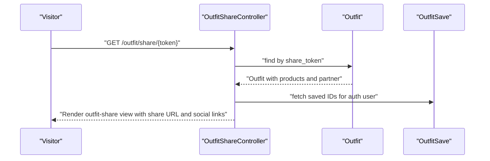
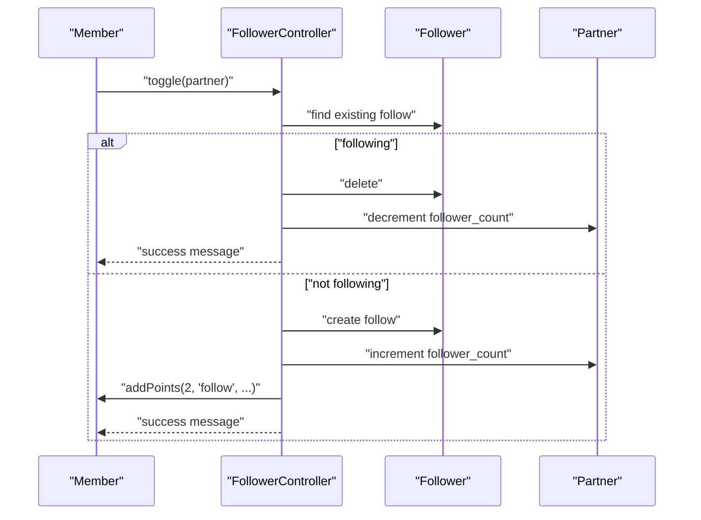
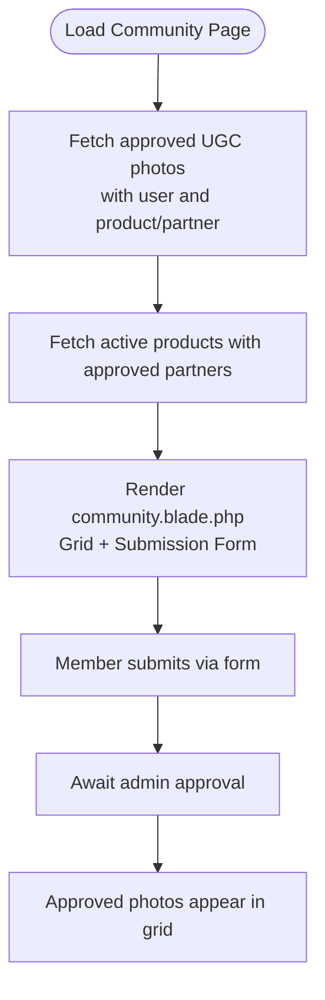
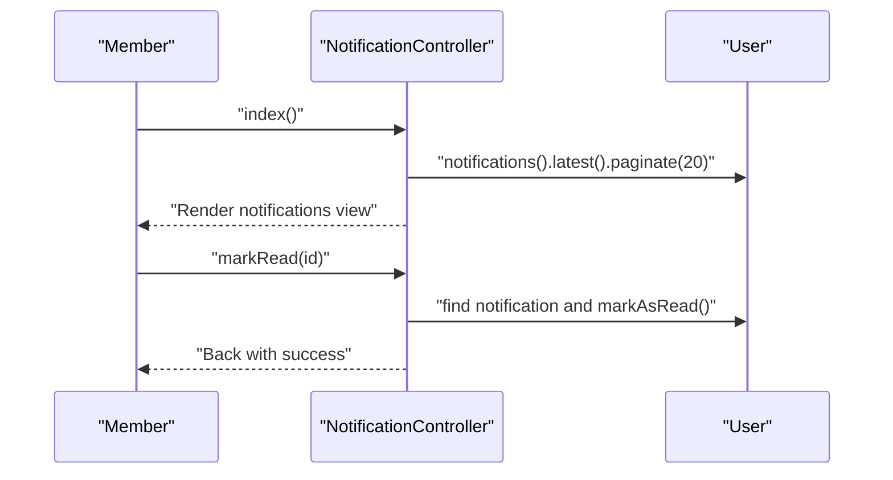
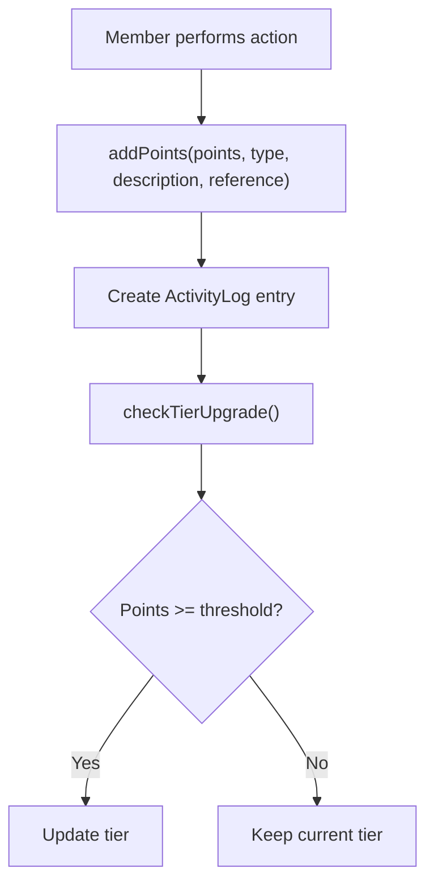
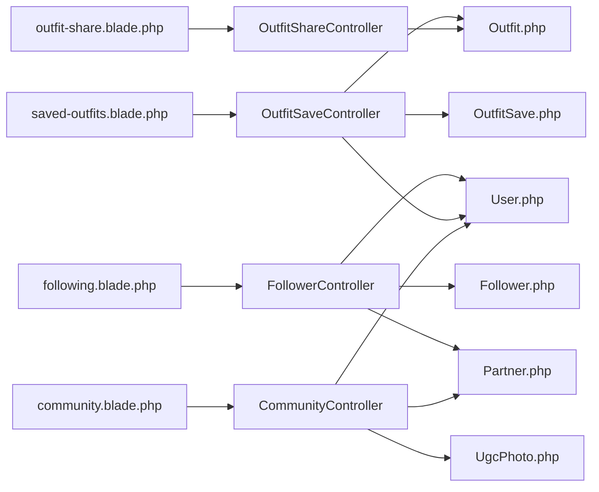

# Community and Social Features

<cite>
**Referenced Files in This Document**
- [FollowerController.php](file://app/Http/Controllers/Member/FollowerController.php)
- [OutfitSaveController.php](file://app/Http/Controllers/Member/OutfitSaveController.php)
- [OutfitShareController.php](file://app/Http/Controllers/OutfitShareController.php)
- [CommunityController.php](file://app/Http/Controllers/CommunityController.php)
- [Follower.php](file://app/Models/Follower.php)
- [OutfitSave.php](file://app/Models/OutfitSave.php)
- [Outfit.php](file://app/Models/Outfit.php)
- [Partner.php](file://app/Models/Partner.php)
- [User.php](file://app/Models/User.php)
- [UgcPhoto.php](file://app/Models/UgcPhoto.php)
- [2026_07_01_100003_create_followers_table.php](file://database/migrations/2026_07_01_100003_create_followers_table.php)
- [2026_05_25_013311_create_outfit_saves_table.php](file://database/migrations/2026_05_25_013311_create_outfit_saves_table.php)
- [community.blade.php](file://resources/views/public/community.blade.php)
- [outfit-share.blade.php](file://resources/views/catalog/outfit-share.blade.php)
- [saved-outfits.blade.php](file://resources/views/member/saved-outfits.blade.php)
- [following.blade.php](file://resources/views/member/following.blade.php)
- [ProfileController.php](file://app/Http/Controllers/Member/ProfileController.php)
- [NotificationController.php](file://app/Http/Controllers/Member/NotificationController.php)
</cite>

## Table of Contents
1. [Introduction](#introduction)
2. [Project Structure](#project-structure)
3. [Core Components](#core-components)
4. [Architecture Overview](#architecture-overview)
5. [Detailed Component Analysis](#detailed-component-analysis)
6. [Dependency Analysis](#dependency-analysis)
7. [Performance Considerations](#performance-considerations)
8. [Troubleshooting Guide](#troubleshooting-guide)
9. [Conclusion](#conclusion)
10. [Appendices](#appendices)

## Introduction
This document explains the community and social features implemented in the codebase, focusing on:
- Outfit saving and sharing, including community showcase via shared links
- Follower/following system for connecting members with partner stores
- Community photo showcase (UGC) and submission workflow
- Social sharing capabilities and integrations
- Gamification and engagement via points and tiers
- Privacy and safety controls for social interactions
- Growth strategies through social proof and engagement

## Project Structure
The community and social features span controllers, models, views, and database migrations. Key areas:
- Member-facing social actions: saving outfits, following stores, viewing saved collections, notifications
- Community showcase: public UGC gallery and shareable outfit pages
- Models define relationships and attributes supporting social interactions
- Views render social features with responsive UI and share affordances

**Diagram sources**
- [FollowerController.php:10-44](file://app/Http/Controllers/Member/FollowerController.php#L10-L44)
- [OutfitSaveController.php:13-48](file://app/Http/Controllers/Member/OutfitSaveController.php#L13-L48)
- [OutfitShareController.php:8-28](file://app/Http/Controllers/OutfitShareController.php#L8-L28)
- [CommunityController.php:9-29](file://app/Http/Controllers/CommunityController.php#L9-L29)
- [Follower.php:6-22](file://app/Models/Follower.php#L6-L22)
- [OutfitSave.php:7-16](file://app/Models/OutfitSave.php#L7-L16)
- [Outfit.php:8-59](file://app/Models/Outfit.php#L8-L59)
- [Partner.php:8-122](file://app/Models/Partner.php#L8-L122)
- [User.php:10-131](file://app/Models/User.php#L10-L131)
- [UgcPhoto.php:7-23](file://app/Models/UgcPhoto.php#L7-L23)
- [community.blade.php:11-28](file://resources/views/public/community.blade.php#L11-L28)
- [saved-outfits.blade.php:51-92](file://resources/views/member/saved-outfits.blade.php#L51-L92)
- [following.blade.php:44-68](file://resources/views/member/following.blade.php#L44-L68)
- [outfit-share.blade.php:65-149](file://resources/views/catalog/outfit-share.blade.php#L65-L149)

**Section sources**
- [FollowerController.php:10-44](file://app/Http/Controllers/Member/FollowerController.php#L10-L44)
- [OutfitSaveController.php:13-48](file://app/Http/Controllers/Member/OutfitSaveController.php#L13-L48)
- [OutfitShareController.php:8-28](file://app/Http/Controllers/OutfitShareController.php#L8-L28)
- [CommunityController.php:9-29](file://app/Http/Controllers/CommunityController.php#L9-L29)
- [community.blade.php:11-28](file://resources/views/public/community.blade.php#L11-L28)
- [saved-outfits.blade.php:51-92](file://resources/views/member/saved-outfits.blade.php#L51-L92)
- [following.blade.php:44-68](file://resources/views/member/following.blade.php#L44-L68)
- [outfit-share.blade.php:65-149](file://resources/views/catalog/outfit-share.blade.php#L65-L149)

## Core Components
- Outfit saving and collection management
- Outfit sharing via unique tokens and social copy-to-clipboard
- Follower/following relationship between members and partner stores
- Community photo showcase (UGC) with submission form
- Notifications and profile management for social engagement
- Gamification via points and tier progression

**Section sources**
- [OutfitSaveController.php:15-34](file://app/Http/Controllers/Member/OutfitSaveController.php#L15-L34)
- [OutfitShareController.php:10-27](file://app/Http/Controllers/OutfitShareController.php#L10-L27)
- [FollowerController.php:12-29](file://app/Http/Controllers/Member/FollowerController.php#L12-L29)
- [CommunityController.php:11-28](file://app/Http/Controllers/CommunityController.php#L11-L28)
- [NotificationController.php:10-30](file://app/Http/Controllers/Member/NotificationController.php#L10-L30)
- [ProfileController.php:11-31](file://app/Http/Controllers/Member/ProfileController.php#L11-L31)
- [User.php:104-129](file://app/Models/User.php#L104-L129)

## Architecture Overview
The social features follow a layered MVC pattern:
- Controllers orchestrate requests and coordinate model queries
- Models encapsulate relationships and business logic (e.g., points, tiers)
- Views render UI with social affordances (save, follow, share)
- Database migrations define normalized tables for followers and saves

**Diagram sources**
- [User.php:10-131](file://app/Models/User.php#L10-L131)
- [Partner.php:8-122](file://app/Models/Partner.php#L8-L122)
- [Follower.php:6-22](file://app/Models/Follower.php#L6-L22)
- [Outfit.php:8-59](file://app/Models/Outfit.php#L8-L59)
- [OutfitSave.php:7-16](file://app/Models/OutfitSave.php#L7-L16)
- [UgcPhoto.php:7-23](file://app/Models/UgcPhoto.php#L7-L23)

## Detailed Component Analysis

### Outfit Saving and Collection
Members can save outfits to build personal collections. The controller toggles saves, supports JSON responses for AJAX, and lists saved items with product and partner details.

**Diagram sources**
- [OutfitSaveController.php:15-34](file://app/Http/Controllers/Member/OutfitSaveController.php#L15-L34)
- [OutfitSave.php:7-16](file://app/Models/OutfitSave.php#L7-L16)
- [Outfit.php:45-48](file://app/Models/Outfit.php#L45-L48)

Key behaviors:
- Toggle save/unsave with immediate feedback
- Persisted via unique constraint on user_id and outfit_id
- Saved list paginated and enriched with product/partner data

**Section sources**
- [OutfitSaveController.php:15-48](file://app/Http/Controllers/Member/OutfitSaveController.php#L15-L48)
- [2026_05_25_013311_create_outfit_saves_table.php:9-19](file://database/migrations/2026_05_25_013311_create_outfit_saves_table.php#L9-L19)
- [saved-outfits.blade.php:51-92](file://resources/views/member/saved-outfits.blade.php#L51-L92)

### Outfit Sharing and Community Showcase
Outfits are shareable via generated tokens. The share controller resolves the outfit by token, preloads related products and partners, and exposes social links and WhatsApp integration.

**Diagram sources**
- [OutfitShareController.php:10-27](file://app/Http/Controllers/OutfitShareController.php#L10-L27)
- [Outfit.php:19-26](file://app/Models/Outfit.php#L19-L26)
- [Outfit.php:55-58](file://app/Models/Outfit.php#L55-L58)
- [outfit-share.blade.php:65-149](file://resources/views/catalog/outfit-share.blade.php#L65-L149)

Social features:
- Copy-to-clipboard for share URL
- Embedded WhatsApp chat links per item and bundle
- Responsive layout for item listings and pricing

**Section sources**
- [OutfitShareController.php:10-27](file://app/Http/Controllers/OutfitShareController.php#L10-L27)
- [Outfit.php:19-26](file://app/Models/Outfit.php#L19-L26)
- [outfit-share.blade.php:65-149](file://resources/views/catalog/outfit-share.blade.php#L65-L149)

### Follower/Following System
Members can follow partner stores. The controller toggles follow/unfollow, updates follower counts, and grants points for following. The following page lists stores with product and follower counts.

**Diagram sources**
- [FollowerController.php:12-29](file://app/Http/Controllers/Member/FollowerController.php#L12-L29)
- [Follower.php:6-22](file://app/Models/Follower.php#L6-L22)
- [Partner.php:45-48](file://app/Models/Partner.php#L45-L48)
- [User.php:104-117](file://app/Models/User.php#L104-L117)

**Section sources**
- [FollowerController.php:12-43](file://app/Http/Controllers/Member/FollowerController.php#L12-L43)
- [2026_07_01_100003_create_followers_table.php:10-18](file://database/migrations/2026_07_01_100003_create_followers_table.php#L10-L18)
- [following.blade.php:44-68](file://resources/views/member/following.blade.php#L44-L68)

### Community Photo Showcase and Submission
The community controller aggregates approved UGC photos and active products for discovery. The public view renders a masonry grid, submission form, and approval steps.

**Diagram sources**
- [CommunityController.php:11-28](file://app/Http/Controllers/CommunityController.php#L11-L28)
- [community.blade.php:11-28](file://resources/views/public/community.blade.php#L11-L28)
- [community.blade.php:139-167](file://resources/views/public/community.blade.php#L139-L167)

**Section sources**
- [CommunityController.php:11-28](file://app/Http/Controllers/CommunityController.php#L11-L28)
- [community.blade.php:11-180](file://resources/views/public/community.blade.php#L11-L180)

### Notifications and Profile Management
Members can view notifications and manage profile details. The notification controller paginates unread notifications and supports marking as read.

**Diagram sources**
- [NotificationController.php:10-30](file://app/Http/Controllers/Member/NotificationController.php#L10-L30)
- [NotificationController.php:19-29](file://app/Http/Controllers/Member/NotificationController.php#L19-L29)

Profile updates validate and persist name, phone, and bio.

**Section sources**
- [NotificationController.php:10-30](file://app/Http/Controllers/Member/NotificationController.php#L10-L30)
- [ProfileController.php:11-31](file://app/Http/Controllers/Member/ProfileController.php#L11-L31)

### Gamification and Engagement
The User model centralizes gamification:
- Points are awarded for actions (e.g., following)
- Activity logs record points and references
- Tier upgrade checks compare accumulated points against thresholds

**Diagram sources**
- [User.php:104-129](file://app/Models/User.php#L104-L129)

**Section sources**
- [User.php:104-129](file://app/Models/User.php#L104-L129)

## Dependency Analysis
- Controllers depend on models for persistence and retrieval
- Views depend on controller-provided data and route helpers
- Migrations define foreign keys and unique constraints ensuring referential integrity

**Diagram sources**
- [FollowerController.php:10-44](file://app/Http/Controllers/Member/FollowerController.php#L10-L44)
- [OutfitSaveController.php:13-48](file://app/Http/Controllers/Member/OutfitSaveController.php#L13-L48)
- [OutfitShareController.php:8-28](file://app/Http/Controllers/OutfitShareController.php#L8-L28)
- [CommunityController.php:9-29](file://app/Http/Controllers/CommunityController.php#L9-L29)
- [Follower.php:6-22](file://app/Models/Follower.php#L6-L22)
- [OutfitSave.php:7-16](file://app/Models/OutfitSave.php#L7-L16)
- [Outfit.php:8-59](file://app/Models/Outfit.php#L8-L59)
- [Partner.php:8-122](file://app/Models/Partner.php#L8-L122)
- [User.php:10-131](file://app/Models/User.php#L10-L131)
- [UgcPhoto.php:7-23](file://app/Models/UgcPhoto.php#L7-L23)
- [saved-outfits.blade.php:51-92](file://resources/views/member/saved-outfits.blade.php#L51-L92)
- [outfit-share.blade.php:65-149](file://resources/views/catalog/outfit-share.blade.php#L65-L149)
- [community.blade.php:11-28](file://resources/views/public/community.blade.php#L11-L28)
- [following.blade.php:44-68](file://resources/views/member/following.blade.php#L44-L68)

**Section sources**
- [2026_07_01_100003_create_followers_table.php:10-18](file://database/migrations/2026_07_01_100003_create_followers_table.php#L10-L18)
- [2026_05_25_013311_create_outfit_saves_table.php:11-19](file://database/migrations/2026_05_25_013311_create_outfit_saves_table.php#L11-L19)

## Performance Considerations
- Eager load relationships in controllers to reduce N+1 queries (e.g., with('products.partner') for saved outfits and share page)
- Use pagination for UGC grids and notifications
- Minimize heavy computations in views; compute totals and derived attributes in models when appropriate
- Cache frequently accessed partner metadata if traffic grows

## Troubleshooting Guide
- Outfit share link not found: ensure share_token exists and Outfit creation boot generates tokens
- Cannot save outfit: verify unique constraint on user_id and outfit_id and that the user is authenticated
- Follow button not updating: confirm follower records are created/deleted and follower_count increments/decrements on Partner
- UGC grid empty: check photo status filtering and product approvals
- Notifications not marking read: ensure the logged-in user owns the notification and the ID is valid

**Section sources**
- [Outfit.php:19-26](file://app/Models/Outfit.php#L19-L26)
- [OutfitSaveController.php:15-34](file://app/Http/Controllers/Member/OutfitSaveController.php#L15-L34)
- [FollowerController.php:12-29](file://app/Http/Controllers/Member/FollowerController.php#L12-L29)
- [CommunityController.php:13-15](file://app/Http/Controllers/CommunityController.php#L13-L15)
- [NotificationController.php:19-29](file://app/Http/Controllers/Member/NotificationController.php#L19-L29)

## Conclusion
The codebase provides a robust foundation for community and social features:
- Members can curate outfits, share them widely, and engage with partner stores
- Community photo showcase encourages participation and social proof
- Notifications and profiles support ongoing engagement
- Gamification reinforces participation and progression
Future enhancements could include hashtag tagging, trending topics, moderation tools, analytics dashboards, and advanced privacy controls.

## Appendices

### Social Sharing Capabilities
- Outfit share URL generation and copy-to-clipboard
- Embedded WhatsApp links for individual items and bundles
- Open Graph meta tags for improved social previews

**Section sources**
- [Outfit.php:55-58](file://app/Models/Outfit.php#L55-L58)
- [outfit-share.blade.php:6-8](file://resources/views/catalog/outfit-share.blade.php#L6-L8)
- [outfit-share.blade.php:88-104](file://resources/views/catalog/outfit-share.blade.php#L88-L104)
- [outfit-share.blade.php:112-147](file://resources/views/catalog/outfit-share.blade.php#L112-L147)

### Privacy Controls and Safety
- Authentication gating for saving and following actions
- Public UGC requires admin approval before display
- Profile updates validate input fields

**Section sources**
- [OutfitSaveController.php:15-34](file://app/Http/Controllers/Member/OutfitSaveController.php#L15-L34)
- [FollowerController.php:12-29](file://app/Http/Controllers/Member/FollowerController.php#L12-L29)
- [CommunityController.php:13-15](file://app/Http/Controllers/CommunityController.php#L13-L15)
- [ProfileController.php:22-26](file://app/Http/Controllers/Member/ProfileController.php#L22-L26)

### Growth Strategies Through Social Proof
- Highlight follower counts and store tiers to encourage following
- Feature UGC submissions to showcase real customer styles
- Offer points/tiers to incentivize participation and sharing

**Section sources**
- [Partner.php:45-48](file://app/Models/Partner.php#L45-L48)
- [Partner.php:83-101](file://app/Models/Partner.php#L83-L101)
- [User.php:104-117](file://app/Models/User.php#L104-L117)