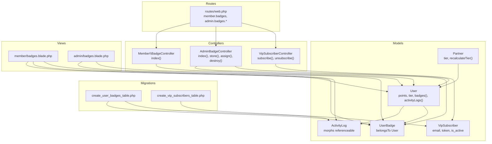
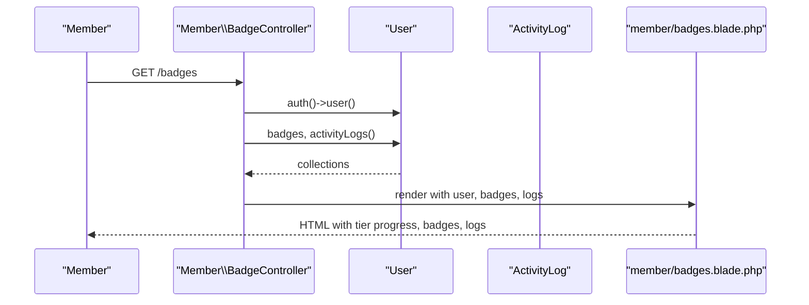
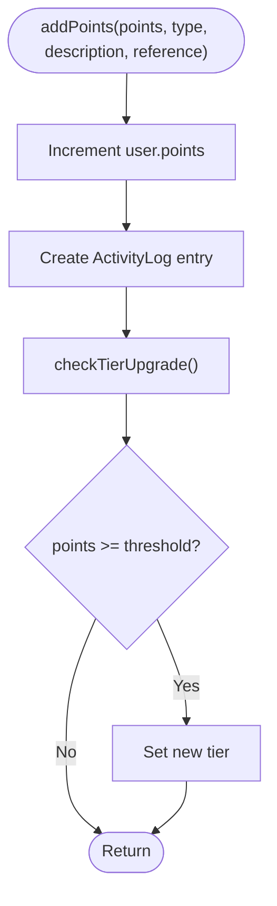
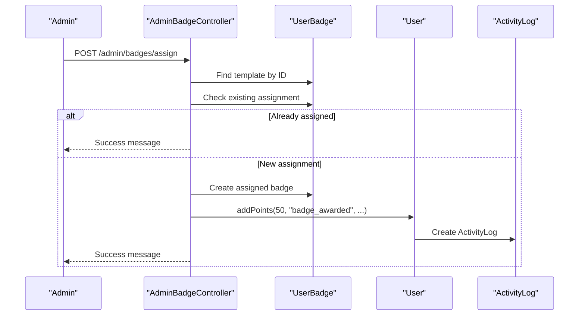
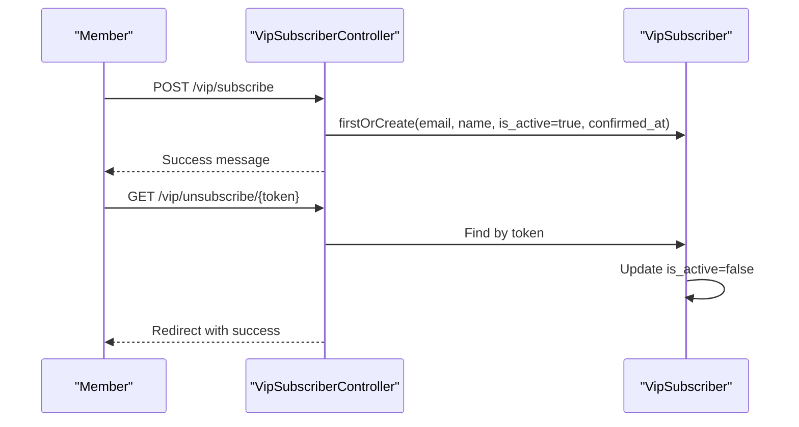
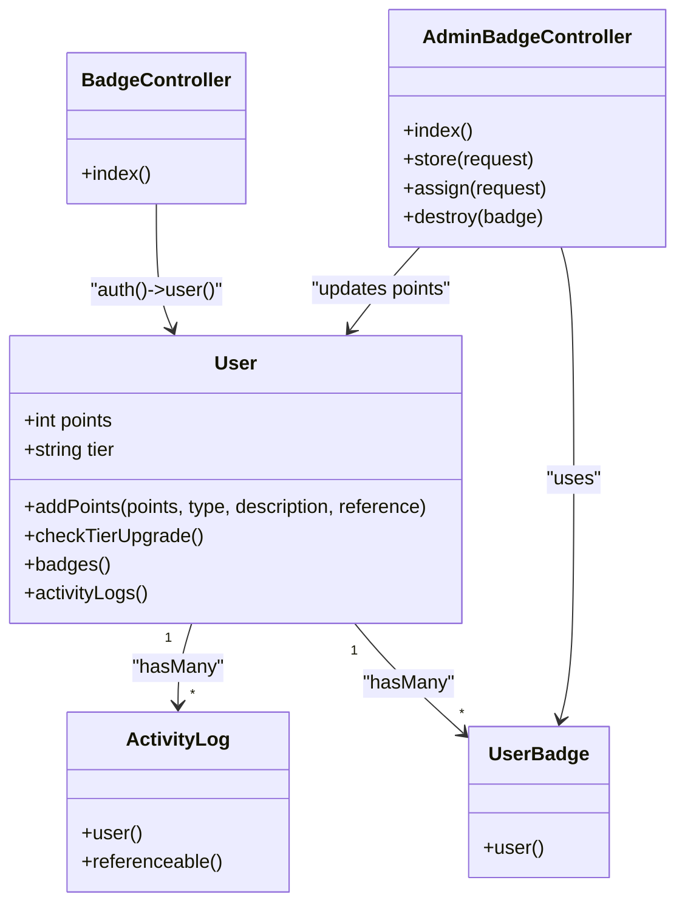
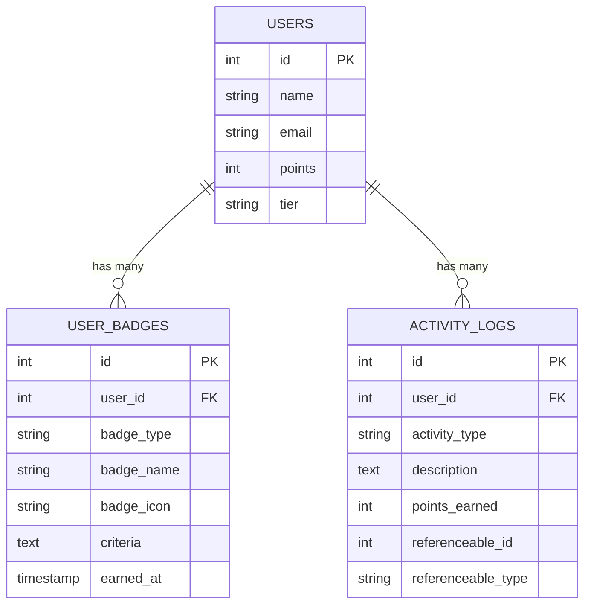

# Gamification and Rewards System

<cite>
**Referenced Files in This Document**
- [User.php](file://app/Models/User.php)
- [ActivityLog.php](file://app/Models/ActivityLog.php)
- [UserBadge.php](file://app/Models/UserBadge.php)
- [BadgeController.php](file://app/Http/Controllers/Member/BadgeController.php)
- [AdminBadgeController.php](file://app/Http/Controllers/AdminBadgeController.php)
- [web.php](file://routes/web.php)
- [badges.blade.php](file://resources/views/member/badges.blade.php)
- [admin/badges.blade.php](file://resources/views/admin/badges.blade.php)
- [2026_07_01_100006_create_user_badges_table.php](file://database/migrations/2026_07_01_100006_create_user_badges_table.php)
- [Partner.php](file://app/Models/Partner.php)
- [VipSubscriber.php](file://app/Models/VipSubscriber.php)
- [VipSubscriberController.php](file://app/Http/Controllers/VipSubscriberController.php)
- [2026_05_28_131138_create_vip_subscribers_table.php](file://database/migrations/2026_05_28_131138_create_vip_subscribers_table.php)
</cite>

## Table of Contents
1. [Introduction](#introduction)
2. [Project Structure](#project-structure)
3. [Core Components](#core-components)
4. [Architecture Overview](#architecture-overview)
5. [Detailed Component Analysis](#detailed-component-analysis)
6. [Dependency Analysis](#dependency-analysis)
7. [Performance Considerations](#performance-considerations)
8. [Troubleshooting Guide](#troubleshooting-guide)
9. [Conclusion](#conclusion)
10. [Appendices](#appendices)

## Introduction
This document explains the member gamification and rewards system implemented in the platform. It covers badge acquisition criteria, achievement tracking, point accumulation, tier advancement, leaderboard-ready progression, and administrative controls. It also documents VIP subscription features, outlines missing leaderboard and reward redemption capabilities, and provides integration examples, analytics guidance, and troubleshooting steps.

## Project Structure
The gamification system spans models, controllers, views, routes, and database migrations:
- Models define the User, ActivityLog, UserBadge, Partner, and VipSubscriber entities.
- Controllers manage member-facing badges and admin badge creation/assignment/deletion.
- Blade templates render the member’s badges page and admin badge management UI.
- Routes expose member badge pages and admin badge endpoints.
- Migrations define the schema for user badges and activity logs.

**Diagram sources**
- [User.php:10-131](file://app/Models/User.php#L10-L131)
- [ActivityLog.php:1-23](file://app/Models/ActivityLog.php#L1-L23)
- [UserBadge.php:1-18](file://app/Models/UserBadge.php#L1-L18)
- [Partner.php:93-122](file://app/Models/Partner.php#L93-L122)
- [VipSubscriber.php:1-20](file://app/Models/VipSubscriber.php#L1-L20)
- [BadgeController.php:1-23](file://app/Http/Controllers/Member/BadgeController.php#L1-L23)
- [AdminBadgeController.php:1-82](file://app/Http/Controllers/AdminBadgeController.php#L1-L82)
- [VipSubscriberController.php:1-31](file://app/Http/Controllers/VipSubscriberController.php#L1-L31)
- [badges.blade.php:1-107](file://resources/views/member/badges.blade.php#L1-L107)
- [admin/badges.blade.php:74-151](file://resources/views/admin/badges.blade.php#L74-L151)
- [web.php:114-116](file://routes/web.php#L114-L116)
- [web.php:230-235](file://routes/web.php#L230-L235)
- [web.php:64-66](file://routes/web.php#L64-L66)
- [2026_07_01_100006_create_user_badges_table.php:10-33](file://database/migrations/2026_07_01_100006_create_user_badges_table.php#L10-L33)
- [2026_05_28_131138_create_vip_subscribers_table.php:1-19](file://database/migrations/2026_05_28_131138_create_vip_subscribers_table.php#L1-L19)

**Section sources**
- [web.php:114-116](file://routes/web.php#L114-L116)
- [web.php:230-235](file://routes/web.php#L230-L235)
- [web.php:64-66](file://routes/web.php#L64-L66)

## Core Components
- User model
  - Tracks points and tier level.
  - Provides helpers for tier emoji/name and methods to add points and check tier upgrades.
  - Defines relationships to badges and activity logs.
- ActivityLog model
  - Records earned points per activity with polymorphic reference support.
- UserBadge model
  - Stores badge metadata and links to a user.
- Member BadgeController
  - Renders the member’s badges page with recent activity logs.
- AdminBadgeController
  - Manages badge templates and assignment to members, including point awarding.
- Views
  - Member badges page displays tier progress, badges, and recent activity logs.
  - Admin badges page supports creating templates, assigning to members, and deleting templates.
- Routes
  - Expose member badge page and admin badge endpoints.
- Migrations
  - Define user_badges and activity_logs tables, including foreign keys and polymorphic references.

**Section sources**
- [User.php:104-130](file://app/Models/User.php#L104-L130)
- [ActivityLog.php:1-23](file://app/Models/ActivityLog.php#L1-L23)
- [UserBadge.php:1-18](file://app/Models/UserBadge.php#L1-L18)
- [BadgeController.php:9-21](file://app/Http/Controllers/Member/BadgeController.php#L9-L21)
- [AdminBadgeController.php:12-81](file://app/Http/Controllers/AdminBadgeController.php#L12-L81)
- [badges.blade.php:50-103](file://resources/views/member/badges.blade.php#L50-L103)
- [admin/badges.blade.php:74-151](file://resources/views/admin/badges.blade.php#L74-L151)
- [2026_07_01_100006_create_user_badges_table.php:10-33](file://database/migrations/2026_07_01_100006_create_user_badges_table.php#L10-L33)

## Architecture Overview
The gamification pipeline centers on the User model adding points via addPoints, which records an ActivityLog and triggers tier upgrade checks. Admins can create badge templates and assign them to members, optionally awarding points. The member view aggregates badges and recent activity logs.

**Diagram sources**
- [BadgeController.php:9-21](file://app/Http/Controllers/Member/BadgeController.php#L9-L21)
- [User.php:58-66](file://app/Models/User.php#L58-L66)
- [badges.blade.php:15-20](file://resources/views/member/badges.blade.php#L15-L20)

**Section sources**
- [BadgeController.php:9-21](file://app/Http/Controllers/Member/BadgeController.php#L9-L21)
- [User.php:58-66](file://app/Models/User.php#L58-L66)
- [badges.blade.php:50-103](file://resources/views/member/badges.blade.php#L50-L103)

## Detailed Component Analysis

### Point Accumulation and Tier Advancement
- Point addition
  - Users gain points through addPoints, which increments points and creates an ActivityLog entry.
  - The method accepts activity type, optional description, and a referenceable entity (e.g., product or outfit).
- Tier upgrade
  - After adding points, the system checks whether the user qualifies for a higher tier based on thresholds.
  - Tiers: regular, silver, gold, platinum with increasing minimum point thresholds.

**Diagram sources**
- [User.php:105-117](file://app/Models/User.php#L105-L117)
- [User.php:119-129](file://app/Models/User.php#L119-L129)

**Section sources**
- [User.php:105-117](file://app/Models/User.php#L105-L117)
- [User.php:119-129](file://app/Models/User.php#L119-L129)

### Badge Acquisition Criteria and Achievement Tracking
- Badge templates
  - Admins create badge templates with name, icon, type, and optional criteria.
- Badge assignment
  - Admins assign a template to a specific member, preventing duplicates.
  - On successful assignment, the member receives points and a log entry is created.
- Achievement tracking
  - ActivityLog stores points earned per activity and references related entities.
  - Member view lists recent activity logs with descriptions and timestamps.

**Diagram sources**
- [AdminBadgeController.php:45-74](file://app/Http/Controllers/AdminBadgeController.php#L45-L74)
- [UserBadge.php:13-16](file://app/Models/UserBadge.php#L13-L16)
- [User.php:105-117](file://app/Models/User.php#L105-L117)
- [ActivityLog.php:13-21](file://app/Models/ActivityLog.php#L13-L21)

**Section sources**
- [AdminBadgeController.php:24-43](file://app/Http/Controllers/AdminBadgeController.php#L24-L43)
- [AdminBadgeController.php:45-74](file://app/Http/Controllers/AdminBadgeController.php#L45-L74)
- [UserBadge.php:1-18](file://app/Models/UserBadge.php#L1-L18)
- [ActivityLog.php:1-23](file://app/Models/ActivityLog.php#L1-L23)
- [badges.blade.php:90-103](file://resources/views/member/badges.blade.php#L90-L103)

### Leaderboard Functionality and Competitive Elements
- Current state
  - The member view computes and displays tier progress percentage based on points and thresholds.
  - No global leaderboard or ranking is implemented in the current codebase.
- Recommendations
  - Add a leaderboard endpoint that ranks users by points or tiers.
  - Provide periodic leaderboards by week/month using aggregated activity logs.

[No sources needed since this section provides general guidance]

### Social Recognition and Personalization
- Social recognition
  - Member badges page showcases earned badges with icons and types.
  - Admin badge management allows curated recognition by role.
- Personalization
  - Badge types include community, review, loyalty, and special categories for tailored recognition.

**Section sources**
- [badges.blade.php:75-88](file://resources/views/member/badges.blade.php#L75-L88)
- [admin/badges.blade.php:89-94](file://resources/views/admin/badges.blade.php#L89-L94)

### Reward Redemption and Exclusive Benefits
- Current state
  - No reward redemption system or exclusive benefits are implemented in the current codebase.
- Recommendations
  - Introduce a points-to-rewards ledger with configurable redemptions.
  - Offer exclusive benefits such as early access or discounts for higher tiers.

[No sources needed since this section provides general guidance]

### Challenge Systems, Daily/Weekly Goals, and Streak Maintenance
- Current state
  - No built-in challenge system, daily/weekly goals, or streak tracking exists.
- Recommendations
  - Define recurring challenges with point targets and deadlines.
  - Track consecutive-day actions and maintain streaks with reminders and milestones.

[No sources needed since this section provides general guidance]

### Seasonal Campaigns and Personalized Recommendations
- Current state
  - No seasonal campaign engine or personalized reward recommendation system is present.
- Recommendations
  - Implement seasonal events with themed badges and bonus point multipliers.
  - Use activity logs to suggest relevant badges or challenges to members.

[No sources needed since this section provides general guidance]

### VIP Status Features
- Subscription
  - Members can subscribe to VIP using an email and name; a token is generated for unsubscription.
  - Subscriptions are tracked with activation status and confirmation timestamps.
- Integration
  - VIP subscribers could receive exclusive badges or bonus points during campaigns.

**Diagram sources**
- [VipSubscriberController.php:10-31](file://app/Http/Controllers/VipSubscriberController.php#L10-L31)
- [VipSubscriber.php:12-20](file://app/Models/VipSubscriber.php#L12-L20)
- [2026_05_28_131138_create_vip_subscribers_table.php:8-16](file://database/migrations/2026_05_28_131138_create_vip_subscribers_table.php#L8-L16)

**Section sources**
- [VipSubscriberController.php:10-31](file://app/Http/Controllers/VipSubscriberController.php#L10-L31)
- [VipSubscriber.php:1-20](file://app/Models/VipSubscriber.php#L1-20)
- [2026_05_28_131138_create_vip_subscribers_table.php:1-19](file://database/migrations/2026_05_28_131138_create_vip_subscribers_table.php#L1-L19)

## Dependency Analysis
The gamification components depend on:
- User model for points, tier, badges, and activity logs.
- Polymorphic ActivityLog for linking points to specific entities.
- AdminBadgeController for managing badge templates and assignments.
- Member BadgeController for rendering the user-facing badges page.
- Routes exposing member and admin endpoints.

**Diagram sources**
- [User.php:58-130](file://app/Models/User.php#L58-L130)
- [ActivityLog.php:13-21](file://app/Models/ActivityLog.php#L13-L21)
- [UserBadge.php:13-16](file://app/Models/UserBadge.php#L13-L16)
- [BadgeController.php:9-21](file://app/Http/Controllers/Member/BadgeController.php#L9-L21)
- [AdminBadgeController.php:12-81](file://app/Http/Controllers/AdminBadgeController.php#L12-L81)

**Section sources**
- [User.php:58-130](file://app/Models/User.php#L58-L130)
- [ActivityLog.php:13-21](file://app/Models/ActivityLog.php#L13-L21)
- [UserBadge.php:13-16](file://app/Models/UserBadge.php#L13-L16)
- [BadgeController.php:9-21](file://app/Http/Controllers/Member/BadgeController.php#L9-L21)
- [AdminBadgeController.php:12-81](file://app/Http/Controllers/AdminBadgeController.php#L12-L81)

## Performance Considerations
- Indexing
  - Ensure foreign keys on user_badges.user_id and activity_logs.user_id are indexed for fast joins.
  - Consider indexing activity_logs.created_at for efficient recent-activity queries.
- Aggregation
  - Limit recent activity log fetches to small page sizes (as currently capped at 50).
- Tier calculation
  - checkTierUpgrade performs a simple loop over thresholds; keep thresholds minimal and ordered for O(n) performance.

[No sources needed since this section provides general guidance]

## Troubleshooting Guide
- Points not updating
  - Verify addPoints is called with positive integer points and valid activity type.
  - Confirm ActivityLog creation succeeds and user.points increment occurs.
- Duplicate badge assignment
  - Assignment prevents duplicates; if a member appears to lack a badge, check the unique constraint on user_id and badge_name.
- Missing activity logs
  - Ensure the member view requests latest logs and pagination limits are acceptable.
- Admin badge template deletion
  - Deleting a template does not retroactively remove assigned badges; manage assignments accordingly.

**Section sources**
- [User.php:105-117](file://app/Models/User.php#L105-L117)
- [ActivityLog.php:13-21](file://app/Models/ActivityLog.php#L13-L21)
- [AdminBadgeController.php:54-60](file://app/Http/Controllers/AdminBadgeController.php#L54-L60)
- [BadgeController.php:13](file://app/Http/Controllers/Member/BadgeController.php#L13)

## Conclusion
The platform implements a robust foundation for member gamification with points, tier progression, badge templates, and achievement logging. Administrators can curate badges and award points, while members can track progress and recent activity. To become a full-featured gamification system, the platform should add a leaderboard, reward redemption, challenge systems, seasonal campaigns, and VIP-exclusive benefits.

## Appendices

### API and Endpoint Reference
- Member badge page
  - GET /badges → Member\BadgeController@index
- Admin badge management
  - GET /admin/badges → AdminBadgeController@index
  - POST /admin/badges → AdminBadgeController@store
  - POST /admin/badges/assign → AdminBadgeController@assign
  - DELETE /admin/badges/{badge} → AdminBadgeController@destroy
- VIP membership
  - POST /vip/subscribe → VipSubscriberController@subscribe
  - GET /vip/unsubscribe/{token} → VipSubscriberController@unsubscribe

**Section sources**
- [web.php:114-116](file://routes/web.php#L114-L116)
- [web.php:230-235](file://routes/web.php#L230-L235)
- [web.php:64-66](file://routes/web.php#L64-L66)

### Data Model Diagram

**Diagram sources**
- [2026_07_01_100006_create_user_badges_table.php:10-33](file://database/migrations/2026_07_01_100006_create_user_badges_table.php#L10-L33)
- [User.php:14-17](file://app/Models/User.php#L14-L17)