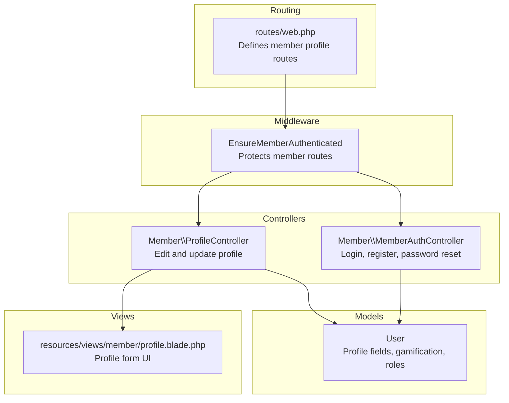
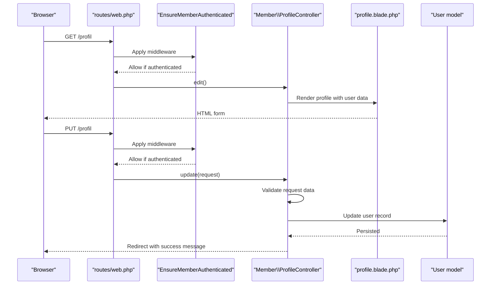
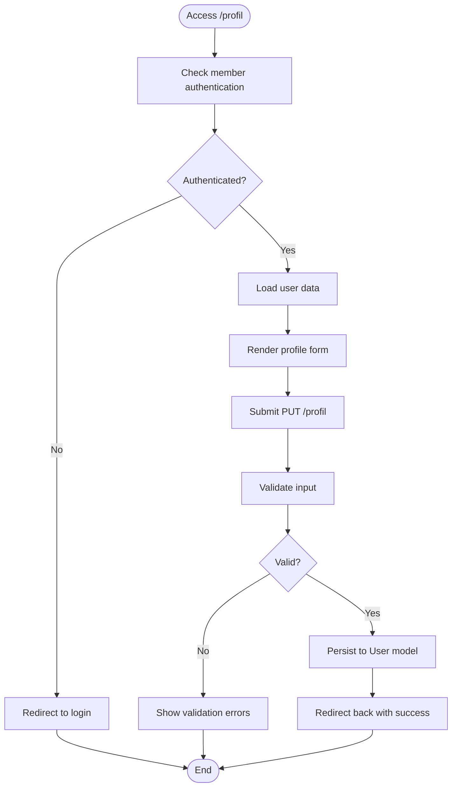
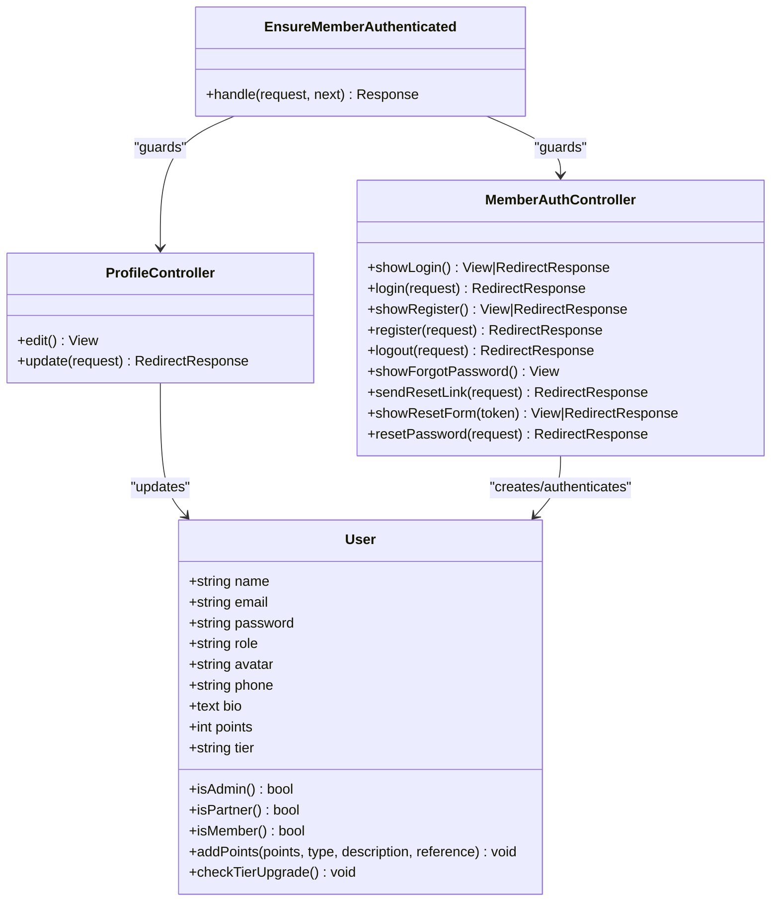
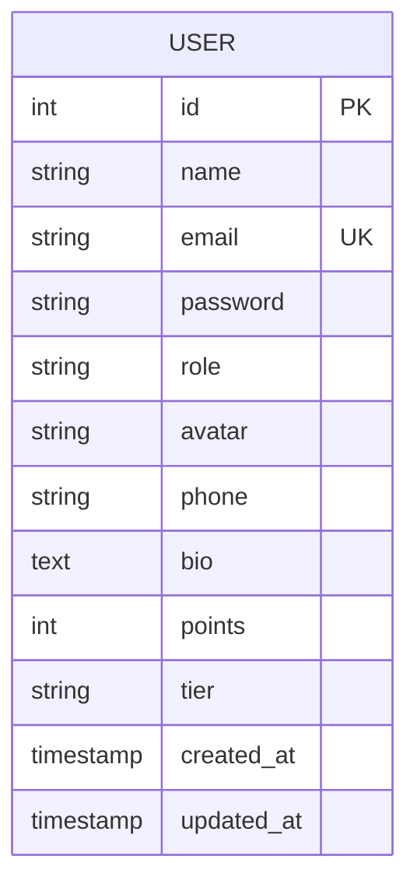

# Member Profile Management

<cite>
**Referenced Files in This Document**
- [ProfileController.php](file://app/Http/Controllers/Member/ProfileController.php)
- [User.php](file://app/Models/User.php)
- [profile.blade.php](file://resources/views/member/profile.blade.php)
- [web.php](file://routes/web.php)
- [EnsureMemberAuthenticated.php](file://app/Http/Middleware/EnsureMemberAuthenticated.php)
- [MemberAuthController.php](file://app/Http/Controllers/Member/MemberAuthController.php)
- [2026_07_01_100000_add_auth_and_tier_to_users.php](file://database/migrations/2026_07_01_100000_add_auth_and_tier_to_users.php)
- [sanctum.php](file://config/sanctum.php)
- [auth.php](file://config/auth.php)
- [UgcController.php](file://app/Http/Controllers/UgcController.php)
- [UgcPhoto.php](file://app/Models/UgcPhoto.php)
- [community.blade.php](file://resources/views/public/community.blade.php)
- [PartnerAnalyticsController.php](file://app/Http/Controllers/Partner/PartnerAnalyticsController.php)
- [analytics.blade.php](file://resources/views/partner/analytics.blade.php)
- [AdminDashboardController.php](file://app/Http/Controllers/AdminDashboardController.php)
- [OutfitShareController.php](file://app/Http/Controllers/OutfitShareController.php)
</cite>

## Table of Contents
1. [Introduction](#introduction)
2. [Project Structure](#project-structure)
3. [Core Components](#core-components)
4. [Architecture Overview](#architecture-overview)
5. [Detailed Component Analysis](#detailed-component-analysis)
6. [Dependency Analysis](#dependency-analysis)
7. [Performance Considerations](#performance-considerations)
8. [Troubleshooting Guide](#troubleshooting-guide)
9. [Conclusion](#conclusion)
10. [Appendices](#appendices)

## Introduction
This document provides comprehensive documentation for member profile management functionality in the KatalogThrift platform. It covers profile creation and editing workflows, personal information management, avatar uploads, privacy settings, profile completion requirements, verification processes, account activation, visibility controls, analytics and engagement metrics, security features, password management, and data validation and storage mechanisms. It also includes customization options, troubleshooting guidance, and data migration considerations.

## Project Structure
Member profile management spans several layers:
- Routes define the profile endpoints and apply member authentication middleware.
- Controllers handle profile editing and updates, and member authentication flows.
- Models encapsulate user data, gamification attributes, and relationships.
- Views render the profile UI and forms.
- Middleware enforces authentication for member-only actions.
- Configuration files govern authentication, session, and API token behavior.

**Diagram sources**
- [web.php:110-116](file://routes/web.php#L110-L116)
- [ProfileController.php:9-32](file://app/Http/Controllers/Member/ProfileController.php#L9-L32)
- [MemberAuthController.php:15-129](file://app/Http/Controllers/Member/MemberAuthController.php#L15-L129)
- [User.php:10-131](file://app/Models/User.php#L10-L131)
- [profile.blade.php:1-83](file://resources/views/member/profile.blade.php#L1-L83)
- [EnsureMemberAuthenticated.php:9-21](file://app/Http/Middleware/EnsureMemberAuthenticated.php#L9-L21)

**Section sources**
- [web.php:110-116](file://routes/web.php#L110-L116)
- [ProfileController.php:9-32](file://app/Http/Controllers/Member/ProfileController.php#L9-L32)
- [MemberAuthController.php:15-129](file://app/Http/Controllers/Member/MemberAuthController.php#L15-L129)
- [User.php:10-131](file://app/Models/User.php#L10-L131)
- [profile.blade.php:1-83](file://resources/views/member/profile.blade.php#L1-L83)
- [EnsureMemberAuthenticated.php:9-21](file://app/Http/Middleware/EnsureMemberAuthenticated.php#L9-L21)

## Core Components
- ProfileController: Provides the profile edit page and handles profile updates for authenticated members.
- User model: Stores profile fields (name, phone, bio), gamification points and tier, role, and related associations.
- MemberAuthController: Manages registration, login, logout, and password reset flows for members.
- Middleware EnsureMemberAuthenticated: Guards member-only routes.
- Blade template profile.blade.php: Renders the profile form and displays user information.
- Migration add_auth_and_tier_to_users: Adds profile-related fields to the users table.
- Configuration: Sanctum and auth configs support session and token-based authentication.

Key capabilities:
- Edit personal information (name, phone, bio).
- Update profile with server-side validation.
- Access profile page after login.
- Manage password reset lifecycle.
- Track gamification points and tier progression.

**Section sources**
- [ProfileController.php:9-32](file://app/Http/Controllers/Member/ProfileController.php#L9-L32)
- [User.php:14-26](file://app/Models/User.php#L14-L26)
- [MemberAuthController.php:44-63](file://app/Http/Controllers/Member/MemberAuthController.php#L44-L63)
- [EnsureMemberAuthenticated.php:11-19](file://app/Http/Middleware/EnsureMemberAuthenticated.php#L11-L19)
- [profile.blade.php:62-83](file://resources/views/member/profile.blade.php#L62-L83)
- [2026_07_01_100000_add_auth_and_tier_to_users.php:11-26](file://database/migrations/2026_07_01_100000_add_auth_and_tier_to_users.php#L11-L26)
- [sanctum.php:18-50](file://config/sanctum.php#L18-L50)
- [auth.php:97-118](file://config/auth.php#L97-L118)

## Architecture Overview
The member profile feature follows a layered MVC pattern:
- Routes define GET /profil and PUT /profil endpoints under member.auth middleware.
- EnsureMemberAuthenticated redirects unauthenticated requests to login.
- ProfileController.edit returns the profile view with current user data.
- ProfileController.update validates input and persists changes to the User model.
- MemberAuthController handles registration, login, logout, and password reset.
- User model manages profile fields, gamification, and relationships.

**Diagram sources**
- [web.php:110-116](file://routes/web.php#L110-L116)
- [EnsureMemberAuthenticated.php:11-19](file://app/Http/Middleware/EnsureMemberAuthenticated.php#L11-L19)
- [ProfileController.php:11-32](file://app/Http/Controllers/Member/ProfileController.php#L11-L32)
- [profile.blade.php:62-83](file://resources/views/member/profile.blade.php#L62-L83)
- [User.php:14-26](file://app/Models/User.php#L14-L26)

## Detailed Component Analysis

### Profile Editing Workflow
- Endpoint: GET /profil renders the profile form.
- Endpoint: PUT /profil processes updates.
- Validation ensures name is required and within length limits; phone and bio are optional with length limits.
- On success, the controller redirects back with a success message.

**Diagram sources**
- [web.php:110-116](file://routes/web.php#L110-L116)
- [ProfileController.php:19-32](file://app/Http/Controllers/Member/ProfileController.php#L19-L32)
- [profile.blade.php:62-83](file://resources/views/member/profile.blade.php#L62-L83)

**Section sources**
- [web.php:110-116](file://routes/web.php#L110-L116)
- [ProfileController.php:11-32](file://app/Http/Controllers/Member/ProfileController.php#L11-L32)
- [profile.blade.php:62-83](file://resources/views/member/profile.blade.php#L62-L83)

### Personal Information Management
- Fields managed: name, phone, bio.
- Validation rules enforce data types and maximum lengths.
- The view pre-populates the form with existing values.

Implementation highlights:
- Controller validation rules for name, phone, and bio.
- Blade form fields bound to user attributes.
- Success feedback via session flash.

**Section sources**
- [ProfileController.php:22-26](file://app/Http/Controllers/Member/ProfileController.php#L22-L26)
- [profile.blade.php:64-70](file://resources/views/member/profile.blade.php#L64-L70)

### Avatar Uploads
- Current profile form does not include an avatar upload field.
- The User model includes an avatar column in the database schema.
- No dedicated avatar upload controller or route exists in the member area.

Recommendations:
- Add an avatar upload endpoint under member.auth.
- Implement image validation and storage using the public disk.
- Store the avatar path in the user.avatar field.
- Update the profile view to display the uploaded avatar.

**Section sources**
- [2026_07_01_100000_add_auth_and_tier_to_users.php:12](file://database/migrations/2026_07_01_100000_add_auth_and_tier_to_users.php#L12)
- [User.php:16](file://app/Models/User.php#L16)
- [profile.blade.php:56](file://resources/views/member/profile.blade.php#L56)

### Privacy Settings
- No explicit privacy toggle for profile visibility is implemented.
- The profile page is accessible only to authenticated members.
- Consider adding profile visibility options (public/private) and social sharing controls in future iterations.

**Section sources**
- [web.php:89-116](file://routes/web.php#L89-L116)
- [EnsureMemberAuthenticated.php:11-19](file://app/Http/Middleware/EnsureMemberAuthenticated.php#L11-L19)

### Profile Completion Requirements and Verification
- Profile completion: name is required; phone and bio are optional.
- Verification: No email verification or profile verification steps are implemented for members.
- Activation: Members can log in immediately after registration.

**Section sources**
- [ProfileController.php:22-26](file://app/Http/Controllers/Member/ProfileController.php#L22-L26)
- [MemberAuthController.php:44-63](file://app/Http/Controllers/Member/MemberAuthController.php#L44-L63)

### Account Activation Procedures
- Registration creates a user with role member and hashed password.
- Login uses credentials against the users table.
- No activation email or pending status is implemented.

**Section sources**
- [MemberAuthController.php:44-63](file://app/Http/Controllers/Member/MemberAuthController.php#L44-L63)
- [User.php:68-82](file://app/Models/User.php#L68-L82)

### Profile Visibility Settings, Public/Private Toggles, and Social Sharing Controls
- Not implemented in the current codebase.
- Consider adding flags for profile visibility and social sharing preferences.

**Section sources**
- [profile.blade.php:62-83](file://resources/views/member/profile.blade.php#L62-L83)

### Profile Analytics, Visitor Tracking, and Engagement Metrics
- Member gamification: points and tier progression tracked via User model methods.
- Tier badges and names are computed dynamically.
- No visitor tracking or engagement metrics are exposed in the member profile UI.

Potential enhancements:
- Integrate visitor tracking for member profiles.
- Add engagement metrics (e.g., profile views, interactions).

**Section sources**
- [User.php:104-129](file://app/Models/User.php#L104-L129)
- [profile.blade.php:58-60](file://resources/views/member/profile.blade.php#L58-L60)

### Security Features, Password Management, and Two-Factor Authentication
- Password reset: Implemented with token generation, validation, and secure hash storage.
- Session management: Uses Sanctum guard and CSRF protection.
- Two-factor authentication: Not implemented.

Recommendations:
- Implement two-factor authentication for enhanced security.
- Enforce strong password policies and consider password history.

**Section sources**
- [MemberAuthController.php:81-127](file://app/Http/Controllers/Member/MemberAuthController.php#L81-L127)
- [sanctum.php:36-50](file://config/sanctum.php#L36-L50)
- [auth.php:97-118](file://config/auth.php#L97-L118)

### Data Validation, Sanitization, and Storage Mechanisms
- Validation: Strict rules for name, phone, and bio enforced in controller.
- Sanitization: Laravel automatic escaping in Blade templates; additional sanitization can be applied as needed.
- Storage: Eloquent ORM persists validated data to the users table.

**Section sources**
- [ProfileController.php:22-26](file://app/Http/Controllers/Member/ProfileController.php#L22-L26)
- [User.php:14-26](file://app/Models/User.php#L14-L26)

### Profile Customization Options, Theme Selection, and Personal Branding
- Current profile UI is basic and not themable.
- Consider adding theme selection and personal branding options (e.g., custom CSS, profile header images).

**Section sources**
- [profile.blade.php:6-32](file://resources/views/member/profile.blade.php#L6-L32)

### Data Migration Scenarios
- Migration adds avatar, phone, bio, points, and tier fields to users.
- Down migration removes these fields.

**Section sources**
- [2026_07_01_100000_add_auth_and_tier_to_users.php:11-26](file://database/migrations/2026_07_01_100000_add_auth_and_tier_to_users.php#L11-L26)

## Dependency Analysis

**Diagram sources**
- [ProfileController.php:9-32](file://app/Http/Controllers/Member/ProfileController.php#L9-L32)
- [MemberAuthController.php:15-129](file://app/Http/Controllers/Member/MemberAuthController.php#L15-L129)
- [User.php:10-131](file://app/Models/User.php#L10-L131)
- [EnsureMemberAuthenticated.php:9-21](file://app/Http/Middleware/EnsureMemberAuthenticated.php#L9-L21)

**Section sources**
- [ProfileController.php:9-32](file://app/Http/Controllers/Member/ProfileController.php#L9-L32)
- [MemberAuthController.php:15-129](file://app/Http/Controllers/Member/MemberAuthController.php#L15-L129)
- [User.php:10-131](file://app/Models/User.php#L10-L131)
- [EnsureMemberAuthenticated.php:9-21](file://app/Http/Middleware/EnsureMemberAuthenticated.php#L9-L21)

## Performance Considerations
- Profile updates are lightweight database writes; ensure indexes on frequently queried fields if extended.
- Consider caching user profile data for read-heavy scenarios.
- Keep validation rules minimal to reduce processing overhead.

## Troubleshooting Guide
Common issues and resolutions:
- Cannot access profile page: Ensure member.auth middleware is applied and user is logged in.
- Validation errors on update: Confirm input matches validation rules (name required, max lengths).
- Password reset failures: Verify token validity and email existence; ensure reset token table is populated.
- Avatar upload not working: Implement dedicated upload endpoint and storage logic.

**Section sources**
- [web.php:89-116](file://routes/web.php#L89-L116)
- [ProfileController.php:22-26](file://app/Http/Controllers/Member/ProfileController.php#L22-L26)
- [MemberAuthController.php:81-127](file://app/Http/Controllers/Member/MemberAuthController.php#L81-L127)

## Conclusion
The member profile management system currently supports essential personal information editing with robust validation and authentication. Future enhancements should focus on avatar uploads, privacy controls, visitor tracking, engagement metrics, and two-factor authentication to improve user experience and security.

## Appendices

### Profile Data Model

**Diagram sources**
- [User.php:14-26](file://app/Models/User.php#L14-L26)
- [2026_07_01_100000_add_auth_and_tier_to_users.php:11-17](file://database/migrations/2026_07_01_100000_add_auth_and_tier_to_users.php#L11-L17)

### Related Analytics References
- Partner analytics demonstrate how metrics are aggregated and presented; similar patterns can be adapted for member profile insights.

**Section sources**
- [PartnerAnalyticsController.php:17-59](file://app/Http/Controllers/Partner/PartnerAnalyticsController.php#L17-L59)
- [analytics.blade.php:75-96](file://resources/views/partner/analytics.blade.php#L75-L96)
- [AdminDashboardController.php:38-66](file://app/Http/Controllers/AdminDashboardController.php#L38-L66)