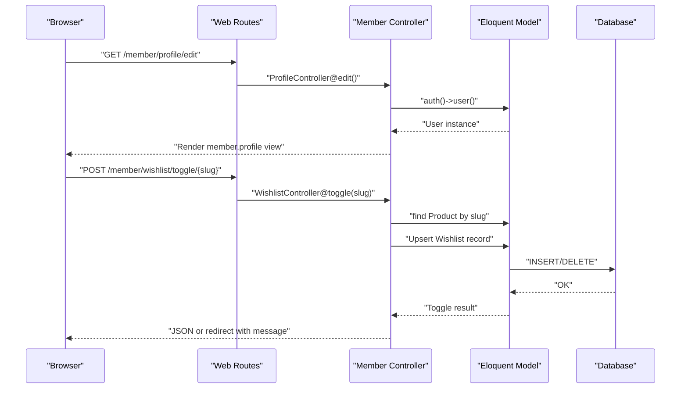
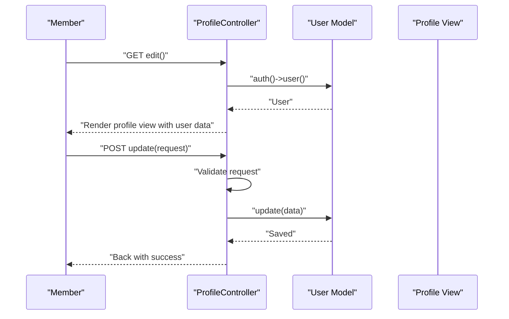
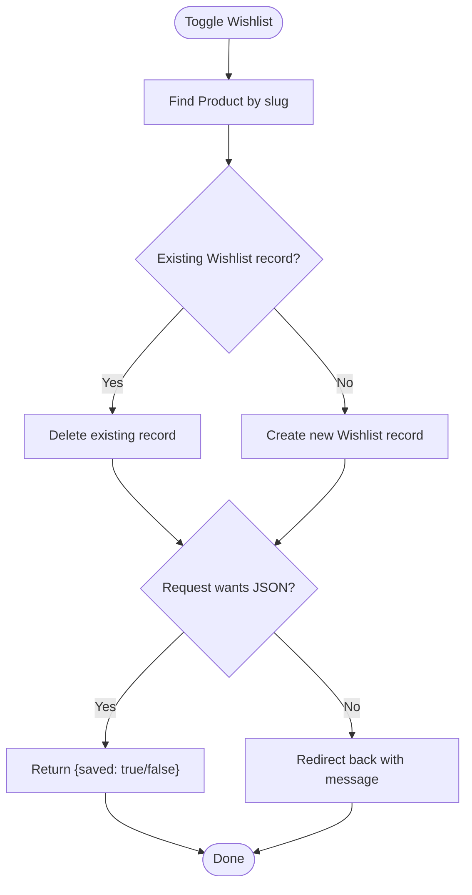
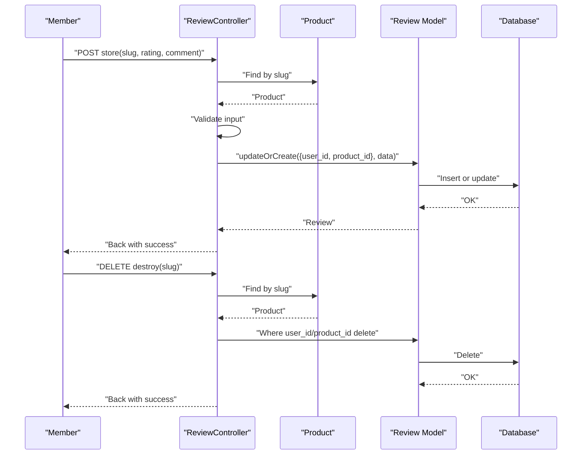
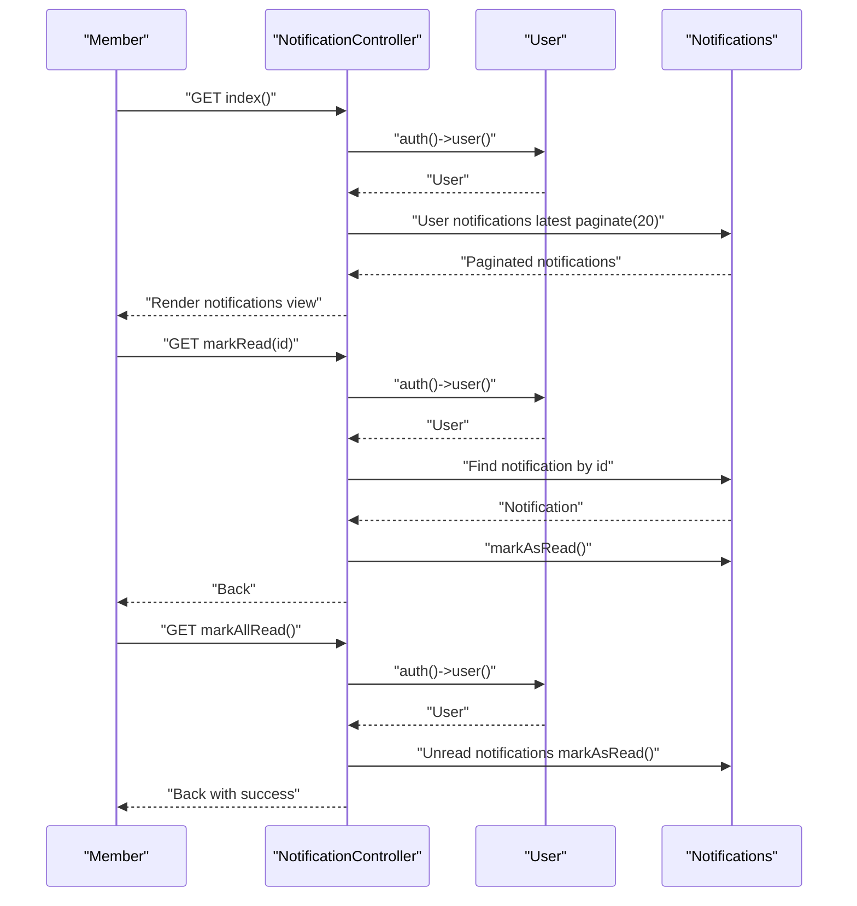
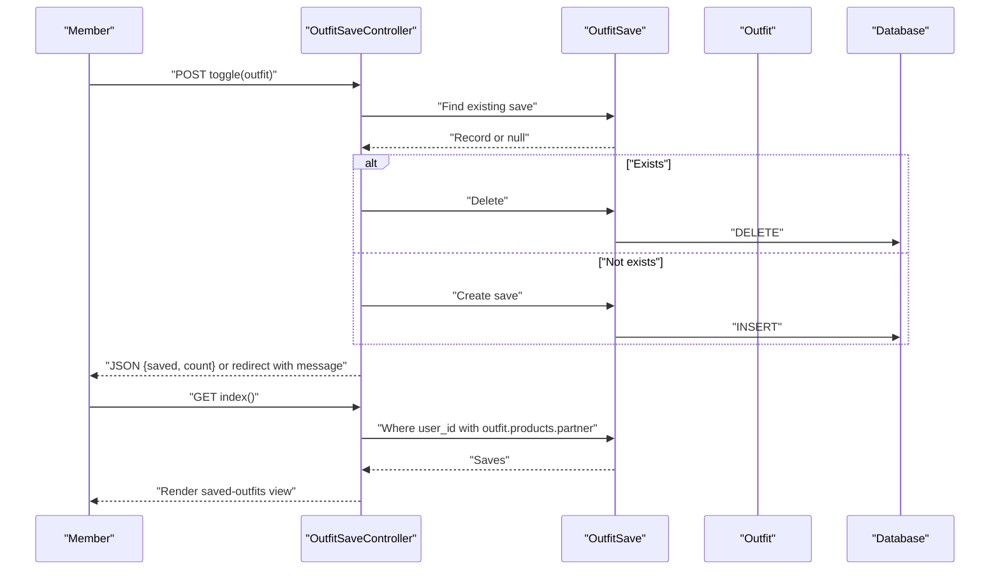
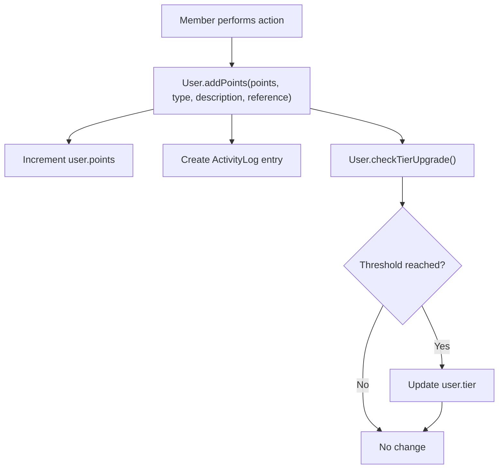
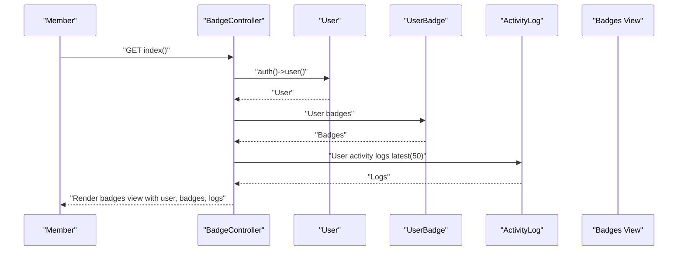
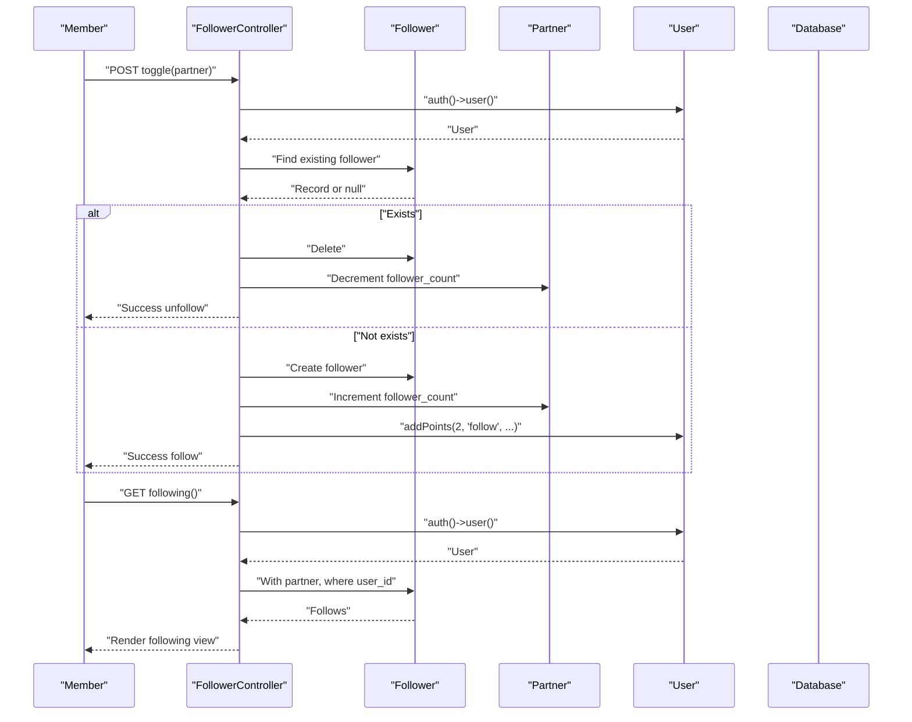
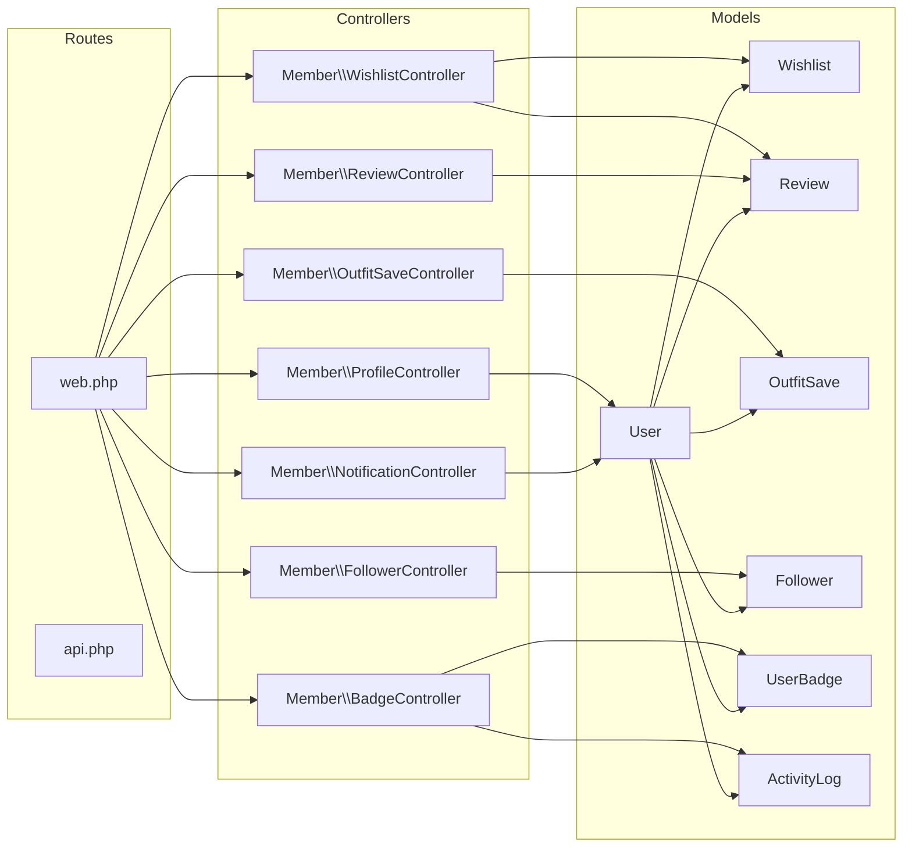

# Member User Features

<cite>
**Referenced Files in This Document**
- [ProfileController.php](file://app/Http/Controllers/Member/ProfileController.php)
- [WishlistController.php](file://app/Http/Controllers/Member/WishlistController.php)
- [ReviewController.php](file://app/Http/Controllers/Member/ReviewController.php)
- [NotificationController.php](file://app/Http/Controllers/Member/NotificationController.php)
- [OutfitSaveController.php](file://app/Http/Controllers/Member/OutfitSaveController.php)
- [BadgeController.php](file://app/Http/Controllers/Member/BadgeController.php)
- [FollowerController.php](file://app/Http/Controllers/Member/FollowerController.php)
- [User.php](file://app/Models/User.php)
- [Wishlist.php](file://app/Models/Wishlist.php)
- [Review.php](file://app/Models/Review.php)
- [OutfitSave.php](file://app/Models/OutfitSave.php)
- [Follower.php](file://app/Models/Follower.php)
- [UserBadge.php](file://app/Models/UserBadge.php)
- [ActivityLog.php](file://app/Models/ActivityLog.php)
- [2026_05_24_093819_create_wishlists_table.php](file://database/migrations/2026_05_24_093819_create_wishlists_table.php)
- [2026_05_24_093454_create_reviews_table.php](file://database/migrations/2026_05_24_093454_create_reviews_table.php)
- [routes/web.php](file://routes/web.php)
- [routes/api.php](file://routes/api.php)
- [resources/views/member/profile.blade.php](file://resources/views/member/profile.blade.php)
- [resources/views/member/wishlist.blade.php](file://resources/views/member/wishlist.blade.php)
- [resources/views/member/notifications.blade.php](file://resources/views/member/notifications.blade.php)
- [resources/views/member/saved-outfits.blade.php](file://resources/views/member/saved-outfits.blade.php)
- [resources/views/member/badges.blade.php](file://resources/views/member/badges.blade.php)
- [resources/views/member/following.blade.php](file://resources/views/member/following.blade.php)
</cite>

## Table of Contents
1. [Introduction](#introduction)
2. [Project Structure](#project-structure)
3. [Core Components](#core-components)
4. [Architecture Overview](#architecture-overview)
5. [Detailed Component Analysis](#detailed-component-analysis)
6. [Dependency Analysis](#dependency-analysis)
7. [Performance Considerations](#performance-considerations)
8. [Troubleshooting Guide](#troubleshooting-guide)
9. [Conclusion](#conclusion)
10. [Appendices](#appendices)

## Introduction
This document explains member user features and functionality implemented in the platform. It covers profile management, personal preferences, account settings, wishlist and favorites, review and rating systems, notifications, outfit saving and sharing, member analytics and activity tracking, rewards and badges, gamification, and support and privacy controls. Practical workflows and common interactions are included to help members and developers understand how features work end-to-end.

## Project Structure
Member-facing features are primarily implemented via dedicated controllers under the Member namespace and associated Eloquent models. Views reside in the resources/views/member directory. Routes connect URLs to controller actions.

```mermaid
graph TB
subgraph "Member Controllers"
PC["ProfileController"]
WC["WishlistController"]
RC["ReviewController"]
NC["NotificationController"]
OSC["OutfitSaveController"]
BC["BadgeController"]
FC["FollowerController"]
end
subgraph "Member Models"
U["User"]
W["Wishlist"]
R["Review"]
OS["OutfitSave"]
F["Follower"]
UB["UserBadge"]
AL["ActivityLog"]
end
PC --> U
WC --> W
WC --> R
RC --> R
NC --> U
OSC --> OS
BC --> UB
BC --> AL
FC --> F
U <- --> W
U <- --> R
U <- --> OS
U <- --> F
U <- --> UB
U <- --> AL
```

**Diagram sources**
- [ProfileController.php:1-33](file://app/Http/Controllers/Member/ProfileController.php#L1-L33)
- [WishlistController.php:1-48](file://app/Http/Controllers/Member/WishlistController.php#L1-L48)
- [ReviewController.php:1-41](file://app/Http/Controllers/Member/ReviewController.php#L1-L41)
- [NotificationController.php:1-32](file://app/Http/Controllers/Member/NotificationController.php#L1-L32)
- [OutfitSaveController.php:1-49](file://app/Http/Controllers/Member/OutfitSaveController.php#L1-L49)
- [BadgeController.php:1-23](file://app/Http/Controllers/Member/BadgeController.php#L1-L23)
- [FollowerController.php:1-45](file://app/Http/Controllers/Member/FollowerController.php#L1-L45)
- [User.php:1-131](file://app/Models/User.php#L1-L131)
- [Wishlist.php:1-29](file://app/Models/Wishlist.php#L1-L29)
- [Review.php:1-30](file://app/Models/Review.php#L1-L30)
- [OutfitSave.php:1-17](file://app/Models/OutfitSave.php#L1-L17)
- [Follower.php:1-23](file://app/Models/Follower.php#L1-L23)
- [UserBadge.php:1-18](file://app/Models/UserBadge.php#L1-L18)
- [ActivityLog.php:1-23](file://app/Models/ActivityLog.php#L1-L23)

**Section sources**
- [routes/web.php](file://routes/web.php)
- [routes/api.php](file://routes/api.php)
- [resources/views/member/profile.blade.php](file://resources/views/member/profile.blade.php)
- [resources/views/member/wishlist.blade.php](file://resources/views/member/wishlist.blade.php)
- [resources/views/member/notifications.blade.php](file://resources/views/member/notifications.blade.php)
- [resources/views/member/saved-outfits.blade.php](file://resources/views/member/saved-outfits.blade.php)
- [resources/views/member/badges.blade.php](file://resources/views/member/badges.blade.php)
- [resources/views/member/following.blade.php](file://resources/views/member/following.blade.php)

## Core Components
- Member profile management: Edit and update personal details (name, phone, bio).
- Wishlist and favorites: Toggle items in a user’s wishlist and view saved items.
- Reviews and ratings: Submit or delete reviews with integer ratings and optional comments.
- Notifications: List, mark as read, and batch-mark as read.
- Outfit saving and sharing: Save outfits to personal collection and view saved outfits.
- Badges and activity: View earned badges and recent activity logs.
- Followers and community: Follow/unfollow partners and manage following list.
- Rewards and gamification: Earn points, log activities, and auto-tier progression.

**Section sources**
- [ProfileController.php:11-31](file://app/Http/Controllers/Member/ProfileController.php#L11-L31)
- [WishlistController.php:15-46](file://app/Http/Controllers/Member/WishlistController.php#L15-L46)
- [ReviewController.php:13-39](file://app/Http/Controllers/Member/ReviewController.php#L13-L39)
- [NotificationController.php:10-30](file://app/Http/Controllers/Member/NotificationController.php#L10-L30)
- [OutfitSaveController.php:15-47](file://app/Http/Controllers/Member/OutfitSaveController.php#L15-L47)
- [BadgeController.php:9-21](file://app/Http/Controllers/Member/BadgeController.php#L9-L21)
- [FollowerController.php:12-43](file://app/Http/Controllers/Member/FollowerController.php#L12-L43)
- [User.php:104-129](file://app/Models/User.php#L104-L129)

## Architecture Overview
Member features follow a layered MVC pattern:
- Controllers handle HTTP requests, validate input, and orchestrate model interactions.
- Models define relationships, casts, and business logic (e.g., gamification).
- Views render member-centric pages.
- Routes bind URLs to controller actions.



**Diagram sources**
- [routes/web.php](file://routes/web.php)
- [routes/api.php](file://routes/api.php)
- [ProfileController.php:11-17](file://app/Http/Controllers/Member/ProfileController.php#L11-L17)
- [WishlistController.php:25-46](file://app/Http/Controllers/Member/WishlistController.php#L25-L46)
- [Wishlist.php:19-27](file://app/Models/Wishlist.php#L19-L27)
- [2026_05_24_093819_create_wishlists_table.php:11-18](file://database/migrations/2026_05_24_093819_create_wishlists_table.php#L11-L18)

## Detailed Component Analysis

### Member Profile Management
- Purpose: Allow members to edit name, phone, and bio.
- Key behaviors:
  - Load current user data into the profile view.
  - Validate and persist updates to the user record.
- Typical workflow:
  - Navigate to profile edit page.
  - Submit changes.
  - Receive success feedback.



**Diagram sources**
- [ProfileController.php:11-31](file://app/Http/Controllers/Member/ProfileController.php#L11-L31)
- [User.php:14-26](file://app/Models/User.php#L14-L26)

**Section sources**
- [ProfileController.php:11-31](file://app/Http/Controllers/Member/ProfileController.php#L11-L31)
- [resources/views/member/profile.blade.php](file://resources/views/member/profile.blade.php)

### Wishlist and Favorites
- Purpose: Save products to a personal wishlist and remove them.
- Key behaviors:
  - Toggle save state per product by slug.
  - Return JSON for AJAX toggles or redirect with flash messages.
  - List all saved items with related product and partner info.
- Data model:
  - Unique constraint on user-product ensures single save per user-product pair.
- Typical workflow:
  - Click “Add to Wishlist” on product page.
  - See success message or JSON response.
  - Visit wishlist page to review and manage items.



**Diagram sources**
- [WishlistController.php:25-46](file://app/Http/Controllers/Member/WishlistController.php#L25-L46)
- [Wishlist.php:19-27](file://app/Models/Wishlist.php#L19-L27)
- [2026_05_24_093819_create_wishlists_table.php:11-18](file://database/migrations/2026_05_24_093819_create_wishlists_table.php#L11-L18)

**Section sources**
- [WishlistController.php:15-46](file://app/Http/Controllers/Member/WishlistController.php#L15-L46)
- [resources/views/member/wishlist.blade.php](file://resources/views/member/wishlist.blade.php)
- [Wishlist.php:1-29](file://app/Models/Wishlist.php#L1-L29)
- [2026_05_24_093819_create_wishlists_table.php:1-27](file://database/migrations/2026_05_24_093819_create_wishlists_table.php#L1-L27)

### Reviews and Ratings
- Purpose: Submit or delete reviews with a 1–5 star rating and optional comment.
- Key behaviors:
  - Validate rating and comment length.
  - Upsert review keyed by user-product.
  - Delete review by user-product.
- Typical workflow:
  - On product page, submit review.
  - See success feedback.
  - Optionally remove review later.



**Diagram sources**
- [ReviewController.php:13-39](file://app/Http/Controllers/Member/ReviewController.php#L13-L39)
- [Review.php:9-18](file://app/Models/Review.php#L9-L18)
- [2026_05_24_093454_create_reviews_table.php:11-21](file://database/migrations/2026_05_24_093454_create_reviews_table.php#L11-L21)

**Section sources**
- [ReviewController.php:13-39](file://app/Http/Controllers/Member/ReviewController.php#L13-L39)
- [Review.php:1-30](file://app/Models/Review.php#L1-L30)
- [2026_05_24_093454_create_reviews_table.php:1-29](file://database/migrations/2026_05_24_093454_create_reviews_table.php#L1-L29)

### Notifications Management
- Purpose: View notifications, mark individual or all as read.
- Key behaviors:
  - Paginate notifications for the authenticated user.
  - Mark a single notification as read.
  - Batch mark unread notifications as read.
- Typical workflow:
  - Open notifications page.
  - Click “Mark as read” on a notification or “Mark all as read.”



**Diagram sources**
- [NotificationController.php:10-30](file://app/Http/Controllers/Member/NotificationController.php#L10-L30)
- [resources/views/member/notifications.blade.php](file://resources/views/member/notifications.blade.php)

**Section sources**
- [NotificationController.php:10-30](file://app/Http/Controllers/Member/NotificationController.php#L10-L30)
- [resources/views/member/notifications.blade.php](file://resources/views/member/notifications.blade.php)

### Outfit Saving, Sharing, and Community
- Purpose: Save outfits to a personal collection and view saved items.
- Key behaviors:
  - Toggle save state for an outfit.
  - Return JSON with save status and updated count for AJAX.
  - List saved outfits with related products and partners.
- Typical workflow:
  - On an outfit page, click “Save”.
  - See success feedback or JSON response.
  - Visit “Saved Outfits” to browse and manage.



**Diagram sources**
- [OutfitSaveController.php:15-47](file://app/Http/Controllers/Member/OutfitSaveController.php#L15-L47)
- [OutfitSave.php:14-15](file://app/Models/OutfitSave.php#L14-L15)

**Section sources**
- [OutfitSaveController.php:15-47](file://app/Http/Controllers/Member/OutfitSaveController.php#L15-L47)
- [resources/views/member/saved-outfits.blade.php](file://resources/views/member/saved-outfits.blade.php)
- [OutfitSave.php:1-17](file://app/Models/OutfitSave.php#L1-L17)

### Member Analytics, Activity Tracking, and Engagement Metrics
- Purpose: Track member activity and compute engagement via points and tiers.
- Key behaviors:
  - Add points for qualifying actions and log activity entries.
  - Auto-upgrade tier thresholds based on accumulated points.
  - Expose tier badge emoji and readable name attributes.
- Typical workflow:
  - Perform an action that grants points.
  - Points increase and activity log is recorded.
  - Tier may upgrade automatically.



**Diagram sources**
- [User.php:104-129](file://app/Models/User.php#L104-L129)
- [ActivityLog.php:8-11](file://app/Models/ActivityLog.php#L8-L11)

**Section sources**
- [User.php:83-129](file://app/Models/User.php#L83-L129)
- [ActivityLog.php:1-23](file://app/Models/ActivityLog.php#L1-L23)

### Rewards Programs, Badges, and Gamification
- Purpose: Display earned badges and recent activity logs for motivation.
- Key behaviors:
  - Retrieve user badges and recent activity logs.
  - Combine with tier information for a complete profile.
- Typical workflow:
  - Open “Badges” page to see earned badges and recent activity.



**Diagram sources**
- [BadgeController.php:9-21](file://app/Http/Controllers/Member/BadgeController.php#L9-L21)
- [UserBadge.php:13-16](file://app/Models/UserBadge.php#L13-L16)
- [ActivityLog.php:18-21](file://app/Models/ActivityLog.php#L18-L21)
- [User.php:83-102](file://app/Models/User.php#L83-L102)

**Section sources**
- [BadgeController.php:9-21](file://app/Http/Controllers/Member/BadgeController.php#L9-L21)
- [resources/views/member/badges.blade.php](file://resources/views/member/badges.blade.php)
- [UserBadge.php:1-18](file://app/Models/UserBadge.php#L1-L18)
- [ActivityLog.php:1-23](file://app/Models/ActivityLog.php#L1-L23)
- [User.php:83-102](file://app/Models/User.php#L83-L102)

### Followers and Community
- Purpose: Follow/unfollow partners and manage following list.
- Key behaviors:
  - Toggle follower relationship.
  - Increment/decrement partner follower counts.
  - Award points for following actions.
  - List followed partners.
- Typical workflow:
  - On a partner page, click “Follow”.
  - See success message and points credited.
  - Manage following list from “Following”.



**Diagram sources**
- [FollowerController.php:12-43](file://app/Http/Controllers/Member/FollowerController.php#L12-L43)
- [Follower.php:13-21](file://app/Models/Follower.php#L13-L21)
- [User.php:104-117](file://app/Models/User.php#L104-L117)

**Section sources**
- [FollowerController.php:12-43](file://app/Http/Controllers/Member/FollowerController.php#L12-L43)
- [resources/views/member/following.blade.php](file://resources/views/member/following.blade.php)
- [Follower.php:1-23](file://app/Models/Follower.php#L1-L23)
- [User.php:104-117](file://app/Models/User.php#L104-L117)

### Member Support, Privacy Controls, and Data Management
- Password reset and account-related flows are supported via standard Laravel mechanisms and middleware.
- Authentication guards and Sanctum tokens enable secure member sessions and API access.
- Role-based routing ensures only authenticated members access member routes.
- Personal data (profile, preferences) is managed through validated controller actions and model updates.

Practical examples:
- Resetting a forgotten password via the password reset flow.
- Logging out to end sessions and invalidate tokens.
- Managing personal preferences through profile updates.

**Section sources**
- [routes/web.php](file://routes/web.php)
- [routes/api.php](file://routes/api.php)
- [ProfileController.php:19-31](file://app/Http/Controllers/Member/ProfileController.php#L19-L31)
- [User.php:14-26](file://app/Models/User.php#L14-L26)

## Dependency Analysis
Member features depend on:
- Controllers for request handling and orchestration.
- Models for persistence, relationships, and business logic.
- Views for rendering member pages.
- Routes for URL binding.



**Diagram sources**
- [routes/web.php](file://routes/web.php)
- [routes/api.php](file://routes/api.php)
- [ProfileController.php:1-33](file://app/Http/Controllers/Member/ProfileController.php#L1-L33)
- [WishlistController.php:1-48](file://app/Http/Controllers/Member/WishlistController.php#L1-L48)
- [ReviewController.php:1-41](file://app/Http/Controllers/Member/ReviewController.php#L1-L41)
- [NotificationController.php:1-32](file://app/Http/Controllers/Member/NotificationController.php#L1-L32)
- [OutfitSaveController.php:1-49](file://app/Http/Controllers/Member/OutfitSaveController.php#L1-L49)
- [BadgeController.php:1-23](file://app/Http/Controllers/Member/BadgeController.php#L1-L23)
- [FollowerController.php:1-45](file://app/Http/Controllers/Member/FollowerController.php#L1-L45)
- [User.php:1-131](file://app/Models/User.php#L1-L131)
- [Wishlist.php:1-29](file://app/Models/Wishlist.php#L1-L29)
- [Review.php:1-30](file://app/Models/Review.php#L1-L30)
- [OutfitSave.php:1-17](file://app/Models/OutfitSave.php#L1-L17)
- [Follower.php:1-23](file://app/Models/Follower.php#L1-L23)
- [UserBadge.php:1-18](file://app/Models/UserBadge.php#L1-L18)
- [ActivityLog.php:1-23](file://app/Models/ActivityLog.php#L1-L23)

**Section sources**
- [routes/web.php](file://routes/web.php)
- [routes/api.php](file://routes/api.php)
- [User.php:1-131](file://app/Models/User.php#L1-L131)

## Performance Considerations
- Use pagination for notifications to limit payload sizes.
- Eager-load relationships (e.g., product and partner) when listing saved items to reduce N+1 queries.
- Prefer JSON responses for AJAX toggles to minimize round trips.
- Keep validation constraints tight to avoid unnecessary writes.
- Indexes on user_id and product_id in wishlists and reviews improve lookup performance.

## Troubleshooting Guide
- Profile update fails validation:
  - Ensure name length does not exceed the configured maximum.
  - Confirm phone and bio lengths meet constraints.
- Wishlist toggle returns unexpected state:
  - Verify uniqueness of user-product combinations.
  - Check AJAX handling for JSON responses versus redirects.
- Review submission errors:
  - Ensure rating is an integer within 1–5.
  - Confirm comment length constraints.
- Notifications not marking as read:
  - Verify ownership checks and existence of the notification ID.
- Outfit save count mismatch:
  - Confirm saves are counted after creation/deletion.
- Following not updating:
  - Ensure follower records are created/destroyed and partner counters incremented/decremented.
- Badges or activity logs missing:
  - Confirm activity logs are created upon point-earning events.

**Section sources**
- [ProfileController.php:22-28](file://app/Http/Controllers/Member/ProfileController.php#L22-L28)
- [WishlistController.php:27-39](file://app/Http/Controllers/Member/WishlistController.php#L27-L39)
- [ReviewController.php:17-25](file://app/Http/Controllers/Member/ReviewController.php#L17-L25)
- [NotificationController.php:21-28](file://app/Http/Controllers/Member/NotificationController.php#L21-L28)
- [OutfitSaveController.php:17-31](file://app/Http/Controllers/Member/OutfitSaveController.php#L17-L31)
- [FollowerController.php:14-26](file://app/Http/Controllers/Member/FollowerController.php#L14-L26)
- [ActivityLog.php:10-11](file://app/Models/ActivityLog.php#L10-L11)

## Conclusion
Member features provide a cohesive set of capabilities for profile management, discovery, engagement, and community participation. The implementation emphasizes clean separation of concerns, strong validation, and extensible gamification through points and tiers. By following the documented workflows and troubleshooting tips, members can effectively manage their profiles, preferences, and interactions while developers can maintain and extend functionality confidently.

## Appendices
- Practical examples of member interactions:
  - Adding a product to wishlist and receiving immediate feedback.
  - Submitting a 5-star review with a short comment and viewing it on the product page.
  - Saving an outfit and accessing it later from the saved collection.
  - Following a partner store and earning points toward tier upgrades.
  - Viewing badges and recent activity logs to track progress.
- Common workflows:
  - Profile update → success message → refreshed profile view.
  - Wishlist toggle → JSON or redirect → updated wishlist page.
  - Review submission → success message → product page refresh.
  - Notification mark-as-read → single or batch → updated notification list.
  - Outfit save → success message → saved-outfits page.
  - Follow/unfollow → counter updates → following list refresh.
  - Point-earning action → activity log → potential tier upgrade.