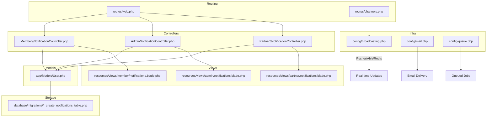
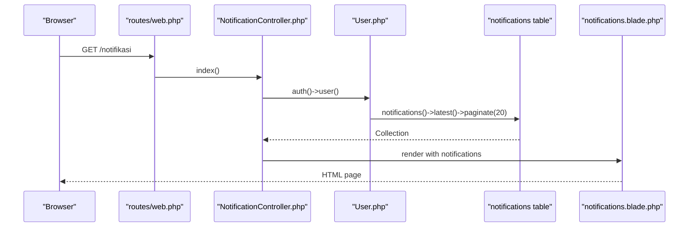
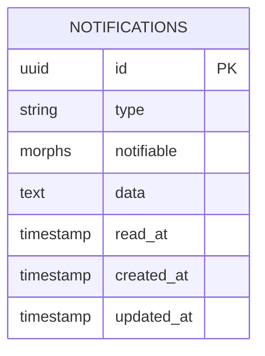
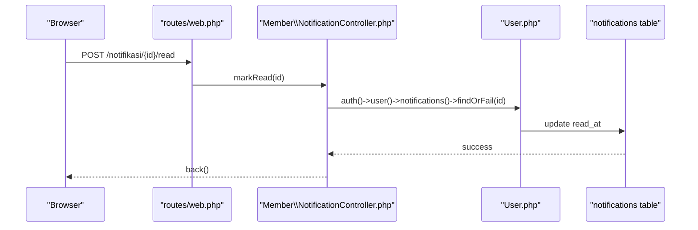
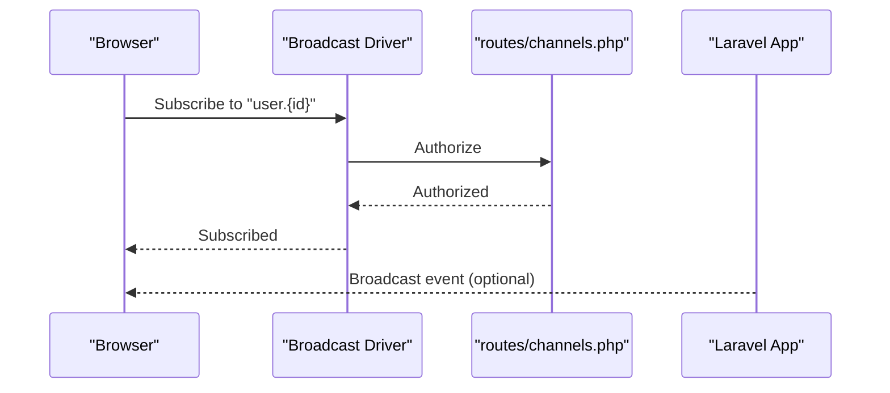
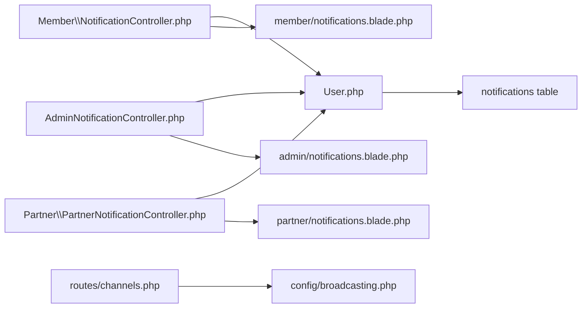

# Notifications and Communication

<cite>
**Referenced Files in This Document**
- [NotificationController.php](file://app/Http/Controllers/Member/NotificationController.php)
- [AdminNotificationController.php](file://app/Http/controllers/AdminNotificationController.php)
- [PartnerNotificationController.php](file://app/Http/Controllers/Partner/PartnerNotificationController.php)
- [2026_07_01_100005_create_notifications_table.php](file://database/migrations/2026_07_01_100005_create_notifications_table.php)
- [web.php](file://routes/web.php)
- [channels.php](file://routes/channels.php)
- [broadcasting.php](file://config/broadcasting.php)
- [mail.php](file://config/mail.php)
- [queue.php](file://config/queue.php)
- [User.php](file://app/Models/User.php)
- [notifications.blade.php (member)](file://resources/views/member/notifications.blade.php)
- [notifications.blade.php (admin)](file://resources/views/admin/notifications.blade.php)
- [notifications.blade.php (partner)](file://resources/views/partner/notifications.blade.php)
</cite>

## Table of Contents
1. [Introduction](#introduction)
2. [Project Structure](#project-structure)
3. [Core Components](#core-components)
4. [Architecture Overview](#architecture-overview)
5. [Detailed Component Analysis](#detailed-component-analysis)
6. [Dependency Analysis](#dependency-analysis)
7. [Performance Considerations](#performance-considerations)
8. [Troubleshooting Guide](#troubleshooting-guide)
9. [Conclusion](#conclusion)
10. [Appendices](#appendices)

## Introduction
This document explains the member notification and communication system in the platform. It covers how notifications are stored, delivered, and consumed via in-app views, how real-time updates can be achieved using the built-in event broadcasting stack, and how push notifications can be integrated. It also documents notification preferences, opt-in/opt-out settings, channel selection (email, SMS, in-app), categories and priorities, scheduling, analytics and engagement metrics, customization and templates, history and archives, bulk operations, automated triggers, subscription management, promotional messaging, and troubleshooting.

## Project Structure
The notification system spans routing, controllers, Eloquent models, migrations, Blade views, and configuration for broadcasting and mail/queue infrastructure.

**Diagram sources**
- [web.php:105-108](file://routes/web.php#L105-L108)
- [web.php:225-228](file://routes/web.php#L225-L228)
- [web.php:162-165](file://routes/web.php#L162-L165)
- [channels.php:16-18](file://routes/channels.php#L16-L18)
- [broadcasting.php:18](file://config/broadcasting.php#L18)
- [broadcasting.php:33-49](file://config/broadcasting.php#L33-L49)
- [mail.php:16](file://config/mail.php#L16)
- [queue.php:65-72](file://config/queue.php#L65-L72)
- [User.php:12](file://app/Models/User.php#L12)
- [2026_07_01_100005_create_notifications_table.php:10-17](file://database/migrations/2026_07_01_100005_create_notifications_table.php#L10-L17)
- [notifications.blade.php (member):1-77](file://resources/views/member/notifications.blade.php#L1-L77)
- [notifications.blade.php (admin):1-93](file://resources/views/admin/notifications.blade.php#L1-L93)
- [notifications.blade.php (partner):1-91](file://resources/views/partner/notifications.blade.php#L1-L91)

**Section sources**
- [web.php:105-108](file://routes/web.php#L105-L108)
- [web.php:225-228](file://routes/web.php#L225-L228)
- [web.php:162-165](file://routes/web.php#L162-L165)
- [channels.php:16-18](file://routes/channels.php#L16-L18)
- [broadcasting.php:18](file://config/broadcasting.php#L18)
- [broadcasting.php:33-49](file://config/broadcasting.php#L33-L49)
- [mail.php:16](file://config/mail.php#L16)
- [queue.php:65-72](file://config/queue.php#L65-L72)
- [User.php:12](file://app/Models/User.php#L12)
- [2026_07_01_100005_create_notifications_table.php:10-17](file://database/migrations/2026_07_01_100005_create_notifications_table.php#L10-L17)
- [notifications.blade.php (member):1-77](file://resources/views/member/notifications.blade.php#L1-L77)
- [notifications.blade.php (admin):1-93](file://resources/views/admin/notifications.blade.php#L1-L93)
- [notifications.blade.php (partner):1-91](file://resources/views/partner/notifications.blade.php#L1-L91)

## Core Components
- Notification storage: A dedicated notifications table with UUID primary key, type, polymorphic notifiable relationship, serialized data payload, read timestamp, and timestamps.
- In-app notification views: Three role-specific pages rendering paginated notifications with read/unread indicators and per-item actions.
- Controllers: Member, Admin, and Partner controllers expose listing and read-marking endpoints.
- Broadcasting: Channel definition and broadcaster configuration enable real-time updates.
- Delivery channels: Email and queued jobs are supported via configuration; SMS is not present in the current codebase.

Key implementation references:
- Storage schema: [2026_07_01_100005_create_notifications_table.php:10-17](file://database/migrations/2026_07_01_100005_create_notifications_table.php#L10-L17)
- Member notifications controller: [NotificationController.php:10-31](file://app/Http/Controllers/Member/NotificationController.php#L10-L31)
- Admin notifications controller: [AdminNotificationController.php:10-30](file://app/Http/Controllers/AdminNotificationController.php#L10-L30)
- Partner notifications controller: [PartnerNotificationController.php:9-19](file://app/Http/Controllers/Partner/PartnerNotificationController.php#L9-L19)
- Member notifications view: [notifications.blade.php (member):55-73](file://resources/views/member/notifications.blade.php#L55-L73)
- Admin notifications view: [notifications.blade.php (admin):71-89](file://resources/views/admin/notifications.blade.php#L71-L89)
- Partner notifications view: [notifications.blade.php (partner):69-87](file://resources/views/partner/notifications.blade.php#L69-L87)
- Broadcasting channel: [channels.php:16-18](file://routes/channels.php#L16-L18)
- Broadcast driver: [broadcasting.php:18](file://config/broadcasting.php#L18)
- Mail configuration: [mail.php:16](file://config/mail.php#L16)
- Queue configuration: [queue.php:65-72](file://config/queue.php#L65-L72)

**Section sources**
- [2026_07_01_100005_create_notifications_table.php:10-17](file://database/migrations/2026_07_01_100005_create_notifications_table.php#L10-L17)
- [NotificationController.php:10-31](file://app/Http/Controllers/Member/NotificationController.php#L10-L31)
- [AdminNotificationController.php:10-30](file://app/Http/Controllers/AdminNotificationController.php#L10-L30)
- [PartnerNotificationController.php:9-19](file://app/Http/Controllers/Partner/PartnerNotificationController.php#L9-L19)
- [notifications.blade.php (member):55-73](file://resources/views/member/notifications.blade.php#L55-L73)
- [notifications.blade.php (admin):71-89](file://resources/views/admin/notifications.blade.php#L71-L89)
- [notifications.blade.php (partner):69-87](file://resources/views/partner/notifications.blade.php#L69-L87)
- [channels.php:16-18](file://routes/channels.php#L16-L18)
- [broadcasting.php:18](file://config/broadcasting.php#L18)
- [mail.php:16](file://config/mail.php#L16)
- [queue.php:65-72](file://config/queue.php#L65-L72)

## Architecture Overview
The notification architecture combines persistent storage, role-based controllers, Blade views, and optional real-time delivery via broadcasting.

**Diagram sources**
- [web.php:105-108](file://routes/web.php#L105-L108)
- [NotificationController.php:10-17](file://app/Http/Controllers/Member/NotificationController.php#L10-L17)
- [User.php:12](file://app/Models/User.php#L12)
- [2026_07_01_100005_create_notifications_table.php:10-17](file://database/migrations/2026_07_01_100005_create_notifications_table.php#L10-L17)
- [notifications.blade.php (member):55-73](file://resources/views/member/notifications.blade.php#L55-L73)

## Detailed Component Analysis

### Notification Data Model
The notifications table stores:
- id: UUID primary key
- type: String identifying notification type
- notifiable: Polymorphic relationship to the recipient
- data: Text payload containing icon/message/text and other attributes
- read_at: Timestamp when the notification was marked read
- timestamps: Created/updated times

**Diagram sources**
- [2026_07_01_100005_create_notifications_table.php:10-17](file://database/migrations/2026_07_01_100005_create_notifications_table.php#L10-L17)

**Section sources**
- [2026_07_01_100005_create_notifications_table.php:10-17](file://database/migrations/2026_07_01_100005_create_notifications_table.php#L10-L17)

### In-App Notification Views
Each role has a dedicated view rendering:
- Paginated list of notifications
- Unread indicator styling
- Per-notification read action
- Mark all read action when applicable
- Relative timestamps

Member view highlights:
- Unread items styled distinctly
- Per-item “Mark as read” button
- “Mark all as read” button when unread items exist

Admin and Partner views mirror the member layout with role-specific navigation and branding.

**Section sources**
- [notifications.blade.php (member):55-73](file://resources/views/member/notifications.blade.php#L55-L73)
- [notifications.blade.php (admin):71-89](file://resources/views/admin/notifications.blade.php#L71-L89)
- [notifications.blade.php (partner):69-87](file://resources/views/partner/notifications.blade.php#L69-L87)

### Controllers and Routing
Controllers expose:
- Listing endpoint returning paginated notifications
- Single notification mark-as-read
- Batch mark-as-read

Routes:
- Member: GET /notifikasi, POST /notifikasi/{id}/read, POST /notifikasi/read-all
- Admin: GET /admin/notifikasi, POST /admin/notifikasi/{id}/read, POST /admin/notifikasi/read-all
- Partner: GET /mitra/notifikasi, POST /mitra/notifikasi/{id}/read, POST /mitra/notifikasi/read-all

**Diagram sources**
- [web.php:105-108](file://routes/web.php#L105-L108)
- [NotificationController.php:19-24](file://app/Http/Controllers/Member/NotificationController.php#L19-L24)
- [User.php:12](file://app/Models/User.php#L12)
- [2026_07_01_100005_create_notifications_table.php:10-17](file://database/migrations/2026_07_01_100005_create_notifications_table.php#L10-L17)

**Section sources**
- [web.php:105-108](file://routes/web.php#L105-L108)
- [web.php:225-228](file://routes/web.php#L225-L228)
- [web.php:162-165](file://routes/web.php#L162-L165)
- [NotificationController.php:10-31](file://app/Http/Controllers/Member/NotificationController.php#L10-L31)
- [AdminNotificationController.php:10-30](file://app/Http/Controllers/AdminNotificationController.php#L10-L30)
- [PartnerNotificationController.php:9-19](file://app/Http/Controllers/Partner/PartnerNotificationController.php#L9-L19)

### Real-Time Updates and Push Notifications
Real-time capability is enabled by:
- A user-specific private broadcast channel
- Broadcaster configuration supporting Pusher, Ably, Redis, log, and null

**Diagram sources**
- [channels.php:16-18](file://routes/channels.php#L16-L18)
- [broadcasting.php:18](file://config/broadcasting.php#L18)
- [broadcasting.php:33-49](file://config/broadcasting.php#L33-L49)

**Section sources**
- [channels.php:16-18](file://routes/channels.php#L16-L18)
- [broadcasting.php:18](file://config/broadcasting.php#L18)
- [broadcasting.php:33-49](file://config/broadcasting.php#L33-L49)

### Delivery Mechanisms and Channels
- In-app: Default channel; users see notifications in the role-specific views.
- Email: Configured via mail.php; suitable for administrative or promotional announcements requiring email delivery.
- Queued jobs: Configured via queue.php; ideal for asynchronous processing of outbound communications.
- SMS: Not present in the current codebase; would require an external provider and adapter.

References:
- Email configuration: [mail.php:16](file://config/mail.php#L16)
- Queue configuration: [queue.php:65-72](file://config/queue.php#L65-L72)

**Section sources**
- [mail.php:16](file://config/mail.php#L16)
- [queue.php:65-72](file://config/queue.php#L65-L72)

### Notification Preferences, Opt-In/Opt-Out, and Channel Selection
- Current code does not implement explicit user preferences or opt-in/opt-out toggles for channels.
- Recommendation: Add a preferences table/model linked to users, exposing toggles for email/SMS/in-app and categories/priorities. Integrate with controllers to filter notifications during dispatch.

[No sources needed since this section proposes future enhancements not present in the codebase]

### Categories, Priority Levels, and Scheduling
- Categories and priorities are not modeled in the current schema; data payload could include category/priority fields.
- Scheduling is not implemented; use queued jobs with delayed dispatch for scheduled notifications.

[No sources needed since this section proposes future enhancements not present in the codebase]

### Analytics, Open Rates, Click-Through Rates, and Engagement Metrics
- No analytics or engagement tracking exists in the current codebase.
- Recommendation: Track opens via in-app link clicks and conversions; maintain a separate analytics table with counts and timestamps.

[No sources needed since this section proposes future enhancements not present in the codebase]

### Customization, Template Management, and Personalization
- Templates are not implemented; data payload currently carries message/icon/text.
- Recommendation: Introduce a template engine or pre-defined templates keyed by type, allowing dynamic personalization (e.g., user name, product name).

[No sources needed since this section proposes future enhancements not present in the codebase]

### History, Archive Management, and Bulk Operations
- History: The notifications table persists all records; pagination is used in views.
- Archive: Not implemented; consider soft-deleting or archiving older records after retention policy.
- Bulk operations: Controllers support batch marking as read; extend to delete/archive with caution.

**Section sources**
- [2026_07_01_100005_create_notifications_table.php:10-17](file://database/migrations/2026_07_01_100005_create_notifications_table.php#L10-L17)
- [NotificationController.php:26-30](file://app/Http/Controllers/Member/NotificationController.php#L26-L30)
- [AdminNotificationController.php:25-29](file://app/Http/Controllers/AdminNotificationController.php#L25-L29)
- [PartnerNotificationController.php:16-19](file://app/Http/Controllers/Partner/PartnerNotificationController.php#L16-L19)

### Automated Triggers, Subscription Management, and Promotional Messaging
- Automated triggers: Not implemented; introduce event/job listeners to create notifications on specific actions (e.g., review posted, product added to wishlist).
- Subscription management: Not implemented; add endpoints to manage subscriptions and preferences.
- Promotional messaging: Use queued jobs to send promotional emails or in-app announcements.

[No sources needed since this section proposes future enhancements not present in the codebase]

## Dependency Analysis
Controllers depend on the User model’s notification relationship and the notifications table. Views depend on controller-provided data. Broadcasting depends on channel authorization and broadcaster configuration.

**Diagram sources**
- [NotificationController.php:10-17](file://app/Http/Controllers/Member/NotificationController.php#L10-L17)
- [AdminNotificationController.php:10-17](file://app/Http/Controllers/AdminNotificationController.php#L10-L17)
- [PartnerNotificationController.php:9-19](file://app/Http/Controllers/Partner/PartnerNotificationController.php#L9-L19)
- [User.php:12](file://app/Models/User.php#L12)
- [2026_07_01_100005_create_notifications_table.php:10-17](file://database/migrations/2026_07_01_100005_create_notifications_table.php#L10-L17)
- [notifications.blade.php (member):55-73](file://resources/views/member/notifications.blade.php#L55-L73)
- [notifications.blade.php (admin):71-89](file://resources/views/admin/notifications.blade.php#L71-L89)
- [notifications.blade.php (partner):69-87](file://resources/views/partner/notifications.blade.php#L69-L87)
- [channels.php:16-18](file://routes/channels.php#L16-L18)
- [broadcasting.php:18](file://config/broadcasting.php#L18)

**Section sources**
- [NotificationController.php:10-31](file://app/Http/Controllers/Member/NotificationController.php#L10-L31)
- [AdminNotificationController.php:10-30](file://app/Http/Controllers/AdminNotificationController.php#L10-L30)
- [PartnerNotificationController.php:9-19](file://app/Http/Controllers/Partner/PartnerNotificationController.php#L9-L19)
- [User.php:12](file://app/Models/User.php#L12)
- [2026_07_01_100005_create_notifications_table.php:10-17](file://database/migrations/2026_07_01_100005_create_notifications_table.php#L10-L17)
- [notifications.blade.php (member):55-73](file://resources/views/member/notifications.blade.php#L55-L73)
- [notifications.blade.php (admin):71-89](file://resources/views/admin/notifications.blade.php#L71-L89)
- [notifications.blade.php (partner):69-87](file://resources/views/partner/notifications.blade.php#L69-L87)
- [channels.php:16-18](file://routes/channels.php#L16-L18)
- [broadcasting.php:18](file://config/broadcasting.php#L18)

## Performance Considerations
- Pagination: Controllers already paginate notifications; keep per-page count reasonable (e.g., 20) to avoid heavy queries.
- Indexes: Ensure read_at and created_at are indexed for efficient sorting and filtering.
- Views: Rendering unread indicators and per-item actions is lightweight; avoid heavy computations in Blade.
- Broadcasting: Use appropriate broadcaster for scale; Pusher/Ably for production, Redis/log for development.

[No sources needed since this section provides general guidance]

## Troubleshooting Guide
Common issues and resolutions:
- Notifications not appearing:
  - Verify the user is authenticated and has notifications in the database.
  - Confirm the route bindings and controller actions are invoked.
  - References: [web.php:105-108](file://routes/web.php#L105-L108), [NotificationController.php:10-17](file://app/Http/Controllers/Member/NotificationController.php#L10-L17)
- Mark-as-read fails:
  - Ensure the notification ID belongs to the authenticated user.
  - Confirm the record exists and read_at is updated.
  - References: [NotificationController.php:19-24](file://app/Http/Controllers/Member/NotificationController.php#L19-L24), [2026_07_01_100005_create_notifications_table.php:10-17](file://database/migrations/2026_07_01_100005_create_notifications_table.php#L10-L17)
- Real-time updates not working:
  - Check channel authorization and broadcaster configuration.
  - References: [channels.php:16-18](file://routes/channels.php#L16-L18), [broadcasting.php:18](file://config/broadcasting.php#L18)
- Email/SMS delivery problems:
  - Validate mail/queue configuration and credentials.
  - References: [mail.php:16](file://config/mail.php#L16), [queue.php:65-72](file://config/queue.php#L65-L72)

**Section sources**
- [web.php:105-108](file://routes/web.php#L105-L108)
- [NotificationController.php:10-31](file://app/Http/Controllers/Member/NotificationController.php#L10-L31)
- [2026_07_01_100005_create_notifications_table.php:10-17](file://database/migrations/2026_07_01_100005_create_notifications_table.php#L10-L17)
- [channels.php:16-18](file://routes/channels.php#L16-L18)
- [broadcasting.php:18](file://config/broadcasting.php#L18)
- [mail.php:16](file://config/mail.php#L16)
- [queue.php:65-72](file://config/queue.php#L65-L72)

## Conclusion
The platform implements a robust in-app notification system backed by a flexible notifications table and role-specific views. Real-time updates are supported via Laravel’s broadcasting stack, while email and queued jobs provide delivery channels. To meet advanced requirements—preferences, categories/priorities, scheduling, analytics, templates, and bulk operations—the system should be extended with new models, controllers, and configuration as outlined in the recommendations.

## Appendices
- Role-specific endpoints summary:
  - Member: GET /notifikasi, POST /notifikasi/{id}/read, POST /notifikasi/read-all
  - Admin: GET /admin/notifikasi, POST /admin/notifikasi/{id}/read, POST /admin/notifikasi/read-all
  - Partner: GET /mitra/notifikasi, POST /mitra/notifikasi/{id}/read, POST /mitra/notifikasi/read-all

**Section sources**
- [web.php:105-108](file://routes/web.php#L105-L108)
- [web.php:225-228](file://routes/web.php#L225-L228)
- [web.php:162-165](file://routes/web.php#L162-L165)