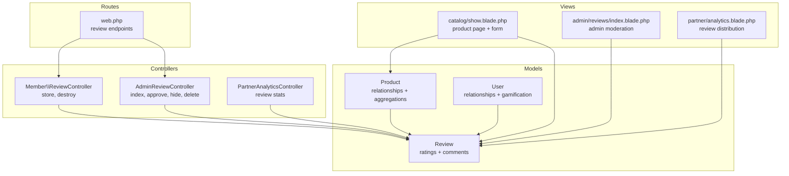
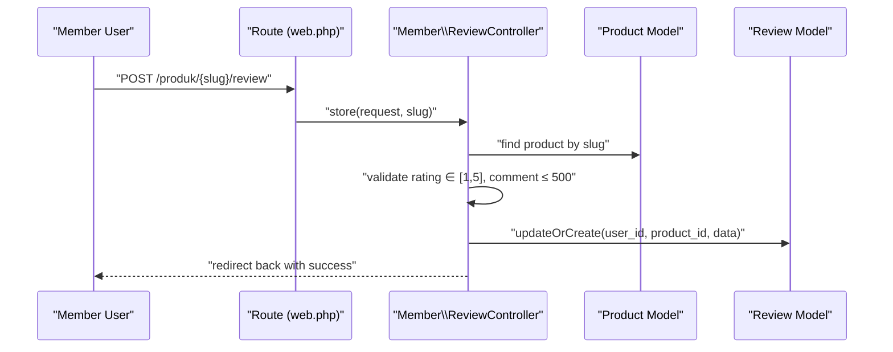
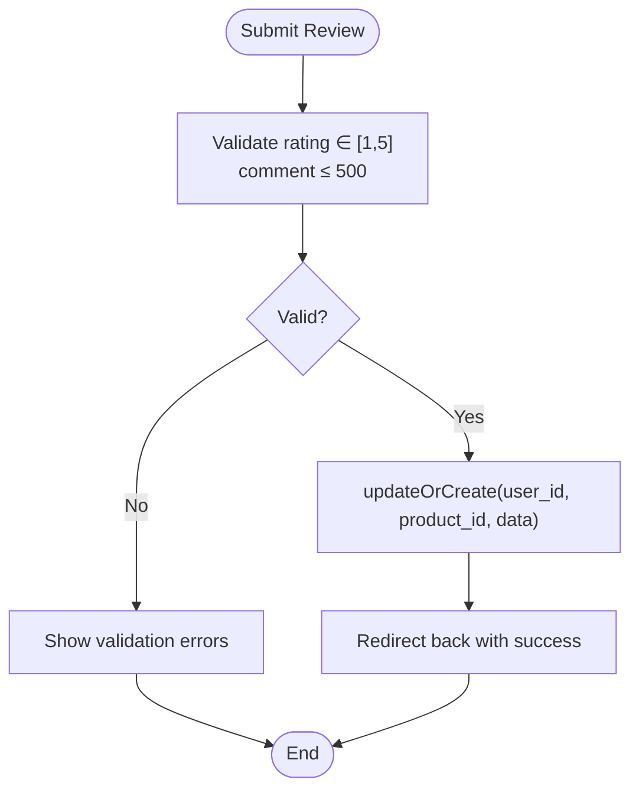
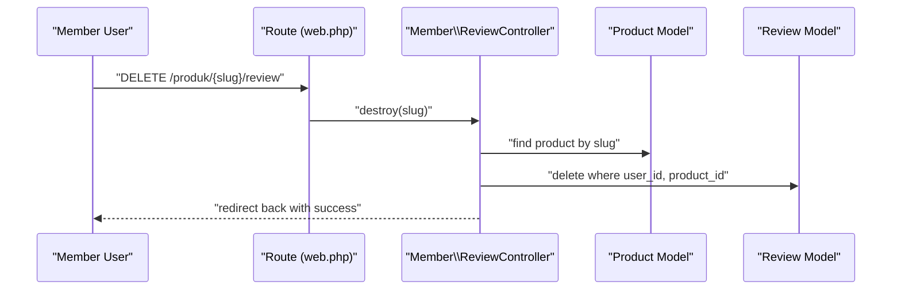
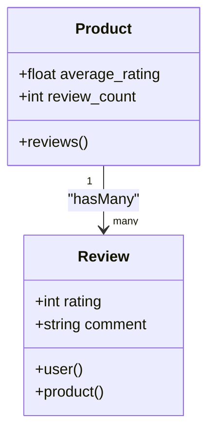
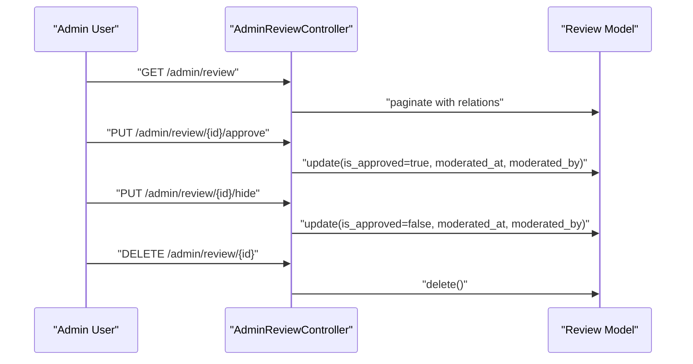
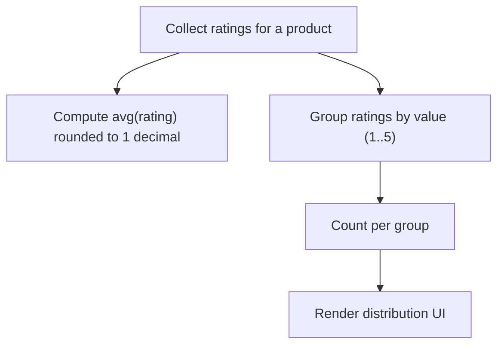
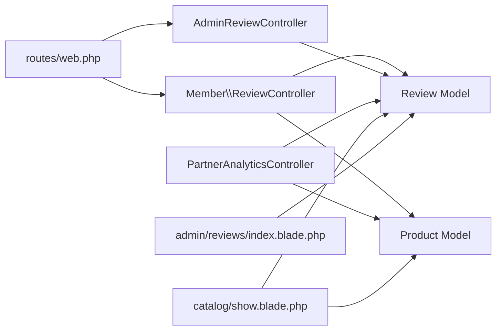

# Reviews and Ratings System

<cite>
**Referenced Files in This Document**
- [Review.php](file://app/Models/Review.php)
- [Product.php](file://app/Models/Product.php)
- [User.php](file://app/Models/User.php)
- [ReviewController.php](file://app/Http/Controllers/Member/ReviewController.php)
- [AdminReviewController.php](file://app/Http/Controllers/AdminReviewController.php)
- [PartnerAnalyticsController.php](file://app/Http/Controllers/Partner/PartnerAnalyticsController.php)
- [create_reviews_table.php](file://database/migrations/2026_05_24_093454_create_reviews_table.php)
- [create_user_badges_table.php](file://database/migrations/2026_07_01_100006_create_user_badges_table.php)
- [web.php](file://routes/web.php)
- [show.blade.php](file://resources/views/catalog/show.blade.php)
- [index.blade.php (Admin Reviews)](file://resources/views/admin/reviews/index.blade.php)
- [analytics.blade.php (Partner)](file://resources/views/partner/analytics.blade.php)
- [requirements.md](file://.kiro/specs/platform-multi-mitra/requirements.md)
</cite>

## Table of Contents
1. [Introduction](#introduction)
2. [Project Structure](#project-structure)
3. [Core Components](#core-components)
4. [Architecture Overview](#architecture-overview)
5. [Detailed Component Analysis](#detailed-component-analysis)
6. [Dependency Analysis](#dependency-analysis)
7. [Performance Considerations](#performance-considerations)
8. [Troubleshooting Guide](#troubleshooting-guide)
9. [Conclusion](#conclusion)
10. [Appendices](#appendices)

## Introduction
This document describes the reviews and ratings system in the platform. It covers how reviews are submitted, validated, aggregated, and displayed; how moderation works; and how analytics surfaces review insights for admins and partners. It also outlines current capabilities and highlights areas for enhancement such as duplicate detection, helpfulness voting, and spam prevention.

## Project Structure
The reviews and ratings system spans models, controllers, routes, and views:
- Models define the data schema and relationships (Review, Product, User).
- Controllers handle member actions (submit/delete review) and admin moderation.
- Routes expose endpoints for review submission and admin management.
- Views render the product page with review forms and lists, and the admin panel for moderation.

**Diagram sources**
- [Review.php:1-30](file://app/Models/Review.php#L1-L30)
- [Product.php:1-132](file://app/Models/Product.php#L1-L132)
- [User.php:1-131](file://app/Models/User.php#L1-L131)
- [ReviewController.php:1-41](file://app/Http/Controllers/Member/ReviewController.php#L1-L41)
- [AdminReviewController.php:1-49](file://app/Http/Controllers/AdminReviewController.php#L1-L49)
- [PartnerAnalyticsController.php:1-60](file://app/Http/Controllers/Partner/PartnerAnalyticsController.php#L1-L60)
- [web.php:88-116](file://routes/web.php#L88-L116)
- [show.blade.php:449-648](file://resources/views/catalog/show.blade.php#L449-L648)
- [index.blade.php (Admin Reviews):1-84](file://resources/views/admin/reviews/index.blade.php#L1-L84)
- [analytics.blade.php (Partner):65-148](file://resources/views/partner/analytics.blade.php#L65-L148)

**Section sources**
- [web.php:88-116](file://routes/web.php#L88-L116)
- [create_reviews_table.php:1-29](file://database/migrations/2026_05_24_093454_create_reviews_table.php#L1-L29)
- [create_user_badges_table.php:1-62](file://database/migrations/2026_07_01_100006_create_user_badges_table.php#L1-L62)

## Core Components
- Review model: stores user_id, product_id, rating (1–5), comment, and approval metadata.
- Product model: exposes average_rating and review_count via Eloquent accessors.
- User model: manages relationships and gamification attributes (points, tier).
- Member ReviewController: validates and persists a single review per user-product pair.
- AdminReviewController: lists, approves/hides, and deletes reviews.
- PartnerAnalyticsController: aggregates per-partner review distributions.
- Routes: bind endpoints for member review actions and admin moderation.
- Views: render product review form, list, and admin/moderation UI.

**Section sources**
- [Review.php:1-30](file://app/Models/Review.php#L1-L30)
- [Product.php:86-94](file://app/Models/Product.php#L86-L94)
- [User.php:33-36](file://app/Models/User.php#L33-L36)
- [ReviewController.php:13-28](file://app/Http/Controllers/Member/ReviewController.php#L13-L28)
- [AdminReviewController.php:11-47](file://app/Http/Controllers/AdminReviewController.php#L11-L47)
- [PartnerAnalyticsController.php:28-32](file://app/Http/Controllers/Partner/PartnerAnalyticsController.php#L28-L32)
- [web.php:88-116](file://routes/web.php#L88-L116)
- [show.blade.php:449-524](file://resources/views/catalog/show.blade.php#L449-L524)
- [index.blade.php (Admin Reviews):57-80](file://resources/views/admin/reviews/index.blade.php#L57-L80)

## Architecture Overview
The system follows a straightforward MVC pattern:
- Requests hit routes bound to controllers.
- Controllers interact with models to validate, persist, and aggregate data.
- Views render UI and collect user input.

**Diagram sources**
- [web.php:90-91](file://routes/web.php#L90-L91)
- [ReviewController.php:13-28](file://app/Http/Controllers/Member/ReviewController.php#L13-L28)
- [Product.php:13-25](file://app/Models/Product.php#L13-L25)
- [Review.php:9-18](file://app/Models/Review.php#L9-L18)

## Detailed Component Analysis

### Review Submission Workflow
- Endpoint: POST /produk/{slug}/review (member-authenticated).
- Validation: rating required, integer 1–5; comment optional, max length 500.
- Persistence: updateOrCreate keyed by user_id and product_id to enforce one review per user-product.
- Feedback: success message returned to the product page.

**Diagram sources**
- [ReviewController.php:17-25](file://app/Http/Controllers/Member/ReviewController.php#L17-L25)
- [create_reviews_table.php:18](file://database/migrations/2026_05_24_093454_create_reviews_table.php#L18)

**Section sources**
- [web.php:90](file://routes/web.php#L90)
- [ReviewController.php:17-25](file://app/Http/Controllers/Member/ReviewController.php#L17-L25)
- [create_reviews_table.php:18](file://database/migrations/2026_05_24_093454_create_reviews_table.php#L18)

### Review Deletion Workflow
- Endpoint: DELETE /produk/{slug}/review (member-authenticated).
- Action: delete review matching user_id and product_id.
- Feedback: success message returned to the product page.

**Diagram sources**
- [web.php:91](file://routes/web.php#L91)
- [ReviewController.php:30-39](file://app/Http/Controllers/Member/ReviewController.php#L30-L39)

**Section sources**
- [web.php:91](file://routes/web.php#L91)
- [ReviewController.php:30-39](file://app/Http/Controllers/Member/ReviewController.php#L30-L39)

### Review Aggregation and Display
- Product-level averages and counts:
  - average_rating: computed as rounded average of ratings.
  - review_count: total count of reviews.
- Product page displays:
  - Average rating and star visualization.
  - Count of reviews.
  - Form to submit review (authenticated).
  - List of reviews sorted by newest first.
- Admin panel lists reviews with moderation controls (approve/hide/delete).

**Diagram sources**
- [Product.php:86-94](file://app/Models/Product.php#L86-L94)
- [Review.php:20-28](file://app/Models/Review.php#L20-L28)

**Section sources**
- [Product.php:86-94](file://app/Models/Product.php#L86-L94)
- [show.blade.php:461-523](file://resources/views/catalog/show.blade.php#L461-L523)
- [index.blade.php (Admin Reviews):59-79](file://resources/views/admin/reviews/index.blade.php#L59-L79)

### Moderation Controls
- Admin endpoints:
  - Index: list reviews with pagination.
  - Approve: mark review as approved and record moderator metadata.
  - Hide: mark review as not approved and record moderator metadata.
  - Delete: remove review.
- Admin UI supports bulk actions and pagination.

**Diagram sources**
- [web.php:190-194](file://routes/web.php#L190-L194)
- [AdminReviewController.php:11-47](file://app/Http/Controllers/AdminReviewController.php#L11-L47)

**Section sources**
- [web.php:190-194](file://routes/web.php#L190-L194)
- [AdminReviewController.php:11-47](file://app/Http/Controllers/AdminReviewController.php#L11-L47)
- [create_user_badges_table.php:35-41](file://database/migrations/2026_07_01_100006_create_user_badges_table.php#L35-L41)

### Star Rating Calculation and Distribution
- Product average: average of all ratings for the product, rounded to one decimal place.
- Partner analytics: per-partner rating distribution (count per star level).
- Admin analytics: per-partner rating distribution rendered as a bar chart.

**Diagram sources**
- [Product.php:86-89](file://app/Models/Product.php#L86-L89)
- [PartnerAnalyticsController.php:28-32](file://app/Http/Controllers/Partner/PartnerAnalyticsController.php#L28-L32)
- [analytics.blade.php (Partner):129-145](file://resources/views/partner/analytics.blade.php#L129-L145)

**Section sources**
- [Product.php:86-89](file://app/Models/Product.php#L86-L89)
- [PartnerAnalyticsController.php:28-32](file://app/Http/Controllers/Partner/PartnerAnalyticsController.php#L28-L32)
- [analytics.blade.php (Partner):129-145](file://resources/views/partner/analytics.blade.php#L129-L145)

### Content Moderation and Approval Metadata
- Approval flag and moderation metadata are stored on the reviews table.
- Admin can approve or hide reviews and records who performed the moderation and when.

**Section sources**
- [create_user_badges_table.php:35-41](file://database/migrations/2026_07_01_100006_create_user_badges_table.php#L35-L41)
- [AdminReviewController.php:23-41](file://app/Http/Controllers/AdminReviewController.php#L23-L41)

### Review Editing Capability
- Current implementation does not expose an edit endpoint for reviews.
- Users can delete and re-submit a review for the same product.

**Section sources**
- [web.php:90-91](file://routes/web.php#L90-L91)
- [ReviewController.php:13-28](file://app/Http/Controllers/Member/ReviewController.php#L13-L28)

### Review Verification and Authenticity Checks
- No explicit verification or authenticity checks are implemented in the current codebase.
- Requirements specify that only logged-in members can submit reviews and that each member can submit one review per product.

**Section sources**
- [requirements.md:63-71](file://.kiro/specs/platform-multi-mitra/requirements.md#L63-L71)
- [web.php:89](file://routes/web.php#L89)

### Duplicate Detection
- Enforced at persistence level via a unique constraint on (user_id, product_id).
- No additional duplicate detection logic exists beyond this constraint.

**Section sources**
- [create_reviews_table.php:18](file://database/migrations/2026_05_24_093454_create_reviews_table.php#L18)

### Spam Prevention and Quality Assurance
- No dedicated spam prevention or quality assurance mechanisms are present in the current codebase.
- Moderation actions (approve/hide/delete) are available post-submission.

**Section sources**
- [AdminReviewController.php:23-41](file://app/Http/Controllers/AdminReviewController.php#L23-L41)

### Review Display Formatting, Sorting, and Filtering
- Display formatting:
  - Average rating shown with stars.
  - Individual reviews show user name, stars, optional comment, and creation date.
- Sorting:
  - Product reviews are sorted by newest first.
- Filtering:
  - No explicit filtering is implemented in the current codebase.

**Section sources**
- [show.blade.php:461-523](file://resources/views/catalog/show.blade.php#L461-L523)

### Engagement Features, Helpfulness Voting, and Reputation Systems
- No helpfulness voting or reviewer reputation system is implemented.
- Gamification exists for users (points, tiers, badges), but not tied to reviews specifically.

**Section sources**
- [User.php:104-129](file://app/Models/User.php#L104-L129)
- [create_user_badges_table.php:10-33](file://database/migrations/2026_07_01_100006_create_user_badges_table.php#L10-L33)

### Reporting Mechanisms and Community Guidelines Enforcement
- Product reporting exists and is handled by AdminReportController.
- Review-specific reporting is not implemented; moderation actions operate on reviews themselves.

**Section sources**
- [web.php:196-199](file://routes/web.php#L196-L199)
- [AdminReportController.php:12-50](file://app/Http/Controllers/AdminReportController.php#L12-L50)

### Review Analytics and Seller Performance Metrics
- Partner analytics compute per-partner review distributions and display them as a chart.
- Seller performance metrics include average rating and follower count.

**Section sources**
- [PartnerAnalyticsController.php:28-32](file://app/Http/Controllers/Partner/PartnerAnalyticsController.php#L28-L32)
- [analytics.blade.php (Partner):129-145](file://resources/views/partner/analytics.blade.php#L129-L145)
- [Partner.php:104-121](file://app/Models/Partner.php#L104-L121)

## Dependency Analysis

**Diagram sources**
- [ReviewController.php:1-41](file://app/Http/Controllers/Member/ReviewController.php#L1-L41)
- [AdminReviewController.php:1-49](file://app/Http/Controllers/AdminReviewController.php#L1-L49)
- [PartnerAnalyticsController.php:1-60](file://app/Http/Controllers/Partner/PartnerAnalyticsController.php#L1-L60)
- [show.blade.php:449-648](file://resources/views/catalog/show.blade.php#L449-L648)
- [index.blade.php (Admin Reviews):1-84](file://resources/views/admin/reviews/index.blade.php#L1-L84)
- [web.php:88-116](file://routes/web.php#L88-L116)

**Section sources**
- [ReviewController.php:1-41](file://app/Http/Controllers/Member/ReviewController.php#L1-L41)
- [AdminReviewController.php:1-49](file://app/Http/Controllers/AdminReviewController.php#L1-L49)
- [PartnerAnalyticsController.php:1-60](file://app/Http/Controllers/Partner/PartnerAnalyticsController.php#L1-L60)
- [show.blade.php:449-648](file://resources/views/catalog/show.blade.php#L449-L648)
- [index.blade.php (Admin Reviews):1-84](file://resources/views/admin/reviews/index.blade.php#L1-L84)
- [web.php:88-116](file://routes/web.php#L88-L116)

## Performance Considerations
- Aggregations: average_rating and review_count are computed on demand; consider caching at scale.
- Pagination: admin review listing paginates results; maintain reasonable page sizes.
- Queries: controllers fetch related data (user, product.partner) for admin listings; ensure indexes exist on foreign keys.

## Troubleshooting Guide
- Validation failures: ensure rating is an integer between 1 and 5 and comment length does not exceed 500.
- Duplicate submissions: the unique constraint prevents multiple reviews per user-product; verify user/product IDs.
- Moderation not reflected: confirm is_approved flag and moderation timestamps are set via admin endpoints.

**Section sources**
- [ReviewController.php:17-25](file://app/Http/Controllers/Member/ReviewController.php#L17-L25)
- [create_reviews_table.php:18](file://database/migrations/2026_05_24_093454_create_reviews_table.php#L18)
- [AdminReviewController.php:23-41](file://app/Http/Controllers/AdminReviewController.php#L23-L41)

## Conclusion
The current reviews and ratings system provides a solid foundation: authenticated review submission, uniqueness enforcement, basic aggregation, and admin moderation. Areas for enhancement include review editing, helpfulness voting, spam prevention/duplicate detection, and richer engagement signals. The existing analytics infrastructure can be extended to surface deeper insights for sellers and administrators.

## Appendices
- Requirements reference: [requirements.md:63-71](file://.kiro/specs/platform-multi-mitra/requirements.md#L63-L71)