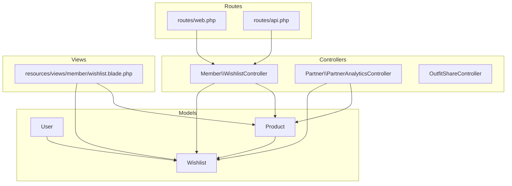
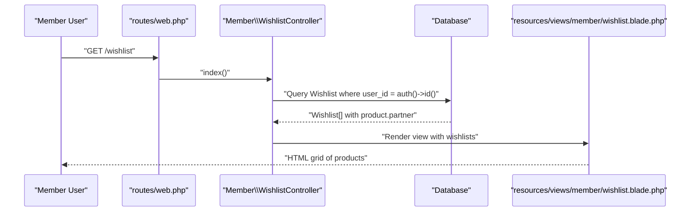
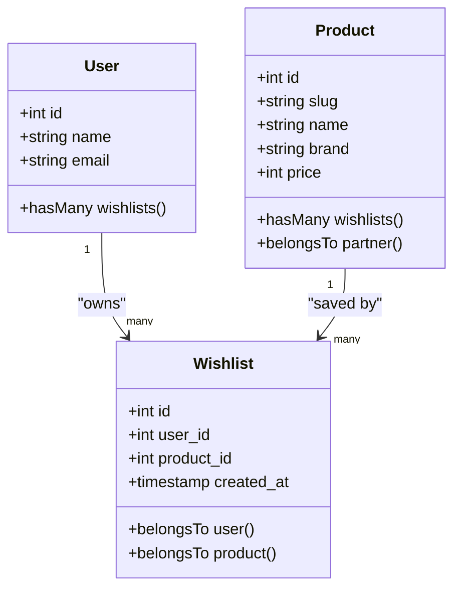
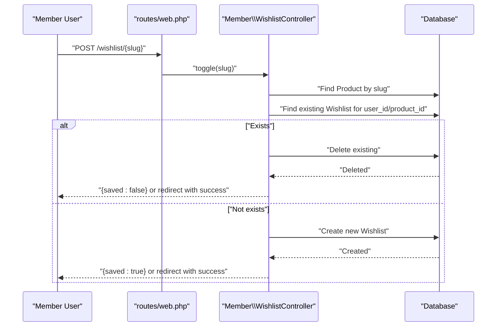
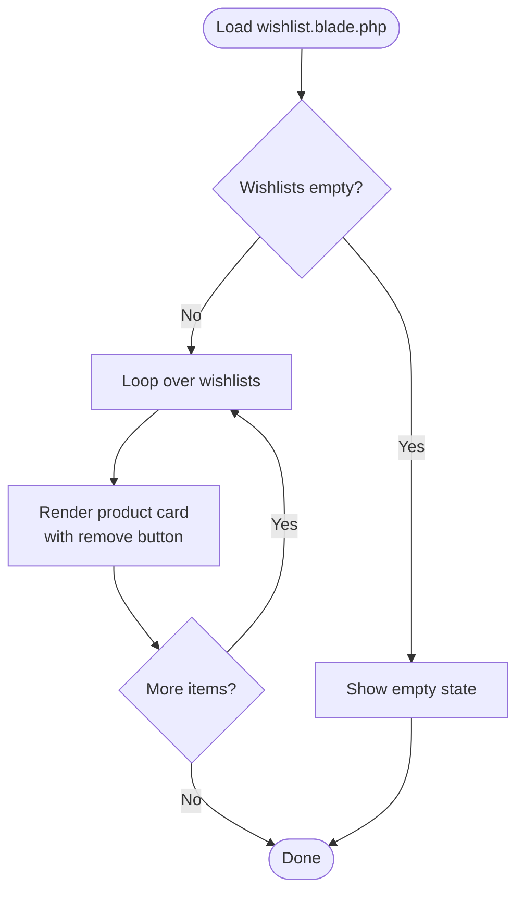
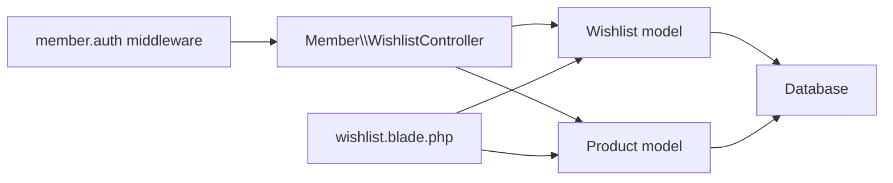

# Wishlist and Favorites System

<cite>
**Referenced Files in This Document**
- [Wishlist.php](file://app/Models/Wishlist.php)
- [WishlistController.php](file://app/Http/Controllers/Member/WishlistController.php)
- [Product.php](file://app/Models/Product.php)
- [User.php](file://app/Models/User.php)
- [2026_05_24_093819_create_wishlists_table.php](file://database/migrations/2026_05_24_093819_create_wishlists_table.php)
- [web.php](file://routes/web.php)
- [api.php](file://routes/api.php)
- [wishlist.blade.php](file://resources/views/member/wishlist.blade.php)
- [PartnerAnalyticsController.php](file://app/Http/Controllers/Partner/PartnerAnalyticsController.php)
- [OutfitShareController.php](file://app/Http/Controllers/OutfitShareController.php)
- [PartnerBulkController.php](file://app/Http/Controllers/Partner/PartnerBulkController.php)
</cite>

## Table of Contents
1. [Introduction](#introduction)
2. [Project Structure](#project-structure)
3. [Core Components](#core-components)
4. [Architecture Overview](#architecture-overview)
5. [Detailed Component Analysis](#detailed-component-analysis)
6. [Dependency Analysis](#dependency-analysis)
7. [Performance Considerations](#performance-considerations)
8. [Troubleshooting Guide](#troubleshooting-guide)
9. [Conclusion](#conclusion)
10. [Appendices](#appendices)

## Introduction
This document describes the wishlist and favorites system in the application. It explains how users create and manage wishlists, add or remove items, and organize their saved products. It also documents analytics around wishlist popularity, how the system supports bulk operations for partners, and outlines current capabilities and limitations regarding sharing, privacy, and cross-device synchronization.

## Project Structure
The wishlist system spans models, controllers, routes, views, and analytics:
- Models define the relationship between users, products, and wishlist entries.
- Controllers handle user actions (listing and toggling wishlist items).
- Routes expose endpoints for member-authenticated actions.
- Views render the user’s wishlist page.
- Analytics controllers compute wishlist metrics for partners and administrators.

**Diagram sources**
- [Wishlist.php:1-28](file://app/Models/Wishlist.php#L1-L28)
- [WishlistController.php:1-47](file://app/Http/Controllers/Member/WishlistController.php#L1-L47)
- [Product.php:1-132](file://app/Models/Product.php#L1-L132)
- [User.php:1-131](file://app/Models/User.php#L1-L131)
- [web.php:88-103](file://routes/web.php#L88-L103)
- [api.php:1-20](file://routes/api.php#L1-L20)
- [wishlist.blade.php:1-88](file://resources/views/member/wishlist.blade.php#L1-L88)
- [PartnerAnalyticsController.php:1-59](file://app/Http/Controllers/Partner/PartnerAnalyticsController.php#L1-L59)
- [OutfitShareController.php:1-28](file://app/Http/Controllers/OutfitShareController.php#L1-L28)

**Section sources**
- [Wishlist.php:1-28](file://app/Models/Wishlist.php#L1-L28)
- [WishlistController.php:1-47](file://app/Http/Controllers/Member/WishlistController.php#L1-L47)
- [Product.php:1-132](file://app/Models/Product.php#L1-L132)
- [User.php:1-131](file://app/Models/User.php#L1-L131)
- [2026_05_24_093819_create_wishlists_table.php:1-27](file://database/migrations/2026_05_24_093819_create_wishlists_table.php#L1-L27)
- [web.php:88-103](file://routes/web.php#L88-L103)
- [api.php:1-20](file://routes/api.php#L1-L20)
- [wishlist.blade.php:1-88](file://resources/views/member/wishlist.blade.php#L1-L88)
- [PartnerAnalyticsController.php:1-59](file://app/Http/Controllers/Partner/PartnerAnalyticsController.php#L1-L59)
- [OutfitShareController.php:1-28](file://app/Http/Controllers/OutfitShareController.php#L1-L28)

## Core Components
- Wishlist model: Stores user-product associations with timestamps and foreign keys.
- Product model: Defines product metadata and relationships, including a wishlist collection.
- User model: Defines user relationships, including a wishlist collection.
- WishlistController: Provides endpoints to list and toggle wishlist items for authenticated members.
- Routes: Expose GET /wishlist and POST /wishlist/{slug} under member.auth middleware.
- View: Renders the user’s wishlist grid with product details and remove actions.
- Analytics: Computes total wishlist counts per partner and aggregates across the platform.

Key implementation references:
- [Wishlist model definition:7-28](file://app/Models/Wishlist.php#L7-L28)
- [WishlistController index and toggle:15-46](file://app/Http/Controllers/Member/WishlistController.php#L15-L46)
- [Product relationships:46-49](file://app/Models/Product.php#L46-L49)
- [User relationships:38-41](file://app/Models/User.php#L38-L41)
- [Wishlist table migration:11-19](file://database/migrations/2026_05_24_093819_create_wishlists_table.php#L11-L19)
- [Member routes:93-94](file://routes/web.php#L93-L94)
- [Wishlist view rendering:59-83](file://resources/views/member/wishlist.blade.php#L59-L83)
- [Partner analytics wishlist count](file://app/Http/Controllers/Partner/PartnerAnalyticsController.php#L26)

**Section sources**
- [Wishlist.php:1-28](file://app/Models/Wishlist.php#L1-L28)
- [WishlistController.php:1-47](file://app/Http/Controllers/Member/WishlistController.php#L1-L47)
- [Product.php:1-132](file://app/Models/Product.php#L1-L132)
- [User.php:1-131](file://app/Models/User.php#L1-L131)
- [2026_05_24_093819_create_wishlists_table.php:1-27](file://database/migrations/2026_05_24_093819_create_wishlists_table.php#L1-L27)
- [web.php:88-103](file://routes/web.php#L88-L103)
- [wishlist.blade.php:1-88](file://resources/views/member/wishlist.blade.php#L1-L88)
- [PartnerAnalyticsController.php:1-59](file://app/Http/Controllers/Partner/PartnerAnalyticsController.php#L1-L59)

## Architecture Overview
The wishlist feature follows a straightforward pattern:
- A user navigates to their wishlist page.
- The controller fetches all wishlist entries for the authenticated user and eager-loads product and partner data.
- The view renders a grid of products with “Remove” actions.
- Toggling adds or removes a product from the user’s wishlist via AJAX or redirect.

**Diagram sources**
- [web.php:93-94](file://routes/web.php#L93-L94)
- [WishlistController.php:15-23](file://app/Http/Controllers/Member/WishlistController.php#L15-L23)
- [wishlist.blade.php:59-83](file://resources/views/member/wishlist.blade.php#L59-L83)

**Section sources**
- [web.php:88-103](file://routes/web.php#L88-L103)
- [WishlistController.php:1-47](file://app/Http/Controllers/Member/WishlistController.php#L1-L47)
- [wishlist.blade.php:1-88](file://resources/views/member/wishlist.blade.php#L1-L88)

## Detailed Component Analysis

### Wishlist Data Model and Relationships
The wishlist is a simple join table linking users and products with a creation timestamp. Unique constraints prevent duplicates for the same user-product pair.

**Diagram sources**
- [Wishlist.php:19-27](file://app/Models/Wishlist.php#L19-L27)
- [Product.php:36-49](file://app/Models/Product.php#L36-L49)
- [User.php:28-41](file://app/Models/User.php#L28-L41)

**Section sources**
- [Wishlist.php:1-28](file://app/Models/Wishlist.php#L1-L28)
- [Product.php:1-132](file://app/Models/Product.php#L1-L132)
- [User.php:1-131](file://app/Models/User.php#L1-L131)

### Wishlist Controller Workflow
The controller exposes two actions:
- Index: Returns the authenticated user’s wishlist entries with associated product and partner data.
- Toggle: Adds or removes a product from the wishlist based on the product slug. Supports JSON responses for AJAX and redirects with flash messages otherwise.

**Diagram sources**
- [WishlistController.php:25-46](file://app/Http/Controllers/Member/WishlistController.php#L25-L46)
- [web.php:93-94](file://routes/web.php#L93-L94)

**Section sources**
- [WishlistController.php:1-47](file://app/Http/Controllers/Member/WishlistController.php#L1-L47)
- [web.php:88-103](file://routes/web.php#L88-L103)

### Wishlist Page Rendering
The wishlist view displays a responsive grid of products with:
- Brand, name, price, optional store name, and image.
- Action buttons to view product details and remove from wishlist.

**Diagram sources**
- [wishlist.blade.php:52-84](file://resources/views/member/wishlist.blade.php#L52-L84)

**Section sources**
- [wishlist.blade.php:1-88](file://resources/views/member/wishlist.blade.php#L1-L88)

### Analytics and Popularity Tracking
- Partner analytics: Aggregates total wishlist count for a partner’s products.
- Admin analytics: Includes a total wishlist metric among system-wide statistics.

References:
- [Partner analytics wishlist count](file://app/Http/Controllers/Partner/PartnerAnalyticsController.php#L26)
- [Admin analytics wishlist stat](file://resources/views/admin/analytics.blade.php#L67)

Note: There is no built-in recommendation engine or per-user personalized suggestions in the current codebase.

**Section sources**
- [PartnerAnalyticsController.php:1-59](file://app/Http/Controllers/Partner/PartnerAnalyticsController.php#L1-L59)
- [resources/views/admin/analytics.blade.php:65-83](file://resources/views/admin/analytics.blade.php#L65-L83)

### Bulk Operations and Import/Export
- Partners can perform bulk updates on products (activate/deactivate/mark sold/new arrival).
- Export to CSV is exposed in the partner bulk operations interface.
- No dedicated wishlist import/export or bulk remove functionality is present in the current codebase.

References:
- [Partner bulk update controller:17-41](file://app/Http/Controllers/Partner/PartnerBulkController.php#L17-L41)
- [Partner products bulk UI:86-220](file://resources/views/partner/products/index.blade.php#L86-L220)

**Section sources**
- [PartnerBulkController.php:1-41](file://app/Http/Controllers/Partner/PartnerBulkController.php#L1-L41)
- [resources/views/partner/products/index.blade.php:81-220](file://resources/views/partner/products/index.blade.php#L81-L220)

### Sharing, Privacy, and Guest Access
- Public sharing: The codebase includes a shared outfit feature with a share token, but there is no public wishlist sharing endpoint or tokenized access for wishlists.
- Private wishlist: Wishlists are scoped to authenticated users and not exposed publicly.
- Guest access: Wishlist endpoints require member authentication.

References:
- [Outfit share controller:10-27](file://app/Http/Controllers/OutfitShareController.php#L10-L27)
- [Member routes requiring authentication:89-116](file://routes/web.php#L89-L116)

**Section sources**
- [OutfitShareController.php:1-28](file://app/Http/Controllers/OutfitShareController.php#L1-L28)
- [web.php:88-116](file://routes/web.php#L88-L116)

### Item Organization, Categorization, Tagging, and Filtering
- Organization: Users can remove items from their wishlist via the remove action on the wishlist page.
- Categorization/Tagging: No explicit categories or tags for wishlist items are implemented in the current codebase.
- Filtering: No filtering by category/tag is present for the wishlist page.

References:
- [Wishlist remove action in view:75-78](file://resources/views/member/wishlist.blade.php#L75-L78)

**Section sources**
- [wishlist.blade.php:59-83](file://resources/views/member/wishlist.blade.php#L59-L83)

### Usage Patterns and Gift-Giving Features
- Seasonal collections: While there is no dedicated seasonal collection feature, partners can mark items as new arrivals, which can support seasonal campaigns.
- Gift-giving: The codebase does not include a “gift list” or “registry” feature. The wishlist serves as a personal save list.

References:
- [New arrival flag on products](file://app/Models/Product.php#L22)
- [Bulk marking new arrival:31-36](file://app/Http/Controllers/Partner/PartnerBulkController.php#L31-L36)

**Section sources**
- [Product.php:1-132](file://app/Models/Product.php#L1-L132)
- [PartnerBulkController.php:1-41](file://app/Http/Controllers/Partner/PartnerBulkController.php#L1-L41)

## Dependency Analysis
The wishlist feature depends on:
- Authentication middleware to restrict access to authenticated members.
- Eager loading of product and partner relationships for efficient rendering.
- Database constraints ensuring uniqueness of user-product combinations.

**Diagram sources**
- [web.php:89-116](file://routes/web.php#L89-L116)
- [WishlistController.php:15-23](file://app/Http/Controllers/Member/WishlistController.php#L15-L23)
- [Wishlist.php:19-27](file://app/Models/Wishlist.php#L19-L27)
- [Product.php:36-49](file://app/Models/Product.php#L36-L49)
- [wishlist.blade.php:59-83](file://resources/views/member/wishlist.blade.php#L59-L83)

**Section sources**
- [web.php:88-116](file://routes/web.php#L88-L116)
- [WishlistController.php:1-47](file://app/Http/Controllers/Member/WishlistController.php#L1-L47)
- [Wishlist.php:1-28](file://app/Models/Wishlist.php#L1-L28)
- [Product.php:1-132](file://app/Models/Product.php#L1-L132)
- [wishlist.blade.php:1-88](file://resources/views/member/wishlist.blade.php#L1-L88)

## Performance Considerations
- Eager loading: The controller loads product and partner relationships to avoid N+1 queries when rendering the wishlist page.
- Uniqueness constraint: The database enforces unique user-product pairs, preventing duplicate entries and simplifying existence checks.
- Recommendations: No recommendation engine is implemented; future enhancements could introduce indexing or materialized views for popularity insights.

[No sources needed since this section provides general guidance]

## Troubleshooting Guide
Common issues and resolutions:
- Duplicate wishlist entries: The unique constraint prevents duplicates. If duplicates appear, investigate client-side double-submit or race conditions; ensure single click handlers.
- Missing product data: Confirm that product and partner relationships are properly eager-loaded in the controller and that the view accesses product attributes safely.
- Authentication errors: Ensure member authentication middleware is applied to wishlist routes and that the user is logged in when accessing wishlist endpoints.
- AJAX toggle not updating UI: Verify that JSON responses are handled on the client side and that the remove button toggles appropriately after successful requests.

**Section sources**
- [2026_05_24_093819_create_wishlists_table.php](file://database/migrations/2026_05_24_093819_create_wishlists_table.php#L16)
- [WishlistController.php:15-46](file://app/Http/Controllers/Member/WishlistController.php#L15-L46)
- [web.php:89-116](file://routes/web.php#L89-L116)

## Conclusion
The wishlist and favorites system is a focused, authenticated feature that allows users to save and remove products. It integrates with product and partner models, supports analytics for partners, and provides a clean UI for browsing saved items. Current limitations include no public sharing, no bulk import/export for wishlists, and no recommendation engine. Future enhancements could expand sharing, add categorization/tags, and introduce analytics-driven recommendations.

## Appendices
- API surface for authenticated members:
  - GET /wishlist → returns wishlist page
  - POST /wishlist/{slug} → toggles wishlist entry; returns JSON or redirect

**Section sources**
- [web.php:93-94](file://routes/web.php#L93-L94)
- [WishlistController.php:15-46](file://app/Http/Controllers/Member/WishlistController.php#L15-L46)