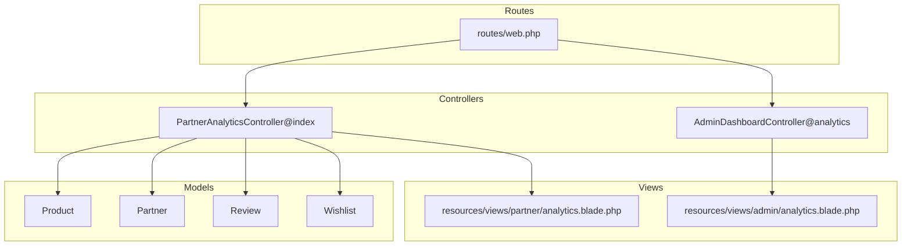
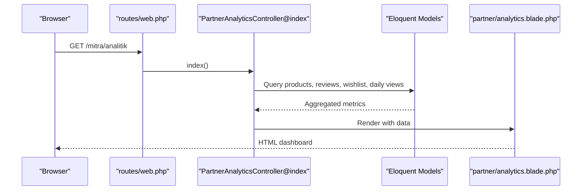
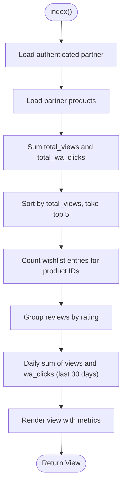
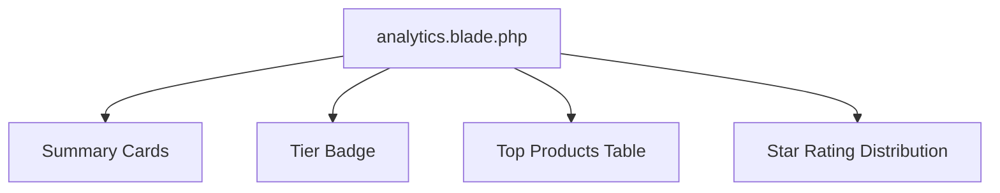
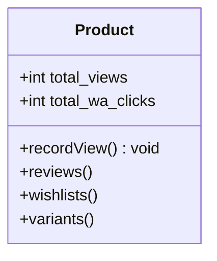
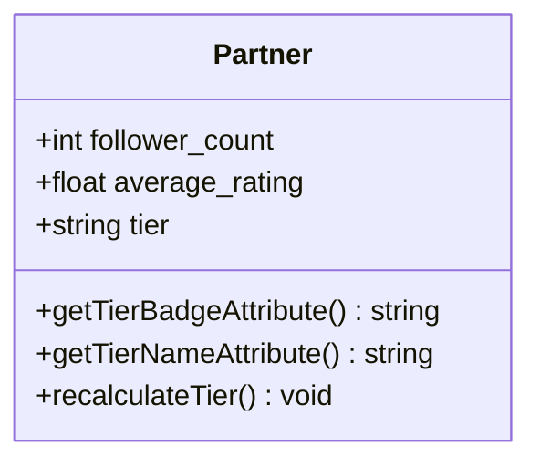
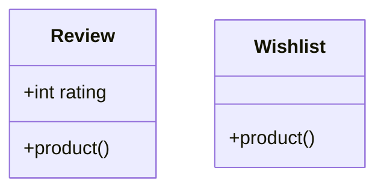
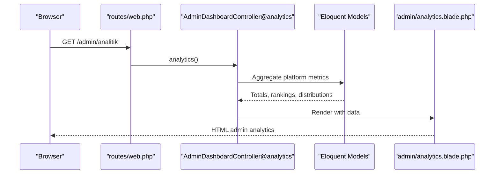
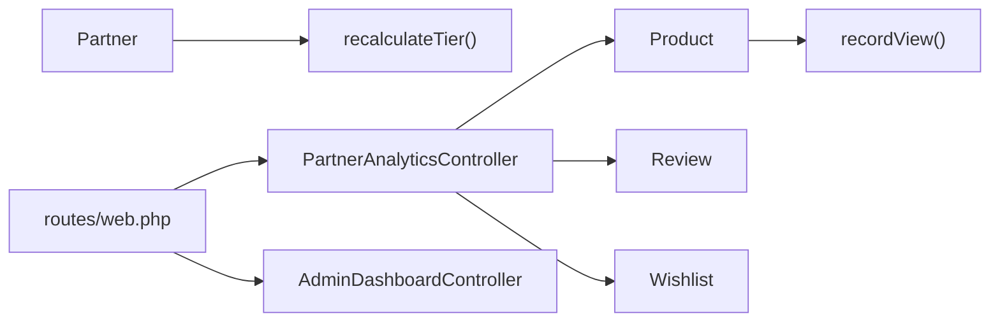

# Analytics and Performance Dashboard

<cite>
**Referenced Files in This Document**
- [PartnerAnalyticsController.php](file://app/Http/Controllers/Partner/PartnerAnalyticsController.php)
- [analytics.blade.php](file://resources/views/partner/analytics.blade.php)
- [Product.php](file://app/Models/Product.php)
- [Partner.php](file://app/Models/Partner.php)
- [Review.php](file://app/Models/Review.php)
- [Wishlist.php](file://app/Models/Wishlist.php)
- [web.php](file://routes/web.php)
- [AdminDashboardController.php](file://app/Http/Controllers/AdminDashboardController.php)
- [admin.analytics.blade.php](file://resources/views/admin/analytics.blade.php)
- [CatalogController.php](file://app/Http/Controllers/CatalogController.php)
</cite>

## Table of Contents
1. [Introduction](#introduction)
2. [Project Structure](#project-structure)
3. [Core Components](#core-components)
4. [Architecture Overview](#architecture-overview)
5. [Detailed Component Analysis](#detailed-component-analysis)
6. [Dependency Analysis](#dependency-analysis)
7. [Performance Considerations](#performance-considerations)
8. [Troubleshooting Guide](#troubleshooting-guide)
9. [Conclusion](#conclusion)
10. [Appendices](#appendices)

## Introduction
This document explains the analytics and performance tracking system for partners, focusing on the Partner Analytics Dashboard and administrative analytics. It covers key performance indicators (KPIs), visitor analytics, traffic sources, conversion metrics, product performance, tier-based insights, and administrative oversight. It also provides guidance on interpreting analytics data, identifying trends, and optimizing dashboard configurations.

## Project Structure
The analytics system spans controller logic, Blade templates, Eloquent models, and routing. The partner dashboard aggregates per-product metrics and per-store KPIs, while the admin dashboard provides platform-wide insights.

**Diagram sources**
- [web.php:154-156](file://routes/web.php#L154-L156)
- [PartnerAnalyticsController.php:17-58](file://app/Http/Controllers/Partner/PartnerAnalyticsController.php#L17-L58)
- [AdminDashboardController.php:31-65](file://app/Http/Controllers/AdminDashboardController.php#L31-L65)
- [Product.php:13-25](file://app/Models/Product.php#L13-L25)
- [Partner.php:10-26](file://app/Models/Partner.php#L10-L26)
- [Review.php:9-18](file://app/Models/Review.php#L9-L18)
- [Wishlist.php:11-17](file://app/Models/Wishlist.php#L11-L17)
- [analytics.blade.php:75-96](file://resources/views/partner/analytics.blade.php#L75-L96)
- [admin.analytics.blade.php:64-70](file://resources/views/admin/analytics.blade.php#L64-L70)

**Section sources**
- [web.php:154-156](file://routes/web.php#L154-L156)
- [PartnerAnalyticsController.php:17-58](file://app/Http/Controllers/Partner/PartnerAnalyticsController.php#L17-L58)
- [AdminDashboardController.php:31-65](file://app/Http/Controllers/AdminDashboardController.php#L31-L65)

## Core Components
- Partner Analytics Controller: Aggregates partner-specific KPIs, top products, review distribution, daily views, and follower counts.
- Partner Analytics View: Renders summary cards, tier badge, top products table, and star rating distribution.
- Product Model: Tracks total views and offers a view increment helper.
- Partner Model: Provides average rating, follower count, tier badge/name, and automatic tier recalculation.
- Review and Wishlist Models: Used for review statistics and wishlist counts.
- Admin Analytics Controller and View: Provide platform-wide totals, top partners/products, and category distributions.

Key KPIs exposed:
- Total views, total WhatsApp clicks, wishlist count, follower count, and store average rating.
- Top 5 products by views and daily views over the last 30 days.
- Review distribution by star rating.

**Section sources**
- [PartnerAnalyticsController.php:17-58](file://app/Http/Controllers/Partner/PartnerAnalyticsController.php#L17-L58)
- [analytics.blade.php:75-96](file://resources/views/partner/analytics.blade.php#L75-L96)
- [Product.php:115-119](file://app/Models/Product.php#L115-L119)
- [Partner.php:61-70](file://app/Models/Partner.php#L61-L70)
- [Partner.php:83-101](file://app/Models/Partner.php#L83-L101)
- [Partner.php:104-121](file://app/Models/Partner.php#L104-L121)
- [Review.php:9-18](file://app/Models/Review.php#L9-L18)
- [Wishlist.php:11-17](file://app/Models/Wishlist.php#L11-L17)
- [AdminDashboardController.php:31-65](file://app/Http/Controllers/AdminDashboardController.php#L31-L65)
- [admin.analytics.blade.php:64-70](file://resources/views/admin/analytics.blade.php#L64-L70)

## Architecture Overview
The analytics pipeline follows a request-to-render pattern:
- Routes define the analytics endpoints for partners and admins.
- Controllers fetch aggregated data from models.
- Views render the dashboard UI with computed metrics.

**Diagram sources**
- [web.php:154-156](file://routes/web.php#L154-L156)
- [PartnerAnalyticsController.php:17-58](file://app/Http/Controllers/Partner/PartnerAnalyticsController.php#L17-L58)
- [analytics.blade.php:75-96](file://resources/views/partner/analytics.blade.php#L75-L96)

## Detailed Component Analysis

### Partner Analytics Controller
Responsibilities:
- Authenticates the partner user and loads their products.
- Computes total views, total WhatsApp clicks, and top products by views.
- Counts wishlist entries for the partner’s products and aggregates review distribution.
- Builds daily views breakdown grouped by creation date for the last 30 days.
- Exposes follower count, average rating, tier badge/name, and store name.

**Diagram sources**
- [PartnerAnalyticsController.php:17-58](file://app/Http/Controllers/Partner/PartnerAnalyticsController.php#L17-L58)

**Section sources**
- [PartnerAnalyticsController.php:17-58](file://app/Http/Controllers/Partner/PartnerAnalyticsController.php#L17-L58)

### Partner Analytics View
Highlights:
- Summary cards for total views, WhatsApp clicks, wishlist, followers, and store average rating.
- Tier badge and tier name display.
- Top products table with name, views, WhatsApp clicks, and price.
- Star rating distribution bar chart derived from review statistics.

**Diagram sources**
- [analytics.blade.php:75-96](file://resources/views/partner/analytics.blade.php#L75-L96)
- [analytics.blade.php:108-127](file://resources/views/partner/analytics.blade.php#L108-L127)
- [analytics.blade.php:129-145](file://resources/views/partner/analytics.blade.php#L129-L145)

**Section sources**
- [analytics.blade.php:75-96](file://resources/views/partner/analytics.blade.php#L75-L96)
- [analytics.blade.php:108-127](file://resources/views/partner/analytics.blade.php#L108-L127)
- [analytics.blade.php:129-145](file://resources/views/partner/analytics.blade.php#L129-L145)

### Product Model
Capabilities:
- Defines fillable attributes including total views and WhatsApp click counters.
- Provides a helper to increment total views when a product page is viewed.
- Offers relationships to reviews, wishlists, reports, variants, and parent/child products.

**Diagram sources**
- [Product.php:13-25](file://app/Models/Product.php#L13-L25)
- [Product.php:115-119](file://app/Models/Product.php#L115-L119)

**Section sources**
- [Product.php:13-25](file://app/Models/Product.php#L13-L25)
- [Product.php:115-119](file://app/Models/Product.php#L115-L119)

### Partner Model
Capabilities:
- Stores store metadata, verification status, tier, and analytics counters.
- Calculates average rating across all products and review counts.
- Provides tier badge and tier name helpers.
- Recalculates tier based on weighted performance metrics.

**Diagram sources**
- [Partner.php:10-26](file://app/Models/Partner.php#L10-L26)
- [Partner.php:61-70](file://app/Models/Partner.php#L61-L70)
- [Partner.php:83-101](file://app/Models/Partner.php#L83-L101)
- [Partner.php:104-121](file://app/Models/Partner.php#L104-L121)

**Section sources**
- [Partner.php:10-26](file://app/Models/Partner.php#L10-L26)
- [Partner.php:61-70](file://app/Models/Partner.php#L61-L70)
- [Partner.php:83-101](file://app/Models/Partner.php#L83-L101)
- [Partner.php:104-121](file://app/Models/Partner.php#L104-L121)

### Review and Wishlist Models
- Review: Associates ratings to products for aggregation.
- Wishlist: Counts user interest across partner products.

**Diagram sources**
- [Review.php:9-18](file://app/Models/Review.php#L9-L18)
- [Wishlist.php:11-17](file://app/Models/Wishlist.php#L11-L17)

**Section sources**
- [Review.php:9-18](file://app/Models/Review.php#L9-L18)
- [Wishlist.php:11-17](file://app/Models/Wishlist.php#L11-L17)

### Admin Analytics Controller and View
- Admin controller computes platform-wide KPIs, top partners by views, top active products, tier distributions, and category statistics.
- Admin view renders summary cards, top partners table, and category distribution bars.

**Diagram sources**
- [web.php:237](file://routes/web.php#L237)
- [AdminDashboardController.php:31-65](file://app/Http/Controllers/AdminDashboardController.php#L31-L65)
- [admin.analytics.blade.php:64-70](file://resources/views/admin/analytics.blade.php#L64-L70)

**Section sources**
- [AdminDashboardController.php:31-65](file://app/Http/Controllers/AdminDashboardController.php#L31-L65)
- [admin.analytics.blade.php:64-70](file://resources/views/admin/analytics.blade.php#L64-L70)

## Dependency Analysis
- PartnerAnalyticsController depends on Product, Review, and Wishlist models to compute KPIs.
- Product model increments total views during product viewing.
- Partner model exposes derived metrics and tier computation.
- Routes bind analytics endpoints to controllers.

**Diagram sources**
- [PartnerAnalyticsController.php:17-58](file://app/Http/Controllers/Partner/PartnerAnalyticsController.php#L17-L58)
- [Product.php:115-119](file://app/Models/Product.php#L115-L119)
- [Partner.php:104-121](file://app/Models/Partner.php#L104-L121)
- [web.php:154-156](file://routes/web.php#L154-L156)
- [web.php:237](file://routes/web.php#L237)

**Section sources**
- [PartnerAnalyticsController.php:17-58](file://app/Http/Controllers/Partner/PartnerAnalyticsController.php#L17-L58)
- [Product.php:115-119](file://app/Models/Product.php#L115-L119)
- [Partner.php:104-121](file://app/Models/Partner.php#L104-L121)
- [web.php:154-156](file://routes/web.php#L154-L156)
- [web.php:237](file://routes/web.php#L237)

## Performance Considerations
- Aggregation queries: Partner analytics uses grouped sums and counts; ensure appropriate indexing on product and review tables for efficient grouping and filtering.
- Daily breakdown: Limiting last 30 days reduces dataset size; consider partitioning or materialized summaries for very large datasets.
- View increments: Using model increments is straightforward; ensure write-heavy environments leverage database connection pooling and consider caching strategies for frequently accessed dashboards.
- Rendering: Blade loops iterate over small result sets (top 5, last 30 days); keep templates minimal to reduce rendering overhead.

[No sources needed since this section provides general guidance]

## Troubleshooting Guide
Common issues and resolutions:
- Missing analytics data:
  - Verify product view increments occur when product pages are accessed.
  - Confirm review records exist for the partner’s products to populate review statistics.
- Incorrect totals:
  - Check that product visibility filters exclude sold or inactive items when needed.
  - Ensure follower counts and average ratings are updated via model accessors.
- Dashboard not loading:
  - Confirm authentication middleware allows access to analytics routes.
  - Validate that the partner account has associated products.

Operational checks:
- Product view tracking: Ensure product view increments are executed on product page load.
- Tier recalculation: Trigger manual tier recalculation if scores change unexpectedly.

**Section sources**
- [CatalogController.php:84-146](file://app/Http/Controllers/CatalogController.php#L84-L146)
- [Product.php:115-119](file://app/Models/Product.php#L115-L119)
- [Partner.php:61-70](file://app/Models/Partner.php#L61-L70)
- [Partner.php:104-121](file://app/Models/Partner.php#L104-L121)

## Conclusion
The analytics system delivers actionable insights for partners and administrators. Partners can monitor traffic, conversions, and product performance, while admins gain platform-wide visibility. By leveraging the existing aggregations, view tracking, and tier mechanics, stakeholders can track performance trends, identify top performers, and drive data-informed decisions.

[No sources needed since this section summarizes without analyzing specific files]

## Appendices

### KPI Definitions and Interpretation
- Total views: Sum of product views across a partner’s inventory; indicates reach and engagement.
- WhatsApp clicks: Sum of external click-throughs; proxies conversion intent.
- Wishlist count: Indicates demand and interest.
- Followers: Reflects brand awareness and community growth.
- Store average rating: Composite sentiment across all products.
- Top products: Best-performing SKUs by views; guide inventory and marketing focus.
- Daily views: Short-term trend signal; useful for campaign impact and seasonality.

**Section sources**
- [PartnerAnalyticsController.php:23-26](file://app/Http/Controllers/Partner/PartnerAnalyticsController.php#L23-L26)
- [PartnerAnalyticsController.php:28-32](file://app/Http/Controllers/Partner/PartnerAnalyticsController.php#L28-L32)
- [PartnerAnalyticsController.php:34-40](file://app/Http/Controllers/Partner/PartnerAnalyticsController.php#L34-L40)
- [analytics.blade.php:75-96](file://resources/views/partner/analytics.blade.php#L75-L96)

### Trend Analysis and Seasonality
- Use the daily views series to detect spikes around campaigns or new arrivals.
- Compare recent vs. historical averages to identify growth or decline.
- Correlate follower growth with marketing activities.

**Section sources**
- [PartnerAnalyticsController.php:34-40](file://app/Http/Controllers/Partner/PartnerAnalyticsController.php#L34-L40)

### Competitor Benchmarking and Market Positioning
- Admin analytics provides top partners and top products by views, enabling internal benchmarking.
- Use category distribution to compare product mix against peers.

**Section sources**
- [AdminDashboardController.php:38-42](file://app/Http/Controllers/AdminDashboardController.php#L38-L42)
- [admin.analytics.blade.php:93-106](file://resources/views/admin/analytics.blade.php#L93-L106)

### Real-Time Monitoring and Reporting
- Current implementation aggregates data on request; real-time updates require periodic refresh or background jobs.
- Consider adding scheduled tasks to recalculate tiers and update analytics snapshots.

**Section sources**
- [Partner.php:104-121](file://app/Models/Partner.php#L104-L121)

### Data Export Capabilities
- No explicit export endpoints were identified in the current routes and controllers.
- To enable exports, add endpoints in the partner routes and implement CSV generation in the controller.

**Section sources**
- [web.php:154-156](file://routes/web.php#L154-L156)