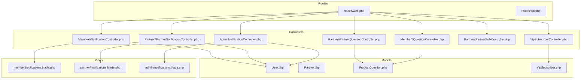
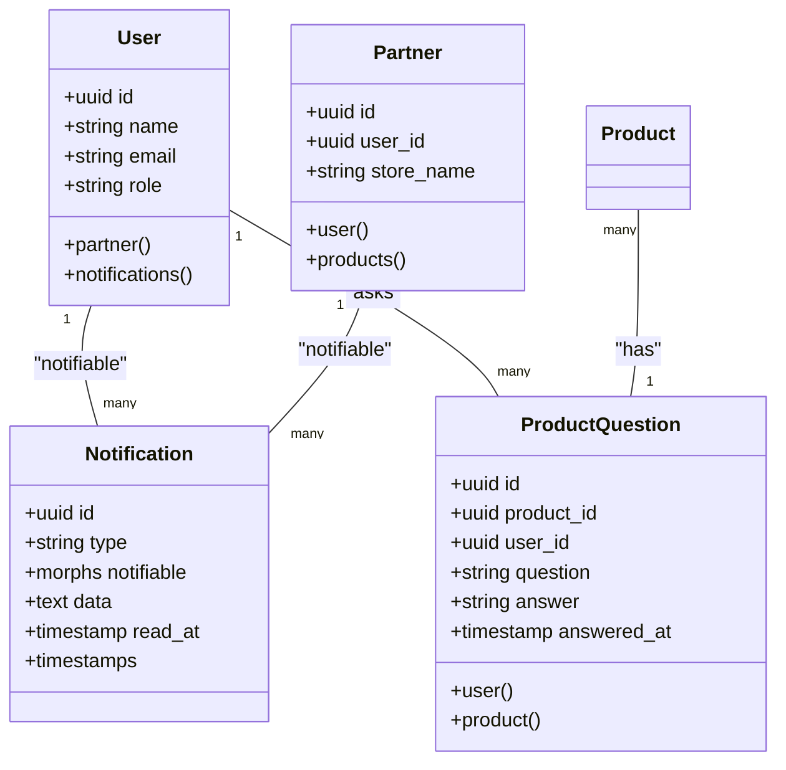
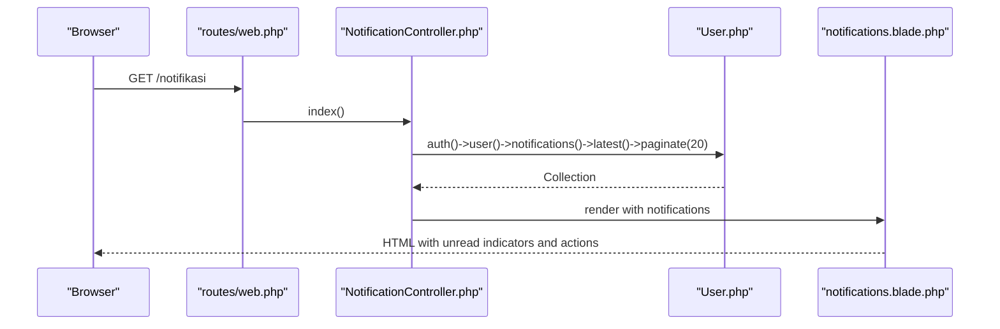
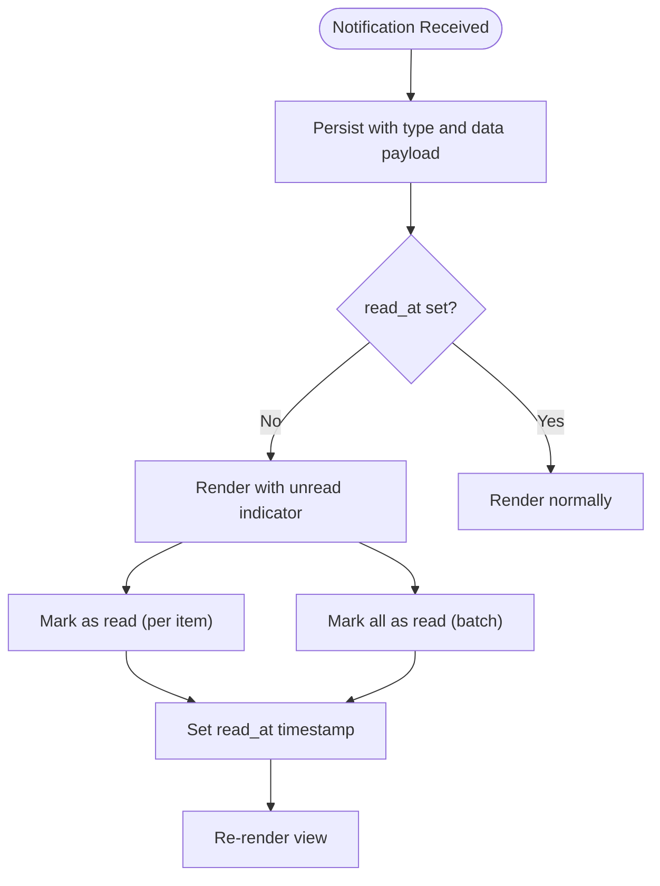
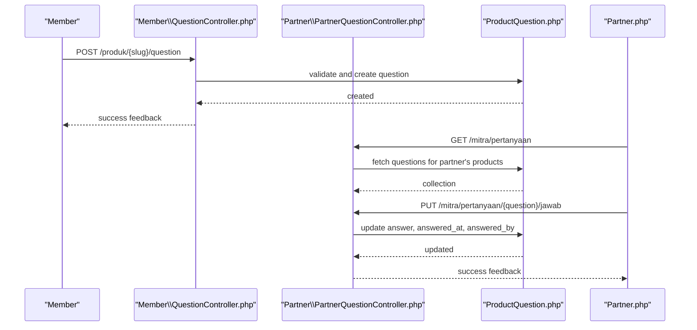
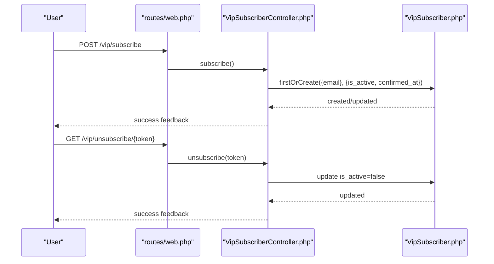
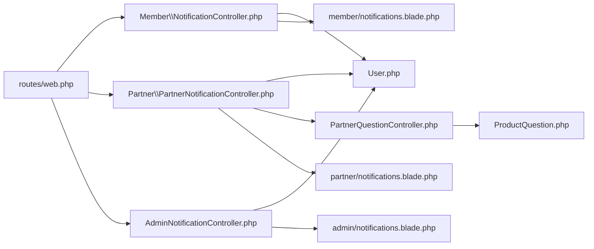

# Communication and Notifications

<cite>
**Referenced Files in This Document**
- [PartnerNotificationController.php](file://app/Http/Controllers/Partner/PartnerNotificationController.php)
- [NotificationController.php](file://app/Http/Controllers/Member/NotificationController.php)
- [AdminNotificationController.php](file://app/Http/Controllers/AdminNotificationController.php)
- [2026_07_01_100005_create_notifications_table.php](file://database/migrations/2026_07_01_100005_create_notifications_table.php)
- [User.php](file://app/Models/User.php)
- [Partner.php](file://app/Models/Partner.php)
- [notifications.blade.php (member)](file://resources/views/member/notifications.blade.php)
- [notifications.blade.php (partner)](file://resources/views/partner/notifications.blade.php)
- [notifications.blade.php (admin)](file://resources/views/admin/notifications.blade.php)
- [PartnerQuestionController.php](file://app/Http/Controllers/Partner/PartnerQuestionController.php)
- [QuestionController.php](file://app/Http/Controllers/Member/QuestionController.php)
- [ProductQuestion.php](file://app/Models/ProductQuestion.php)
- [PartnerBulkController.php](file://app/Http/Controllers/Partner/PartnerBulkController.php)
- [VipSubscriberController.php](file://app/Http/Controllers/VipSubscriberController.php)
- [VipSubscriber.php](file://app/Models/VipSubscriber.php)
- [web.php](file://routes/web.php)
- [api.php](file://routes/api.php)
</cite>

## Table of Contents
1. [Introduction](#introduction)
2. [Project Structure](#project-structure)
3. [Core Components](#core-components)
4. [Architecture Overview](#architecture-overview)
5. [Detailed Component Analysis](#detailed-component-analysis)
6. [Dependency Analysis](#dependency-analysis)
7. [Performance Considerations](#performance-considerations)
8. [Troubleshooting Guide](#troubleshooting-guide)
9. [Conclusion](#conclusion)
10. [Appendices](#appendices)

## Introduction
This document explains the communication and notification systems for partners and members, including notification center functionality, message categorization, alert management, and customer inquiry handling. It also covers broadcast messaging via VIP subscriptions, administrative controls, and operational guidelines for effective partner communication and customer satisfaction.

## Project Structure
The notification system is built on Laravel’s notifications infrastructure with role-specific controllers and views. Routes define endpoints for member, partner, and admin notification centers. Customer inquiries are handled via product questions, while VIP subscribers enable targeted broadcasts.

**Diagram sources**
- [web.php:105-108](file://routes/web.php#L105-L108)
- [web.php:162-165](file://routes/web.php#L162-L165)
- [web.php:225-228](file://routes/web.php#L225-L228)
- [web.php:158-160](file://routes/web.php#L158-L160)
- [web.php:102-103](file://routes/web.php#L102-L103)
- [web.php:135-138](file://routes/web.php#L135-L138)
- [web.php:65-66](file://routes/web.php#L65-L66)

**Section sources**
- [web.php:105-108](file://routes/web.php#L105-L108)
- [web.php:162-165](file://routes/web.php#L162-L165)
- [web.php:225-228](file://routes/web.php#L225-L228)
- [web.php:158-160](file://routes/web.php#L158-L160)
- [web.php:102-103](file://routes/web.php#L102-L103)
- [web.php:135-138](file://routes/web.php#L135-L138)
- [web.php:65-66](file://routes/web.php#L65-L66)

## Core Components
- Notification Center (Member, Partner, Admin)
  - Controllers fetch paginated notifications for the authenticated user and render role-specific views.
  - Views present unread indicators, timestamps, and per-notification actions (mark as read, mark all read).
- Message Categorization and Alert Management
  - Notifications are stored with a type and a data payload containing icon and message/text fields.
  - Read/unread state is tracked via a nullable read timestamp.
- Customer Inquiry Handling
  - Members submit product questions with rate limiting.
  - Partners can view and answer questions scoped to their products.
- Broadcast Messaging (VIP Subscribers)
  - Subscription and unsubscription endpoints manage opt-in/opt-out behavior.
- Communication Channels
  - Email/password authentication is supported for member and admin areas.
  - API access is available via Sanctum for authorized clients.

**Section sources**
- [NotificationController.php:10-17](file://app/Http/Controllers/Member/NotificationController.php#L10-L17)
- [PartnerNotificationController.php:9-19](file://app/Http/Controllers/Partner/PartnerNotificationController.php#L9-L19)
- [AdminNotificationController.php:10-17](file://app/Http/Controllers/AdminNotificationController.php#L10-L17)
- [notifications.blade.php (member):44-50](file://resources/views/member/notifications.blade.php#L44-L50)
- [notifications.blade.php (partner):56-61](file://resources/views/partner/notifications.blade.php#L56-L61)
- [notifications.blade.php (admin):58-63](file://resources/views/admin/notifications.blade.php#L58-L63)
- [2026_07_01_100005_create_notifications_table.php:10-16](file://database/migrations/2026_07_01_100005_create_notifications_table.php#L10-L16)
- [QuestionController.php:12-38](file://app/Http/Controllers/Member/QuestionController.php#L12-L38)
- [PartnerQuestionController.php:17-52](file://app/Http/Controllers/Partner/PartnerQuestionController.php#L17-L52)
- [VipSubscriberController.php:10-30](file://app/Http/Controllers/VipSubscriberController.php#L10-L30)
- [api.php:17-19](file://routes/api.php#L17-L19)

## Architecture Overview
The notification architecture leverages Laravel’s Eloquent notifications with morphic relations to support multiple notifiable entities (users, partners). Controllers coordinate routing, pagination, and rendering, while views encapsulate presentation and user actions.

**Diagram sources**
- [User.php:10-31](file://app/Models/User.php#L10-L31)
- [Partner.php:8-31](file://app/Models/Partner.php#L8-L31)
- [2026_07_01_100005_create_notifications_table.php:10-16](file://database/migrations/2026_07_01_100005_create_notifications_table.php#L10-L16)
- [ProductQuestion.php:6-30](file://app/Models/ProductQuestion.php#L6-L30)

## Detailed Component Analysis

### Notification Centers (Member, Partner, Admin)
- Functionality
  - Paginate latest notifications for the current user.
  - Provide “mark as read” per item and “mark all read” batch actions.
- Views
  - Member and partner views include sidebar navigation and per-item read controls.
  - Admin view mirrors the layout with admin-specific navigation.
- Routing
  - Dedicated routes under member, partner, and admin namespaces.

**Diagram sources**
- [web.php:105-108](file://routes/web.php#L105-L108)
- [NotificationController.php:10-17](file://app/Http/Controllers/Member/NotificationController.php#L10-L17)
- [User.php:10-31](file://app/Models/User.php#L10-L31)
- [notifications.blade.php (member):44-50](file://resources/views/member/notifications.blade.php#L44-L50)

**Section sources**
- [NotificationController.php:10-30](file://app/Http/Controllers/Member/NotificationController.php#L10-L30)
- [PartnerNotificationController.php:9-19](file://app/Http/Controllers/Partner/PartnerNotificationController.php#L9-L19)
- [AdminNotificationController.php:10-29](file://app/Http/Controllers/AdminNotificationController.php#L10-L29)
- [notifications.blade.php (member):44-73](file://resources/views/member/notifications.blade.php#L44-L73)
- [notifications.blade.php (partner):56-87](file://resources/views/partner/notifications.blade.php#L56-L87)
- [notifications.blade.php (admin):58-89](file://resources/views/admin/notifications.blade.php#L58-L89)
- [web.php:105-108](file://routes/web.php#L105-L108)
- [web.php:162-165](file://routes/web.php#L162-L165)
- [web.php:225-228](file://routes/web.php#L225-L228)

### Message Categorization and Alert Management
- Data model
  - Notifications include a type discriminator and a JSON-like data field for icon/message.
  - Read/unread state is tracked via read_at.
- Presentation
  - Views render messages from data payload and show unread borders or highlights.
- Best practices
  - Keep data concise; use structured keys (e.g., icon, message) for consistent rendering.

**Diagram sources**
- [2026_07_01_100005_create_notifications_table.php:10-16](file://database/migrations/2026_07_01_100005_create_notifications_table.php#L10-L16)
- [notifications.blade.php (member):57-68](file://resources/views/member/notifications.blade.php#L57-L68)
- [notifications.blade.php (partner):71-82](file://resources/views/partner/notifications.blade.php#L71-L82)
- [notifications.blade.php (admin):72-84](file://resources/views/admin/notifications.blade.php#L72-L84)

**Section sources**
- [2026_07_01_100005_create_notifications_table.php:10-16](file://database/migrations/2026_07_01_100005_create_notifications_table.php#L10-L16)
- [notifications.blade.php (member):57-68](file://resources/views/member/notifications.blade.php#L57-L68)
- [notifications.blade.php (partner):71-82](file://resources/views/partner/notifications.blade.php#L71-L82)
- [notifications.blade.php (admin):72-84](file://resources/views/admin/notifications.blade.php#L72-L84)

### Customer Inquiry Handling and Response Workflows
- Member-side submission
  - Validates question length and enforces a per-product limit per user.
  - Awards points upon successful submission.
- Partner-side management
  - Lists questions for products owned by the partner.
  - Ensures answers are posted only for partner’s own products.
- Data model
  - ProductQuestion links users and products, tracks answers and timestamps.

**Diagram sources**
- [QuestionController.php:12-38](file://app/Http/Controllers/Member/QuestionController.php#L12-L38)
- [PartnerQuestionController.php:17-52](file://app/Http/Controllers/Partner/PartnerQuestionController.php#L17-L52)
- [ProductQuestion.php:6-30](file://app/Models/ProductQuestion.php#L6-L30)
- [Partner.php:8-31](file://app/Models/Partner.php#L8-L31)

**Section sources**
- [QuestionController.php:12-38](file://app/Http/Controllers/Member/QuestionController.php#L12-L38)
- [PartnerQuestionController.php:17-52](file://app/Http/Controllers/Partner/PartnerQuestionController.php#L17-L52)
- [ProductQuestion.php:6-30](file://app/Models/ProductQuestion.php#L6-L30)

### Automated Notification Triggers and Delivery
- Triggers
  - Notifications are persisted when events occur (e.g., question answered, product updates).
- Delivery
  - Current implementation renders notifications server-side; no external email/SMS integrations are present in the analyzed files.
- Recommendations
  - Use queued jobs to dispatch emails/SMS asynchronously.
  - Integrate mail drivers and queue workers for reliable delivery.

[No sources needed since this section provides general guidance]

### Email Integration and SMS Messaging Capabilities
- Current state
  - No explicit email or SMS driver configurations or job handlers are present in the analyzed files.
- Implementation guidance
  - Configure mail driver and queue connection in environment settings.
  - Create mailables and notification classes for specific events.
  - Dispatch notifications via queued jobs to improve responsiveness.

[No sources needed since this section provides general guidance]

### Notification Preferences, Subscription Management, and Opt-Out Procedures
- VIP Subscription Management
  - Subscribe endpoint creates or activates a VIP subscriber record.
  - Unsubscribe endpoint deactivates a subscriber via a tokenized link.
- Opt-out procedure
  - Users can unsubscribe using the provided tokenized route.
- Scope
  - VIP subscribers are separate from platform user accounts; ensure clear separation of concerns.

**Diagram sources**
- [web.php:65-66](file://routes/web.php#L65-L66)
- [VipSubscriberController.php:10-30](file://app/Http/Controllers/VipSubscriberController.php#L10-L30)
- [VipSubscriber.php:7-19](file://app/Models/VipSubscriber.php#L7-L19)

**Section sources**
- [VipSubscriberController.php:10-30](file://app/Http/Controllers/VipSubscriberController.php#L10-L30)
- [VipSubscriber.php:7-19](file://app/Models/VipSubscriber.php#L7-L19)
- [web.php:65-66](file://routes/web.php#L65-L66)

### Customer Service Integration, Support Ticket Systems, and Issue Resolution Workflows
- Current implementation
  - Reports and reviews exist as models but are not integrated into a dedicated support ticket system in the analyzed files.
- Recommendations
  - Introduce a support ticket model with statuses (open, in progress, resolved).
  - Add admin routes to manage tickets and assignees.
  - Connect report/review moderation to ticket creation for escalations.

[No sources needed since this section provides general guidance]

### Broadcast Messaging, Promotional Campaign Tools, and Announcement Features
- Current implementation
  - VIP subscription enables targeted announcements to subscribers.
- Recommendations
  - Extend VIP subscriber model to track preference categories.
  - Build a broadcast controller to send announcements to active subscribers.
  - Add scheduling and analytics for open rates and engagement.

[No sources needed since this section provides general guidance]

### Notification Analytics, Open Rates, and Engagement Tracking
- Current state
  - No analytics or tracking fields are present in the analyzed files.
- Recommendations
  - Add fields to notifications (e.g., opened_at, opened_by) and maintain a separate analytics table.
  - Track link clicks and conversions for announcements.
  - Expose dashboards for admins and partners to review engagement metrics.

[No sources needed since this section provides general guidance]

### Guidelines for Effective Partner Communication, Response Time Standards, and Customer Satisfaction Optimization
- Best practices
  - Respond to product questions within defined SLAs; display response timestamps.
  - Use clear, friendly messaging in answers; attach helpful visuals when applicable.
  - Monitor notification center for unresolved items and follow-ups.
- Metrics
  - Track average response time, first-response time, and resolution time.
  - Measure customer satisfaction via post-interaction feedback.

[No sources needed since this section provides general guidance]

## Dependency Analysis
- Controllers depend on:
  - Authenticated user context to scope notifications.
  - Eloquent relationships to fetch associated data (e.g., partner’s products).
- Views depend on:
  - Notification data payload structure and pagination helpers.
- Routes depend on:
  - Middleware to enforce authentication per role.

**Diagram sources**
- [web.php:105-108](file://routes/web.php#L105-L108)
- [web.php:162-165](file://routes/web.php#L162-L165)
- [web.php:225-228](file://routes/web.php#L225-L228)
- [NotificationController.php:10-17](file://app/Http/Controllers/Member/NotificationController.php#L10-L17)
- [PartnerNotificationController.php:9-19](file://app/Http/Controllers/Partner/PartnerNotificationController.php#L9-L19)
- [AdminNotificationController.php:10-17](file://app/Http/Controllers/AdminNotificationController.php#L10-L17)
- [PartnerQuestionController.php:17-32](file://app/Http/Controllers/Partner/PartnerQuestionController.php#L17-L32)
- [ProductQuestion.php:6-30](file://app/Models/ProductQuestion.php#L6-L30)
- [notifications.blade.php (member):44-50](file://resources/views/member/notifications.blade.php#L44-L50)
- [notifications.blade.php (partner):56-61](file://resources/views/partner/notifications.blade.php#L56-L61)
- [notifications.blade.php (admin):58-63](file://resources/views/admin/notifications.blade.php#L58-L63)

**Section sources**
- [web.php:105-108](file://routes/web.php#L105-L108)
- [web.php:162-165](file://routes/web.php#L162-L165)
- [web.php:225-228](file://routes/web.php#L225-L228)
- [NotificationController.php:10-17](file://app/Http/Controllers/Member/NotificationController.php#L10-L17)
- [PartnerNotificationController.php:9-19](file://app/Http/Controllers/Partner/PartnerNotificationController.php#L9-L19)
- [AdminNotificationController.php:10-17](file://app/Http/Controllers/AdminNotificationController.php#L10-L17)
- [PartnerQuestionController.php:17-32](file://app/Http/Controllers/Partner/PartnerQuestionController.php#L17-L32)
- [ProductQuestion.php:6-30](file://app/Models/ProductQuestion.php#L6-L30)
- [notifications.blade.php (member):44-50](file://resources/views/member/notifications.blade.php#L44-L50)
- [notifications.blade.php (partner):56-61](file://resources/views/partner/notifications.blade.php#L56-L61)
- [notifications.blade.php (admin):58-63](file://resources/views/admin/notifications.blade.php#L58-L63)

## Performance Considerations
- Pagination
  - Controllers paginate notifications to avoid heavy loads; keep page sizes reasonable.
- Read state updates
  - Batch marking read reduces repeated queries; ensure atomic operations.
- Views
  - Rendering unread indicators is lightweight; avoid heavy computations in templates.
- Recommendations
  - Index notifications by created_at and notifiable for fast retrieval.
  - Cache frequently accessed notification counts for quick UI updates.

[No sources needed since this section provides general guidance]

## Troubleshooting Guide
- Notifications not appearing
  - Verify user authentication and that notifications are associated with the correct notifiable entity.
  - Confirm migration applied for notifications table.
- Read/unread actions fail
  - Ensure CSRF tokens are present in forms and routes exist for per-item and batch actions.
- Question answer errors
  - Confirm the question belongs to the partner’s product; partner must own the product to answer.
- VIP subscription/unsubscription issues
  - Validate token correctness and that the subscriber exists and is active.

**Section sources**
- [2026_07_01_100005_create_notifications_table.php:10-16](file://database/migrations/2026_07_01_100005_create_notifications_table.php#L10-L16)
- [web.php:105-108](file://routes/web.php#L105-L108)
- [web.php:162-165](file://routes/web.php#L162-L165)
- [web.php:225-228](file://routes/web.php#L225-L228)
- [PartnerQuestionController.php:38-39](file://app/Http/Controllers/Partner/PartnerQuestionController.php#L38-L39)
- [VipSubscriberController.php:25-30](file://app/Http/Controllers/VipSubscriberController.php#L25-L30)

## Conclusion
The platform provides robust role-based notification centers and a foundation for customer inquiry handling. To achieve comprehensive communication and notifications, integrate email/SMS delivery, implement VIP broadcast tools, and add analytics and support ticketing. Enforce response time standards and continuously optimize delivery and engagement.

## Appendices
- API Access
  - Authorized clients can access user info via the Sanctum-protected API route.

**Section sources**
- [api.php:17-19](file://routes/api.php#L17-L19)