# Outfit and Content Management

<cite>
**Referenced Files in This Document**
- [PartnerOutfitController.php](file://app/Http/Controllers/Partner/PartnerOutfitController.php)
- [PartnerProductController.php](file://app/Http/Controllers/Partner/PartnerProductController.php)
- [PartnerAnalyticsController.php](file://app/Http/Controllers/Partner/PartnerAnalyticsController.php)
- [Outfit.php](file://app/Models/Outfit.php)
- [OutfitItem.php](file://app/Models/OutfitItem.php)
- [Product.php](file://app/Models/Product.php)
- [ProductVariant.php](file://app/Models/ProductVariant.php)
- [Partner.php](file://app/Models/Partner.php)
- [CatalogController.php](file://app/Http/Controllers/CatalogController.php)
- [OutfitShareController.php](file://app/Http/Controllers/OutfitShareController.php)
- [web.php](file://routes/web.php)
- [create.blade.php](file://resources/views/partner/outfits/create.blade.php)
- [index.blade.php](file://resources/views/partner/outfits/index.blade.php)
- [catalog.php](file://config/catalog.php)
</cite>

## Table of Contents
1. [Introduction](#introduction)
2. [Project Structure](#project-structure)
3. [Core Components](#core-components)
4. [Architecture Overview](#architecture-overview)
5. [Detailed Component Analysis](#detailed-component-analysis)
6. [Dependency Analysis](#dependency-analysis)
7. [Performance Considerations](#performance-considerations)
8. [Troubleshooting Guide](#troubleshooting-guide)
9. [Conclusion](#conclusion)
10. [Appendices](#appendices)

## Introduction
This document explains the partner-facing outfit creation and content management system, including how partners compose outfits, manage products, coordinate styling, assemble lookbooks, publish and share outfits, track analytics, collaborate via shared product pools, and optimize discovery. It also covers product pairing strategies, visual composition, media handling, and operational workflows such as bulk actions and variant management.

## Project Structure
The system centers around partner controllers and models for outfit and product management, with public-facing controllers for lookbook and sharing. Routes define partner, admin, and public endpoints. Configuration defines product categories, pairing rules, and UI defaults.

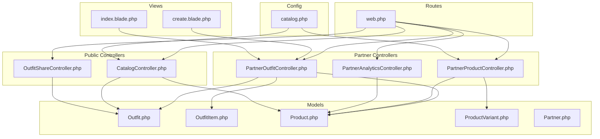

**Diagram sources**
- [web.php:118-167](file://routes/web.php#L118-L167)
- [PartnerOutfitController.php:13-92](file://app/Http/Controllers/Partner/PartnerOutfitController.php#L13-L92)
- [PartnerProductController.php:14-337](file://app/Http/Controllers/Partner/PartnerProductController.php#L14-L337)
- [PartnerAnalyticsController.php:10-60](file://app/Http/Controllers/Partner/PartnerAnalyticsController.php#L10-L60)
- [CatalogController.php:12-197](file://app/Http/Controllers/CatalogController.php#L12-L197)
- [OutfitShareController.php:8-29](file://app/Http/Controllers/OutfitShareController.php#L8-L29)
- [Outfit.php:8-60](file://app/Models/Outfit.php#L8-L60)
- [OutfitItem.php:7-28](file://app/Models/OutfitItem.php#L7-L28)
- [Product.php:9-132](file://app/Models/Product.php#L9-L132)
- [ProductVariant.php:6-23](file://app/Models/ProductVariant.php#L6-L23)
- [Partner.php:8-123](file://app/Models/Partner.php#L8-L123)
- [create.blade.php:1-195](file://resources/views/partner/outfits/create.blade.php#L1-L195)
- [index.blade.php:1-114](file://resources/views/partner/outfits/index.blade.php#L1-L114)
- [catalog.php:14-28](file://config/catalog.php#L14-L28)

**Section sources**
- [web.php:118-167](file://routes/web.php#L118-L167)
- [PartnerOutfitController.php:13-92](file://app/Http/Controllers/Partner/PartnerOutfitController.php#L13-L92)
- [PartnerProductController.php:14-337](file://app/Http/Controllers/Partner/PartnerProductController.php#L14-L337)
- [PartnerAnalyticsController.php:10-60](file://app/Http/Controllers/Partner/PartnerAnalyticsController.php#L10-L60)
- [CatalogController.php:12-197](file://app/Http/Controllers/CatalogController.php#L12-L197)
- [OutfitShareController.php:8-29](file://app/Http/Controllers/OutfitShareController.php#L8-L29)
- [Outfit.php:8-60](file://app/Models/Outfit.php#L8-L60)
- [OutfitItem.php:7-28](file://app/Models/OutfitItem.php#L7-L28)
- [Product.php:9-132](file://app/Models/Product.php#L9-L132)
- [ProductVariant.php:6-23](file://app/Models/ProductVariant.php#L6-L23)
- [Partner.php:8-123](file://app/Models/Partner.php#L8-L123)
- [create.blade.php:1-195](file://resources/views/partner/outfits/create.blade.php#L1-L195)
- [index.blade.php:1-114](file://resources/views/partner/outfits/index.blade.php#L1-L114)
- [catalog.php:14-28](file://config/catalog.php#L14-L28)

## Core Components
- Outfit management: creation, listing, deletion, and sharing via tokenized URLs.
- Product management: CRUD, variants, size charts, images, and SEO metadata.
- Styling and lookbook: curated lookbook page aggregating partner and admin-created outfits.
- Analytics: per-partner insights on views, clicks, ratings, and follower metrics.
- Collaboration: cross-partner product selection for mixed-outfit pairings.

Key responsibilities:
- PartnerOutfitController: validates and persists Outfit and OutfitItem records; enforces ownership.
- PartnerProductController: handles product lifecycle, image uploads, variants, and size charts.
- CatalogController: renders public catalog, product pages, lookbook, and related pairing suggestions.
- OutfitShareController: serves public shareable pages for outfits.
- Models: define relationships, computed attributes, and casting for accurate data handling.

**Section sources**
- [PartnerOutfitController.php:13-92](file://app/Http/Controllers/Partner/PartnerOutfitController.php#L13-L92)
- [PartnerProductController.php:14-337](file://app/Http/Controllers/Partner/PartnerProductController.php#L14-L337)
- [PartnerAnalyticsController.php:10-60](file://app/Http/Controllers/Partner/PartnerAnalyticsController.php#L10-L60)
- [CatalogController.php:148-168](file://app/Http/Controllers/CatalogController.php#L148-L168)
- [OutfitShareController.php:8-29](file://app/Http/Controllers/OutfitShareController.php#L8-L29)
- [Outfit.php:8-60](file://app/Models/Outfit.php#L8-L60)
- [OutfitItem.php:7-28](file://app/Models/OutfitItem.php#L7-L28)
- [Product.php:9-132](file://app/Models/Product.php#L9-L132)
- [ProductVariant.php:6-23](file://app/Models/ProductVariant.php#L6-L23)
- [Partner.php:8-123](file://app/Models/Partner.php#L8-L123)

## Architecture Overview
The partner portal integrates tightly with models and controllers to support:
- Outfit creation with cross-partner product selection.
- Product cataloging with variants and size charts.
- Lookbook aggregation and public sharing.
- Analytics dashboards for performance insights.

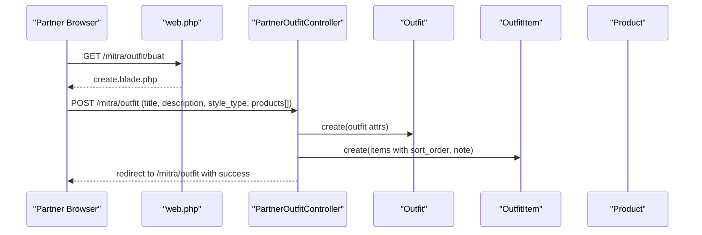

**Diagram sources**
- [web.php:148-152](file://routes/web.php#L148-L152)
- [PartnerOutfitController.php:33-82](file://app/Http/Controllers/Partner/PartnerOutfitController.php#L33-L82)
- [Outfit.php:28-38](file://app/Models/Outfit.php#L28-L38)
- [OutfitItem.php:18-26](file://app/Models/OutfitItem.php#L18-L26)
- [Product.php:36-39](file://app/Models/Product.php#L36-L39)

**Section sources**
- [web.php:148-152](file://routes/web.php#L148-L152)
- [PartnerOutfitController.php:33-82](file://app/Http/Controllers/Partner/PartnerOutfitController.php#L33-L82)
- [Outfit.php:28-38](file://app/Models/Outfit.php#L28-L38)
- [OutfitItem.php:18-26](file://app/Models/OutfitItem.php#L18-L26)
- [Product.php:36-39](file://app/Models/Product.php#L36-L39)

## Detailed Component Analysis

### Outfit Creation Workflow
- UI allows selecting 2–6 products from self or other approved partners.
- Backend validates presence and existence of products, ensures minimum count, and persists Outfit and OutfitItem entries with sort order and optional notes.
- Ownership checks prevent unauthorized deletions.

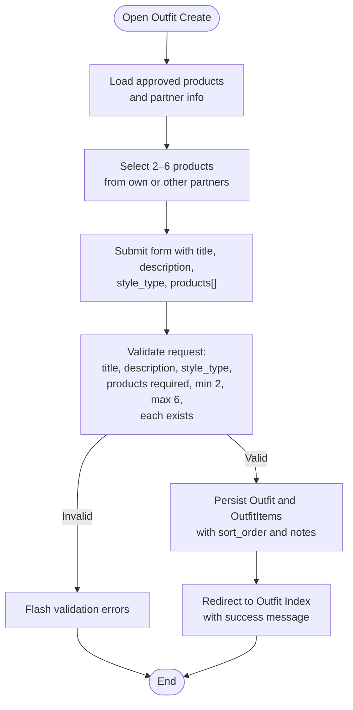

**Diagram sources**
- [create.blade.php:82-138](file://resources/views/partner/outfits/create.blade.php#L82-L138)
- [PartnerOutfitController.php:49-82](file://app/Http/Controllers/Partner/PartnerOutfitController.php#L49-L82)
- [Outfit.php:28-38](file://app/Models/Outfit.php#L28-L38)
- [OutfitItem.php:18-26](file://app/Models/OutfitItem.php#L18-L26)

**Section sources**
- [create.blade.php:80-138](file://resources/views/partner/outfits/create.blade.php#L80-L138)
- [PartnerOutfitController.php:33-82](file://app/Http/Controllers/Partner/PartnerOutfitController.php#L33-L82)
- [Outfit.php:28-38](file://app/Models/Outfit.php#L28-L38)
- [OutfitItem.php:18-26](file://app/Models/OutfitItem.php#L18-L26)

### Outfit Publishing and Sharing
- Outfits are persisted with an active flag and a share token generated automatically.
- Public sharing uses a tokenized route; lookbook aggregates active outfits for discovery.

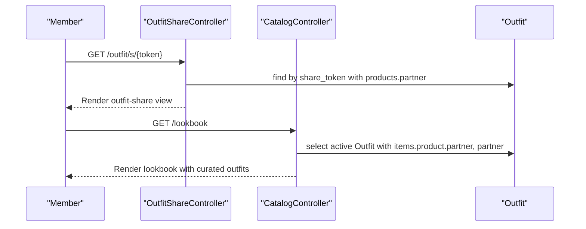

**Diagram sources**
- [OutfitShareController.php:10-27](file://app/Http/Controllers/OutfitShareController.php#L10-L27)
- [CatalogController.php:148-168](file://app/Http/Controllers/CatalogController.php#L148-L168)
- [Outfit.php:55-58](file://app/Models/Outfit.php#L55-L58)

**Section sources**
- [OutfitShareController.php:10-27](file://app/Http/Controllers/OutfitShareController.php#L10-L27)
- [CatalogController.php:148-168](file://app/Http/Controllers/CatalogController.php#L148-L168)
- [Outfit.php:55-58](file://app/Models/Outfit.php#L55-L58)

### Product Pairing Strategies and Styling Coordination
- Product types define pairing categories for cross-category suggestions.
- Outfit creation supports mixing own and other partners’ products for diverse styling.
- Style types enable categorization (e.g., casual, streetwear, sporty, vintage).

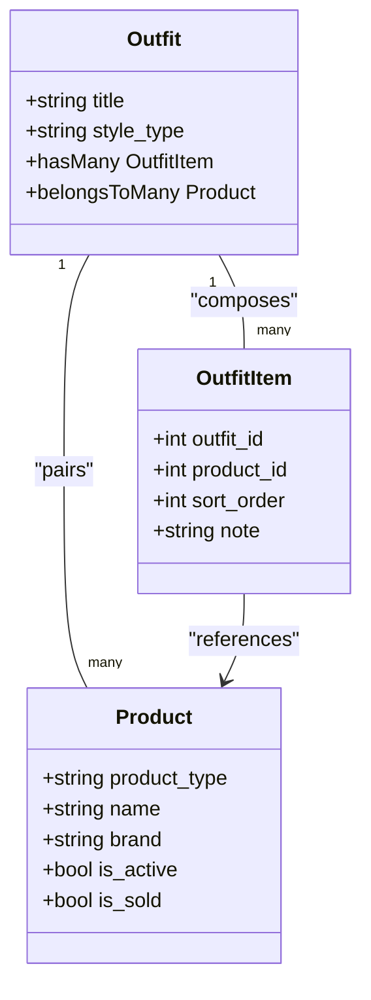

**Diagram sources**
- [Product.php:13-34](file://app/Models/Product.php#L13-L34)
- [Outfit.php:28-38](file://app/Models/Outfit.php#L28-L38)
- [OutfitItem.php:18-26](file://app/Models/OutfitItem.php#L18-L26)
- [catalog.php:14-28](file://config/catalog.php#L14-L28)

**Section sources**
- [catalog.php:14-28](file://config/catalog.php#L14-L28)
- [PartnerOutfitController.php:35-46](file://app/Http/Controllers/Partner/PartnerOutfitController.php#L35-L46)
- [Product.php:13-34](file://app/Models/Product.php#L13-L34)
- [Outfit.php:28-38](file://app/Models/Outfit.php#L28-L38)
- [OutfitItem.php:18-26](file://app/Models/OutfitItem.php#L18-L26)

### Lookbook Assembly and Discovery
- Lookbook aggregates active outfits with associated items and partner info.
- Saved-outfit toggles and share tokens improve discoverability and engagement.

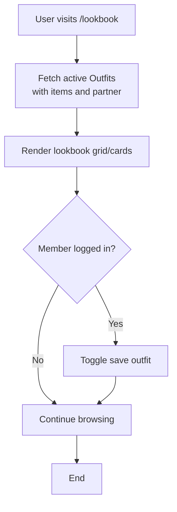

**Diagram sources**
- [CatalogController.php:148-168](file://app/Http/Controllers/CatalogController.php#L148-L168)

**Section sources**
- [CatalogController.php:148-168](file://app/Http/Controllers/CatalogController.php#L148-L168)

### Outfit Editing and Deletion
- Ownership enforcement prevents unauthorized edits/deletes.
- Deletion cascades to OutfitItem records.

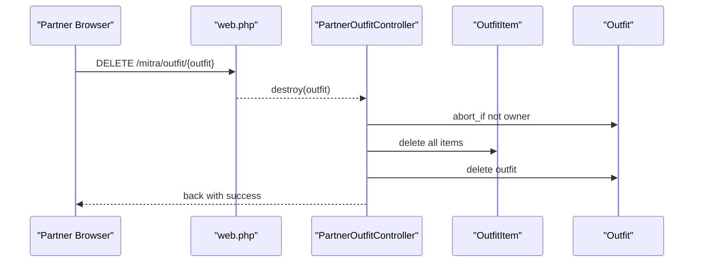

**Diagram sources**
- [web.php:152](file://routes/web.php#L152)
- [PartnerOutfitController.php:84-90](file://app/Http/Controllers/Partner/PartnerOutfitController.php#L84-L90)
- [OutfitItem.php:18-26](file://app/Models/OutfitItem.php#L18-L26)

**Section sources**
- [web.php:152](file://routes/web.php#L152)
- [PartnerOutfitController.php:84-90](file://app/Http/Controllers/Partner/PartnerOutfitController.php#L84-L90)
- [OutfitItem.php:18-26](file://app/Models/OutfitItem.php#L18-L26)

### Outfit Analytics and Engagement Tracking
- Partner analytics dashboard aggregates product views, WhatsApp clicks, top products, wishlist counts, review distribution, and daily trends.
- Products maintain counters for views and external clicks.

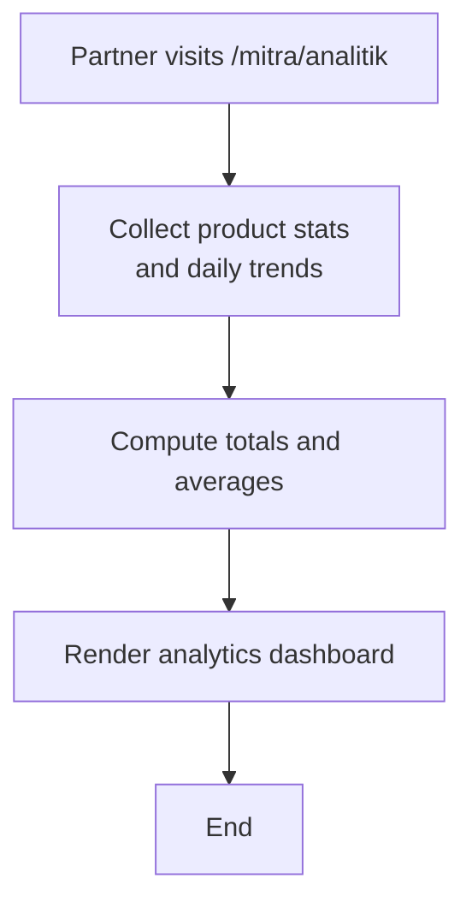

**Diagram sources**
- [PartnerAnalyticsController.php:17-58](file://app/Http/Controllers/Partner/PartnerAnalyticsController.php#L17-L58)
- [Product.php:115-119](file://app/Models/Product.php#L115-L119)

**Section sources**
- [PartnerAnalyticsController.php:17-58](file://app/Http/Controllers/Partner/PartnerAnalyticsController.php#L17-L58)
- [Product.php:115-119](file://app/Models/Product.php#L115-L119)

### Product Media Management and Variant Handling
- Image upload or URL assignment with storage path resolution.
- Size chart parsing and variant creation/update with stock and pricing.
- Slug generation ensures uniqueness across updates.

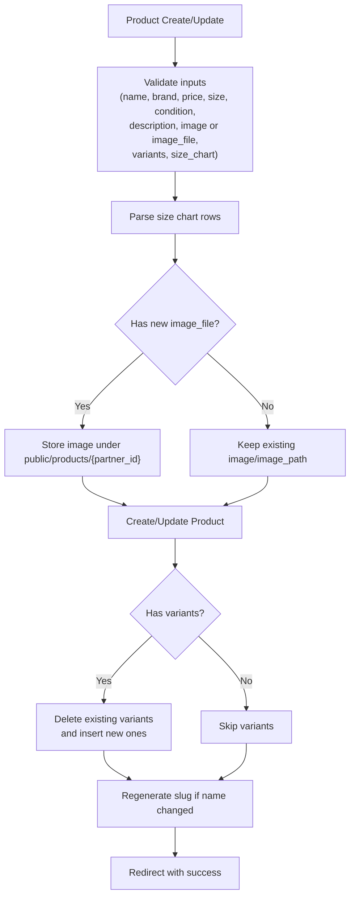

**Diagram sources**
- [PartnerProductController.php:42-133](file://app/Http/Controllers/Partner/PartnerProductController.php#L42-L133)
- [PartnerProductController.php:149-245](file://app/Http/Controllers/Partner/PartnerProductController.php#L149-L245)
- [PartnerProductController.php:261-290](file://app/Http/Controllers/Partner/PartnerProductController.php#L261-L290)
- [ProductVariant.php:8-21](file://app/Models/ProductVariant.php#L8-L21)
- [Product.php:96-102](file://app/Models/Product.php#L96-L102)

**Section sources**
- [PartnerProductController.php:42-133](file://app/Http/Controllers/Partner/PartnerProductController.php#L42-L133)
- [PartnerProductController.php:149-245](file://app/Http/Controllers/Partner/PartnerProductController.php#L149-L245)
- [PartnerProductController.php:261-290](file://app/Http/Controllers/Partner/PartnerProductController.php#L261-L290)
- [ProductVariant.php:8-21](file://app/Models/ProductVariant.php#L8-L21)
- [Product.php:96-102](file://app/Models/Product.php#L96-L102)

### Collaboration and Cross-Partner Pairings
- Outfit creation lists products from all approved partners, enabling mix-and-match pairings.
- UI highlights own vs. other partner items to guide selection.

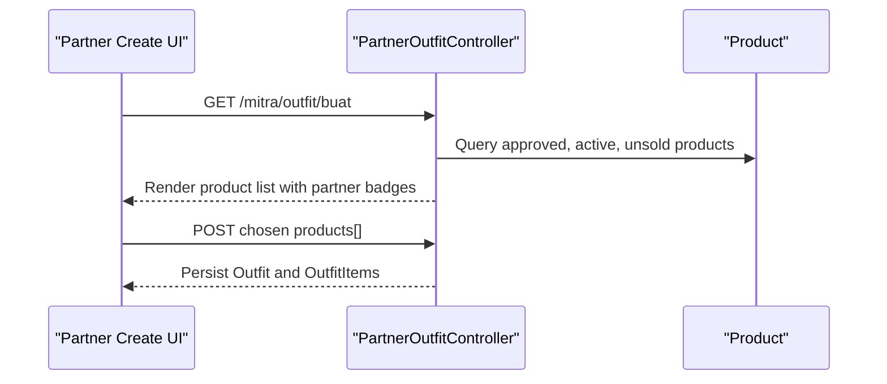

**Diagram sources**
- [PartnerOutfitController.php:33-46](file://app/Http/Controllers/Partner/PartnerOutfitController.php#L33-L46)
- [create.blade.php:102-124](file://resources/views/partner/outfits/create.blade.php#L102-L124)

**Section sources**
- [PartnerOutfitController.php:33-46](file://app/Http/Controllers/Partner/PartnerOutfitController.php#L33-L46)
- [create.blade.php:102-124](file://resources/views/partner/outfits/create.blade.php#L102-L124)

### Versioning and Revisions
- No explicit versioning model is present for Outfit or OutfitItem.
- Recommendations:
  - Add OutfitVersion model linked to Outfit with snapshot fields (title, description, style_type, products).
  - Track changes via ActivityLog for auditability.
  - Provide “Revert to version” actions in partner UI.

[No sources needed since this section provides general guidance]

### Approval Workflows and Visibility Controls
- Outfit visibility is controlled by the is_active flag; lookbook filters by active.
- Public sharing uses share_token; no additional approval gate is enforced in the controller shown.

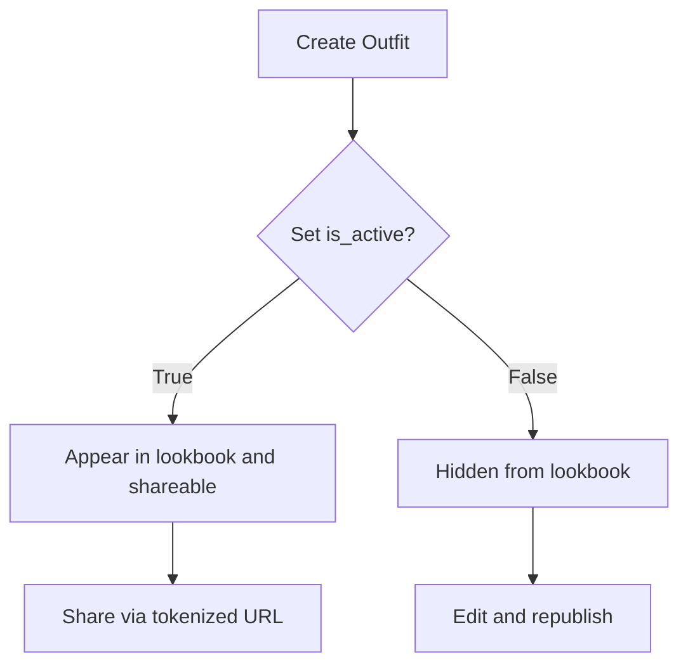

**Diagram sources**
- [Outfit.php:17](file://app/Models/Outfit.php#L17)
- [CatalogController.php:148-168](file://app/Http/Controllers/CatalogController.php#L148-L168)
- [OutfitShareController.php:10-27](file://app/Http/Controllers/OutfitShareController.php#L10-L27)

**Section sources**
- [Outfit.php:17](file://app/Models/Outfit.php#L17)
- [CatalogController.php:148-168](file://app/Http/Controllers/CatalogController.php#L148-L168)
- [OutfitShareController.php:10-27](file://app/Http/Controllers/OutfitShareController.php#L10-L27)

### Categorization, Tagging, and Discovery Optimization
- Product types and pairing rules inform related product suggestions.
- Style types help categorize outfits.
- Lookbook acts as a discovery hub for curated content.

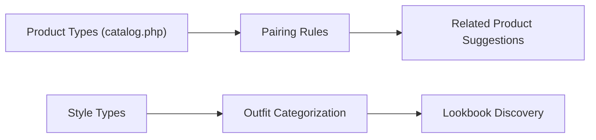

**Diagram sources**
- [catalog.php:14-28](file://config/catalog.php#L14-L28)
- [Product.php:96-102](file://app/Models/Product.php#L96-L102)

**Section sources**
- [catalog.php:14-28](file://config/catalog.php#L14-L28)
- [Product.php:96-102](file://app/Models/Product.php#L96-L102)

### Team Access and Scheduling
- Team access: Partner model links to User; controllers enforce ownership via auth('partner').
- Scheduling: No built-in scheduling fields found; consider adding scheduled_publish_at on Outfit and Product.

[No sources needed since this section provides general guidance]

## Dependency Analysis
- Controllers depend on Eloquent models and route definitions.
- Outfit depends on OutfitItem and Product; OutfitItem belongs to Outfit and Product.
- Product variants are managed separately and linked via foreign keys.
- CatalogController orchestrates lookbook and product pairing logic.

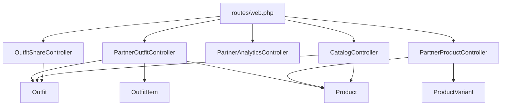

**Diagram sources**
- [web.php:118-167](file://routes/web.php#L118-L167)
- [PartnerOutfitController.php:13-92](file://app/Http/Controllers/Partner/PartnerOutfitController.php#L13-L92)
- [PartnerProductController.php:14-337](file://app/Http/Controllers/Partner/PartnerProductController.php#L14-L337)
- [PartnerAnalyticsController.php:10-60](file://app/Http/Controllers/Partner/PartnerAnalyticsController.php#L10-L60)
- [CatalogController.php:12-197](file://app/Http/Controllers/CatalogController.php#L12-L197)
- [OutfitShareController.php:8-29](file://app/Http/Controllers/OutfitShareController.php#L8-L29)
- [Outfit.php:8-60](file://app/Models/Outfit.php#L8-L60)
- [OutfitItem.php:7-28](file://app/Models/OutfitItem.php#L7-L28)
- [Product.php:9-132](file://app/Models/Product.php#L9-L132)
- [ProductVariant.php:6-23](file://app/Models/ProductVariant.php#L6-L23)

**Section sources**
- [web.php:118-167](file://routes/web.php#L118-L167)
- [PartnerOutfitController.php:13-92](file://app/Http/Controllers/Partner/PartnerOutfitController.php#L13-L92)
- [PartnerProductController.php:14-337](file://app/Http/Controllers/Partner/PartnerProductController.php#L14-L337)
- [PartnerAnalyticsController.php:10-60](file://app/Http/Controllers/Partner/PartnerAnalyticsController.php#L10-L60)
- [CatalogController.php:12-197](file://app/Http/Controllers/CatalogController.php#L12-L197)
- [OutfitShareController.php:8-29](file://app/Http/Controllers/OutfitShareController.php#L8-L29)
- [Outfit.php:8-60](file://app/Models/Outfit.php#L8-L60)
- [OutfitItem.php:7-28](file://app/Models/OutfitItem.php#L7-L28)
- [Product.php:9-132](file://app/Models/Product.php#L9-L132)
- [ProductVariant.php:6-23](file://app/Models/ProductVariant.php#L6-L23)

## Performance Considerations
- Eager load relationships (e.g., Outfit.with('products.partner'), Outfit.items.product.partner) to reduce N+1 queries.
- Use pagination for lookbook and product listings when datasets grow.
- Store thumbnails and compress images to reduce bandwidth.
- Cache frequently accessed pairing suggestions and product type configurations.

[No sources needed since this section provides general guidance]

## Troubleshooting Guide
- Validation failures during Outfit creation: ensure title length, style_type, and products array meet constraints.
- Ownership errors on delete: verify the logged-in partner matches the Outfit’s partner_id.
- Product image issues: confirm file upload limits and storage permissions; fallback to URL if needed.
- Analytics discrepancies: check that product view increments occur on product show.

**Section sources**
- [PartnerOutfitController.php:49-57](file://app/Http/Controllers/Partner/PartnerOutfitController.php#L49-L57)
- [PartnerOutfitController.php:84-86](file://app/Http/Controllers/Partner/PartnerOutfitController.php#L84-L86)
- [PartnerProductController.php:78-86](file://app/Http/Controllers/Partner/PartnerProductController.php#L78-L86)
- [Product.php:115-119](file://app/Models/Product.php#L115-L119)

## Conclusion
The partner outfit and content management system provides a robust foundation for creating styled combinations, managing product catalogs with variants and pairing rules, assembling a public lookbook, and tracking performance. Enhancements such as versioning, scheduling, and richer collaboration features can further strengthen the platform’s capabilities.

## Appendices
- Best practices:
  - Encourage consistent style_type usage to improve categorization.
  - Use product pairing rules to suggest complementary items.
  - Maintain clear product descriptions and stories to boost engagement.
  - Regularly review analytics to optimize popular styles and products.

[No sources needed since this section provides general guidance]