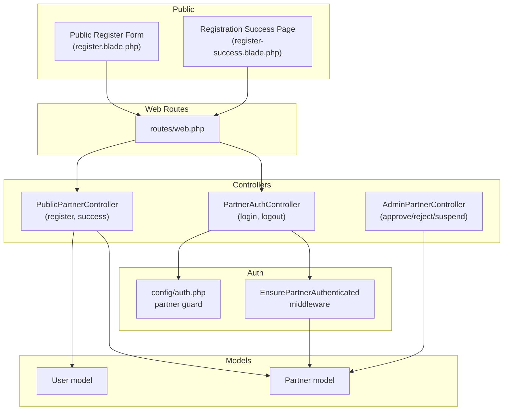
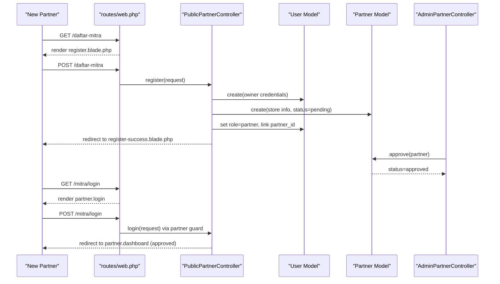
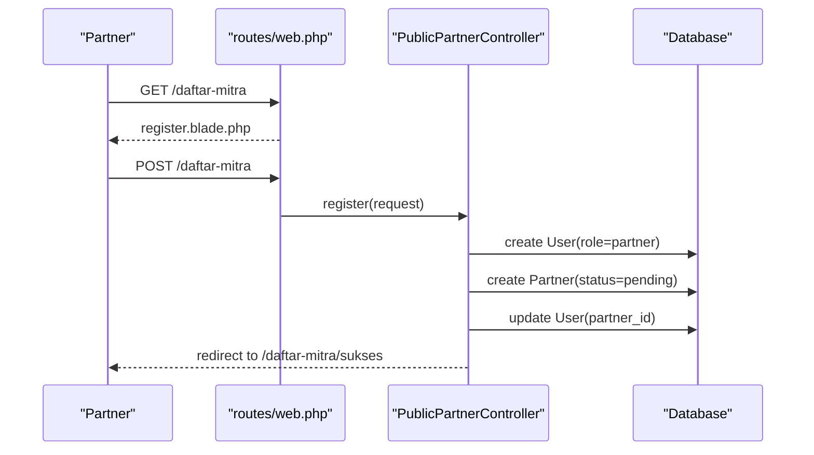
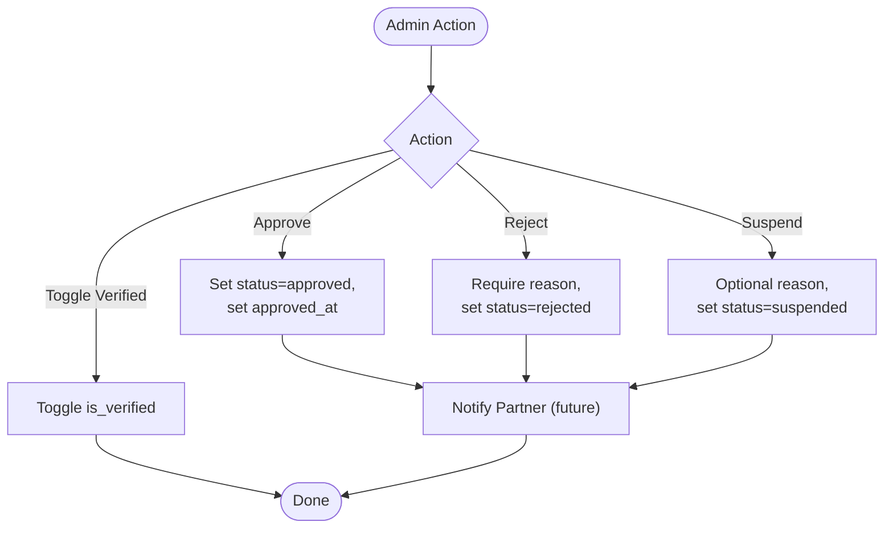
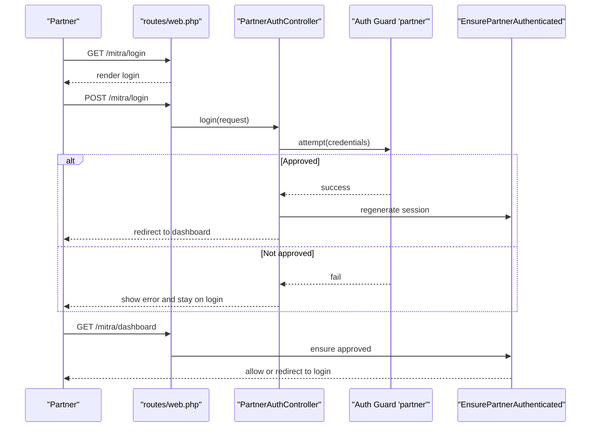
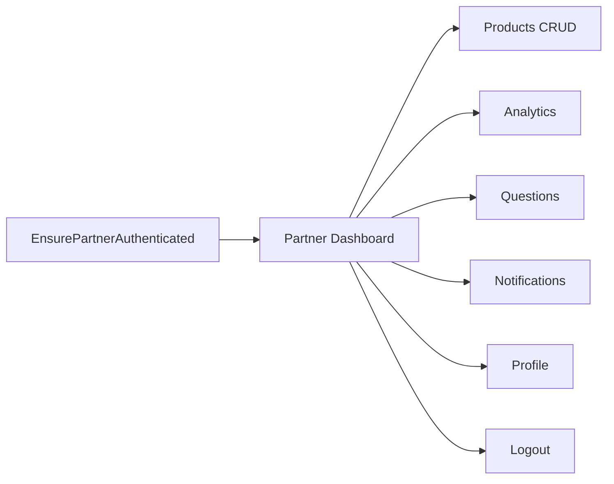
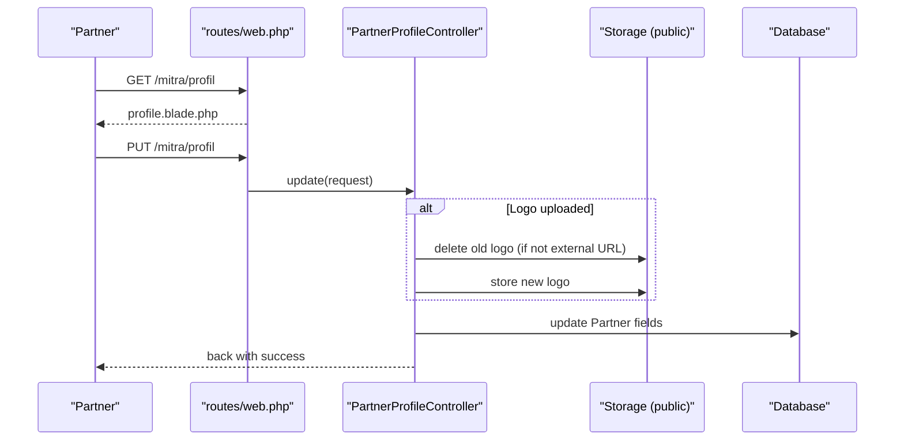
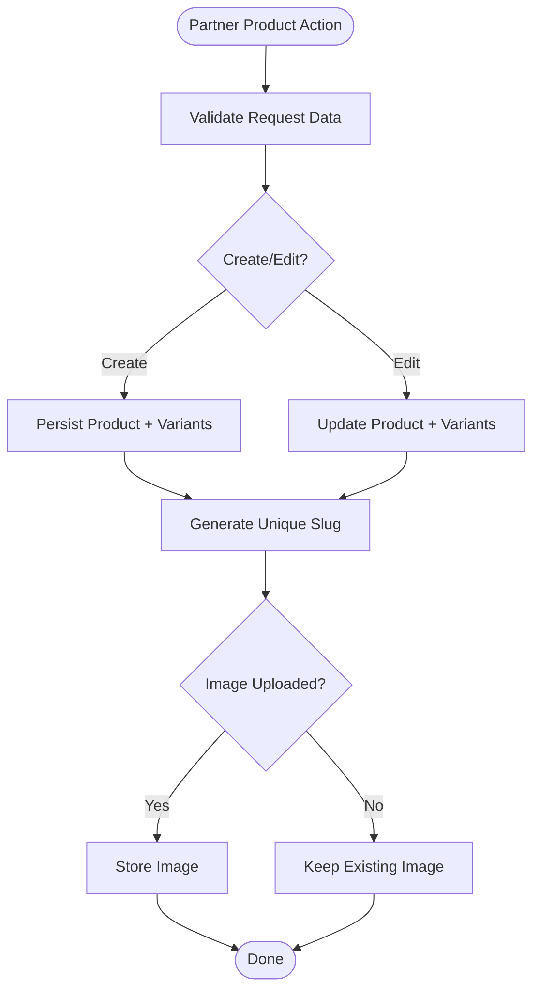
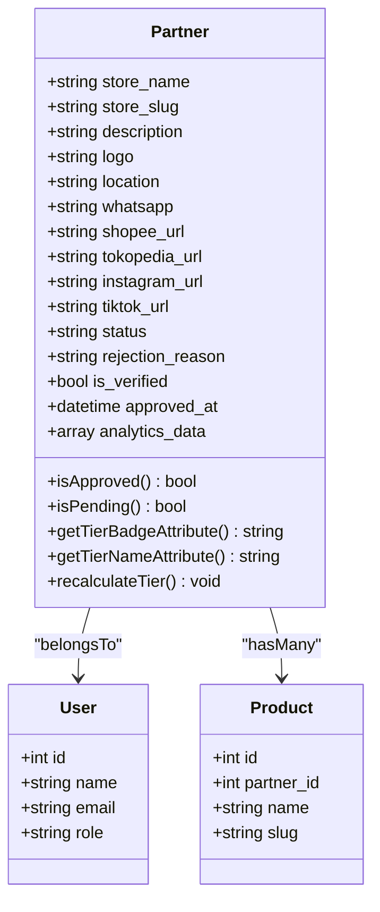
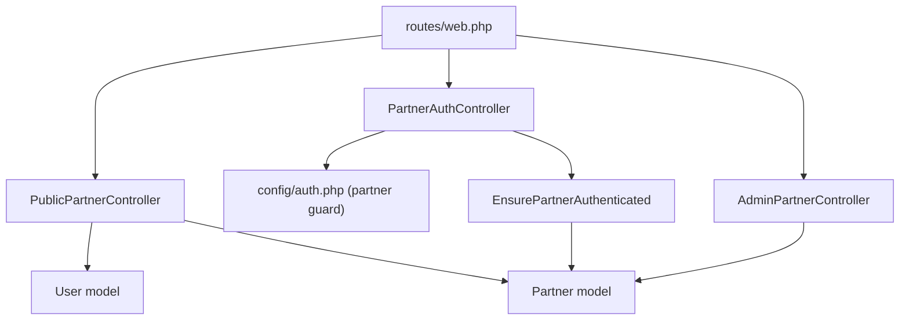

# Partner Onboarding and Registration

<cite>
**Referenced Files in This Document**
- [routes/web.php](file://routes/web.php)
- [config/auth.php](file://config/auth.php)
- [app/Http/Middleware/EnsurePartnerAuthenticated.php](file://app/Http/Middleware/EnsurePartnerAuthenticated.php)
- [app/Http/Controllers/PublicPartnerController.php](file://app/Http/Controllers/PublicPartnerController.php)
- [resources/views/public/partners/register.blade.php](file://resources/views/public/partners/register.blade.php)
- [resources/views/public/partners/register-success.blade.php](file://resources/views/public/partners/register-success.blade.php)
- [app/Http/Controllers/Partner/PartnerAuthController.php](file://app/Http/Controllers/Partner/PartnerAuthController.php)
- [resources/views/partner/dashboard.blade.php](file://resources/views/partner/dashboard.blade.php)
- [app/Models/Partner.php](file://app/Models/Partner.php)
- [database/migrations/2026_05_24_093205_create_partners_table.php](file://database/migrations/2026_05_24_093205_create_partners_table.php)
- [app/Http/Controllers/AdminPartnerController.php](file://app/Http/Controllers/AdminPartnerController.php)
- [app/Http/Controllers/Partner/PartnerProfileController.php](file://app/Http/Controllers/Partner/PartnerProfileController.php)
- [resources/views/partner/profile.blade.php](file://resources/views/partner/profile.blade.php)
- [app/Http/Controllers/Partner/PartnerProductController.php](file://app/Http/Controllers/Partner/PartnerProductController.php)
</cite>

## Table of Contents
1. [Introduction](#introduction)
2. [Project Structure](#project-structure)
3. [Core Components](#core-components)
4. [Architecture Overview](#architecture-overview)
5. [Detailed Component Analysis](#detailed-component-analysis)
6. [Dependency Analysis](#dependency-analysis)
7. [Performance Considerations](#performance-considerations)
8. [Troubleshooting Guide](#troubleshooting-guide)
9. [Conclusion](#conclusion)
10. [Appendices](#appendices)

## Introduction
This document explains the complete partner onboarding and registration process for the platform. It covers the end-to-end journey from initial sign-up, business verification, admin approval, to partner login and dashboard access. It also documents authentication mechanisms, session management, verification steps, approval workflows, dashboard access controls, role-based permissions, security measures, and onboarding checklists. Step-by-step guides and troubleshooting tips are included to support new partners and administrators.

## Project Structure
The onboarding flow spans public-facing registration pages, backend controllers, authentication guards, middleware, and admin workflows. Routes define entry points for public registration and partner portal access. Authentication is handled via a dedicated partner guard with session-based storage. Admin controllers manage verification and approval.

**Diagram sources**
- [routes/web.php:68-74](file://routes/web.php#L68-L74)
- [routes/web.php:118-167](file://routes/web.php#L118-L167)
- [config/auth.php:38-47](file://config/auth.php#L38-L47)
- [app/Http/Middleware/EnsurePartnerAuthenticated.php:11-26](file://app/Http/Middleware/EnsurePartnerAuthenticated.php#L11-L26)
- [app/Http/Controllers/PublicPartnerController.php:76-116](file://app/Http/Controllers/PublicPartnerController.php#L76-L116)
- [app/Http/Controllers/Partner/PartnerAuthController.php:13-58](file://app/Http/Controllers/Partner/PartnerAuthController.php#L13-L58)
- [app/Http/Controllers/AdminPartnerController.php:15-75](file://app/Http/Controllers/AdminPartnerController.php#L15-L75)
- [app/Models/Partner.php:8-36](file://app/Models/Partner.php#L8-L36)

**Section sources**
- [routes/web.php:68-74](file://routes/web.php#L68-L74)
- [routes/web.php:118-167](file://routes/web.php#L118-L167)
- [config/auth.php:38-47](file://config/auth.php#L38-L47)

## Core Components
- Public registration page and controller: Collects partner store and owner details, creates a user with role “partner” and a pending partner record, then redirects to a success page.
- Partner authentication controller: Handles login, logout, and session regeneration; enforces approval checks and guard-based authentication.
- Middleware: Ensures only approved partners can access partner routes.
- Admin partner controller: Manages approval, rejection, suspension, and verification toggles.
- Partner model: Defines attributes, relationships, and helper methods for status, tiers, and analytics.
- Views: Registration form, success page, dashboard, and profile pages.

**Section sources**
- [app/Http/Controllers/PublicPartnerController.php:76-116](file://app/Http/Controllers/PublicPartnerController.php#L76-L116)
- [app/Http/Controllers/Partner/PartnerAuthController.php:13-58](file://app/Http/Controllers/Partner/PartnerAuthController.php#L13-L58)
- [app/Http/Middleware/EnsurePartnerAuthenticated.php:11-26](file://app/Http/Middleware/EnsurePartnerAuthenticated.php#L11-L26)
- [app/Http/Controllers/AdminPartnerController.php:15-75](file://app/Http/Controllers/AdminPartnerController.php#L15-L75)
- [app/Models/Partner.php:8-36](file://app/Models/Partner.php#L8-L36)
- [resources/views/public/partners/register.blade.php:61-112](file://resources/views/public/partners/register.blade.php#L61-L112)
- [resources/views/public/partners/register-success.blade.php:28-32](file://resources/views/public/partners/register-success.blade.php#L28-L32)
- [resources/views/partner/dashboard.blade.php:52-67](file://resources/views/partner/dashboard.blade.php#L52-L67)
- [resources/views/partner/profile.blade.php:64-103](file://resources/views/partner/profile.blade.php#L64-L103)

## Architecture Overview
The system uses a dedicated authentication guard for partners (“partner”) with session storage. Public registration creates both a User and a Partner record. Admin approval sets the Partner status to “approved,” enabling partner portal access. Middleware enforces approval checks on protected routes.

**Diagram sources**
- [routes/web.php:68-74](file://routes/web.php#L68-L74)
- [routes/web.php:118-122](file://routes/web.php#L118-L122)
- [app/Http/Controllers/PublicPartnerController.php:76-116](file://app/Http/Controllers/PublicPartnerController.php#L76-L116)
- [app/Http/Controllers/AdminPartnerController.php:30-41](file://app/Http/Controllers/AdminPartnerController.php#L30-L41)
- [app/Http/Controllers/Partner/PartnerAuthController.php:19-50](file://app/Http/Controllers/Partner/PartnerAuthController.php#L19-L50)

## Detailed Component Analysis

### Public Registration Workflow
- Entry point: GET /daftar-mitra renders the registration form.
- Submission: POST /daftar-mitra validates inputs, ensures unique email, hashes password, creates a User with role “partner,” creates a Partner record with status “pending,” assigns the Partner ID to the User, and redirects to a success page.
- Success page: Confirms submission and outlines next steps.

**Diagram sources**
- [routes/web.php:71-73](file://routes/web.php#L71-L73)
- [app/Http/Controllers/PublicPartnerController.php:76-116](file://app/Http/Controllers/PublicPartnerController.php#L76-L116)

**Section sources**
- [routes/web.php:71-73](file://routes/web.php#L71-L73)
- [resources/views/public/partners/register.blade.php:61-112](file://resources/views/public/partners/register.blade.php#L61-L112)
- [app/Http/Controllers/PublicPartnerController.php:76-116](file://app/Http/Controllers/PublicPartnerController.php#L76-L116)
- [resources/views/public/partners/register-success.blade.php:28-32](file://resources/views/public/partners/register-success.blade.php#L28-L32)

### Partner Verification and Approval
- Admin manages approvals via routes under /admin. The AdminPartnerController supports approve, reject, suspend, and verified toggles.
- Approve sets status to “approved” and clears rejection reason.
- Reject requires a reason and sets status to “rejected.”
- Suspend allows optional reason and sets status to “suspended.”

**Diagram sources**
- [app/Http/Controllers/AdminPartnerController.php:30-74](file://app/Http/Controllers/AdminPartnerController.php#L30-L74)

**Section sources**
- [app/Http/Controllers/AdminPartnerController.php:15-75](file://app/Http/Controllers/AdminPartnerController.php#L15-L75)

### Partner Authentication and Session Management
- Guard: A dedicated “partner” guard is configured for session-based authentication.
- Login: Validates credentials against the “partner” guard. After successful attempt, verifies the associated Partner exists and is approved; otherwise logs out and returns errors.
- Logout: Clears session and CSRF token, then redirects to login.
- Middleware: Ensures requests to partner routes are authenticated and that the Partner is approved; otherwise redirects to login.

**Diagram sources**
- [config/auth.php:38-47](file://config/auth.php#L38-L47)
- [app/Http/Controllers/Partner/PartnerAuthController.php:19-50](file://app/Http/Controllers/Partner/PartnerAuthController.php#L19-L50)
- [app/Http/Middleware/EnsurePartnerAuthenticated.php:11-26](file://app/Http/Middleware/EnsurePartnerAuthenticated.php#L11-L26)
- [routes/web.php:118-122](file://routes/web.php#L118-L122)
- [routes/web.php:124-166](file://routes/web.php#L124-L166)

**Section sources**
- [config/auth.php:38-47](file://config/auth.php#L38-L47)
- [app/Http/Controllers/Partner/PartnerAuthController.php:13-58](file://app/Http/Controllers/Partner/PartnerAuthController.php#L13-L58)
- [app/Http/Middleware/EnsurePartnerAuthenticated.php:11-26](file://app/Http/Middleware/EnsurePartnerAuthenticated.php#L11-L26)

### Partner Dashboard Access Controls and Permissions
- Middleware: The “partner.auth” group protects all partner routes. Requests are redirected to login if not authenticated or if the Partner is not approved.
- Dashboard: Displays metrics (total products, active/sold counts, ratings, recent products) derived from Partner and Product relations.
- Navigation: Sidebar links to products, analytics, questions, notifications, and profile; logout via CSRF-protected form.

**Diagram sources**
- [app/Http/Middleware/EnsurePartnerAuthenticated.php:11-26](file://app/Http/Middleware/EnsurePartnerAuthenticated.php#L11-L26)
- [resources/views/partner/dashboard.blade.php:52-67](file://resources/views/partner/dashboard.blade.php#L52-L67)
- [routes/web.php:124-166](file://routes/web.php#L124-L166)

**Section sources**
- [app/Http/Middleware/EnsurePartnerAuthenticated.php:11-26](file://app/Http/Middleware/EnsurePartnerAuthenticated.php#L11-L26)
- [resources/views/partner/dashboard.blade.php:80-131](file://resources/views/partner/dashboard.blade.php#L80-L131)
- [routes/web.php:124-166](file://routes/web.php#L124-L166)

### Partner Profile Management
- Edit profile page displays current store info and social links.
- Update endpoint validates inputs, optionally replaces logo image, persists changes, and returns success feedback.

**Diagram sources**
- [routes/web.php:144-146](file://routes/web.php#L144-L146)
- [app/Http/Controllers/Partner/PartnerProfileController.php:20-47](file://app/Http/Controllers/Partner/PartnerProfileController.php#L20-L47)
- [resources/views/partner/profile.blade.php:64-103](file://resources/views/partner/profile.blade.php#L64-L103)

**Section sources**
- [routes/web.php:144-146](file://routes/web.php#L144-L146)
- [app/Http/Controllers/Partner/PartnerProfileController.php:13-47](file://app/Http/Controllers/Partner/PartnerProfileController.php#L13-L47)
- [resources/views/partner/profile.blade.php:64-103](file://resources/views/partner/profile.blade.php#L64-L103)

### Product Management (for completeness)
- Index, create, store, edit, update, destroy endpoints are protected by the partner.auth middleware.
- Validation enforces product metadata, images, variants, and SEO fields.
- Unique slugs are generated for products.

**Diagram sources**
- [app/Http/Controllers/Partner/PartnerProductController.php:42-133](file://app/Http/Controllers/Partner/PartnerProductController.php#L42-L133)
- [routes/web.php:127-138](file://routes/web.php#L127-L138)

**Section sources**
- [app/Http/Controllers/Partner/PartnerProductController.php:21-133](file://app/Http/Controllers/Partner/PartnerProductController.php#L21-L133)
- [routes/web.php:127-138](file://routes/web.php#L127-L138)

### Data Model: Partner
- Attributes include store info, contact links, status, verification flag, timestamps, and analytics data.
- Helper methods: average rating, review count, approval checks, tier helpers, and automatic tier recalculation.

**Diagram sources**
- [app/Models/Partner.php:10-36](file://app/Models/Partner.php#L10-L36)
- [app/Models/Partner.php:72-121](file://app/Models/Partner.php#L72-L121)
- [database/migrations/2026_05_24_093205_create_partners_table.php:11-30](file://database/migrations/2026_05_24_093205_create_partners_table.php#L11-L30)

**Section sources**
- [app/Models/Partner.php:8-122](file://app/Models/Partner.php#L8-L122)
- [database/migrations/2026_05_24_093205_create_partners_table.php:9-30](file://database/migrations/2026_05_24_093205_create_partners_table.php#L9-L30)

## Dependency Analysis
- Routes depend on controllers for registration, authentication, and partner/admin actions.
- PartnerAuthController depends on the “partner” guard and Partner model for approval checks.
- PublicPartnerController depends on User and Partner models to create records.
- AdminPartnerController updates Partner status and verification flags.
- Middleware depends on the “partner” guard and Partner model to enforce access.

**Diagram sources**
- [routes/web.php:68-74](file://routes/web.php#L68-L74)
- [routes/web.php:118-167](file://routes/web.php#L118-L167)
- [config/auth.php:38-47](file://config/auth.php#L38-L47)
- [app/Http/Controllers/Partner/PartnerAuthController.php:19-50](file://app/Http/Controllers/Partner/PartnerAuthController.php#L19-L50)
- [app/Http/Middleware/EnsurePartnerAuthenticated.php:11-26](file://app/Http/Middleware/EnsurePartnerAuthenticated.php#L11-L26)
- [app/Http/Controllers/PublicPartnerController.php:76-116](file://app/Http/Controllers/PublicPartnerController.php#L76-L116)
- [app/Http/Controllers/AdminPartnerController.php:30-74](file://app/Http/Controllers/AdminPartnerController.php#L30-L74)

**Section sources**
- [routes/web.php:68-74](file://routes/web.php#L68-L74)
- [routes/web.php:118-167](file://routes/web.php#L118-L167)
- [config/auth.php:38-47](file://config/auth.php#L38-L47)
- [app/Http/Controllers/Partner/PartnerAuthController.php:19-50](file://app/Http/Controllers/Partner/PartnerAuthController.php#L19-L50)
- [app/Http/Middleware/EnsurePartnerAuthenticated.php:11-26](file://app/Http/Middleware/EnsurePartnerAuthenticated.php#L11-L26)
- [app/Http/Controllers/PublicPartnerController.php:76-116](file://app/Http/Controllers/PublicPartnerController.php#L76-L116)
- [app/Http/Controllers/AdminPartnerController.php:30-74](file://app/Http/Controllers/AdminPartnerController.php#L30-L74)

## Performance Considerations
- Use pagination for partner listings in admin and product lists to limit memory usage.
- Minimize N+1 queries by eager-loading relationships (e.g., products with variants).
- Cache frequently accessed metrics (e.g., review counts) when appropriate.
- Optimize image uploads by validating sizes and formats early to reduce storage overhead.

## Troubleshooting Guide
Common issues and resolutions:
- Login fails with invalid credentials:
  - Cause: Incorrect email/password.
  - Resolution: Prompt user to re-enter credentials; ensure CAPTCHA or rate limiting is enforced server-side.
- Account not recognized as partner:
  - Cause: User created but Partner record missing or not linked.
  - Resolution: Verify User.role is “partner” and User.partner_id matches Partner.id.
- Login blocked due to non-approved status:
  - Cause: Partner.status not “approved.”
  - Resolution: Admin must approve the Partner; inform user that verification takes up to 24 hours.
- Suspended or rejected account:
  - Cause: Partner.status is “suspended” or “rejected.”
  - Resolution: Contact admin for details; provide rejection reason if applicable.
- Logo replacement issues:
  - Cause: Invalid file type or exceeding max size.
  - Resolution: Confirm image constraints and retry upload.
- Dashboard access denied:
  - Cause: Missing or expired session; or unapproved Partner.
  - Resolution: Re-authenticate; ensure middleware protection is intact.

**Section sources**
- [app/Http/Controllers/Partner/PartnerAuthController.php:26-43](file://app/Http/Controllers/Partner/PartnerAuthController.php#L26-L43)
- [app/Http/Middleware/EnsurePartnerAuthenticated.php:13-23](file://app/Http/Middleware/EnsurePartnerAuthenticated.php#L13-L23)
- [app/Http/Controllers/Partner/PartnerProfileController.php:36-41](file://app/Http/Controllers/Partner/PartnerProfileController.php#L36-L41)

## Conclusion
The partner onboarding pipeline integrates a clean public registration flow, robust admin approval workflows, and secure session-based authentication with middleware enforcement. The dashboard and profile management provide practical tools for partners to manage their stores. Clear status indicators and admin controls ensure transparency and operational efficiency.

## Appendices

### Step-by-Step Guides

- New Partner Registration
  1. Visit the public registration page.
  2. Fill in store and owner details, including WhatsApp number and optional social URLs.
  3. Submit the form; the system creates a User with role “partner” and a Partner record with status “pending.”
  4. Confirm submission on the success page; expect admin review within 24 hours.

- Verification and Approval
  1. Admin reviews pending registrations.
  2. Approve to set status to “approved”; optionally reject or suspend with reasons.
  3. Approved Partners receive notifications (future) and can log in.

- Login and Session Management
  1. Navigate to the partner login page.
  2. Enter email and password; ensure account is approved.
  3. On successful login, a new session is regenerated; logout invalidates session and CSRF token.

- Dashboard Access and Navigation
  1. After approval, access the dashboard to view metrics and recent products.
  2. Use sidebar navigation to manage products, analytics, questions, notifications, and profile.

- Profile Completion Checklist
  - Provide store name, description, location, and WhatsApp.
  - Add optional social links (Shopee, Tokopedia, Instagram, TikTok).
  - Upload a logo if desired.
  - Keep information accurate and up to date.

- Product Setup Checklist
  - Name, brand, product type, color/style, price, size, condition, description, story.
  - Optional: image upload or URL, variants, size chart, SEO fields.
  - Ensure slug uniqueness; activate/deactivate as needed.

- Onboarding Support
  - For registration questions, confirm email uniqueness and password strength.
  - For approval delays, explain the 24-hour review window.
  - For login issues, verify account status and session validity.

**Section sources**
- [routes/web.php:71-73](file://routes/web.php#L71-L73)
- [resources/views/public/partners/register.blade.php:61-112](file://resources/views/public/partners/register.blade.php#L61-L112)
- [resources/views/public/partners/register-success.blade.php:28-32](file://resources/views/public/partners/register-success.blade.php#L28-L32)
- [app/Http/Controllers/AdminPartnerController.php:30-74](file://app/Http/Controllers/AdminPartnerController.php#L30-L74)
- [app/Http/Controllers/Partner/PartnerAuthController.php:19-50](file://app/Http/Controllers/Partner/PartnerAuthController.php#L19-L50)
- [resources/views/partner/dashboard.blade.php:52-67](file://resources/views/partner/dashboard.blade.php#L52-L67)
- [resources/views/partner/profile.blade.php:64-103](file://resources/views/partner/profile.blade.php#L64-L103)
- [app/Http/Controllers/Partner/PartnerProductController.php:42-133](file://app/Http/Controllers/Partner/PartnerProductController.php#L42-L133)