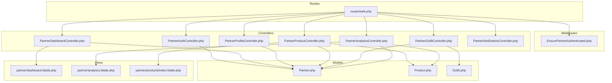
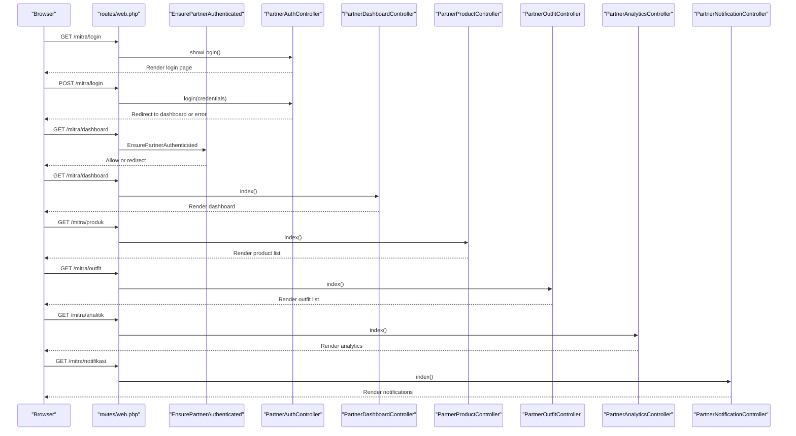
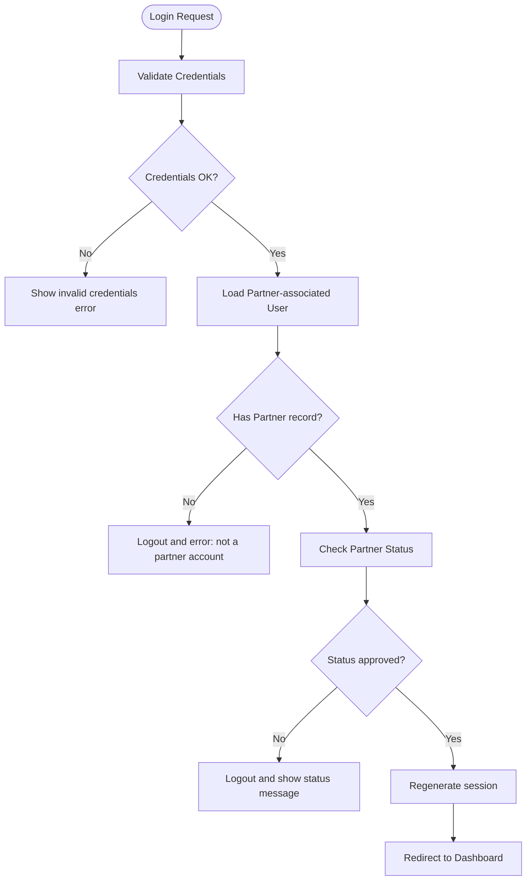
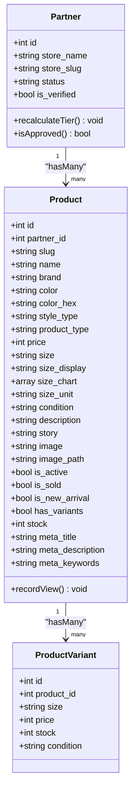
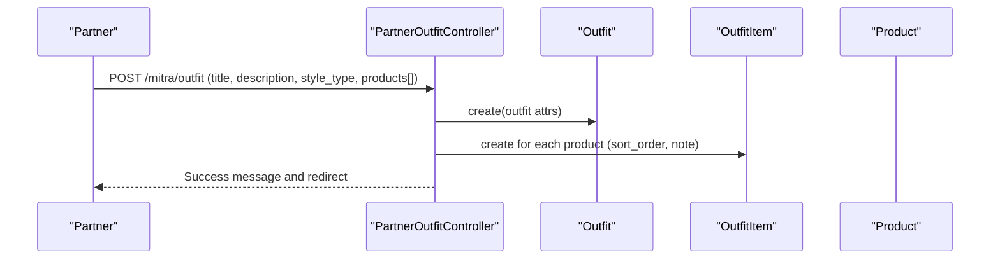
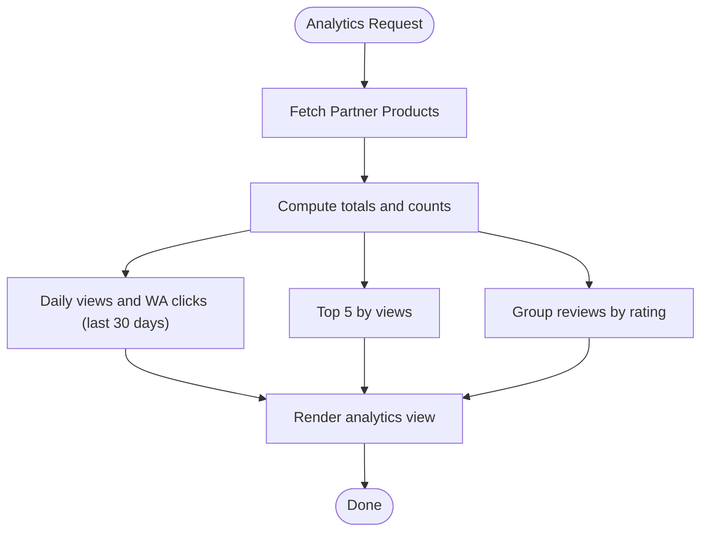
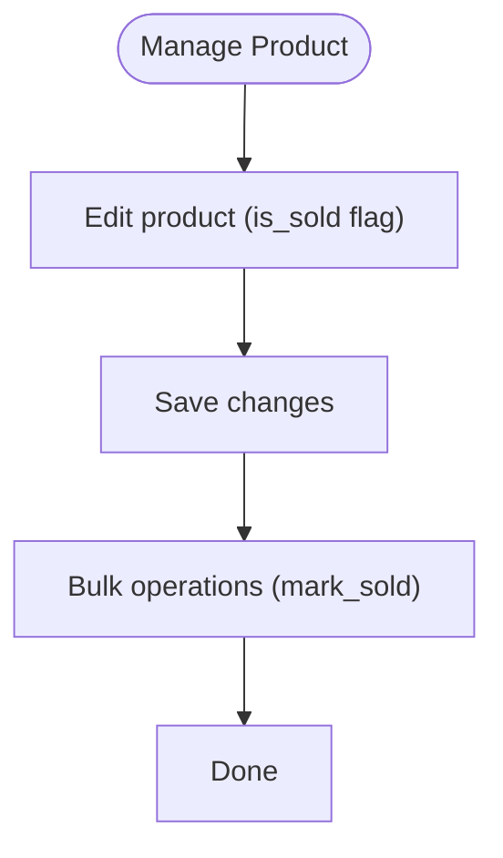
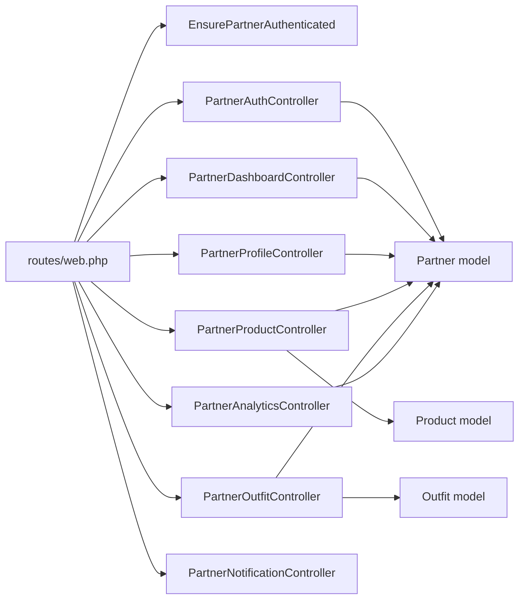

# Partner Store Management

<cite>
**Referenced Files in This Document**
- [routes/web.php](file://routes/web.php)
- [app/Http/Middleware/EnsurePartnerAuthenticated.php](file://app/Http/Middleware/EnsurePartnerAuthenticated.php)
- [app/Http/Controllers/Partner/PartnerAuthController.php](file://app/Http/Controllers/Partner/PartnerAuthController.php)
- [app/Http/Controllers/Partner/PartnerDashboardController.php](file://app/Http/Controllers/Partner/PartnerDashboardController.php)
- [app/Http/Controllers/Partner/PartnerProfileController.php](file://app/Http/Controllers/Partner/PartnerProfileController.php)
- [app/Http/Controllers/Partner/PartnerProductController.php](file://app/Http/Controllers/Partner/PartnerProductController.php)
- [app/Http/Controllers/Partner/PartnerOutfitController.php](file://app/Http/Controllers/Partner/PartnerOutfitController.php)
- [app/Http/Controllers/Partner/PartnerAnalyticsController.php](file://app/Http/Controllers/Partner/PartnerAnalyticsController.php)
- [app/Http/Controllers/Partner/PartnerNotificationController.php](file://app/Http/Controllers/Partner/PartnerNotificationController.php)
- [app/Models/Partner.php](file://app/Models/Partner.php)
- [app/Models/Product.php](file://app/Models/Product.php)
- [app/Models/Outfit.php](file://app/Models/Outfit.php)
- [resources/views/partner/dashboard.blade.php](file://resources/views/partner/dashboard.blade.php)
- [resources/views/partner/analytics.blade.php](file://resources/views/partner/analytics.blade.php)
- [resources/views/partner/products/index.blade.php](file://resources/views/partner/products/index.blade.php)
</cite>

## Table of Contents
1. [Introduction](#introduction)
2. [Project Structure](#project-structure)
3. [Core Components](#core-components)
4. [Architecture Overview](#architecture-overview)
5. [Detailed Component Analysis](#detailed-component-analysis)
6. [Dependency Analysis](#dependency-analysis)
7. [Performance Considerations](#performance-considerations)
8. [Troubleshooting Guide](#troubleshooting-guide)
9. [Conclusion](#conclusion)
10. [Appendices](#appendices)

## Introduction
This document explains the partner store management functionality of the platform. It covers partner registration and onboarding, profile and store setup, product listing and inventory controls, order fulfillment workflows, analytics and reporting, lookbook curation via outfits, content moderation, communication and notifications, and administrative oversight. It also provides practical guidance for dashboard usage, analytics interpretation, and store management best practices.

## Project Structure
The partner domain is organized under dedicated controllers, models, and Blade templates. Routes are grouped under a “mitra” namespace with a partner authentication guard and middleware protecting access. Views provide partner-specific dashboards, analytics, product listings, and outfit management pages.

**Diagram sources**
- [routes/web.php:118-167](file://routes/web.php#L118-L167)
- [app/Http/Middleware/EnsurePartnerAuthenticated.php:1-28](file://app/Http/Middleware/EnsurePartnerAuthenticated.php#L1-L28)
- [app/Http/Controllers/Partner/PartnerAuthController.php:1-60](file://app/Http/Controllers/Partner/PartnerAuthController.php#L1-L60)
- [app/Http/Controllers/Partner/PartnerDashboardController.php:1-26](file://app/Http/Controllers/Partner/PartnerDashboardController.php#L1-L26)
- [app/Http/Controllers/Partner/PartnerProfileController.php:1-49](file://app/Http/Controllers/Partner/PartnerProfileController.php#L1-L49)
- [app/Http/Controllers/Partner/PartnerProductController.php:1-337](file://app/Http/Controllers/Partner/PartnerProductController.php#L1-L337)
- [app/Http/Controllers/Partner/PartnerOutfitController.php:1-92](file://app/Http/Controllers/Partner/PartnerOutfitController.php#L1-L92)
- [app/Http/Controllers/Partner/PartnerAnalyticsController.php:1-60](file://app/Http/Controllers/Partner/PartnerAnalyticsController.php#L1-L60)
- [app/Http/Controllers/Partner/PartnerNotificationController.php:1-21](file://app/Http/Controllers/Partner/PartnerNotificationController.php#L1-L21)
- [app/Models/Partner.php:1-123](file://app/Models/Partner.php#L1-L123)
- [app/Models/Product.php:1-132](file://app/Models/Product.php#L1-L132)
- [app/Models/Outfit.php:1-60](file://app/Models/Outfit.php#L1-L60)
- [resources/views/partner/dashboard.blade.php:1-135](file://resources/views/partner/dashboard.blade.php#L1-L135)
- [resources/views/partner/analytics.blade.php:1-149](file://resources/views/partner/analytics.blade.php#L1-L149)
- [resources/views/partner/products/index.blade.php:1-231](file://resources/views/partner/products/index.blade.php#L1-L231)

**Section sources**
- [routes/web.php:118-167](file://routes/web.php#L118-L167)

## Core Components
- Authentication and Authorization
  - Login/logout handling and approval checks for partners.
  - Middleware enforcing partner authentication and approval status.
- Dashboard
  - Overview of store health, recent products, and quick actions.
- Profile and Store Setup
  - Edit store name, description, location, social links, and logo.
- Products and Inventory
  - CRUD for products, variants, size charts, SEO metadata, and bulk operations.
- Outfits and Lookbook
  - Create curated looks from multiple products; manage look visibility.
- Analytics and Reporting
  - Store-level metrics, top products, review distribution, daily views.
- Notifications
  - Partner-side notifications linked to the associated user.

**Section sources**
- [app/Http/Controllers/Partner/PartnerAuthController.php:13-60](file://app/Http/Controllers/Partner/PartnerAuthController.php#L13-L60)
- [app/Http/Middleware/EnsurePartnerAuthenticated.php:11-26](file://app/Http/Middleware/EnsurePartnerAuthenticated.php#L11-L26)
- [app/Http/Controllers/Partner/PartnerDashboardController.php:10-24](file://app/Http/Controllers/Partner/PartnerDashboardController.php#L10-L24)
- [app/Http/Controllers/Partner/PartnerProfileController.php:13-47](file://app/Http/Controllers/Partner/PartnerProfileController.php#L13-L47)
- [app/Http/Controllers/Partner/PartnerProductController.php:21-133](file://app/Http/Controllers/Partner/PartnerProductController.php#L21-L133)
- [app/Http/Controllers/Partner/PartnerOutfitController.php:20-82](file://app/Http/Controllers/Partner/PartnerOutfitController.php#L20-L82)
- [app/Http/Controllers/Partner/PartnerAnalyticsController.php:17-58](file://app/Http/Controllers/Partner/PartnerAnalyticsController.php#L17-L58)
- [app/Http/Controllers/Partner/PartnerNotificationController.php:9-19](file://app/Http/Controllers/Partner/PartnerNotificationController.php#L9-L19)

## Architecture Overview
The partner portal is a guarded area behind a dedicated authentication flow and middleware. Controllers orchestrate requests, models encapsulate persistence and derived attributes, and views render partner dashboards and forms.

**Diagram sources**
- [routes/web.php:118-167](file://routes/web.php#L118-L167)
- [app/Http/Middleware/EnsurePartnerAuthenticated.php:11-26](file://app/Http/Middleware/EnsurePartnerAuthenticated.php#L11-L26)
- [app/Http/Controllers/Partner/PartnerAuthController.php:19-50](file://app/Http/Controllers/Partner/PartnerAuthController.php#L19-L50)
- [app/Http/Controllers/Partner/PartnerDashboardController.php:10-24](file://app/Http/Controllers/Partner/PartnerDashboardController.php#L10-L24)
- [app/Http/Controllers/Partner/PartnerProductController.php:21-29](file://app/Http/Controllers/Partner/PartnerProductController.php#L21-L29)
- [app/Http/Controllers/Partner/PartnerOutfitController.php:20-31](file://app/Http/Controllers/Partner/PartnerOutfitController.php#L20-L31)
- [app/Http/Controllers/Partner/PartnerAnalyticsController.php:17-58](file://app/Http/Controllers/Partner/PartnerAnalyticsController.php#L17-L58)
- [app/Http/Controllers/Partner/PartnerNotificationController.php:9-19](file://app/Http/Controllers/Partner/PartnerNotificationController.php#L9-L19)

## Detailed Component Analysis

### Authentication and Onboarding
- Login validates credentials and checks partner association and approval status. Pending, rejected, or suspended accounts receive appropriate messages and are logged out.
- Middleware ensures only approved partners can access protected routes.

**Diagram sources**
- [app/Http/Controllers/Partner/PartnerAuthController.php:19-50](file://app/Http/Controllers/Partner/PartnerAuthController.php#L19-L50)
- [app/Http/Middleware/EnsurePartnerAuthenticated.php:17-23](file://app/Http/Middleware/EnsurePartnerAuthenticated.php#L17-L23)

**Section sources**
- [app/Http/Controllers/Partner/PartnerAuthController.php:19-50](file://app/Http/Controllers/Partner/PartnerAuthController.php#L19-L50)
- [app/Http/Middleware/EnsurePartnerAuthenticated.php:11-26](file://app/Http/Middleware/EnsurePartnerAuthenticated.php#L11-L26)

### Dashboard
- Displays counts for total products, active products, sold products, review count, and average rating.
- Provides quick navigation to product management, analytics, questions, notifications, and store preview.

**Section sources**
- [app/Http/Controllers/Partner/PartnerDashboardController.php:10-24](file://app/Http/Controllers/Partner/PartnerDashboardController.php#L10-L24)
- [resources/views/partner/dashboard.blade.php:80-131](file://resources/views/partner/dashboard.blade.php#L80-L131)

### Profile and Store Setup
- Editable fields include store name, description, location, WhatsApp contact, marketplace URLs, and logo upload.
- Logo handling deletes previous images (unless external URL) and stores new uploads under a partner-scoped directory.

**Section sources**
- [app/Http/Controllers/Partner/PartnerProfileController.php:13-47](file://app/Http/Controllers/Partner/PartnerProfileController.php#L13-L47)

### Products and Inventory Control
- Listing management:
  - Index lists products with variants count and status badges.
  - Create/edit forms support product metadata, branding, pricing, condition, story, images (URL or upload), marketplace links, activity flags, new-arrival flag, and SEO fields.
- Variants:
  - Optional variant system with per-size price, stock, and condition.
  - Size chart support with dynamic rows and unit selection.
- Bulk operations:
  - Bulk activate/deactivate/mark sold/delete/export.
- Deletion:
  - Removes product image from storage when present.

**Diagram sources**
- [app/Models/Partner.php:33-43](file://app/Models/Partner.php#L33-L43)
- [app/Models/Product.php:36-79](file://app/Models/Product.php#L36-L79)
- [app/Models/Product.php:56-64](file://app/Models/Product.php#L56-L64)

**Section sources**
- [app/Http/Controllers/Partner/PartnerProductController.php:21-133](file://app/Http/Controllers/Partner/PartnerProductController.php#L21-L133)
- [app/Http/Controllers/Partner/PartnerProductController.php:135-245](file://app/Http/Controllers/Partner/PartnerProductController.php#L135-L245)
- [app/Http/Controllers/Partner/PartnerProductController.php:247-259](file://app/Http/Controllers/Partner/PartnerProductController.php#L247-L259)
- [app/Http/Controllers/Partner/PartnerProductController.php:293-335](file://app/Http/Controllers/Partner/PartnerProductController.php#L293-L335)
- [resources/views/partner/products/index.blade.php:85-155](file://resources/views/partner/products/index.blade.php#L85-L155)

### Outfits and Lookbook Curation
- Outfit creation aggregates up to six products from approved partners’ active, unsold inventory.
- Each outfit item includes sort order and optional notes.
- Outfit deletion cleans up items before removing the outfit.

**Diagram sources**
- [app/Http/Controllers/Partner/PartnerOutfitController.php:49-82](file://app/Http/Controllers/Partner/PartnerOutfitController.php#L49-L82)
- [app/Models/Outfit.php:28-48](file://app/Models/Outfit.php#L28-L48)

**Section sources**
- [app/Http/Controllers/Partner/PartnerOutfitController.php:20-82](file://app/Http/Controllers/Partner/PartnerOutfitController.php#L20-L82)
- [app/Models/Outfit.php:19-59](file://app/Models/Outfit.php#L19-L59)

### Analytics and Reporting
- Metrics include total views, WhatsApp clicks, wishlist count, follower count, average rating, and top products.
- Daily breakdown aggregates last 30 days of views and WA clicks per product.
- Tier badge and name are computed from performance indicators.

**Diagram sources**
- [app/Http/Controllers/Partner/PartnerAnalyticsController.php:17-58](file://app/Http/Controllers/Partner/PartnerAnalyticsController.php#L17-L58)

**Section sources**
- [app/Http/Controllers/Partner/PartnerAnalyticsController.php:17-58](file://app/Http/Controllers/Partner/PartnerAnalyticsController.php#L17-L58)
- [resources/views/partner/analytics.blade.php:75-145](file://resources/views/partner/analytics.blade.php#L75-L145)

### Notifications
- Partner notifications are bound to the associated user’s notification records and paginated.

**Section sources**
- [app/Http/Controllers/Partner/PartnerNotificationController.php:9-19](file://app/Http/Controllers/Partner/PartnerNotificationController.php#L9-L19)

### Order Fulfillment Workflow
- Sold status toggling is supported via product update and bulk operations.
- Marketplace links enable buyers to purchase externally.

**Diagram sources**
- [app/Http/Controllers/Partner/PartnerProductController.php:149-245](file://app/Http/Controllers/Partner/PartnerProductController.php#L149-L245)
- [app/Http/Controllers/Partner/PartnerProductController.php:135-147](file://app/Http/Controllers/Partner/PartnerProductController.php#L135-L147)

**Section sources**
- [app/Http/Controllers/Partner/PartnerProductController.php:149-245](file://app/Http/Controllers/Partner/PartnerProductController.php#L149-L245)

### Content Moderation
- Admin manages products, reviews, reports, and curated outfits.
- Approve/reject/suspend actions for partners and products are exposed in the admin area.

**Section sources**
- [routes/web.php:178-209](file://routes/web.php#L178-L209)

### Partner Communication Tools
- Questions from members are routed to partner-managed endpoints for answering.
- Notifications consolidate communications for partners.

**Section sources**
- [routes/web.php:158-160](file://routes/web.php#L158-L160)
- [app/Http/Controllers/Partner/PartnerNotificationController.php:9-19](file://app/Http/Controllers/Partner/PartnerNotificationController.php#L9-L19)

### Customer Service Integration
- No dedicated customer service controller is present in the partner domain; customer interactions appear to be handled via questions and notifications.

**Section sources**
- [routes/web.php:158-160](file://routes/web.php#L158-L160)

### API Access and Data Synchronization
- No API routes are defined in the provided routes file for the partner domain. Integration would require explicit API endpoints.

**Section sources**
- [routes/api.php](file://routes/api.php)

## Dependency Analysis
- Controllers depend on models for persistence and derived attributes.
- Middleware enforces authentication and approval gating.
- Routes define the surface area for partner operations.

**Diagram sources**
- [routes/web.php:118-167](file://routes/web.php#L118-L167)
- [app/Http/Middleware/EnsurePartnerAuthenticated.php:11-26](file://app/Http/Middleware/EnsurePartnerAuthenticated.php#L11-L26)
- [app/Http/Controllers/Partner/PartnerAuthController.php:19-50](file://app/Http/Controllers/Partner/PartnerAuthController.php#L19-L50)
- [app/Http/Controllers/Partner/PartnerDashboardController.php:10-24](file://app/Http/Controllers/Partner/PartnerDashboardController.php#L10-L24)
- [app/Http/Controllers/Partner/PartnerProfileController.php:13-47](file://app/Http/Controllers/Partner/PartnerProfileController.php#L13-L47)
- [app/Http/Controllers/Partner/PartnerProductController.php:21-133](file://app/Http/Controllers/Partner/PartnerProductController.php#L21-L133)
- [app/Http/Controllers/Partner/PartnerOutfitController.php:20-82](file://app/Http/Controllers/Partner/PartnerOutfitController.php#L20-L82)
- [app/Http/Controllers/Partner/PartnerAnalyticsController.php:17-58](file://app/Http/Controllers/Partner/PartnerAnalyticsController.php#L17-L58)
- [app/Http/Controllers/Partner/PartnerNotificationController.php:9-19](file://app/Http/Controllers/Partner/PartnerNotificationController.php#L9-L19)
- [app/Models/Partner.php:33-43](file://app/Models/Partner.php#L33-L43)
- [app/Models/Product.php:36-79](file://app/Models/Product.php#L36-L79)
- [app/Models/Outfit.php:28-48](file://app/Models/Outfit.php#L28-L48)

**Section sources**
- [routes/web.php:118-167](file://routes/web.php#L118-L167)
- [app/Models/Partner.php:103-121](file://app/Models/Partner.php#L103-L121)

## Performance Considerations
- Use pagination for notifications and product listings to limit payload sizes.
- Minimize N+1 queries by eager-loading relationships (already seen in product listing and outfit queries).
- Consider indexing for frequent filters (e.g., product_type, is_active, is_sold).
- Offload heavy analytics computations to scheduled jobs and cache results.

## Troubleshooting Guide
- Login errors:
  - Invalid credentials: verify email/password.
  - Not a partner account: ensure the user has an associated partner record.
  - Pending/rejected/suspended: check status and reach out to admin if needed.
- Access denied:
  - Middleware redirects unauthorized or unapproved users to login.
- Product updates fail:
  - Validate required fields and ensure unique slugs when renaming.
  - Confirm image upload limits and delete old images before replacing.
- Variants not saving:
  - Ensure variants array is provided and sizes are non-empty.
- Analytics missing data:
  - Confirm view recording and daily aggregation jobs are running.

**Section sources**
- [app/Http/Controllers/Partner/PartnerAuthController.php:26-50](file://app/Http/Controllers/Partner/PartnerAuthController.php#L26-L50)
- [app/Http/Middleware/EnsurePartnerAuthenticated.php:17-23](file://app/Http/Middleware/EnsurePartnerAuthenticated.php#L17-L23)
- [app/Http/Controllers/Partner/PartnerProductController.php:280-290](file://app/Http/Controllers/Partner/PartnerProductController.php#L280-L290)
- [app/Http/Controllers/Partner/PartnerProductController.php:189-194](file://app/Http/Controllers/Partner/PartnerProductController.php#L189-L194)
- [app/Http/Controllers/Partner/PartnerProductController.php:297-321](file://app/Http/Controllers/Partner/PartnerProductController.php#L297-L321)

## Conclusion
The partner store management system provides a cohesive set of capabilities for onboarding, store setup, product and inventory control, lookbook curation, analytics, and notifications. Administrative oversight ensures content quality and compliance. The current design emphasizes straightforward CRUD operations, approval gating, and performance-focused metrics. Extending API capabilities and integrating customer service channels would further enhance operational efficiency.

## Appendices

### Practical Examples
- Dashboard usage:
  - Monitor active product count and recent additions; quickly navigate to product management.
- Analytics interpretation:
  - Track top-performing products by views; review rating distribution to guide improvements.
  - Use daily views to identify trends and optimize posting schedules.
- Store management best practices:
  - Keep product images consistent and SEO-friendly; maintain accurate size charts.
  - Regularly update product availability and sold status to reflect real inventory.
  - Curate outfits seasonally to increase engagement and cross-selling.

### Administrative Oversight
- Approve or reject partner applications; suspend accounts when necessary.
- Moderate products, reviews, and curated outfits; manage reports and UGC.

**Section sources**
- [routes/web.php:178-209](file://routes/web.php#L178-L209)