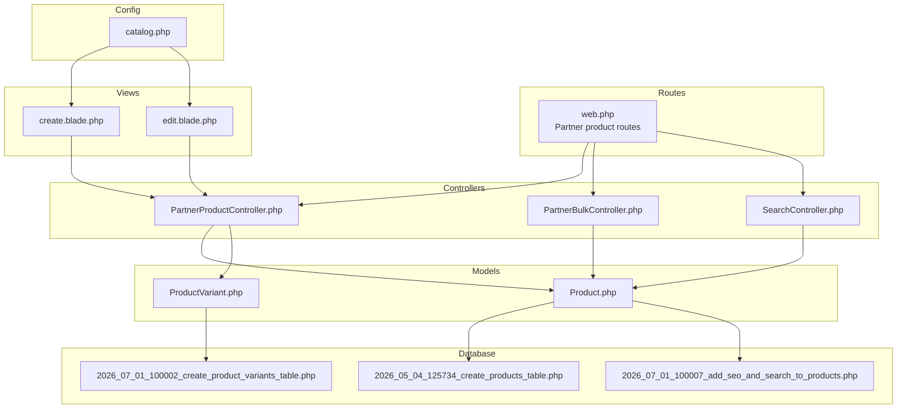
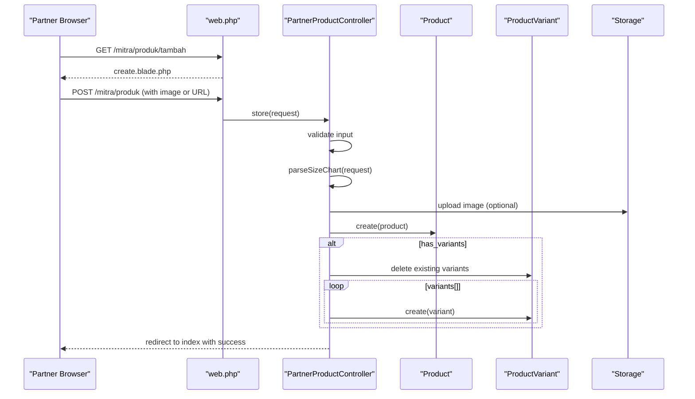
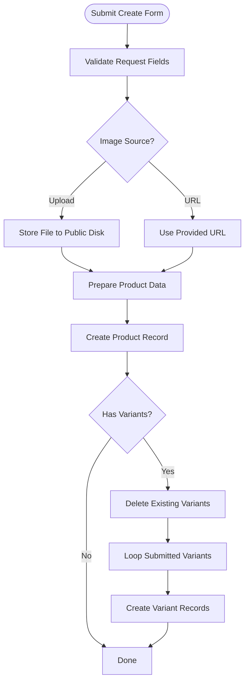
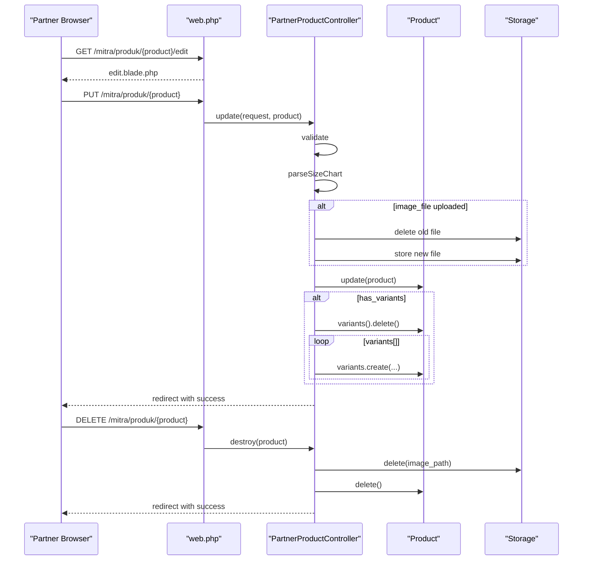
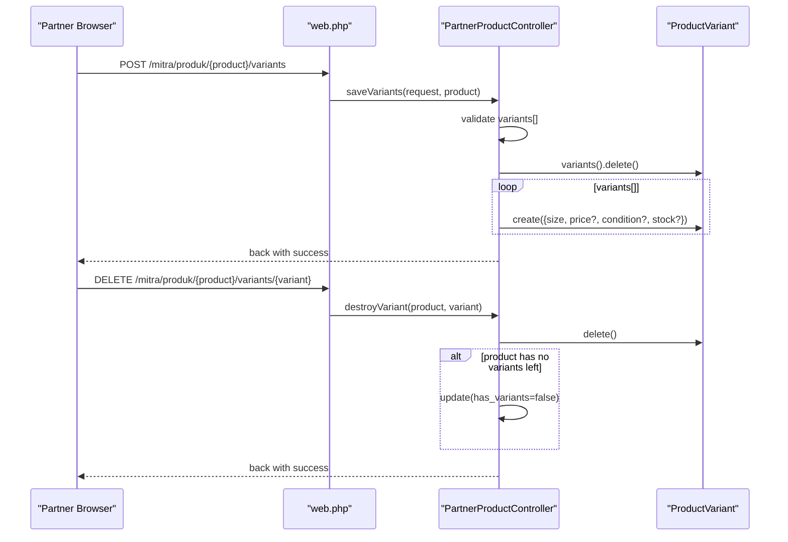
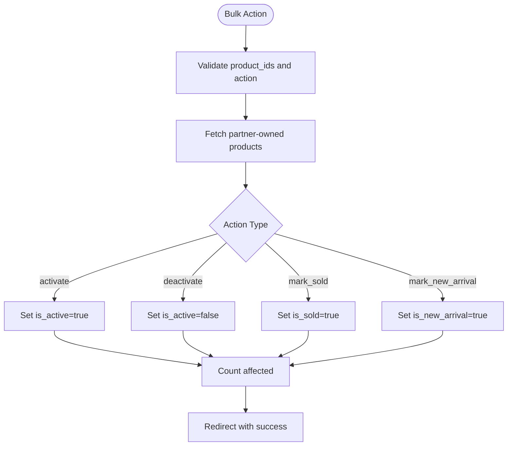
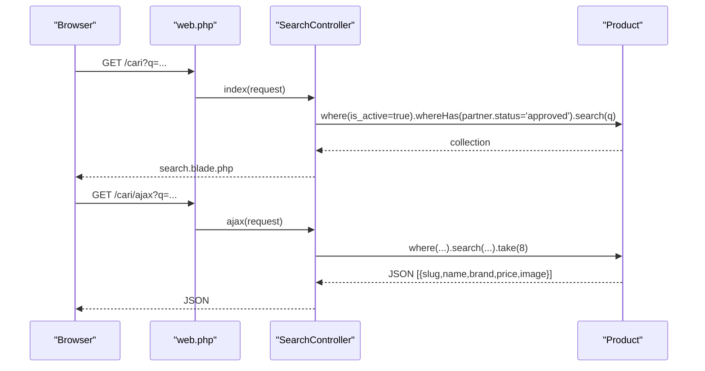
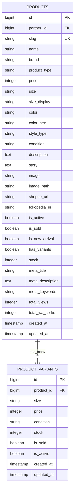
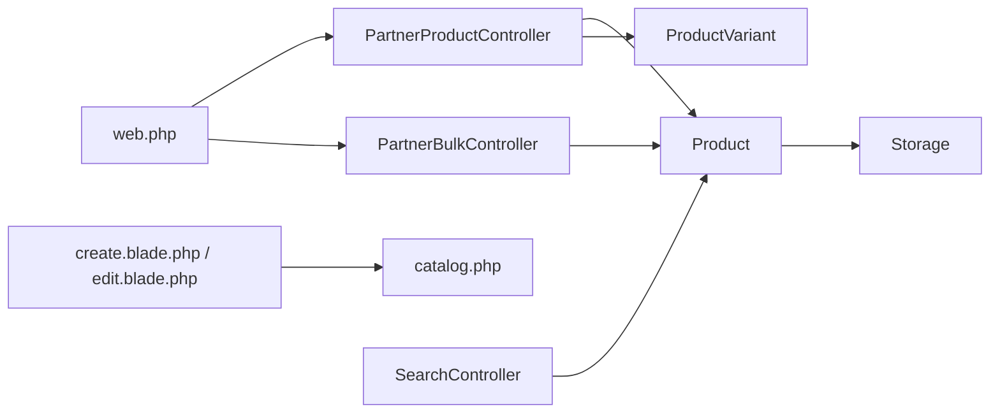

# Product Inventory and Listings

<cite>
**Referenced Files in This Document**
- [PartnerProductController.php](file://app/Http/Controllers/Partner/PartnerProductController.php)
- [PartnerBulkController.php](file://app/Http/Controllers/Partner/PartnerBulkController.php)
- [Product.php](file://app/Models/Product.php)
- [ProductVariant.php](file://app/Models/ProductVariant.php)
- [catalog.php](file://config/catalog.php)
- [create.blade.php](file://resources/views/partner/products/create.blade.php)
- [edit.blade.php](file://resources/views/partner/products/edit.blade.php)
- [web.php](file://routes/web.php)
- [2026_05_04_125734_create_products_table.php](file://database/migrations/2026_05_04_125734_create_products_table.php)
- [2026_07_01_100002_create_product_variants_table.php](file://database/migrations/2026_07_01_100002_create_product_variants_table.php)
- [2026_07_01_100007_add_seo_and_search_to_products.php](file://database/migrations/2026_07_01_100007_add_seo_and_search_to_products.php)
- [SearchController.php](file://app/Http/Controllers/SearchController.php)
</cite>

## Table of Contents
1. [Introduction](#introduction)
2. [Project Structure](#project-structure)
3. [Core Components](#core-components)
4. [Architecture Overview](#architecture-overview)
5. [Detailed Component Analysis](#detailed-component-analysis)
6. [Dependency Analysis](#dependency-analysis)
7. [Performance Considerations](#performance-considerations)
8. [Troubleshooting Guide](#troubleshooting-guide)
9. [Conclusion](#conclusion)
10. [Appendices](#appendices)

## Introduction
This document explains how partner users manage product inventory and listings in the platform. It covers product creation, categorization, pricing, variants, media, SEO, search, inventory tracking, bulk operations, and status management. It also outlines how product modifications, deletions, and archiving work, along with best practices for photography, descriptions, and inventory organization.

## Project Structure
The product lifecycle spans controllers, models, views, routes, configuration, and database migrations. Key areas:
- Routes define partner product CRUD, bulk actions, and variant management endpoints.
- Controllers handle validation, persistence, media handling, slug generation, and variant synchronization.
- Models encapsulate relationships, attributes, and search scopes.
- Views render forms for creating and editing products, including size charts and variants.
- Configuration defines product categories, size chart templates, and defaults.
- Migrations define schema for products and variants, plus search and SEO fields.

**Diagram sources**
- [web.php:119-167](file://routes/web.php#L119-L167)
- [PartnerProductController.php:14-337](file://app/Http/Controllers/Partner/PartnerProductController.php#L14-L337)
- [PartnerBulkController.php:10-75](file://app/Http/Controllers/Partner/PartnerBulkController.php#L10-L75)
- [SearchController.php:8-56](file://app/Http/Controllers/SearchController.php#L8-L56)
- [Product.php:9-132](file://app/Models/Product.php#L9-L132)
- [ProductVariant.php:6-23](file://app/Models/ProductVariant.php#L6-L23)
- [create.blade.php:1-300](file://resources/views/partner/products/create.blade.php#L1-L300)
- [edit.blade.php:1-274](file://resources/views/partner/products/edit.blade.php#L1-L274)
- [catalog.php:13-70](file://config/catalog.php#L13-L70)
- [2026_05_04_125734_create_products_table.php:12-26](file://database/migrations/2026_05_04_125734_create_products_table.php#L12-L26)
- [2026_07_01_100002_create_product_variants_table.php:8-31](file://database/migrations/2026_07_01_100002_create_product_variants_table.php#L8-L31)
- [2026_07_01_100007_add_seo_and_search_to_products.php:8-28](file://database/migrations/2026_07_01_100007_add_seo_and_search_to_products.php#L8-L28)

**Section sources**
- [web.php:119-167](file://routes/web.php#L119-L167)
- [PartnerProductController.php:14-337](file://app/Http/Controllers/Partner/PartnerProductController.php#L14-L337)
- [Product.php:9-132](file://app/Models/Product.php#L9-L132)
- [ProductVariant.php:6-23](file://app/Models/ProductVariant.php#L6-L23)
- [create.blade.php:1-300](file://resources/views/partner/products/create.blade.php#L1-L300)
- [edit.blade.php:1-274](file://resources/views/partner/products/edit.blade.php#L1-L274)
- [catalog.php:13-70](file://config/catalog.php#L13-L70)
- [2026_05_04_125734_create_products_table.php:12-26](file://database/migrations/2026_05_04_125734_create_products_table.php#L12-L26)
- [2026_07_01_100002_create_product_variants_table.php:8-31](file://database/migrations/2026_07_01_100002_create_product_variants_table.php#L8-L31)
- [2026_07_01_100007_add_seo_and_search_to_products.php:8-28](file://database/migrations/2026_07_01_100007_add_seo_and_search_to_products.php#L8-L28)

## Core Components
- PartnerProductController: Handles product creation, updates, deletion, media replacement, slug generation, size chart parsing, and variant management.
- PartnerBulkController: Provides bulk activation/deactivation, marking sold/new arrival, and CSV export for partner’s products.
- Product model: Defines fillable attributes, casts, relationships (partner, variants, reviews, reports), computed attributes (image URL, average rating, review count), and search scope.
- ProductVariant model: Defines variant attributes and belongs-to relationship to Product.
- Views: Forms for creating and editing products, including size chart and variants tables.
- Routes: Expose endpoints for CRUD, variants, and bulk operations under the partner namespace.
- Config: Provides product types, size chart columns and defaults used in forms.
- Migrations: Define products, variants, and search/SEO fields.

**Section sources**
- [PartnerProductController.php:14-337](file://app/Http/Controllers/Partner/PartnerProductController.php#L14-L337)
- [PartnerBulkController.php:10-75](file://app/Http/Controllers/Partner/PartnerBulkController.php#L10-L75)
- [Product.php:9-132](file://app/Models/Product.php#L9-L132)
- [ProductVariant.php:6-23](file://app/Models/ProductVariant.php#L6-L23)
- [create.blade.php:1-300](file://resources/views/partner/products/create.blade.php#L1-L300)
- [edit.blade.php:1-274](file://resources/views/partner/products/edit.blade.php#L1-L274)
- [web.php:119-167](file://routes/web.php#L119-L167)
- [catalog.php:13-70](file://config/catalog.php#L13-L70)
- [2026_05_04_125734_create_products_table.php:12-26](file://database/migrations/2026_05_04_125734_create_products_table.php#L12-L26)
- [2026_07_01_100002_create_product_variants_table.php:8-31](file://database/migrations/2026_07_01_100002_create_product_variants_table.php#L8-L31)
- [2026_07_01_100007_add_seo_and_search_to_products.php:8-28](file://database/migrations/2026_07_01_100007_add_seo_and_search_to_products.php#L8-L28)

## Architecture Overview
The partner product module follows MVC with explicit separation of concerns:
- Routes delegate to PartnerProductController for product operations and PartnerBulkController for batch actions.
- Controllers coordinate validation, persistence, media handling, and variant synchronization.
- Models encapsulate domain logic and relationships.
- Views render forms and present configuration-driven UI (categories, size chart columns).
- Database migrations define schema and indices for search and SEO.

**Diagram sources**
- [web.php:127-133](file://routes/web.php#L127-L133)
- [PartnerProductController.php:42-133](file://app/Http/Controllers/Partner/PartnerProductController.php#L42-L133)
- [Product.php:13-34](file://app/Models/Product.php#L13-L34)
- [ProductVariant.php:8-16](file://app/Models/ProductVariant.php#L8-L16)

**Section sources**
- [web.php:119-167](file://routes/web.php#L119-L167)
- [PartnerProductController.php:42-133](file://app/Http/Controllers/Partner/PartnerProductController.php#L42-L133)
- [Product.php:13-34](file://app/Models/Product.php#L13-L34)
- [ProductVariant.php:8-16](file://app/Models/ProductVariant.php#L8-L16)

## Detailed Component Analysis

### Product Creation Workflow
- Form fields include name, brand, product_type, style_type, price, size, condition, description, story, image selection (upload or URL), external store links, size chart toggle, variants, SEO metadata, and status flags.
- Validation ensures required fields and safe sizes for images and URLs.
- Media handling supports either uploading a file (stored in public disk) or supplying a URL; previous file is deleted upon replacement.
- Slug generation ensures uniqueness per partner.
- Size chart is parsed from submitted rows and stored as an array.
- If variants are enabled, existing variants are cleared and re-created from the submission.

**Diagram sources**
- [PartnerProductController.php:42-133](file://app/Http/Controllers/Partner/PartnerProductController.php#L42-L133)
- [create.blade.php:80-239](file://resources/views/partner/products/create.blade.php#L80-L239)

**Section sources**
- [PartnerProductController.php:42-133](file://app/Http/Controllers/Partner/PartnerProductController.php#L42-L133)
- [create.blade.php:80-239](file://resources/views/partner/products/create.blade.php#L80-L239)
- [catalog.php:13-70](file://config/catalog.php#L13-L70)

### Product Modification and Deletion
- Edit form preloads current values and allows changing image via upload or URL.
- Slug is regenerated only when the name changes.
- Size chart and variants are fully replaced when variants are enabled.
- Deletion removes associated media file from storage before deleting the product.

**Diagram sources**
- [web.php:131-133](file://routes/web.php#L131-L133)
- [PartnerProductController.php:149-259](file://app/Http/Controllers/Partner/PartnerProductController.php#L149-L259)
- [edit.blade.php:75-237](file://resources/views/partner/products/edit.blade.php#L75-L237)

**Section sources**
- [PartnerProductController.php:149-259](file://app/Http/Controllers/Partner/PartnerProductController.php#L149-L259)
- [edit.blade.php:75-237](file://resources/views/partner/products/edit.blade.php#L75-L237)

### Variant Management
- Variants are optional and controlled by a flag. When enabled, existing variants are removed and replaced with submitted entries.
- Each variant includes size, optional price override, optional condition, and stock.
- Dedicated endpoints support saving variants and removing individual variants.

**Diagram sources**
- [web.php:140-142](file://routes/web.php#L140-L142)
- [PartnerProductController.php:293-335](file://app/Http/Controllers/Partner/PartnerProductController.php#L293-L335)
- [ProductVariant.php:18-21](file://app/Models/ProductVariant.php#L18-L21)

**Section sources**
- [PartnerProductController.php:293-335](file://app/Http/Controllers/Partner/PartnerProductController.php#L293-L335)
- [ProductVariant.php:18-21](file://app/Models/ProductVariant.php#L18-L21)

### Bulk Operations
- Bulk update toggles activity, sold, and new arrival statuses for selected products owned by the partner.
- Bulk delete removes selected products.
- Export generates a CSV summary of products for the partner.

**Diagram sources**
- [web.php:135-138](file://routes/web.php#L135-L138)
- [PartnerBulkController.php:17-75](file://app/Http/Controllers/Partner/PartnerBulkController.php#L17-L75)

**Section sources**
- [web.php:135-138](file://routes/web.php#L135-L138)
- [PartnerBulkController.php:17-75](file://app/Http/Controllers/Partner/PartnerBulkController.php#L17-L75)

### Search and SEO
- SearchController queries active, approved products using a fulltext index when available or falls back to LIKE conditions.
- Product model exposes a search scope and computed meta fields for SEO.
- Additional SEO fields (meta_title, meta_description, meta_keywords) and counters (total_views, total_wa_clicks) are persisted.

**Diagram sources**
- [web.php:52-54](file://routes/web.php#L52-L54)
- [SearchController.php:10-54](file://app/Http/Controllers/SearchController.php#L10-L54)
- [Product.php:122-130](file://app/Models/Product.php#L122-L130)
- [2026_07_01_100007_add_seo_and_search_to_products.php:8-28](file://database/migrations/2026_07_01_100007_add_seo_and_search_to_products.php#L8-L28)

**Section sources**
- [SearchController.php:10-54](file://app/Http/Controllers/SearchController.php#L10-L54)
- [Product.php:122-130](file://app/Models/Product.php#L122-L130)
- [2026_07_01_100007_add_seo_and_search_to_products.php:8-28](file://database/migrations/2026_07_01_100007_add_seo_and_search_to_products.php#L8-L28)

### Data Model and Schema

**Diagram sources**
- [2026_05_04_125734_create_products_table.php:14-26](file://database/migrations/2026_05_04_125734_create_products_table.php#L14-L26)
- [2026_07_01_100002_create_product_variants_table.php:10-22](file://database/migrations/2026_07_01_100002_create_product_variants_table.php#L10-L22)
- [Product.php:13-34](file://app/Models/Product.php#L13-L34)
- [ProductVariant.php:8-16](file://app/Models/ProductVariant.php#L8-L16)

**Section sources**
- [2026_05_04_125734_create_products_table.php:14-26](file://database/migrations/2026_05_04_125734_create_products_table.php#L14-L26)
- [2026_07_01_100002_create_product_variants_table.php:10-22](file://database/migrations/2026_07_01_100002_create_product_variants_table.php#L10-L22)
- [Product.php:13-34](file://app/Models/Product.php#L13-L34)
- [ProductVariant.php:8-16](file://app/Models/ProductVariant.php#L8-L16)

## Dependency Analysis
- Controllers depend on models and configuration for rendering forms and validating inputs.
- Product model depends on storage for image URL resolution and on database for search indices.
- Routes bind controller actions to named endpoints.
- Views depend on configuration arrays for product types and size chart columns.

**Diagram sources**
- [web.php:119-167](file://routes/web.php#L119-L167)
- [PartnerProductController.php:14-337](file://app/Http/Controllers/Partner/PartnerProductController.php#L14-L337)
- [PartnerBulkController.php:10-75](file://app/Http/Controllers/Partner/PartnerBulkController.php#L10-L75)
- [Product.php:9-132](file://app/Models/Product.php#L9-L132)
- [ProductVariant.php:6-23](file://app/Models/ProductVariant.php#L6-L23)
- [create.blade.php:1-300](file://resources/views/partner/products/create.blade.php#L1-L300)
- [edit.blade.php:1-274](file://resources/views/partner/products/edit.blade.php#L1-L274)
- [catalog.php:13-70](file://config/catalog.php#L13-L70)
- [SearchController.php:8-56](file://app/Http/Controllers/SearchController.php#L8-L56)

**Section sources**
- [web.php:119-167](file://routes/web.php#L119-L167)
- [PartnerProductController.php:14-337](file://app/Http/Controllers/Partner/PartnerProductController.php#L14-L337)
- [PartnerBulkController.php:10-75](file://app/Http/Controllers/Partner/PartnerBulkController.php#L10-L75)
- [Product.php:9-132](file://app/Models/Product.php#L9-L132)
- [ProductVariant.php:6-23](file://app/Models/ProductVariant.php#L6-L23)
- [create.blade.php:1-300](file://resources/views/partner/products/create.blade.php#L1-L300)
- [edit.blade.php:1-274](file://resources/views/partner/products/edit.blade.php#L1-L274)
- [catalog.php:13-70](file://config/catalog.php#L13-L70)
- [SearchController.php:8-56](file://app/Http/Controllers/SearchController.php#L8-L56)

## Performance Considerations
- Fulltext search indexing improves query performance for product name, brand, and description.
- Storing image_path enables efficient retrieval via storage URLs.
- Batch operations (bulk update/delete) reduce repeated round-trips by operating on collections.
- Unique constraints on product variants prevent duplicate sizes per product.

[No sources needed since this section provides general guidance]

## Troubleshooting Guide
- Image upload failures: Ensure file type is image and within size limits; confirm public disk write permissions.
- Slug conflicts: The controller regenerates slugs automatically; avoid submitting identical names across products.
- Variant mismatch: Enabling variants replaces all prior variants; ensure variant arrays are complete.
- Search not returning results: Verify database supports fulltext indexes; fallback LIKE queries require proper indexing.
- Status visibility: Only active, approved partner products appear in search results.

**Section sources**
- [PartnerProductController.php:78-86](file://app/Http/Controllers/Partner/PartnerProductController.php#L78-L86)
- [PartnerProductController.php:280-290](file://app/Http/Controllers/Partner/PartnerProductController.php#L280-L290)
- [SearchController.php:15-22](file://app/Http/Controllers/SearchController.php#L15-L22)
- [2026_07_01_100007_add_seo_and_search_to_products.php:18-28](file://database/migrations/2026_07_01_100007_add_seo_and_search_to_products.php#L18-L28)

## Conclusion
The partner product module provides a robust, configurable system for managing listings, variants, media, SEO, and bulk operations. Its design emphasizes clear separation of concerns, strong validation, and extensibility through configuration and database schema.

[No sources needed since this section summarizes without analyzing specific files]

## Appendices

### Best Practices
- Photography: Use consistent lighting, neutral backgrounds, and multiple angles. Include size model shots and close-ups for textures.
- Descriptions: Be precise about materials, care instructions, and unique features. Include origin stories where applicable.
- Inventory Organization: Keep SKUs/size consistency, maintain accurate stock counts, and regularly audit variants.
- SEO: Craft concise, keyword-rich titles and descriptions; leverage meta keywords thoughtfully.

[No sources needed since this section provides general guidance]