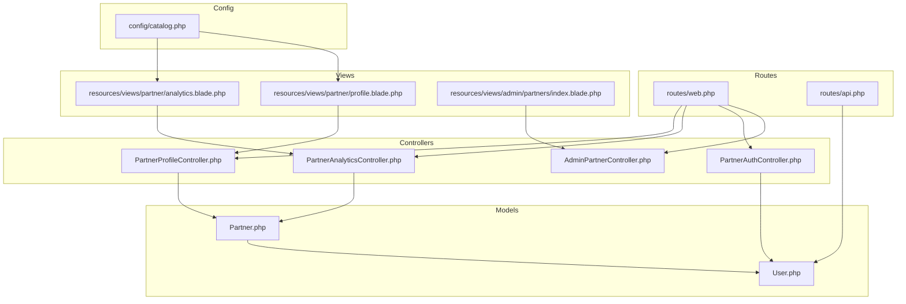
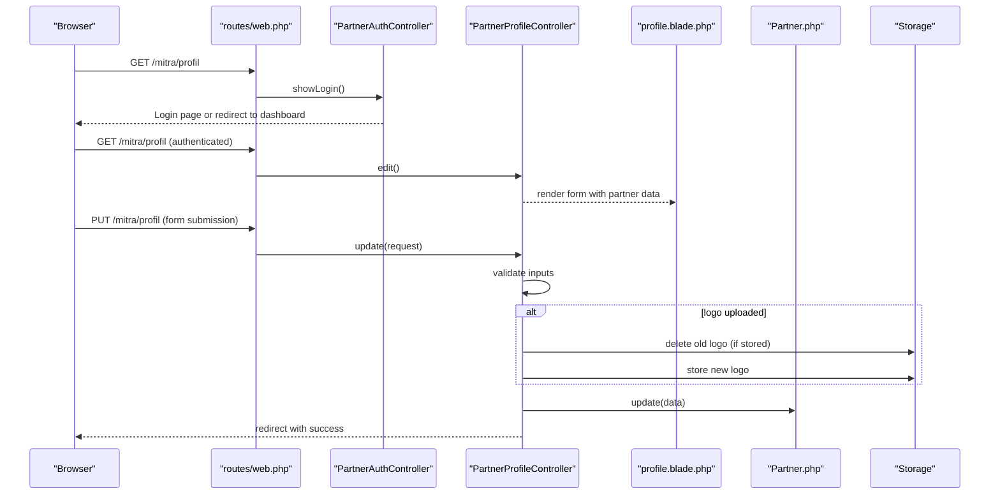
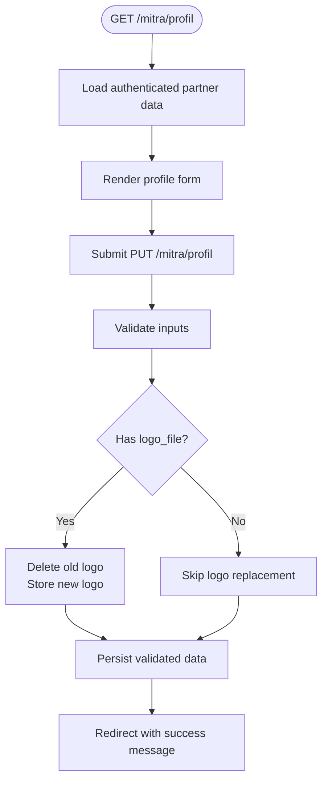
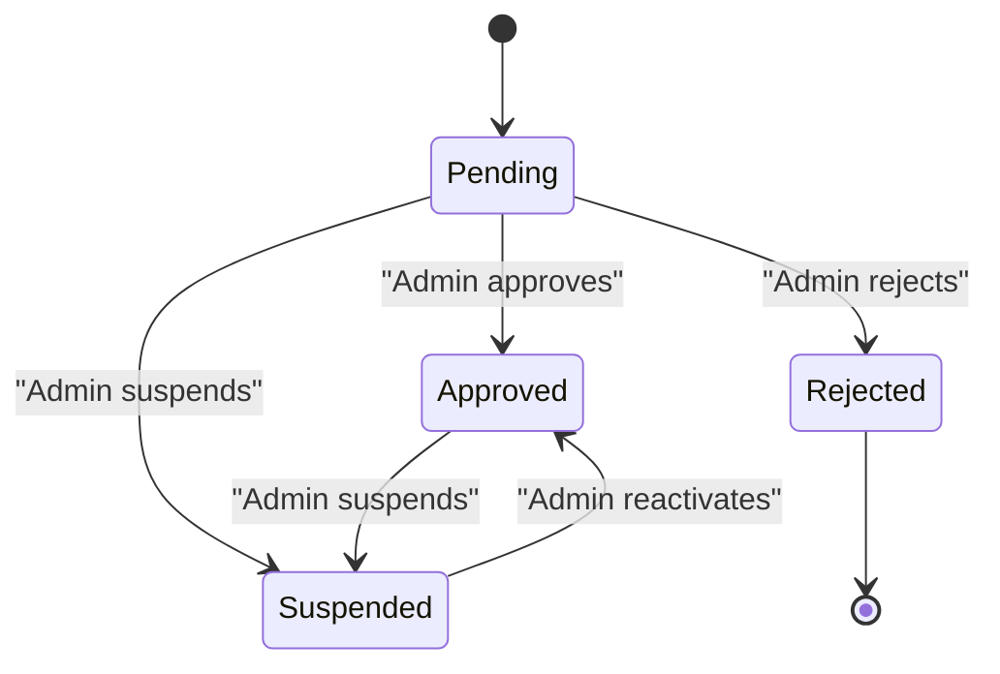
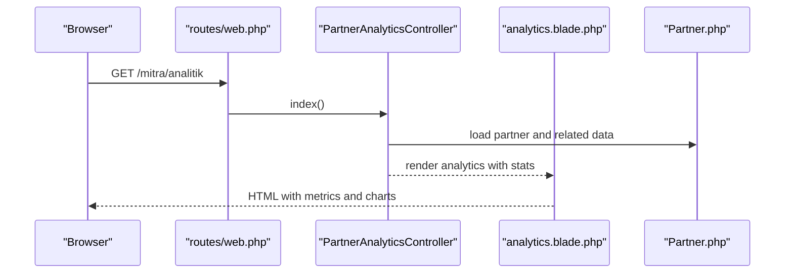
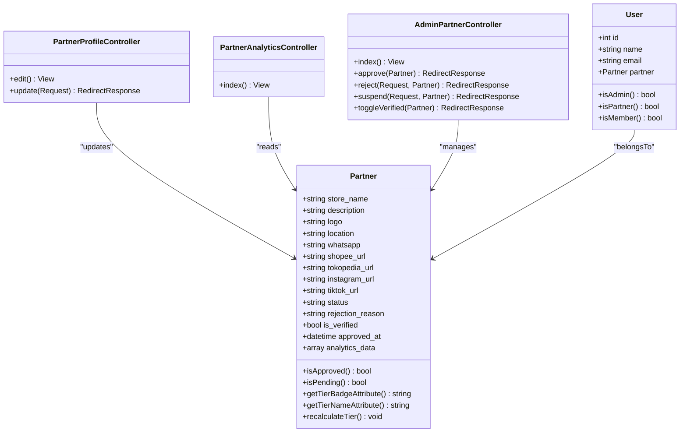

# Store Profile and Settings

<cite>
**Referenced Files in This Document**
- [PartnerProfileController.php](file://app/Http/Controllers/Partner/PartnerProfileController.php)
- [Partner.php](file://app/Models/Partner.php)
- [profile.blade.php](file://resources/views/partner/profile.blade.php)
- [web.php](file://routes/web.php)
- [PartnerAnalyticsController.php](file://app/Http/Controllers/Partner/PartnerAnalyticsController.php)
- [analytics.blade.php](file://resources/views/partner/analytics.blade.php)
- [PartnerAuthController.php](file://app/Http/Controllers/Partner/PartnerAuthController.php)
- [User.php](file://app/Models/User.php)
- [2026_05_24_093205_create_partners_table.php](file://database/migrations/2026_05_24_093205_create_partners_table.php)
- [AdminPartnerController.php](file://app/Http/Controllers/AdminPartnerController.php)
- [index.blade.php](file://resources/views/admin/partners/index.blade.php)
- [catalog.php](file://config/catalog.php)
- [api.php](file://routes/api.php)
</cite>

## Table of Contents
1. [Introduction](#introduction)
2. [Project Structure](#project-structure)
3. [Core Components](#core-components)
4. [Architecture Overview](#architecture-overview)
5. [Detailed Component Analysis](#detailed-component-analysis)
6. [Dependency Analysis](#dependency-analysis)
7. [Performance Considerations](#performance-considerations)
8. [Troubleshooting Guide](#troubleshooting-guide)
9. [Conclusion](#conclusion)
10. [Appendices](#appendices)

## Introduction
This document explains how partner store profiles are managed and configured within the platform. It covers profile setup, business information, branding customization, verification and approval workflows, analytics visibility, and operational best practices. It also documents the editing flows, validation rules, and administrative controls that govern store profiles.

## Project Structure
The store profile and settings functionality spans controllers, models, views, routes, and configuration. The key areas are:
- Partner profile editing and update logic
- Blade templates for the partner dashboard and profile forms
- Routes for partner profile and analytics
- Partner model attributes and computed helpers
- Administrative approval and verification controls
- Catalog configuration for branding and categories

**Diagram sources**
- [web.php:144-156](file://routes/web.php#L144-L156)
- [PartnerProfileController.php:11-48](file://app/Http/Controllers/Partner/PartnerProfileController.php#L11-L48)
- [PartnerAnalyticsController.php:10-58](file://app/Http/Controllers/Partner/PartnerAnalyticsController.php#L10-L58)
- [PartnerAuthController.php:11-59](file://app/Http/Controllers/Partner/PartnerAuthController.php#L11-L59)
- [AdminPartnerController.php:13-75](file://app/Http/Controllers/AdminPartnerController.php#L13-L75)
- [Partner.php:8-122](file://app/Models/Partner.php#L8-L122)
- [User.php:10-130](file://app/Models/User.php#L10-L130)
- [profile.blade.php:64-103](file://resources/views/partner/profile.blade.php#L64-L103)
- [analytics.blade.php:75-145](file://resources/views/partner/analytics.blade.php#L75-L145)
- [index.blade.php:84-131](file://resources/views/admin/partners/index.blade.php#L84-L131)
- [catalog.php:1-141](file://config/catalog.php#L1-L141)
- [api.php:17-19](file://routes/api.php#L17-L19)

**Section sources**
- [web.php:118-167](file://routes/web.php#L118-L167)
- [PartnerProfileController.php:11-48](file://app/Http/Controllers/Partner/PartnerProfileController.php#L11-L48)
- [PartnerAnalyticsController.php:10-58](file://app/Http/Controllers/Partner/PartnerAnalyticsController.php#L10-L58)
- [PartnerAuthController.php:11-59](file://app/Http/Controllers/Partner/PartnerAuthController.php#L11-L59)
- [AdminPartnerController.php:13-75](file://app/Http/Controllers/AdminPartnerController.php#L13-L75)
- [Partner.php:8-122](file://app/Models/Partner.php#L8-L122)
- [User.php:10-130](file://app/Models/User.php#L10-L130)
- [profile.blade.php:64-103](file://resources/views/partner/profile.blade.php#L64-L103)
- [analytics.blade.php:75-145](file://resources/views/partner/analytics.blade.php#L75-L145)
- [index.blade.php:84-131](file://resources/views/admin/partners/index.blade.php#L84-L131)
- [catalog.php:1-141](file://config/catalog.php#L1-L141)
- [api.php:17-19](file://routes/api.php#L17-L19)

## Core Components
- Partner profile controller: handles GET/PUT requests for editing and updating store profile fields, including validation and optional logo upload.
- Partner model: defines fillable attributes, computed helpers (verification, tiers, ratings), and relationships to user and products.
- Profile view: renders the editable form for store name, description, location, WhatsApp, social links, and logo upload.
- Analytics controller and view: aggregates store/product metrics, top products, review distribution, and tier badge.
- Authentication controller: gates access to partner area and enforces approval status.
- Admin partner controller and view: lists partners, approves/rejects/suspends, toggles verified badge.
- Catalog configuration: branding metadata and product type taxonomy used across the platform.

**Section sources**
- [PartnerProfileController.php:11-48](file://app/Http/Controllers/Partner/PartnerProfileController.php#L11-L48)
- [Partner.php:8-122](file://app/Models/Partner.php#L8-L122)
- [profile.blade.php:64-103](file://resources/views/partner/profile.blade.php#L64-L103)
- [PartnerAnalyticsController.php:10-58](file://app/Http/Controllers/Partner/PartnerAnalyticsController.php#L10-L58)
- [analytics.blade.php:75-145](file://resources/views/partner/analytics.blade.php#L75-L145)
- [PartnerAuthController.php:11-59](file://app/Http/Controllers/Partner/PartnerAuthController.php#L11-L59)
- [AdminPartnerController.php:13-75](file://app/Http/Controllers/AdminPartnerController.php#L13-L75)
- [index.blade.php:84-131](file://resources/views/admin/partners/index.blade.php#L84-L131)
- [catalog.php:1-141](file://config/catalog.php#L1-L141)

## Architecture Overview
The store profile lifecycle involves:
- Access control via partner guard and approval checks
- Profile editing through a dedicated controller and view
- Validation and persistence of profile fields and optional logo
- Analytics aggregation per partner
- Administrative oversight for approvals and verification badges

**Diagram sources**
- [web.php:144-146](file://routes/web.php#L144-L146)
- [PartnerAuthController.php:13-50](file://app/Http/Controllers/Partner/PartnerAuthController.php#L13-L50)
- [PartnerProfileController.php:20-47](file://app/Http/Controllers/Partner/PartnerProfileController.php#L20-L47)
- [profile.blade.php:64-103](file://resources/views/partner/profile.blade.php#L64-L103)
- [Partner.php:8-122](file://app/Models/Partner.php#L8-L122)

## Detailed Component Analysis

### Partner Profile Editing Workflow
- Endpoint routing exposes GET and PUT endpoints for profile management under the partner namespace.
- The edit action loads the authenticated partner’s data into the profile view.
- The update action validates inputs, optionally replaces the logo, persists changes, and returns a success message.

**Diagram sources**
- [web.php:144-146](file://routes/web.php#L144-L146)
- [PartnerProfileController.php:20-47](file://app/Http/Controllers/Partner/PartnerProfileController.php#L20-L47)
- [profile.blade.php:64-103](file://resources/views/partner/profile.blade.php#L64-L103)

**Section sources**
- [web.php:144-146](file://routes/web.php#L144-L146)
- [PartnerProfileController.php:13-47](file://app/Http/Controllers/Partner/PartnerProfileController.php#L13-L47)
- [profile.blade.php:64-103](file://resources/views/partner/profile.blade.php#L64-L103)

### Profile Fields and Validation
- Required and optional fields include store name, description, location, WhatsApp, and social URLs.
- Optional logo upload supports images up to a specified size and replaces existing logos.
- The model stores raw URLs or disk paths and resolves a public URL via a helper.

**Section sources**
- [PartnerProfileController.php:24-44](file://app/Http/Controllers/Partner/PartnerProfileController.php#L24-L44)
- [Partner.php:50-59](file://app/Models/Partner.php#L50-L59)
- [2026_05_24_093205_create_partners_table.php:14-26](file://database/migrations/2026_05_24_093205_create_partners_table.php#L14-L26)

### Verification Status Indicators and Approval Requirements
- Partners have a status field with pending/approved/rejected/suspended states.
- Authentication logic prevents access until approved and displays contextual messages for pending, rejected, or suspended accounts.
- Administrators manage statuses and can toggle a verified badge for approved partners.

**Diagram sources**
- [PartnerAuthController.php:34-43](file://app/Http/Controllers/Partner/PartnerAuthController.php#L34-L43)
- [AdminPartnerController.php:30-67](file://app/Http/Controllers/AdminPartnerController.php#L30-L67)
- [2026_05_24_093205_create_partners_table.php:24-26](file://database/migrations/2026_05_24_093205_create_partners_table.php#L24-L26)

**Section sources**
- [PartnerAuthController.php:34-43](file://app/Http/Controllers/Partner/PartnerAuthController.php#L34-L43)
- [AdminPartnerController.php:30-74](file://app/Http/Controllers/AdminPartnerController.php#L30-L74)
- [2026_05_24_093205_create_partners_table.php:24-26](file://database/migrations/2026_05_24_093205_create_partners_table.php#L24-L26)

### Store Settings Configuration and Contact Information
- Contact information includes location, WhatsApp number, and social platform URLs (Shopee, Tokopedia, Instagram, TikTok).
- These fields are editable via the profile form and persisted to the partner record.

**Section sources**
- [PartnerProfileController.php:24-33](file://app/Http/Controllers/Partner/PartnerProfileController.php#L24-L33)
- [profile.blade.php:77-99](file://resources/views/partner/profile.blade.php#L77-L99)
- [Partner.php:10-20](file://app/Models/Partner.php#L10-L20)

### Branding Customization and Visual Options
- Logo upload is supported with validation and automatic cleanup of previous logos.
- The model provides a computed logo URL helper that resolves to either a remote URL or a generated placeholder if none exists.
- Cover image management is not part of the partner profile controller; it is handled elsewhere in the system (e.g., articles/outfits).

**Section sources**
- [PartnerProfileController.php:36-41](file://app/Http/Controllers/Partner/PartnerProfileController.php#L36-L41)
- [Partner.php:50-59](file://app/Models/Partner.php#L50-L59)

### Store Description Editing and Category Selection
- Description is editable in the profile form and stored on the partner record.
- Product categorization is governed by catalog configuration, which defines product types and pairings used across the platform.

**Section sources**
- [PartnerProfileController.php](file://app/Http/Controllers/Partner/PartnerProfileController.php#L26)
- [profile.blade.php](file://resources/views/partner/profile.blade.php#L74)
- [catalog.php:14-28](file://config/catalog.php#L14-L28)

### Operational Hours and Service Offerings
- Operational hours are not exposed in the current profile editing flow.
- Service offerings are represented by product types and variants, configured centrally and used during product creation/editing.

**Section sources**
- [PartnerProfileController.php:24-33](file://app/Http/Controllers/Partner/PartnerProfileController.php#L24-L33)
- [catalog.php:14-28](file://config/catalog.php#L14-L28)

### Store Analytics Visibility and Reporting Preferences
- Analytics view aggregates store metrics: total views, WhatsApp clicks, wishlist counts, follower count, average rating, and top products.
- Tier badge and name are displayed, reflecting performance-based scoring.
- Reporting preferences are not exposed in the partner profile; analytics are presented as-is.

**Diagram sources**
- [web.php:154-156](file://routes/web.php#L154-L156)
- [PartnerAnalyticsController.php:17-58](file://app/Http/Controllers/Partner/PartnerAnalyticsController.php#L17-L58)
- [analytics.blade.php:75-145](file://resources/views/partner/analytics.blade.php#L75-L145)
- [Partner.php:61-70](file://app/Models/Partner.php#L61-L70)

**Section sources**
- [PartnerAnalyticsController.php:17-58](file://app/Http/Controllers/Partner/PartnerAnalyticsController.php#L17-L58)
- [analytics.blade.php:75-145](file://resources/views/partner/analytics.blade.php#L75-L145)
- [Partner.php:61-70](file://app/Models/Partner.php#L61-L70)

### Administrative Oversight and Approval Controls
- Admins can approve, reject, suspend, or toggle verified badges for partners.
- The admin interface displays status badges and actions per partner.

**Section sources**
- [AdminPartnerController.php:30-74](file://app/Http/Controllers/AdminPartnerController.php#L30-L74)
- [index.blade.php:88-124](file://resources/views/admin/partners/index.blade.php#L88-L124)

## Dependency Analysis
- Controllers depend on the Partner model for data access and on views for rendering.
- Views depend on routes for action URLs and on configuration for branding.
- Authentication depends on the User model and partner guard.
- Admin controls depend on Partner model and status enums.

**Diagram sources**
- [Partner.php:8-122](file://app/Models/Partner.php#L8-L122)
- [User.php:10-130](file://app/Models/User.php#L10-L130)
- [PartnerProfileController.php:11-48](file://app/Http/Controllers/Partner/PartnerProfileController.php#L11-L48)
- [PartnerAnalyticsController.php:10-58](file://app/Http/Controllers/Partner/PartnerAnalyticsController.php#L10-L58)
- [AdminPartnerController.php:13-75](file://app/Http/Controllers/AdminPartnerController.php#L13-L75)

**Section sources**
- [Partner.php:8-122](file://app/Models/Partner.php#L8-L122)
- [User.php:10-130](file://app/Models/User.php#L10-L130)
- [PartnerProfileController.php:11-48](file://app/Http/Controllers/Partner/PartnerProfileController.php#L11-L48)
- [PartnerAnalyticsController.php:10-58](file://app/Http/Controllers/Partner/PartnerAnalyticsController.php#L10-L58)
- [AdminPartnerController.php:13-75](file://app/Http/Controllers/AdminPartnerController.php#L13-L75)

## Performance Considerations
- Logo uploads: Prefer compressed images and limit file sizes to reduce storage and bandwidth costs.
- Analytics queries: Aggregation uses grouped sums and counts; ensure appropriate indexing on timestamps and foreign keys for large datasets.
- Tier calculations: Recalculation is O(n) in product count; batch updates may be considered for very large partner catalogs.

## Troubleshooting Guide
- Profile update fails validation: Ensure inputs meet length and format constraints (e.g., URLs, numeric prices).
- Logo not replacing: Confirm the previous logo was stored on disk and that permissions allow deletion and writing.
- Access denied after login: Verify the partner account is approved; pending/rejected/suspended accounts are blocked.
- Analytics missing data: Confirm products exist and have been viewed; review daily aggregation logic and date range limits.

**Section sources**
- [PartnerProfileController.php:24-44](file://app/Http/Controllers/Partner/PartnerProfileController.php#L24-L44)
- [PartnerAuthController.php:34-43](file://app/Http/Controllers/Partner/PartnerAuthController.php#L34-L43)
- [PartnerAnalyticsController.php:34-40](file://app/Http/Controllers/Partner/PartnerAnalyticsController.php#L34-L40)

## Conclusion
The store profile and settings system provides a focused, secure workflow for partners to maintain their store identity, contact details, and branding. Administrative controls ensure compliance and quality, while analytics offer insights into performance. Following the validation rules and best practices outlined here will help maintain accurate and optimized store information.

## Appendices
- API access: Sanctum-protected endpoint returns authenticated user data for internal integrations.

**Section sources**
- [api.php:17-19](file://routes/api.php#L17-L19)