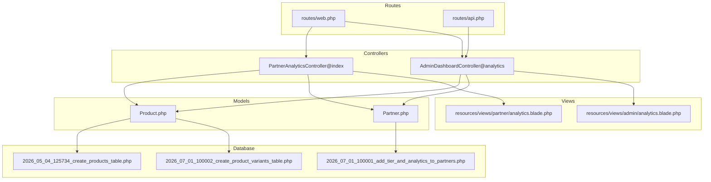
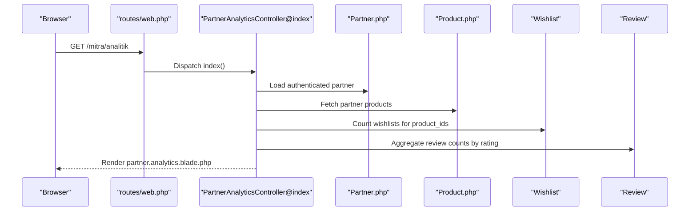
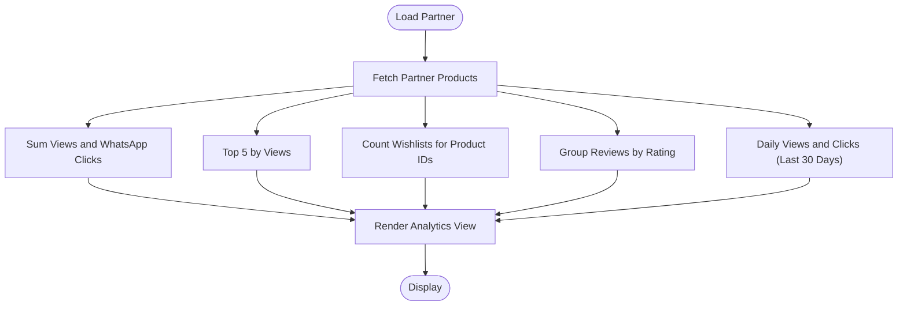
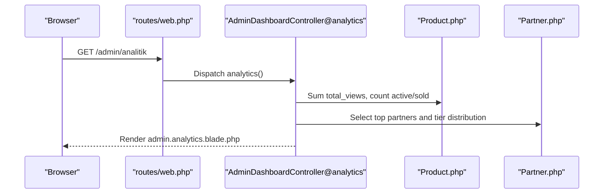
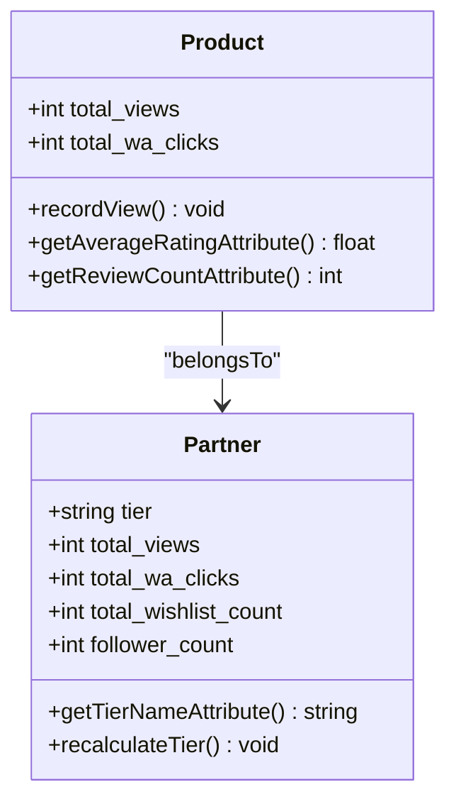
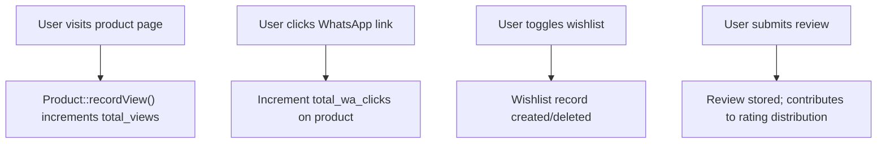
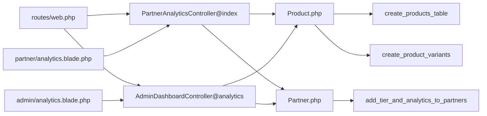

# Product Analytics and Performance Metrics

<cite>
**Referenced Files in This Document**
- [PartnerAnalyticsController.php](file://app/Http/Controllers/Partner/PartnerAnalyticsController.php)
- [analytics.blade.php](file://resources/views/partner/analytics.blade.php)
- [web.php](file://routes/web.php)
- [api.php](file://routes/api.php)
- [Product.php](file://app/Models/Product.php)
- [Partner.php](file://app/Models/Partner.php)
- [2026_07_01_100001_add_tier_and_analytics_to_partners.php](file://database/migrations/2026_07_01_100001_add_tier_and_analytics_to_partners.php)
- [2026_05_04_125734_create_products_table.php](file://database/migrations/2026_05_04_125734_create_products_table.php)
- [AdminDashboardController.php](file://app/Http/Controllers/AdminDashboardController.php)
- [admin/analytics.blade.php](file://resources/views/admin/analytics.blade.php)
- [2026_07_01_100002_create_product_variants_table.php](file://database/migrations/2026_07_01_100002_create_product_variants_table.php)
</cite>

## Table of Contents
1. [Introduction](#introduction)
2. [Project Structure](#project-structure)
3. [Core Components](#core-components)
4. [Architecture Overview](#architecture-overview)
5. [Detailed Component Analysis](#detailed-component-analysis)
6. [Dependency Analysis](#dependency-analysis)
7. [Performance Considerations](#performance-considerations)
8. [Troubleshooting Guide](#troubleshooting-guide)
9. [Conclusion](#conclusion)
10. [Appendices](#appendices)

## Introduction
This document describes the product analytics and performance metrics system implemented in the platform. It covers how conversion-related signals are tracked, how sales funnel insights are derived, and how revenue attribution can be modeled using existing metrics. It also documents product popularity metrics, view-to-purchase ratios, engagement indicators, inventory turnover analysis, slow-moving stock identification, markdown optimization, A/B testing capabilities, product performance comparisons, seasonal trend analysis, real-time dashboards, custom reporting, export functionality, data collection mechanisms, privacy compliance, and analytics API endpoints. The goal is to provide practical guidance grounded in the current implementation while highlighting areas for extension.

## Project Structure
The analytics system spans controller actions, Blade templates, routes, models, and database migrations. Key elements:
- Partner-facing analytics dashboard and data aggregation
- Admin-facing platform analytics dashboard
- Product and Partner models exposing metrics and helper methods
- Routes for analytics endpoints and API access
- Database schema supporting views, clicks, ratings, and tier calculations

**Diagram sources**
- [web.php:154-157](file://routes/web.php#L154-L157)
- [api.php:17-19](file://routes/api.php#L17-L19)
- [PartnerAnalyticsController.php:17-58](file://app/Http/Controllers/Partner/PartnerAnalyticsController.php#L17-L58)
- [AdminDashboardController.php:31-65](file://app/Http/Controllers/AdminDashboardController.php#L31-L65)
- [Product.php:13-34](file://app/Models/Product.php#L13-L34)
- [Partner.php:93-122](file://app/Models/Partner.php#L93-L122)
- [2026_05_04_125734_create_products_table.php:14-26](file://database/migrations/2026_05_04_125734_create_products_table.php#L14-L26)
- [2026_07_01_100001_add_tier_and_analytics_to_partners.php:10-17](file://database/migrations/2026_07_01_100001_add_tier_and_analytics_to_partners.php#L10-L17)
- [2026_07_01_100002_create_product_variants_table.php:10-22](file://database/migrations/2026_07_01_100002_create_product_variants_table.php#L10-L22)
- [analytics.blade.php:75-96](file://resources/views/partner/analytics.blade.php#L75-L96)
- [admin/analytics.blade.php:64-70](file://resources/views/admin/analytics.blade.php#L64-L70)

**Section sources**
- [web.php:154-157](file://routes/web.php#L154-L157)
- [api.php:17-19](file://routes/api.php#L17-L19)
- [PartnerAnalyticsController.php:17-58](file://app/Http/Controllers/Partner/PartnerAnalyticsController.php#L17-L58)
- [AdminDashboardController.php:31-65](file://app/Http/Controllers/AdminDashboardController.php#L31-L65)
- [Product.php:13-34](file://app/Models/Product.php#L13-L34)
- [Partner.php:93-122](file://app/Models/Partner.php#L93-L122)
- [2026_05_04_125734_create_products_table.php:14-26](file://database/migrations/2026_05_04_125734_create_products_table.php#L14-L26)
- [2026_07_01_100001_add_tier_and_analytics_to_partners.php:10-17](file://database/migrations/2026_07_01_100001_add_tier_and_analytics_to_partners.php#L10-L17)
- [2026_07_01_100002_create_product_variants_table.php:10-22](file://database/migrations/2026_07_01_100002_create_product_variants_table.php#L10-L22)
- [analytics.blade.php:75-96](file://resources/views/partner/analytics.blade.php#L75-L96)
- [admin/analytics.blade.php:64-70](file://resources/views/admin/analytics.blade.php#L64-L70)

## Core Components
- Partner Analytics Controller: Aggregates per-partner metrics including total views, WhatsApp clicks, top products, wishlist counts, review distributions, and daily activity.
- Admin Analytics Controller: Provides platform-wide summaries including top partners/products, tier distributions, and totals.
- Product Model: Tracks product-level metrics (views, WhatsApp clicks) and exposes helpers for average rating and review count.
- Partner Model: Exposes tier name and calculates tier based on weighted performance metrics.
- Routes: Define analytics endpoints for partner and admin dashboards, plus a basic API endpoint for authenticated users.

Key metrics exposed:
- Total views and WhatsApp clicks per product and per partner
- Wishlist counts
- Average rating and review distribution
- Daily views and clicks (last 30 days)
- Tier badges and names for partners

**Section sources**
- [PartnerAnalyticsController.php:17-58](file://app/Http/Controllers/Partner/PartnerAnalyticsController.php#L17-L58)
- [AdminDashboardController.php:31-65](file://app/Http/Controllers/AdminDashboardController.php#L31-L65)
- [Product.php:86-94](file://app/Models/Product.php#L86-L94)
- [Partner.php:93-122](file://app/Models/Partner.php#L93-L122)
- [web.php:154-157](file://routes/web.php#L154-L157)
- [api.php:17-19](file://routes/api.php#L17-L19)

## Architecture Overview
The analytics architecture follows a MVC pattern with controllers aggregating data from models and rendering views. The partner dashboard focuses on product-level signals and engagement, while the admin dashboard provides macro-level platform insights.

**Diagram sources**
- [web.php:154-157](file://routes/web.php#L154-L157)
- [PartnerAnalyticsController.php:17-58](file://app/Http/Controllers/Partner/PartnerAnalyticsController.php#L17-L58)
- [Partner.php:36-39](file://app/Models/Partner.php#L36-L39)
- [Product.php:36-39](file://app/Models/Product.php#L36-L39)
- [analytics.blade.php:75-96](file://resources/views/partner/analytics.blade.php#L75-L96)

## Detailed Component Analysis

### Partner Analytics Dashboard
The partner dashboard aggregates:
- Store-level stats: total views, WhatsApp clicks, wishlist count, follower count, average rating
- Top products by views
- Review distribution
- Daily views and clicks (last 30 days)
- Tier badge and name

Implementation highlights:
- Aggregation uses Eloquent collections and queries grouped by date
- Review distribution computed via grouped counts
- Tier badge and name derived from Partner attributes

**Diagram sources**
- [PartnerAnalyticsController.php:19-40](file://app/Http/Controllers/Partner/PartnerAnalyticsController.php#L19-L40)
- [analytics.blade.php:75-145](file://resources/views/partner/analytics.blade.php#L75-L145)

**Section sources**
- [PartnerAnalyticsController.php:17-58](file://app/Http/Controllers/Partner/PartnerAnalyticsController.php#L17-L58)
- [analytics.blade.php:75-145](file://resources/views/partner/analytics.blade.php#L75-L145)

### Admin Analytics Dashboard
The admin dashboard provides:
- Platform-wide totals: total views, total WhatsApp clicks, total wishlist, active/sold product counts
- Top partners by total views
- Top products by views
- Tier distributions for partners and members

**Diagram sources**
- [web.php:237-237](file://routes/web.php#L237-L237)
- [AdminDashboardController.php:31-65](file://app/Http/Controllers/AdminDashboardController.php#L31-L65)
- [admin/analytics.blade.php:64-106](file://resources/views/admin/analytics.blade.php#L64-L106)

**Section sources**
- [AdminDashboardController.php:31-65](file://app/Http/Controllers/AdminDashboardController.php#L31-L65)
- [admin/analytics.blade.php:64-106](file://resources/views/admin/analytics.blade.php#L64-L106)

### Product and Partner Models
- Product model tracks total_views and total_wa_clicks and exposes average_rating and review_count.
- Partner model exposes tier name and recalculates tier based on weighted performance metrics.

**Diagram sources**
- [Product.php:13-34](file://app/Models/Product.php#L13-L34)
- [Product.php:115-119](file://app/Models/Product.php#L115-L119)
- [Product.php:86-94](file://app/Models/Product.php#L86-L94)
- [Partner.php:93-122](file://app/Models/Partner.php#L93-L122)

**Section sources**
- [Product.php:13-34](file://app/Models/Product.php#L13-L34)
- [Product.php:86-94](file://app/Models/Product.php#L86-L94)
- [Product.php:115-119](file://app/Models/Product.php#L115-L119)
- [Partner.php:93-122](file://app/Models/Partner.php#L93-L122)

### Data Collection Mechanisms
- Product views are incremented via Product::recordView(), which increments total_views.
- WhatsApp clicks are tracked via total_wa_clicks on products.
- Wishlist counts are derived from Wishlist records linked to product IDs.
- Reviews contribute to rating distribution and average rating.

**Diagram sources**
- [Product.php:115-119](file://app/Models/Product.php#L115-L119)
- [PartnerAnalyticsController.php:23-26](file://app/Http/Controllers/Partner/PartnerAnalyticsController.php#L23-L26)
- [PartnerAnalyticsController.php:29-32](file://app/Http/Controllers/Partner/PartnerAnalyticsController.php#L29-L32)

**Section sources**
- [Product.php:115-119](file://app/Models/Product.php#L115-L119)
- [PartnerAnalyticsController.php:23-32](file://app/Http/Controllers/Partner/PartnerAnalyticsController.php#L23-L32)

### Conversion Rate Tracking and Sales Funnel Analysis
Current implementation provides:
- View-to-click ratio via total_wa_clicks / total_views
- Wishlist conversion via wishlistCount / totalViews
- Review-to-view ratio via reviewStats distribution

To derive deeper funnel metrics:
- Implement event logging for each stage (view, click, save, purchase) with timestamps.
- Track session-level paths to compute drop-off rates between stages.
- Compute cohort-based retention and conversion windows.

Note: The current code does not include purchase events or explicit funnel stage counters.

**Section sources**
- [PartnerAnalyticsController.php:23-32](file://app/Http/Controllers/Partner/PartnerAnalyticsController.php#L23-L32)
- [analytics.blade.php:75-96](file://resources/views/partner/analytics.blade.php#L75-L96)

### Revenue Attribution Models
Existing metrics:
- total_views and total_wa_clicks serve as proxies for traffic and engagement.
- tier badges reflect aggregated performance.

Potential attribution enhancements:
- Attribute revenue to marketing channels using UTM-like tagging on links.
- Use last-touch attribution by storing channel/source per session.
- Implement time-decay attribution weighting recent touchpoints more heavily.

[No sources needed since this section provides conceptual guidance]

### Product Popularity Metrics and Engagement Indicators
- Top products by views
- Wishlist counts
- Average rating and review distribution
- Daily views and clicks trends

These metrics support ranking and segmentation of product performance.

**Section sources**
- [PartnerAnalyticsController.php:25-32](file://app/Http/Controllers/Partner/PartnerAnalyticsController.php#L25-L32)
- [analytics.blade.php:108-145](file://resources/views/partner/analytics.blade.php#L108-L145)

### Inventory Turnover Analysis and Slow-Moving Stock Identification
- Product variants introduce stock tracking and sold flags.
- Active vs. sold variants distinguish inventory status.
- Use stock levels and sales velocity (views/clicks) to identify slow movers.

Recommendations:
- Compute inventory turnover = COGS / Average Inventory; track monthly.
- Flag SKUs with low velocity and high stock duration.
- Integrate markdown optimization by correlating price changes with conversion spikes.

**Section sources**
- [2026_07_01_100002_create_product_variants_table.php:10-22](file://database/migrations/2026_07_01_100002_create_product_variants_table.php#L10-L22)

### A/B Testing Capabilities and Seasonal Trend Analysis
- No explicit A/B testing framework exists in the current codebase.
- Seasonal trends can be inferred from dailyData series (last 30 days) and category distributions.

Recommendations:
- Introduce experiment groups and randomized assignment.
- Track KPIs per variant and compute confidence intervals.
- Segment by seasonality and external factors (promotions, holidays).

**Section sources**
- [PartnerAnalyticsController.php:34-40](file://app/Http/Controllers/Partner/PartnerAnalyticsController.php#L34-L40)
- [admin/analytics.blade.php:93-106](file://resources/views/admin/analytics.blade.php#L93-L106)

### Real-Time Dashboards, Custom Reports, and Export Functionality
- Partner dashboard renders live aggregates from the latest data.
- Admin dashboard provides platform-level summaries.
- Export endpoints exist for bulk product operations; analytics export could be added similarly.

Recommendations:
- Add periodic aggregation jobs to precompute daily metrics for faster dashboards.
- Implement CSV/PDF exports for analytics data.
- Provide filtering by date range, product, and category.

**Section sources**
- [web.php:136-138](file://routes/web.php#L136-L138)
- [PartnerAnalyticsController.php:34-40](file://app/Http/Controllers/Partner/PartnerAnalyticsController.php#L34-L40)

### Privacy Compliance and Analytics API Endpoints
- Basic API route requires Sanctum authentication.
- Ensure GDPR-compliant data handling, consent banners, and opt-out mechanisms.
- Limit analytics exposure to authenticated users and roles.

Recommendations:
- Add audit logs for analytics access.
- Implement data retention policies and anonymization.

**Section sources**
- [api.php:17-19](file://routes/api.php#L17-L19)

## Dependency Analysis
The analytics system exhibits clear separation of concerns:
- Controllers depend on models for data retrieval
- Views render aggregated data
- Routes bind endpoints to controllers
- Migrations define the underlying schema

**Diagram sources**
- [web.php:154-157](file://routes/web.php#L154-L157)
- [PartnerAnalyticsController.php:17-58](file://app/Http/Controllers/Partner/PartnerAnalyticsController.php#L17-L58)
- [AdminDashboardController.php:31-65](file://app/Http/Controllers/AdminDashboardController.php#L31-L65)
- [Product.php:13-34](file://app/Models/Product.php#L13-L34)
- [Partner.php:93-122](file://app/Models/Partner.php#L93-L122)
- [2026_05_04_125734_create_products_table.php:14-26](file://database/migrations/2026_05_04_125734_create_products_table.php#L14-L26)
- [2026_07_01_100001_add_tier_and_analytics_to_partners.php:10-17](file://database/migrations/2026_07_01_100001_add_tier_and_analytics_to_partners.php#L10-L17)
- [2026_07_01_100002_create_product_variants_table.php:10-22](file://database/migrations/2026_07_01_100002_create_product_variants_table.php#L10-L22)

**Section sources**
- [web.php:154-157](file://routes/web.php#L154-L157)
- [PartnerAnalyticsController.php:17-58](file://app/Http/Controllers/Partner/PartnerAnalyticsController.php#L17-L58)
- [AdminDashboardController.php:31-65](file://app/Http/Controllers/AdminDashboardController.php#L31-L65)
- [Product.php:13-34](file://app/Models/Product.php#L13-L34)
- [Partner.php:93-122](file://app/Models/Partner.php#L93-L122)
- [2026_05_04_125734_create_products_table.php:14-26](file://database/migrations/2026_05_04_125734_create_products_table.php#L14-L26)
- [2026_07_01_100001_add_tier_and_analytics_to_partners.php:10-17](file://database/migrations/2026_07_01_100001_add_tier_and_analytics_to_partners.php#L10-L17)
- [2026_07_01_100002_create_product_variants_table.php:10-22](file://database/migrations/2026_07_01_100002_create_product_variants_table.php#L10-L22)

## Performance Considerations
- Prefer indexed columns for partner_id, created_at, and product_id to optimize daily aggregation and joins.
- Use chunked processing for large datasets to avoid memory pressure.
- Cache frequently accessed aggregates (e.g., top products) with TTL to reduce query load.
- Consider materialized views or scheduled jobs for daily rollups.

[No sources needed since this section provides general guidance]

## Troubleshooting Guide
Common issues and resolutions:
- Missing daily data: Ensure product creation timestamps are set and timezone is configured correctly.
- Zero wishlist count: Verify Wishlist records exist and product_ids match.
- Empty review distribution: Confirm Review records exist for targeted product_ids.
- Tier not updating: Call Partner::recalculateTier() periodically or on significant events.

**Section sources**
- [PartnerAnalyticsController.php:29-40](file://app/Http/Controllers/Partner/PartnerAnalyticsController.php#L29-L40)
- [Partner.php:104-121](file://app/Models/Partner.php#L104-L121)

## Conclusion
The current analytics system provides robust partner and admin dashboards with essential engagement and performance metrics. To evolve toward advanced conversion tracking, attribution modeling, and operational excellence, extend the system with explicit funnel events, A/B testing infrastructure, and automated reporting/export capabilities while maintaining privacy and performance best practices.

[No sources needed since this section summarizes without analyzing specific files]

## Appendices

### Implementation Examples and Custom Metric Calculation
- View increment: Use Product::recordView() to update total_views.
- Conversion ratio: Compute total_wa_clicks / total_views; wishlist ratio: wishlistCount / totalViews.
- Rating distribution: Group Review counts by rating and normalize by total reviews.
- Tier badge/name: Access Partner::tier_badge and Partner::tier_name.

**Section sources**
- [Product.php:115-119](file://app/Models/Product.php#L115-L119)
- [PartnerAnalyticsController.php:23-32](file://app/Http/Controllers/Partner/PartnerAnalyticsController.php#L23-L32)
- [Partner.php:93-122](file://app/Models/Partner.php#L93-L122)

### Performance Monitoring with Actionable Insights
- Monitor daily growth of total_views and total_wa_clicks.
- Track top product shifts weekly to identify emerging trends.
- Alert on sudden drops in conversion ratios or wishlist additions.
- Use tier recalculations to drive performance campaigns.

**Section sources**
- [PartnerAnalyticsController.php:34-40](file://app/Http/Controllers/Partner/PartnerAnalyticsController.php#L34-L40)
- [Partner.php:104-121](file://app/Models/Partner.php#L104-L121)